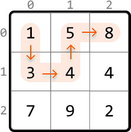
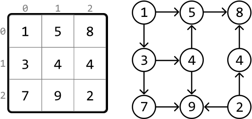
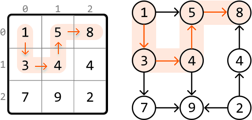
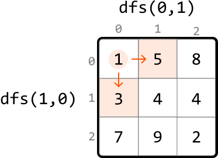
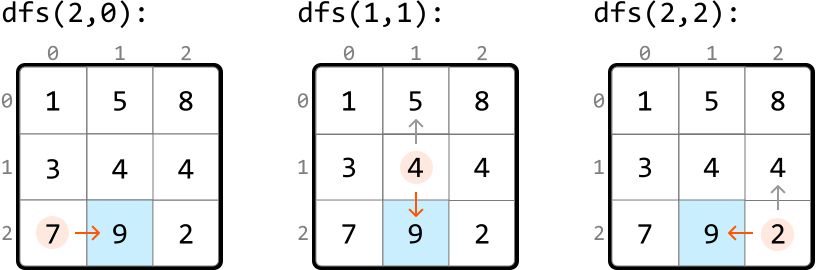

# Longest Increasing Path

Find the **longest strictly increasing path** in a matrix of positive integers. A path is a sequence of cells where each one is 4-directionally adjacent (up, down, left, or right) to the previous one.

#### Example:



```python
Output: 5

```

## Intuition

In this problem, we’re tasked with finding the longest strictly increasing path. Note, “strictly” means the path cannot include any two cells of equal value.

From any cell, we can move to a neighboring cell if that neighbor has a larger value than the current cell. We can map this relationship between cells as nodes in a graph, with edges representing moves from one cell to a higher-value neighboring cell:



Upon closer inspection, we notice this is a **directed acyclic graph** (DAG). Let’s break down what this means:

- The graph is directed because we can go from a smaller cell to a larger one, but not the other way around.

- The graph is acyclic because it’s not possible to return to a smaller, previous value in the path because the path only extends to larger cells.

This highlights that finding the longest increasing path in a matrix is effectively the same as **finding the longest path in a DAG**.



With this in mind, let’s figure out how to traverse the matrix.

**Traversing the matrix**

One strategy is to find the length of the longest path that starts at each cell and return the maximum of these lengths. To do this, we need a way to explore all paths which extend from each cell, and return the longest one. Many traversal algorithms allow us to do this. In this explanation, we use DFS since it has a slightly simpler implementation for finding the longest path.

---

Let’s see how this works over an example. Start by performing DFS at the first cell, (0, 0):


---

To determine the longest path starting from this cell, we need to explore its higher-value neighboring cells. By making a DFS call to each of these larger neighbors, we can find the lengths of the paths that start from them:



The largest path starting at cell (0, 0) will be equal to whichever of these DFS calls returns a larger path, plus 1 to include cell (0, 0) itself.

Note that since this matrix resembles a DAG, **we don’t need to mark cells as visited**, since it’s not possible to cycle back to previously visited cells.

---

The pseudocode for finding the length of the longest path starting at a given cell is provided below:

```python
def dfs(cell):
    max_path = 1
    for each neighbor of the current cell:
        if value of neighbor > value of cell:
            max_path = max(max_path, dfs(neighbor) + 1)
    return max_path

```

To get the final result, we just need to call DFS for every cell in the matrix, ensuring we find the lengths of the longest paths starting from each cell. The maximum of these lengths is equal to the length of the longest increasing path.

---

An important thing to notice is that it’s possible for DFS to be called on the same cell multiple times. We can see this below, where we call DFS on cell (2, 1) on three different occasions:



After we first calculate the longest path starting at a certain cell, we don’t need to calculate it again for that cell. This suggests we should use **memoization**: by storing the DFS result of each cell, we can just return the saved result whenever a DFS call is made to that cell again.

## Implementation

```python
from typing import List
    
def longest_increasing_path(matrix: List[List[int]]) -> int:
    if not matrix:
        return 0
    res = 0
    m, n = len(matrix), len(matrix[0])
    memo = [[0] * n for _ in range(m)]
    # Find the longest increasing path starting at each cell. The maximum of these is
    # equal to the overall longest increasing path.
    for r in range(m):
        for c in range(n):
            res = max(res, dfs(r, c, matrix, memo))
    return res
    
def dfs(r: int, c: int, matrix: List[List[int]], memo: List[List[int]]):
    if memo[r][c] != 0:
        return memo[r][c]
    max_path = 1
    dirs = [(-1, 0), (1, 0), (0, -1), (0, 1)]
    # The longest path starting at the current cell is equal to the longest path of
    # its larger neighboring cells, plus 1.
    for d in dirs:
        next_r, next_c = r + d[0], c + d[1]
        if is_within_bounds(next_r, next_c, matrix) and matrix[next_r][next_c] > matrix[r][c]:
            max_path = max(max_path, 1 + dfs(next_r, next_c, matrix, memo))
    memo[r][c] = max_path
    return max_path
    
def is_within_bounds(r: int, c: int, matrix: List[List[int]]) -> bool:
    return 0 <= r < len(matrix) and 0 <= c < len(matrix[0])

```

```javascript
export function longest_increasing_path(matrix) {
  if (!matrix || matrix.length === 0) return 0
  const m = matrix.length
  const n = matrix[0].length
  const memo = Array.from({ length: m }, () => Array(n).fill(0))
  let res = 0
  // Find the longest increasing path starting at each cell. The maximum of these is
  // equal to the overall longest increasing path.
  for (let r = 0; r < m; r++) {
    for (let c = 0; c < n; c++) {
      res = Math.max(res, dfs(r, c, matrix, memo))
    }
  }
  return res
}

function dfs(r, c, matrix, memo) {
  if (memo[r][c] !== 0) return memo[r][c]
  let maxPath = 1
  const dirs = [
    [-1, 0],
    [1, 0],
    [0, -1],
    [0, 1],
  ]
  // The longest path starting at the current cell is equal to the longest path of
  // its larger neighboring cells, plus 1.
  for (const [dr, dc] of dirs) {
    const nextR = r + dr
    const nextC = c + dc
    if (
      isWithinBounds(nextR, nextC, matrix) &&
      matrix[nextR][nextC] > matrix[r][c]
    ) {
      maxPath = Math.max(maxPath, 1 + dfs(nextR, nextC, matrix, memo))
    }
  }
  memo[r][c] = maxPath
  return maxPath
}

function isWithinBounds(r, c, matrix) {
  return r >= 0 && r < matrix.length && c >= 0 && c < matrix[0].length
}

```

```java
import java.util.ArrayList;

public class Main {
    public int longest_increasing_path(ArrayList<ArrayList<Integer>> matrix) {
        if (matrix == null || matrix.isEmpty()) return 0;
        int m = matrix.size();
        int n = matrix.get(0).size();
        int res = 0;
        int[][] memo = new int[m][n];
        // Find the longest increasing path starting at each cell. The maximum of these is
        // equal to the overall longest increasing path.
        for (int r = 0; r < m; r++) {
            for (int c = 0; c < n; c++) {
                res = Math.max(res, dfs(r, c, matrix, memo));
            }
        }
        return res;
    }

    private int dfs(int r, int c, ArrayList<ArrayList<Integer>> matrix, int[][] memo) {
        if (memo[r][c] != 0) return memo[r][c];
        int maxPath = 1;
        int[][] dirs = { {-1, 0}, {1, 0}, {0, -1}, {0, 1} };
        // The longest path starting at the current cell is equal to the longest path of
        // its larger neighboring cells, plus 1.
        for (int[] dir : dirs) {
            int nextR = r + dir[0];
            int nextC = c + dir[1];
            if (isWithinBounds(nextR, nextC, matrix) &&
                matrix.get(nextR).get(nextC) > matrix.get(r).get(c)) {
                maxPath = Math.max(maxPath, 1 + dfs(nextR, nextC, matrix, memo));
            }
        }
        memo[r][c] = maxPath;
        return maxPath;
    }

    private boolean isWithinBounds(int r, int c, ArrayList<ArrayList<Integer>> matrix) {
        return r >= 0 && r < matrix.size() && c >= 0 && c < matrix.get(0).size();
    }
}

```

### Complexity Analysis

**Time complexity:** The time complexity of `longest_increasing_path` is O(m· n) where m denotes the number of rows, and n denotes the number of columns. This is because each cell of the matrix is visited at most twice: once in the `longest_increasing_path` function, and during DFS where each cell is visited at most once due to memoization.

**Space complexity:** The space complexity is O(m· n) primarily due to the recursive call stack during DFS, and the memoization table, both of which can grow to m· n in size.