# Shortest Transformation Sequence

Given two words, `start` and `end`, and a dictionary containing an array of words, return the **length of the shortest transformation sequence** to transform start to end. A transformation sequence is a series of words in which:

- Each word differs from the preceding word by exactly one letter.

- Each word in the sequence exists in the dictionary.

If no such transformation sequence exists, return 0.

#### Example:

```python
Input: start = 'red', end = 'hit',
       dictionary = [
            'red', 'bed', 'hat', 'rod', 'rad', 'rat', 'hit', 'bad', 'bat'
       ]
Output: 5

```

### Constraints:

- All words are the same length.

- All words contain only lowercase English letters.

- The dictionary contains no duplicate words.

## Intuition

In a transformation sequence, each transformation involves changing one letter of a word to get another word. Consider the following example:

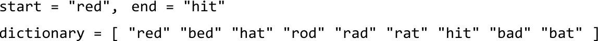

We know our transformation sequence should start with the word “red”, but how can we identify subsequent words in the sequence? The words that could immediately follow “red” are “bed”, “rad”, or “rod”, since each differs from “red” by one letter:

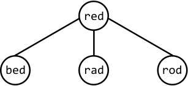

Similarly, we can make a direct connection between each word and its one-letter-off neighbors:

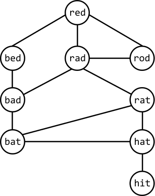

This structure resembles a graph, indicating that finding the shortest transformation sequence involves finding the shortest path in this graph from the start node (“red”) to the end node (“hit”):

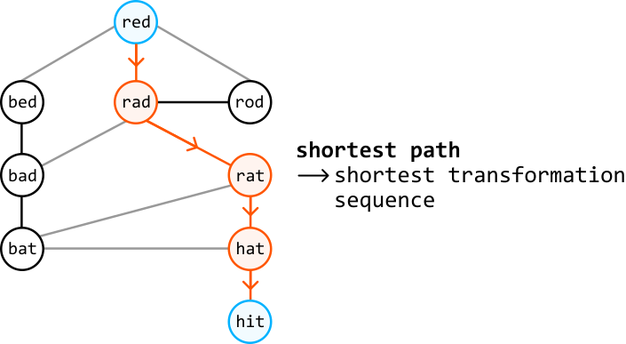

**Finding the shortest path**

When tasked with a graph problem that involves finding the shortest path between two nodes, BFS should come to mind. From the start node, BFS works by exploring all neighbors at a distance of 1 from the start node, followed by exploring nodes at a distance of 2, and so on. This means that once we find the end node, we’ve reached it via the shortest possible distance.

So, let’s use **level-order traversal**, a variant of BFS, to find the shortest path in this graph, where each level we traverse represents nodes that are a specific distance from the start node:

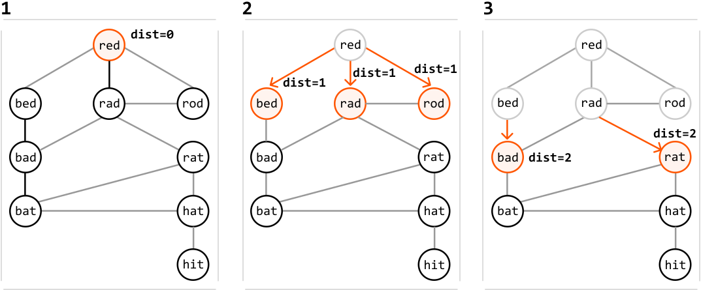

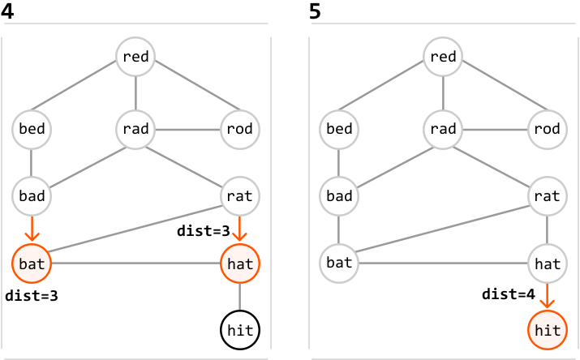

As we can see, we managed to find the end node via the shortest path. To return the length of this path, we return dist, plus 1, to include the start node. If you’re unfamiliar with how level-order traversal works, review the *Matrix Infection* problem in this chapter.

Note that during traversal, we need to ensure we don’t revisit previously traversed strings. By storing the visited strings in a **hash set**, we can quickly check if a string was already visited.

Now, let’s figure out how to build the above graph.

**Building the graph**

We can represent the graph as an adjacency list, where each word has a list of all of its neighboring words:

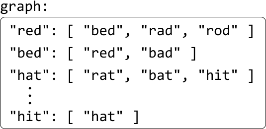

The challenge here is finding each word’s neighbors. Consider the word “red”. One way we can identify all words that are one letter different from “red” is to generate all possible words by changing each letter in “red” to every other letter in the alphabet. For each of these generated words, we check if it exists in the dictionary. If it does, it’s a neighbor of “red”:

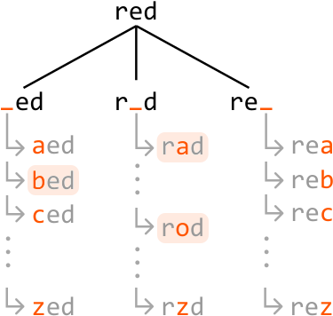

To make checking the dictionary more efficient, we can store the words from the dictionary in a hash set, enabling us to verify the existence of a word in constant time.

Note that before we build the graph, it’s important to check if start or end exists in the dictionary. If either is missing, we can immediately return 0, since each word in the sequence needs to be in the dictionary.

**Space optimization**

The purpose of the above adjacency list is to facilitate graph traversal. However, we can avoid building it altogether by leveraging the fact that each word in the dictionary is only visited once during the BFS traversal, indicating we only ever need access to the neighbors of each word once.

If we had a way to generate each word’s neighbors when needed during BFS traversal, we could avoid creating the adjacency list, and save some space that would otherwise be taken up by it.

## Implementation

```python
def shortest_transformation_sequence(start: str, end: str, dictionary: List[str]) -> int:
    dictionary_set = set(dictionary)
    if start not in dictionary_set or end not in dictionary_set:
        return 0
    if start == end:
        return 1
    lower_case_alphabet = 'abcdefghijklmnopqrstuvwxyz'
    queue = deque([start])
    visited = set([start])
    dist = 0
    # Use level-order traversal to find the shortest path from the start word to the
    # end word.
    while queue:
        for _ in range(len(queue)):
            curr_word = queue.popleft()
            # If we found the end word, we've reached it via the shortest path.
            if curr_word == end:
                return dist + 1
            # Generate all possible words that have a one-letter difference to the
            # current word.
            for i in range(len(curr_word)):
                for c in lower_case_alphabet:
                    next_word = curr_word[:i] + c + curr_word[i+1:]
                    # If 'next_word' exists in the dictionary, it's a neighbor of the
                    # current word. If it's unvisited, add it to the queue to be
                    # processed in the next level.
                    if next_word in dictionary_set and next_word not in visited:
                        visited.add(next_word)
                        queue.append(next_word)
        dist += 1
    # If there is no way to reach the end node, then no path exists.
    return 0

```

```javascript
export function shortest_transformation_sequence(start, end, dictionary) {
  const dictionarySet = new Set(dictionary)
  if (!dictionarySet.has(start) || !dictionarySet.has(end)) return 0
  if (start === end) return 1
  const lowerCaseAlphabet = 'abcdefghijklmnopqrstuvwxyz'
  const queue = [start]
  const visited = new Set([start])
  let dist = 0
  // Use level-order traversal to find the shortest path from the start word to the
  // end word.
  while (queue.length > 0) {
    const levelSize = queue.length
    for (let i = 0; i < levelSize; i++) {
      const currWord = queue.shift()
      // If we found the end word, we've reached it via the shortest path.
      if (currWord === end) {
        return dist + 1
      }
      // Generate all possible words that have a one-letter difference to the
      // current word.
      for (let j = 0; j < currWord.length; j++) {
        for (const c of lowerCaseAlphabet) {
          const nextWord = currWord.slice(0, j) + c + currWord.slice(j + 1)
          // If 'next_word' exists in the dictionary, it's a neighbor of the
          // current word. If it's unvisited, add it to the queue to be
          // processed in the next level.
          if (dictionarySet.has(nextWord) && !visited.has(nextWord)) {
            visited.add(nextWord)
            queue.push(nextWord)
          }
        }
      }
    }
    dist++
  }
  // If there is no way to reach the end node, then no path exists.
  return 0
}

```

```java
import java.util.ArrayList;
import java.util.HashSet;
import java.util.LinkedList;
import java.util.Queue;
import java.util.Set;

public class Main {
    public static int shortest_transformation_sequence(String start, String end, ArrayList<String> dictionary) {
        Set<String> dictionarySet = new HashSet<>(dictionary);
        if (!dictionarySet.contains(start) || !dictionarySet.contains(end)) {
            return 0;
        }
        if (start.equals(end)) {
            return 1;
        }
        String lowerCaseAlphabet = "abcdefghijklmnopqrstuvwxyz";
        Queue<String> queue = new LinkedList<>();
        Set<String> visited = new HashSet<>();
        int dist = 0;
        queue.offer(start);
        visited.add(start);
        // Use level-order traversal to find the shortest path from the start word to the
        // end word.
        while (!queue.isEmpty()) {
            int size = queue.size();
            for (int i = 0; i < size; i++) {
                String currWord = queue.poll();
                // If we found the end word, we've reached it via the shortest path.
                if (currWord.equals(end)) {
                    return dist + 1;
                }
                // Generate all possible words that have a one-letter difference to the
                // current word.
                for (int j = 0; j < currWord.length(); j++) {
                    for (char c : lowerCaseAlphabet.toCharArray()) {
                        String nextWord = currWord.substring(0, j) + c + currWord.substring(j + 1);

                        // If 'next_word' exists in the dictionary, it's a neighbor of the
                        // current word. If it's unvisited, add it to the queue to be
                        // processed in the next level.
                        if (dictionarySet.contains(nextWord) && !visited.contains(nextWord)) {
                            visited.add(nextWord);
                            queue.offer(nextWord);
                        }
                    }
                }
            }
            dist++;
        }
        // If there is no way to reach the end node, then no path exists.
        return 0;
    }
}

```

### Complexity Analysis

**Time complexity:** The time complexity of shortest_transformation_sequence is O(n· L^2), where n denotes the number of words in the dictionary, and L denotes the length of a word. Here’s why:

- Creating a hash set containing all the words in the dictionary takes O(n· L) time, because hashing each of the n words takes O(L) time.

- Level-order traversal processes at most n words from the dictionary. At each of these words, we generate up to 26L transformations, and it takes O(L) time to check if a transformation exists in the `visited` and `dictionary_set` hash sets, and to enqueue it. This means level-order traversal takes approximately O(n· 26L· L)=O(n· L^2) time.

Therefore, the overall time complexity is O(n· L)+O(n· L^2)=O(n· L^2).

**Space complexity:** The space complexity is O(n· L), taken up by the `dictionary_set` hash set, the `visited` hash set, and the `queue`.

## Optimization - Bidirectional Traversal

An important observation is that we don’t necessarily need to begin level-order traversal at the start word: we can also start a search at the end word. In fact, we can combine these by performing them simultaneously to find the shortest path. This is known as bidirectional BFS, or in this case, bidirectional level-order traversal.

When we perform two searches, one from start and one from end, the idea is that they will meet in the middle if a path between these two words exists. If a path doesn’t exist, the searches will never meet, indicating that a transformation sequence does not exist.

This optimization allows us to identify the shortest distance more quickly. We can see in the example below that regular level-order traversal ends up traversing through more nodes than in the bidirectional traversal, while also requiring 4 iterations instead of 2.

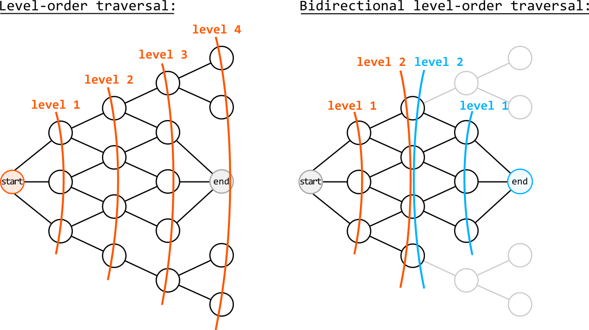

To simulate this process, we **alternate between the two level-order traversals and progress through each search one level at a time**:

- Start traversal: progress one level in the traversal that started from the start node

- End traversal: progress one level in the traversal that started from the end node

We alternate between these two steps until a node visited in one search has already been visited in the other search, indicating that the traversals have met. Here’s what this alternating process looks like:

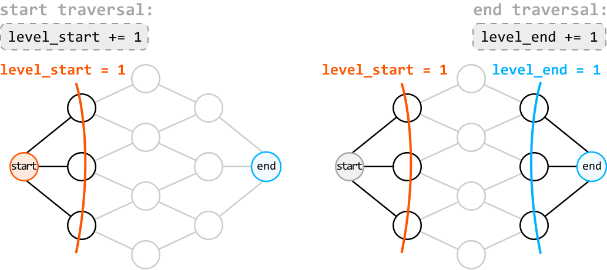

---

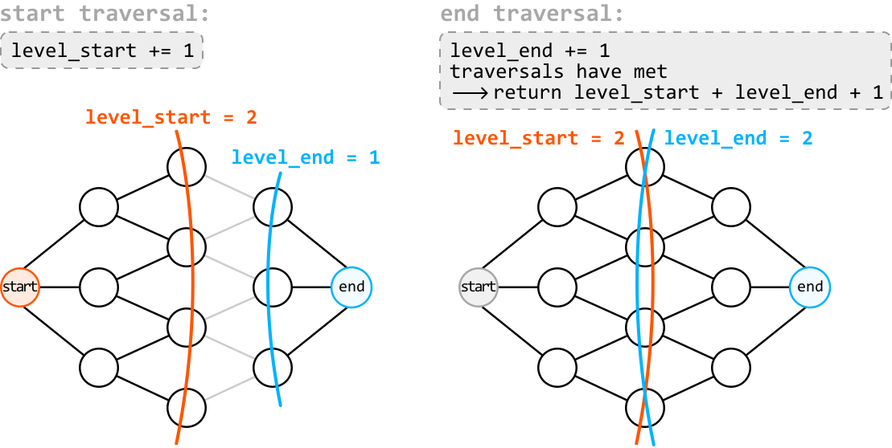

To check if a node has already been visited by the other traversal, we can query the visited hash set used by the other traversal. If a word exists in the visited hash set of the other traversal, we know the searches have met.

## Implementation - Bidirectional Traversal

```python
from typing import List
from collections import deque
    
def shortest_transformation_sequence_optimized(start: str, end: str, dictionary: List[str]) -> int:
    dictionary_set = set(dictionary)
    if start not in dictionary_set or end not in dictionary_set:
        return 0
    if start == end:
        return 1
    start_queue = deque([start])
    start_visited = {start}
    end_queue = deque([end])
    end_visited = {end}
    level_start = level_end = 0
    # Perform a level-order traversal from the start word and another from the end
    # word.
    while start_queue and end_queue:
        # Explore the next level of the traversal that starts from the start word. If
        # it meets the other traversal, the shortest path between 'start' and 'end'
        # has been found.
        level_start += 1
        if explore_level(start_queue, start_visited, end_visited, dictionary_set):
            return level_start + level_end + 1
        # Explore the next level of the traversal that starts from the end word.
        level_end += 1
        if explore_level(end_queue, end_visited, start_visited, dictionary_set):
            return level_start + level_end + 1
    # If the traversals never met, then no path exists.
    return 0
    
# This function explores the next level in the level-order traversal and checks if
# two searches meet.
def explore_level(queue, visited, other_visited, dictionary_set) -> bool:
    lower_case_alphabet = 'abcdefghijklmnopqrstuvwxyz'
    for _ in range(len(queue)):
        current_word = queue.popleft()
        for i in range(len(current_word)):
            for c in lower_case_alphabet:
                next_word = current_word[:i] + c + current_word[i+1:]
                # If 'next_word' has been visited during the other traversal, it means
                # both searches have met.
                if next_word in other_visited:
                    return True
                if next_word in dictionary_set and next_word not in visited:
                    visited.add(next_word)
                    queue.append(next_word)
    # If no word has been visited by the other traversal, the searches have not met
    # yet.
    return False

```

```javascript
export function shortest_transformation_sequence_optimized(
  start,
  end,
  dictionary
) {
  const dictionarySet = new Set(dictionary)
  if (!dictionarySet.has(start) || !dictionarySet.has(end)) return 0
  if (start === end) return 1
  const startQueue = [start]
  const endQueue = [end]
  const startVisited = new Set([start])
  const endVisited = new Set([end])
  let levelStart = 0
  let levelEnd = 0
  while (startQueue.length && endQueue.length) {
    levelStart++
    if (exploreLevel(startQueue, startVisited, endVisited, dictionarySet)) {
      return levelStart + levelEnd + 1
    }
    levelEnd++
    if (exploreLevel(endQueue, endVisited, startVisited, dictionarySet)) {
      return levelStart + levelEnd + 1
    }
  }
  return 0
}

function exploreLevel(queue, visited, otherVisited, dictionarySet) {
  const lowerCaseAlphabet = 'abcdefghijklmnopqrstuvwxyz'
  const levelSize = queue.length
  for (let i = 0; i < levelSize; i++) {
    const currentWord = queue.shift()
    for (let j = 0; j < currentWord.length; j++) {
      for (const c of lowerCaseAlphabet) {
        const nextWord = currentWord.slice(0, j) + c + currentWord.slice(j + 1)
        if (otherVisited.has(nextWord)) {
          return true
        }
        if (dictionarySet.has(nextWord) && !visited.has(nextWord)) {
          visited.add(nextWord)
          queue.push(nextWord)
        }
      }
    }
  }
  return false
}

```

```java
import java.util.*;

public class Main {
    public static int shortest_transformation_sequence(String start, String end, ArrayList<String> dictionary) {
        Set<String> dictionarySet = new HashSet<>(dictionary);
        if (!dictionarySet.contains(start) || !dictionarySet.contains(end)) {
            return 0;
        }
        if (start.equals(end)) {
            return 1;
        }
        Queue<String> startQueue = new LinkedList<>();
        Set<String> startVisited = new HashSet<>();
        startQueue.add(start);
        startVisited.add(start);
        Queue<String> endQueue = new LinkedList<>();
        Set<String> endVisited = new HashSet<>();
        endQueue.add(end);
        endVisited.add(end);
        int levelStart = 0;
        int levelEnd = 0;
        // Perform a level-order traversal from the start word and another from the end word.
        while (!startQueue.isEmpty() && !endQueue.isEmpty()) {
            // Explore the next level of the traversal that starts from the start word.
            // If it meets the other traversal, the shortest path between 'start' and 'end' has been found.
            levelStart++;
            if (exploreLevel(startQueue, startVisited, endVisited, dictionarySet)) {
                return levelStart + levelEnd + 1;
            }
            // Explore the next level of the traversal that starts from the end word.
            levelEnd++;
            if (exploreLevel(endQueue, endVisited, startVisited, dictionarySet)) {
                return levelStart + levelEnd + 1;
            }
        }
        // If the traversals never met, then no path exists.
        return 0;
    }

    // This function explores the next level in the level-order traversal and checks if two searches meet.
    private static boolean exploreLevel(Queue<String> queue, Set<String> visited, Set<String> otherVisited, Set<String> dictionarySet) {
        String lowerCaseAlphabet = "abcdefghijklmnopqrstuvwxyz";
        int size = queue.size();
        for (int i = 0; i < size; i++) {
            String currentWord = queue.poll();
            for (int j = 0; j < currentWord.length(); j++) {
                for (int k = 0; k < lowerCaseAlphabet.length(); k++) {
                    char c = lowerCaseAlphabet.charAt(k);
                    String nextWord = currentWord.substring(0, j) + c + currentWord.substring(j + 1);
                    // If 'nextWord' has been visited during the other traversal, it means both searches have met.
                    if (otherVisited.contains(nextWord)) {
                        return true;
                    }
                    if (dictionarySet.contains(nextWord) && !visited.contains(nextWord)) {
                        visited.add(nextWord);
                        queue.add(nextWord);
                    }
                }
            }
        }
        // If no word has been visited by the other traversal, the searches have not met yet.
        return false;
    }
}

```

### Complexity Analysis

**Time complexity:** The time complexity of `shortest_transformation_sequence_optimized` is O(n· L^2), since we’re performing two level-order traversals. Note that this is more efficient in practice since there are potentially fewer nodes to traverse when using bidirectional traversal.

**Space complexity:** The space complexity is O(n· L), taken up by the `dictionary_set` hash set, the visited hash sets, and both queues.