# Merging Communities

There are `n` people numbered from `0` to `n - 1` , with each person initially belonging to a separate community. When two people from different communities connect, their communities merge into a single community.

Your goal is to write two functions:

- `connect(x: int, y: int) -> None`: Connects person `x` with person `y` and merges their communities.

- `get_community_size(x: int) -> int`: Returns the size of the community which person `x` belongs to.

#### Example:

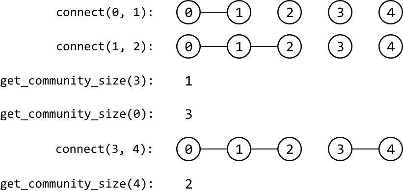

```python
Input: n = 5,
       [
         connect(0, 1),
         connect(1, 2),
         get_community_size(3),
         get_community_size(0),
         connect(3, 4),
         get_community_size(4),
       ]
Output: [1, 3, 2]

```

## Intuition

In this problem, we start with `n` individuals, each in their own separate community. As we connect pairs of individuals, their respective communities merge. The challenge is to efficiently manage these connections and quickly determine the size of the community for any given individual.

This is where the **Union-Find** data structure, also known as the Disjoint Set Union (DSU) data structure, comes in. Union-Find consists of two operations:

- **Union**: takes two elements from different sets and makes them part of the same set.

- **Find**: determines what set an element belongs to.

In the context of this problem, the `union` operation can be used to merge the communities of two people, while the `find` operation can be used to determine which community a person belongs to. To make this work, we need a way to represent each community. For example, let’s say there are 5 people, with persons 0 and 1 in one community, and persons 2, 3, and 4 in another:

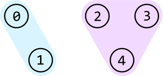

One way to distinguish between them is to designate a representative for each community. Let's assign person 0 as the representative of the left community, and person 2 as the representative of the right community. We can represent these communities as a graph, where each community is a connected component, and each person in a community points to their representative:

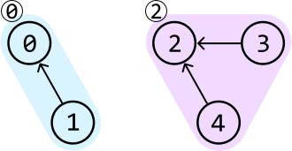

This can be reflected using a parent array, where `parent[i]` stores the parent of person `i`. This parent array is discussed later.

Now that we have a way to represent communities, let’s discuss how the `union` and `find` functions would work in more detail.

**Union**

Consider the previous example of 5 people. Let’s say we want to connect persons 1 and 4 (i.e., `union(1, 4)`):

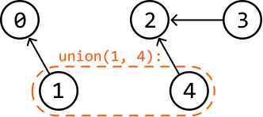

We first need to identify their representatives so we know which communities these two people belong to. We can use the `find` function for this, which will be discussed later:

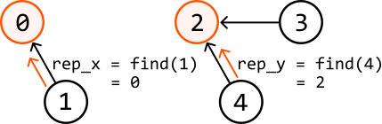

Before merging these communities, we need to pick one of the two current representatives as the representative of the merged community. For now, let’s just pick person 0.

From here, one strategy is to connect everyone in the second community directly to person 0:

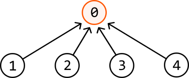

This would require individually setting the parent of all these people to person 0, which can be quite expensive if the community has many people. A more efficient strategy is to just connect the representative of this community, person 2, to person 0.

In code, this is done by setting the parent of `rep_y` to be `rep_x` (`parent[rep_y] = rep_x`):

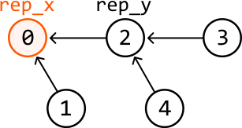

This way, everyone originally in the second community is indirectly connected to person 0, making person 0 the representative of all nodes.

Note that if rep_x and rep_y are the same person, then they belong to the same community, in which case we don’t need to merge anything.

**Find**

The `find` function should return the representative of the community a person is in:

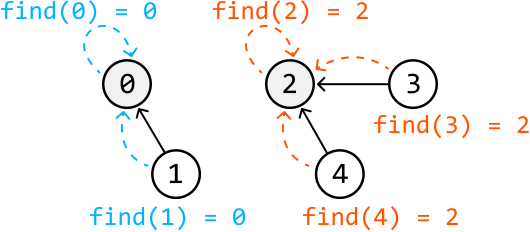

At this point, it's important to note the difference between a parent and a representative:

- A representative is the person who represents the community. This is effectively the “root” node of the community.

- A parent of a person is the node that person is pointing to.

For example, in the community below, we see that person 0's parent is person 1, whereas person 0’s representative is person 2:

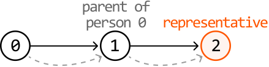

We can implement the `find(x)` function by traversing `x`’s parent chain until we reach the representative. **The representative is the person whose parent is themselves**, so we can identify them by checking if the current person is their own parent. The code snippet for this is provided below.

```python
def find(x: int) -> int:
    # If x is equal to its parent, we found the representative.
    if x == parent[x]:
        return x
    # Otherwise, continue traversing through x's parent chain.
    return find(parent[x])

```

```javascript
function find(x) {
  // If x is equal to its parent, we found the representative.
  if (parent[x] === x) {
    return x
  }
  // Otherwise, continue traversing through x's parent chain.
  return find(parent[x])
}

```

```java
public int find(int x) {
   // If x is equal to its parent, we found the representative.
   if (x == parent[x]) {
       return x;
   }
   // Otherwise, continue traversing through x's parent chain.
   return find(parent[x]);
}

```

Now we’ve discussed both the `union` and the `find` function, let’s discuss what optimizations can be made to them.

**Union by size**

Recall that before merging two communities, we need to pick someone to represent the merged community. Our choice is between `rep_x` and `rep_y`. Is one a better choice than the other? Consider the following two communities:

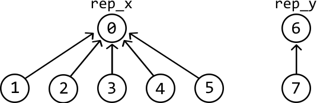

Let's see what the difference is when we pick `rep_x` to be the representative versus picking `rep_y`:

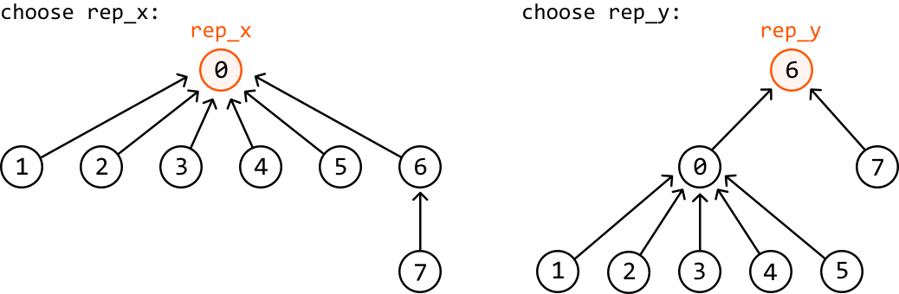

As we can see, when we choose a representative from one of two communities, the people in the other community have a longer distance to their new representative, with the distance increased by 1. Therefore, it’s better to **pick the representative from the larger community,** so that only the people from the smaller community are impacted by this adjusted distance.

This optimization requires a way to determine the size of a community. We can do this using a size array, where `size[i]` is the size of the community represented by person `i`. The code for this can be seen below:

```python
def union(x: int, y: int) -> None:
   rep_x, rep_y = find(x), find(y)
   if rep_x != rep_y:
       # If 'rep_x' represents a larger community, connect 'rep_y's community to it.
       if size[rep_x] > size[rep_y]:
           parent[rep_y] = rep_x
           size[rep_x] += size[rep_y]
       # If 'rep_y' represents a larger community, or both communities are of the same
       # size, connect 'rep_x's community to it.
       else:
           parent[rep_x] = rep_y
           size[rep_y] += size[rep_x]

```

```javascript
function union(x, y) {
  const repX = find(x)
  const repY = find(y)
  if (repX !== repY) {
    // If 'repX' represents a larger community, connect 'repY's community to it.
    if (size[repX] > size[repY]) {
      parent[repY] = repX
      size[repX] += size[repY]
    }
    // If 'repY' represents a larger community, or both are the same size,
    // connect 'repX's community to it.
    else {
      parent[repX] = repY
      size[repY] += size[repX]
    }
  }
}

```

```java
public void union(int x, int y) {
    int repX = find(x);
    int repY = find(y);
    if (repX != repY) {
        // If 'repX' represents a larger community, connect 'repY's community to it.
        if (size[repX] > size[repY]) {
            parent[repY] = repX;
            size[repX] += size[repY];
        }
        // If 'repY' represents a larger community, or both are the same size,
        // connect 'repX's community to it.
        else {
            parent[repX] = repY;
            size[repY] += size[repX];
        }
    }
}

```

A similar optimization to union by size is union by rank, which optimizes the `union` function in a very similar way [[1]](https://en.wikipedia.org/wiki/Disjoint-set_data_structure#Union_by_rank).

Note that the `size` array makes the implementation of **`get_community_size`**`(x)` quite straightforward: we just return the size of x’s representative (i.e., return `size[find(x)]`).

**Path compression**

There’s another major optimization that can be made. Consider the following community, with person 0 as the representative. The further down we go in this diagram, the further away the people are from the representative. We can see this for persons 3 and 6, for example:

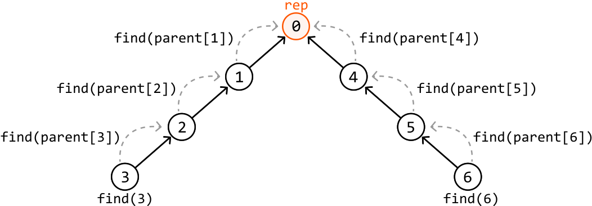

What’s important to realize is that performing `find(3)` and `find(6)` will not only return the representative to persons 3 and 6, but it will also cause it to be returned by all the other nodes in their parent chains because this is a recursive function:

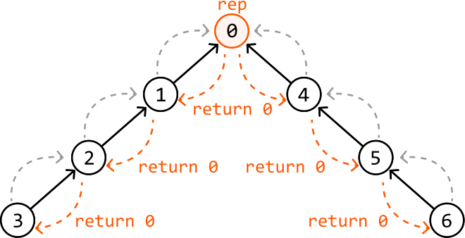

This means every person in their parent chains also knows their representative is person 0. So, if we update the parent of each of these people to person 0 in the `find` function, all the nodes in this chain will connect to the representative. This technique is known as path compression, and it allows us to flatten the graph:

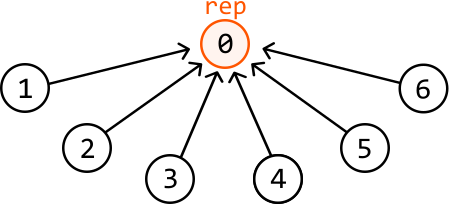

The code for this optimization is provided below:

```python
def find(x: int) -> int:
    if x == parent[x]:
        return x
    # Path compression: updates the representative of x, flattening the structure of
    # the community as we go.
    parent[x] = find(parent[x])
    return parent[x]

```

```javascript
function find(x) {
  if (x === parent[x]) {
    return x
  }
  // Path compression: updates the representative of x, flattening the structure of
  // the community as we go.
  parent[x] = find(parent[x])
  return parent[x]
}

```

```java
public int find(int x) {
   if (x == parent[x]) {
       return x;
   }
   // Path compression: updates the representative of x, flattening the structure of
   // the community as we go.
   parent[x] = find(parent[x]);
   return parent[x];
}

```

This path compression optimization allows us to restructure the graph at every `find` call, effectively reducing the distance between people and their representative, and making future `find` calls more efficient.

## Implementation

Below is the implementation of the Union-Find data structure.

```python
class UnionFind:
    def __init__(self, size: int):
        self.parent = [i for i in range(size)]
        self.size = [1] * size
   
    def union(self, x: int, y: int) -> None:
        rep_x, rep_y = self.find(x), self.find(y)
        if rep_x != rep_y:
            # If 'rep_x' represents a larger community, connect 'rep_y's community to
            # it.
            if self.size[rep_x] > self.size[rep_y]:
                self.parent[rep_y] = rep_x
                self.size[rep_x] += self.size[rep_y]
            # Otherwise, connect 'rep_x's community to 'rep_y'.
            else:
                self.parent[rep_x] = rep_y
                self.size[rep_y] += self.size[rep_x]
   
    def find(self, x: int) -> int:
        if x == self.parent[x]:
            return x
        self.parent[x] = self.find(self.parent[x]) # Path compression.
        return self.parent[x]
   
    def get_size(self, x: int) -> int:
        return self.size[self.find(x)]

```

```javascript
class UnionFind {
  constructor(size) {
    this.parent = Array.from({ length: size }, (_, i) => i)
    this.size = Array(size).fill(1)
  }

  union(x, y) {
    const repX = this.find(x)
    const repY = this.find(y)

    if (repX !== repY) {
      // If 'repX' represents a larger community, connect 'repY's community to it.
      if (this.size[repX] > this.size[repY]) {
        this.parent[repY] = repX
        this.size[repX] += this.size[repY]
      }
      // Otherwise, connect 'repX's community to 'repY'.
      else {
        this.parent[repX] = repY
        this.size[repY] += this.size[repX]
      }
    }
  }

  find(x) {
    if (x === this.parent[x]) {
      return x
    }
    // Path compression: flatten the structure as we go.
    this.parent[x] = this.find(this.parent[x])
    return this.parent[x]
  }

  getSize(x) {
    return this.size[this.find(x)]
  }
}

```

```java
class UnionFind {
    private int[] parent;
    private int[] size;

    public UnionFind(int n) {
        parent = new int[n];
        size = new int[n];
        // Initialize each element to be its own parent and size to 1.
        for (int i = 0; i < n; i++) {
            parent[i] = i;
            size[i] = 1;
        }
    }

    public void union(int x, int y) {
        int repX = find(x);
        int repY = find(y);
        if (repX != repY) {
            // If 'repX' represents a larger community, connect 'repY's community to it.
            if (size[repX] > size[repY]) {
                parent[repY] = repX;
                size[repX] += size[repY];
            }
            // Otherwise, connect 'repX's community to 'repY'.
            else {
                parent[repX] = repY;
                size[repY] += size[repX];
            }
        }
    }

    public int find(int x) {
        if (x == parent[x]) {
            return x;
        }
        // Path compression.
        parent[x] = find(parent[x]);
        return parent[x];
    }

    public int getSize(int x) {
        return size[find(x)];
    }
}

```

Below is the implementation of the main problem using the above Union-Find data structure:

```python
class MergingCommunities:
    def __init__(self, n: int):
        self.uf = UnionFind(n)
   
    def connect(self, x: int, y: int) -> None:
        self.uf.union(x, y)
   
    def get_community_size(self, x: int) -> int:
        return self.uf.get_size(x)

```

```javascript
export class MergingCommunities {
  constructor(n) {
    this.uf = new UnionFind(n)
  }

  connect(x, y) {
    this.uf.union(x, y)
  }

  get_community_size(x) {
    return this.uf.getSize(x)
  }
}

```

```java
class MergingCommunities {
    private UnionFind uf;

    public MergingCommunities(int n) {
        uf = new UnionFind(n);
    }

    public void connect(Integer x, Integer y) {
        uf.union(x, y);
    }

    public Integer getCommunitySize(Integer x) {
        return uf.getSize(x);
    }
}

```

### Complexity Analysis

**Time complexity:** Let’s break down the time complexity of the Union-Find functions:

- With the path compression and union by size optimizations, `find` has a time complexity of amortized O(1)[1](#user-content-fn-1) because the branches of the graph become very short over time, making the function effectively constant-time in most cases.

- Since `union` just uses the `find` function twice, it also has a time complexity of amortized O(1).

- Since `get_size` just uses the `find` function once, it also has a time complexity of amortized O(1).

Therefore, the time complexities of connect and `get_community_size` are both amortized O(1). The time complexity of the constructor is O(n) because we initialize two arrays of size n when creating the `UnionFind` object.

**Space complexity:** The space complexity is O(n) because the Union-Find data structure has two arrays of size n: `parent` and `size`. The space taken up by the recursive call stack is amortized O(1) since the branches of the graph become very short over time, resulting in fewer recursive calls made to the `find` function.

## Footnotes

- We can also write the time complexity here as O(α(n)), where α(n) is the inverse Ackermann function, which grows extremely slowly but is not constant. [↩](#user-content-fnref-1)