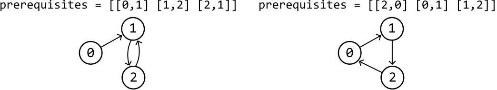
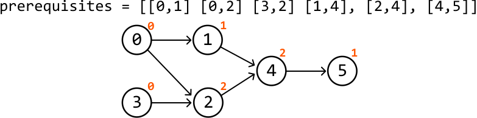
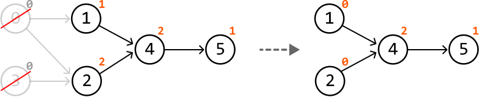
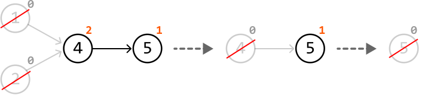
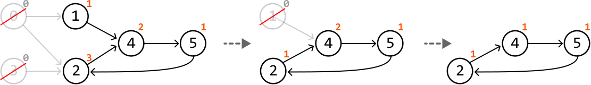
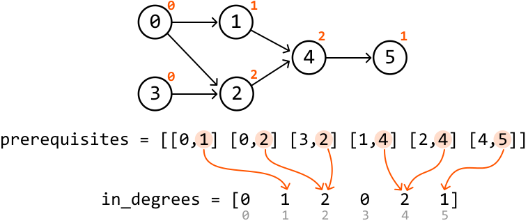
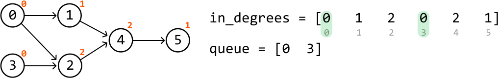
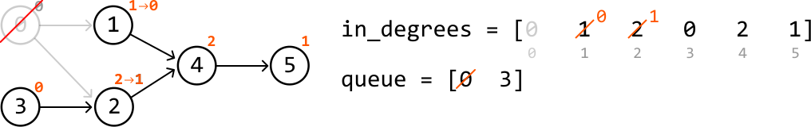
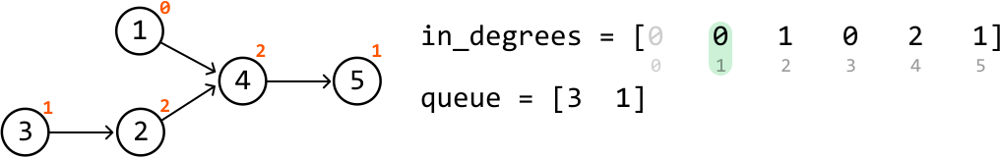

# Prerequisites

Given an integer `n` representing the number of courses labeled from `0` to `n - 1`, and an array of prerequisite pairs, determine if it's possible to enroll in all courses.

Each prerequisite is represented as a pair `[a, b]`, indicating that course `a` must be taken before course `b`.

#### Example:


```python
Input: n = 3, prerequisites = [[0, 1], [1, 2], [2, 1]]
Output: False

```

Explanation: Course 1 cannot be taken without first completing course 2 and, and vice versa.

#### Constraints:

- For any prerequisite `[a, b]`, `a` will not equal `b`.

## Intuition

Our goal is to check if enrollment into all courses is possible. Let’s start by identifying which situations make enrollment impossible.

Consider a simple case where there are just two courses. A scenario where enrollment into all courses is impossible occurs when each course is a prerequisite to the other, as graphically represented below:

![Image represents a directed graph illustrating prerequisites, where `prerequisites = [[0, 1], [1, 0]]` defines the depen](./images/ea074105_image-13-08-1-DGVLCL6Y.svg)

Here are a couple of impossible enrollment scenarios that could occur with prerequisites for three courses:



What do we notice about these cases and their graphical representations? They both have a circular relationship: a cycle. This highlights that it’s impossible to enroll in all courses if there exists a circular dependency between courses. In other words, **there must not be a cycle in the graphical representation of the courses** for complete enrollment to be possible.

Another thing to note is that the first courses which can be completed are those without prerequisites. In the graphical representation, such a course would have no directed arrows pointing at them. Let’s refer to the number of directed edges incoming to a node as the **in-degree** of that node.

---

In the example below, each node's in-degree is displayed at the top right:



Courses 0 and 3 have an in-degree of 0. So, let’s complete them first and remove them from the graph. By doing this, we reduce the number of prerequisites for courses 1 and 2. Course 1's indegree then decreases by 1, and course 2's indegree decreases by 2:



Now, courses 1 and 2 have an in-degree of 0, which means we can enroll in them and remove them from the graph. Observe what happens when we continue the process of removing courses with an in-degree of 0 from the graph:



By the end of this process, no courses remain, indicating it’s possible to enroll in all courses.

---

Now, consider an example with a cyclic dependency:


Let's follow the same steps of removing courses with an in-degree of 0:



Here, there is no way to progress because there aren't any courses with an in-degree of 0. When this happens, and there are still unvisited courses, a cyclic dependency exists, meaning enrolment is impossible.

Now, let’s identify a way to simulate the above process algorithmically.

**Topological sort**

The process we described above is essentially topological sorting, where vertices of a graph are sorted in such a way that for every directed edge u → v, node u comes before node v in the ordering of the topological sort.

An algorithm designed to perform topological sort is **Kahn’s algorithm**. Let’s see how we can use it to solve this problem.

---

The first step of Kahn's algorithm is to determine the in-degree of each course. This can be achieved by counting the number of times each course appears as a dependent in the prerequisite pairs: for a pair [a, b], course b depends on course a, so course b’s in-degree is incremented by one:



---

Now, we want to process all the courses with an in-degree of 0 first. We can add these courses to a queue to be processed:



---

To begin processing, pop the first course from the queue: course 0. Then, for each course that has course 0 as a prerequisite (i.e., courses pointed to by course 0), reduce their in-degree by one:



If any of the courses have an in-degree of 0 after being decremented, add them to the queue. Course 1 now has an in-degree of 0, so we add it to the queue:



---

We can continue the above process until the queue is empty, indicating that there aren't any more courses with an in-degree of 0.

- If we've processed all n courses, enrollment to all courses is possible.

- If we couldn’t process all n courses, a cycle was found, indicating enrollment to all courses is impossible.

## Implementation

```python
from typing import List
from collections import defaultdict, deque
    
def prerequisites(n: int, prerequisites: List[List[int]]) -> bool:
    graph = defaultdict(list)
    in_degrees = [0] * n
    # Represent the graph as an adjacency list and record the in-degree of each
    # course.
    for prerequisite, course in prerequisites:
        graph[prerequisite].append(course)
        in_degrees[course] += 1
    queue = deque()
    # Add all courses with an in-degree of 0 to the queue.
    for i in range(n):
        if in_degrees[i] == 0:
            queue.append(i)
    enrolled_courses = 0
    # Perform topological sort.
    while queue:
        node = queue.popleft()
        enrolled_courses += 1
        for neighbor in graph[node]:
            in_degrees[neighbor] -= 1
            # If the in-degree of a neighboring course becomes 0, add it to the queue.
            if in_degrees[neighbor] == 0:
                queue.append(neighbor)
    # Return true if we've successfully enrolled in all courses.
    return enrolled_courses == n

```

```javascript
export function prerequisites(n, prerequisites) {
  const graph = new Map()
  const inDegrees = Array(n).fill(0)
  // Represent the graph as an adjacency list and record the in-degree of each course.
  for (const [prerequisite, course] of prerequisites) {
    if (!graph.has(prerequisite)) {
      graph.set(prerequisite, [])
    }
    graph.get(prerequisite).push(course)
    inDegrees[course]++
  }
  const queue = []
  // Add all courses with an in-degree of 0 to the queue.
  for (let i = 0; i < n; i++) {
    if (inDegrees[i] === 0) {
      queue.push(i)
    }
  }
  let enrolledCourses = 0
  // Perform topological sort.
  while (queue.length > 0) {
    const node = queue.shift()
    enrolledCourses++
    const neighbors = graph.get(node) || []
    for (const neighbor of neighbors) {
      inDegrees[neighbor]--
      // If the in-degree of a neighboring course becomes 0, add it to the queue.
      if (inDegrees[neighbor] === 0) {
        queue.push(neighbor)
      }
    }
  }
  // Return true if we've successfully enrolled in all courses.
  return enrolledCourses === n
}

```

```java
import java.util.ArrayList;
import java.util.Deque;
import java.util.HashMap;
import java.util.LinkedList;
import java.util.List;
import java.util.Map;

public class Main {
    public static boolean prerequisites(int n, ArrayList<ArrayList<Integer>> prerequisites) {
        Map<Integer, List<Integer>> graph = new HashMap<>();
        int[] inDegrees = new int[n];
        // Represent the graph as an adjacency list and record the in-degree of each course.
        for (ArrayList<Integer> pair : prerequisites) {
            int prerequisite = pair.get(0);
            int course = pair.get(1);
            graph.computeIfAbsent(prerequisite, k -> new ArrayList<>()).add(course);
            inDegrees[course]++;
        }
        Deque<Integer> queue = new LinkedList<>();
        // Add all courses with an in-degree of 0 to the queue.
        for (int i = 0; i < n; i++) {
            if (inDegrees[i] == 0) {
                queue.add(i);
            }
        }
        int enrolledCourses = 0;
        // Perform topological sort.
        while (!queue.isEmpty()) {
            int node = queue.poll();
            enrolledCourses++;

            if (graph.containsKey(node)) {
                for (int neighbor : graph.get(node)) {
                    inDegrees[neighbor]--;
                    // If the in-degree of a neighboring course becomes 0, add it to the queue.
                    if (inDegrees[neighbor] == 0) {
                        queue.add(neighbor);
                    }
                }
            }
        }
        // Return true if we've successfully enrolled in all courses.
        return enrolledCourses == n;
    }
}

```

### Complexity Analysis

**Time complexity:** The time complexity of prerequisites is O(n+e) where e denotes the number of edges derived from the prerequisites array. Here’s why:

- Creating the adjacency list and recording the in-degrees takes O(e) time because we iterate through each prerequisite once.

- Adding all courses with in-degree 0 to the queue takes O(n) time because we check the in-degree of each course once.

- Performing Kahn’s algorithm takes O(n+e) time because each course and prerequisite is processed at most once during the traversal.

**Space complexity:** The space complexity is O(n+e), since the adjacency list takes up O(n+e) space, while the `in_degrees` array and queue each take up O(n) space.