# Shortest Path

Given an integer `n` representing nodes labeled from `0` to `n - 1` in an undirected graph, and an array of non-negative weighted edges, return an array where each index `i` contains the **shortest path length** from a specified start node to node `i`. If a node is unreachable, set its distance to -1.

Each edge is represented by a triplet of positive integers: the start node, the end node, and the weight of the edge.

#### Example:


```python
Input: n = 6,
       edges = [
         [0, 1, 5],
         [0, 2, 3],
         [1, 2, 1],
         [1, 3, 4],
         [2, 3, 4],
         [2, 4, 5],
       ],
       start = 0
Output: [0, 4, 3, 7, 8, -1]

```

## Intuition

There are a few algorithms that can be employed to find the shortest path in a graph. Let’s consider some of our options:

- BFS works well for finding the shortest path when the graph has edges with no weight, or uniform weight across the edges, as BFS doesn’t take weight into account in its traversal strategy.

- Dijkstra’s algorithm works well for graphs with non-negative weights, as it efficiently finds the shortest path from a single source to all other nodes.

- The Bellman-Ford algorithm works well for graphs with edges that may have negative weights [[1]](https://en.wikipedia.org/wiki/Bellman%E2%80%93Ford_algorithm).

- The Floyd-Warshall algorithm works well when we need to find the shortest paths between all pairs of nodes in a graph [[2]](https://en.wikipedia.org/wiki/Floyd%E2%80%93Warshall_algorithm).

Among these options, **Dijkstra’s algorithm** suits this problem the most since we’re dealing with a graph with non-negative weighted edges, and we need to find the shortest path from a start node to all other nodes. This algorithm uses a greedy strategy, which we’ll explore during this explanation.

Consider the undirected weighted graph below, with node 0 as the starting node.

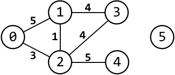

---

Initially, since we don't know any of the distances between node 0 and the other nodes, we'll set them to infinity. The only distance we do know is from the start node to itself, which is just 0:

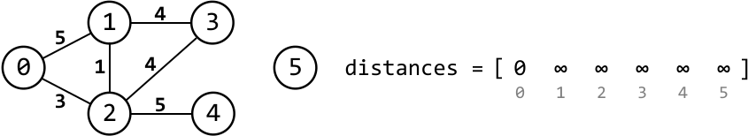

---

Let’s begin with the start node. Consider its immediate neighbors, nodes 1 and 2. The distances from node 0 to these nodes are 5 and 3, respectively. We don't know if these are the shortest distances from 0 to them, but they’re definitely shorter than infinity. So, let's update the distances to those nodes from node 0:

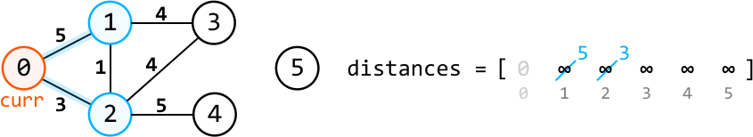

Right now, the closest node to the start node is node 2, with a distance of 3. This confirms that the shortest distance to node 2 from node 0 is 3, as the alternative route through node 1 has a longer distance. Thus, we can be certain that node 2 is reached through the shortest possible path, so let’s move to it:

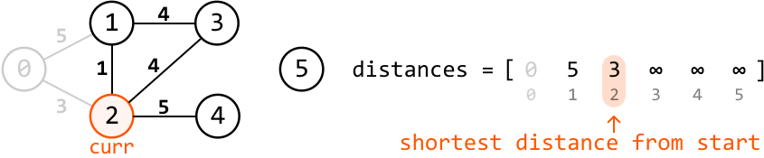

---

The current node is now node 2. Keep in mind that, so far, we’ve traversed a distance of `distance[2] = 3` from node 0 to reach node 2.

The immediate unvisited neighbors of the current node are nodes 1, 3, and 4. The distances to them from the start node are 1 + 3, 4 + 3, and 5 + 3 (where the +3 accounts for the distance traveled so far). Let’s update the distance array with these distances since they are smaller than the distances currently set for them:

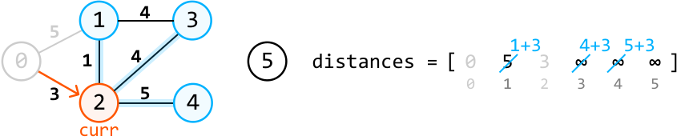

Right now, among the unvisited nodes, the node with the shortest distance from the start node is node 1, with a distance of 4. This means the shortest distance to node 1 from the start node is 4, since all other paths to node 1 involve traversing through distances larger than 4. So, let’s move to node 4:

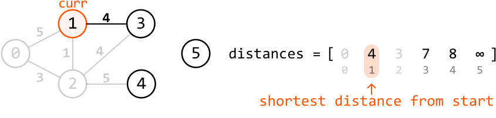

The greedy choice made is now becoming clearer:

> 
> 
> At each step, we move to the unvisited node with the shortest known distance from the start node.
> 
> 

---

Applying this greedy choice for the rest of the graph completes Dijkstra’s algorithm, giving us an array populated with the shortest path lengths from the start node to each node:

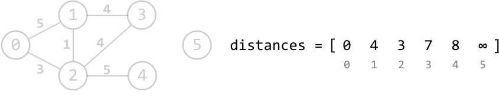

The final step is to convert all infinity values in this array to -1, indicating we weren’t able to reach that node:


---

To implement the above strategy, we’d like an efficient way to access the unvisited node with the shortest known distance at any point in the process. We can use a **min-heap** for this, allowing us logarithmic access to the node with the minimum distance.

**Using the min-heap**

To understand how we use the min-heap in Dijkstra’s algorithm, consider the following example with the start node, node 0, initially in the min-heap with its corresponding distance of 0:

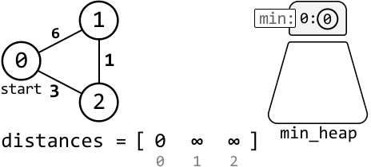

---

Begin by popping the start node from the top of the heap and setting it to the current node. Then, add the current node’s neighbors to the min-heap with their corresponding distances from the start node, and update the distances of these neighbors:

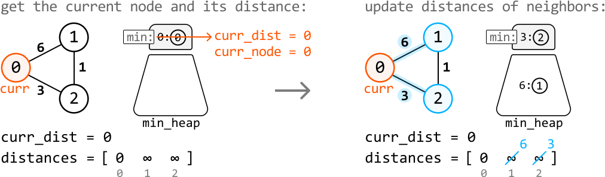

---

Repeat these two steps for each node at the top of the heap until the heap is empty:

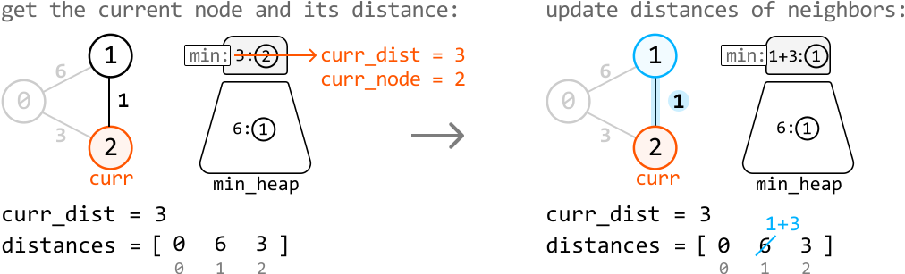

---

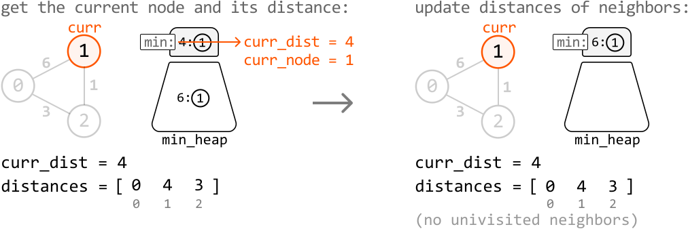

---

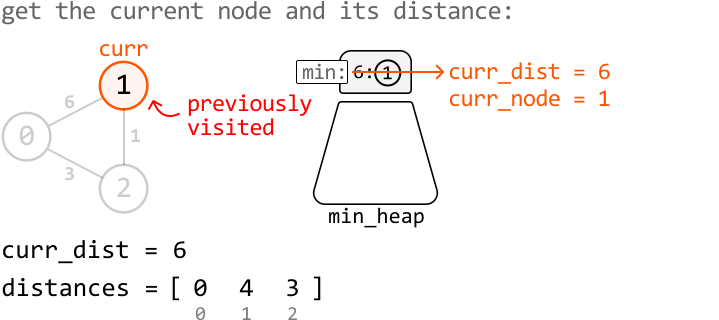

As we can see, we encounter an issue: **we’re revisiting node 1**. The only difference is that this time, we’re visiting it at a larger distance (`curr_dist = 6`) from the start than the recorded distance (4). We can avoid this situation with the following if-statement:

> 
> 
> `if curr_dist > distances[curr_node]: continue`
> 
> 

This check allows us to avoid using an additional data structure to keep track of visited nodes.

---

**Why does the greedy approach work?**

Before reading this section, it’s worth reviewing the *Greedy* chapter if you aren’t familiar with greedy algorithms.

Dijkstra's algorithm is considered greedy because, at each step, it selects the unvisited node with the shortest known distance from the start node, based on the assumption that this distance is the shortest possible path to that node. This choice is made as a local optimum, with the belief that it will lead to the global optima: the shortest path to all nodes. Can we always guarantee that this assumption is true? Consider the following graph, where the current node is node 0:

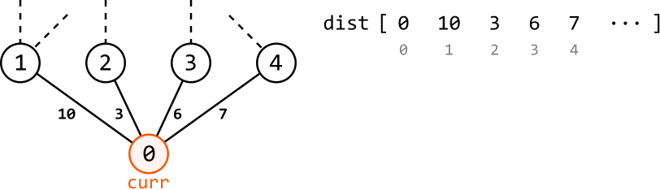

The node with the shortest known distance from the start node is node 2, with a distance of 3. We assume this is the shortest distance to node 2, and choose node 2 as the local optimum. Here’s a question we could ask here regarding the validity of this choice: is it possible to find a path with a distance less than 3 to another neighboring node, making node 2 no longer the neighbor with the shortest distance from the start node?

The answer is no. This is because we have to pass through one of these neighboring nodes to find any other paths, which would require us to add a distance of at least 3 to our total distance traversed from the start node. To reduce this traversed distance, we would need to encounter negatively weighted edges in the graph, which we know isn’t possible in this graph.

This analysis also demonstrates that **Dijkstra’s algorithm is only applicable when the graph has no edges with negative weights**.

## Implementation

```python
from typing import List
from collections import defaultdict
import heapq
    
def shortest_path(n: int, edges: List[int], start: int) -> List[int]:
    graph = defaultdict(list)
    distances = [float('inf')] * n
    distances[start] = 0
    # Represent the graph as an adjacency list.
    for u, v, w in edges:
        graph[u].append((v, w))
        graph[v].append((u, w))
    min_heap = [(0, start)]  # (distance, node)
    # Use Dijkstra's algorithm to find the shortest path between the start node
    # and all other nodes.
    while min_heap:
        curr_dist, curr_node = heapq.heappop(min_heap)
        # If the current distance to this node is greater than the recorded
        # distance, we've already found the shortest distance to this node.
        if curr_dist > distances[curr_node]:
            continue
        # Update the distances of the neighboring nodes.
        for neighbor, weight in graph[curr_node]:
            neighbor_dist = curr_dist + weight
            # Only update the distance if we find a shorter path to this
            # neighbor.
            if neighbor_dist < distances[neighbor]:
                distances[neighbor] = neighbor_dist
                heapq.heappush(min_heap, (neighbor_dist, neighbor))
    # Convert all infinity values to -1, representing unreachable nodes.
    return [-1 if dist == float('inf') else dist for dist in distances]

```

```javascript
import { MinPriorityQueue } from './helpers/heap/MinPriorityQueue.js'

export function shortest_path(n, edges, start) {
  const graph = new Map()
  const distances = new Array(n).fill(Infinity)
  distances[start] = 0
  // Represent the graph as an adjacency list.
  for (const [u, v, w] of edges) {
    if (!graph.has(u)) graph.set(u, [])
    if (!graph.has(v)) graph.set(v, [])
    graph.get(u).push([v, w])
    graph.get(v).push([u, w])
  }
  // Use Dijkstra's algorithm to find the shortest path between the start node and all other nodes.
  const minHeap = new MinPriorityQueue((item) => item[0]) // (distance, node)
  minHeap.enqueue([0, start])
  while (!minHeap.isEmpty()) {
    const [currDist, currNode] = minHeap.dequeue()
    // If the current distance to this node is greater than the recorded distance, skip.
    if (currDist > distances[currNode]) continue
    // Update the distances of the neighboring nodes.
    const neighbors = graph.get(currNode) || []
    for (const [neighbor, weight] of neighbors) {
      const neighborDist = currDist + weight
      // Only update if we find a shorter path to this neighbor.
      if (neighborDist < distances[neighbor]) {
        distances[neighbor] = neighborDist
        minHeap.enqueue([neighborDist, neighbor])
      }
    }
  }
  // Convert all infinity values to -1, representing unreachable nodes.
  return distances.map((d) => (d === Infinity ? -1 : d))
}

```

```java
import java.util.ArrayList;
import java.util.Arrays;
import java.util.HashMap;
import java.util.List;
import java.util.Map;
import java.util.PriorityQueue;

class Edge {
    int target;
    int weight;

    public Edge(int target, int weight) {
        this.target = target;
        this.weight = weight;
    }
}

class Pair {
    int dist;
    int node;

    public Pair(int dist, int node) {
        this.dist = dist;
        this.node = node;
    }
}

public class Main {
    public static ArrayList<Integer> shortest_path(int n, ArrayList<ArrayList<Integer>> edges, int start) {
        Map<Integer, List<Edge>> graph = new HashMap<>();
        int[] distances = new int[n];
        Arrays.fill(distances, Integer.MAX_VALUE);
        distances[start] = 0;
        // Represent the graph as an adjacency list.
        for (ArrayList<Integer> edge : edges) {
            int u = edge.get(0), v = edge.get(1), w = edge.get(2);
            graph.computeIfAbsent(u, k -> new ArrayList<>()).add(new Edge(v, w));
            graph.computeIfAbsent(v, k -> new ArrayList<>()).add(new Edge(u, w));
        }
        PriorityQueue<Pair> minHeap = new PriorityQueue<>((a, b) -> a.dist - b.dist);
        minHeap.add(new Pair(0, start));  // (distance, node)
        // Use Dijkstra's algorithm to find the shortest path between the start node
        // and all other nodes.
        while (!minHeap.isEmpty()) {
            Pair current = minHeap.poll();
            int currDist = current.dist;
            int currNode = current.node;
            // If the current distance to this node is greater than the recorded
            // distance, we've already found the shortest distance to this node.
            if (currDist > distances[currNode]) continue;
            // Update the distances of the neighboring nodes.
            if (graph.containsKey(currNode)) {
                for (Edge neighbor : graph.get(currNode)) {
                    int neighborDist = currDist + neighbor.weight;
                    // Only update the distance if we find a shorter path to this
                    // neighbor.
                    if (neighborDist < distances[neighbor.target]) {
                        distances[neighbor.target] = neighborDist;
                        minHeap.add(new Pair(neighborDist, neighbor.target));
                    }
                }
            }
        }
        // Convert all infinity values to -1, representing unreachable nodes.
        ArrayList<Integer> result = new ArrayList<>();
        for (int dist : distances) {
            result.add(dist == Integer.MAX_VALUE ? -1 : dist);
        }
        return result;
    }
}

```

### Complexity Analysis

**Time complexity:** The time complexity of the `shortest_path` is O((n+e)log(n)), where e represents the number of edges. Here’s why:

- Creating the adjacency list takes O(e) time.

- Dijkstra's algorithm traverses up to all n nodes and explores each edge of the graph. To access each node, we pop it from the heap, and for each edge, up to one node is pushed to the heap (when we process each node’s neighbors). Since each `push` and `pop` operation takes O(log(n)) time, the time complexity of Dijkstra’s algorithm is O((n+e)log(n)).

Therefore, the overall time complexity is O(e)+O((n+e)log(n))=O((n+e)log(n)).

**Space complexity:** The space complexity is O(n+e), since the adjacency list takes up O(n+e) space, whereas the `distances` array and `min_heap` take up O(n) space.