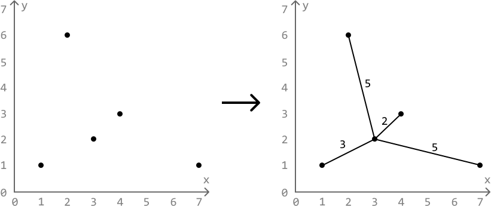
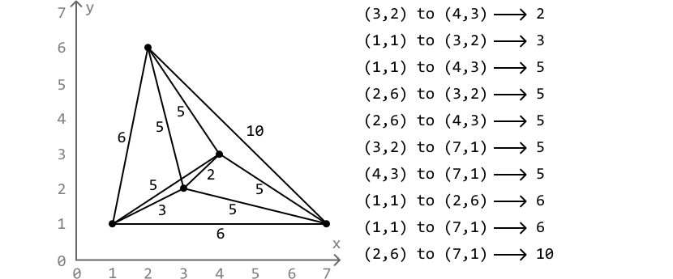
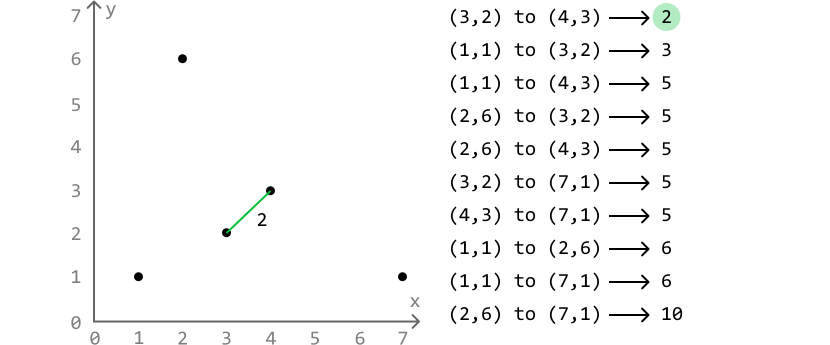
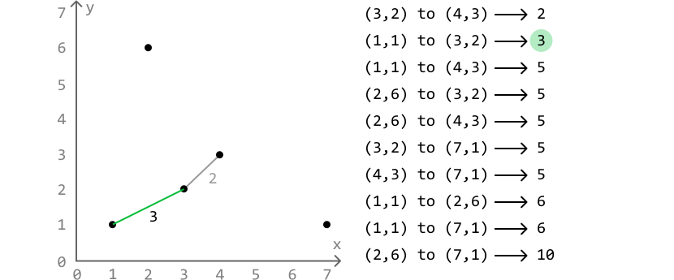
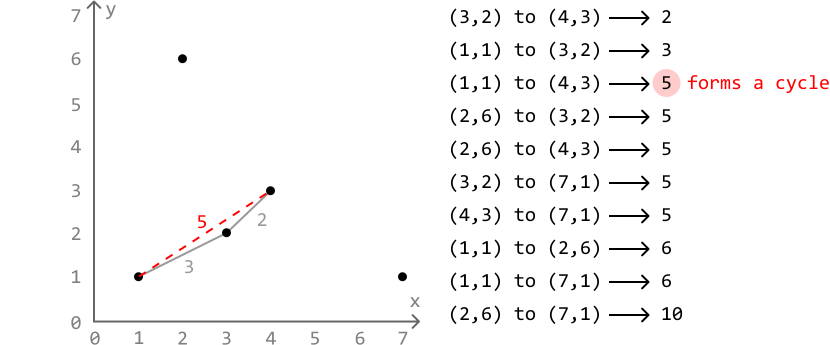
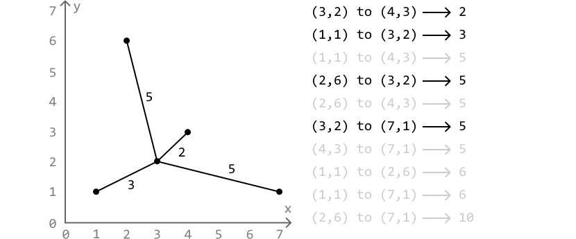
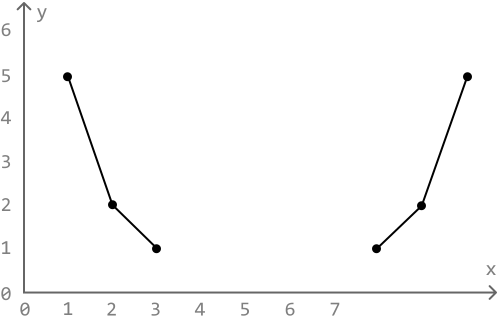
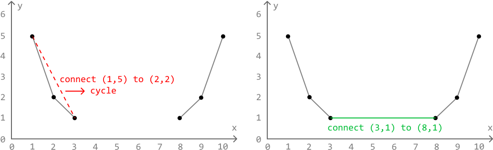

# Connect the Dots

Given a set of points on a plane, determine the **minimum cost to connect all these points**.

The cost of connecting two points is equal to the **Manhattan distance** between them, which is calculated as `|x1 - x2| + |y1 - y2|` for two points `(x1, y1)` and `(x2, y2)`.

#### Example:



```python
Input: points = [[1, 1], [2, 6], [3, 2], [4, 3], [7, 1]]
Output: 15

```

#### Constraints:

- There will be at least 2 points on the plane.

## Intuition

Let's treat this problem as a graph problem, imagining each point as a node, and the cost of connecting any two points as the weight of an edge between those nodes.

The goal is to connect all nodes (points) in such a way that the total cost is minimized. This is essentially the **minimum spanning tree** (MST) problem:

The MST of a weighted graph is a way to connect all points in the graph, ensuring each point is reachable from any other point while minimizing the total weight of the connections.

There are two main algorithms that are used to find the MST of a graph:

- Kruskal's algorithm

- Prim's algorithm

In this explanation, we'll break down Kruskal's algorithm since it uses a data structure we've already discussed in this chapter: **Union-Find**.

**Kruskal's algorithm**

Kruskal's algorithm is a greedy method for finding the MST. It essentially builds the MST by connecting nodes with the lowest-weighted edges first while skipping any edges that could cause a cycle.

To do this, we first need to identify all the possible edges and sort them by their Manhattan distance:



Now, let's implement Kruskal's algorithm. Start by including the lowest weighted edge in the MST, which is the edge from (3, 2) to (4, 3):

 



Next, add the next lowest weighted edge, which is the edge from (1, 1) to (3, 2):

 



Notice that adding the next edge from (1, 1) to (4, 3) will cause a cycle. Edges that cause cycles are avoided in an MST because doing so implies we're connecting two points that are already connected. So, let's skip this edge:

 



Continuing this process until all points are connected gives us the MST:



We'll know that all points are connected once we've added a total of n - 1 edges to the MST, because this is the least number of edges needed to connect n points without any cycles. To attain the cost of this MST, we just need to keep track of the Manhattan cost of each edge we add to the MST.

Now that we have a strategy to find the MST of a set of points, we just need a way to determine when connecting two points leads to a cycle.

**Avoiding cycles**

A cycle is formed when we add an edge to nodes that are already connected in some way. Consider the following set of points, where the group of points to the left are connected, and the group of points to the right are connected:



Connecting any two points in the same group causes a cycle, and connecting two points from two separate groups will result in both groups merging into one:



What would be useful here is a way to determine if two points belong to the same group, and a way to merge two groups together. The **Union-Find** data structure is perfect for this.

We can use the `union` function to connect two points together.

- If the two points belong to two separate groups, `union` should merge those groups and return true.

- Otherwise, if they belong to the same group, `union` should return false.

This way, we can use this boolean return value as a way to determine if attempting to connect two points causes a cycle.

If you're not familiar with Union-Find, study the solution to the *Merging Communities* problem.

## Implementation

In this implementation, we'll identify each point using their index in the points array. This means that for `n` points, each point is represented by an index from 0 to `n - 1`. By doing this, we can set up a Union-Find data structure with a capacity of `n` so that there are `n` groups initially, with each group containing one of the `n` points.

```python
from typing import List
    
def connect_the_dots(points: List[List[int]]) -> int:
    n = len(points)
    # Create and populate a list of all possible edges.
    edges = []
    for i in range(n):
        for j in range(i + 1, n):
            # Manhattan distance.
            cost = (abs(points[i][0] - points[j][0]) +
                    abs(points[i][1] - points[j][1]))
            edges.append((cost, i, j))
    # Sort the edges by their cost in ascending order.
    edges.sort()
    uf = UnionFind(n)
    total_cost = edges_added = 0
    # Use Kruskal's algorithm to create the MST and identify its minimum cost.
    for cost, p1, p2 in edges:
        # If the points are not already connected (i.e. their representatives are
        # not the same), connect them, and add the cost to the total cost.
        if uf.union(p1, p2):
            total_cost += cost
            edges_added += 1
            # If n - 1 edges have been added to the MST, the MST is complete.
            if edges_added == n - 1:
                return total_cost

```

```javascript
export function connect_the_dots(points) {
  const n = points.length
  const edges = []
  // Generate all edges and their Manhattan distances
  for (let i = 0; i < n; i++) {
    for (let j = i + 1; j < n; j++) {
      const cost =
        Math.abs(points[i][0] - points[j][0]) +
        Math.abs(points[i][1] - points[j][1])
      edges.push([cost, i, j])
    }
  }
  // Sort edges by their cost in ascending order
  edges.sort((a, b) => a[0] - b[0])
  const uf = new UnionFind(n)
  let totalCost = 0
  let edgesAdded = 0
  for (const [cost, p1, p2] of edges) {
    // If the points are not already connected (i.e. their representatives are
    // not the same), connect them, and add the cost to the total cost.
    if (uf.union(p1, p2)) {
      totalCost += cost
      edgesAdded++
      // If n - 1 edges have been added to the MST, the MST is complete.
      if (edgesAdded === n - 1) {
        return totalCost
      }
    }
  }
  return totalCost
}

```

```java
import java.util.ArrayList;
import java.util.Collections;
import java.util.Comparator;

class Pair {
    int cost, point1, point2;

    public Pair(int cost, int point1, int point2) {
        this.cost = cost;
        this.point1 = point1;
        this.point2 = point2;
    }
}

public class Main {
    public static int connect_the_dots(ArrayList<ArrayList<Integer>> points) {
        int n = points.size();
        // Create and populate a list of all possible edges.
        ArrayList<Pair> edges = new ArrayList<>();
        for (int i = 0; i < n; i++) {
            for (int j = i + 1; j < n; j++) {
                // Manhattan distance.
                int cost = Math.abs(points.get(i).get(0) - points.get(j).get(0)) +
                           Math.abs(points.get(i).get(1) - points.get(j).get(1));
                edges.add(new Pair(cost, i, j));
            }
        }
        // Sort the edges by their cost in ascending order.
        Collections.sort(edges, Comparator.comparingInt(a -> a.cost));
        UnionFind uf = new UnionFind(n);
        int total_cost = 0, edges_added = 0;
        // Use Kruskal's algorithm to create the MST and identify its minimum cost.
        for (Pair edge : edges) {
            // If the points are not already connected (i.e. their representatives are
            // not the same), connect them, and add the cost to the total cost.
            if (uf.union(edge.point1, edge.point2)) {
                total_cost += edge.cost;
                edges_added += 1;
                // If n - 1 edges have been added to the MST, the MST is complete.
                if (edges_added == n - 1) {
                    return total_cost;
                }
            }
        }
        return total_cost;
    }
}

```

The Union-Find data structure remains the same as the implementation provided in *Merging Communities*, with a slight modification made to the `union` function, adding a boolean return value to it.

```python
class UnionFind:
    def __init__(self, size):
        self.parent = [i for i in range(size)]
        self.size = [1] * size

    def union(self, x, y) -> bool:
        rep_x, rep_y = self.find(x), self.find(y)
        if rep_x != rep_y:
            if self.size[rep_x] > self.size[rep_y]:
                self.parent[rep_y] = rep_x
                self.size[rep_x] += self.size[rep_y]
            else:
                self.parent[rep_x] = rep_y
                self.size[rep_y] += self.size[rep_x]
            # Return True if both groups were merged.
            return True
        # Return False if the points belong to the same group.
        return False

    def find(self, x) -> int:
        if x == self.parent[x]:
            return x
        self.parent[x] = self.find(self.parent[x])
        return self.parent[x]

```

```javascript
class UnionFind {
  constructor(size) {
    this.parent = Array.from({ length: size }, (_, i) => i)
    this.size = Array(size).fill(1)
  }
  find(x) {
    if (x === this.parent[x]) return x
    this.parent[x] = this.find(this.parent[x])
    return this.parent[x]
  }
  union(x, y) {
    const repX = this.find(x)
    const repY = this.find(y)
    if (repX !== repY) {
      if (this.size[repX] > this.size[repY]) {
        this.parent[repY] = repX
        this.size[repX] += this.size[repY]
      } else {
        this.parent[repX] = repY
        this.size[repY] += this.size[repX]
      }
      // Return True if both groups were merged.
      return true
    }
    // Return False if the points belong to the same group.
    return false
  }
}

```

```java
class UnionFind {
    private int[] parent;
    private int[] size;

    public UnionFind(int n) {
        parent = new int[n];
        size = new int[n];
        for (int i = 0; i < n; i++) {
            parent[i] = i;
            size[i] = 1;
        }
    }

    public boolean union(int x, int y) {
        int repX = find(x);
        int repY = find(y);
        if (repX != repY) {
            if (size[repX] > size[repY]) {
                parent[repY] = repX;
                size[repX] += size[repY];
            } else {
                parent[repX] = repY;
                size[repY] += size[repX];
            }
            // Return True if both groups were merged.
            return true;
        }
        // Return False if the points belong to the same group.
        return false;
    }

    public int find(int x) {
        if (x == parent[x]) return x;
        parent[x] = find(parent[x]);
        return parent[x];
    }
}

```

### Complexity Analysis

**Time complexity:** The time complexity of the `connect_the_dots` is O(n^2log(n)), where n denotes the length of the points array, and n^2 is the number of edges in the `edges` array, since we consider all possible pairs of points to form edges. Here's why:

- Sorting n^2 edges takes O(n^2log(n^2)) time, which can be simplified to O(n^2log(n)).

- We perform up to one `union` operation for each edge, with each `union` taking amortized O(1) time, resulting in the `union` operations contributing amortized O(n^2) time.

Therefore, the overall time complexity is O(n^2+n^2log(n))=O(n^2log(n)).

**Space complexity:** The space complexity is O(n^2) due to the space taken up by the `edges` list. In addition, the `UnionFind` data structure takes up O(n) space.