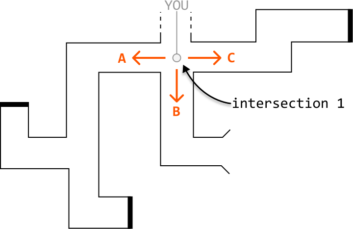
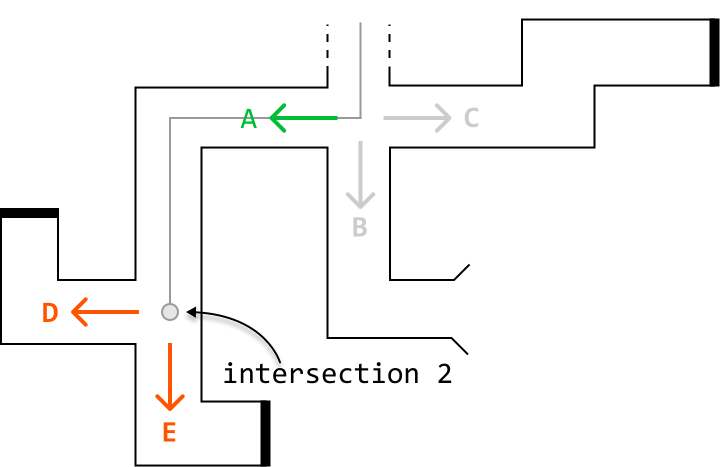
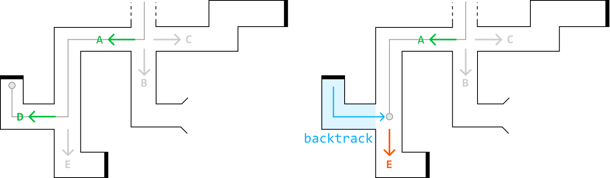
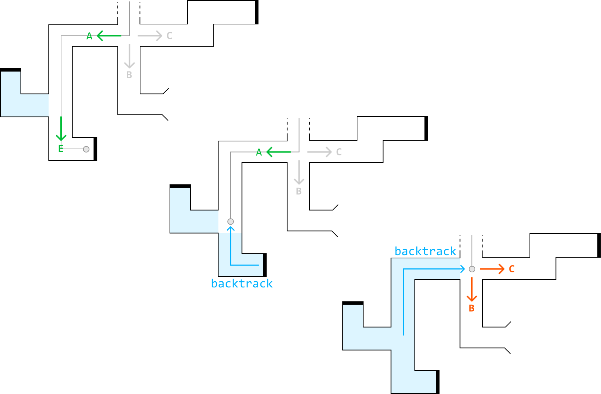
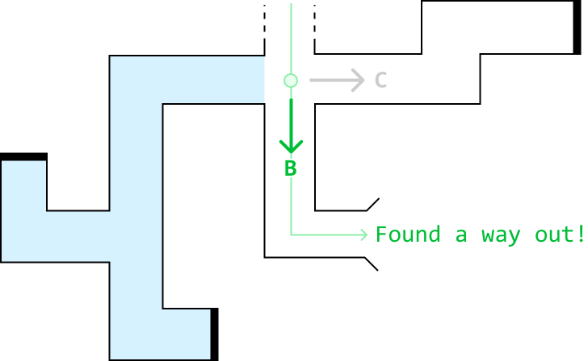
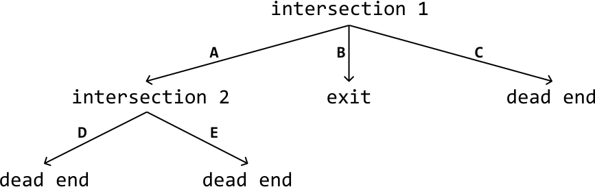
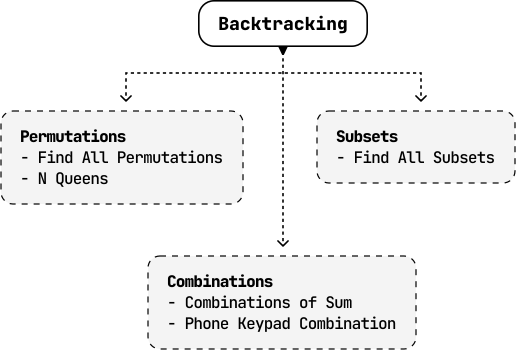

# Introduction to Backtracking

## Intuition

Imagine you're stuck at an intersection point in a maze, and you know one of the three routes ahead leads to the exit:



However, you're not sure which route to take. To find the exit, you decide to try each option one by one, starting with option A. As you walk through passage A, you encounter a new intersection containing two more routes, D and E:



You try option D, but it leads to a dead end. So, you backtrack to the second intersection point:



Next, you try option E, but it also leads to a dead end, so you backtrack to the second junction point. After concluding that neither path D nor E works, you backtrack again to the first intersection point:



Having determined that path A doesn't lead to the exit, you move on to path B and discover that it leads to the exit:



This brute force process of testing all possible paths and backtracking upon failure is called 'backtracking.'

**State space tree**

In backtracking, the state space tree, also known as the decision tree, is a conceptual tree constructed by considering every possible decision that can be made at each point in a process.

For example, here's how we would represent the state space tree for the maze scenario:



Here's a simplified explanation of a state space tree:

- Edges: Each edge represents a possible decision, move, or action.

- Root node: The root node represents the initial state or position before any decisions are made.

- Intermediate nodes: Nodes representing partially completed states or intermediate positions.

- Leaf nodes: The leaf nodes represent complete or invalid solutions.

- Path: A path from the root to any leaf node represents a sequence of decisions that lead to a complete or invalid solution.

Drawing out the state space tree for a problem helps to visualize the entire solution space, and all possible decisions. In addition, it's a great way to understand how the algorithm works. By figuring out how to traverse this tree, we essentially create the backtracking algorithm.

**Backtracking algorithm**

Traversing the state space tree is typically done using recursive DFS. Let's discuss how it's implemented at a high level.

Termination condition: Define the condition that specifies when a path should end. This condition should define when we've found a valid and/or invalid solution.

Iterate through decisions: Iterate through every possible decision at the current node, which contains the current state of the problem. For each decision:

- Make that decision and update the current state accordingly.

- Recursively explore all paths that branch from this updated state by calling the DFS function on this state.

- Backtrack by undoing the decision we made and reverting the state.

Below is a crude template for backtracking:

```python
def dfs(state):
    # Termination condition.
    if meets_termination_condition(state):
        process_solution(state)
        return
    # Explore each possible decision that can be made at the current state.
    for decision in possible_decisions(state):
        make_decision(state, decision)
        dfs(state)
        undo_decision(state, decision)  # Backtrack.

```

```javascript
function dfs(state) {
  // Termination condition.
  if (meetsTerminationCondition(state)) {
    processSolution(state)
    return
  }
  // Explore each possible decision that can be made at the current state.
  for (const decision of possibleDecisions(state)) {
    makeDecision(state, decision)
    dfs(state)
    undoDecision(state, decision) // Backtrack.
  }
}

```

```java
public void dfs(State state) {
   // Termination condition.
   if (meetsTerminationCondition(state)) {
       processSolution(state);
       return;
   }
   // Explore each possible decision that can be made at the current state.
   for (Decision decision : possibleDecisions(state)) {
       makeDecision(state, decision);
       dfs(state);
       undoDecision(state, decision); // Backtrack.
   }
}

```

**Analyzing time complexity**

Analyzing the time complexity of backtracking algorithms involves understanding the branching factor and the depth of the state space tree:

- Branching factor: The number of children each node has. It typically represents the maximum number of decisions that can be made for a given state.

- Depth: The length of the deepest path in the state space tree. It corresponds to the number of decisions or steps required to reach a complete solution.

The time complexity is often estimated as O(b· d), where b denotes the branching factor and d denotes the depth. This is because in the worst case, every node at each level of the tree needs to be explored during a typical backtracking algorithm.

**When to use backtracking**

Backtracking is useful when we need to explore all possible solutions to a problem. For example, if we need to find all possible ways to arrange items, or generate all possible subsets, permutations, or combinations, backtracking can help to identify every possible solution.

## Real-world Example

**AI algorithms for games:** backtracking is used in AI algorithms for games like chess and Go to explore possible moves and strategies. The programs examine each potential move, simulate the game's progression, and evaluate the outcome. If a move leads to an unfavorable position, the program will backtrack to the previous move and try alternative options, systematically exploring the game tree until it finds the optimal strategy.

## Chapter Outline

