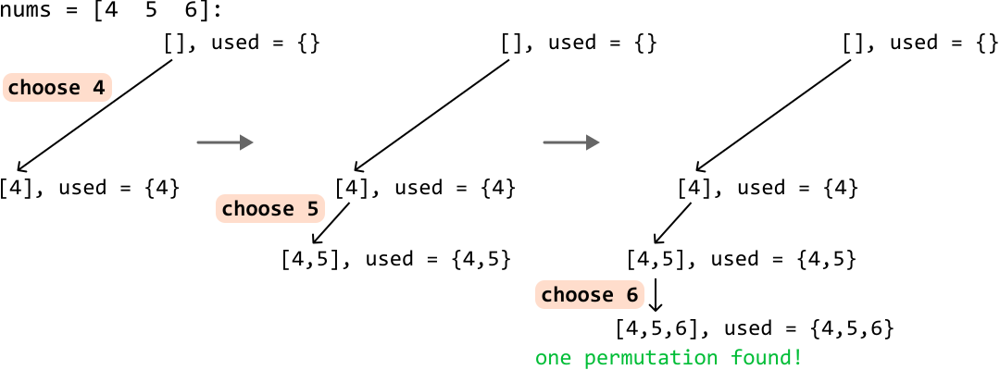
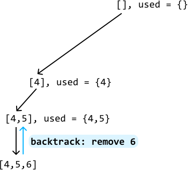
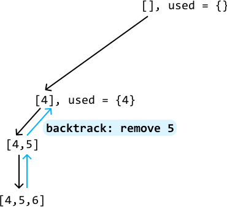
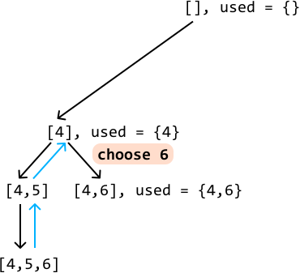
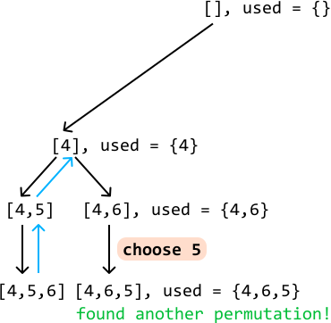
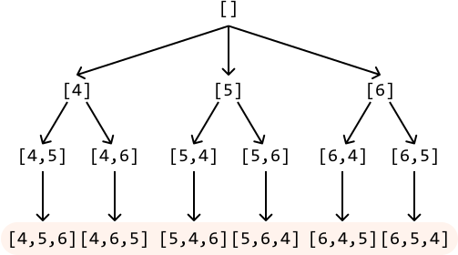

# Find All Permutations

Return **all possible permutations** of a given array of unique integers. They can be returned in any order.

#### Example:

```python
Input: nums = [4, 5, 6]
Output: [[4, 5, 6], [4, 6, 5], [5, 4, 6], [5, 6, 4], [6, 4, 5], [6, 5, 4]]

```

## Intuition

Our task in this problem is quite straightforward: find all permutations of a given array. The key word here is "all". To achieve this, we need an algorithm that generates each possible permutation one at a time. The technique that naturally fits this requirement is **backtracking**. As with any backtracking solution, it's useful to first visualize the state space tree.

**State space tree**

Let's figure out how to build just one permutation. Consider the array [4, 5, 6]. We can start by picking one number from this array for the first position of this permutation. For the second position, let's pick a different number. We can keep adding numbers like this until all the numbers from the array are used. To avoid reusing numbers, let's also keep track of the used numbers using a hash set.



---

Now that we've found one permutation, let's *backtrack* to find others. Start by removing the most recently added number, 6, bringing us back to [4, 5]:



---

Are there any other numbers we can append to [4, 5]? Well, 6 is the only option at this point, which we already explored. So, let's backtrack again by removing 5, bringing us back to [4]:



---

Are there any numbers other than 5 we can add to [4] at this point? Yes, we can use 6, so let's add it and continue searching:



---

The only number we can use at this point is 5, so let’s add it to [4, 6], giving us another permutation:



---

Following this backtracking process until we’ve explored all branches allows us to generate all permutations:



Every time we reach a permutation (i.e., when the permutation we’re building reaches a size of n, where n denotes the length of the input array), add it to our output.

---

**Traversing the state space tree**

Generating all permutations can be achieved by traversing the state space tree.

Each node in this tree, except leaf nodes, represents a permutation candidate: a partially completed permutation that we’re building. The root node represents an empty permutation, and an element is added to each permutation candidate as we progress deeper into the tree. The leaf nodes represent completed permutations.

Starting from the root node, we can traverse this tree using backtracking:

- Pick an unused number and add it to the current permutation candidate. Mark this number as used by adding it to the used hash set.

- Make a recursive call with this updated permutation candidate to explore its branches.

- Backtrack: remove the last number we added to the current candidate array, and the used hash set.

Whenever a permutation candidate reaches the length of n, add it to our output.

## Implementation

```python
from typing import List, Set
    
def find_all_permutations(nums: List[int]) -> List[List[int]]:
    res = []
    backtrack(nums, [], set(), res)
    return res
    
def backtrack(nums: List[int], candidate: List[int], used: Set[int], res: List[List[int]]) -> None:
    # If the current candidate is a complete permutation, add it to the result.
    if len(candidate) == len(nums):
        res.append(candidate[:])
        return
    for num in nums:
        if num not in used:
            # Add 'num' to the current permutation and mark it as used.
            candidate.append(num)
            used.add(num)
            # Recursively explore all branches using the updated permutation
            # candidate.
            backtrack(nums, candidate, used, res)
            # Backtrack by reversing the changes made.
            candidate.pop()
            used.remove(num)

```

```javascript
export function find_all_permutations(nums) {
  const res = []
  backtrack(nums, [], new Set(), res)
  return res
}

function backtrack(nums, candidate, used, res) {
  // If the current candidate is a complete permutation, add it to the result.
  if (candidate.length === nums.length) {
    res.push([...candidate]) // Make a shallow copy
    return
  }
  for (const num of nums) {
    if (!used.has(num)) {
      // Add 'num' to the current permutation and mark it as used.
      candidate.push(num)
      used.add(num)
      // Recursively explore all branches using the updated permutation candidate.
      backtrack(nums, candidate, used, res)
      // Backtrack by reversing the changes made.
      candidate.pop()
      used.delete(num)
    }
  }
}

```

```java
import java.util.ArrayList;
import java.util.HashSet;

public class Main {
    public static ArrayList<ArrayList<Integer>> find_all_permutations(ArrayList<Integer> nums) {
        ArrayList<ArrayList<Integer>> res = new ArrayList<>();
        backtrack(nums, new ArrayList<>(), new HashSet<>(), res);
        return res;
    }

    public static void backtrack(ArrayList<Integer> nums, ArrayList<Integer> candidate,
                                 HashSet<Integer> used, ArrayList<ArrayList<Integer>> res) {
        // If the current candidate is a complete permutation, add it to the result.
        if (candidate.size() == nums.size()) {
            res.add(new ArrayList<>(candidate));
            return;
        }
        for (Integer num : nums) {
            if (!used.contains(num)) {
                // Add 'num' to the current permutation and mark it as used.
                candidate.add(num);
                used.add(num);
                // Recursively explore all branches using the updated permutation
                // candidate.
                backtrack(nums, candidate, used, res);
                // Backtrack by reversing the changes made.
                candidate.remove(candidate.size() - 1);
                used.remove(num);
            }
        }
    }
}

```

### Complexity Analysis

**Time complexity:** The time complexity of `find_all_permutations` is O(n· n!). Here’s why:

- Starting from the root, we recursively explore n candidates.

- For each of these n candidates, we explore n - 1 more candidates, then n - 2 more candidates, etc, until we have explored all permutations. This results in a total of n· (n-1)· (n-2)…1=n! permutations.

- For each of the n! permutations, we make a copy of it and add it to the output, which takes O(n) time.

This results in a total time complexity of O(n!)· O(n)=O(n· n!).

**Space complexity:** The space complexity is O(n) because the maximum depth of the recursion tree is n. The algorithm also maintains the `candidate` and `used` data structures, both of which also contribute O(n) space. Note, the `res` array does not contribute to space complexity.