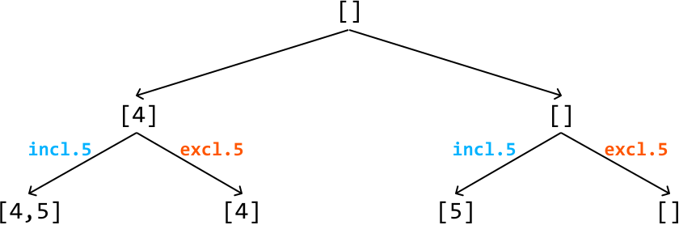
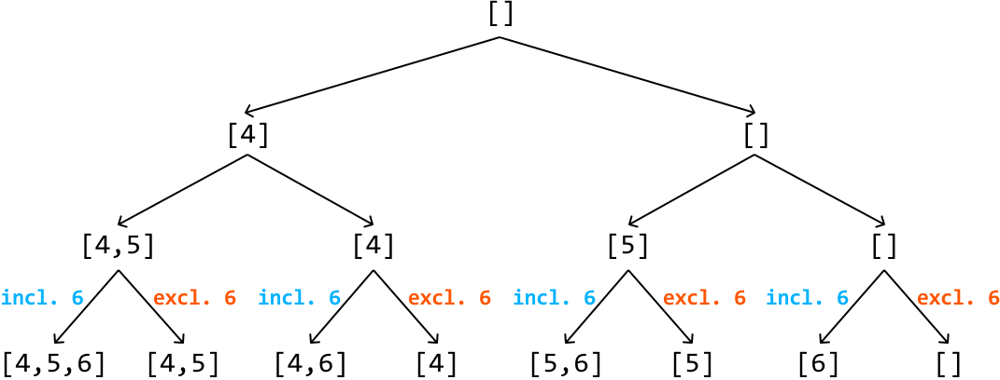
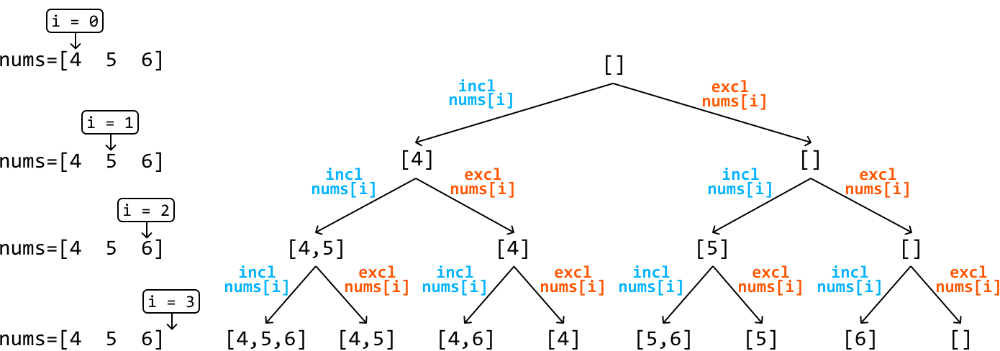

# Find All Subsets

Return **all possible subsets** of a given set of unique integers. Each subset can be ordered in any way, and the subsets can be returned in any order.

#### Example:

```python
Input: nums = [4, 5, 6]
Output: [[], [4], [4, 5], [4, 5, 6], [4, 6], [5], [5, 6], [6]]

```

## Intuition

The key intuition for solving this problem lies in understanding that each subset is formed by making a specific decision for every number in the input array: **to include the number, or exclude it**. For example, from the array [4, 5, 6], the subset [4, 6] is created by including 4, excluding 5, and including 6.

Let’s have a look at what the state space tree looks like when making this decision for every element.

**State space tree**

Consider the input array [4, 5, 6]. Let’s start with the root node of the tree, which is an empty subset:


---

To figure out how we branch out from here, let’s consider our decision of whether to include or exclude an element. Let’s make this decision with the first element of the input array, 4:

![Image represents a diagram illustrating an inclusive and exclusive range operation.  A central node, labeled `[]`, repre](./images/7b0b5977_image-14-02-2-62NDYCUD.svg)

---

For each of these subsets, we repeat the process, branching out again based on the same choice for the second element: include or exclude it:



---

Finally, for the third element, we continue branching out for each existing subset based on whether we include or exclude this element:



---

One important thing missing from this state space tree is a way to tell which element of the input array we’re making a decision on at each node of the tree. We can use an index, `i`, for this:



As shown, the final level of the tree (i.e., when `i == n`, where `n` denotes the length of the input array) contains all the subsets of the input array. We can add each of these subsets to our output. To get to these subsets, we need to traverse the tree, and **backtracking** is great for this.

## Implementation

```python
from typing import List
    
def find_all_subsets(nums: List[int]) -> List[List[int]]:
    res = []
    backtrack(0, [], nums, res)
    return res
    
def backtrack(i: int, curr_subset: List[int], nums: List[int], res: List[List[int]]) -> None:
    # Base case: if all elements have been considered, add the current subset to the
    # output.
    if i == len(nums):
        res.append(curr_subset[:])
        return
    # Include the current element and recursively explore all paths that branch from
    # this subset.
    curr_subset.append(nums[i])
    backtrack(i + 1, curr_subset, nums, res)
    # Exclude the current element and recursively explore all paths that branch from
    # this subset.
    curr_subset.pop()
    backtrack(i + 1, curr_subset, nums, res)

```

```javascript
export function find_all_subsets(nums) {
  const res = []
  backtrack(0, [], nums, res)
  return res
}

function backtrack(i, curr_subset, nums, res) {
  // Base case: if all elements have been considered, add the current subset to
  // the output list.
  if (i === nums.length) {
    res.push([...curr_subset])
    return
  }
  // Include the current element and recursively explore all paths that branch from
  // this subset.
  curr_subset.push(nums[i])
  backtrack(i + 1, curr_subset, nums, res)
  // Exclude the current element and recursively explore all paths that branch from
  // this subset.
  curr_subset.pop()
  backtrack(i + 1, curr_subset, nums, res)
}

```

```java
import java.util.ArrayList;

public class Main {
    public static ArrayList<ArrayList<Integer>> find_all_subsets(ArrayList<Integer> nums) {
        ArrayList<ArrayList<Integer>> res = new ArrayList<>();
        backtrack(0, new ArrayList<>(), nums, res);
        return res;
    }

    public static void backtrack(int i, ArrayList<Integer> curr_subset,
                                 ArrayList<Integer> nums, ArrayList<ArrayList<Integer>> res) {
        // Base case: if all elements have been considered, add the current subset to the
        // output.
        if (i == nums.size()) {
            res.add(new ArrayList<>(curr_subset));
            return;
        }
        // Include the current element and recursively explore all paths that branch from
        // this subset.
        curr_subset.add(nums.get(i));
        backtrack(i + 1, curr_subset, nums, res);
        // Exclude the current element and recursively explore all paths that branch from
        // this subset.
        curr_subset.remove(curr_subset.size() - 1);
        backtrack(i + 1, curr_subset, nums, res);
    }
}

```

### Complexity Analysis

**Time complexity:** The time complexity of `find_all_subsets` is O(n^2· n). This is because the state space tree has a depth of n and a branching factor of 2 since there are two decisions we make at each state. For each of the 2n subsets created, we make a copy of them and add the copy to the output, which takes O(n) time. This results in a total time complexity of O(n^2· n).

**Space complexity:** The space complexity is O(n) because the maximum depth of the recursion tree is n. The algorithm also maintains the `curr_subset` data structure, which also contributes O(n) space. Note, the `res` array does not contribute to space complexity.