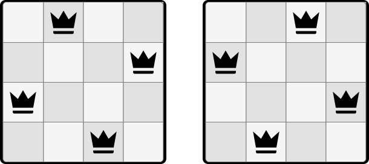
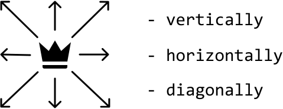
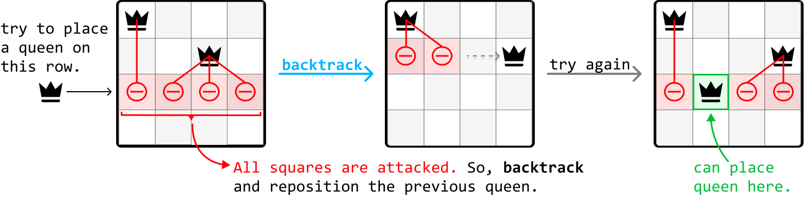
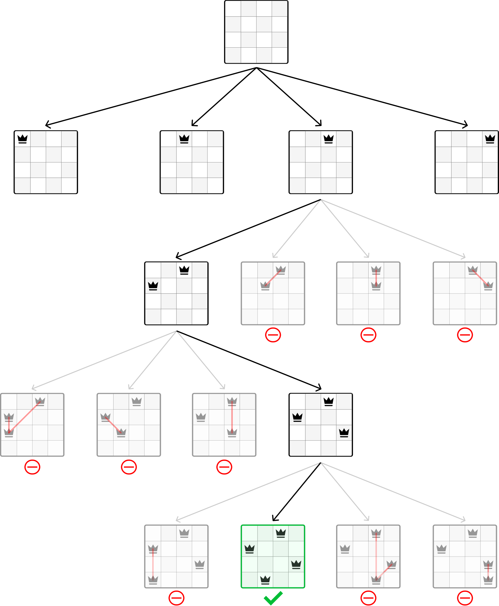
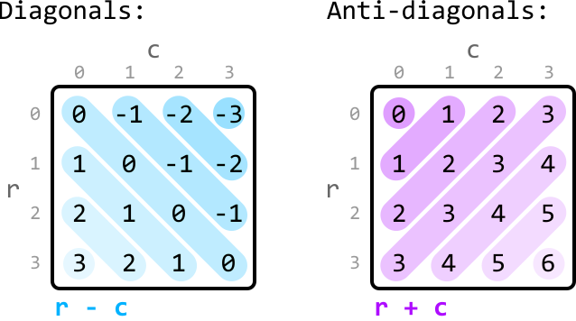

# N Queens

There is a chessboard of size `n x n`. Your goal is to place `n` queens on the board such that **no two queens attack each other**. Return the number of distinct configurations where this is possible.

#### Example:



```python
Input: n = 4
Output: 2

```

## Intuition

Queens can move vertically, horizontally, and diagonally:



So, it's only possible to place a queen on a square of the board when:

- No other queen occupies the same row of that square.

- No other queen occupies the same column of that square.

- No other queen occupies either diagonal of that square.

Based on this, let’s identify a method for placing the queens.

**Placing the queens - backtracking**

A straightforward strategy is to place one queen on the board at a time, making sure each new queen is placed on a safe square where it can’t be attacked. If we can no longer safely place a queen, it means one or more of the previously placed queens need to be repositioned. In this case, we backtrack by changing the position of the previous queen and trying again.

To make backtracking more efficient, we can place each queen on a new row. This way, we don’t have to worry about conflicts between queens on the same row, and only need to check for an opposing queen on the same column and along the diagonals of the square where the new queen is placed. If a queen cannot be placed anywhere on this new row, we backtrack, reposition the previous row’s queen, and then try again:



A partial state space tree for this backtracking process is visualized below for n = 4:



We’re still left with some questions. In particular, how can we tell if a square is being attacked, and how exactly do we “place” or “remove” a queen?

**Detecting opposing queens**

One challenge in this problem is determining if a square is attacked by another queen. We could do a linear search across the row, column, and diagonals every time we want to place a new queen, but this is quite inefficient. A key observation is that we don't necessarily need to know the exact positions of all the queens. We only need to know if there exists a queen in any given square's row, column, or diagonals. We can use **hash sets** to efficiently check for this.

Note that we don’t need a hash set for rows because we always place each queen on a different row. For columns, whenever we place a new queen on a square (r, c), we can add that square’s column id (c) to a column hash set.

What about diagonals? How can we determine which diagonal we're on? Since there are two types of diagonals, let’s refer to the diagonal that goes from top-left to bottom-right as the "**diagonal**", and the one that goes from top-right to bottom-left as the "**anti-diagonal**". Consider the following diagrams:



The key observation here is that, for any square (r, c), its diagonal can be identified using the id r - c, and its anti-diagonal is identified using the id r + c. Similarly to how we keep track of column ids, we can use a diagonal and an anti-diagonal hash set to keep track of diagonal and anti-diagonal ids, respectively.

**Placing and removing a queen**

Now that we have a way to identify opposing queens, we know the action of "placing" a queen means adding its column, diagonal, and anti-diagonal ids to their respective hash sets. Inversely, to remove a queen, we just remove those exact ids from the hash sets.

## Implementation

Note, this implementation uses a global variable as it leads to a more readable solution. However, it's important to confirm with your interviewer whether global variables are acceptable.

```python
from typing import Set
    
res = 0
    
def n_queens(n: int) -> int:
   dfs(0, set(), set(), set(), n)
   return res
    
def dfs(r: int, diagonals_set: Set[int], anti_diagonals_set: Set[int], cols_set: Set[int], n: int) -> None:
    global res
    # Termination condition: If we have reached the end of the rows, we've placed all
    # 'n' queens.
    if r == n:
        res += 1
        return
    for c in range(n):
        curr_diagonal = r - c
        curr_anti_diagonal = r + c
        # If there are queens on the current column, diagonal or anti-diagonal, skip
        # this square.
        if (c in cols_set or curr_diagonal in diagonals_set or curr_anti_diagonal in anti_diagonals_set):
            continue
        # Place the queen by marking the current column, diagonal, and anti-diagonal
        # as occupied.
        cols_set.add(c)
        diagonals_set.add(curr_diagonal)
        anti_diagonals_set.add(curr_anti_diagonal)
        # Recursively move to the next row to continue placing queens.
        dfs(r + 1, diagonals_set, anti_diagonals_set, cols_set, n)
        # Backtrack by removing the current column, diagonal, and anti-diagonal from
        # the hash sets.
        cols_set.remove(c)
        diagonals_set.remove(curr_diagonal)
        anti_diagonals_set.remove(curr_anti_diagonal)

```

```javascript
let res = 0

export function n_queens(n) {
  res = 0
  dfs(0, new Set(), new Set(), new Set(), n)
  return res
}

function dfs(r, diagonalsSet, antiDiagonalsSet, colsSet, n) {
  // Termination condition: If we have reached the end of the rows, we've placed all 'n' queens.
  if (r === n) {
    res += 1
    return
  }
  for (let c = 0; c < n; c++) {
    const currDiagonal = r - c
    const currAntiDiagonal = r + c
    // If there are queens on the current column, diagonal or anti-diagonal, skip this square.
    if (
      colsSet.has(c) ||
      diagonalsSet.has(currDiagonal) ||
      antiDiagonalsSet.has(currAntiDiagonal)
    ) {
      continue
    }
    // Place the queen by marking the current column, diagonal, and anti-diagonal as occupied.
    colsSet.add(c)
    diagonalsSet.add(currDiagonal)
    antiDiagonalsSet.add(currAntiDiagonal)
    // Recursively move to the next row to continue placing queens.
    dfs(r + 1, diagonalsSet, antiDiagonalsSet, colsSet, n)
    // Backtrack by removing the current column, diagonal, and anti-diagonal from the sets.
    colsSet.delete(c)
    diagonalsSet.delete(currDiagonal)
    antiDiagonalsSet.delete(currAntiDiagonal)
  }
}

```

```java
import java.util.HashSet;

public class Main {
    private static int res = 0;

    public static int n_queens(int n) {
        dfs(0, new HashSet<>(), new HashSet<>(), new HashSet<>(), n);
        return res;
    }

    public static void dfs(int r, HashSet<Integer> diagonals_set, HashSet<Integer> anti_diagonals_set,
                           HashSet<Integer> cols_set, int n) {
        // Termination condition: If we have reached the end of the rows, we've placed all
        // 'n' queens.
        if (r == n) {
            res += 1;
            return;
        }
        for (int c = 0; c < n; c++) {
            int curr_diagonal = r - c;
            int curr_anti_diagonal = r + c;
            // If there are queens on the current column, diagonal or anti-diagonal, skip
            // this square.
            if (cols_set.contains(c) || diagonals_set.contains(curr_diagonal) || anti_diagonals_set.contains(curr_anti_diagonal)) {
                continue;
            }
            // Place the queen by marking the current column, diagonal, and anti-diagonal
            // as occupied.
            cols_set.add(c);
            diagonals_set.add(curr_diagonal);
            anti_diagonals_set.add(curr_anti_diagonal);
            // Recursively move to the next row to continue placing queens.
            dfs(r + 1, diagonals_set, anti_diagonals_set, cols_set, n);
            // Backtrack by removing the current column, diagonal, and anti-diagonal from
            // the hash sets.
            cols_set.remove(c);
            diagonals_set.remove(curr_diagonal);
            anti_diagonals_set.remove(curr_anti_diagonal);
        }
    }
}

```

### Complexity Analysis

**Time complexity:** The time complexity of n_queens is O(n!). Here’s why:

- For the first queen, there are n choices for its position.

- For the second queen, there are n-a choices for its position, where a denotes the number of squares on the second row attacked by the first queen.

- The third queen has n-b choices, where b denotes the number of squares on the third row attacked by the previous two queens, and b<a.

- This process continues for subsequent queens, resulting in a total of n· (n-a)· (n-b)…1 choices. Even though this doesn’t exactly equate to n! (n· (n-1)· (n-2)…1 ), this trend approximately results in a factorial growth of the search space.

**Space complexity:** The space complexity is O(n) because the maximum depth of the recursion tree is n. The hash sets also contribute to this space complexity because they each store up to n values.