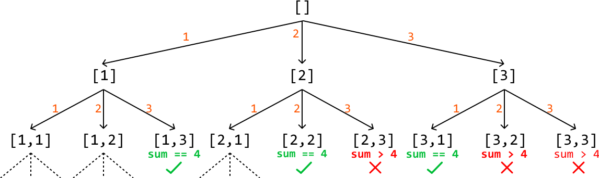
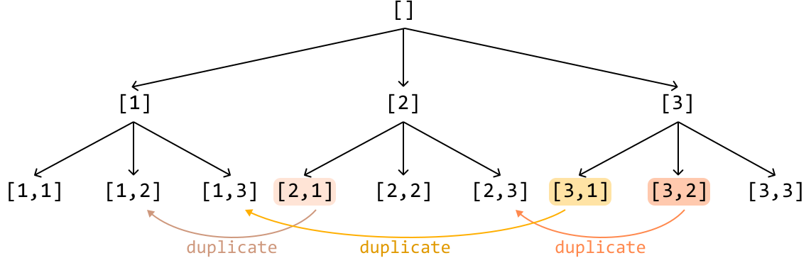
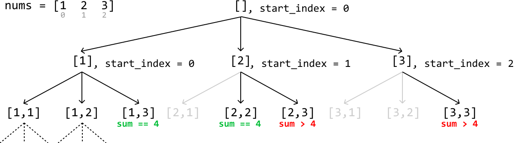
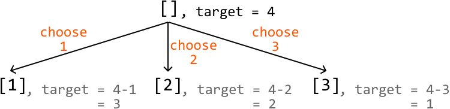
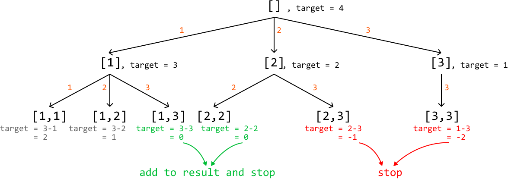

# Combinations of a Sum

Given an integer array and a target value, find **all unique combinations** in the array where the numbers in each combination sum to the target. Each number in the array may be used an unlimited number of times in the combination.

#### Example:

```python
Input: nums = [1, 2, 3], target = 4
Output: [[1, 1, 1, 1], [1, 1, 2], [1, 3], [2, 2]]

```

#### Constraints:

- All integers in nums are positive and unique.

- The target value is positive.

- The output must not contain duplicate combinations. For example, `[1, 1, 2]` and `[1, 2, 1]` are considered the same combination.

## Intuition

Since we can use each integer in the input array as many times as we like, we can create an infinite number of combinations. We certainly cannot explore combinations infinitely. So, to manage this, we need to narrow our search.

An important point that will help us with this is that all values in the integer array are positive integers. This means that as we add more values to a combination, its sum will increase. Therefore, we should **stop building a combination once its sum is equal to or exceeds the target value**.

Another thing we should be mindful of is duplicate combinations. Consider the input array [1, 2, 3]. The combinations [1, 3, 2, 1] and [2, 1, 3, 1] represent the same combination. To ensure a **universal representation**, we can represent this combination as [1, 1, 2, 3], where the integers appear in the same order as in the original array. To ensure every combination has only one version, we need to build the combinations so that they are all ordered this way.

With those two things in mind, let's think about how we find all combinations that sum to the target value. **Backtracking** is ideal for exploring all possible combinations, so let's start by considering the state space tree for this problem.

**State space tree**

The purpose of a state space tree is to show combinations getting built one number at a time. Consider the input array [1, 2, 3] and a target of 4. Let's start with the root node of the tree, which is an empty combination:


To figure out how to branch out from here, let's identify what decisions we can make. Each element can be included in a combination an unlimited number of times. So, this means we can make three decisions for an array of length 3: include each element from the array (remember that a branch in the state space tree represents a decision):

![Image represents a decision tree illustrating a choice between three options.  A central node, labeled '[]' (representin](./images/0a7cabd4_image-14-04-2-2QU2VSXF.svg)

Let's make the same decisions for each of these combinations as well to continue extending the state space tree. Remember that if any combination has a sum equal to 4 or exceeding 4, we stop extending those combinations. These two conditions are effectively our termination conditions:



One issue with this approach is that it resulted in duplicate combinations in our tree:

 



To avoid these duplicates, we should keep in mind our universal representation: each combination should be constructed such that its elements are listed in the same order as in the input array. We can enforce this by specifying an index '**`start_index`**' for each combination we create. This `start_index` points to a value in the input array and ensures that we can only add elements from this value onward. This way, we maintain the correct order and avoid duplicates in our combinations:



Initially, for the root combination, `start_index` is set to 0. As we recursively build each combination, `start_index` is updated to the index of the current element being added. By doing this, we ensure that in the next recursive call, we only consider elements from the updated index onward in the input array.

This maintains the required order and prevents duplicates because we never revisit previous elements. Since each combination is built by only adding elements that come after the current element in the input array, we avoid generating the same combination in a different order.

## Implementation

In our algorithm, the termination condition requires us to know the sum of the current combination. While we could use a separate variable to track the sum of each combination, this isn't necessary. Instead, we can repurpose our target value. **When we choose a number to a combination, we reduce the target value by that number**. This way, the target value dynamically tracks the remaining sum needed to reach the original target. We see how this works below, where the target gets reduced by the value we add to the combination:



This means that when we reach a target of 0, we've found a valid combination. If the target becomes negative, we can terminate the current branch of the search:



```python
from typing import List
    
def combinations_of_sum_k(nums: List[int], target: int) -> List[List[int]]:
    res = []
    dfs([], 0, nums, target, res)
    return res
    
def dfs(combination: List[int], start_index: int, nums: List[int], target: int,
        res: List[List[int]]) -> None:
    # Termination condition: If the target is equal to 0, we found a combination
    # that sums to 'k'.
    if target == 0:
        res.append(combination[:])
        return
    # Termination condition: If the target is less than 0, no more valid
    # combinations can be created by adding it to the current combination.
    if target < 0:
        return
    # Starting from start_index, explore all combinations after adding nums[i].
    for i in range(start_index, len(nums)):
        # Add the current number to create a new combination.
        combination.append(nums[i])
        # Recursively explore all paths that branch from this new combination.
        dfs(combination, i, nums, target - nums[i], res)
        # Backtrack by removing the number we just added.
        combination.pop()

```

```javascript
export function combinations_of_sum_k(nums, target) {
  const res = []
  dfs([], 0, nums, target, res)
  return res
}

function dfs(combination, startIndex, nums, target, res) {
  // Termination condition: If the target is equal to 0, we found a combination
  // that sums to 'k'.
  if (target === 0) {
    res.push([...combination])
    return
  }
  // Termination condition: If the target is less than 0, no more valid
  // combinations can be created by adding it to the current combination.
  if (target < 0) {
    return
  }
  // Starting from startIndex, explore all combinations after adding nums[i].
  for (let i = startIndex; i < nums.length; i++) {
    // Add the current number to create a new combination.
    combination.push(nums[i])
    // Recursively explore all paths that branch from this new combination.
    dfs(combination, i, nums, target - nums[i], res)
    // Backtrack by removing the number we just added.
    combination.pop()
  }
}

```

```java
import java.util.ArrayList;

public class Main {
    public ArrayList<ArrayList<Integer>> combinations_of_sum_k(ArrayList<Integer> nums, int target) {
        ArrayList<ArrayList<Integer>> res = new ArrayList<>();
        dfs(new ArrayList<>(), 0, nums, target, res);
        return res;
    }

    public void dfs(ArrayList<Integer> combination, int start_index,
                           ArrayList<Integer> nums, int target,
                           ArrayList<ArrayList<Integer>> res) {
        // Termination condition: If the target is equal to 0, we found a combination
        // that sums to 'k'.
        if (target == 0) {
            res.add(new ArrayList<>(combination));
            return;
        }
        // Termination condition: If the target is less than 0, no more valid
        // combinations can be created by adding it to the current combination.
        if (target < 0) {
            return;
        }
        // Starting from start_index, explore all combinations after adding nums[i].
        for (int i = start_index; i < nums.size(); i++) {
            // Add the current number to create a new combination.
            combination.add(nums.get(i));
            // Recursively explore all paths that branch from this new combination.
            dfs(combination, i, nums, target - nums.get(i), res);
            // Backtrack by removing the number we just added.
            combination.remove(combination.size() - 1);
        }
    }
}

```

### Complexity Analysis

**Time complexity:** The time complexity of `combinations_of_sum_k` is O(n^{target/m}), where n denotes the length of the array, and m denotes the smallest candidate. This is because, in the worst case, we always add the smallest candidate m to our combination. The recursion tree will branch down until the sum of the smallest candidates reaches or exceeds the target. This results in a tree depth of target/m. Since the function makes a recursive call for up to n candidates at each level of the recursion, the branching factor is n, giving us the time complexity of O(n^{target/m}).

**Space complexity:** The space complexity is O(target/m), which includes:

- The recursive call stack depth, which is at most target/m in depth.

- The combination list can also require at most O(target/m) space since the longest combination would consist of the smallest element m repeated target/m times.