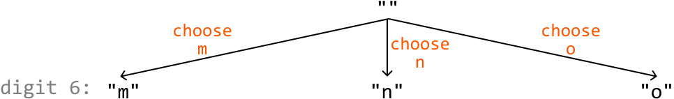
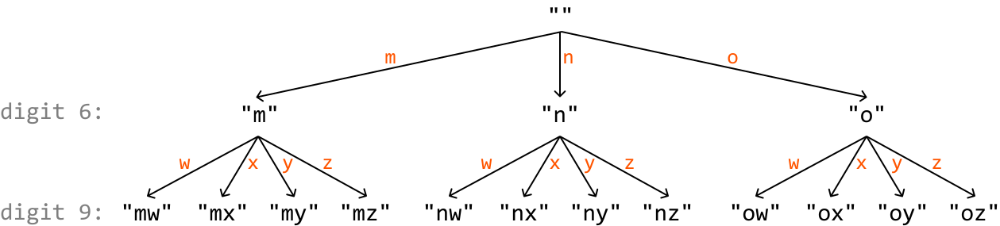
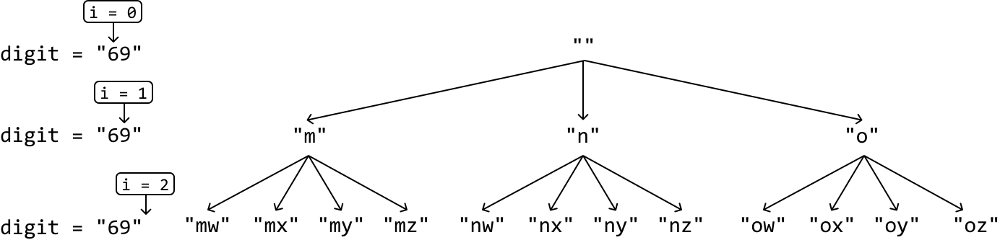
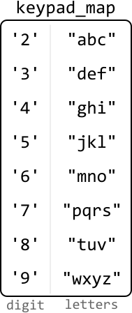

# Phone Keypad Combinations

You are given a string containing digits from 2 to 9 inclusive. Each digit maps to a set of letters as on a traditional phone keypad:

| 1 | 2 abc | 3 def |
| 4 ghi | 5 jkl | 6 mno |
| 7 pqrs | 8 tuv | 9 wxyz |

Return **all possible letter combinations** the input digits could represent.

#### Example:

```python
Input: digits = '69'
Output: ['mw', 'mx', 'my', 'mz', 'nw', 'nx', 'ny', 'nz', 'ow', 'ox', 'oy', 'oz']

```

## Intuition

At each digit in the string, we have a decision to make: which letter will this digit represent? Based on this decision, let's illustrate the state space tree that represents the choices at each digit of the input string.

**State space tree**

Consider the input string "69". Let's start with the root node of the tree, which is an empty string:

 


At the first digit, 6, we have the choice of starting our combination with 'm', 'n', or 'o':



For each of these combinations we've created, we now have a new decision to make: which letter of digit 9 ('w', 'x', 'y', 'z') should we choose? These choices are illustrated below:



One important thing missing from this state space tree is information on which digit we're making a decision on at each node. We can use an index `i` to determine which digit we're considering at each node:



The final level of this decision tree (i.e., when `i == n`, where `n` denotes the length of the input string) represents all possible combinations that can be created from the provided string. Similar to our approach in *Find All Subsets*, let's use **backtracking** to obtain these keypad combinations.

**Mapping digits to letters**

The final thing we need to figure out is a way to determine which letters correspond to which digits. A hash map is great for this purpose. In the hash map, digits are the keys, and the associated sets of letters are their values. This allows us to access the letters in constant time:



## Implementation

```python
def phone_keypad_combinations(digits: str) -> List[str]:
    keypad_map = {
        '2': 'abc', '3': 'def', '4': 'ghi', '5': 'jkl',
        '6': 'mno', '7': 'pqrs', '8': 'tuv', '9': 'wxyz'
    }
    res = []
    backtrack(0, [], digits, keypad_map, res)
    return res

def backtrack(i: int, curr_combination: List[str], digits: str,
             keypad_map: Dict[str, str], res: List[str]) -> None:
    # Termination condition: if all digits have been considered, add the
    # current combination to the output list.
    if len(curr_combination) == len(digits):
        res.append("".join(curr_combination))
        return
    for letter in keypad_map[digits[i]]:
       # Add the current letter.
        curr_combination.append(letter)
        # Recursively explore all paths that branch from this combination.
        backtrack(i + 1, curr_combination, digits, keypad_map, res)
        # Backtrack by removing the letter we just added.
        curr_combination.pop()

```

```javascript
export function phone_keypad_combinations(digits) {
  const keypadMap = {
    2: 'abc',
    3: 'def',
    4: 'ghi',
    5: 'jkl',
    6: 'mno',
    7: 'pqrs',
    8: 'tuv',
    9: 'wxyz',
  }
  const res = []
  // Special case: digits = "" should return [""].
  if (digits.length === 0) {
    return ['']
  }
  if (!digits.length) return res
  backtrack(0, [], digits, keypadMap, res)
  return res
}

function backtrack(i, currCombination, digits, keypadMap, res) {
  // Termination condition: if all digits have been considered, add the
  // current combination to the output list.
  if (currCombination.length === digits.length) {
    res.push(currCombination.join(''))
    return
  }
  for (const letter of keypadMap[digits[i]]) {
    // Add the current letter.
    currCombination.push(letter)
    // Recursively explore all paths that branch from this combination.
    backtrack(i + 1, currCombination, digits, keypadMap, res)
    // Backtrack by removing the letter we just added.
    currCombination.pop()
  }
}

```

```java
import java.util.ArrayList;
import java.util.HashMap;

public class Main {
    public static ArrayList<String> phone_keypad_combinations(String digits) {
        HashMap<Character, String> keypad_map = new HashMap<>();
        keypad_map.put('2', "abc");
        keypad_map.put('3', "def");
        keypad_map.put('4', "ghi");
        keypad_map.put('5', "jkl");
        keypad_map.put('6', "mno");
        keypad_map.put('7', "pqrs");
        keypad_map.put('8', "tuv");
        keypad_map.put('9', "wxyz");
        ArrayList<String> res = new ArrayList<>();
        backtrack(0, new StringBuilder(), digits, keypad_map, res);
        return res;
    }

    public static void backtrack(int i, StringBuilder curr_combination, String digits,
                                 HashMap<Character, String> keypad_map, ArrayList<String> res) {
        // Termination condition: if all digits have been considered, add the
        // current combination to the output list.
        if (curr_combination.length() == digits.length()) {
            res.add(curr_combination.toString());
            return;
        }
        String letters = keypad_map.get(digits.charAt(i));
        for (int j = 0; j < letters.length(); j++) {
            char letter = letters.charAt(j);
            // Add the current letter.
            curr_combination.append(letter);
            // Recursively explore all paths that branch from this combination.
            backtrack(i + 1, curr_combination, digits, keypad_map, res);
            // Backtrack by removing the letter we just added.
            curr_combination.deleteCharAt(curr_combination.length() - 1);
        }
    }
}

```

### Complexity Analysis

**Time complexity:** The time complexity of `phone_keypad_combinations` is O(n· 4^n). This is because the state space tree will branch down until a decision is made for all n elements. This results in a tree of height n with a branching factor of 4 since there are up to 4 decisions we can make at each digit. For each of the 4^n combinations created, we convert it into a string and add it to the output list, which takes O(n) time per combination. This results in a total time complexity of O(n· 4^n).

**Space complexity:** The space complexity is O(n) due to the recursive call stack, which can grow up to a maximum depth of n. The `keypad_map` only takes constant space since there are only 8 key-value pairs.

## Interview Tip

*Tip: Check if you can skip trivial implementations.*

During an interview, it's crucial to manage your time effectively. If you encounter a trivial and time-consuming task, such as creating the keypad_map in this problem, it's possible the interviewer may allow you to skip it or implement it later if there's time left in the interview. Ensure you at least briefly mention how the implementation you're skipping would work before requesting to move on to the core logic of the problem.