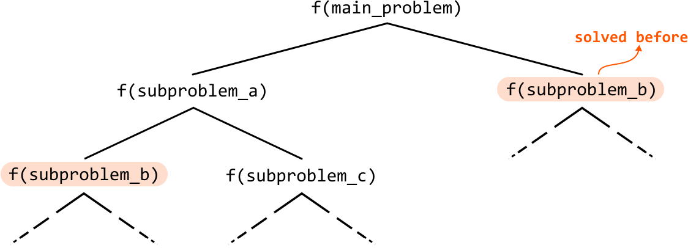
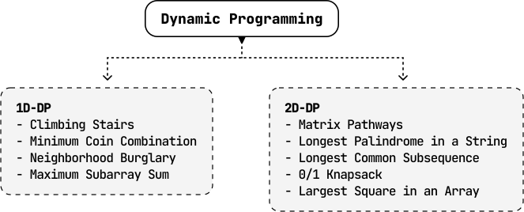

# Introduction to Dynamic Programming

Dynamic programming (DP) may seem daunting at first, but we’ll break it down into manageable concepts and techniques. First, let’s get an idea of what DP aims to do by considering the bigger picture.

Some problems can be broken down into **subproblems**, where each subproblem is a smaller version of the main problem. These subproblems may themselves be broken down into more subproblems as well. This isn’t a foreign concept to us. Recursion is often used to solve problems like these, where we make recursive calls to solve each subproblem.

However, in the recursive process, it’s possible to generate and solve the same subproblem multiple times, which can be unnecessarily expensive.

DP is the antidote to this. It’s a technique that stores solutions to each subproblem, so they can be reused when they’re needed again. In other words, it’s an efficient tool that **ensures each subproblem is solved at most one time**. This can greatly increase the performance of an algorithm.

**The DP process**

DP is often perceived as challenging, but it follows a pretty consistent problem-solving process, best demonstrated with an example. First, we'll briefly explain some key DP terms, and then dive into the *Climbing Stairs* problem to learn how to identify a DP problem and develop a DP solution.

- **Optimal substructure:** the optimal solution to a problem can be constructed from the optimal solutions to its subproblems.

- **Overlapping subproblems:** if the same subproblems are solved repeatedly during the problem-solving process.

- **Recurrence relation:** a formula that expresses the solution to the problem in terms of the solutions to its subproblems.

- **Base cases:** the simplest instances of the problem where the solution is already known, without needing to be decomposed into more subproblems.

The first two terms are essential attributes that a problem must have to be solvable using DP. The last two terms are essential components in every DP solution. These definitions may seem abstract now, but keep them in mind as they will become clearer in the context of a problem.

## Real-world Example

**Word segmentation:** Search engines use DP in a process called “word segmentation.” When users enter a search query without spaces, DP is employed to determine if white spaces can be added to form valid words. For example, given a query without spaces (like “bestrestaurants”), DP checks all possible ways to insert spaces (“best restaurants,” “best rest aunts”) by solving each segment (subproblem) separately, and storing their solutions to avoid recalculation.

## Chapter Outline

The nature of each DP problem in this chapter is quite unique, but for simplicity, we’ve grouped them into two categories: one-dimensional DP (1D-DP), and two-dimensional DP (2D-DP).