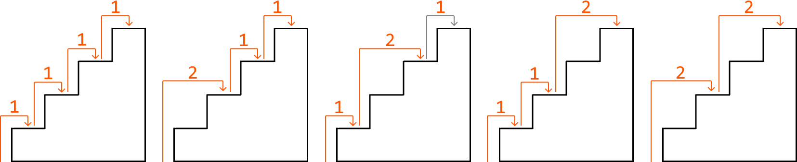
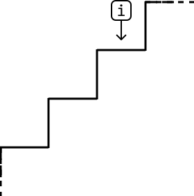
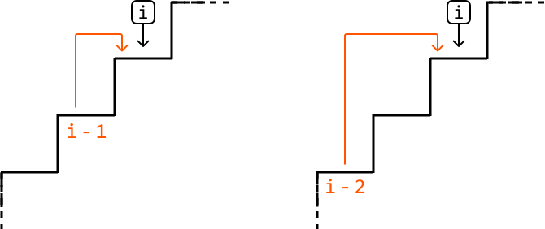

# Climbing Stairs

Determine the **number of distinct ways** to climb a staircase of `n` steps by taking either 1 or 2 steps at a time.

#### Example:



```python
Input: n = 4
Output: 5

```

## Intuition - Top-Down

A brute force solution to this problem is to go through all possible combinations of moving 1 or 2 steps up the stairs until reaching the top. How would we do this? Think about how to get to stair `i`:



One thing we know for sure is that to reach step `i`, we need to reach it from either step `i - 1`, or step `i - 2` since we can only climb 1 or 2 steps at a time:



This is all the information we need. If we want to know all the different ways we can get to step `i`, we just need to know:

- The number of ways to get to step `i - 1` (`climbing_stairs(i - 1)`).

- The number of ways to get to step `i - 2` (`climbing_stairs(i - 2)`).

This highlights that this problem has an **optimal substructure** where, in order to solve `climbing_stairs(n)`, we need the answers to two of its subproblems. We can translate this to a **recurrence relation**:

> 
> 
> `climbing_stairs(n) = climbing_stairs(n - 1) + climbing_stairs(n - 2)`
> 
> 

Let’s first implement this using recursion.

To do this, we’ll need to identify the **base cases**, which handle the simplest subproblems. The simplest versions of this problem occur when the number of steps is 1 or 2. If n equals 1, we return 1 since the only way to reach step 1 is to climb 1 step. If n equals 2, return 2 since there are two ways to reach step 2.

If we apply this recursive logic to a staircase of 6 steps, this is what the recursion tree would look like:


This solution is considered a **top-down solution** as it starts from the main problem, and recursively breaks it down into smaller subproblems as it progresses down the recursive tree.

You may have noticed in the recursion tree that we do some repeated work by calling the same subproblem multiple times (e.g., `climbing_stairs(4)` is called twice). This highlights the existence of **overlapping subproblems**. This isn't a big issue for short staircases, but for a taller one with more steps, it can result in a lot of repeated calculations of subproblems we’ve already solved. This is where memoization comes into play.

**Memoization**

Storing the result of each subproblem the first time we solve it, then reusing these stored results when needed, is a technique known as memoization. For example, after we calculate the subproblem of `n = 3` (`climbing_stairs(3)`) for the first time, we don’t need to calculate it again; we can just fetch the already-calculated result for `n = 3`. The same applies to `n = 4`. This greatly reduces the size of the recursion tree:


We use a **hash map** for memoization to store the results of subproblems for constant-time access. For example, after calculating the result for the subproblem `n = 3`, we store the result in the hash map as a value, where the key is 3.

As we can see, we’ve successfully implemented a DP solution using top-down memoization. We identified the subproblems, used them to create the recurrence relation, specified our base cases, and applied memoization to ensure each subproblem is solved only once.

## Implementation - Top-Down

```python
memo = {}
        
def climbing_stairs_top_down(n: int) -> int:
    # Base cases: With a 1-step staircase, there’s only one way to climb it.
    # With a 2-step staircase, there are two ways to climb it.
    if n <= 2:
        return n
    if n in memo:
        return memo[n]
    # The number of ways to climb to the n-th step is equal to the sum of the number
    # of ways to climb to step n - 1 and to n - 2.
    memo[n] = climbing_stairs_top_down(n - 1) + climbing_stairs_top_down(n - 2)
    return memo[n]

```

```javascript
const memo = {}

export function climbing_stairs_top_down(n) {
  // Base cases: With a 1-step staircase, there’s only one way to climb it.
  // With a 2-step staircase, there are two ways to climb it.
  if (n <= 2) {
    return n
  }
  if (memo[n] !== undefined) {
    return memo[n]
  }
  // The number of ways to climb to the n-th step is equal to the sum of the number
  // of ways to climb to step n - 1 and to n - 2.
  memo[n] = climbing_stairs_top_down(n - 1) + climbing_stairs_top_down(n - 2)
  return memo[n]
}

```

```java
import java.util.HashMap;

public class Main {
    private HashMap<Integer, Integer> memo = new HashMap<>();

    public int climbing_stairs_top_down(int n) {
        // Base cases: With a 1-step staircase, there’s only one way to climb it.
        // With a 2-step staircase, there are two ways to climb it.
        if (n <= 2) {
            return n;
        }
        if (memo.containsKey(n)) {
            return memo.get(n);
        }
        // The number of ways to climb to the n-th step is equal to the sum of the number
        // of ways to climb to step n - 1 and to n - 2.
        int result = climbing_stairs_top_down(n - 1) + climbing_stairs_top_down(n - 2);
        memo.put(n, result);
        return result;
    }
}

```

### Complexity Analysis

**Time complexity:**

- Without memoization, the time complexity of `climbing_stairs_top_down` is O(2^n) because the depth of the recursion tree is n, and its branching factor is 2 since we make 2 recursive calls at each point in the tree.

- With memoization, we ensure each subproblem is solved only once. Since there are n possible subproblems (one for each step from step 1 to step n), the time complexity is O(n).

**Space complexity:** The space complexity is O(n) due to the recursive call stack, which grows to a height of n. The memoization array also contributes to the space occupied by storing n key-value pairs.

## Intuition - Bottom-Up

Generally, any problem that can be solved using top-down memoization can also be solved using a bottom-up DP approach, where we translate the memoization array to a DP array. Let's explore how this works.

**Translating the memoization array to a DP array**

Think about what each value in the DP array represents. We want this array to store the answers to our subproblems (`i`.e., `dp[i]` should store the number of ways we can reach step `i`). Now, remember that our memoization array stores the same thing. In other words, **`dp[i]` and `memo[i]` store the same result**.

In our top-down implementation, the memoization stores results like so:

`memo[n] = climbing_stairs(n - 1) + climbing_stairs(n - 2)`

However, if the results of `climbing_stairs(n - 1)` and `climbing_stairs(n - 2)` were already calculated and memoized, this is what would actually be going on:

`memo[n] = memo[n - 1] + memo[n - 2]`

Now that we have this tabular relationship for the memoization array, simply change “`memo`” to “`dp`” to get the DP relationship:

`dp[n] = dp[n - 1] + dp[n - 2]`

We call this a **bottom-up solution** because we need to calculate the solutions to smaller subproblems before we can solve the larger ones. In other words, we "build up" to the main solution as opposed to the top-down solution, where we start with the main problem, n, and work our way down.

**Base cases**

Our base cases stay the same: the answers to `dp[1]` and `dp[2]` are 1 and 2, respectively.

**Return statement**

In our top-down solution, we return `memo[n]`. Since there’s a one-to-one relationship between the memoization array and the DP array, we can just return `dp[n]` in our bottom-up solution.

## Implementation - Bottom-Up

```python
def climbing_stairs_bottom_up(n: int) -> int:
    if n <= 2:
        return n
    dp = [0] * (n + 1)
    # Base cases.
    dp[1], dp[2] = 1, 2
    # Starting from step 3, calculate the number of ways to reach each step until the
    # n-th step.
    for i in range(3, n + 1):
        dp[i] = dp[i - 1] + dp[i - 2]
    return dp[n]

```

```javascript
export function climbing_stairs_bottom_up(n) {
  if (n <= 2) {
    return n
  }
  const dp = new Array(n + 1).fill(0)
  // Base cases.
  dp[1] = 1
  dp[2] = 2
  // Starting from step 3, calculate the number of ways to reach each step until the n-th step.
  for (let i = 3; i <= n; i++) {
    dp[i] = dp[i - 1] + dp[i - 2]
  }
  return dp[n]
}

```

```java
public class Main {
    public int climbing_stairs_bottom_up(int n) {
        if (n <= 2) {
            return n;
        }
        int[] dp = new int[n + 1];
        // Base cases.
        dp[1] = 1;
        dp[2] = 2;
        // Starting from step 3, calculate the number of ways to reach each step until the
        // n-th step.
        for (int i = 3; i <= n; i++) {
            dp[i] = dp[i - 1] + dp[i - 2];
        }
        return dp[n];
    }
}

```

### Complexity Analysis

**Time complexity:** The time complexity of `climbing_stairs_bottom_up` is O(n) as we iterate through n elements of the DP array.

**Space complexity:** The space complexity is O(n) due to the space taken up by the DP array, which contains n+1 elements.

## Optimization - Bottom Up

An important thing to notice is that in the DP solution, we only ever need to access the previous two values of the DP array (at `i - 1` and `i - 2`) to calculate the current value (at `i`). This means we don’t need to store the entire DP array.

Instead, we can use two variables to keep track of the previous two values:

- `one_step_before`: to store the value of `dp[i - 1]`.

- `two_steps_before`: to store the value of `dp[i - 2]`.

As we iterate through the steps, we update these two variables to always hold the values for the previous two steps. This approach retains the time complexity of O(n), while reducing space complexity to O(1). The adjusted implementation is below:

```python
def climbing_stairs_bottom_up_optimized(n: int) -> int:
    if n <= 2:
        return n
    # Initialize 'one_step_before' and 'two_steps_before' with the base cases.
    one_step_before, two_steps_before = 2, 1
    for i in range(3, n + 1):
        # Calculate the number of ways to reach the current step.
        current = one_step_before + two_steps_before
        # Update the values for the next iteration.
        two_steps_before = one_step_before
        one_step_before = current
    return one_step_before

```

```javascript
export function climbing_stairs(n) {
  if (n <= 2) {
    return n
  }
  // Initialize 'oneStepBefore' and 'twoStepsBefore' with the base cases.
  let oneStepBefore = 2
  let twoStepsBefore = 1
  for (let i = 3; i <= n; i++) {
    // Calculate the number of ways to reach the current step.
    const current = oneStepBefore + twoStepsBefore
    // Update the values for the next iteration.
    twoStepsBefore = oneStepBefore
    oneStepBefore = current
  }
  return oneStepBefore
}

```

```java
public class Main {
    public int climbing_stairs(int n) {
        if (n <= 2) {
            return n;
        }
        // Initialize 'one_step_before' and 'two_steps_before' with the base cases.
        int one_step_before = 2, two_steps_before = 1;
        for (int i = 3; i <= n; i++) {
            // Calculate the number of ways to reach the current step.
            int current = one_step_before + two_steps_before;
            // Update the values for the next iteration.
            two_steps_before = one_step_before;
            one_step_before = current;
        }
        return one_step_before;
    }
}

```

## Interview Tip

*Tip: If you're having trouble coming up with the bottom-up solution, try starting with the top-down solution.*

Designing a top-down solution first is often easier because we can first identify the recurrence relation, and then apply memoization to optimize it. The bottom-up solution, on the other hand, requires considering both steps at the same time. In addition, a bottom-up solution starts by solving subproblems first, which can be less intuitive, whereas a top-down solution starts with the main problem before working downward.

Once you have a working top-down solution, you can translate it into a bottom-up solution as described in the intuition above. Over time, you'll get better at mapping a recurrence relation directly to a bottom-up tabular relation, allowing you to skip the top-down approach.