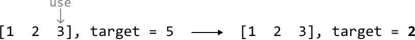
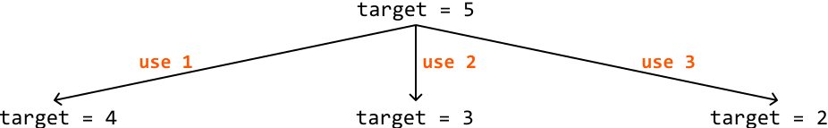
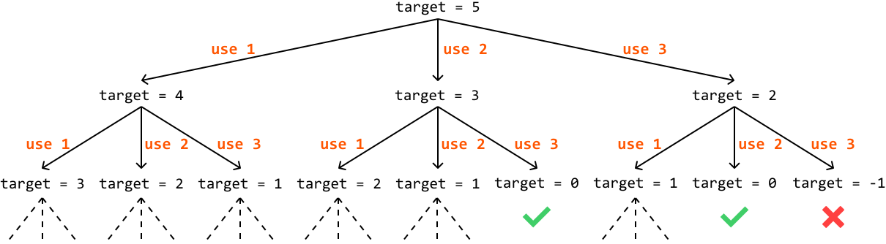
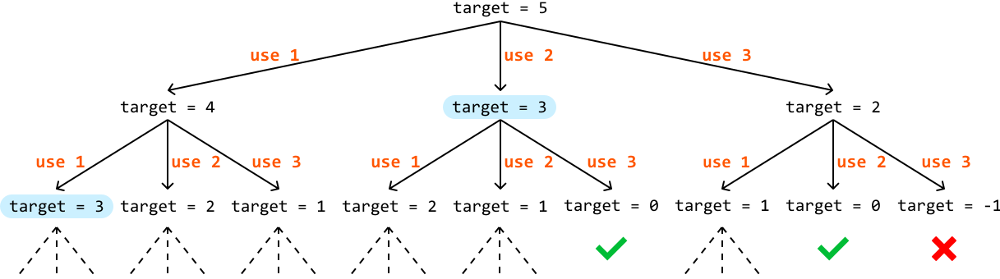
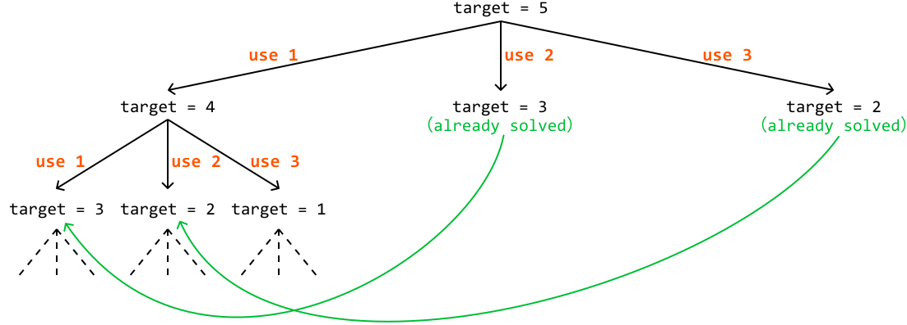

# Minimum Coin Combination

You are given an array of coin values and a target amount of money. Return the **minimum number of coins** needed to total the target amount. If this isn't possible, return ‐1. You may assume there's an unlimited supply of each coin.

#### Example 1:

```python
Input: coins = [1, 2, 3], target = 5
Output: 2

```

Explanation: Use one 2-dollar coin and one 3-dollar coin to make 5 dollars.

#### Example 2:

```python
Input: coins = [2, 4], target = 5
Output: -1

```

## Intuition - Top-Down

In this problem, there’s no restriction on the number of coins we can use, which makes a brute force approach that tries every possible coin combination impossible, due to the infinite number of possible combinations. This indicates the need for a more efficient method.

Consider the example below:


If we use a 3-dollar coin from the array, then we’ll only need 2 dollars more to make 5. This gives us a new target: find the fewest number of coins needed to make 2 dollars:



This indicates we’ve identified subproblems within the main problem, where **each subproblem requires finding the fewest number of coins needed to make a smaller target**.

Each coin we use creates a new subproblem. For example, using a 1-dollar coin changes our target from 5 to 4 dollars. Let's visualize how these smaller targets, representing new subproblems, are created after using each coin:



In extension, each of these subproblems can be solved by breaking them down into further subproblems:



A path that ends with a target of 0 means the coins used in that path add up to 5. If the target becomes negative, it means the path is invalid, so we should stop extending the path.

We’ve observed how new subproblems are created, but haven’t yet addressed how to attain the solutions to them. Remember, each subproblem needs to return the minimum number of coins needed to reach its target.

Consider the main problem with a target of 5. To solve this, we first need to find the minimum number of coins needed to reach each of its three subproblems. The solution to the main problem is the smallest result among these subproblems, plus 1, to account for the coin used to create the subproblem. This highlights an **optimal substructure** in the problem, allowing us to define the following **recurrence relation**:

> 
> 
> `min_coin_combination(target) = 1 + min(min_coin_combination(target - coin_i) | coin_i ∈ coins)`
> 
> 

**Base case**

Naturally, we need a base case for this formula. The base case occurs when the target equals 0, which is the simplest version of this problem, as no coins are needed to meet the target. In this case, we return 0.

**Memoization**

An important thing to notice is that we might end up solving the same subproblem multiple times. For instance, we calculate the subproblem `target = 3` two times in the previous example:



This highlights the existence of **overlapping subproblems**. Memoization improves our solution by storing the solutions to subproblems as they are computed, ensuring each subproblem is solved only once. This eliminates redundant calculations, and can significantly reduce the size of the recursion tree:



## Implementation - Top-Down**

from typing import List, Dict
        

```python
def min_coin_combination_top_down(coins: List[int], target: int) -> int:
    res = top_down_dp(coins, target, {})
    return -1 if res == float('inf') else res
    
def top_down_dp(coins: List[int], target: int, memo: Dict[int, int]) -> int:
    # Base case: if the target is 0, then 0 coins are needed to reach it.
    if target == 0:
        return 0
    if target in memo:
        return memo[target]
    # Initialize 'min_coins' to a large number.
    min_coins = float('inf')
    for coin in coins:
        # Avoid negative targets.
        if coin <= target:
            # Calculate the minimum number of coins needed if we use the current coin.
            min_coins = min(min_coins, 1 + top_down_dp(coins, target - coin, memo))
    memo[target] = min_coins
    return memo[target]

```

```javascript
export function min_coin_combination_top_down(coins, target) {
  const memo = {}
  const res = topDownDP(coins, target, memo)
  return res === Infinity ? -1 : res
}

function topDownDP(coins, target, memo) {
  // Base case: if the target is 0, then 0 coins are needed to reach it.
  if (target === 0) {
    return 0
  }
  if (target in memo) {
    return memo[target]
  }
  // Initialize 'minCoins' to a large number.
  let minCoins = Infinity
  for (const coin of coins) {
    // Avoid negative targets.
    if (coin <= target) {
      // Calculate the minimum number of coins needed if we use the current coin.
      const result = topDownDP(coins, target - coin, memo)
      if (result !== Infinity) {
        minCoins = Math.min(minCoins, 1 + result)
      }
    }
  }
  memo[target] = minCoins
  return minCoins
}

```

```java
import java.util.ArrayList;
import java.util.HashMap;
import java.util.Map;

public class Main {
    public int min_coin_combination_top_down(ArrayList<Integer> coins, int target) {
        int res = top_down_dp(coins, target, new HashMap<>());
        // Return -1 if the result is infinity.
        return res == Integer.MAX_VALUE ? -1 : res;
    }

    private int top_down_dp(ArrayList<Integer> coins, int target, Map<Integer, Integer> memo) {
        // Base case: if the target is 0, then 0 coins are needed to reach it.
        if (target == 0) {
            return 0;
        }
        if (memo.containsKey(target)) {
            return memo.get(target);
        }
        // Initialize 'min_coins' to a large number.
        int min_coins = Integer.MAX_VALUE;
        for (Integer coin : coins) {
            // Avoid negative targets.
            if (coin <= target) {
                // Calculate the minimum number of coins needed if we use the current coin.
                int sub_result = top_down_dp(coins, target - coin, memo);
                if (sub_result != Integer.MAX_VALUE) {
                    min_coins = Math.min(min_coins, 1 + sub_result);
                }
            }
        }
        memo.put(target, min_coins);
        return memo.get(target);
    }
}

```

### Complexity Analysis

**Time complexity:**

- Without memoization, the time complexity of `min_coin_combination_top_down` would be O(n^{target/m}), where n denotes the number of coins, and m denotes the smallest coin value. The recursion tree has a branch factor of n because we make a recursive call for up to n coins. The depth of the tree is target/m because in the worst case, we continually reduce the target value by the smallest coin.

- With memoization, each subproblem is solved only once. Since there are at most target subproblems, and we iterate through all n coins for each subproblem, the time complexity is O(target· n).

**Space complexity:** The space complexity is O(target) because, while the maximum depth of the recursive call stack is only target/m, the memoization array stores up to target key-value pairs.

## Intuition - Bottom-Up

Using the same technique discussed in the *Climbing Stairs* problem, we can convert our top-down solution to a bottom-up one by translating the memoization array to a DP array.

First, let’s look at the value our memoization array stores, as shown in the following code snippet of the top-down implementation:

```python
for coin in coins:
    if coin <= target:
        min_coins = min(min_coins, 1 + top_down_dp(coins, target - coin, memo))
memo[target] = min_coins

```

```javascript
for (const coin of coins) {
  if (coin <= target) {
    minCoins = Math.min(minCoins, 1 + topDownDP(coins, target - coin, memo))
  }
}
memo[target] = minCoins

```

```java
for (int coin : coins) {
    if (coin <= target) {
        minCoins = Math.min(minCoins, 1 + topDownDP(coins, target - coin, memo));
    }
}
memo[target] = minCoins;

```

Translating this to a DP array provides the following code:

```python
for coin in coins:
    if coin <= target:
        dp[target] = min(dp[target], 1 + dp[target - coin])

```

```javascript
for (const coin of coins) {
  if (coin <= target) {
    dp[target] = Math.min(dp[target], 1 + dp[target - coin])
  }
}

```

```java
for (int coin : coins) {
    if (coin <= target) {
        dp[target] = Math.min(dp[target], 1 + dp[target - coin]);
    }
}

```

This code snippet only includes the calculation for one target value. In our top-down solution, this calculation is repeated for every target value from the initial target, down to the base case (`target == 0`).

In the bottom-up solution, we need to reverse this order by starting with the base case and working our way up to the initial target value (hence the name “bottom-up”). This is necessary because our DP array calculation depends on the DP values of smaller targets. So, we need to calculate the answers for smaller targets first. This can be done using a for-loop from 1 to the target (starting at 1 since the base case of 0 is already set):

```python
for t in range(1, target + 1):
    for coin in coins:
        if coin <= t:
            dp[t] = min(dp[t], 1 + dp[t - coin])

```

```javascript
for (let t = 1; t <= target; t++) {
  for (const coin of coins) {
    if (coin <= t) {
      dp[t] = Math.min(dp[t], 1 + dp[t - coin])
    }
  }
}

```

```java
for (int t = 1; t <= target; t++) {
    for (int coin : coins) {
        if (coin <= t) {
            dp[t] = Math.min(dp[t], 1 + dp[t - coin]);
        }
    }
}

```

Once this is done, the answer to the problem will be stored in `dp[target]`.

## Implementation - Bottom-Up**

```python
def min_coin_combination_bottom_up(coins: List[int], target: int) -> int:
    # The DP array will store the minimum number of coins needed for each amount. Set
    # each element to a large number initially.
    dp = [float('inf')] * (target + 1)
    # Base case: if the target is 0, then 0 coins are needed.
    dp[0] = 0
    # Update the DP array for all target amounts greater than 0.
    for t in range(1, target + 1):
        for coin in coins:
            if coin <= t:
                dp[t] = min(dp[t], 1 + dp[t - coin])
    return dp[target] if dp[target] != float('inf') else -1

```

```javascript
export function min_coin_combination_bottom_up(coins, target) {
  // The DP array will store the minimum number of coins needed for each amount.
  // Set each element to a large number initially.
  const dp = new Array(target + 1).fill(Infinity)
  // Base case: if the target is 0, then 0 coins are needed.
  dp[0] = 0
  // Update the DP array for all target amounts greater than 0.
  for (let t = 1; t <= target; t++) {
    for (const coin of coins) {
      if (coin <= t) {
        dp[t] = Math.min(dp[t], 1 + dp[t - coin])
      }
    }
  }
  return dp[target] !== Infinity ? dp[target] : -1
}

```

```java
import java.util.ArrayList;

public class Main {
    public int min_coin_combination_bottom_up(ArrayList<Integer> coins, int target) {
        // The DP array will store the minimum number of coins needed for each amount. Set
        // each element to a large number initially.
        int[] dp = new int[target + 1];
        for (int i = 1; i <= target; i++) {
            dp[i] = Integer.MAX_VALUE;
        }
        // Base case: if the target is 0, then 0 coins are needed.
        dp[0] = 0;
        // Update the DP array for all target amounts greater than 0.
        for (int t = 1; t <= target; t++) {
            for (Integer coin : coins) {
                if (coin <= t && dp[t - coin] != Integer.MAX_VALUE) {
                    dp[t] = Math.min(dp[t], 1 + dp[t - coin]);
                }
            }
        }
        return dp[target] == Integer.MAX_VALUE ? -1 : dp[target];
    }
}

```

### Complexity Analysis

**Time complexity:** The time complexity of `min_coin_combination_bottom_up` is O(targetn) because we loop through all n coins for each value between 1 and target.

**Space complexity:** The space complexity is O(target) due to the space occupied by the DP array, which is of size target+1.

## Interview Tip

*Tip: When a problem asks for the minimum or maximum of something, it might be a DP problem.*

If you spot keywords like "minimum", "maximum", "longest", or "shortest", in the problem description, consider whether a DP approach might be appropriate, as many DP problems involve optimizing a certain value, such as finding the *minimum* cost, or *longest* sequence.