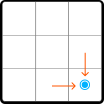
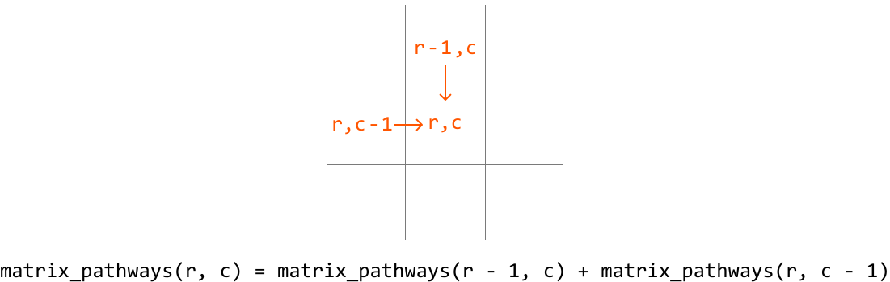
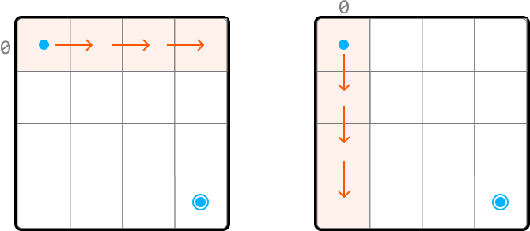
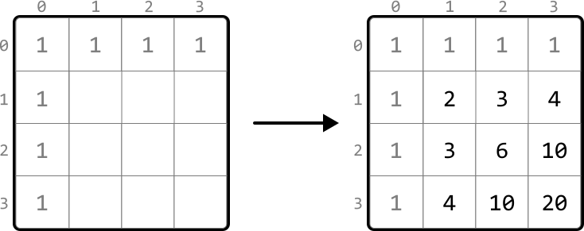
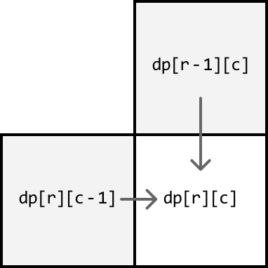
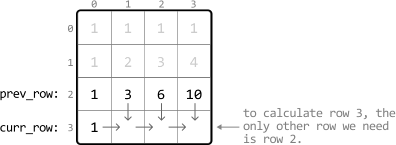

# Matrix Pathways

You are positioned at the top-left corner of a `m × n` matrix, and can only move **downward** or **rightward** through the matrix. Determine the **number of unique pathways** you can take to reach the bottom-right corner of the matrix.

#### Example:


```python
Input: m = 3, n = 3
Output: 6

```

#### Constraints:

- `m, n ≥ 1`

## Intuition

At each cell, we can either move right or move down. No matter which direction we choose at any point, it will always move us closer to the destination. This means we just need to keep moving either right or down until we can no longer do so, at which point we’ve reached the bottom-right corner.

Let's think about this problem backward. Assume we have already reached the bottom-right corner. How did we get here? We know for certain we came from either the cell directly above, or the cell directly to the left of the current position.



This is equally true for any cell on the matrix, which means a generalization can be made: the number of paths to any cell is equal to the sum of the number of paths to the cell above it and the cell to its left.



This demonstrates the existence of subproblems, and that this problem has an **optimal substructure**, where we need to solve two subproblems in order to solve the main problem. This makes this problem well-suited for DP. So, let’s translate the above **recurrence relation** to a DP formula:

> 
> 
> `dp[r][c] = dp[r - 1][c] + dp[r][c - 1]`, where `dp[r][c]` represents the total number of paths that lead to cell (`r`, `c`).
> 
> 

Before populating the DP table, we need to know our base cases.

**Base cases**

We know `dp[0][0]` should be 1 because there’s only one path leading to cell (0, 0).

What else do we know for certain? Since we can only move right or down, once we leave a row or column, we can never return to it because we can't move left or up. This means, for any cell in row 0 or column 0, there’s only one path to those cells:



Therefore, we can set all cells in row 0 and column 0 to 1 as the base cases.

Problem-solving tip: another way to identify row 0 and column 0 as base cases is by examining the DP formula. Since we need the values from row `r - 1` and column `c - 1` to populate `dp[r][c]`, all values at `r = 0` and `c = 0` must be pre-populated before using the formula to avoid index out-of-bound errors.

**Populating the DP table**

Once the base cases are set, we can populate the remaining DP table, starting from cell (1, 1), using our DP formula (`dp[r][c] = dp[r-1][c] + dp[r][c-1]`):



After we fill in the DP table, we can return **`dp[m - 1][n - 1]`**, which contains the number of paths to the bottom-right corner.

## Implementation

```python
def matrix_pathways(m: int, n: int) -> int:
    # Base cases: Set all cells in row 0 and column 0 to 1. We can do this by
    # initializing all cells in the DP table to 1.
    dp = [[1] * n for _ in range(m)]
    # Fill in the rest of the DP table.
    for r in range(1, m):
        for c in range(1, n):
            # Paths to current cell = paths from above + paths from left.
            dp[r][c] = dp[r - 1][c] + dp[r][c - 1]
    return dp[m - 1][n - 1]

```

```javascript
export function matrix_pathways(m, n) {
  // Base cases: Set all cells in row 0 and column 0 to 1.
  const dp = Array.from({ length: m }, () => Array(n).fill(1))
  // Fill in the rest of the DP table.
  for (let r = 1; r < m; r++) {
    for (let c = 1; c < n; c++) {
      // Paths to current cell = paths from above + paths from left.
      dp[r][c] = dp[r - 1][c] + dp[r][c - 1]
    }
  }
  return dp[m - 1][n - 1]
}

```

```java
class Main {
    public static int matrix_pathways(int m, int n) {
        // Base cases: Set all cells in row 0 and column 0 to 1. We can do this by
        // initializing all cells in the DP table to 1.
        int[][] dp = new int[m][n];
        for (int r = 0; r < m; r++) {
            for (int c = 0; c < n; c++) {
                if (r == 0 || c == 0) {
                    dp[r][c] = 1;
                } else {
                    // Paths to current cell = paths from above + paths from left.
                    dp[r][c] = dp[r - 1][c] + dp[r][c - 1];
                }
            }
        }
        return dp[m - 1][n - 1];
    }
}

```

### Complexity Analysis

**Time complexity:** The time complexity of `matrix_pathways` is O(m· n) because each cell in the DP table is populated once.

**Space complexity:** The space complexity is O(m· n) due to the DP table, which contains m· n elements.

## Optimization

We can optimize our solution by understanding that, for each cell in the DP table, we only need to access the cells directly above it and to its left.



- To get the cell above it (`dp[r-1][c]`), we only need access to the previous row.

- To get the cell to its left (`dp[r][c-1]`), we just need to look at the cell to the left of the current cell, which is in the same row we're currently populating.

Therefore, we only need to maintain two rows:

- `prev_row`: the previous row.

- `curr_row`: the current row being populated.



This effectively reduces the space complexity to O(n) because we now only need to maintain two arrays of size n. After populating the DP values for the current row, we’ll need to make sure to update `prev_row` with the values from `curr_row` to prepare for the next iteration since the next row’s previous row is the current row. Below is the optimized code:

```python
def matrix_pathways_optimized(m: int, n: int) -> int:
    # Initialize 'prev_row' as the DP values of row 0, which are all 1s.
    prev_row = [1] * n
    # Iterate through the matrix starting from row 1.
    for r in range(1, m):
        # Set the first cell of 'curr_row' to 1. This is done by
        # setting the entire row to 1.
        curr_row = [1] * n
        for c in range(1, n):
            # The number of unique paths to the current cell is the sum
            # of the paths from the cell above it ('prev_row[c]') and
            # the cell to the left ('curr_row[c - 1]').
            curr_row[c] = prev_row[c] + curr_row[c - 1]
        # Update 'prev_row' with 'curr_row' values for the next
        # iteration.
        prev_row = curr_row
    # The last element in 'prev_row' stores the result for the
    # bottom-right cell.
    return prev_row[n - 1]

```

```javascript
export function matrix_pathways_optimized(m, n) {
  // Initialize 'prevRow' as the DP values of row 0, which are all 1s.
  let prevRow = Array(n).fill(1)
  // Iterate through the matrix starting from row 1.
  for (let r = 1; r < m; r++) {
    // Set the first cell of 'currRow' to 1.
    let currRow = Array(n).fill(1)
    for (let c = 1; c < n; c++) {
      // The number of unique paths to the current cell is the sum
      // of the paths from the cell above and the cell to the left.
      currRow[c] = prevRow[c] + currRow[c - 1]
    }
    // Update 'prevRow' with 'currRow' for the next iteration.
    prevRow = currRow
  }
  // The last element in 'prevRow' stores the result for the bottom-right cell.
  return prevRow[n - 1]
}

```

```java
import java.util.List;
import java.util.ArrayList;

class Main {
    public static int matrix_pathways_optimized(int m, int n) {
        // Initialize 'prev_row' as the DP values of row 0, which are all 1s.
        List<Integer> prevRow = new ArrayList<>();
        for (int i = 0; i < n; i++) {
            prevRow.add(1);
        }
        // Iterate through the matrix starting from row 1.
        for (int r = 1; r < m; r++) {
            // Set the first cell of 'curr_row' to 1. This is done by
            // setting the entire row to 1.
            List<Integer> currRow = new ArrayList<>();
            for (int i = 0; i < n; i++) {
                currRow.add(1);
            }
            for (int c = 1; c < n; c++) {
                // The number of unique paths to the current cell is the sum
                // of the paths from the cell above it ('prev_row[c]') and
                // the cell to the left ('curr_row[c - 1]').
                currRow.set(c, prevRow.get(c) + currRow.get(c - 1));
            }
            // Update 'prev_row' with 'curr_row' values for the next
            // iteration.
            prevRow = currRow;
        }
        // The last element in 'prev_row' stores the result for the
        // bottom-right cell.
        return prevRow.get(n - 1);
    }
}

```