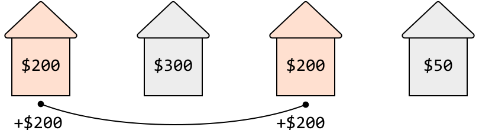
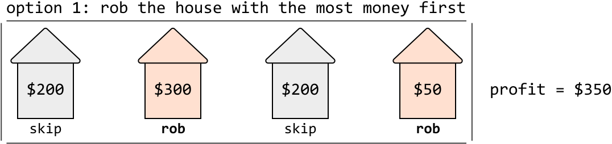
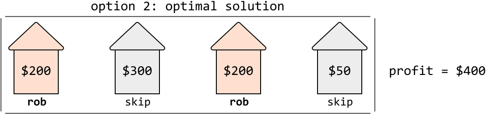
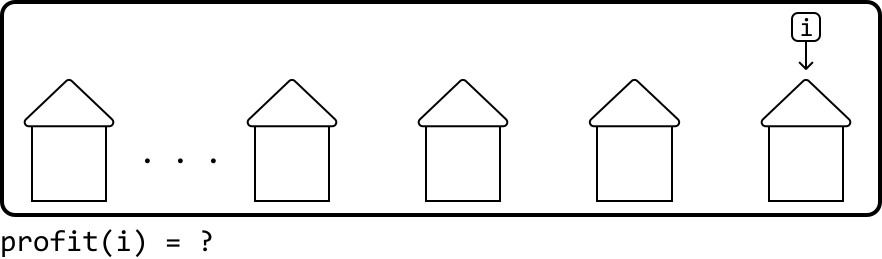
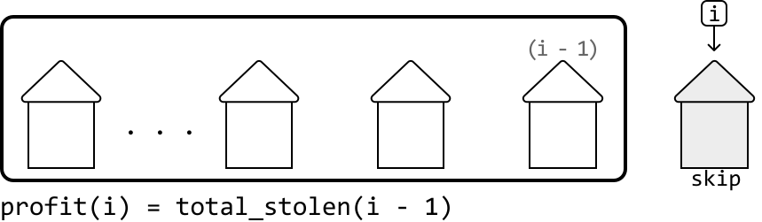
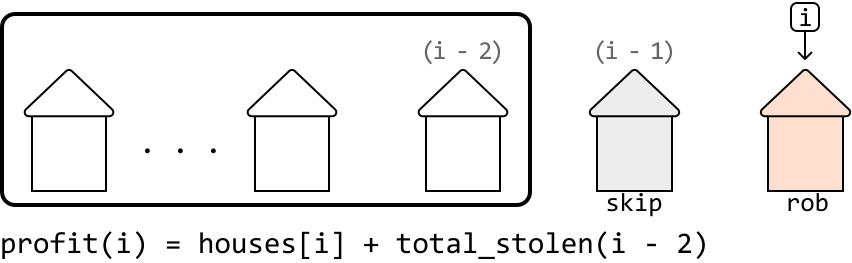

# Neighborhood Burglary

You plan to rob houses in a street where each house stores a certain amount of money. The neighborhood has a security system that sets off an alarm when two adjacent houses are robbed. Return the **maximum amount of cash** that can be stolen without triggering the alarms.

#### Example:



```python
Input: houses = [200, 300, 200, 50]
Output: 400

```

Explanation: Stealing from the houses at indexes 0 and 2 yields 200 + 200 = 400 dollars.

## Intuition

Ideally, we would want to rob every house, and collect the total sum of all cash contained therein. However, with the alarm system in place, we need to be more strategic about which houses to rob and which to skip.

A simple, greedy approach of always robbing the house with the most money fails because it overlooks the long-term consequences of its choices, and doesn’t always yield the highest total profit. This is visualized in the example below.





Let’s approach this problem from a different angle. Imagine breaking into houses all along a street, and eventually reaching the last house, denoted as i below. How much money has been stolen up to this point?



To answer this question, we need to consider the two choices that can be made at this last house: do we skip it or rob it?

- If we **skip** it, we end our burglary with the total amount stolen up to the house at `i - 1`:
  
  
  

- If we **rob** it, we couldn't have robbed the previous house at `i - 1`, so we end the burglary with the money stolen from this final house, plus the total amount stolen up to the house at `i - 2`, which is two houses back:
  
  
  

The optimal choice is whichever of these two options yields the largest amount of money.

Notice this discussion highlights the existence of subproblems, and an **optimal substructure** where we need to know the total amount stolen up to the two previous houses, before determining the total amount we can steal up to the current house.

This means we should try using **DP** to solve this problem. Let’s say `dp[i]` represents the maximum amount we’re able to steal by the time we reach house `i`. Based on our previous discussion, we know that:

> 
> 
> `dp[i]` = max(profit if we skip house `i`, profit if we rob house `i`) = `max(dp[i - 1], houses[i] + dp[i - 2])`
> 
> 

Once the DP array is populated using the above formula, we can just return `dp[n - 1]`, which represents the maximum amount that can be stolen once we reach the end of the street. Now, let’s think about what our base cases should be.

**Base cases**

For starters, let’s consider what to do if there’s just one house. This is the simplest possible subproblem, where the total amount stolen is just the money in that house. So, one of our base cases is `dp[0] = houses[0]`.

Keep in mind that to use our DP formula (`dp[i] = max(dp[i - 1], houses[i] + dp[i - 2])`), we need to access values at indexes `i - 1` and `i - 2`. This means we must set initial values for index 0 and index 1. With these base cases, we can safely start using the formula from index 2 onward without causing any index out-of-bound errors. So, what’s the most money that can be stolen at `i = 1` (i.e., when there are just two adjacent houses)? We can only steal from one of these houses, so `dp[1] = max(houses[0], houses[1])`.

## Implementation

```python
from typing import List
   
def neighborhood_burglary(houses: List[int]) -> int:
    # Handle the cases when the array is less than the size of 2 to avoid out-of-
    # bounds errors when assigning the base case values.
    if not houses:
        return 0
    if len(houses) == 1:
        return houses[0]
    dp = [0] * len(houses)
    # Base case: when there's only one house, rob that house.
    dp[0] = houses[0]
    # Base case: when there are two houses, rob the one with the most money.
    dp[1] = max(houses[0], houses[1])
    # Fill in the rest of the DP array.
    for i in range(2, len(houses)):
        # 'dp[i]' = max(profit if we skip house 'i', profit if we rob house 'i').
        dp[i] = max(dp[i - 1], houses[i] + dp[i - 2])
    return dp[len(houses) - 1]

```

```javascript
export function neighborhood_burglary(houses) {
  // Handle the cases when the array is less than size 2
  if (!houses || houses.length === 0) {
    return 0
  }
  if (houses.length === 1) {
    return houses[0]
  }
  const dp = new Array(houses.length).fill(0)
  // Base cases
  dp[0] = houses[0]
  dp[1] = Math.max(houses[0], houses[1])
  // Fill in the rest of the DP array
  for (let i = 2; i < houses.length; i++) {
    dp[i] = Math.max(dp[i - 1], houses[i] + dp[i - 2])
  }
  return dp[houses.length - 1]
}

```

```java
import java.util.ArrayList;

public class Main {
    public static int neighborhood_burglary(ArrayList<Integer> houses) {
        // Handle the cases when the array is less than the size of 2 to avoid out-of-
        // bounds errors when assigning the base case values.
        if (houses == null || houses.isEmpty()) {
            return 0;
        }
        if (houses.size() == 1) {
            return houses.get(0);
        }
        int[] dp = new int[houses.size()];
        // Base case: when there's only one house, rob that house.
        dp[0] = houses.get(0);
        // Base case: when there are two houses, rob the one with the most money.
        dp[1] = Math.max(houses.get(0), houses.get(1));
        // Fill in the rest of the DP array.
        for (int i = 2; i < houses.size(); i++) {
            // 'dp[i]' = max(profit if we skip house 'i', profit if we rob house 'i').
            dp[i] = Math.max(dp[i - 1], houses.get(i) + dp[i - 2]);
        }
        return dp[houses.size() - 1];
    }
}

```

### Complexity Analysis

**Time complexity:** The time complexity of `neighborhood_burglary` is O(n), where n denotes the number of houses. This is because each index of the DP array is populated at most once.

**Space complexity:** The space complexity is O(n) since we're maintaining a DP array that has n elements.

## Optimization

From the DP array formula `dp[i] = max(dp[i - 1], houses[i] + dp[i - 2])`, an important observation is that we only need to access the previous two values of the DP array, index `i - 1` and index `i - 2`, to calculate the current value at index `i`. This means we don’t need to store the entire DP array.

Instead, we can use two variables to keep track of the previous two values:

- `prev_max_profit`: stores the value of `dp[i - 1]`

- `prev_prev_max_profit`: stores the value of `dp[i - 2]`

This optimization reduces the space complexity to O(1) since we’re no longer maintaining any auxiliary data structures. The adjusted implementation can be seen below:

```python
from typing import List

def neighborhood_burglary_optimized(houses: List[int]) -> int:
    if not houses:
        return 0
    if len(houses) == 1:
        return houses[0]
    # Initialize the variables with the base cases.
    prev_max_profit = max(houses[0], houses[1])
    prev_prev_max_profit = houses[0]
    for i in range(2, len(houses)):
        curr_max_profit = max(prev_max_profit, houses[i] + prev_prev_max_profit)
        # Update the values for the next iteration.
        prev_prev_max_profit = prev_max_profit
        prev_max_profit = curr_max_profit
    return prev_max_profit

```

```javascript
export function neighborhood_burglary_optimized(houses) {
  if (!houses || houses.length === 0) {
    return 0
  }
  if (houses.length === 1) {
    return houses[0]
  }
  // Initialize the variables with the base cases.
  let prevPrevMaxProfit = houses[0]
  let prevMaxProfit = Math.max(houses[0], houses[1])
  for (let i = 2; i < houses.length; i++) {
    const currMaxProfit = Math.max(prevMaxProfit, houses[i] + prevPrevMaxProfit)
    // Update the values for the next iteration.
    prevPrevMaxProfit = prevMaxProfit
    prevMaxProfit = currMaxProfit
  }
  return prevMaxProfit
}

```

```java
import java.util.ArrayList;
import java.util.List;

public class Main {
    public static int neighborhood_burglary_optimized(ArrayList<Integer> houses) {
        if (houses == null || houses.isEmpty()) {
            return 0;
        }
        if (houses.size() == 1) {
            return houses.get(0);
        }
        // Initialize the variables with the base cases.
        int prevMaxProfit = Math.max(houses.get(0), houses.get(1));
        int prevPrevMaxProfit = houses.get(0);
        for (int i = 2; i < houses.size(); i++) {
            int currMaxProfit = Math.max(prevMaxProfit, houses.get(i) + prevPrevMaxProfit);
            // Update the values for the next iteration.
            prevPrevMaxProfit = prevMaxProfit;
            prevMaxProfit = currMaxProfit;
        }
        return prevMaxProfit;
    }
}

```