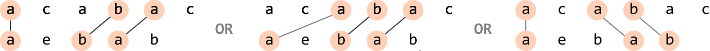
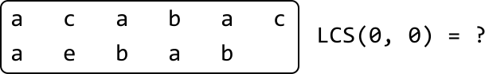
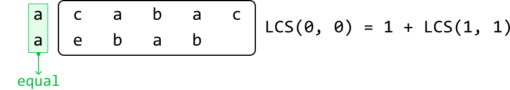
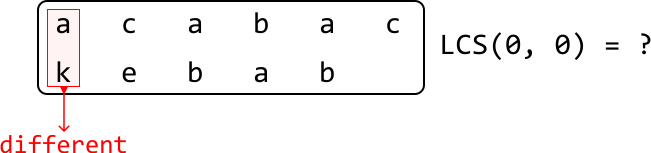
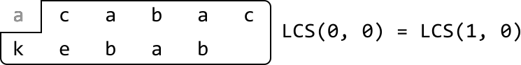
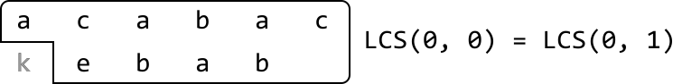
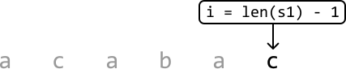
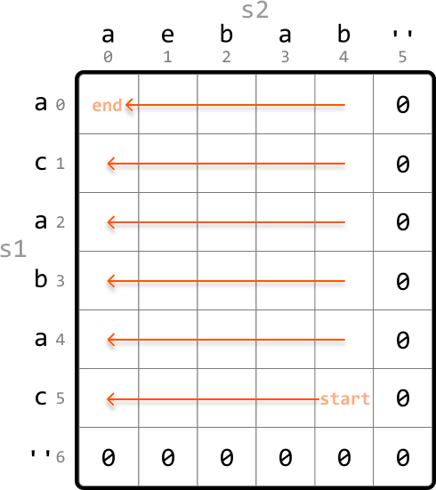
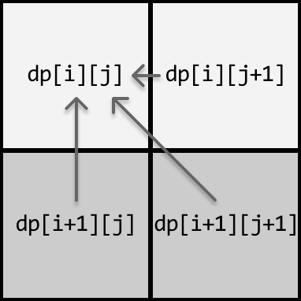
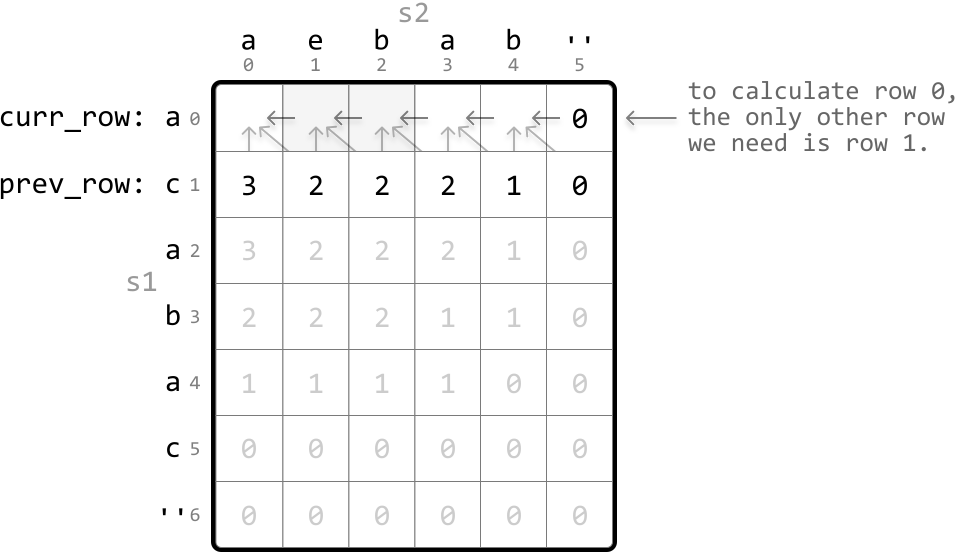

# Longest Common Subsequence

Given two strings, find the **length of their longest common subsequence** (LCS). A subsequence is a sequence of characters that can be derived from a string by deleting zero or more elements, without changing the order of the remaining elements.

#### Example:



```python
Input: s1 = 'acabac', s2 = 'aebab'
Output: 3

```

## Intuition

A naive approach to this problem is to generate every possible subsequence for both strings and identify the LCS among them. This is extremely inefficient, so we need to think of something better.

One way to think about this problem is to realize that for any character from either string, we have a choice to either include it in the LCS, or exclude it. This will help us figure out the next steps in finding the length of the LCS.

Let’s start by considering the first character of each string and whether we should include or exclude them. There are two primary cases to discuss:

- Case 1: the characters are the same.

- Case 2: the characters are different.

**Case 1: equal characters**

Consider the following two strings, where we’re trying to find the length of their LCS, starting from index 0 of each string (`LCS(0, 0)`):



The first characters of these two strings are equal. What should we do about them? We should include these characters in the LCS as they form the beginning of a common subsequence. Including them also means our LCS will have a length of at least 1. But how do we find the length of the rest of the LCS? We can do this by computing the LCS of the remainder of both strings. That is, the LCS of their substrings starting at index 1 (`LCS(1, 1)`):



We’ve just identified that this case can be solved by solving a subproblem that also computes the LCS of two strings, indicating this problem has an **optimal substructure**.

Therefore, we can generalize a recurrence relation for this case. Below, index `i` and `j` represent the start of the substring of `s1` and `s2`, respectively.

> 
> 
> `if s1[i] == s2[j]: LCS(i, j) = 1 + LCS(i + 1, j + 1)`
> 
> 

---

**Case 2: different characters**

Now, let’s say the first characters of the two strings are different:



This means the LCS cannot include both of these characters. It could include one of them, but certainly not both. Therefore, we have two choices to find the LCS:

- Exclude ‘a’ from the first string to find the LCS between the two strings after this exclusion:
  
  
  

- Exclude ‘k’ from the second string to find the LCS between the two strings after this exclusion:
  
  
  

The length of the LCS will be the larger length between these two options. Again, here we see that we’re dealing with a problem of optimal substructure. The recurrence relation for this case is:

> 
> 
> `if s1[i] != s2[j]: LCS(i, j) = max(LCS(i + 1, j), LCS(i, j + 1))` (i.e. max(LCS excluding `s1[i]`, LCS excluding `s2[j]`))
> 
> 

---

**Dynamic programming**

Since we’re dealing with overlapping subproblems, where the solutions to a subproblem can be used multiple times, we can convert our recurrence relation to a DP formula. Let’s say `dp[i][j]` represents `LCS(i, j)`. Based on our previous discussion, we know that:

> 
> 
> `if s1[i] == s2[j]: dp[i][j] = 1 + dp[i + 1][j + 1] else: dp[i][j] = max(dp[i + 1][j], dp[i][j + 1])`
> 
> 

Now, we need to think about what the base cases should be.

**Base cases**

The simplest version of our problem is when one or both strings are empty. In this case, their LCS has a length of 0. But which values of the DP table should we populate for these base cases?

We know that when `i = len(s1) - 1`, only one character of `s1` is being considered:



This implies that when `i = len(s1)`, the substring of `s1` contains no characters. The equivalent is true for `s2` when `j = len(s2)`. Therefore, we can populate the DP table with the base case values like so:

- `dp[len(s1)][j] = 0` for all `j`

- `dp[i][len(s2)] = 0` for all `i`

Let’s draw the DP table with just these base cases to get a better idea of what this looks like:


As we can see, the last row and last column are set to 0 for our base cases.

**Populating the DP table**

We populate the DP table starting from the smallest subproblems (excluding the base cases). Specifically, we begin by populating `dp[len(s1) - 1][len(s2) - 1]`, which considers the LCS of only the last character of each string. From there, we iteratively populate the DP table in reverse order, moving backward through the table until we reach cell (0, 0).



Once the DP table is populated, we return `dp[0][0]`, which stores the length of the LCS between the entire first string and the entire second string.

## Implementation

```python
def longest_common_subsequence(s1: str, s2: str) -> int:
    # Base case: Set the last row and last column to 0 by initializing the entire DP
    # table with 0s.
    dp = [[0] * (len(s2) + 1) for _ in range(len(s1) + 1)]
    # Populate the DP table.
    for i in range(len(s1) - 1, -1, -1):
        for j in range(len(s2) - 1, -1, -1):
            # If the characters match, the length of the LCS at 'dp[i][j]' is
            # 1 + the LCS length of the remaining substrings.
            if s1[i] == s2[j]:
                dp[i][j] = 1 + dp[i + 1][j + 1]
            # If the characters don't match, the LCS length at 'dp[i][j]' can be found
            # by either:
            # 1. Excluding the current character of s1.
            # 2. Excluding the current character of s2.
            else:
                dp[i][j] = max(dp[i + 1][j], dp[i][j + 1])
    return dp[0][0]

```

```javascript
export function longest_common_subsequence(s1, s2) {
  // Base case: Set the last row and last column to 0 by initializing the entire DP table with 0s.
  const dp = Array.from({ length: s1.length + 1 }, () =>
    Array(s2.length + 1).fill(0)
  )
  // Populate the DP table.
  for (let i = s1.length - 1; i >= 0; i--) {
    for (let j = s2.length - 1; j >= 0; j--) {
      // If the characters match, the length of the LCS at 'dp[i][j]' is
      // 1 + the LCS length of the remaining substrings.
      if (s1[i] === s2[j]) {
        dp[i][j] = 1 + dp[i + 1][j + 1]
      } else {
        // If the characters don't match, the LCS length at 'dp[i][j]' can be found
        // by either:
        // 1. Excluding the current character of s1.
        // 2. Excluding the current character of s2.
        dp[i][j] = Math.max(dp[i + 1][j], dp[i][j + 1])
      }
    }
  }
  return dp[0][0]
}

```

```java
public class Main {
    public int longest_common_subsequence(String s1, String s2) {
        // Base case: Set the last row and last column to 0 by initializing the entire DP
        // table with 0s.
        int[][] dp = new int[s1.length() + 1][s2.length() + 1];
        // Populate the DP table.
        for (int i = s1.length() - 1; i >= 0; i--) {
            for (int j = s2.length() - 1; j >= 0; j--) {
                // If the characters match, the length of the LCS at 'dp[i][j]' is
                // 1 + the LCS length of the remaining substrings.
                if (s1.charAt(i) == s2.charAt(j)) {
                    dp[i][j] = 1 + dp[i + 1][j + 1];
                }
                // If the characters don't match, the LCS length at 'dp[i][j]' can be found
                // by either:
                // 1. Excluding the current character of s1.
                // 2. Excluding the current character of s2.
                else {
                    dp[i][j] = Math.max(dp[i + 1][j], dp[i][j + 1]);
                }
            }
        }
        return dp[0][0];
    }
}

```

### Complexity Analysis

**Time complexity:** The time complexity of `longest_common_subsequence` is O(m· n), where m and n denote the lengths of `s1` and `s2`, respectively. This is because each cell in the DP table is populated once.

**Space complexity:** The space complexity is O(m· n) since we're maintaining a 2D DP table that has (m+1)(n+1) elements.

## Optimization

We can optimize our solution by noticing that for each cell in the DP table, we only need to access the cell below it, the cell to its right, and the bottom-right diagonal cell.



- To get the cell below it, we only need access to the row below.

- To get the cell to its right, we just need to look at the cell to the right of the current cell.

- To get the bottom-right diagonal cell, we also only need access to the row below.

Therefore, we only need to maintain two rows:

- `curr_row`: the current row being populated.

- `prev_row`: the row below the current row.



This effectively reduces the space complexity to O(n). Below is the optimized code: 

```python
def longest_common_subsequence_optimized(s1: str, s2: str) -> int:
    # Initialize 'prev_row' as the DP values of the last row.
    prev_row = [0] * (len(s2) + 1)
    for i in range(len(s1) - 1, -1, -1):
        # Set the last cell of 'curr_row' to 0 to set the base case for
        # this row. This is done by initializing the entire row to 0.
        curr_row = [0] * (len(s2) + 1)
        for j in range(len(s2) - 1, -1, -1):
            # If the characters match, the length of the LCS at
            # 'curr_row[j]' is 1 + the LCS length of the remaining
            # substrings ('prev_row[j + 1]').
            if s1[i] == s2[j]:
                curr_row[j] = 1 + prev_row[j + 1]
            # If the characters don't match, the LCS length at
            # 'curr_row[j]' can be found by either:
            # 1. Excluding the current character of s1 ('prev_row[j]').
            # 2. Excluding the current character of s2
            # ('curr_row[j + 1]').
            else:
                curr_row[j] = max(prev_row[j], curr_row[j + 1])
            # Update 'prev_row' with 'curr_row' values for the next
            # iteration.
        prev_row = curr_row
    return prev_row[0]

```

```javascript
export function longest_common_subsequence_optimized(s1, s2) {
  // Initialize 'prevRow' as the DP values of the last row.
  let prevRow = new Array(s2.length + 1).fill(0)
  for (let i = s1.length - 1; i >= 0; i--) {
    // Set the last cell of 'currRow' to 0 for the base case of this row.
    let currRow = new Array(s2.length + 1).fill(0)
    for (let j = s2.length - 1; j >= 0; j--) {
      // If the characters match, add 1 to the LCS length from the diagonally next cell.
      if (s1[i] === s2[j]) {
        currRow[j] = 1 + prevRow[j + 1]
      } else {
        // Otherwise, take the max between excluding current char of s1 or s2.
        currRow[j] = Math.max(prevRow[j], currRow[j + 1])
      }
    }
    // Update 'prevRow' with the values from 'currRow' for the next iteration.
    prevRow = currRow
  }
  return prevRow[0]
}

```

```java
public class Main {
    public int longest_common_subsequence_optimized(String s1, String s2) {
        // Initialize 'prev_row' as the DP values of the last row.
        int[] prevRow = new int[s2.length() + 1];
        for (int i = s1.length() - 1; i >= 0; i--) {
            // Set the last cell of 'curr_row' to 0 to set the base case for
            // this row. This is done by initializing the entire row to 0.
            int[] currRow = new int[s2.length() + 1];
            for (int j = s2.length() - 1; j >= 0; j--) {
                // If the characters match, the length of the LCS at
                // 'curr_row[j]' is 1 + the LCS length of the remaining
                // substrings ('prev_row[j + 1]').
                if (s1.charAt(i) == s2.charAt(j)) {
                    currRow[j] = 1 + prevRow[j + 1];
                }
                // If the characters don't match, the LCS length at
                // 'curr_row[j]' can be found by either:
                // 1. Excluding the current character of s1 ('prev_row[j]').
                // 2. Excluding the current character of s2
                // ('curr_row[j + 1]').
                else {
                    currRow[j] = Math.max(prevRow[j], currRow[j + 1]);
                }
            }
            // Update 'prev_row' with 'curr_row' values for the next
            // iteration.
            prevRow = currRow;
        }
        return prevRow[0];
    }
}

```