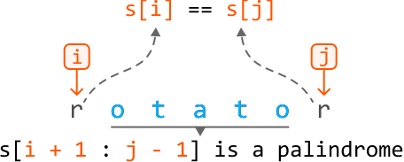
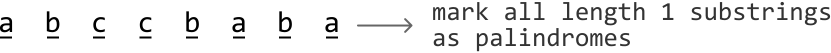
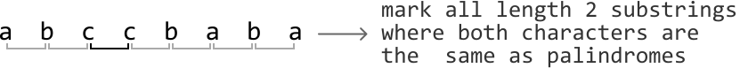
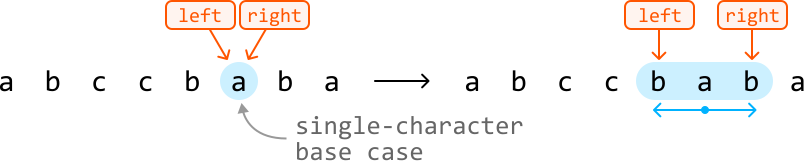
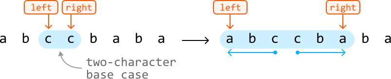

# Longest Palindrome in a String

Return the **longest palindromic substring** within a given string.

#### Example:

```python
Input: s = 'abccbaba'
Output: 'abccba'

```

## Intuition

A naive solution to this problem is to check every possible substring and save the longest palindrome found. It takes approximately O(n^2) time to generate all substrings for a string of length n, and for each of these substrings, it takes O(n) time to check if it’s a palindrome. This results in an overall time complexity of O(n^3), which is expensive. So, we should consider a more efficient approach.

**Determining if a substring is a palindrome**

An important observation is that palindromes contain shorter palindromes within them. We can observe this in the string “rotator”, for example:


This highlights a subproblem: to identify if a string is a palindrome, we can check if its inner substring is also a palindrome.

More specifically, a substring from index `i` to `j` is a palindrome given two conditions:

- Its first and last characters are the same (`s[i] == s[j]`).

- The substring from index `i + 1` to `j - 1` (`s[i + 1 : j - 1]`) is also a palindrome.



The only situation where this isn’t true is when the substring is of length 0, 1, or 2, in which case there is no inner substring. We’ll discuss these cases later.

This problem has an **optimal substructure** since we solve a subproblem to obtain the solution to the main problem. This indicates that DP is well-suited for solving this problem. Let’s say that `dp[i][j]` tells us if the substring `s[i : j]` is a palindrome. Based on our earlier observations, we can say that:

> 
> 
> `dp[i][j] = True if s[i] == s[j] and dp[i + 1][j - 1]`
> 
> 

Naturally, we need to specify the base cases for this formula.

**Base cases**

We mentioned earlier that substrings of length 1 and 2 have no inner substrings. In other words, there are no further subproblems to solve when determining if they are palindromes. As such, these substrings define our base cases:

- Base case: All substrings of length 1 are palindromes. So, set `dp[i][i]` to true for all values of `i`.
  
  
  

- Base case: Substrings of length 2 are palindromes if both its characters are the same. So, set `dp[i][i + 1]` to true if `s[i] == s[i + 1]`.
  
  
  

With the base cases set up, let’s discuss how to populate the rest of the DP table.

**Populating the DP table**

Determining if longer substrings are palindromes depends on the DP values of shorter substrings. Therefore, we should populate the DP table for the shortest substrings first, starting with checking all substrings of length 3 and working our way up to length n, where n denotes the length of the input string.

**Keeping track of the longest palindromic substring**

As we populate the DP table, we also need to keep track of the longest palindromic substring encountered. We use two variables for this: `start_index` and `max_len`.

- `start_index`: stores the starting index of the longest palindromic substring found so far

- `max_len`: stores the length of the longest palindromic substring found so far

When we find a new, longer palindromic substring, we update these two variables. By the end, `start_index` and `max_len` will indicate the position and length of the longest palindrome.

Finally, return the substring using `s[start_index : start_index + max_len]`.

This solution is a classic example of “interval DP,” which is used to solve optimization problems involving subproblems over intervals of data. In this case, the “intervals” are effectively the substrings between indexes `i` and `j`.

## Implementation

```python
def longest_palindrome_in_a_string(s: str) -> str:
    n = len(s)
    if n == 0:
        return ""
    dp = [[False] * n for _ in range(n)]
    max_len = 1
    start_index = 0
    # Base case: a single character is always a palindrome.
    for i in range(n):
        dp[i][i] = True
    # Base case: a substring of length two is a palindrome if both characters are the
    # same.
    for i in range(n - 1):
        if s[i] == s[i + 1]:
            dp[i][i + 1] = True
            max_len = 2
            start_index = i
    # Find palindromic substrings of length 3 or greater.
    for substring_len in range(3, n + 1):
        # Iterate through each substring of length 'substring_len'.
        for i in range(n - substring_len + 1):
            j = i + substring_len - 1
            # If the first and last characters are the same, and the inner substring
            # is a palindrome, then the current substring is a palindrome.
            if s[i] == s[j] and dp[i + 1][j - 1]:
                dp[i][j] = True
                max_len = substring_len
                start_index = i
    return s[start_index : start_index + max_len]

```

```javascript
export function longest_palindrome_in_a_string(s) {
  const n = s.length
  if (n === 0) return ''
  const dp = Array.from({ length: n }, () => Array(n).fill(false))
  let maxLen = 1
  let startIndex = 0
  // Base case: single characters are palindromes.
  for (let i = 0; i < n; i++) {
    dp[i][i] = true
  }
  // Base case: two-character substrings.
  for (let i = 0; i < n - 1; i++) {
    if (s[i] === s[i + 1]) {
      dp[i][i + 1] = true
      maxLen = 2
      startIndex = i
    }
  }
  // Check for substrings of length 3 or more.
  for (let len = 3; len <= n; len++) {
    for (let i = 0; i <= n - len; i++) {
      const j = i + len - 1
      if (s[i] === s[j] && dp[i + 1][j - 1]) {
        dp[i][j] = true
        maxLen = len
        startIndex = i
      }
    }
  }
  return s.slice(startIndex, startIndex + maxLen)
}

```

```java
public class Main {
    public String longest_palindrome_in_a_string(String s) {
        int n = s.length();
        if (n == 0) {
            return "";
        }
        boolean[][] dp = new boolean[n][n];
        int maxLen = 1;
        int startIndex = 0;
        // Base case: a single character is always a palindrome.
        for (int i = 0; i < n; i++) {
            dp[i][i] = true;
        }
        // Base case: a substring of length two is a palindrome if both characters are the
        // same.
        for (int i = 0; i < n - 1; i++) {
            if (s.charAt(i) == s.charAt(i + 1)) {
                dp[i][i + 1] = true;
                maxLen = 2;
                startIndex = i;
            }
        }
        // Find palindromic substrings of length 3 or greater.
        for (int substringLen = 3; substringLen <= n; substringLen++) {
            // Iterate through each substring of length 'substring_len'.
            for (int i = 0; i <= n - substringLen; i++) {
                int j = i + substringLen - 1;
                // If the first and last characters are the same, and the inner substring
                // is a palindrome, then the current substring is a palindrome.
                if (s.charAt(i) == s.charAt(j) && dp[i + 1][j - 1]) {
                    dp[i][j] = true;
                    maxLen = substringLen;
                    startIndex = i;
                }
            }
        }
        return s.substring(startIndex, startIndex + maxLen);
    }
}

```

### Complexity Analysis

**Time complexity:** The time complexity of `longest_palindrome_in_a_string` is O(n^2) because each cell of the n· n DP table is populated once.

**Space complexity:** The space complexity is O(n^2) because we're maintaining a DP table that has n^2 elements. Note, the output string is not considered in the space complexity.

## Optimized Approach

An important observation of the previous approach is that the base cases represent the centers of palindromes. Understanding this, another possible strategy is to expand outward from each base case to find the longest palindrome.

There are two types of base cases: single-character substrings and two-character substrings. We can treat each as the center of potential palindromes, and expand outward from each of them to find these palindromes.

We can do this by setting left and right pointers at the center, expanding them outward – as long as the characters at both pointers match – and stopping once they can no longer form a larger palindrome. Here are two examples of this:





All we need to do is keep track of the start index and length of the longest palindromic we find, just as in the previous approach.

This approach makes use of some of the information from the previous DP approach, while solving the problem using constant space.

## Implementation - Optimized Approach

```python
from typing import Tuple
    
def longest_palindrome_in_a_string_expanding(s: str) -> str:
    n = len(s)
    start, max_len = 0, 0
    for center in range(n):
        # Check for odd-length palindromes.
        odd_start, odd_length = expand_palindrome(center, center, s)
        if odd_length > max_len:
            start = odd_start
            max_len = odd_length
        # Check for even-length palindromes.
        if center < n - 1 and s[center] == s[center + 1]:
            even_start, even_length = expand_palindrome(center, center + 1, s)
            if even_length > max_len:
                start = even_start
                max_len = even_length
    return s[start : start + max_len]
    
# Expands outward from the center of a base case to identify the start index and
# length of the longest palindrome that extends from this base case.
def expand_palindrome(left: int, right: int, s: str) -> Tuple[int, int]:
    while left > 0 and right < len(s) - 1 and s[left - 1] == s[right + 1]:
        left -= 1
        right += 1
    return left, right - left + 1

```

```javascript
export function longest_palindrome_in_a_string_expanding(s) {
  const n = s.length
  let start = 0
  let maxLen = 0
  for (let center = 0; center < n; center++) {
    // Check for odd-length palindromes
    const [oddStart, oddLength] = expand_palindrome(center, center, s)
    if (oddLength > maxLen) {
      start = oddStart
      maxLen = oddLength
    }
    // Check for even-length palindromes
    if (center < n - 1 && s[center] === s[center + 1]) {
      const [evenStart, evenLength] = expand_palindrome(center, center + 1, s)
      if (evenLength > maxLen) {
        start = evenStart
        maxLen = evenLength
      }
    }
  }
  return s.slice(start, start + maxLen)
}

function expand_palindrome(left, right, s) {
  while (left > 0 && right < s.length - 1 && s[left - 1] === s[right + 1]) {
    left--
    right++
  }
  return [left, right - left + 1]
}

```

```java
public class Main {
    public String longest_palindrome_in_a_string(String s) {
        int n = s.length();
        int start = 0, maxLen = 0;
        for (int center = 0; center < n; center++) {
            // Check for odd-length palindromes.
            int[] odd = expand_palindrome(center, center, s);
            int oddStart = odd[0], oddLength = odd[1];
            if (oddLength > maxLen) {
                start = oddStart;
                maxLen = oddLength;
            }
            // Check for even-length palindromes.
            if (center < n - 1 && s.charAt(center) == s.charAt(center + 1)) {
                int[] even = expand_palindrome(center, center + 1, s);
                int evenStart = even[0], evenLength = even[1];
                if (evenLength > maxLen) {
                    start = evenStart;
                    maxLen = evenLength;
                }
            }
        }
        return s.substring(start, start + maxLen);
    }

    // Expands outward from the center of a base case to identify the start index and
    // length of the longest palindrome that extends from this base case.
    private int[] expand_palindrome(int left, int right, String s) {
        while (left > 0 && right < s.length() - 1 && s.charAt(left - 1) == s.charAt(right + 1)) {
            left--;
            right++;
        }
        return new int[] { left, right - left + 1 };
    }
}

```

### Complexity Analysis

**Time complexity:** The time complexity of `longest_palindrome_in_a_string_expanding` is O(n^2) because expanding from the center of a base case takes up to O(n) time. Doing this for each base case takes O(n^2) time.

**Space complexity:** The space complexity is O(1) since we aren’t maintaining any auxiliary data structures. The output string is not considered in the space complexity.

## Manacher’s Algorithm

Aside from the above quadratic-time solutions, there's a more efficient algorithm for finding the longest palindromic substring: Manacher's Algorithm. This algorithm runs in O(n) time.

However, Manacher's Algorithm's specialized nature makes it less common in coding interviews. Most interviewers want to see solutions that show you deeply understand basic concepts and have strong problem-solving skills. They are less interested in tricky solutions that would be unlikely for candidates to come up with during interviews.

For those interested in learning more about Manacher's Algorithm, check out [[1]](https://en.wikipedia.org/wiki/Longest_palindromic_substring) and [[2]](https://www.geeksforgeeks.org/dsa/manachers-algorithm-linear-time-longest-palindromic-substring-part-1/).