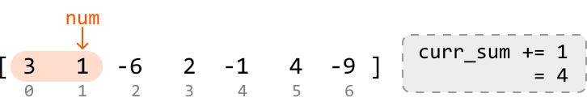
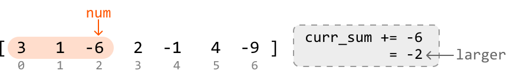
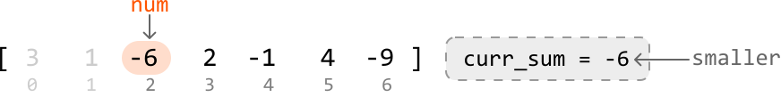
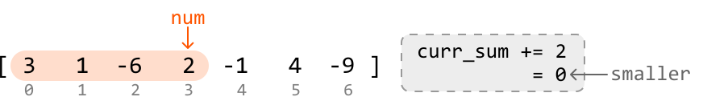
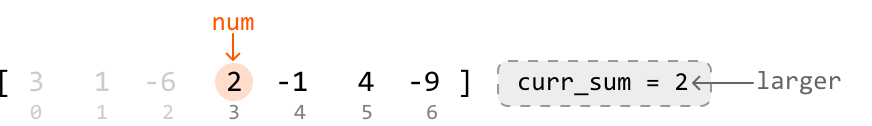
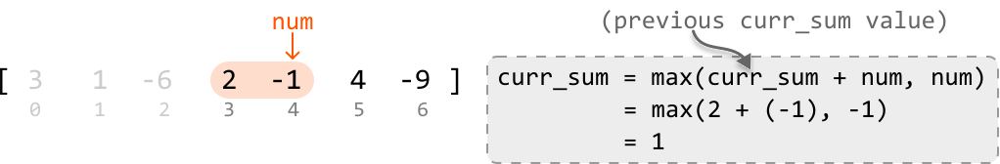
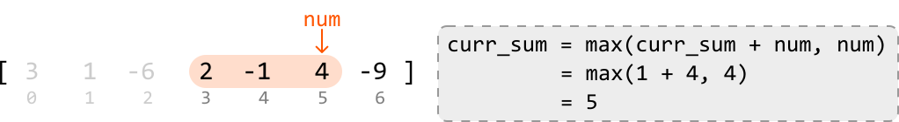
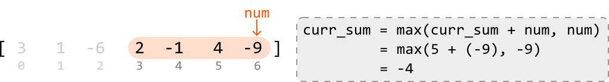
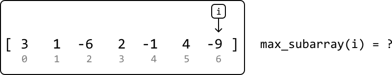
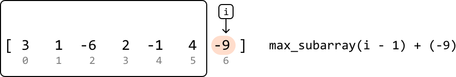

# Maximum Subarray Sum

Given an array of integers, return the `sum` of the subarray with the **largest sum**.

#### Example:

```python
Input: nums = [3, 1, -6, 2, -1, 4, -9]
Output: 5

```

Explanation: subarray `[2, -1, 4]` has the largest sum of 5.

#### Constraints:

- The input array contains at least one element.

## Intuition

Brute force approaches to this problem involve calculating the sum of every possible subarray. This would take at least O(n^2) time, where n denotes the length of the array. So, let’s consider alternative methods.

The challenge with this problem lies in the presence of negative numbers. If the array consisted entirely of non-negative numbers, the answer would simply be the sum of the entire array.

To find the maximum sum given the presence of negative numbers, let’s try keeping track of the sum of a contiguous subarray, starting at index 0.

As this subarray expands and we add each number to the running sum, we’ll need to decide whether to continue with the current subarray’s sum, or start a new subarray beginning with the current element. To understand how we might make such a decision, let’s dive into an example.

Consider the following input array:

![Image represents a one-dimensional array or list of integers.  The array is enclosed in square brackets `[` and `]`.  Th](./images/1fc0dee5_image-15-07-1-OU2UX27V.svg)

---

The first two values of the array are positive, so we can continue expanding the current subarray by adding these to our sum (`curr_sum`), initialized at 0:




---

When we reach index 2, we land on the first negative number (-6). Adding it to the current sum gives us a negative sum of -2.

What should we do now? If we restart the subarray at this point, the new subarray will start with a sum of -6, which is less than the current sum of -2.





Therefore, it is better to continue with the current subarray for now.

---

At index 3, we reach another important decision point:

- If we include 2 in the current subarray, its sum increases to 0:



- If we restart the subarray at this index, we begin a new subarray of sum 2:



It’s evident here that the better choice is to start tracking the sum of a new subarray, beginning at index 3.

As observed, for each number in the array during this process, there are two choices:

- **Continue:** Add the current number to the ongoing subarray sum (`curr_sum + num`).

- **Restart:** Begin keeping track of a new subarray starting with the current number, with an initial sum of `num`.

The best choice is the larger of the two: **`max(curr_sum + num, num)`**.

Let’s apply this logic to the rest of the array:







---

Now that we have a strategy to linearly track subarray sums, the only other thing to do is keep track of the largest value of curr_sum encountered. To do this, we can update a variable `max_sum` whenever we encounter a larger `curr_sum` value. Then, `max_sum` will be the answer to the problem.

**Kadane’s algorithm**

The algorithm described above is formally known as "Kadane's algorithm". Although it may not seem like it, Kadane's algorithm is actually a **DP** algorithm. What’s interesting is that we didn’t explicitly detect and solve subproblems to come up with this algorithm, like we typically do in DP. Instead, we solved it by linearly keeping track of a subarray sum and making decisions along the way.

So, to fully understand why this is a DP problem, let's explore how we would solve it using the traditional DP approach of breaking the problem into smaller subproblems, and solving them step-by-step. This is demonstrated in the next section of this explanation.

## Implementation

```python
from typing import List
    
def maximum_subarray_sum(nums: List[int]) -> int:
    if not nums:
        return 0
    # Set the sum variables to negative infinity to ensure negative sums can be
    # considered.
    max_sum = current_sum = float('-inf')
    # Iterate through the array to find the maximum subarray sum.
    for num in nums:
        # Either add the current number to the existing running sum, or start a new
        # subarray at the current number.
        current_sum = max(current_sum + num, num)
        max_sum = max(max_sum, current_sum)
    return max_sum

```

```javascript
export function maximum_subarray_sum(nums) {
  if (nums.length === 0) return 0
  let maxSum = -Infinity
  let currentSum = -Infinity
  for (const num of nums) {
    currentSum = Math.max(currentSum + num, num)
    maxSum = Math.max(maxSum, currentSum)
  }
  return maxSum
}

```

```java
import java.util.ArrayList;

public class Main {
    public int maximum_subarray_sum(ArrayList<Integer> nums) {
        if (nums == null || nums.isEmpty()) {
            return 0;
        }
        // Set the sum variables to negative infinity to ensure negative sums can be
        // considered.
        int maxSum = Integer.MIN_VALUE;
        int currentSum = Integer.MIN_VALUE;
        // Iterate through the array to find the maximum subarray sum.
        for (int num : nums) {
            // Either add the current number to the existing running sum, or start a new
            // subarray at the current number.
            currentSum = Math.max(currentSum + num, num);
            maxSum = Math.max(maxSum, currentSum);
        }
        return maxSum;
    }
}

```

### Complexity Analysis

**Time complexity:** The time complexity of `maximum_subarray_sum` is O(n) because we iterate through each element of the input array once.

**Space complexity:** The space complexity is O(1).

## Intuition - DP

Let’s discuss how we would approach this problem as we did with other DP problems in this chapter.

An important observation is that every possible subarray ends at a certain index. This inversely means each index signifies the end of several subarrays, one of which will have the maximum subarray sum (shortened to “max subarray” moving forward) ending at that index.

For example, we can see the max subarray that ends at index 3 below by considering all subarrays ending at index 3:

![Image represents a numerical array depicted as `[3 1 -6 2 -1 4 -9]`, enclosed in square brackets.  A peach-colored recta](./images/5774a0ce_image-15-07-11-QPFHZSTE.svg)

![Image represents a numerical array depicted within square brackets `[]`, showing a sequence of numbers: 3, 1, -6, 2, -1,](./images/b0fa8bdd_image-15-07-12-PR5VCKBS.svg)

![Image represents a numerical array depicted within square brackets `[]`, containing the elements 3, 1, -6, 2, -1, 4, and](./images/b476083f_image-15-07-13-TBVMDD3I.svg)

![Image represents a visual depiction of a maximum subarray sum algorithm.  A numerical array `[3, 1, -6, 2, -1, 4, -9]` i](./images/fce3f724_image-15-07-14-M7S7SNQL.svg)

So, how can we find the max subarray that ends at each index? Consider the last index of the array:



One thing we know for sure is the max subarray ending at this index will definitely include the value at this index. We just need to determine if there are any elements to the left that also contribute to this max subarray. In other words, we need to find the max subarray that ends right before the last index:



Another thing to consider is the possibility that `max_subarray(i - 1)` is negative. This would mean the max subarray should only consist of -9, as a further negative contribution will only decrease the sum. Therefore, the formula becomes:

> 
> 
> `max_subarray(i) = max(max_subarray(i - 1) + nums[i], nums[i])`
> 
> 

As we see, this is a **recurrence relation** that takes advantage of an **optimal substructure**, where the max subarray at the current index depends on the max subarray at the previous index.

This indicates we can solve this problem using DP. Translating the above recurrence relation to a DP formula gives us:

> 
> 
> `dp[i] = max(dp[i - 1] + nums[i], nums[i])`
> 
> 

Now, let’s consider what the base case for this problem is.

**Base case**

The simplest subproblem occurs when we consider only the first element of the array (i.e., when `i = 0`). When there’s only one element, there’s only one subarray. Therefore, we can set `dp[0]` to `nums[0]` as our base case.

**Populating the DP array**

With the base case established, we can populate the rest of the DP array. Starting from index 1 and going up to index `n - 1`, we calculate the maximum subarray sum ending at each index using the aforementioned recurrence relation.

As we populate the DP array, we need to keep track of the maximum value in the DP array, `max_sum`, representing the largest sum of any subarray within the entire array. By the time we finish populating the DP array, we can just return `max_sum`.

## Implementation - DP

```python
from typing import List
    
def maximum_subarray_sum_dp(nums: List[int]) -> int:
    n = len(nums)
    if n == 0:
        return 0
    dp = [0] * n
    # Base case: the maximum subarray sum of an array with just one element is that
    # element.
    dp[0] = nums[0]
    max_sum = dp[0]
    # Populate the rest of the DP array.
    for i in range(1, n):
        # Determine the maximum subarray sum ending at the current index.
        dp[i] = max(dp[i - 1] + nums[i], nums[i])
        max_sum = max(max_sum, dp[i])
    return max_sum

```

```javascript
export function maximum_subarray_sum_dp(nums) {
  const n = nums.length
  if (n === 0) return 0
  const dp = new Array(n).fill(0)
  // Base case: the maximum subarray sum of an array with one element is that element.
  dp[0] = nums[0]
  let maxSum = dp[0]
  // Populate the rest of the DP array.
  for (let i = 1; i < n; i++) {
    // Determine the maximum subarray sum ending at the current index.
    dp[i] = Math.max(dp[i - 1] + nums[i], nums[i])
    maxSum = Math.max(maxSum, dp[i])
  }
  return maxSum
}

```

```java
import java.util.List;

public class Main {
    public int maximum_subarray_sum_dp(List<Integer> nums) {
        int n = nums.size();
        if (n == 0) {
            return 0;
        }
        int[] dp = new int[n];
        // Base case: the maximum subarray sum of an array with just one element is that
        // element.
        dp[0] = nums.get(0);
        int maxSum = dp[0];
        // Populate the rest of the DP array.
        for (int i = 1; i < n; i++) {
            // Determine the maximum subarray sum ending at the current index.
            dp[i] = Math.max(dp[i - 1] + nums.get(i), nums.get(i));
            maxSum = Math.max(maxSum, dp[i]);
        }
        return maxSum;
    }
}

```

### Complexity Analysis

**Time complexity:** The time complexity of `maximum_subarray_sum_dp` is O(n) since we iterate through n elements of the DP array.

**Space complexity:** The space complexity is O(n) because we’re maintaining a DP array that contains n elements.

## Optimization

An important thing to note is that in the DP solution, we only ever need to access the previous value of the DP array (at `i - 1`) to calculate the current value (at `i`). This means we don’t need to store the entire DP array.

Instead, we can use a single variable to keep track of the current subarray sum and update this value to calculate the next subarray sum.

This approach reduces the space complexity to O(1). The adjusted implementation of this can be seen below:

```python
from typing import List
    
def maximum_subarray_sum_dp_optimized(nums: List[int]) -> int:
    n = len(nums)
    if n == 0:
        return 0
    current_sum = nums[0]
    max_sum = nums[0]
    for i in range(1, n):
        current_sum = max(nums[i], current_sum + nums[i])
        max_sum = max(max_sum, current_sum)
    return max_sum

```

```javascript
export function maximum_subarray_sum_dp_optimized(nums) {
  const n = nums.length
  if (n === 0) return 0
  let currentSum = nums[0]
  let maxSum = nums[0]
  for (let i = 1; i < n; i++) {
    currentSum = Math.max(nums[i], currentSum + nums[i])
    maxSum = Math.max(maxSum, currentSum)
  }
  return maxSum
}

```

```java
import java.util.ArrayList;

public class Main {
    public int maximum_subarray_sum_dp_optimized(ArrayList<Integer> nums) {
        int n = nums.size();
        if (n == 0) {
            return 0;
        }
        int currentSum = nums.get(0);
        int maxSum = nums.get(0);
        for (int i = 1; i < n; i++) {
            currentSum = Math.max(nums.get(i), currentSum + nums.get(i));
            maxSum = Math.max(maxSum, currentSum);
        }
        return maxSum;
    }
}

```

As we can see, we’ve ended up with an optimized DP solution that’s nearly identical to the solution we came up with in the first approach: Kadane’s algorithm.