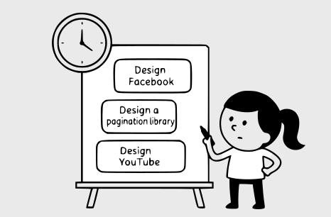
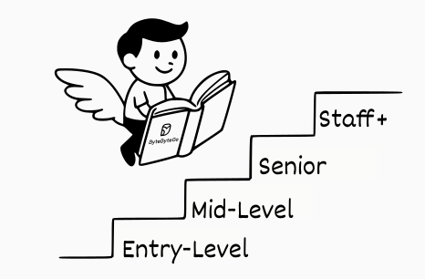

# Introduction

Mobile System Design (MSD) interviews have become a key part of the hiring process for mobile engineering roles at many companies. These interviews are typically brief, lasting no more than an hour, yet packed with broad, intentionally open-ended questions such as "Design Facebook", "Design a pagination library," or "Design YouTube". With such limited time and high expectations, it's crucial to ask the right questions to clarify requirements and focus on the areas that matter most.

## Instructor

[Manuel Vicente Vivo](https://www.linkedin.com/in/manuel-vicente-vivo-54498653/) is a Staff Mobile Architect and seasoned Android engineer with experience at leading companies including Capital One, Google, and Bumble Inc. Beyond his technical expertise, Manuel is a dedicated mentor, accomplished public speaker, and prolific writer whose work has reached and inspired millions around the world.

This book is your practical companion whether you're a mobile engineer preparing for interviews, a technical lead sharpening your architectural thinking, or someone interested in mobile development. With real-world case studies, reusable frameworks, and implementation strategies, you'll learn how to approach complex design problems with clarity and confidence.

## Why companies ask MSD interview questions

MSD interviews fill an essential gap in the hiring process. While data structures and algorithms interviews assess coding proficiency, system design questions evaluate senior-level competencies that are harder to measure elsewhere. These interviews help calibrate your abilities across several critical dimensions:

- Your ability to navigate ambiguity by defining requirements and scope.

- How you approach and break down complex and ambiguous design challenges.

- Strong problem-solving and technical knowledge.

- Your insight into different options or trade-offs of designing complex systems.

- Your communication and collaboration skills within a team environment.

MSD interviews intentionally present scenarios with multiple valid approaches. While many companies value your thought process and reasoning abilities above specific solutions, others may expect solutions that closely follow established industry patterns or align with their internal architecture standards. What consistently matters across all interviews is demonstrating a structured approach to problem-solving, making deliberate design choices, and clearly articulating the trade-offs behind your decisions. The strongest candidates show both technical depth and the adaptability to refine their solutions based on requirements and feedback.

Unlike coding interviews, MSD interviews rarely involve writing actual code. You might occasionally be asked to sketch pseudocode or represent data exchanges between components, but the focus remains on architecture and design decisions. With this unique interview format in mind, let's examine what interviewers are looking for at different seniority levels.

## Rubric leveling explained

From an interviewer's perspective, expectations vary significantly across different seniority levels. While each company establishes its own evaluation criteria and emphasizes different aspects of system design, certain general expectations apply across the industry. Let's explore what interviewers typically look for at each level.

It's important to note that the level definitions we're discussing are mainly based on “Big Tech” companies such as Google, Meta, Amazon, and Microsoft, where engineering ladders are clearly structured with multiple levels. In contrast, smaller companies and startups often have more compressed leveling systems and titles.

**📝 Note:**

MSD interviews are rarely part of junior-level hiring processes. These interviews are designed to assess advanced capabilities that typically develop with experience, making them less effective indicators for early-career engineers.

### Mid-level

Mid-level candidates should demonstrate foundational mobile system design knowledge and take initiative during the interview process. They're expected to:

- Establish a clear understanding of the problem by asking relevant questions about requirements and constraints.

- Create a coherent high-level design with logically connected components.

- Identify common mobile patterns and appropriate technologies for the given problem.

- Design basic API structures that support the required functionality.

- Demonstrate awareness of basic state management approaches.

- Recognize basic trade-offs in performance, security, and user experience.

Design challenges at this level typically focus on complete features or services of moderate complexity. Mid-level engineers may need occasional prompting to consider certain aspects of the system, which is completely normal. Interviewers expect this and will often guide the conversation toward important considerations when necessary.

Mid-level designs should demonstrate awareness of mobile-specific concerns such as network reliability, battery usage, and storage limitations. While solutions might not thoroughly address every aspect of the system, interviewers are primarily evaluating the ability to create a functional foundation with clear component relationships.

### Senior

Senior candidates are expected to demonstrate greater independence and technical depth. They're expected to:

- Drive the requirements-gathering phase with minimal guidance.

- Proactively identify critical aspects of the design without prompting.

- Create a comprehensive high-level architecture that addresses major functional requirements.

- Recognize and address non-functional requirements such as performance, security, and scalability.

- Design well-defined components with clear API contracts and communication patterns.

- Thoughtful state management across the application.

- Make informed decisions about trade-offs and be able to justify their choices.

At this level, candidates may face the same design challenges as mid-level engineers but with greater expectations for depth and breadth. Senior engineers should naturally consider issues such as error handling, edge cases, and potential failure scenarios without explicit prompting.

Senior-level designs should show a strong understanding of mobile platform capabilities and constraints. Components should have well-defined roles with clear APIs, and the overall architecture should reflect mobile best practices. They should demonstrate awareness of how their design decisions impact user experience, battery life, data usage, and other mobile-specific concerns.

### Staff+

Staff+ candidates are expected to demonstrate comprehensive leadership and technical mastery throughout the interview. They're expected to:

- Conduct thorough and proactive requirements gathering with minimal guidance.

- Drive the conversation confidently, navigating through ambiguity with ease.

- Design systems that scale efficiently and demonstrate a deep understanding of system complexities and their implications.

- Communicate with technical precision and fluency.

- Make rapid, well-justified decisions that reflect extensive experience.

- Anticipate future challenges and design for extensibility.

- Demonstrate strategic thinking that considers business impact and product evolution.

- Articulate risk assessment and mitigation strategies.

Staff+ candidates should identify and address challenging aspects without prompting, independently exploring advanced topics such as sophisticated caching strategies, offline-first architectures, cross-platform considerations, performance optimization, and failure recovery mechanisms.

Solutions at this level often involve sophisticated trade-offs between competing factors such as user experience, performance, and security. Staff+ engineers are expected to not only create effective designs but also demonstrate the strategic thinking that differentiates them in complex situations. Their designs should reveal a deep understanding of mobile architecture patterns, platform-specific optimizations, and the broader ecosystem in which mobile applications operate.

Interviewers may intentionally introduce constraints or edge cases to evaluate how staff+ candidates optimize under limitations. At this level, the ability to adapt quickly, recognize the implications of design choices across the entire system, and articulate clear reasoning behind decisions is essential.

## How to use this book effectively

This book is designed to provide a comprehensive approach to MSD interviews, offering both a structured framework and detailed case studies. To get the most value from these resources, consider the following approach on how to navigate the content effectively.

### Progressive structure

The book follows a deliberate progression in how concepts are introduced and explained. Early chapters devote significant attention to foundational architecture choices and client-backend communication patterns, establishing core principles that guide all mobile designs. As you advance through later chapters, this knowledge is assumed rather than repeated, allowing us to focus on new challenges specific to each use case.

### Case studies with unique focus areas

Mobile system design is a challenging field with many technical aspects to explore. To address these effectively, we created a carefully planned map that assigns unique challenges to each chapter. This approach allows us to cover a wide range of topics essential for technical interviews.

| **Chapter** | **Topics** |
| --- | --- |
| Chapter 3: Design a **News Feed** App | REST APIs, pagination, offline capabilities, optimistic writes, native rendering vs. WebViews. |
| Chapter 4: Design a **Chat** App | WebSockets, database design, push notifications, server-controlled ID generation. |
| Chapter 5: Design a **Stock Trading** App | Graph data visualization, always-online scenario, WebViews, buffered UI updates. |
| Chapter 6: Design a **Pagination Library** | Library design, generics, in-memory caching, API requests prioritization, modular design, versioning strategies. |
| Chapter 7: Design a **Hotel Reservation** App | Reservation holds, time synchronization, payment processing, search autocomplete suggestions, data prefetching, full-text search (FTS) capabilities. |
| Chapter 8: Design the **Google Drive** App | File management, storage strategies, block-level synchronization, resumable file uploads, version history management, data encryption. |
| Chapter 9: Design the **YouTube App** | HTTP field selection, media streaming, content prefetching, enhanced video UX. |
| Chapter 10: Mobile System Design **Building Blocks** | **Architecture** (common patterns, arch layers, model mapping, modularization, dependency injection, testing), **Data storage** (types and file visibility), **Networking** (REST, authentication, CDN, pagination), **Feature development** (gradual releases, force upgrading, feature flags, observability, localization, privacy, CI/CD, accessibility, performance, push notifications, app size), **Device fragmentation** (form factors, OS versions). |

Table 1: Main topics covered in each chapter

### Going beyond the interview

You'll quickly notice that **each chapter contains significantly more detail than you could possibly cover in a one-hour interview**. This is intentional. The comprehensive explanations help you understand not just what decisions to make, but why those decisions make sense given specific constraints and requirements. This deeper understanding enables you to:

- Explain your reasoning confidently when an interviewer probes your design choices.

- Adapt your approach when faced with unexpected requirements or constraints.

- Recognize trade-offs and explain why certain compromises might be necessary.

### Extending your learning

At the end of each case study, you'll find additional requirements or feature suggestions that weren't addressed in the main discussion. These extensions provide excellent practice opportunities to test your understanding by designing solutions to these requirements on your own before comparing your approach with the book's suggestions.

### Embracing multiple valid options

Throughout this book, we present design decisions based on our best judgment given the requirements. **You may disagree with some choices, and that's perfectly fine**. Real-world mobile system design often has multiple valid solutions to the same problem.

If you prefer a different approach than what we present, practice explaining why your solution might work better in certain contexts while acknowledging its limitations. Use this book as a guide rather than a source of definitive answers. This mindset will develop the critical thinking skills needed for impressive interviews and effective real-world system design.