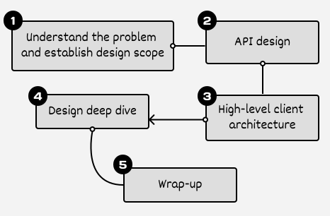
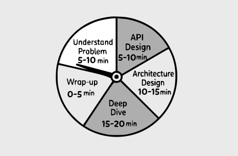

# A framework for Mobile SD interviews

Having a clear framework for Mobile System Design (MSD) interviews is more important than many realize. Without a clear structure, the interview can feel disorganized and challenging for both you and the interviewer. Unlike coding interviews with defined solutions, system design challenges invite multiple valid approaches, making a methodical strategy essential.

Below, we briefly outline a 5-step framework to give you a high-level understanding. Detailed explanations and practical applications of each step are explored through case studies in later chapters.

## A 5-step framework for effective mobile system design interviews

*Figure 1: High-level steps of the MSDI framework*

### Step 1: Understand the problem and establish design scope

MSD interviews typically start with broad questions such as "Design a News Feed app" or "Design a Pagination library." While these questions may seem straightforward, understanding exactly what you need to design is a crucial part of the interview.

Your first task is to clarify what's in and out of scope by asking targeted questions to define the boundaries of your design. The interviewer's answers will guide your technology choices and help you make informed trade-offs. This initial scoping sets the foundation for your solution, making each interview unique.

What kind of questions should you ask? Here's a list of different types of questions to help you get started:

- **What are we building?** These help uncover both functional and non-functional requirements, as well as what is out of scope for the interview. For example, you could ask:
  
  
  
  - *What features, screens, or critical user journeys are we designing?*
  
  - *Are we pre-fetching data? Are we including user authentication in the design?*

- **For whom are we building?** These help understand the scale, usage patterns, and how performant the solution should be. For example, you could ask:
  
  
  
  - *How many daily active users (DAU) does the product have? What's the expected growth?*
  
  - *Are we building a minimum viable product (MVP) or a final product?*
  
  - *What's our target market? A specific region or worldwide? What's the typical usage scenario? At home or on the train?*

- **What are the system's constraints?** These clarify the system boundaries and technology choices. For example, you could ask:
  
  
  
  - *Which mobile platforms are we targeting (e.g., iOS, Android, or both)?*
  
  - *Are there any existing systems or APIs the mobile app must integrate with?*

While gathering requirements, you may find that some answers reveal information about other aspects of the system. Feel free to make reasonable assumptions based on these responses, just be sure to state them clearly so your interviewer can correct any misunderstandings.

The goal isn't to ask every possible question. Instead, focus your questions on what's most relevant for the specific problem at hand, using your judgment to determine which details are most important to clarify.

**📌 Remember**: Your interviewer's answers to these questions will guide your technical decisions and trade-offs throughout the design process. Make sure to reference back to these requirements when explaining your choices later in the interview.

### Step 2: API design

The API design step is where you establish the contract between our client apps and external dependencies. This step is crucial because it helps align your understanding with the interviewer's expectations and creates a solid foundation for the rest of your design.

When designing an app that needs to communicate with a backend, start by defining the appropriate communication protocols for your specific use cases and the endpoints involved. On the other hand, if you're designing a mobile library, focus on outlining its public APIs, including how host apps will initialize, configure, and interact with your library.

As you define the API, outline the data models that will power these interactions. Whether you're working with JSON payloads, Swift structs, Kotlin data classes, or even protocol buffers for efficiency, these models need to capture the data's structure and relationships clearly.

### Step 3: High-level client architecture

After finishing the API design, it's time to create a high-level client architecture diagram that shows how these components work together.

This high-level diagram sets the stage for the design and shows exactly which components you need to fulfill our requirements. Most importantly, it helps you validate that you have a complete end-to-end flow that meets all the functionality our system needs. As you create the diagram, you should also identify interesting points that warrant deeper discussion in the deep dive step later.

### Step 4: Design deep dive

In this step, work with your interviewer to identify bottlenecks and explore specific components in greater detail. Generally, you should aim for two to three strong deep-dive discussions, though this isn't a strict rule and can vary depending on the situation.

You should continue refining your client architecture during this step. Make sure to update your diagrams to reflect any new decisions or components you introduce.

Pay attention to your interviewer's reactions and questions. If they express interest in multiple topics, manage your time carefully to give each topic the attention it deserves while staying within the interview's time constraints.

### Step 5: Wrap-up (optional)

If time allows, the final phase of your interview provides an opportunity to demonstrate your ability to think critically about your design and consider future improvements. Here's how to wrap up effectively:

- **Summarize key decisions**. If your discussion involved multiple trade-offs or complex decisions, consider providing a brief recap. This helps solidify the key points of your design and ensures the interviewer understands your reasoning, particularly after a detailed technical discussion.

- **Showcase critical thinking**. When asked about potential improvements to your design, resist the urge to defend it as perfect. Instead, thoughtfully discuss areas where your solution could evolve. This demonstrates self-awareness and analytical thinking, qualities that interviewers value highly.

- **Address edge cases**. Take this opportunity to discuss any failure points or error cases you haven't covered earlier. This shows that you think holistically about system reliability and user experience, not just the happy path.

- **Consider future scale**. Think about how your system would handle growth, whether that's supporting more users or accommodating a larger development team. This demonstrates that you design with the future in mind and understand both technical and organizational scaling challenges.

### Time allocation for each step

Time management is key in MSD interviews. With only 45-60 minutes to work with and a lot of ground to cover, having a solid plan helps you stay on track. Here's how to break down a typical 45-minute interview:

- **Understand the problem and establish design scope (5-10 minutes)**: Take time to fully understand the problem and define its scope.

- **API design (5-10 minutes)**: Map out how your app will communicate with backend services and define the core data models.

- **High-level client architecture (10-15 minutes)**: Outline the main components of your system and how they work together.

- **Design deep dive (15-20 minutes)**: Focus on the most important technical challenges and implementation details.

- **Wrap-up (0-5 minutes)**: Summarize key decisions and discuss potential improvements or trade-offs.

Remember that these are guidelines rather than strict rules. **Be ready to adjust based on the specific problem and your interviewer's interests**. The key is maintaining enough flexibility to explore important areas while ensuring you complete the full design within the time limit.