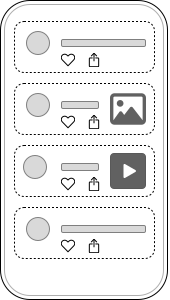
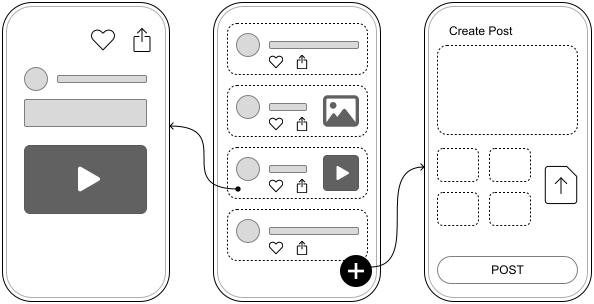
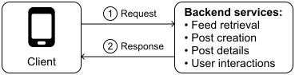
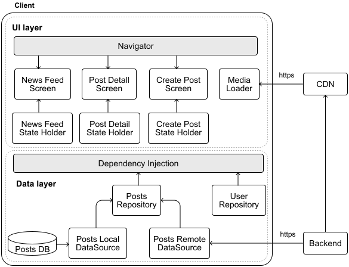
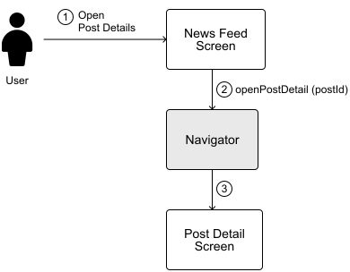
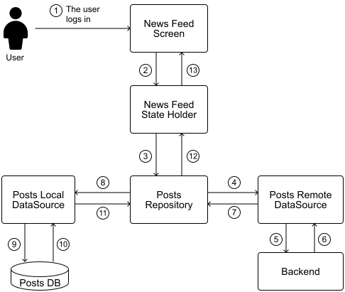
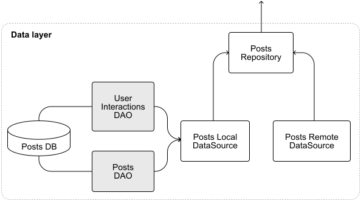
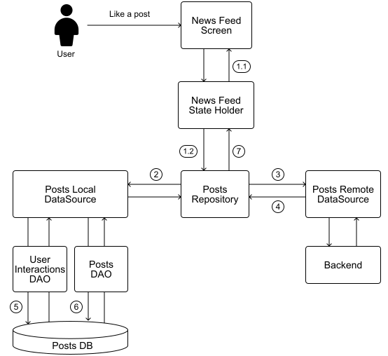
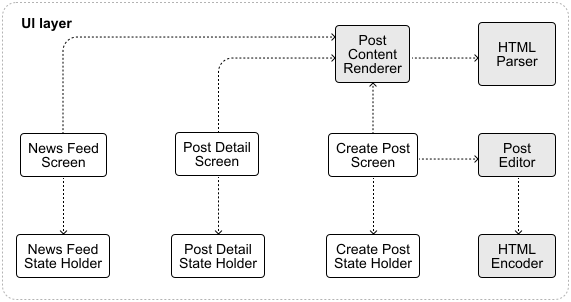

# News feed app

News feeds are the core feature of many popular social media platforms. From Facebook News Feed and X (formerly Twitter) Timeline to the Instagram Feed, these continuously updating streams of content keep users engaged by providing fresh updates from friends, family, and followed accounts, encouraging them to keep scrolling.

At its heart, a news feed is a continuously updating list of content items. This content typically includes status updates, photos, videos, links, etc. While each platform might brand their feed differently, the fundamental concept remains largely the same across applications. Most news feed systems share these key features:

- A scrollable list of content items.

- Detailed views for individual posts.

- Endless scrolling functionality.

- Common social interactions like likes, comments and shares.

While the core structure is often similar, specific content types and interviewer requirements can lead to varying technical approaches. In this chapter, we'll walk through the process of designing a news feed app, tackling the challenge step-by-step.



*Figure 1: A typical news feed mobile app*

## Step 1: Understand the problem and establish design scope

The first step in any system design interview is to gather information and clarify requirements. This helps us understand the features to support and overall scope of the project. Here's how a typical conversation between the candidate and an interviewer might unfold:

**Candidate**: Before diving into the mobile app specifics, I'd like to understand the broader ecosystem. Are we designing only for mobile, or should we consider other clients like web or wearables that might share the same backend?

**Interviewer**: Good question. While today's focus is on mobile, we should keep in mind that there will likely be other clients in the future.

**Candidate:** That's helpful, thanks. I'm thinking the app should support the following features: Users can view their feed, share and like posts, see post details, and create new content. The feed would implement infinite scrolling, loading more content as users reach the bottom. And posts are displayed in the order we receive them from the server. Is this aligned with what you're envisioning?

**Interviewer**: That's spot on.

**Candidate:** Great. Are we limiting posts to text only, or can users include media like photos and videos?

**Interviewer:** Let's make it more interesting. Users can include text and media attachments such as images and videos. Additionally, let's support rich text editing, so posts can have headers, bold text, italics, and so on.

**Candidate:** That adds a nice touch. What about real-time features? Are we implementing live updates for things like share counts and likes? Or push notifications for new posts from close friends?

**Interviewer:** For simplicity, let's exclude real-time updates and notifications in this design.

**Candidate:** Fair enough. Can you give me an idea of the scale we're working with? How many users are we expecting, and what's their geographical distribution?

**Interviewer:** We're aiming big: 500 million monthly active users, spread across the globe.

**Candidate:** That's a substantial scope. Given the global distribution and the fact that users will be accessing our app from regions with varying network reliability, should we include an offline mode for viewing previously loaded content? And what about pre-fetching content to speed up initial load times?

**Interviewer:** Offline mode is a yes, great idea. Let's skip pre-fetching for this exercise.

**Candidate:** Noted. Are we designing user authentication, or can we assume users are already logged in?

**Interviewer:** Assume they're authenticated within the system.

The conversation can continue covering other topics we might consider interesting and relevant to news feed apps. Through this back-and-forth, we can build a clear picture of what needs to be designed. Let's summarize what we need to build.

#### Requirements

Based on our discussion, we're designing a news feed system with the following **functional requirements**:

- Users can browse a feed of posts from others.

- Users can like and share posts directly in the feed.

- Users can compose posts with rich text, images, and videos.

- Tapping a post opens a detailed view.

- Infinite scrolling fetches more posts as users scroll down.

- Offline mode allows access to previously loaded content without connectivity.

As for **non-functional requirements**, we need to build a system that ensures:

- Scalability: Our system should handle 500 million monthly active users globally, adapting to varied network conditions while maintaining responsive performance.

- Performance: The app must deliver smooth scrolling experiences and efficient post creation, with optimized handling of media content across all device types.

- Reliability: Users should experience consistent functionality even with poor network connectivity, with effective caching for offline access.

- Data efficiency: The system should minimize data consumption for users on limited plans through smart caching and selective content loading strategies.

- Consistency: The app should maintain eventual consistency for actions performed offline, ensuring reliable synchronization when connectivity is restored.

Features that are **out of scope** for this exercise:

- Real-time updates and push notifications.

- Pre-fetching of posts before the user opens the app for quicker post loading.

- Authentication, we'll assume users are already authenticated.

#### UI sketch

- The **News/Posts Feed screen** is the heart of our app, displaying an endless list of posts. Users can like and share posts directly from this screen. Tapping a post opens its detailed view. A Floating Action Button (FAB) allows users to create new posts.

- The **Create Post screen** allows users to compose new posts with rich text, images, and videos.

- The **Post Detail screen** shows the full content of a selected post, along with options to like and share.



*Figure 2: Basic sketch of our news feed mobile app showing the screens and their relationships*

Having framed the problem and outlined the user experience, we've built a strong foundation for our design. Next, we'll explore the API design to support these features.

## Step 2: API design

The purpose of the API design is to establish a clear and detailed agreement between the clients and the backend system. Well-defined APIs ensure that both you and the interviewer are aligned on the functional requirements. In this section, we will talk about three main areas:

- Communication protocol.

- API endpoints.

- Additional considerations for API design.

### Communication protocol

Let's first examine the main interactions that will occur between our client and backend:

- **Feed retrieval**: When a user opens the app, the client requests recent posts from the backend.

- **Post creation**: As users create new posts, the client sends this content to the backend.

- **Post details**: When a user taps on a post, the client fetches additional details from the backend.

- **User interactions**: The client notifies the backend when a user likes or shares a post.



*Figure 3: Client-initiated requests to the backend in the news feed app*

Notice that in all these scenarios, the client initiates the interaction. Given our app's large scale and the variety of client types we're supporting, **HTTP with REST APIs** emerges as a suitable choice for our communication protocol. Let's examine the advantages and disadvantages in Table 1:

| HTTP with REST Advantages | HTTP with REST Disadvantages |
| --- | --- |
| Widely used and well-understood. Developers are generally familiar with it, making implementation and maintenance easier. Servers are stateless. Each request contains all the information needed to process it, simplifying horizontal scaling and handling multiple clients. Can leverage HTTP caching mechanisms to reduce server load and improve response times by serving cached data when appropriate. | Managing different versions of an API can become cumbersome as the API evolves. Without a solid versioning strategy, some APIs may become bloated or difficult to maintain. Stateless means each request is independent and carries all necessary info, such as auth tokens or session data, every time. This repetitive overhead, especially without persistent connections, can impact mobile performance through extra data usage and connection setup latency. Some clients might receive more data than needed (over-fetching) or require multiple requests to get all necessary data (under-fetching). |

Table 1: HTTP with REST advantages and disadvantages

While there are other options for client-server communication, such as GraphQL that can avoid over-fetching by allowing clients to specify exactly what data they need in a single request, we'll focus on **HTTP with REST APIs** in this chapter. This approach is widely used in the industry, with prominent examples including Meta's Graph API [1], Reddit APIs [2], and X (formerly Twitter) APIs [3].

For data encoding, we have several choices, including JSON, XML, and protocol buffers. Table 2 compares these options to determine the best fit for our news feed app.

| JSON | XML | Protocol Buffers |
| --- | --- | --- |
| Human-readable and results in smaller payloads compared to XML. Natively supported in most programming languages and commonly used with REST APIs. | Given we won't need to send much metadata in our news feed app's network requests, JSON is preferable to XML. | Could be a good option for our news feed app. However, we're not making our app performance-critical in this exercise, so we can avoid the steep setup cost by using JSON. |

Table 2: Trade-offs for encoding data over the network in the news feed

For our news feed app, we'll use **JSON as our data format**. This choice offers a good balance of simplicity, readability, and efficiency. While Protocol Buffers could be a potential optimization, it's a more specialized technology, and not every developer is familiar with it. For simplicity, we'll opt for JSON in our design. However, if you're comfortable with Protobufs, feel free to use it for the API design. It's a great option too.

**✅ Decisions made!**

- **HTTP with REST APIs** for client-server communication.

- **JSON** as the data format for these network exchanges.

### API endpoints

Now that we've chosen our communication protocol and data format, let's design the specific endpoints our system needs. We'll focus on the core interactions required for our news feed functionality.

#### Feed retrieval

```
Authentication: Bearer <token>
GET /v1/feed?after=<some-value>&limit=30
    Body: empty
    Response: 200 OK. Payload of type FeedApiResponse

```

**📌 Remember:** Including a version in endpoint APIs, such as /v1/, gives us
flexibility to introduce breaking changes in newer versions while maintaining
stability in older ones. This versioning approach allows for controlled API
deprecation when needed. For more on API versioning, see Chapter 10: Mobile
System Design Building Blocks.

##### Data models

Since this is a GET request, the request body is empty. As a response, we receive a FeedApiResponse object with the following structure:

| Kotlin | Swift |
| --- | --- |
| **data class FeedApiResponse** feed: List<PostPreview> paging: PaginationMetadata | **struct FeedApiResponse** feed: [PostPreview] paging: PaginationMetadata |
| **data class PostPreview** postId: Long contentSummary: String author: AuthorPreview createdAt: String liked: Boolean likeCount: Int attachmentCount: Int attachmentPreviewImageUrl: String? | **struct PostPreview** postId: Int64 contentSummary: String author: AuthorPreview createdAt: String liked: Bool likeCount: Int attachmentCount: Int attachmentPreviewImageUrl: String? |
| **data class AuthorPreview** id: Long name: String profileImageThumbnailUrl: String | **struct AuthorPreview** id: Int64 name: String profileImageThumbnailUrl: String |

The PostPreview data model is designed with efficiency in mind. It fetches just enough data to create a rich user experience without overloading network or client resources. Instead of retrieving all attachments, we only fetch a count and a single preview thumbnail URL. We also include key interaction details such as whether the user has liked the post.

**🛠️ Platform implementation details**

Throughout this book, we present API responses as Kotlin and Swift data models rather than raw JSON. In practice, these JSON payloads get converted to platform-specific data structures within the network layer (specifically in the network data sources shown in our architecture diagrams).

On Android, developers often rely on libraries such as kotlinx.serialization, or Moshi for JSON serialization and deserialization.

On iOS, Swift's built-in Codable protocol handles this elegantly, mapping JSON fields to Swift struct properties.

##### Pagination

Our feed endpoint needs to support pagination since we're displaying posts in an infinite scrolling list. In Chapter 10, we cover different pagination types and their trade-offs. For our news feed, offset pagination would struggle with our frequently updated content. As users scroll deeper, the query performance degrades, and the content window becomes inaccurate as new posts are added.

**Cursor-based pagination** works better for our use case because it:

- Handles large datasets more efficiently by using indexed columns instead of calculating offsets.

- Provides better feed consistency by using unique identifiers to maintain stable ordering.

- Works well with real-time content that's constantly changing

**✅ Decision made!** We use cursor-based pagination in the feed retrieval endpoint.

##### Other headers

The presence of the Authentication header in the endpoint indicates that the user needs to be authenticated to call this endpoint. Also, as we use JSON as the data format, you can assume all our requests include an Accept: application/json header by default.

#### Post creation

Unlike the GET requests we use to fetch data, we use POST requests to send new information to the backend:

```
Authentication: Bearer <token>
POST /v1/posts
    Body: NewPostRequest
    Response: 201 Created

```

When creating a new post, the client sends a POST request with a NewPostRequest in the body. This contains all the details about the new post. The server responds with a 201 status code to indicate successful creation, but doesn't include any data in the response body.

| Kotlin | Swift |
| --- | --- |
| **data class NewPostRequest** requestId: Long content: String attachments: List<NewAttachment> | **struct NewPostRequest** requestId: Int64 content: String attachments: [NewAttachment] |
| **data class NewAttachment** type: String contentUrl: String caption: String? | **struct NewAttachment** type: String contentUrl: String caption: String? |

Note that the requestId sent by the client isn't the same as the postId assigned by the server. Some critical information, such as the postId and created_at timestamp, is generated by the backend rather than sent by the client. This approach ensures the backend remains the source of truth for critical data. We'll explore this concept in the "Additional considerations for API design: ID and timestamp generation" section.

For attachments, our endpoint design assumes that media has already been uploaded to our servers before creating the post. The client simply includes the URL of the uploaded attachment in the NewAttachment's contentUrl field. This two-step process (first uploading attachments, then creating the post) helps manage large files more efficiently. We'll explore this process in more detail in the deep dive section.

#### Post details

```
Authentication: Bearer <token>
GET /v1/posts/`{postId}`
    Body: empty
    Response: 200 OK. Payload of type PostDetailApiResponse

```

Following REST API guidelines, the request path includes the postId parameter to identify exactly which resource we want to retrieve.

| Kotlin | Swift |
| --- | --- |
| **data class PostDetailApiResponse** post: PostDetail | **struct PostDetailApiResponse** post: PostDetail |
| **data class PostDetail** postId: Long content: String author: AuthorPreview createdAt: String liked: Boolean likeCount: Int shareCount: Int attachments: List<Attachment> | **struct PostDetail** postId: Int64 content: String author: AuthorPreview createdAt: String liked: Bool likeCount: Int shareCount: Int attachments: [Attachment] |
| **data class Attachment** id: Long type: String contentUrl: String previewImageUrl: String? caption: String? | **struct Attachment** id: Int64 type: String contentUrl: String previewImageUrl: String? caption: String? |

Unlike the PostPreview data model, PostDetail contains all the information associated with a post, including the full content and all attachments with their respective content.

**📌 Remember!**

In apps with a list-detail structure such as our news feed, it's common to use two different data models for the same content:

- A lightweight model for the list view (PostPreview in our system) that contains just enough information for a good list experience and uses thumbnails or low-resolution images to save bandwidth.

- A full model for the detail view (PostDetail in our system) that includes all post details and higher-resolution images, loaded only when a user shows interest by tapping on a post.

This two-tier approach balances app responsiveness with user experience. It helps both the client and server save resources by loading detailed data only when necessary, optimizing network usage, processing power, and memory consumption. This is especially important for low-end mobile devices.

#### User interactions with a post

The endpoint for user interactions with posts follows a similar pattern to post creation:

```
Authentication: Bearer <token>

POST /v1/posts/`{postId}`/interactions
    Body: PostInteractionRequest
    Response: 201 Created

```

| Kotlin | Swift |
| --- | --- |
| **data class PostInteractionRequest** requestId: Long type: String | **struct PostInteractionRequest** requestId: Int64 type: String |

The interaction's type could be an enum with different values such as LIKED, REMOVED_LIKE, or SHARED. The requestId is typically a random UUID [4] generated by the client which helps the backend identify unique requests but isn't stored long-term.

**📝 Note:** These POST requests don't include the user's ID. Instead, the
backend extracts this information from the authentication token. This approach
not only saves bandwidth by avoiding redundant data but also prevents
potential security issues that could arise from mismatched user IDs in the
request and the auth token.

### Additional considerations for API design: ID and timestamp generation

You may have noticed that when creating a new post, we don't send the postId or created_at timestamp to the backend. This deliberate choice helps maintain data integrity at scale. In large-scale applications, centralizing ID and timestamp generation on the backend offers several advantages:

- **Consistency**: The backend can enforce uniform formats and validation rules across all clients.

- **Reliability**: Client devices might have incorrect system clocks or could be manipulated, leading to inaccurate timestamps.

- **Uniqueness**: The backend can guarantee unique IDs without collisions, even under high transaction volumes.

- **Database integration**: Backend systems can leverage database features such as auto-incrementing keys and timestamp functions (such as CURRENT_TIMESTAMP) to efficiently generate these values during insertion.

Many companies have developed specialized mechanisms for generating IDs at scale, such as X (formerly Twitter)'s Snowflake ID system [5], which creates distributed, time-based IDs that maintain proper ordering while avoiding collisions across multiple servers.

By keeping these critical operations on the backend, we establish a reliable foundation for our data that becomes increasingly important as our user base grows to hundreds of millions.

## Step 3: High-level client architecture

With our backend communication protocol, endpoints, and data models defined, we're ready to design the high-level architecture of our mobile system. In this section, we'll cover:

- High-level mobile architecture design.

- External server-side components.

- Key client architecture components for UI and data layers.

- Data flow across app layers.

Let's build our design based on the requirements we've gathered and the APIs we've defined. These will guide our decisions about which components to include in our architecture. Figure 4 shows the high-level mobile architecture for our news feed system. Notice that the arrows represent data flow, not component dependencies. This distinction is important for understanding how information moves through our app.



*Figure 4: News feed high-level mobile architecture*

Let's examine the key components of our architecture and how they work together, starting with the external server-side components.

### External server-side components

Our system relies on two key external components to handle data storage, business logic processing, and content delivery.

#### Backend

The primary external component in our system is the **Backend**. As discussed earlier, it's a RESTful service that communicates with our client app using HTTPS and JSON for data exchange. The backend serves two primary functions:

- It provides the client app with the data it needs such as posts, and user information.

- It permanently stores users' posts and interactions.

The backend contains most of the business logic in our system, handling operations such as feed generation, post creation, and user interaction processing.

#### Content Delivery Network (CDN)

We can enhance our design by adding a **Content Delivery Network (CDN)**. CDNs excel at distributing static content such as user profile images and media attachments across various geographical locations. This approach offers several benefits:

- Helps load the news feed quickly and consistently regardless of the user's location.

- Reduces load on servers, particularly helpful during traffic spikes or major events [6].

- Improves overall performance by serving content from servers physically closer to users.

Given the scale of our system (500 million monthly active users) and the amount of static content we need to deliver, **adding a CDN is a smart choice**. It will help us maintain performance and user experience as our user base grows. In our setup, the backend is responsible for providing the CDN with the content to distribute.

### Client architecture

Now that we've outlined the external components our client will interact with, let's dive into the core of our mobile system design. We're aiming to build an app that's robust, performant, and scalable. To achieve this, we've structured our architecture into two main layers:

- The **UI layer** is where users interact with our app. It's responsible for displaying posts, handling user interactions, and preparing data for the screen. This layer creates the visual experience users engage with.

- The **Data layer** acts as the backbone of our app, handling the client-side business logic for posts. It manages how posts are created, modified, and retrieved on the device.

**💡 Pro tip!**

During your interview, use the architectural patterns you're most comfortable with, whether that's the repository pattern, Clean Architecture, MVVM, MVI, or MVP.

What matters most isn't which pattern you choose, but how clearly you can explain your reasoning and demonstrate how data flows through your design. Interviewers want to see your thought process and how you organize components to solve real problems.

For comprehensive coverage of architectural patterns and topics, refer to Chapter 10: Mobile System Design Building Blocks.

To ensure our app remains predictable and error-resistant, we're implementing **Unidirectional Data Flow (UDF)** and **Reactive programming** to propagate data through our architecture. With UDF, data flows in one direction (from data sources through our repositories to UI components) while user actions flow in the opposite direction through clearly defined channels. Reactive programming complements this by providing tools to handle asynchronous data streams and propagate changes throughout the app. Together, these approaches create a predictable, maintainable system with clear data paths and efficient state management.

**🛠️ Platform implementation details**

To implement UDF and Reactive Programming, Android developers can leverage Kotlin Coroutines and Flow APIs. On iOS, the Combine framework offers similar capabilities.

We're also adhering to key software design principles such as **separation of concerns** and **single responsibility**. Each component in our diagram has a specific, well-defined role. To tie everything together and make our app more modular and testable, we'll use **dependency injection** to keep our components loosely coupled.

**✅ Architecture decisions made!**

- **Layered architecture** consisting primarily of UI and data layers.

- **Unidirectional Data Flow (UDF)** and **Reactive programming** to shape how data flows through the architecture.

Let's now examine the key components within each layer and define their responsibilities.

#### Data layer

When designing the data layer, we need to consider the types of application data the app handles. For each type of application data, we typically include:

- **A Repository** that acts as the main interface for that data type, exposing it to the rest of the app and handling related business logic.

- **Data Sources** that manage specific data operations. We might have zero to many data sources, depending on where we need to fetch or store data.

**💡 Pro tip!**

The data layer is crucial as it contains both the client-side business logic and application data. In most system designs, it's worth dedicating more time to this layer as that demonstrates to your interviewer that you understand the importance of robust data management and business logic in mobile app architecture.

In our news feed app, the main type of application data is Posts. To handle this data effectively, we set up these key components in our data layer:

- The **Posts Repository** is the central component that exposes the news feed and individual posts to the app, managing the core business logic.

- The **Posts Remote Data Source** handles network communication with the backend for fetching and sending post data.

- The **Posts Local Data Source** manages local storage of posts, enabling offline functionality.

Additionally, we include a **User Repository** to handle user-related information, such as the currently logged-in user's details and authentication token.

By structuring our data layer this way, we create a clean separation of concerns. Each component has a clear responsibility, making our system more modular and easier to maintain. This approach also allows us to easily add support for other types of data in the future, such as user profile data or analytics, following the same pattern.

**💡 Pro tip!**

When creating and discussing the high-level architecture diagram during your interview, focus on the most critical aspects rather than covering every detail. Your interviewer will likely assume you have a solid grasp of the fundamentals. Prioritize explaining your key design decisions and trade-offs. If the interviewer wants more information on a particular point, they'll ask follow-up questions.

For example, you wouldn't need to explain basic concepts like what UI and data layers are. Instead, concentrate on how you've applied these concepts to solve the specific problem at hand. This demonstrates your ability to focus on what's important and communicate effectively under time constraints, both valuable skills in real-world mobile development.

#### UI layer

With our data layer components in place, let's move on to the UI layer, which handles how we present information to users. To keep things simple, we'll create high-level UI components for each screen we identified in our requirements gathering phase. Our system includes three main screens: News Feed, Post Detail, and Create Post.

**💡 Pro tip!**

Don't aim for perfection in Step 3: High-level client architecture. We're creating a basic skeleton of our mobile app's architecture, not a complete blueprint. We'll have chances to refine and improve the design throughout the interview. We should keep an eye on the clock and avoid getting caught up in details, the goal is to create a solid foundation that we can build upon later.

Each screen has a corresponding State Holder component (think of a ViewModel on Android) that serves two key functions:

- It manages the UI state, determining what data should be displayed on the screen.

- It handles the screen's logic, which might involve processing user interactions, transforming data for display, and coordinating with the data layer to fetch and modify application state.

Tying these screens together is a **Navigation component** that manages how users move between screens and passes along any necessary information, such as a postId when opening the Post Detail screen.

##### Use case: News Feed

Let's use the News Feed screen to illustrate how the UI layer works in practice. While we won't cover every screen, this example represents the general approach for all screens in the app.

The News Feed State Holder automatically subscribes to the Posts Repository in the data layer. This subscription retrieves relevant post data to display to the user. The state holder exposes this data to the UI through a NewsFeedUiState stream, implemented as an observable data holder. Besides post data, the UI state may include other important information such as error messages, loading indicators, or other UI-specific states.

| Kotlin | Swift |
| --- | --- |
| **data class NewsFeedUiState** feed: List<PostPreviewUiModel> isLoading: Boolean errorMessage: String? | **struct NewsFeedUiState** feed: [PostPreviewUiModel] isLoading: Bool errorMessage: String? |

**📝 Note:!** The NewsFeedUiState uses a PostPreviewUiModel instead of the previously defined PostPreview. This is intentional! It's a best practice to separate domain or data models from UI models. The UI layer often requires only a subset of the full data, sometimes even reshaped or pre-processed to efficiently render the screen. This approach keeps the UI lean, minimizes unnecessary memory usage, and allows the data presentation to evolve independently of backend or storage changes. The closer the model is to the UI, the more it should reflect what the UI needs, not how the data is stored or retrieved.

For navigation events, the UI component handles user interactions directly. When a user taps on a post in the feed, the News Feed Screen notifies the Navigation component about which screen to display next, passing along the relevant postId (Figure 5). This approach is common in event-based navigation libraries.



*Figure 5: Opening a post detail data flow*

The News Feed State Holder also manages user interactions such as liking or sharing a post. When a user likes a post, the state holder delegates this action to the Posts Repository, which handles changes to the application data. If the system uses optimistic writes, the state holder immediately updates the UI state to reflect the like action, providing instant feedback to the user.

##### Common components in the UI layer

We introduce a **Media Loader component** to handle post media attachments including image loading, which are typically represented as string URLs in our data models. This component efficiently downloads and manages static images and other media, typically served from our CDN.

This approach centralizes media handling, ensuring consistency across the app and providing optimized caching, loading, and error handling for all visual content. The Media Loader can also implement features such as progressive loading or placeholders to enhance the user experience even further.

#### Data flow across app layers

To illustrate how data flows through the app hierarchy, Figure 6 shows what happens when a user logs in to the app for the first time. As soon as login completes, the News Feed state holder subscribes to the Posts Repository's data stream. Since the local data source is empty at this point, the repository reaches out to the backend to fetch the user's news feed (step 4).

Once the network data source receives the backend response, the Posts Repository updates the local database through the local data source (step 8). This update triggers a chain reaction: the local data source emits the updated database state into the posts data stream, which propagates up to the UI, refreshing the screen with the user's news feed (step 13).



*Figure 6: User login data flow*

**💡 Pro tip!** Before moving on, pause to check that the functional and
non-functional requirements outlined earlier are covered. It's much easier to
address any missing use cases now rather than later when you're deep in
technical discussions. Think of it as double-checking your foundation. You
want it solid before building on top of it.

## Step 4: Design deep dive

Now that we've sketched out the high-level client architecture, it's time to dig into the details. In a mobile system design interview, the areas you explore in depth often depend on your interviewer's interests and the unique challenges of the system you're designing. For our news feed app, we'll focus on these key areas:

- Local storage and offline mode support.

- Optimistic writes and offline interactions.

- Displaying rich post content.

- Troubleshooting janky news feed scrolling.

### Local storage and offline mode support

A core requirement of our news feed app is the ability to function effectively without an internet connection. To deliver this experience, we need a robust local storage strategy that balances performance, resource usage, and user experience.

To maintain optimal performance, we need to implement thoughtful data management strategies for both our database content and media assets. Let's examine these topics: storage and eviction policies, offline mode user experience, and caching strategy for media content.

#### Choosing the right storage solution

Local storage in our app serves several critical purposes:

- Offline browsing and resilience against poor connectivity: When there's no internet connection or in areas with spotty coverage, users can still scroll through previously cached posts, ensuring users always have something to engage with.

- Improved performance: Opening a cached post details happens instantly, as data loads from local storage rather than making a network request.

When selecting a storage solution for our news feed, we need to consider the structure and access patterns of our data. Let's compare the main options in Table 3:

| **Relational Database** | **Non-relational Database** | **Key-value stores** |
| --- | --- | --- |
| Posts content is a well-structured data model that requires complex data relationships and advanced querying needs such as filtering, sorting, and potentially searching through posts. Relational databases can provide data integrity and consistency and are designed to scale efficiently. | Posts data is a well-structured data model, so we won't benefit from the advantages of non-relational databases. We need support for complex queries and cannot allow inconsistencies in our local storage. | Key-value stores aren't designed for handling large amounts of data or complex data structures. The lack of relational structure could lead to data redundancy. Storing too much data can lead to performance degradation. They don't support relationships, advanced querying, or transactional operations out of the box. |

Table 3: Trade-offs for storing posts data locally on the device

Given these considerations, we'll implement a **relational database** for our news feed app. This solution provides the best combination of structured data storage, query capabilities, and transactional support needed for our offline functionality.

**💡 Pro tip!**

For most mobile apps, a relational database is the go-to choice for storing application data. It offers built-in scalability, robust platform support, and mature tooling that handles common data access patterns effectively. While other storage options exist, it's safe to consider a relational database the default starting point unless specific requirements suggest otherwise.

##### Database eviction policy

Our news feed app serves a large user base with a constant stream of new content. Storing every post indefinitely on the client would be inefficient and wasteful of device resources. Instead, we need an intelligent eviction policy that keeps our local database lean and relevant.

We can design a hybrid approach combining three complementary policies:

- **Least Recently Used (LRU)**: Prioritizes keeping posts the user has recently viewed, as these are most likely to be accessed again.

- **Time-to-Live (TTL)**: Sets expiration times for each post, ensuring our cache doesn't contain stale content.

- **Custom Minimum Threshold**: Guarantees that a baseline number of posts always remains available for offline viewing.

This combined approach offers an optimal balance, prioritizing content that's both fresh and relevant to the user while efficiently managing device storage. When determining optimal cache settings, we'll start with these defaults:

- Maximum cache size: 100-200MB, adjustable based on usage patterns.

- Default TTL: 15 days for regular posts.

- Minimum threshold: 50 posts or equivalent to fill 2-3 screens.

These parameters should be configurable from the backend, allowing us to fine-tune based on real-world analytics data.

#### Offline mode user experience

When a user has no internet connection and opens the app, they'll see posts previously cached in the database. This provides a seamless experience even without connectivity. To make this work, we follow the Single Source of Truth (SSOT) pattern and store posts in a local database on the device as soon as we receive them from the backend. For security reasons, we scope the database to the current user, clearing it when they log out to protect their data.

The Posts Repository consistently exposes a stream of post data from the local data source, regardless of internet connectivity. This approach establishes **the local data source as the single source of truth for post data in the client**, ensuring users always have access to content they've previously seen.

**📌 Remember the Single Source of Truth (SSOT) pattern.**

A fundamental principle in our architecture to support offline mode is establishing the local database as the single source of truth for post data within the client. This means:

- All UI components retrieve data exclusively from the local database, never directly from the network.

- Network responses update the local database, which then propagates changes to the UI.

- User interactions are recorded in the local database before being sent to the server.

This pattern creates a consistent flow of data regardless of network status: Backend → Local Storage → UI.

If the user attempts to refresh their feed while offline:

- The Posts Repository tries to fetch data from the remote data source.

- This attempt fails due to the connection issue.

- The failure propagates to the state holder, which updates the UI state.

- The UI displays an appropriate message about connectivity issues.

- Previously cached content continues to be displayed.

This offline-first approach ensures our app remains useful and engaging even in challenging connectivity scenarios, significantly improving the user experience in regions with unstable networks or for users who frequently transition between connected and disconnected states.

**🔍 Industry insights:**

Early versions of Facebook's iOS app used Apple's Core Data to cache feed stories locally. This became slow at their scale and they replaced it with a lightweight, denormalized disk cache using object serialization, seeing significant performance improvements [7].

Instagram's mobile app also caches feed content on disk to enable offline usage. It maintains a response store for feed JSON and an image/video cache so that content can be delivered from disk as if from the network when offline [8].

Reddit chose to use Android's internal storage for video caching after external storage proved unreliable on some devices [9].

### Optimistic writes and offline interactions

Optimistic writes and offline interaction capabilities are crucial for delivering a top-notch user experience at scale, especially for boosting engagement and retention. These features allow users to interact smoothly with the app, even on low-end devices or in areas with poor network connectivity.

**Optimistic writes are a design strategy that immediately updates the app's UI in response to user actions, without waiting for backend confirmation**. This approach creates a more responsive and fluid experience by giving users the impression that their actions take effect instantly.

When handling a UI event that calls for optimistic writes, such as liking a post, the state holder performs two parallel actions:

- It immediately updates the UI state to reflect the change, as if the data layer had already confirmed it. This is the essence of an optimistic write.

- It calls the Posts repository to update the application state and notifies the backend via a network request.

Once the backend syncs the optimistic write, the UI remains unchanged even if the underlying application data updates. This is because the UI was proactively updated during the initial optimistic write.

Supporting optimistic writes and offline interactions effectively requires careful implementation. We'll explain how to approach this from four angles:

- Data layer updates.

- Error-handling strategies.

- Common challenges and how to avoid them.

- A walkthrough of an optimistic write data flow example.

#### Data layer updates

Optimistic writes work well for some events, but it's important to go a step further. We should store all user interactions locally until the backend confirms them. This approach supports offline functionality and ensures we don't lose any data during offline periods or poor network conditions.

To make this work, we use the local database as a queue, keeping track of user interactions in the order they happen. If there are user interactions to process when the device is offline, the repository will go through the queue in the background when the device regains connectivity.

To maintain the order of records, we use an AUTO INCREMENT field as the id in a new UserInteraction data model. This model also includes:

- postId and userId to identify the relevant post and user.

- action field for interaction types (e.g. LIKED, UNLIKED, SHARED, BOOKMARKED).

- status field to track the interaction's state (PENDING, FAILED or CANCELED).

- updated_at timestamp to record the last sync attempt.

- failureCount to track unsuccessful sync attempts.

| Kotlin | Swift |
| --- | --- |
| **data class UserInteraction** id: Long postId: Long userId: Long action: UserInteractionAction status: UserInteractionStatus createdAt: String updatedAt: String failureCount: Int | **struct UserInteraction** id: Int64 postId: Int64 userId: Int64 action: UserInteractionAction status: UserInteractionStatus createdAt: String updatedAt: String failureCount: Int |
| **enum class UserInteractionAction** LIKED, UNLIKED, SHARED, BOOKMARKED | **enum UserInteractionAction** case liked, unliked case shared, bookmarked |
| **enum class UserInteractionStatus** PENDING, FAILED, CANCELED | **enum UserInteractionStatus** case pending, failed, canceled |

It's important to sync all user interactions with the server, even if multiple interactions occur on the same post. This data can provide valuable insights for analysis. To handle potential conflicts, we can employ the "last write wins" strategy.

In our local database, we add a new UserInteractions table to store all user interactions. Once an interaction successfully syncs with the server, the Posts Repository removes it from the UserInteractions table, and updates the corresponding entry in the Posts table.

We represent the database tables in the data layer design (Figure 7) as Data Access Objects (DAO) components.



*Figure 7: Data layer design update*

#### Error handling strategies

When user interactions fail to sync with the server, we need a robust error handling approach. Let's implement a retry mechanism with exponential backoff:

- If a network request fails, we mark the interaction status as FAILED.

- The system then attempts to retry the sync after a progressively longer delay.

- This process continues until we reach a maximum number of attempts.

What happens if we hit that maximum? It depends on how critical the interaction is. For less critical actions, we might simply update the status to CANCELED and roll back any UI changes. For more important interactions, we could notify the user. For instance, if a post submission fails, we might send a push notification asking the user to retry manually.

But what about cases where the backend state has changed since our optimistic write? This is where conflict resolution comes into play. We have a few options: discard the local interaction, attempt to merge the changes, or notify the user about the conflict and let them decide. The best approach often depends on the specific use case and the nature of the data involved.

#### Common challenges

While optimistic writes and allowing offline interactions can greatly enhance user experience, they come with their own set of challenges. Let's explore some common ones and how we address them in our system:

- The big challenge is maintaining data consistency between the client and backend.
  
  
  - To overcome this, we treat the backend as the single source of truth. Whenever we receive data from the backend, we update our local Posts database to match, ensuring alignment.

- User interactions could potentially be applied out of order.
  
  
  - To mitigate this, we include timestamps for both creation and last modification of each interaction. Furthermore, we send these interactions to the backend in order, ensuring sequential processing.

- Users might experience confusing UI behavior or anomalies if optimistic updates are rolled back or if conflict resolution isn't clear.
  
  
  - For critical scenarios, we notify the user of what happened and guide them on next steps.

- Optimistic writes can put additional strain on the backend due to retries and conflict resolution.
  
  
  - We mitigate this by implementing an exponential backoff strategy for retries. We could also batch user interactions if needed.

#### Optimistic write data flow

- When the state holder receives the UI event, it performs two actions in parallel:
  
  
  - Updates its UI state to reflect the change (step 1.1), providing instant feedback to the user.
  
  - Notifies the repository about the interaction (step 1.2), which persists locally (step 2) and syncs with the backend (step 3).

- After the interaction is successfully synced (step 4), the local data source first removes the user interaction from the database (step 5) and updates the Post (step 6).

- Subsequent updates to the local database after the optimistic write don't cause new UI state emissions from the state holder (step 7). This is because the UI state doesn't change, we updated the UI state optimistically in step 1.1.



*Figure 8: Optimistic write data flow*

By implementing optimistic writes and robust offline capabilities, we create an app that feels responsive and reliable under all network conditions. This approach significantly enhances user experience and effectively manages the complexities of distributed systems.

**🔍 Industry insights:**

Instagram developed a Direct's Mutation Manager in their mobile apps to
manage potential issues such as network failures or data inconsistencies for
optimistic writes [10].

### Displaying rich Post content

Our system requirements include allowing users to add rich text to their posts. While the Post's content is stored as a simple String, displaying it as plain text wouldn't meet user expectations. Modern social networks offer features such as links, mentions, and text styling. Our application goes a step further by supporting rich editing, including elements such as headers, bold text, and italics.

To handle this rich content effectively, we have two main options: create our own markup language or use an existing one like HTML or Markdown. Let's examine the trade-offs of each approach.

Developing a custom markup language can be expensive and requires ongoing maintenance. Facebook's past attempt at this, the Facebook Markup Language (FBML), was eventually deprecated [11] in favor of standard HTML and JavaScript, primarily using React. X (formerly Twitter), on the other hand, still uses a custom approach with their own text library [12]. Some companies opt for existing solutions, such as Reddit, which uses a specialized version of Markdown [13].

Given our current needs, creating a custom markup language or parsing method isn't the best use of our resources. Instead, let's consider which standard markup language would best suit our system in Table 4:

| **Option** | **Advantages** | **Disadvantages** |
| --- | --- | --- |
| HTML | Supports rich formatting needed for news feed posts. Allows custom elements for future features such as text highlighting in posts or user mentions. Consistent rendering across platforms. | Complexity could impact user post creation for non-technical users. Requires sanitization to prevent XSS attacks. Rendering HTML content can be resource-intensive and it may affect scrolling performance on low-end devices. |
| Markdown | Simpler for users to create formatted posts with basic features. Can be converted to HTML for rendering, giving us flexibility in how we process and display content. | Limited formatting options for our rich content needs and might be insufficient for complex post layouts. Markdown still has its own syntax that users need to learn. |

Table 4: Trade-offs for encoding posts content

Given our requirements for a modern, rich, and interactive news feed with diverse formatting options, **we've decided to use HTML for encoding post content**. This choice allows us to leverage HTML's versatility while addressing its potential drawbacks:

- To manage HTML's complexity, we'll establish best practices that define a consistent way to implement each app feature. This approach will help prevent multiple HTML methods from being used for the same functionality.

- Since our backend sends post content and summaries as HTML-encoded strings, we need to prioritize content validation and sanitization. This step is crucial in preventing security vulnerabilities such as XSS attacks.

**🛠️ Platform implementation details**

To validate and sanitize HTML-encoded Strings, we can use the OWASP Java HTML Sanitizer or the jsoup libraries on Android. For iOS, we can use the HTMLKit or Purifier libraries.

By implementing these strategies, we can harness HTML's power while mitigating its potential issues, ensuring a robust and secure content handling system for our news feed.

#### Rendering HTML-encoded content

When it comes to displaying HTML-encoded content on the screen, we have two primary options to consider: using a WebView to render the HTML directly, or parsing the HTML and displaying it using native UI components. Table 5 takes a closer look at these approaches and weighs their pros and cons.

| **Option** | **Advantages** | **Disadvantages** |
| --- | --- | --- |
| WebView | Renders complex post formatting with minimal effort and supports all HTML features in a single component. Ensures consistent appearance across all platforms, as WebViews use the same rendering engine as mobile browsers. | Higher memory usage may impact feed scrolling. Interactions feel less native in the scrolling feed and it's more difficult to integrate seamlessly with feed animations. |
| Native UI components | Better scrolling performance in the feed. Consistent with platform design language that provides smoother integration with other gestures. | Requires custom HTML to native UI parser implementation. More development effort to maintain. |

Table 5: Trade-offs for rendering HTML post content on the screen

For simpler HTML content such as formatted text with links and images, parsing HTML into native components strikes the right balance between performance and visual quality. And since we can establish HTML best practices when creating post content, **we opt to parse the HTML and render it using native UI components**. This choice enhances app performance and delivers a more polished user experience.

**✅ Decisions made!**

- HTML for encoding post content to support rich text.

- Native UI components to render HTML-encoded content on the screen.

#### Updates to the high-level architecture diagram

To enhance our high-level architecture diagram, we add a **Post Content Renderer** component. This component renders posts on the screen using native components, assisted by the **HTML Parser**. All screens in our diagram will depend on the Post Content Renderer, improving code readability, testability, and allowing reuse of logic across screens.

Similarly, we introduce a **Post Editor** for the Create Post Screen. This editor lets users type rich content, which is then encoded to a String using the **HTML Encoder** component. Figure 9 illustrates these new dependencies within the UI layer.



*Figure 9: UI layer design update*

This approach ensures a consistent, high-quality rendering experience across all screens where post content appears, while maximizing performance and maintaining the native feel of our application.

**🔍 Industry insights:**

Back in 2012, the Facebook iOS app switched from HTML5 to native iOS code to optimize performance [7].

Reddit reported that moving to Server-Driven UI and stripping unneeded data from responses reduced home feed latency by 12% [14].

### Janky news feed scrolling

During mobile system design interviews, the interviewer might pose hypothetical scenarios to test your troubleshooting skills and technical depth. A common question might be: "*What could be causing janky, slow scrolling in the news feed? If this were happening, how would you fix it?*"

This type of question evaluates your understanding of mobile performance optimization and your ability to diagnose complex issues. Let's explore the potential causes and solutions.

#### Inefficient rendering

Several potential issues could lead to janky scrolling in a news feed. Let's examine the most common culprits.

**View recycling inefficiencies** are a primary concern. The main goal of item recycling is to reuse views that are no longer visible instead of creating new ones for each item that scrolls into view. This reduces the number of view creation and layout operations, which significantly improves performance and reduces memory usage.

When a new view comes into the visible area, the system should check a recycling pool for an available reusable view with the matching identifier and reconfigure it with new data. Because views are recycled rather than constantly created and destroyed, the main thread has more bandwidth to handle user interactions and animations, resulting in smoother scrolling.

**🛠️ Platform implementation details**

Both platforms provide native APIs that support efficient view recycling:

- On Android, use RecyclerView in the View system, or lazy lists such as LazyRow and LazyColumn in Jetpack Compose.

- On iOS, use UITableView or UICollectionView, or the List API in SwiftUI.

**Asynchronous content loading** is another critical aspect built into our news feed design. As we've covered, heavy objects such as images and attachments in the post data model come as URL strings rather than actual content. When rendering a post item on screen, these objects can be loaded asynchronously, freeing the main thread from expensive operations that could cause stuttering.

Other UI inefficiencies related to rendering that affect performance and overall user experience might include:

- **Main thread blocking**: Heavy computations, synchronous network calls, or file I/O operations on the main thread can freeze the UI. To address this, move all resource-intensive operations to background threads.

- **Complex layouts**: Deeply nested view hierarchies are costly for the rendering engine. Flatten layouts where possible, reduce hierarchy depth, and eliminate redundant or overlapping views.

- **Inefficient state management**: Unnecessary re-renders caused by poorly managed state can severely impact performance. Implement debouncing for state updates to limit their frequency, and introduce caching and memoization to avoid redundant operations.

- **Unoptimized images**: Loading and displaying large images without proper optimization is often a major performance bottleneck. Ensure your media loading library is performant, and consider resizing images to the required dimensions before display if the server doesn't provide optimized versions.

#### Dynamic image and video quality

The user experience in our app, particularly during news feed scrolling, is directly influenced by device performance. A high-end device is more likely to deliver a smooth experience compared to a low-end one with limited resources. CPU and memory usage, GPU performance, network conditions, and battery level all affect overall performance.

For devices with limited capabilities, we can implement a dynamic strategy that adapts image and video quality based on current conditions. This approach helps:

- Reduce load times and make the app more responsive.

- Maintain a steady frame rate during scrolling.

- Use device resources efficiently.

- Make the app more resilient across diverse devices and conditions.

To implement this feature, we first define multiple quality settings for images and videos. Depending on device performance and network conditions, the app adjusts quality dynamically based on thresholds:

- **Images**: Low (480x320 or lower), Medium (720x480), High (1080x720 or higher)

- **Videos**: Low (360p), Medium (720p), High (1080p or higher)

Our backend should be capable of delivering different quality versions of the same media based on the client's request. For each image or video, it needs to store several pre-processed versions at different quality levels or dynamically generate the requested quality variant on demand.

**🛠️ Platform implementation details**

To improve scroll smoothness on Android, Facebook developed Litho, an open source UI rendering framework which moves much of the UI work off the main thread. Facebook saw up to 20% faster scrolling performance in News Feed after the Litho-powered video component and in some list subviews as high as 42% scroll performance improvement [15].

Pinterest's teams discovered that video startup delay was hurting engagement on their feed. They optimized their Adaptive Bitrate (ABR) streaming pipeline to speed this up. Their startup latency dropped ~36% [16] [17].

Reddit cancels video prefetch downloads if the user scrolls too fast to defer non-essential work during scroll [9].

## Step 5: Wrap-up

In this chapter, we've designed a comprehensive news feed system that enables users to create, view, and interact with rich content posts. Our approach leveraged HTTP with REST APIs for client-initiated requests and JSON for data encoding in network communications. We established well-structured backend endpoints following REST principles to support our core functionality.

We designed a client architecture with offline support, diving deep into key areas such as selecting the right local storage, implementing optimistic writes and seamless offline interactions, rendering rich Post content, and addressing janky scrolling in the news feed.

If you find yourself with extra time during your interview or want to challenge yourself with additional features, consider exploring these extensions:

- Comment functionality: Enable users to comment on posts and respond to other comments [18].

- Push notifications and live updates: Notify users of interactions with their posts and implement real-time updates for metrics like counts and new comments [19].

- Search capabilities: Implement search for both online and offline posts. For local database searching, explore Full-Text Search (FTS) [20].

- Post editing: Develop a strategy for handling updates to posts that have already been synced with clients.

- Scheduled posts: Allow users to create posts that publish at a future time. Android [21] and iOS [22] links.

- Intelligent pre-fetching: Download posts when the device is in ideal conditions [23].

- Multi-language support: Design the system to handle posts in various languages. Android [24] and iOS [25] links.

## Resources

[1] Meta's Graph API: [https://developers.facebook.com/docs/graph-api/](https://developers.facebook.com/docs/graph-api/)

[2] Reddit RESTful APIs: [https://www.reddit.com/dev/api/](https://www.reddit.com/dev/api/)

[3] X (formerly Twitter) APIs: [https://developer.x.com/en/docs/twitter-api/getting-started/about-twitter-api](https://developer.x.com/en/docs/twitter-api/getting-started/about-twitter-api)

[4] UUID: [https://en.wikipedia.org/wiki/Universally\_unique\_identifier](https://en.wikipedia.org/wiki/Universally%5C_unique%5C_identifier)

[5] Snowflake ID: [https://en.wikipedia.org/wiki/Snowflake\_ID](https://en.wikipedia.org/wiki/Snowflake%5C_ID)

[6] How production engineers support global events on Facebook: [https://engineering.fb.com/2018/02/12/production-engineering/how-production-engineers-support-global-events-on-facebook/](https://engineering.fb.com/2018/02/12/production-engineering/how-production-engineers-support-global-events-on-facebook/)

[7] Making News Feed nearly 50% faster on iOS: [https://engineering.fb.com/2014/10/31/ios/making-news-feed-nearly-50-faster-on-ios](https://engineering.fb.com/2014/10/31/ios/making-news-feed-nearly-50-faster-on-ios)

[8] Instagram pre-fetching: [https://instagram-engineering.com/improving-performance-with-background-data-prefetching-b191acb39898](https://instagram-engineering.com/improving-performance-with-background-data-prefetching-b191acb39898)

[9] Reddit's improvement to video playback: [https://proandroiddev.com/improving-video-playback-with-exoplayer-7ac55e9bd0af](https://proandroiddev.com/improving-video-playback-with-exoplayer-7ac55e9bd0af)

[10] Instagram optimistic writes: [https://instagram-engineering.com/making-direct-messages-reliable-and-fast-a152bdfd697f](https://instagram-engineering.com/making-direct-messages-reliable-and-fast-a152bdfd697f)

[11] Facebook Markup Language deprecation: [https://developers.facebook.com/blog/post/568/](https://developers.facebook.com/blog/post/568/)

[12] X (formerly Twitter) text library: [https://github.com/twitter/twitter-text](https://github.com/twitter/twitter-text)

[13] Reddit-flavored Markdown: [https://www.reddit.com/wiki/markdown/](https://www.reddit.com/wiki/markdown/)

[14] Reddit Adopts Server-Driven UI for Its New Feed Architecture across Mobile Apps: [https://www.infoq.com/news/2023/09/reddit-feed-server-driven-ui](https://www.infoq.com/news/2023/09/reddit-feed-server-driven-ui)

[15] Improving Android video on News Feed with Litho

[https://engineering.fb.com/2018/01/31/android/improving-android-video-on-news-feed-with-litho](https://engineering.fb.com/2018/01/31/android/improving-android-video-on-news-feed-with-litho)

[16] Improving ABR Video Performance at Pinterest: [https://medium.com/pinterest-engineering/improving-abr-video-performance-at-pinterest-f0ea47a6d4fc](https://medium.com/pinterest-engineering/improving-abr-video-performance-at-pinterest-f0ea47a6d4fc)

[17] How Pinterest Optimized Video Playback:

[https://blog.quastor.org/p/how-pinterest-optimized-video-playback](https://blog.quastor.org/p/how-pinterest-optimized-video-playback)

[18] Comments section: [https://en.wikipedia.org/wiki/Comments\_section](https://en.wikipedia.org/wiki/Comments%5C_section)

[19] Push Technology: [https://en.wikipedia.org/wiki/Push\_technology](https://en.wikipedia.org/wiki/Push%5C_technology)

[20] Full-text search: [https://en.wikipedia.org/wiki/Full-text\_search](https://en.wikipedia.org/wiki/Full-text%5C_search)

[21] Schedule tasks on Android: [https://developer.android.com/develop/background-work/background-tasks](https://developer.android.com/develop/background-work/background-tasks)

[22] Schedule tasks on iOS: [https://developer.apple.com/documentation/uikit/app_and_environment/scenes/preparing_your_ui_to_run_in_the_background/using_background_tasks_to_update_your_app](https://developer.apple.com/documentation/uikit/app_and_environment/scenes/preparing_your_ui_to_run_in_the_background/using_background_tasks_to_update_your_app)

[23] Prefetching: [https://en.wikipedia.org/wiki/Prefetching](https://en.wikipedia.org/wiki/Prefetching)

[24] Multi-language on Android: [https://developer.android.com/training/basics/supporting-devices/languages](https://developer.android.com/training/basics/supporting-devices/languages)

[25] Multi-language on iOS: [https://developer.apple.com/documentation/xcode/supporting-multiple-languages-in-your-app](https://developer.apple.com/documentation/xcode/supporting-multiple-languages-in-your-app)