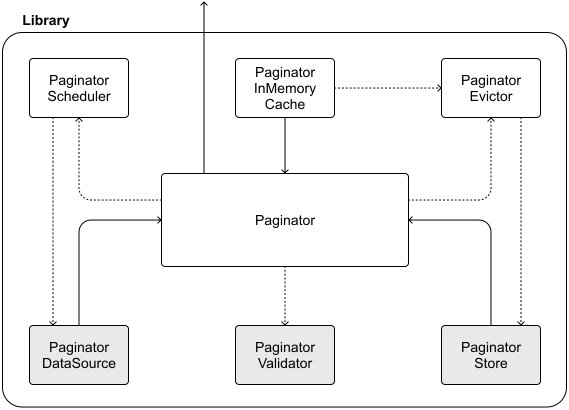
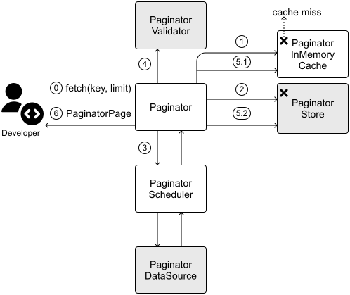

# Pagination library

Efficiently managing large datasets is a cornerstone of mobile app performance. Pagination ensures that users experience seamless interactions, even with extensive content. While earlier chapters addressed pagination within specific applications, we now shift our focus to a broader challenge: crafting a reusable pagination library.

A well-designed pagination library offers substantial benefits as organizations grow. It promotes consistency across applications, reduces code duplication, and consolidates performance optimizations in one place. Building such a library requires careful attention to API design and implementation, striking a balance between flexibility and practicality.

**💡 Pro tip!**

Designing a library differs fundamentally from designing an app. Apps serve end users through interfaces and screens, whereas libraries serve developers through code. Our design must prioritize how developers integrate and interact with the library, solving their challenges while enhancing their workflow.

When creating a library, our focus shifts from user-facing experiences to developer-centric APIs. The "user experience" transforms into the ease with which developers adopt our solution, integrate it into their projects, and address their pagination needs.

Like all system design challenges, the specific requirements will shape our technical decisions. Before diving into implementation details, we need to understand clearly what our library should accomplish and how other developers will use it. Let's begin by defining these requirements and exploring the key decisions that will influence our design.

## Step 1: Understand the problem and establish design scope

Before considering design decisions, it is crucial to first understand what we're building and why. Let's walk through how this conversation typically unfolds in an interview setting.

**📝 Note:** This chapter assumes familiarity with pagination techniques such
as offset-based and cursor-based pagination. For a detailed refresher, refer
to the Pagination section in Chapter 10: Mobile System Design Building Blocks.

**Candidate**: To begin, I'd like to confirm the core requirements for the pagination library. I'm thinking we'll need a flexible solution that supports common pagination patterns such as offset and cursor-based approaches, while allowing pagination from both local and remote data sources. Does this align with your vision?

**Interviewer:** Yes, that captures the library's intended flexibility and scope. And it should be able to handle any type of application data.

**Candidate:** Understood. Should the library include user interface components for rendering paginated data, or should it focus exclusively on the pagination logic and data management?

**Interviewer:** Let's keep our scope focused on the business logic, excluding UI components for now.

**Candidate:** Makes sense. To optimize performance, I think we should implement a caching system that stores previously fetched pages. We could use in-memory caching by default for quick access to recent pages, and optionally allow disk-based caching for persisting data between app sessions. What do you think?

**Interviewer:** Yes, that sounds perfect!

**Candidate:** I'd also propose adding a prefetching capability that anticipates user navigation patterns. For example, when a user views page 5, the library can automatically load pages 6 and 7 in the background, ensuring a seamless browsing experience as they continue scrolling. This would significantly reduce perceived loading times. Should we also support fast-scrolling scenarios where users jump quickly through large datasets?

**Interviewer:** Let's include prefetching, but exclude fast scrolling, as we're not handling UI components.

**Candidate:** Noted. Lastly, will this library be open-sourced? This consideration could impact our API design, documentation standards, and versioning strategy.

**Interviewer:** Yes, we're planning to open-source it.

#### Requirements

From these considerations, we're designing a pagination library with the following **functional requirements**:

- The library supports various application data types and multiple pagination techniques.

- Users can paginate through different local and remote data sources.

- The library provides business logic functionality. It doesn't provide UI support.

- The library provides in-memory caching and configurable disk caching.

- Users can prefetch specific pages.

As for **non-functional requirements**, we need to build a system that ensures:

- Performance: The library must deliver efficient pagination with optimized resource usage and minimal overhead, operating safely in a multi-threaded environment.

- Reliability: The library should address network failures and interruptions gracefully, ensuring consistent behavior regardless of device type or OS version.

- Usability: We need to offer an intuitive API with comprehensive documentation and clear learning resources that help developers implement pagination effectively.

Features that are **out of scope** for this exercise:

- Pagination support in the UI.

- Support for fast scrolling.

Now that we've established our requirements, we can begin designing the pagination library's API. This foundation will shape how developers interact with our library.

## Step 2: API design

Having established our pagination library's requirements, we now shift our focus to designing its **public API**. This interface must be intuitive, adaptable, and robust enough to meet the varied demands of mobile developers.

**📌 Remember!**

Think of a library's **API** as its public face—it's everything
developers can directly interact with, including its functions, classes,
methods, and properties. Just like a well-designed user interface makes an app
intuitive for its users, a well-crafted API surface makes a library
approachable for developers.

A good **public API** helps developers use the
library effectively without needing to know how it works internally. To
achieve this, it requires three key qualities: clear documentation that helps
developers understand how to use each component, stability so developers can
rely on consistent behavior, and an intuitive design that follows platform
conventions and patterns.

Central to this design is the Paginator interface, which acts as the cornerstone for users interacting with the library.

**💡 Pro tip!**

When designing a library's API, focus first on defining its core elements: the key interfaces, classes, and data models that developers will interact with most frequently. These form the foundation of your API surface and will shape how developers use your library.

### Paginator

Mobile apps frequently handle varied datasets such as social media feeds, chat histories, or product catalogs. To support any data type, we define **Paginator<T>** using generics. This decision offers immediate benefits:

- Flexibility: A single Paginator can handle any data type, reducing repetitive code and satisfying the requirement for multiple data types.

- Isolation: Independent instances coexist without conflict, each managing an independent cache and pagination flow.

- Optimization: Memory usage stays lean, as each instance tracks only its relevant data.

- Reliability: Generics enforce type safety at compile time, catching errors early.

**📌 Remember!**

Using generics with Paginator<T> means we can handle any data type without creating separate implementations. Instead of writing separate Paginator classes for posts, messages, or other content types, the generic <T> parameter allows us to write a single, flexible implementation. This not only reduces code duplication but also makes the library much more versatile and maintainable.

The Paginator<T> interface needs core methods that align with our requirements:

- Fetching individual pages, allowing users to request specific pages of data from a data source.

- Fetching surrounding pages, enabling prefetch of pages around a specific page.

- Cache management, providing the ability to clear specific pages from the cache.

These translate into three methods: fetch, fetchAround, and clear. The public API definition looks like the following:

| **Kotlin** |
| --- |
| ```kotlin interface Paginator<T> { fun fetch(key: String, pageSize: Int) fun fetchAround( key: String, pageSize: Int, depthLevel: Int, direction: PageFetchDirection ) fun clear(key: String) } ``` |
| **enum class PageFetchDirection** ALL, FORWARD, BACKWARD |

| **Swift** |
| --- |
| ```Swift protocol Paginator { associatedtype T func fetch(key: String, pageSize: Int) func fetchAround( key: String, pageSize: Int, depthLevel: Int, direction: PageFetchDirection ) func clear(key: String) } ``` |
| **enum PageFetchDirection** case all, forward, backward |

The Paginator's methods are **idempotent**, ensuring that repeated calls with identical inputs yield the same results.

**💡 Pro tip!**

By defining Paginator as an interface/protocol, we're not just creating an entry point to our library; we're also making it easier to test. This approach allows developers to create test double [1] versions that simulate different scenarios.

#### Supporting diverse pagination techniques

A key strength of this API is its agnosticism toward pagination techniques. The key parameter is intentionally flexible, adapting to the underlying method:

- **Offset-based pagination**: key might be an integer (e.g., "1" for page 1, "2" for page 2).

- **Cursor-based pagination**: the key could be a token (e.g., "cursor123") that points to the next dataset.

This adaptability ensures that developers can use the same Paginator interface regardless of their data source's pagination strategy.

### Data propagation

Next, we consider how the library communicates results and errors to its users. To keep it lightweight and dependency-free, we opt for **native callbacks**. This decision preserves flexibility, allowing developers to integrate the library without adopting a prescribed async framework.

We can also make each method return a PaginatorExecution object, empowering users to cancel operations as needed.

**📝 Note!**

Since we're designing an open-source library that can be used across multiple apps, we need to be thoughtful about our dependencies. Any third-party libraries we include will become required dependencies for apps using our library. To keep things lightweight and flexible, we'll use native language constructs for core functionality while making the library extensible enough to work well with popular libraries. We'll explore this design approach in more detail in the deep dives section.

Here's how the improved Paginator interface looks, with new API additions in bold and existing definitions in gray:

| **Kotlin** |
| --- |
| ```Kotlin interface Paginator<T> { fun fetch( key: String, pageSize: Int, listener: PaginatorFetchListener<T> ): PaginatorExecution fun fetchAround( key: String, pageSize: Int, depthLevel: Int, direction: PageFetchDirection, listener: PaginatorFetchAroundListener<T> ): PaginatorExecution fun clear(key: String) } ``` |
| **Swift** |
| ```Swift protocol Paginator { associatedtype T func fetch( key: String, pageSize: Int, listener: PaginatorFetchListener<T> ) -> PaginatorExecution func fetchAround( key: String, pageSize: Int, depthLevel: Int, direction: PageFetchDirection, listener: PaginatorFetchAroundListener<T> ) -> PaginatorExecution func clear(key: String) } ``` |

Internally, each Paginator instance maintains a thread-safe cache, typically a Map that associates page keys with their data. This setup accelerates access to recently loaded pages, an aspect we'll explore in more detail in the following sections.

### Data models

Let's look at the core data models that power the pagination library. At the heart of the design is the PaginatorPage model, which encapsulates everything needed to represent a single page of data:

| Kotlin | Swift |
| --- | --- |
| **public class PaginatorPage<T>** content: List<T> key: String expirationTime: String? prevKey: String? nextKey: String? | **public class PaginatorPage<T>** content: [T] key: String expirationTime: String? prevKey: String? nextKey: String? |

The PaginatorPage model serves as a container for both the paginated content and the metadata needed for navigation between pages: the current key, the previous and next keys, if available. The optional expirationTime field enables smart caching decisions, letting the library determine when cached data needs refreshing.

**💡 Pro tip!**

You might notice that we're using public classes for our data models here, rather than the data classes and structs we used in previous chapters. This change is intentional and is essential for library development.

In Kotlin, data classes automatically generate several methods such as copy, componentN, equals, and hashCode. While convenient for application development, these generated methods can cause binary compatibility issues in libraries. When you modify properties in a data class, the generated methods also change, potentially breaking compatibility for library consumers [2].

Similarly, in Swift, structs are value types whose memory layout is part of their binary interface. Changes to stored properties can affect this layout, which in turn impacts the library's ABI stability [3] [4].

By using classes instead, we maintain better control over our library's public interface and ensure compatibility across versions.

### How apps implement the Paginator interface

When developers integrate the pagination library into their apps, they need to implement and integrate the Paginator interface within their architecture properly. Let's explore how the Paginator interface is typically used in application code.

Apps that consume our pagination library generally implement it within repositories or UI state holders that:

- Create a configured Paginator instance with appropriate data sources using the CallbackPaginator implementation (more about this in the next section).

- Trigger Paginator's methods in response to specific user actions such as scrolling.

- Combine PaginatorPage objects into a unified list.

- Monitor pagination state to determine when additional data should be loaded.

- Handle various states, including loading, errors, and empty results.

For linear pagination scenarios such as scrolling through content, apps primarily use the fetch method to load pages sequentially. For non-linear scenarios, the fetchAround method enables apps to prefetch content surrounding the target page, ensuring a smooth navigation experience.

This separation of responsibilities ensures that the Paginator focuses exclusively on efficient data retrieval and caching, while the application host code handles the presentation logic and user interactions.

### Creating configurable Paginator instances

As we've seen, host applications need to instantiate a properly configured Paginator to handle pagination effectively. Let's explore how the library provides this flexibility through implementation classes and configuration options.

While the Paginator interface defines the contract for pagination functionality, apps need concrete implementations they can configure for their specific use cases. With our library, we include the **CallbackPaginator<T>** class, a fully-featured implementation of the Paginator<T> interface that can be customized through dependency injection.

CallbackPaginator serves as the primary implementation that apps will instantiate, configured with components that define its behavior:

- **PaginatorDataSource<T>** handles the actual data fetching for each page, whether from a remote API, local database, or a mix of both. By separating data retrieval into its own component, CallbackPaginator stays focused on orchestrating the process.

- **PageValidator<T>** ensures cached pages are still valid, checking factors such as expiration timestamps or data integrity. If a page fails validation, CallbackPaginator triggers a fresh fetch to keep data up-to-date.

- (Optional) **PaginatorStore<T>** enables on-disk storage of fetched pages for offline usage. It cuts down on redundant network calls and boosts performance by keeping data locally accessible.

- **PaginatorConfig** controls aspects such as concurrency handling, cache eviction policies, and other settings.

Let's look at the **definition of the CallbackPaginator<T> class** that embraces dependency injection to allow consumers to provide their own specialized implementations tailored to their specific use cases:

| **Kotlin** |
| --- |
| ```kotlin class CallbackPaginator<T>( dataSource: PaginatorDataSource<T>, validator: PageValidator<T>, store: PaginatorStore<T>? = null, config: PaginatorConfig = DefaultPaginatorConfig(), ) : Paginator<T> { ... } ``` |
| **class PaginatorConfig** threadPool: ExecutorService, maxParallelCalls: Int? = null, inMemoryEvictionStrategy: PaginatorEvictionStrategy, storeEvictionStrategy: PaginatorEvictionStrategy? = null, ... |

| **Swift** |
| --- |
| ```Swift class CallbackPaginator<T>: Paginator<T> { init( dataSource: PaginatorDataSource<T>, validator: PageValidator<T>, store: PaginatorStore<T>? = nil, config: PaginatorConfig = DefaultPaginatorConfig() ) { // self.field statements } } ``` |
| **class PaginatorConfig** dispatchQueue: DispatchQueue, maxParallelCalls: Int?, inMemoryEvictionStrategy: PaginatorEvictionStrategy, storeEvictionStrategy: PaginatorEvictionStrategy?, ... |

**📝 Note:** While some libraries use static configuration methods such as
Paginator.init(...), this approach isn't ideal for our pagination library.
Since each Paginator instance needs independent configuration and high
customizability, we opted for instance-level configuration instead. This gives
users more flexibility to configure each instance according to their specific
needs.

The library comes with several built-in common eviction policies such as LRU (Least Recently Used), FIFO (First In, First Out), and LIFO (Last In, First Out). Beyond these standard options, developers can also define custom policies based on their specific needs, whether that's time-based expiration (TTL), memory size limits, or maximum page count. This flexibility ensures the library can adapt to various caching requirements and resource constraints.

## Step 3: High-level client architecture

With the API design established, we now shift our focus to crafting a high-level client architecture that powers our pagination library. This structure must prioritize modularity, scalability, and maintainability to integrate seamlessly into a variety of mobile applications.

Figure 1 provides a visual overview, detailing the core components and their interactions—solid arrows denote data flow, dotted arrows show dependencies, and arrows pointing outside the box represent external communication. In the diagram, components with a gray background represent implementation classes contributed by developers, while the remaining components are implementations provided by the library itself.



*Figure 1: Pagination library high-level architecture—implementations*

provided by developers with gray background, implementations provided by the Pagination
library with white background.

Having laid the groundwork with earlier discussions, let's introduce two critical components that enhance the Paginator's efficiency and focus:

- The **PaginatorScheduler** takes charge of all request-related operations: queuing, ordering, and processing responses. It also manages debouncing, throttling, retry mechanisms, and concurrency, offloading these tasks from the Paginator to keep its responsibilities focused and streamlined.

- The **PaginatorEvictor** manages cache efficiency for both in-memory and disk storage. This separation gives us the flexibility to implement different eviction strategies without impacting other parts of the system. It ensures our caches remain performant while keeping resource usage in check.

**💡 Pro tip!**

Breaking functionality into dedicated components serves two purposes: (1) it demonstrates your understanding of modular design principles, and (2) it clearly shows the interviewer you're addressing specific requirements such as caching and prefetching. |

This design achieves a careful balance: it offers users the flexibility to integrate custom data sources and storage solutions while entrusting the library with the intricacies of scheduling and cache management.

## Step 4: Deep dives

With our high-level architecture in place, let's explore some key implementation details. While the specific areas to dive into during an interview often depend on your interviewer's interests and your system's particular challenges, we'll focus on several critical aspects:

- Implementing effective caching strategies.

- Priorities in API calls.

- Modular API design.

- Handling failures and versioning.

### Implementing effective caching strategies

Caching is a pivotal element in our pagination library, directly shaping its performance and the resulting user experience. In this section, we'll explore the mechanics of our dual caching system, which integrates in-memory and disk-based approaches to streamline data retrieval.

While users can optionally use the PaginatorStore for persisting PaginatorPage objects on disk, the in-memory cache significantly improves user experience. Both caching mechanisms can be fine-tuned through eviction policies defined in PaginatorConfig when initializing a Paginator instance.

#### In-memory caching

At the core of this system lies the PaginatorInMemoryCache that provides fast storage for paginated data (i.e., PaginatorPage objects).

PaginatorInMemoryCache uses a Map<String, PaginatorPageResult<T>> structured as follows:

- A String key as the unique identifier for each page (offset, page index, or cursor).

- A PaginatorPageResult<T> value representing the current state of that page. This object reflects the page's lifecycle:
  
  
  - key not present in the cache: The page awaits its initial fetch.
  
  - Loading: A retrieval operation is underway.
  
  - Success(page: PaginatorPage<T>): The page is ready and validated.
  
  - Error(message: String): A fetch attempt failed, with diagnostic details provided.

Modeling these states explicitly with PaginatorPageResult brings several key advantages: type safety that helps catch errors at compile time, clear representation of a page's status at any point, easier debugging when issues arise, and better scalability as the codebase grows.

#### How the dual caching system works

Our caching strategy operates through a tiered structure. Let's explore how the caching components work together when a user requests a page. Figure 2 illustrates the data flow during in-memory and disk cache misses.

When a user calls fetch on a Paginator instance (step 0), the system implements the following caching strategy:

- **In-memory cache check**: The Paginator begins by querying the in-memory cache to see if an existing PaginatorPage already exists. If a valid page is found, it's returned immediately for a low-latency response.

- **Disk cache check** (optional): If the in-memory cache misses and a PaginatorStore is configured, the system consults the disk cache. A valid page found here is promoted to memory for future use and promptly returned.

- **Data source fetch**: If both caches fail to provide the requested page, the PaginatorScheduler triggers a fetch call on the PaginatorDataSource.

- **Validator check**: Once the new page is retrieved, the PageValidator verifies the data's validity, checking for proper formatting or expiration.

- **Cache update**: Once validated, the fresh page is cached in both the in-memory cache and in the disk store if configured.

- Then, the fresh page is returned to the caller.



*Figure 2: Paginator with cache misses data flow*

This layered design strikes a balance between speed and durability: in-memory caching ensures rapid access, while disk caching offers a dependable fallback. The PaginatorEvictor plays a key role by enforcing eviction policies, keeping both caches lean, and preventing resource overload.

#### Benefits and considerations

Our dual caching approach offers several advantages:

- Better performance through reduced latency by avoiding network calls.

- Lower network usage through intelligent request management.

- Smoother user experience with faster data retrieval.

While powerful, this caching system requires careful attention to several implementation details:

- The system assumes that cache keys map directly to network requests. For cases where this assumption doesn't hold, we may need to implement custom key generation logic.

- Since the Paginator engine operates in a multithreaded environment, we must ensure thread-safe cache access and atomic operations to prevent race conditions or data corruption.

To support fine-tuning, we can configure the library with analytics and logger providers to capture cache hits, misses, and evictions. These insights equip developers to optimize performance for their unique needs.

**🔍 Industry insights:**

The Store5 library [5] for Kotlin MultiPlatform and
the Hyperoslo Cache library [6] for iOS can be configured to write to both in-memory
and disk storage, giving fast in-memory reads with persistent disk backup.

Google's Jetpack Paging library [7] encourages a network + database hybrid: using a local
database as the single source of truth for paged content, and a RemoteMediator
that fetches new pages into the DB only when the app runs out of local data.

### Priorities in API calls

Users expect rapid responses, yet the library must juggle multiple tasks, often under constraints such as limited device resources or fluctuating network conditions. Prioritizing API calls becomes vital when:

- Concurrent requests compete for bandwidth or processing power.

- Background operations, such as prefetching, overlap with user-initiated actions.

- Device limitations, such as low battery or weak connectivity, demand optimized performance.

Consider a user scrolling to load new content: this request must outrank background prefetching to ensure immediate feedback. Likewise, in fetchAround scenarios, the explicitly requested page should load before its neighbors. To achieve this, we can enhance our public APIs with priority controls, allowing developers to dictate the execution order effectively.

Here's how the improved Paginator interface looks like, with new API additions in bold and existing definitions in gray:

| **Kotlin** |
| --- |
| ```kotlin interface Paginator<T> { fun fetch( key: String, pageSize: Int, listener: PaginatorFetchListener<T>, priority: FetchPriority = FetchPriority.MEDIUM ): PaginatorExecution fun fetchAround( key: String, pageSize: Int, depthLevel: Int, direction: PageFetchDirection, listener: PaginatorFetchAroundListener<T>, keyPriority: FetchPriority = FetchPriority.MEDIUM, aroundPriority: FetchPriority = FetchPriority.LOW ): PaginatorExecution } ``` |
| **enum class FetchPriority** HIGH, MEDIUM, LOW |

| Swift |
| --- |
| ```Swift protocol Paginator { associatedtype T func fetch( key: String, pageSize: Int, listener: PaginatorFetchListener<T>, priority: FetchPriority ) -> PaginatorExecution func fetchAround( key: String, pageSize: Int, depthLevel: Int, direction: PageFetchDirection, listener: PaginatorFetchAroundListener<T>, keyPriority: FetchPriority, aroundPriority: FetchPriority ) -> PaginatorExecution } ``` |
| **enum FetchPriority** case high, medium, low |

Each fetch operation accepts a priority parameter that signals its relative importance to the library. For the fetchAround call, we introduce two distinct priority levels: keyPriority for the main requested page, and aroundPriority for the surrounding pages. This granular control allows us to optimize how the library processes different types of requests.

Now, let's explore how to implement this prioritization system in our library.

#### Priority-based task scheduling

Effective priority handling demands a robust scheduling strategy. Table 1 evaluates several approaches, each balancing simplicity, scalability, and concurrency in different ways.

| **Option** | **Description** | **Advantages** | **Disadvantages** |
| --- | --- | --- | --- |
| Separate queues for each priority level | Dedicated queues per priority, processed sequentially by importance. | Simple to implement and understand, and clear separation of priorities. Direct control over task execution order. | Performance degrades with more priority levels and complex workload balancing across queues. Higher memory overhead. |
| Priority Queue | Single queue that automatically maintains tasks in priority order through heap structure. Reorders on enqueue/dequeue. | Efficient priority-based ordering and simpler architecture with a single queue. Lower memory footprint. | Potential overhead from heap reordering. No fairness guarantee, lower-priority tasks may starve. |
| ThreadPools with priority levels | Separate thread pools per priority, with more resources for higher levels. | True concurrency with hardware parallelism, and better resource utilization. Natural handling of priority levels. | Complex thread pool management. Higher resource demands. |
| Weighted Round-Robin scheduling | Cyclic processing with higher-priority tasks receiving greater execution time. | Guaranteed processing for all priorities, and predictable task execution. Good fairness properties. | Complex weight tuning needed. Higher-priority tasks may face delays. |

Table 1: Trade-offs for implementing priority-based task scheduling

The **Priority Queue pattern** [8] stands out as a strong choice for our library. It delivers efficient ordering, ensures high-priority tasks are executed first, and simplifies the implementation. This balance is well-suited for our mobile constraints.

**🔍 Industry insights:**

Google's Volley networking library lets developers tag
requests with a Priority so that an "immediate" request jumps ahead in the queue
[9].

### Modular API design

Two important considerations for designing a pagination library are handling async operations well and making testing easy. First, we'll look at managing asynchronous tasks across different setups. Then, we'll cover testing approaches that keep it reliable and simple to use.

#### Async framework compatibility layers

When designing a mobile library, we face a critical decision: how to manage async operations effectively. Frameworks such as Kotlin Coroutines or Swift's Combine offer robust solutions for async programming, and it might be tempting to build our entire library and public APIs around one of these powerful tools. However, mandating such dependencies could burden users whose projects rely on different tools. Imagine an RxJava-based app forced to adopt Coroutines solely to integrate our library. To avoid this, we should craft an API that works well with various async approaches.

**🛠️ Platform implementation details**

Both the Android and iOS platforms provide several approaches for handling asynchronous operations:

- Android's ecosystem offers multiple async solutions, including traditional callbacks, Kotlin Coroutines and Flow, RxJava, LiveData, and CompletableFuture from Java.

- iOS developers can choose from options such as closure-based completion handlers (callbacks), the Combine framework, async/await syntax, the delegate pattern, and Grand Central Dispatch (GCD) for low-level concurrency control.

Our solution is a modular design that anchors the core API in native callbacks, free of external dependencies, and complements it with optional extension modules for popular frameworks. This gives developers maximum flexibility:

- paginator-core delivers the essential functionality with no external dependencies.

- paginator-coroutines, paginator-combine, or paginator-rx provide optimized support for specific async solutions.

This strategy offers multiple benefits:

- Flexibility: Developers can adopt only the extensions that suit their project's tech stack.

- Lightweight core: The base module remains unburdened by external frameworks, enhancing its portability.

- Native integration: Each extension aligns with its framework's conventions, ensuring an intuitive developer experience.

**🛠️ Platform implementation details**

Android and iOS handle library distribution differently.

Android's build system, typically Gradle, provides built-in support for creating multiple library artifacts from a single codebase. This means you can publish each async integration as a separate artifact, giving developers the flexibility to include only what they need.

iOS traditionally distributes libraries as single frameworks, but it offers several approaches to achieve modularity:

- Use conditional compilation to selectively include code.

- Create extension files for different async patterns that developers can optionally add.

- Leverage Swift Package Manager to define separate products or targets for different integrations.

This modular approach not only keeps the library adaptable for current users but also prepares it for emerging async paradigms without disrupting existing implementations.

Let's see this adaptability in action. Here are examples of how our API transforms when used with Kotlin coroutines and Swift's async/await syntax, with new API additions in bold and existing definitions in gray:

| **Kotlin using coroutines and flows** |
| --- |
| ```kotlin interface Paginator<T> { suspend fun fetch(key: String, pageSize: Int): PaginatorPage<T> fun fetchAround( key: String, pageSize: Int, depthLevel: Int, direction: PageFetchDirection ): Flow<PaginatorPageT>> suspend fun clear(key: String) } ``` |
| **Swift using async/await** |
| ```Swift protocol Paginator { associatedtype T func fetch( key: String, pageSize: Int ) async throws -> PaginatorPage<T> func fetchAround( key: String, pageSize: Int, depthLevel: Int, direction: PageFetchDirection ) -> AsyncThrowingStream<PaginatorPageT>, Error> func clear(key: String) async throws } ``` |

#### Pagination library testing suite

While async flexibility is crucial for adoption, equally important is comprehensive testing support. Our design's foundation of interfaces and protocols naturally facilitates testing, but we can elevate the library's value by **offering a dedicated testing-only artifact**, complete with pre-built test doubles and utility tools tailored for developer convenience.

This testing artifact equips developers with a practical toolkit, including:

- Pre-built test doubles: These emulate core components such as PaginatorDataSource, PaginatorStore, and PageValidator, enabling developers to simulate diverse scenarios without crafting bespoke mocks.

- Helper functions: Tools for generating sample paginated data or mimicking network latency simplify the process of setting up meaningful test cases.

- Error simulation capabilities: Features that let developers test how their code handles failures or edge cases, ensuring robust error handling and recovery logic.

By providing these resources in a standalone artifact, we empower developers to adopt our library with confidence, knowing they have the means to achieve thorough test coverage. This offers several benefits to developers:

- Eliminate the need to create and maintain custom test implementations.

- Ensure test doubles stay in sync with library updates automatically.

- Promote higher test coverage by simplifying the testing of edge cases.

- Demonstrate our commitment to testing best practices.

**📌 Remember!**

A dedicated testing-only artifact complements our modular
design while keeping the core library lightweight. This separation allows us
to refine the testing tools independently, having them aligned with evolving
testing frameworks and methodologies. Additionally, developers get powerful
testing capabilities without bloating their production builds.

**🔍 Industry insights:**

Google's Jetpack Paging 3 [7] takes a similar approach:
it exposes a common PagingData stream which can be emitted as a LiveData, RxJava
Flowable, or Kotlin Flow depending on what the app wants to use.

The Moya networking
library [10] in iOS, for example, was built with testing in mind. It lets you
provide stubbed responses or use a sampleData property for each API endpoint, so
that unit tests can run without real network calls [11].

### Handling failures and versioning

Now let's address potential failure points and versioning strategies for the pagination library. These topics often come up during interviews and demonstrate your thorough understanding of library development beyond just the core functionality.

#### Handling failure points

A pagination library operates at the intersection of data sources, network, and device constraints, making it susceptible to a variety of failures. Identifying and mitigating these points of failure is essential to ensure reliability and a seamless user experience. Here are the key points specific to pagination and how our design addresses them.

##### Network failures

Fetching remote data is a common task, but network issues such as timeouts, dropped connections, or server errors can disrupt pagination.

*Mitigation*: The library uses retry mechanisms with exponential backoff to handle transient failures gracefully. If a fetch fails, callbacks transmit the detailed errors, enabling developers to fallback to cached data or display user-friendly messages, preventing app crashes.

##### Database errors

When paginating from a local data source, data storage query failures or data corruption can halt operations.

*Mitigation*: Robust error handling within PaginatorDataSource ensures that issues are caught and reported via callbacks. Developers can configure fallbacks, such as loading stale cache data, to maintain functionality when fresh data isn't available.

##### Cache inconsistencies

Stale or corrupted cache entries can lead to outdated or incorrect page displays, a critical concern in pagination where continuity matters.

*Mitigation*: The PageValidator checks page validity using expiration times or checksums. Invalid pages trigger cache invalidation and a fresh fetch, ensuring users see accurate content. This is paired with configurable eviction strategies in PaginatorConfig to keep the cache lean and reliable.

##### Concurrency issues

Multi-threaded environments, common in mobile apps, risk race conditions when multiple threads access the cache or fetch data simultaneously.

*Mitigation*: Thread-safe data structures (e.g., concurrent maps) and synchronization mechanisms safeguard the in-memory cache and PaginatorStore. This ensures a consistent state across threads, vital for smooth pagination during rapid user interactions.

##### Invalid page keys

In cursor-based or keyset pagination, users might request pages with expired or malformed keys, especially after data updates.

*Mitigation*: The library validates keys before processing, rejecting invalid requests with clear error messages via callbacks. This guides developers to handle such cases, perhaps by resetting to a known starting point.

##### Last notes

These mitigations prioritize user experience, ensuring that failures don't derail the app but instead degrade gracefully. Adding analytics and logging options in PaginatorConfig further empowers developers to monitor and troubleshoot issues, enhancing reliability in production.

#### Versioning

As an open-source library, maintaining a clear versioning strategy is vital for developer trust and long-term adoption. It ensures that updates, whether new features, bug fixes, or breaking changes, are predictable and manageable.

For our library, we adopt **Semantic Versioning (SemVer)** [12] with its MAJOR.MINOR.PATCH format, tailoring it to the pagination library's evolution:

- The MAJOR version (X.y.z) signals breaking changes that require code updates.
  
  
  - In our pagination library, this would be the case if we modify the Paginator interface or alter the default caching behavior.

- The MINOR version (x.Y.z) adds new features while maintaining compatibility.
  
  
  - In our pagination library, this would be the case if we enhanced the PaginatorConfig's functionality without disrupting existing integrations.

- The PATCH version (x.y.Z) addresses bugs and small fixes without changing behavior.

**🛠️ Platform implementation details**

Both iOS and Android ecosystems strongly favor SemVer for their dependency management.

SemVer integration is particularly important for iOS because the Swift Package Manager (SPM) uses it as the foundation for dependency resolution [13]. Using alternative versioning schemes could lead to compatibility issues and make it harder for SPM to properly manage your library's dependencies.

Similarly, on Android, build tools such as Gradle and Maven are designed to work seamlessly with SemVer. Following SemVer ensures these tools can automatically resolve version conflicts and manage dependencies effectively.

Without SemVer, you would lose access to much of the sophisticated dependency management these tools provide.

#### Other versioning strategies

While SemVer is widely adopted, including by our pagination library, for its clear and structured approach to versioning, other strategies such as **Calendar Versioning (CalVer)** are also used in certain ecosystems to meet specific needs.

A prominent example is Jetpack Compose [14], which combines CalVer with elements of SemVer to manage its rapidly evolving UI toolkit and guarantee compatibility across its suite of libraries. Here's how it works:

- Individual Compose libraries (compose-ui, compose-material, compose-foundation, etc.) strictly use SemVer.

- Compose also provides a **Bill of Materials (BOM)** artifact, which uses Calendar Versioning (CalVer). Jetpack Compose's BOM artifacts are formatted as YYYY.MM.PATCH (e.g., 2025.02.00), where the year (YYYY) and month (MM) tie releases to a specific date.

The Compose BOM simplifies dependency management by specifying a single, calendar-based version that corresponds to a specific set of compatible libraries. The BOM maps a specific CalVer release (e.g., 2025.02.00) to a group of compatible library versions (e.g., compose.animation:1.7.8, compose.material3:1.3.1, etc.). This guarantees compatibility across all included libraries.

## Step 5: Wrap-up

In this chapter, we designed a flexible pagination library that works with:

- Any kind of application data.

- Different pagination techniques, such as offset-based or cursor-based pagination.

- Both local and remote data sources.

We defined a public API, designed a robust, scalable, and extensible architecture, and covered key aspects such as caching, prioritization of API calls, points of failure, testing, and versioning.

If you have extra time in your interview or want to push yourself with more advanced requirements, here are a few additional areas you could explore:

- Pagination support in the UI layer: consider integrating with common UI elements such as table views, collection views, or scrolling widgets.

- Fast scrolling support: enable users to navigate quickly through large datasets, similar to how long lists often allow the skipping of entire sections.

- Background services: implement prefetching of pages while the app is idle or running in the background, thus ensuring a smooth user experience without interruptions.

- Custom error handling: provide a way for users to define custom error handling strategies for failed fetches, for example, retries, fallbacks to cached data, or user alerts.

- Partial page loading: optimize performance by supporting partial page loads when resources are limited or users need only a subset of the data.

## References

[1] Test double: [https://en.wikipedia.org/wiki/Test\_double](https://en.wikipedia.org/wiki/Test%5C_double)

[2] Public API Challenges In Kotlin: [https://jakewharton.com/public-api-challenges-in-kotlin/](https://jakewharton.com/public-api-challenges-in-kotlin/)

[3] Swift's ABI stability: [https://github.com/swiftlang/swift/blob/main/docs/ABIStabilityManifesto.md](https://github.com/swiftlang/swift/blob/main/docs/ABIStabilityManifesto.md)

[4] Swift Library Evolution for Stable ABIs available in Swift 5.1: [https://github.com/swiftlang/swift-evolution/blob/main/proposals/0260-library-evolution.md](https://github.com/swiftlang/swift-evolution/blob/main/proposals/0260-library-evolution.md)

[5] Store5 KMP library: [https://github.com/MobileNativeFoundation/Store](https://github.com/MobileNativeFoundation/Store)

[6] Hyperoslo Cache iOS library: [https://github.com/hyperoslo/Cache](https://github.com/hyperoslo/Cache)

[7] Google's Jetpack Paging 3 library docs: [https://developer.android.com/topic/libraries/architecture/paging/v3-network-db](https://developer.android.com/topic/libraries/architecture/paging/v3-network-db)

[8] Priority Queue Pattern: [https://learn.microsoft.com/en-us/azure/architecture/patterns/priority-queue](https://learn.microsoft.com/en-us/azure/architecture/patterns/priority-queue)

[9] Optimizing Android Volley: [https://javanexus.com/blog/optimizing-android-volley](https://javanexus.com/blog/optimizing-android-volley)

[10] Moya iOS library: [https://github.com/Moya/Moya](https://github.com/Moya/Moya)

[11] Handling Network calls in Swift with Moya: [https://medium.com/simform-engineering/handling-network-calls-in-swift-with-moya-c82908c93e5](https://medium.com/simform-engineering/handling-network-calls-in-swift-with-moya-c82908c93e5)

[12] SemVer: [https://semver.org/](https://semver.org/)

[13] Swift Package Manager integration with SemVer: [https://docs.swift.org/package-manager/PackageDescription/PackageDescription.html](https://docs.swift.org/package-manager/PackageDescription/PackageDescription.html)

[14] Jetpack Compose: [https://developer.android.com/compose](https://developer.android.com/compose)