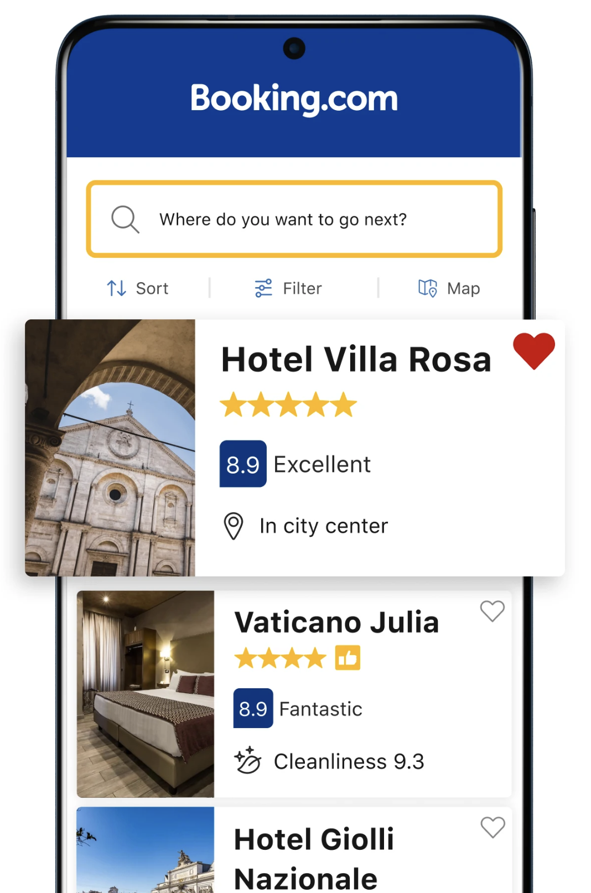
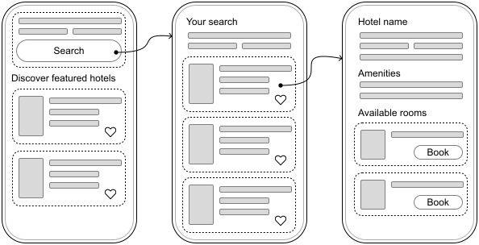
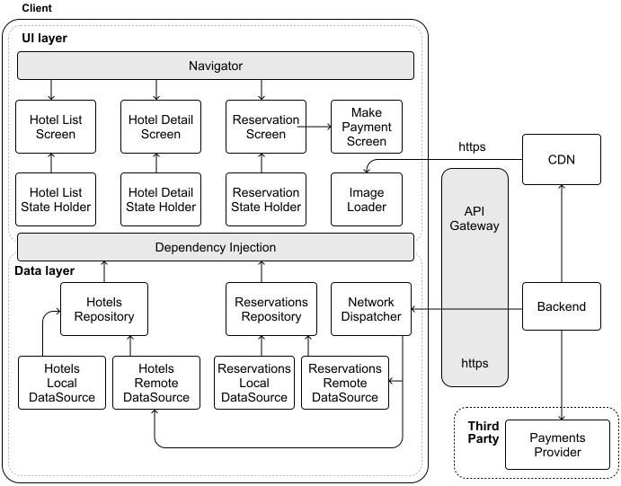
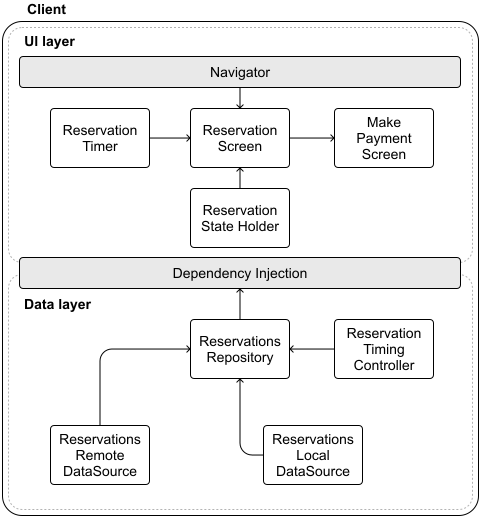
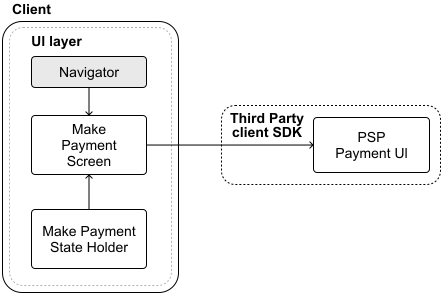
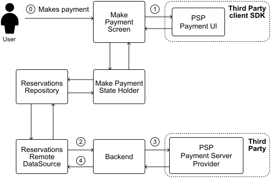

# Hotel reservation app

In this chapter, we will design a hotel reservation system that empowers users to search, compare, and book hotels. Platforms like Booking.com and Hotels.com have transformed travel planning by integrating robust search capabilities and instant booking features into mobile applications. These systems must manage real-time room availability, prevent double bookings, and deliver accurate pricing.

*Figure 1: The Booking.com mobile app, as shown in the Google Play Store*

The architectural patterns we explore here are applicable to other booking systems as well, such as property rentals, flight reservations, or event ticketing.

## Step 1: Understand the problem and establish design scope

Before diving into the design, we must first define its requirements and boundaries. Imagine we are discussing this with an interviewer to clarify the system's focus:

**Candidate**: I'd like to understand the scope first. Are we focusing on a single hotel chain, or is this an aggregator platform, like Booking.com, that pulls together options from multiple providers?

**Interviewer**: We're aiming for an aggregator model, where users can browse and book hotels from various sources.

**Candidate**: That gives us a solid starting point. For the core features, I'd suggest users should be able to search for hotels by location or destination, view details such as room types and pricing, and finalize bookings within the app. Should we also consider real-time updates to reflect room availability as others book during a user's search?

**Interviewer**: Those features work well as a foundation, but let's hold off on real-time updates for simplicity. While searching for hotels, we should include autocomplete suggestions. Another key requirement, though, is setting a time limit for users to complete their booking once they start entering payment details.

**Candidate**: Great. That helps clarify the booking flow. Building on that, let's explore the feature set further. Will users need options such as canceling reservations or checking in through the app? And should we plan for authentication flows or push notifications, such as reminders for upcoming trips?

**Interviewer**: Let's keep it focused. Assume users are already logged in, so no authentication flows. We'll also exclude cancellations and check-ins. For payments, include support for credit cards and third-party options such as PayPal. Push notifications aren't needed either.

**Candidate**: Got it. To guide our technical choices, could you share the system's expected scale? What's the monthly active user base we're designing for?

**Interviewer**: We're currently at around 5 million monthly active users worldwide, but the system should handle growth beyond that over time.

The conversation can continue, covering other topics we might consider interesting and relevant to the app. Let's summarize what we're building in this chapter.

#### Requirements

Based on our discussions, we're designing a hotel reservation app with the following **functional requirements**:

- Users can search for hotels by location or specific destination.

- The app provides autocomplete suggestions during searches.

- Users can view detailed hotel information and available room types.

- Users can complete room reservations within the app.

- Users can process payments through multiple providers (e.g., credit cards, PayPal).

- Users can access confirmed reservations even when offline.

- The system enforces a time limit for completing reservations.

As for **non-functional requirements**, we need to build a system that ensures:

- High availability: The app must remain accessible and reliable, even during peak loads, such as holiday seasons when user traffic increases significantly.

- Low latency: Booking confirmations should process within a few seconds to maintain a responsive user experience and minimize wait times during critical transactions.

- Data consistency: The system must prevent concurrent bookings of the same room for overlapping time periods, ensuring reservation data remains accurate across all users.

### UI Sketch

To visualize how users will interact with the system, Figure 2 presents the core screens of our hotel reservation app:

- The **Hotel List screen** (left) serves as the entry point, allowing users to search for hotels and displaying featured options initially. After a search, the screen shows the search results (middle) that update the list of available hotels.

- The **Hotel Details screen** (right) offers comprehensive information about a selected hotel, including available rooms. Users can initiate the reservation process by tapping the "Book" button.

*Figure 2: Basic sketch of the hotel reservation app*

## Step 2: API design

With a clear understanding of the requirements and user interface in place, let's transition to designing the API that will facilitate communication between the mobile client and the backend server.

### Network protocol

Since the system does not require real-time updates or push notifications, most interactions will be client-initiated. We will adopt **HTTP with REST APIs** for client-backend communication, using **JSON** as the data format.

### API endpoints and data models

Let's examine the RESTful endpoints our backend will expose. We'll focus on the most important endpoints and data models. Others can be explored in more detail if the interviewer requests.

**💡 Pro tip!** During the interview, concentrate on defining endpoints and data models for the most critical requirements that typically align with the main user flows in the app.

While you should acknowledge that other functionality exists, you can describe it at a high level to show awareness without going into implementation details. This demonstrates you're considering the full scope while consciously prioritizing the most important aspects.

#### Hotel endpoints

Hotels are the cornerstone of the app, and users need intuitive ways to find and explore them. Here are the primary endpoints to enable this:

- **GET /v1/hotels/search?page=`{page}`&limit=`{limit}`** **&latitude=`{x}`&longitude=`{y}`&other_query_parameters**
  
  allows users to search hotels by location and travel dates
  
  *Response*: 200 OK with HotelSearchResponse
  
  *Other query parameters*:
  
  
  - check_in_date (Date): Desired arrival date
  
  - check_out_date (Date): Planned departure date
  
  - guests (Integer): Number of guests staying

| Kotlin | Swift |
| --- | --- |
| **data class HotelSearchResponse** hotels: List<HotelPreview> paging: PaginationMetadata | **struct HotelSearchResponse** hotels: [HotelPreview] paging: PaginationMetadata |
| **data class HotelPreview** id: String name: String location: String price: BigDecimal lowResImageUrl: String ... | **struct HotelPreview** id: String name: String location: String price: Decimal lowResImageUrl: String ... |

**🛠️ Platform implementation details**

Throughout this book, we present API responses as Kotlin and Swift data models rather than raw JSON. In practice, these JSON payloads get converted to platform-specific data structures within the network layer (specifically in the network data sources shown in our architecture diagrams).

On Android, developers often rely on libraries such as kotlinx.serialization, or Moshi for JSON serialization and deserialization.

On iOS, Swift's built-in Codable protocol handles this elegantly, mapping JSON fields to Swift struct properties.

- **GET /v1/hotels/`{id}`?query_parameters**
  
  fetches details for a specific hotel
  
  *Response*: 200 OK with HotelDetailsResponse

| Kotlin | Swift |
| --- | --- |
| **data class HotelDetailsResponse** hotel: HotelDetails | **struct HotelDetailsResponse** hotel: HotelDetails |
| **data class HotelDetails** id: String name: String location: String imagesUrls: List<String> amenities: List<Amenity> curatedRooms: List<RoomSummary> price: BigDecimal ... | **struct HotelDetails** id: String name: String location: String imagesUrls: [String] amenities: [Amenity] curatedRooms: [RoomSummary] price: Decimal ... |
| **data class Amenity** name: String iconUrl: String category: String | **struct Amenity** name: String iconUrl: String category: String |
| **data class RoomSummary** id: String name: String description: String? imageUrl: String maxOccupancy: Int ... | **data class RoomSummary** id: String name: String description: String? imageUrl: String maxOccupancy: Int ... |

#### Reservations endpoints

Booking a hotel is the natural next step, and we need endpoints to handle this process efficiently:

- **POST /v1/reservations**
  
  initiates a reservation by securing a room
  
  *Body*: ReservationRequest
  
  *Response*: 201 Created with ReservationResponse
  
  *Endpoint-specific errors*:
  
  
  - 400 Bad Request if conditions such as HotelNotAvailable, RoomNotAvailable, TooManyGuests, or InvalidDates exceptions

| Kotlin | Swift |
| --- | --- |
| **data class ReservationRequest** requestId: String hotelId: String roomIds: List<String> checkInDate: String checkOutDate: String guests: Int | **struct ReservationRequest** requestId: String hotelId: String roomIds: [String] checkInDate: String checkOutDate: String guests: Int |
| **data class ReservationResponse** reservationId: String hotelId: String status: ReservationStatus ... | **struct ReservationResponse** reservationId: String hotelId: String status: ReservationStatus ... |

The ReservationRequest model includes the requestId field, which acts as an **idempotency key**. **This prevents accidental duplicate bookings** if network issues cause the same request to be sent multiple times.

When the backend processes a reservation request, it responds with a ReservationResponse model. This response contains all the original request information, plus several additional fields:

- A backend-generated reservationId that serves as the definitive identifier for tracking and updating the reservation.

- A status field indicating whether the reservation is pending, has failed, or has succeeded.

**📌 Remember:** Adding **idempotency** keys to POST requests helps the backend de-duplicate client requests.

In the hotel booking system, this is critical. The requestId field in ReservationRequest prevents double-booking rooms.

- **GET /v1/reservations/`{id}`**
  
  returns the details of a reservation and its status

- **PUT /v1/reservations/`{id}`**
  
  updates an existing reservation with personal details, payment details, etc.
  
  *Endpoint-specific errors*:
  
  
  
  - PaymentError, PaymentProviderNotAvailable, PriceMismatch, UserInfoIncomplete, or CurrencyNotSupported exceptions

## Step 3: High-level client architecture

With the API design in place, let's shift our attention to the client-side architecture. Figure 3 sketches out the architecture of our hotel reservation app.

*Figure 3: High-level architecture diagram of our hotel reservation app*

Let's explore how the key components of our architecture work together.

### External server-side components

Our system relies on several external services:

- The **Backend** serves as our primary communication point, handling client interactions through HTTP.

- A **CDN** improves performance by efficiently delivering static content.

- The **API Gateway** manages authentication and controls system access.

- **External Payment Providers** process and validate payment transactions.

### Client architecture

The client architecture follows a similar layered approach to our previous designs, with distinct UI and data layers working together to create a seamless hotel booking experience.

In the **UI layer**, we have three main screens: **Hotel List, Hotel Detail,** and **Reservation**, each with its own dedicated state holder that manages the screen's logic and data presentation. We've also introduced a **Make Payment Screen component** to handle payments flexibly, supporting both direct credit card processing and integration with third-party payment providers.

The **Data layer** orchestrates the core business logic through specialized repositories that manage our primary data types: hotels and reservations. Each repository works with both local and remote data sources to ensure efficient data handling. All network communications flow through a central **Network Dispatcher component**, which coordinates backend interactions and manages access control.

This architecture provides a solid foundation for our hotel booking system. Let's explore some of its key aspects in more detail.

## Step 4: Design deep dive

With the high-level architecture in place, let's examine some key aspects of our system in more detail.

- Implementing reservation holds.

- Enhancing search with autocomplete suggestions.

- Processing payments.

### Implementing reservation holds

In designing our hotel reservation app, we face the critical task of managing how long users can hold a room before finalizing their booking. This mechanism, often termed "reservation holds" in the industry, ensures that our system balances user convenience with the need to keep room inventory available for others.

Let's break down how this feature should work.

#### Requirements

Our reservation hold feature revolves around several key behaviors:

- **Fixed booking window**: When a user starts a booking process, the backend temporarily holds the requested room for a fixed time window (typically 15 minutes). This countdown begins when the server acknowledges the initial reservation request via the POST /v1/reservations endpoint. The backend acts as the source of truth, providing an authoritative expiration timestamp.

- **Automatic release**: If a user fails to complete the reservation within this timeframe, the system automatically releases the hold, returning the room to the available inventory. The released room is then instantly bookable by other users.

- **Visible countdown**: Throughout the reservation process, the app provides clear, real-time feedback about the remaining reservation hold time, visually highlighting urgency.

- **Expiration cleanup**: Upon expiration, any unpaid reservations are automatically canceled. This keeps our inventory accurate, preventing stale holds from cluttering the system and ensuring that availability reflects the actual state of our resources.

This combination of user-facing transparency and system-driven management maintains an equitable booking process while preserving the platform's responsiveness and accuracy.

#### Managing reservation hold timers

Ensuring that the client and backend remain synchronized in tracking reservation time is a pivotal challenge. Mobile devices complicate timer management because:

- Unreliable device time: Users can manually set their device's clock, throwing off local timers.

- Network delays: Latency between the client and server can skew when the hold appears to start or end.

- App suspension: When the app is minimized or the phone locks, the timer must stay accurate without breaking.

Relying on the device's clock alone won't work. We need a better approach that has the backend as the source of truth. Thus, **the backend communicates the reservation expiration UTC timestamp to the client**.

To display the most accurate representation of the remaining reservation time to the user on the client, regardless of device or network conditions, we use the **device uptime**.

The device's uptime ensures that timers remain accurate during app suspension (e.g., when the app is minimized or the phone locks) and is immune to user clock changes, unlike standard wall clock time, which can be manipulated.

**🛠️ Platform implementation details**

Both iOS and Android provide native APIs to handle time tracking and countdowns:

- On iOS, use ProcessInfo.processInfo.systemUptime to get system uptime, and create timers using the Timer class.

- On Android, get system uptime via SystemClock.elapsedRealtime(), and implement countdowns with CountDownTimer.

This choice ensures precision from the server while accommodating mobile-specific interruptions.

**✅ Decisions made!**

- Backend timestamps serve as the single source of truth for tracking reservation holds.

- Client displays the countdown by combining the backend's expiration timestamp with local device uptime measurements.

#### Architecture changes in the diagram

- A **Reservation Timing Controller** in the data layer to handle the core reservation timing logic we discussed.

- A **Reservation Timer** in the UI layer to display the countdown to users.

The addition of separate components in different layers of the Architecture follows the Separation of Concerns principle (Figure 4). It creates clear responsibility boundaries, making the system more maintainable and testable. These components work together to keep users informed of their remaining reservation time.

*Figure 4: Timer-related updates to the high-level architecture diagram*

**🔍 Industry insights:**

Expedia's API explicitly supports a two-step booking: a client can put a room “on hold” (no charge) and then confirm the booking within a given time window [1].

To explore how to design the backend system, check out the "Hotel Reservation System" chapter of the *System Design Interview Volume 2* book [2].

### Enhancing search with autocomplete suggestions

Autocomplete is a popular feature in mobile design interviews, especially for hotel booking apps. It helps users quickly find cities, destinations, or hotels as they type, but implementing it on mobile comes with technical challenges.

While autocomplete can get complex with advanced algorithms, personalization, and scalability, we'll keep it simple by focusing on efficiently loading autocomplete data.

#### Understanding the search experience

Currently, our app relies on a basic search mechanism: users enter a query, press "Search," and the client retrieves results via a GET /v1/hotels/search request to the backend. While this approach works, it lacks the dynamic interactivity that modern mobile users expect.

Autocomplete makes things easier by showing suggestions as people type. However, to achieve this effectively, we must address several performance considerations:

- **Network latency and bandwidth**: Autocomplete responses must be nearly instantaneous to feel responsive. Querying a server for every keystroke risks slow responses and excessive data usage, frustrating users on slow connections.

- **Offline expectations**: Users expect functionality even without a network. Autocomplete must offer meaningful suggestions offline, especially for frequent travelers in remote areas.

- **Resource constraints**: Mobile apps must minimize battery, CPU, and memory usage. Overly complex logic or frequent network calls can degrade performance.

- **Input dynamics**: Mobile keyboards lead to slower typing and more errors, making fast, forgiving autocomplete critical.

With these considerations in mind, let's explore how we can effectively implement autocomplete within our app.

#### Implementing autocomplete search

To deliver meaningful autocomplete suggestions, our app must anticipate user intent, offering relevant matches for countries, cities, and hotels as queries take shape. Table 1 explores multiple strategies for sourcing this data, each with its own merits and drawbacks:

| **Option** | **Description** | **Advantages** | **Disadvantages** |
| --- | --- | --- | --- |
| Local static dataset | Embed all autocomplete data within the app. | Works offline. Eliminates network delays. Ensures stable performance. | Expands app size. Demands updates for freshness. Impractical for evolving data. |
| Real-time remote API fetching | Retrieve suggestions from the backend with each keystroke. | Provides current data. Requires no local storage. Highly adaptable. | Latency can disrupt UX. Increases data usage. Needs strong error handling. |
| Third-party services | Leverage external APIs (e.g., Google Places) for suggestions. | Access to rich, curated datasets. Reduces maintenance burden. | May incur costs. Raises privacy concerns over data sharing. Ties us to external providers. |
| Pre-fetch popular data | Load common search terms (e.g., top cities, hotels) in advance. | Speeds up frequent queries. Optimizes network use. | Risks of storing unused data. Requires periodic refreshes. |
| On-demand data loading | Retrieve suggestions from the backend after users complete their search. | Conserves resources. Delivers tailored results. Keeps storage lean. | Offers limited initial suggestions. It may feel sparse for new searches. |

Table 1: Trade-offs for providing autocomplete data

As you can see, each approach has its pros and cons. For this exercise, we'll go with a hybrid solution: **pre-fetching popular data combined with on-demand loading for user-specific searches**. This method finds a middle ground, and here's why it works well:

- Keeping the app lean and avoiding a bulky embedded dataset helps preserve a manageable installation size.

- Minimizing network load, such as pre-fetching common terms at startup, reduces real-time requests.

- Personalizing the experience with on-demand fetches that adapt to users’ search patterns over time, delivering tailored suggestions based on their history.

This strategy assumes that users often search within popular regions, starting with broad suggestions that become more personalized over time. By preloading commonly searched terms and incrementally updating the cache based on user interaction, we achieve immediate responsiveness while maintaining flexibility and relevance.

#### Search autocomplete data flow

Our autocomplete system operates through a three-step process:

- **Initial data loading**. When our app launches, it checks the current version of the cached autocomplete data. If the server indicates newer data exists, the app downloads and updates the local cache accordingly. For this process, we can implement patterns such as the ChangeList pattern or timestamp-based synchronization.

- **Local query processing**. As the user types, the app queries the local autocomplete dataset. To avoid overwhelming the system with rapid-fire database requests, we introduce a brief input debounce delay (typically 200–300 ms). This means the app waits briefly after the user pauses typing before performing the search, balancing responsiveness and performance.

- **Network-based refinement**. When users select a suggestion or finalize a search, the app fetches additional data for that region in the background. This newer data is cached locally with a shorter time-to-live (TTL), ensuring freshness without excessive network load.

Next, let's consider how to store this data effectively.

#### Storage solution

For autocomplete to shine, we need a storage system optimized for rapid text retrieval. Given our focus on names and locations, **Full-Text Search (FTS)** [3] proves ideal, offering:

- The system uses fast prefix matching to find terms that begin with the user's input, which is great for providing autocomplete suggestions.

- Smart text tokenization that improves search accuracy.

- Built-in result ranking based on relevance.

- Fuzzy search capability that handles common mobile typing mistakes.

While FTS demands extra storage for indexes and adds some complexity, its benefits to the user experience might justify the investment. SQLite with FTS extensions emerges as our choice, leveraging its strengths across platforms.

**🛠️ Platform implementation details**

Both Android and iOS can implement Full-text search (FTS) through SQLite.

- On Android, the Jetpack Room persistence library provides built-in FTS support [4], making implementation straightforward. Room handles the complexity of FTS configuration and query optimization, allowing you to focus on your search functionality.

- iOS developers have a few options, as Core Data doesn't natively support FTS. You can either work directly with SQLite to implement FTS capabilities or use wrapper libraries such as GRDB [5] that simplify SQLite integration while maintaining full FTS functionality.

#### Potential challenges and considerations

While autocomplete significantly enhances usability, it also introduces complexities we must carefully address:

- **Data synchronization**: Efficient updates via ChangeList or similar methods require careful versioning to avoid conflicts. Fetching only deltas since the last sync optimizes bandwidth.

- **Throttle tuning**: A 200–300ms delay suits most users, but we might refine this dynamically based on typing speed or device capability to enhance responsiveness.

- **Data freshness**: For volatile data such as hotel availability, shorter expiration times maintain accuracy without excessive network calls.

- **Request optimization**: On-demand loading could strain the server during peak use. Background syncing over Wi-Fi or predictive pre-fetching can mitigate this.

To recap, our autocomplete storage implementation leverages FTS via SQLite, offering robust performance optimized for fast queries. This setup, complemented by intelligent caching and synchronization strategies, ensures a responsive and intuitive user experience across mobile clients.

**🔍 Industry insights:**

If you're interested in how other companies solved this problem, you can read how:

- Traveloka.com supports multiple languages and incorporates geographic location awareness to improve search relevance and reduce typos [6].

- Tiket.com developed a machine learning model that improved the quality of autocomplete ranking results by 4% to 7.5% [7].

### Processing payments

Handling payments securely is an essential aspect of hotel reservation apps. Designing a payment integration requires careful consideration of user experience, data security, compliance with industry regulations, and reliable interaction with external services.

Our hotel reservation app supports two primary payment methods:

- Direct credit card payments, where users manually enter their card details (name, number, expiry, CVV).

- Third-party payment providers, such as PayPal, Apple Pay, or Google Pay, facilitate quick and secure transactions.

In this section, we will focus on integrating these payment methods within the mobile app.

#### Credit card payments

When processing credit card payments, security must remain a top priority. Integrating credit card payments securely into our app involves specific considerations:

- **Avoid storing sensitive data on the device**. Card details should reside only briefly in volatile memory during active transactions.

- **HTTPS communication with TLS encryption** ensures secure data transmission.

- **Tokenization** [8] securely stores credit card information by replacing sensitive details with tokens that reference the actual data safely stored by a payment processor. Tokenization enables users to reuse previously entered payment methods securely, enhancing convenience without compromising security.

With tokenization, we can maintain minimal client-side storage for saved payment methods by retaining only a unique id that references the card securely, and the last four digits of the card number to help users quickly identify saved payment methods without exposing sensitive details.

##### Integrating credit card payments in our design

Once the credit card information is sent to the server as part of the PUT /v1/reservations/`{id}` endpoint, we face two viable paths:

- **Direct integration with payment processors** [9]. Here, our backend connects directly to services such as Worldpay, Fiserv, or Global Payments. This grants us control but requires substantial effort to meet PCI DSS compliance, a demanding and resource-heavy task.

- **Leveraging Payment Service Providers (PSPs)** [10]. Partnering with PSPs such as Stripe or PayPal offloads compliance and security responsibilities. Their SDKs streamline integration across our backend and mobile clients, aligning with industry best practices.

**⚠️ Important security note:**

Directly handling credit card data and communicating with Payment Processors requires extensive security measures. This approach demands significant investment in infrastructure and ongoing maintenance to comply with PCI DSS standards [11].

For most applications, it's safer and more practical to use established Payment Service Providers that already handle these security requirements.

Recognizing the complexity of direct integration, we've **chosen to collaborate with trusted PSPs**. This decision simplifies our development efforts and reinforces user trust by aligning with recognized payment experts, setting a solid foundation as we explore broader integration options.

#### Integrating with third-party Payment Service Providers

Integrating third-party Payment Service Providers (PSPs) enables secure, user-friendly payment processing. Modern PSPs, such as Stripe or PayPal, handle not only basic card payments but also offer comprehensive solutions, including digital wallets and alternative payment methods (e.g., Klarna).

When integrating PSPs into mobile apps, one key architectural choice we must consider is whether to route payments directly from the client or channel them through our backend server. Table 2 explores different approaches that come with unique benefits and trade-offs.

| **Aspect** | **Backend integration** | **Client-side integration** |
| --- | --- | --- |
| Implementation | Backend orchestrates PSP interactions. | Clients engage PSPs directly, managing payment interfaces. |
| Performance | Additional latency from backend processing. | Lower latency. Faster payments due to direct client–PSP communication. |
| Security | Sensitive data is handled exclusively server-side, improving overall security. | Sensitive data managed client-side, increasing complexity in securing client apps. |
| Maintenance | Easier PSP integration management. Changes are centralized. | Multiple platform-specific integrations. Requires client updates for PSP changes. |
| User Experience | Uniform user experience across platforms, limited by backend implementation. | Richer, more native experience with full PSP features such as biometric authentication. |
| Development | Increased backend complexity. Simpler client-side implementation. | Increased client complexity due to direct PSP SDK integration. |

Table 2: Trade-offs for integrating with PSPs

After evaluating these trade-offs, **integrating PSPs directly on the client** provides users with a richer, native payment experience and access to advanced payment options, including device-specific biometric authentication methods. Although this adds complexity in client-side management, it aligns with the expectations of a high-quality, modern mobile experience.

**✅ Decisions made!**

The hotel reservation system processes all payment transactions from the **client UI through third-party Payment Service Providers**.

#### Architecture updates

Integrating payments into the mobile architecture (Figure 5) requires minimal adjustments to the architecture diagram:

- The **Make Payment State Holder** component handles all payment logic, connecting third-party payment SDKs with our Reservations repository.

- The **PSP Payment UI components** from an external SDK manage the user-facing aspects of payments, securely collecting payment details and offering convenient options.

*Figure 5: Payment client-related updates to the UI layer*

These additions to our architecture clearly delineate payment responsibilities, improving maintainability and ensuring secure and reliable handling of sensitive user transactions.

#### Payment data flow

To understand how payment data travels through our system, consider the following end-to-end flow when a user books a hotel room, as illustrated in Figure 6.

After the initial reservation, when the client sends a POST /v1/reservations request with booking details and the server returns a successful response with a reservationId, the following steps take place:

- **Payment collection**. The client calls the PSP's SDK to gather payment details, keeping sensitive data off our servers (step 1).

- **Submit payment confirmation for the reservation**. Post-payment, the client submits a PUT request to/v1/reservations/`{id}` with tokenized transaction identifiers provided by the PSP (step 2).

- **Backend verification**. The backend confirms the payment with the PSP (step 3), locks in the reservation upon success, and returns the confirmation to the client (step 4).

*Figure 6: Payment data flow*

**📝 Note:**

Payment Service Providers (PSPs) typically handle transactions in two steps:

- Authorization: Reserve the funds in the customer's account.

- Capture: Move the money when the transaction is confirmed.

This process makes payments more reliable. If something goes wrong before the transaction is confirmed, the money is still in the customer's account, since it has only been reserved, not taken.

When using a PSP's SDK, to ensure everything stays in sync, the backend should always verify the reservation before capturing the payment.

#### Integrating third-party PSP SDKs in the client

Popular PSPs such as Stripe, PayPal, or Apple Pay offer extensive SDKs, making client-side integration more straightforward.

When integrating PSP SDKs into our app, we should carefully handle common mobile-specific payment implementation challenges, including:

- **Error handling**: Implement robust handling for common payment-related exceptions, such as declined transactions, timeouts, or network issues. Clearly communicate payment status and potential actions to the user.

- **Transaction retries**: Use exponential backoff strategies to manage retries efficiently, preventing excessive load on PSP servers in case of temporary failures.

- **User feedback**: Consistently update users with clear, real-time feedback on their payment progress and status, ensuring transparency throughout the process.

Addressing these considerations enhances overall reliability, resulting in a secure, transparent, and user-friendly payment experience.

**🔍 Industry insights:**

If you're interested in how other companies solved this problem, you can read how:

- Expedia migrated to a cloud-based microservices payment platform for flexibility and speed [12].

- Stripe explains payment tokenisation [13] and handles fraud prevention with 3D Secure [14].

## Step 5: Wrap-up

Throughout this chapter, we've designed a comprehensive hotel reservation system from the ground up. At its core, our system enables seamless hotel search, browsing, and booking. We took special care to address critical aspects such as managing booking timeouts, optimizing search performance, and ensuring smooth payment flows.

If you have extra time in your interview or want to explore more advanced features, consider these additional requirements:

- Real-time availability updates: Implement live updates to room availability, ensuring users always see the current inventory.

- Smart notifications: Design a system for timely push notifications about upcoming stays, check-in reminders, and booking confirmations.

- Reservation management: Enable users to modify or cancel bookings, with appropriate handling of cancellation policies and refunds.

- Promotional system: Design a flexible framework for handling various types of discounts, loyalty programs, and seasonal offers.

## Resources

[1] Expedia booking hold and resume APIs: [https://developers.expediagroup.com/docs/products/rapid/lodging/booking/hold-resume](https://developers.expediagroup.com/docs/products/rapid/lodging/booking/hold-resume)

[2] System Design Interview – An Insider's Guide: Volume 2 by Alex Xu and Sahn Lam: [https://www.amazon.com/dp/1736049119/ref=sspa_dk_hqp_detail_aax_0?psc=1&sp_csd=d2lkZ2V0TmFtZT1zcF9ocXBfc2hhcmVk](https://www.amazon.com/dp/1736049119/ref=sspa_dk_hqp_detail_aax_0?psc=1&sp_csd=d2lkZ2V0TmFtZT1zcF9ocXBfc2hhcmVk)

[3] Full-text search: [https://en.wikipedia.org/wiki/Full-text\_search](https://en.wikipedia.org/wiki/Full-text%5C_search)

[4] Google's Room library FTS support: [https://developer.android.com/training/data-storage/room/defining-data](https://developer.android.com/training/data-storage/room/defining-data)

[5] iOS GRDB library: [https://github.com/groue/GRDB.swift](https://github.com/groue/GRDB.swift)

[6] Traveloka autocomplete search: [https://medium.com/traveloka-engineering/high-quality-autocomplete-search-part-1-fcc1b0a4baa6](https://medium.com/traveloka-engineering/high-quality-autocomplete-search-part-1-fcc1b0a4baa6)

[7] Tiket.com autocomplete search ML model: [https://medium.com/tiket-com/algorithm-behind-search-in-tiket-com-4bfaeb42980b](https://medium.com/tiket-com/algorithm-behind-search-in-tiket-com-4bfaeb42980b)

[8] Tokenization: [https://en.wikipedia.org/wiki/Tokenization\_(data\_security)](https://en.wikipedia.org/wiki/Tokenization%5C_(data%5C_security))

[9] Payment Processor: [https://en.wikipedia.org/wiki/Payment\_processor](https://en.wikipedia.org/wiki/Payment%5C_processor)

[10] Payment Service Provider (PSP): [https://en.wikipedia.org/wiki/Payment\_service\_provider](https://en.wikipedia.org/wiki/Payment%5C_service%5C_provider)

[11] Payment Card Industry Data Security Standard (PCI DSS): [https://en.wikipedia.org/wiki/Payment\_Card\_Industry\_Data\_Security\_Standard](https://en.wikipedia.org/wiki/Payment%5C_Card%5C_Industry%5C_Data%5C_Security%5C_Standard)

[12] Expedia vendor payment transactions: [https://aws.amazon.com/solutions/case-studies/expedia-aurora-case-study/](https://aws.amazon.com/solutions/case-studies/expedia-aurora-case-study/)

[13] Stripe payment tokenisation: [https://stripe.com/en-es/resources/more/payment-tokenization-101](https://stripe.com/en-es/resources/more/payment-tokenization-101)

[14] Stripe 3D secure fraud prevention: [https://docs.stripe.com/issuing/3d-secure](https://docs.stripe.com/issuing/3d-secure)