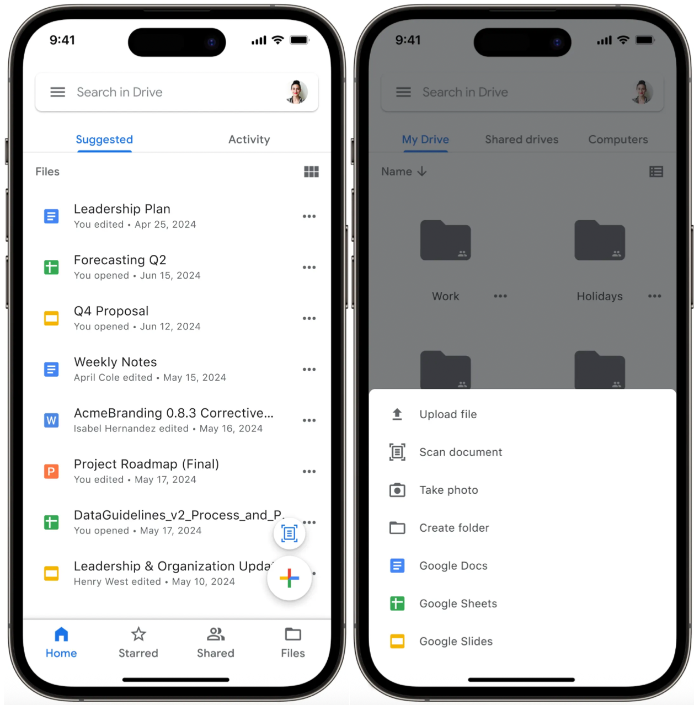
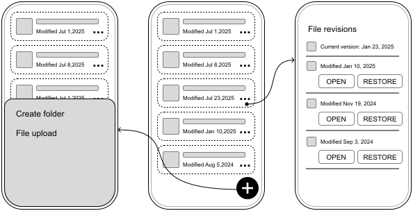
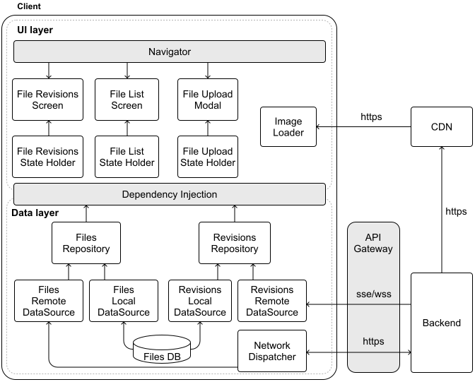
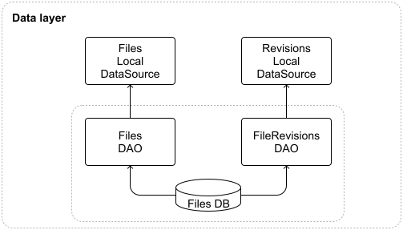
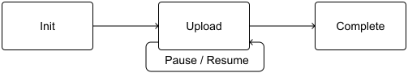
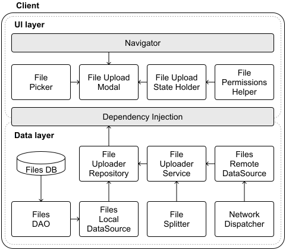
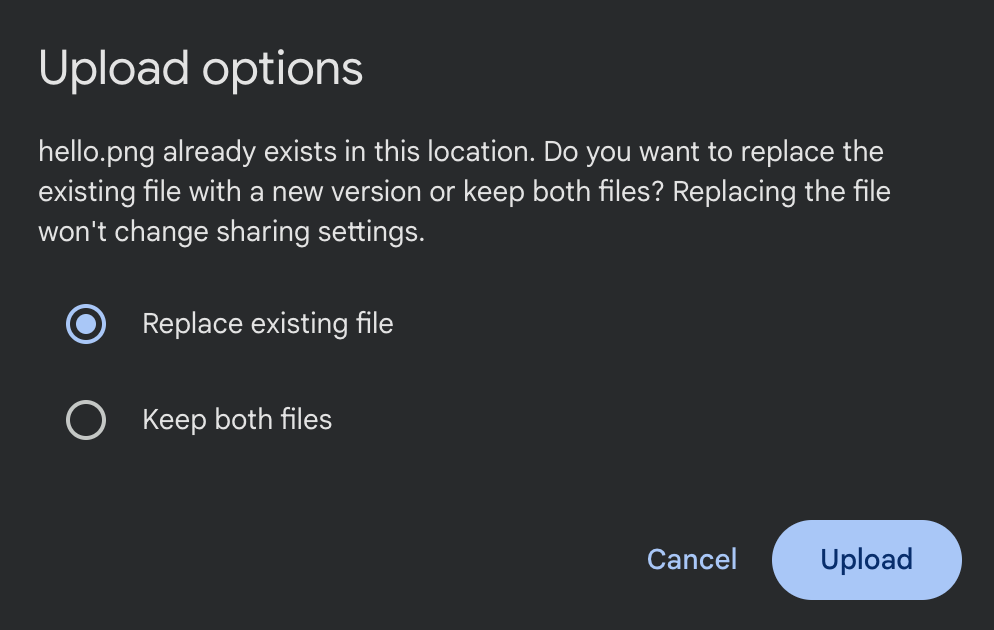

# Google Drive app

Cloud storage has become fundamental to how we work with files across devices. Services such as Google Drive, Dropbox, Microsoft OneDrive, and Apple iCloud have revolutionized file management by seamlessly integrating cloud storage into everyday workflows. In this chapter, we'll explore the design of a Google Drive mobile client.

Figure 1 illustrates the Google Drive mobile interface, showing how these complex requirements translate into a clean, user-friendly experience.



*Figure 1: Google Drive screenshots*

## Step 1: Understand the problem and establish design scope

Here's how the conversation with the interviewer might unfold:

**Candidate:** Let's begin by defining the core functionality of the Google Drive mobile client. I think the essential features include uploading and downloading files, with options to cancel these operations if needed. Users should also be able to create and delete folders to organize their content. Since Google Drive handles common file types like photos, videos, and documents, we'll also need to support those formats. Does that sound like a good starting point?

**Interviewer:** Yes, that covers the basics. Since this is a mobile app, network reliability can be an issue. Let's make uploads resumable so users can pick up where they left off if a connection drops.

**Candidate:** That makes sense! Resumable uploads are especially useful for larger files or unreliable networks. Speaking of file sizes, is there a maximum limit we should design for?

**Interviewer:** Let's set it at 10 GB.

**Candidate:** Got it. Users might upload the same file multiple times with updates. Should we include file versioning so they can track changes and restore previous versions of files?

**Interviewer:** Yes, file versioning is a valuable feature for cloud storage.

**Candidate:** Great. Next, since users often access Google Drive from multiple devices, we should ensure files sync seamlessly across them. Are we designing for a single user with multiple devices, or do we need to consider multi-user scenarios such as file sharing?

**Interviewer:** Let's focus on a single user with multiple devices for simplicity. We'll exclude sharing and permission management for now.

**Candidate:** For non-functional requirements, I assume we need scalability for a large user base and data durability for reliable file access, even in poor network conditions. Does that align with your expectations?

**Interviewer:** Exactly. For scale, plan for about 10 million daily active users.

**Candidate:** Noted. One last thing, Google Drive offers real-time editing and collaboration on Docs and Sheets. Should we include those features?

**Interviewer:** For this design, treat Docs and Sheets as standard files, leaving out real-time editing and collaboration.

#### Requirements

Based on our discussions, let's outline the core functionality needed for our Google Drive app.

- Users can upload and download files with a maximum size of 10 GB and cancel operations in progress.

- Users can create and delete folders to organize content.

- Users can view and restore previous versions of files.

- The app supports resuming interrupted uploads.

- Files sync across the user's multiple devices.

For **non-functional requirements**, our system must ensure:

- Scalability: Our system should handle 10 million daily active users and support a growing user base, as well as large data volumes, across various network conditions and device types.

- Data durability: Users need reliable access to their downloaded files, even in poor network connectivity conditions.

To keep our design focused, the following features are **out of scope**:

- Real-time collaboration (e.g., multi-user editing on Docs and Sheets).

- User collaboration features, such as file sharing and permissions.

#### UI sketch

Figure 2 shows the core screens of our Google Drive app:

- The **Files List screen** (center) is the app's main hub where users view and manage their files and folders.

- The **Upload Modal** (left) provides a simple, focused interface for uploading files.

- The **File Revisions screen** (right) shows the version history of a specific file for review and restoration.



*Figure 2: Basic sketch of our Google Drive app*

## Step 2: API design

With the app's requirements and UI sketch defined, we now turn to designing the API that connects the mobile client to the backend.

### Network protocol

The Google Drive app primarily involves client-driven actions such as uploading files, downloading content, or organizing folders. For these, **HTTP with REST APIs** offers a straightforward and widely adopted solution.

However, to handle real-time notifications, such as when a shared file is updated, we'll complement REST with either **WebSockets or Server-Sent Events (SSE)**. Since these notifications primarily signal changes rather than transfer actual file content, either approach can effectively handle these lightweight updates.

**📝 Note:**

While we're using REST in this design, gRPC with Protocol Buffers would also be a strong choice for the Google Drive app, given our scale requirements. gRPC offers several advantages that align well with our needs:

- Binary encoding for improved performance.

- Strong type safety to ensure API reliability.

- Efficient bidirectional streaming for real-time file updates.

If you're experienced with gRPC and Protocol Buffers, feel free to adapt the API design accordingly. The patterns we discuss remain relevant regardless of the protocol choice.

### Endpoints and data models

Next, let's outline the core API endpoints and their data structures, starting with the essentials: files and folders.

#### Files and folders

Since folders in Google Drive behave like files with a special type, we'll unify their management under a single set of endpoints for consistency.

- List files
  
  **GET /v1/files?parentId=`{fileId}`&page=`{page}`&limit=`{limit}`**
  
  
  Response: 200 OK with GetFilesResponse.
  Optional query parameters:

- parentId (String): ID of the parent folder. Defaults to the root if absent.

- Get file details
  
  **GET /v1/files/`{fileId}`**
  
  
  Response: 200 OK with File.

- Download file
  
  **GET `{downloadUrl}`** (provided in the File object)

- Create file or folder
  
  **POST /v1/files**
  
  
  Body: Metadata (e.g., name, mimeType, parentId).

- Delete file or folder
  
  **DELETE /v1/files/`{fileId}`**

- Update file or folder metadata

**PATCH /v1/files/`{fileId}`**

| Kotlin | Swift |
| --- | --- |
| **data class GetFilesResponse** files: List<File> pagination: PaginationMetadata | **struct GetFilesResponse** files: [File] pagination: PaginationMetadata |
| **data class File** id: String name: String mimeType: String size: Long downloadUrl: String? checksum: String? ... | **struct File** id: String name: String mimeType: String size: Int64 downloadUrl: String? checksum: String? ... |

**📝 Note:** These endpoints follow standard REST conventions. All requests require:

- Authentication via a JWT bearer token in the Authorization header.

- JSON content type (application/json).

Like any REST API, these endpoints may return 4xx status codes for client errors such as invalid authentication, missing resources, and malformed requests, and 5xx status codes for server errors.

Having covered file management, let's shift to versioning—a key feature for tracking changes and restoring past states.

#### File revisions

To enable users to view and revert file history, we'll add revision-specific endpoints tied to each file.

- List revisions
  
  **GET /v1/files/`{fileId}`/revisions?page=`{page}`&limit=`{limit}`**

- Get revision details
  
  **GET /v1/files/`{fileId}`/revisions/`{revisionId}`**

- Restore revision
  
  **POST /v1/files/`{fileId}`/revisions/`{revisionId}`/restore**

The FileRevision data model is defined as follows:

| Kotlin | Swift |
| --- | --- |
| **data class FileRevision** revisionId: String fileId: String mimeType: String size: Long modifiedAt: String downloadUrl: String checksum: String | **struct FileRevision** revisionId: String fileId: String mimeType: String size: Int64 modifiedAt: String downloadUrl: String checksum: String |

This configuration allows the client to easily view and revert to previous versions of the document.

## Step 3: High-level client architecture

Having defined the API structure, let's shift our focus to the mobile client's architecture. The goal is to create a modular and scalable design that supports the app's features while remaining adaptable for future growth.

We'll outline the key components and their interactions, as illustrated in Figure 3, starting with the external dependencies and then diving into the client itself.



*Figure 3: High-level architecture diagram of our Google Drive app*

### External server-side components

To set the stage, let's first consider the external services the client relies on:

- The **Backend** is the core system handling file storage, metadata, and business logic. It provides REST APIs for operations such as uploads and deletions, as well as SSE/WebSockets for real-time updates.

- The **CDN** boosts performance by caching static files closer to users, minimizing download times.

- The **API Gateway** is the client's single point of entry to the backend, managing authentication, request routing, and security enforcement.

### Client architecture

Now, let's explore the client side, which splits into two core layers: the **UI layer** and the **Data layer**. This separation keeps the code clean, testable, and maintainable.

The **UI layer** consists of three main screens: a **File List Screen** for browsing content, a **File Upload Modal** for adding new files, and a **File Revisions Screen** for viewing file history.

The **data layer** manages the core functionality through **Files and Revisions repositories**. They work together with the **Network Dispatcher** to handle HTTP communication with the backend, while the **Revisions Remote Data Source** listens for real-time updates through SSE or WebSockets.

This architecture provides a solid foundation for our Google Drive app. Now, let's dig deeper into some of the system's more complex aspects.

## Step 4: Design deep dive

Some unique aspects of the Google Drive system deserve special attention. Let's take a closer look at data storage, resumable file uploads, version history, and data encryption.

### Data storage

Efficient data management is key in a cloud storage app like Google Drive, where the mobile client must handle **metadata** (e.g., file names, folder hierarchies, version info) and **downloaded file content**. Let's break down how each is stored locally for optimal performance and security.

#### File metadata storage

Our app needs to efficiently handle several types of data as users interact with their files:

- File and folder metadata when browsing through directories, using the File data model.

- Version history and real-time updates for tracking changes, using the FileRevision data model.

This metadata requires frequent querying and updates. For managing this, **a relational database proves ideal** because:

- Enables fast, structured queries for operations such as listing files or finding revisions.

- Maintains data relationships (e.g., linking files to folders via parentId), preserving integrity.

- Performs well even as metadata grows, supporting scalability.

##### Database design

The File and FileRevision data models map naturally to database tables since they have well-defined structures. This makes it straightforward to perform complex queries across the file hierarchy, track relationships between files and their revision history, and maintain data consistency as files change.

Figure 4 shows how we've updated our architecture to reflect this design, with separate Data Access Object (DAO) components for each database table.



*Figure 4: Data layer design update*

##### Caching approach

To balance speed and storage, we'll cap the metadata database at a configurable size, such as 200MB, using an **LRU (Least Recently Used) eviction policy**. This keeps recently accessed metadata on-device while clearing out older entries. Since each metadata record is small, we can cache a large number of entries with minimal storage impact.

#### Managing downloaded files

For offline access, users can download files, which need secure and practical local storage.

The app's private internal storage, sandboxed by iOS and Android, is ideal because:

- Files are protected from external access.

- The app can manage files (e.g., delete or update) without affecting other apps or user directories.

- Files are directly accessible within the app, with an option to export to shared storage if needed.

##### How it works

Files are stored in a specific folder (e.g., /data/user/0/com.google.android.apps.drive/files/downloads/<fileId> on Android), using their fileId as a unique file name to avoid conflicts.

Before downloading, the app checks available space and alerts users if it's low, ensuring smooth operation even with large files.

**🔍 Industry insights:**

Box Drive allows users to mark folders for offline access. When selected, content is automatically downloaded in the background and stored locally for offline use [1].

### Resumable file uploads

Resumable uploads are a cornerstone of a mobile cloud storage app, especially for managing large files and coping with unreliable networks. They deliver key benefits: users can pause and resume uploads without needing to restart, recover from interruptions seamlessly, and manage uploads based on network or battery conditions, which enhances both efficiency and the user experience.

#### Upload types

Many popular apps use resumable uploads to efficiently handle large files. This includes cloud storage services such as Google Photos [2], X (formerly Twitter) [3], Box [4], Dropbox [5], Microsoft OneDrive [6].

Google Drive [7], for example, offers three distinct upload methods according to its documentation [8]:

- "Simple upload (uploadType=media): Use this upload type to transfer a small media file (5 MB or less) without supplying metadata."

- "Multipart upload (uploadType=multipart): Use this upload type to transfer a small file (5 MB or less) along with metadata that describes the file, in a single request."

- "Resumable upload (uploadType=resumable): Use this upload type for large files (greater than 5 MB) and when there's a high chance of network interruption, such as when creating a file from a mobile app. Resumable uploads are also a good choice for most applications because they also work for small files at a minimal cost of one additional HTTP request per upload."

Let's explore how to implement file uploads in our Google Drive mobile client. Since simple upload is straightforward, let's focus on resumable uploads.

#### High-level steps

- **Initiate**: The client requests an upload session and receives a unique upload ID and session details from the server.

- **Upload chunks**: The file is sent in smaller chunks. If the connection is interrupted, the client resumes from the last successful chunk.

- **Complete**: Once all chunks are uploaded, the server finalizes the file with an optional integrity check.



*Figure 5: Resumable uploads steps*

Companies implement these steps differently, primarily varying in how they structure the endpoints:

- **Single unified endpoint**: Companies like X (formerly Twitter) and Google (Drive and Photos) handle everything through a single endpoint. They manage metadata either through headers or query parameters. For example, Google Photos takes the following approach with its resumable uploads endpoint:
  
  
  X-Goog-Upload-Command=[start|upload, finalize]
  
  
  X-Goog-Upload-Offset=`{bytes\_offset}`
  
  
  
  - POST /files?uploadType=resumable&uploadId=`{uploadId}`

- **Multiple endpoints**. Companies such as Dropbox and Box split the functionality across different endpoints, with each endpoint handling a specific step of the process. For example, Dropbox exposes the following endpoints:
  
  
  
  - POST /files/upload_session/start
  
  - POST /files/upload_session/append
  
  - POST /files/upload_session/finish

Both approaches can work. In this explanation, we will look more closely at implementing multiple endpoints to handle resumable uploads.

#### Implementation details

Let's explore the different endpoints and data models we need to handle resumable uploads.

##### Initiate upload

**POST /v1/upload?uploadType=resumable**

| Kotlin | Swift |
| --- | --- |
| **data class UploadRequest** requestId: String name: String mimeType: String parentId: String size: Long | **struct UploadRequest** requestId: String name: String mimeType: String parentId: String size: Int64 |
| **data class UploadResponse** uploadId: String totalChunks: Int chunksProcessed: Int chunkSize: Long uploadUrl: String uploadExpiresAt: String | **struct UploadResponse** uploadId: String totalChunks: Int chunksProcessed: Int chunkSize: Int64 uploadUrl: String uploadExpiresAt: String |

The UploadResponse file guides file uploads by tracking how files are split, what has already been uploaded, and where new parts should be added. This helps the client manage uploads smoothly, whether starting new ones or resuming interrupted uploads.

##### Upload chunks and verify steps

```
Content-Range: bytes start-end/total
PUT /v1/upload/`{uploadId}`/chunk
  Body: Raw binary data for a particular chunk.
  Response: 201 Created if this was the final chunk, or 308 Resume Incomplete if more chunks remain. Payload of type UploadResponse.

```

The Content-Range header manages the upload process by telling the backend which part of the file is being sent. When the last piece arrives, the backend assembles everything and sends a completion confirmation. The client can then verify the upload was successful based on the backend's successful response code.

##### Resume upload

```
GET /v1/upload/`{uploadId}`
  Description: Returns information about an upload session.
  Body: Empty.
  Response: 200 OK. Payload of type UploadResponse.

```

The client can then continue uploading the remaining chunks, starting with the next chunk after chunksProcessed. If too much time has passed and the upload session has expired, the client will need to initiate a new upload from the beginning.

##### Cancel upload

```
DELETE /v1/upload/`{uploadId}`

```

Allows clients to abort uploads and free server resources.

#### Mobile implementation challenges

When implementing resumable uploads in mobile apps, we need to carefully consider several platform-specific challenges. Let's explore these challenges and their solutions.

##### Managing background tasks

Mobile apps should handle file uploads in the background to avoid blocking the main UI thread and provide a better user experience. However, mobile operating systems may terminate background tasks at any time. To prevent losing upload progress when this happens, we need to save the pending UploadResponse objects to disk. This lets us resume uploads later when the app is running again, ensuring files still get uploaded even if they were interrupted.

During app launch, we check for partially completed uploads and resume the jobs while monitoring system conditions such as battery and network changes.

##### Limited storage and permissions

When handling file uploads, we need to consider two key device constraints: storage space and file access permissions.

For storage, we temporarily cache files before upload. Since mobile devices have limited space, we need a strategy for handling low storage scenarios. The app should monitor available space and provide clear options when storage runs low, such as letting users clear the upload cache, removing previously downloaded files, or showing storage usage statistics.

For file access, we can use the system file picker, which provides temporary read access to selected files or requests direct storage permissions from the user. If users deny storage permissions, the app should disable upload functionality and provide clear guidance on enabling permissions through system settings.

##### Error handling and recovery

While the backend handles most of the complexity around chunks, such as determining chunkSize and tracking progress, the client still needs to handle errors gracefully. Let's look at some common error scenarios and how to handle them:

- When uploads fail due to connectivity problems, the client should save the current upload state, resume from the last successful chunk when connectivity returns, and show clear status messages to users such as "*Connection lost, attempting to resume*".

- The client should restart the upload process if it detects an invalid upload state, such as an expired uploadUrl, inconsistent responses from the backend (e.g., receiving a chunksProcessed count larger than the totalChunks), or the uploadExpiresAt time being reached.

To avoid overwhelming the servers with retry attempts, implement exponential backoff, gradually increasing the delay between retry attempts. This helps manage server load while still ensuring that uploads are eventually complete.

##### User experience and feedback

Users should always know how their upload is progressing, even if they restart the app. To keep users informed throughout the entire upload process, clients can:

- Calculate progress by comparing completed parts (chunksProcessed) against totalChunks.

- Update the UI to show meaningful progress indicators.

- Show system notifications when the app is in the background.

#### Architecture changes in the diagram

Let's update our architecture diagram to reflect the new components we've discussed. Figure 6 shows how we've enhanced both layers of our system. In the UI layer, we've added the **File Picker** and **File Permissions Helper** components to handle user interactions with the device's file system. The data layer now includes the **File Splitter** for breaking down large files, as well as the **File Uploader Repository** and **File Uploader Service** to manage the upload process in the background.



*Figure 6: Resumable file upload-related updates to the high-level*

architecture diagram

### Version history

Version history is essential for tracking file changes in cloud storage, letting users revert to earlier versions when needed. In this section, we'll cover how new file versions are uploaded and how conflicts are handled when changes overlap, striking a balance between usability and technical precision.

#### Uploading a new version of an existing file

When users modify a file and upload it, the app must handle the new version efficiently. Two methods dominate this process: **full copy upload and block-level sync**. Each approach affects storage, bandwidth, and app complexity differently.

##### Full copy upload

This method uploads the entire updated file every time a change is made.

- **Client-side:** The app sends the whole file to the server, no matter how small the edit.

- **Backend-side:** The server saves each version as a complete, standalone copy.

- **Advantages:**
  
  
  - Straightforward to implement, no need to track specific changes.
  
  - Reliable, each version is fully intact for easy recovery.

- **Disadvantages:**
  
  
  - Storage heavy as multiple full copies pile up, especially for big files.
  
  - Bandwidth intensive, as uploading everything uses more data.

Many cloud drive providers including Google Drive, Box, OneDrive, and iCloud use this approach [9] because of its simplicity and reliability.

##### Block-level sync

Block-level sync [10] takes a more sophisticated approach by uploading only the changed parts of a file, not the entire file.

- **Client-side:** The app splits the file into blocks, detects what's different, and sends just those blocks.

- **Backend-side:** The server keeps a block registry and rebuilds versions as required.

- **Advantages:**
  
  
  - More efficient. It saves bandwidth and storage, ideal for minor edits to large files.

- **Disadvantages:**
  
  
  - It's more complex as it needs advanced logic to manage and reassemble blocks.
  
  - Resource-heavy. It requires extra processing on both ends.

Dropbox pioneered this approach using their Broccoli [11] encoding system and block sync protocol. For a better comparison between these approaches, refer to the following block-level sync resource [12].

#### Managing file conflicts

File conflicts occur when multiple devices modify the same file concurrently, leading to inconsistencies across versions. This can happen in scenarios such as:

- A user edits a file on one device while offline, and another device modifies the same file before synchronization occurs.

- Two devices upload changes to the same file at nearly the same time.

- Interruptions during synchronization leave files in an inconsistent state.

To handle these challenges effectively, the client and server need to work together to detect and resolve conflicts. Cloud storage systems typically approach this problem in two parts: **conflict detection**, which identifies when changes overlap, and **conflict resolution**, which determines how to handle competing versions.

Let's explore these aspects in more detail, focusing on a widely-used detection approach called **optimistic concurrency control** and common resolution strategies such as **Last-Write-Wins (LWW)** and **version forking**.

##### Conflict detection

Optimistic concurrency control [13] is a widely used technique to detect conflicts by validating changes against the current file version before committing updates. It assumes conflicts are rare and checks for them only during the update process. This approach is employed by cloud storage providers such as Box, which uses HTTP headers for version validation [14].

At a high level, it works as follows.

**Process:**

- Each file has a version identifier (e.g., a version number or hash) tracked by both client and server.

- When uploading a new version of the file, the client sends the file data along with its current version identifier (e.g., via a header such as If-Match: <version>).

- The server compares this with its latest version:
  
  
  - If they match, the upload succeeds, and the version increments.
  
  - If they differ, the server rejects the upload with a 409 Conflict error.

- On conflict detection, the client:
  
  
  - Retrieves the latest version using GET /v1/files/`{fileId}`.
  
  - Merges changes (automatically or with user input, depending on file type).
  
  - Retries the upload with the updated version.

**Advantages:**

- Prevents lost updates by ensuring that only changes based on the latest file version are accepted.

- Enables fine-grained conflict resolution, often resulting in higher data integrity.

**Disadvantages:**

- Can introduce extra latency due to the need for conflict resolution flows, particularly over unstable mobile networks.

- May frustrate users with conflict errors and require manual merging in some cases.

##### Conflict resolution

Cloud storage systems such as Google Drive often adopt an eventual consistency model to prioritize availability and allow updates to proceed without immediate synchronization across all devices.

In this model, conflicts are detected after updates are accepted, and resolution is handled through specific strategies. Two common resolution strategies are:

- **Last-Write-Wins (LWW)** automatically makes the most recent version the current one.

- **Version forking** keeps both conflicting versions, usually by adding a number to the filename (e.g., "filename.png" and "filename (1).png").

##### Real-world examples

The choice of conflict resolution strategy depends on your app's specific requirements. Cloud storage providers handle conflicts in different ways:

- Dropbox keeps things simple by default. It automatically saves the newest version without asking the user, using the last-write-wins strategy.

- Google Drive lets users decide. When it detects a conflict, it shows a dialog asking if they want to keep both files or replace the old one (see Figure 7).



*Figure 7: Google Drive user experience when uploading a file*

whose name already exists in the folder

Dropbox's public API provides support for both strategies we discussed to give more flexibility to clients. Through two key parameters (strict_conflict and mode) in their upload API [15], they give developers precise control:

- The strict_conflict parameter determines whether to enforce strict validation. When enabled, it prevents concurrent uploads by returning conflict errors.

- The mode parameter controls what happens when conflicts occur:
  
  
  - In add mode, new uploads of existing files get automatically renamed with a unique counter.
  
  - In overwrite mode, new uploads simply replace existing files, following a "last-write-wins" strategy.

### Data encryption

The interviewer may sometimes add extra requirements to the problem. For example, what if they ask you to support enterprise customers who need files stored on devices to be encrypted? What would you do?

#### Files and metadata encryption

Without encryption, a lost or compromised device could expose sensitive files if an attacker mounts its storage. To counter this, we'll use **AES-256** [16], a strong, industry-standard encryption algorithm that balances security and performance on mobile hardware. We'd use it for:

- **Metadata protection:** File names, folder structures, and other metadata are stored in an encrypted database.

- **File protection:** Downloaded files are encrypted within the app's private storage.

This approach ensures that even if the device's storage is accessed, the data remains unintelligible without the decryption key.

#### Key management for offline access

To enable offline file access, encryption keys must be stored locally rather than relying solely on server-side solutions. We leverage platform-specific security features to store these keys securely:

- On Android, the Android Keystore [17] provides hardware-backed key storage, protecting keys from extraction.

- On iOS, the Keychain [18] offers similar protection, integrating with Apple's Secure Enclave where available.

For added protection, we can derive the key from the user's login credentials using **PBKDF2** [19], a key derivation function, ensuring only authenticated users can unlock it. This ties the encryption tightly to user identity.

#### Mobile implementation considerations

While encryption provides essential security, it comes with unique challenges on mobile devices. Let's explore how to balance strong security with smooth performance.

##### Performance and resources

Encryption operations can be CPU-intensive, especially for large files. To maintain a responsive app, the encryption/decryption work happens on background threads to keep the UI smooth. Also, we should take into account that encrypted files take up slightly more space due to padding and metadata overhead and the app memory consumption when keeping encrypted and decrypted files in memory.

##### Memory management

Careful memory handling is crucial when working with decrypted data. We should consider implementing timeouts to automatically clear decrypted content and release cached decrypted data when memory runs low. Additionally, developers should watch for potential memory leaks in encryption/decryption cycles.

##### Error handling and recovery

A robust encryption system needs clear paths for handling issues. We must implement appropriate fallback behaviors when encryption keys become corrupted or inaccessible or when encryption/decryption operations fail. The app needs to inform the user and prompt them to take the right actions.

##### Backup strategy

Since encrypted files are tied to device-specific keys, they require special handling for backups. We should exclude encrypted files from system backups by default. If backups are needed, implement custom logic to re-encrypt data with backup-specific keys.

##### Device compatibility

Not all devices offer the same level of security features. In our logic, we must check for secure hardware availability during app initialization, and fall back gracefully to app sandbox storage on older devices. Additionally, we should inform users that we're operating with reduced security capabilities.

## Step 5: Wrap-up

Throughout this chapter, we've designed a Google Drive client that addresses key challenges in cloud storage apps. Our solution enables users to securely store, access, and sync their files while maintaining a complete version history. We built the system around a robust REST API for core operations, complemented by SSE or WebSockets to deliver real-time updates when files change.

The architecture we developed tackles several complex challenges head-on. By carefully structuring our client components and defining clear backend interactions, we created a system that handles everything from basic file operations to more intricate features such as resumable uploads and file versioning.

If you have additional time during your interview or want to explore more advanced features, here are some compelling extensions to consider:

- Design a selective sync system where users choose which folders and file types to store locally versus keeping in the cloud only.

- Create a comprehensive file sharing system with granular permissions and access controls for secure collaboration.

- Optimize data transfer and storage through compression techniques such as Google's Brotli algorithm [20], reducing bandwidth usage and storage costs.

## Resources

[1] How Box Drive designed Mark for Offline: [https://blog.box.com/how-we-designed-mark-offline-box-drive](https://blog.box.com/how-we-designed-mark-offline-box-drive)

[2] Google Photos resumable uploads: [https://developers.google.com/photos/library/guides/resumable-uploads](https://developers.google.com/photos/library/guides/resumable-uploads)

[3] X (formerly Twitter) resumable uploads: [https://developer.x.com/en/docs/x-api/v1/media/upload-media/uploading-media/chunked-media-upload](https://developer.x.com/en/docs/x-api/v1/media/upload-media/uploading-media/chunked-media-upload)

[4] Box chunked uploads: [https://developer.box.com/guides/uploads/chunked/](https://developer.box.com/guides/uploads/chunked/)

[5] Dropbox resumable uploads: [https://www.dropbox.com/developers/documentation/http/documentation\#files-upload\_session-start](https://www.dropbox.com/developers/documentation/http/documentation%5C#files-upload%5C_session-start)

[6] Microsoft OneDrive resumable uploads: [https://learn.microsoft.com/en-us/graph/api/driveitem-createuploadsession](https://learn.microsoft.com/en-us/graph/api/driveitem-createuploadsession)

[7] Google Drive resumable uploads: [https://developers.google.com/workspace/drive/api/guides/manage-uploads#resumable](https://developers.google.com/workspace/drive/api/guides/manage-uploads#resumable)

[8] Google Drive upload types: [https://developers.google.com/drive/api/guides/manage-uploads](https://developers.google.com/drive/api/guides/manage-uploads)

[9] Google Drive uploads entire files: [https://www.pcworld.com/article/2020862/google-drive-review.html](https://www.pcworld.com/article/2020862/google-drive-review.html)

[10] Block-level storage: [https://en.wikipedia.org/wiki/Block-level\_storage](https://en.wikipedia.org/wiki/Block-level%5C_storage)

[11] Dropbox's Broccoli encoding and block sync protocol: [https://dropbox.tech/infrastructure/-broccoli--syncing-faster-by-syncing-less](https://dropbox.tech/infrastructure/-broccoli--syncing-faster-by-syncing-less)

[12] Block-level sync vs full copy comparison: [https://www.cloudwards.net/block-level-file-copying/](https://www.cloudwards.net/block-level-file-copying/)

[13] Optimistic concurrency control: [https://en.wikipedia.org/wiki/Optimistic\_concurrency\_control](https://en.wikipedia.org/wiki/Optimistic%5C_concurrency%5C_control)

[14] Box optimistic concurrency implementation: [https://developer.box.com/guides/api-calls/ensure-consistency](https://developer.box.com/guides/api-calls/ensure-consistency)

[15] Dropbox strict conflict strategy: [https://www.dropbox.com/developers/documentation/http/documentation\#files-upload](https://www.dropbox.com/developers/documentation/http/documentation%5C#files-upload)

[16] Advanced Encryption Standard (AES): [https://en.wikipedia.org/wiki/Advanced\_Encryption\_Standard](https://en.wikipedia.org/wiki/Advanced%5C_Encryption%5C_Standard)

[17] Android Keystore: [https://developer.android.com/privacy-and-security/keystore](https://developer.android.com/privacy-and-security/keystore)

[18] iOS Keychain: [https://developer.apple.com/documentation/security/keychains](https://developer.apple.com/documentation/security/keychains)

[19] PBKDF2: [https://en.wikipedia.org/wiki/PBKDF2](https://en.wikipedia.org/wiki/PBKDF2)

[20] Brotli: Google's lossless data compression algorithm: [https://en.wikipedia.org/wiki/Brotli](https://en.wikipedia.org/wiki/Brotli)