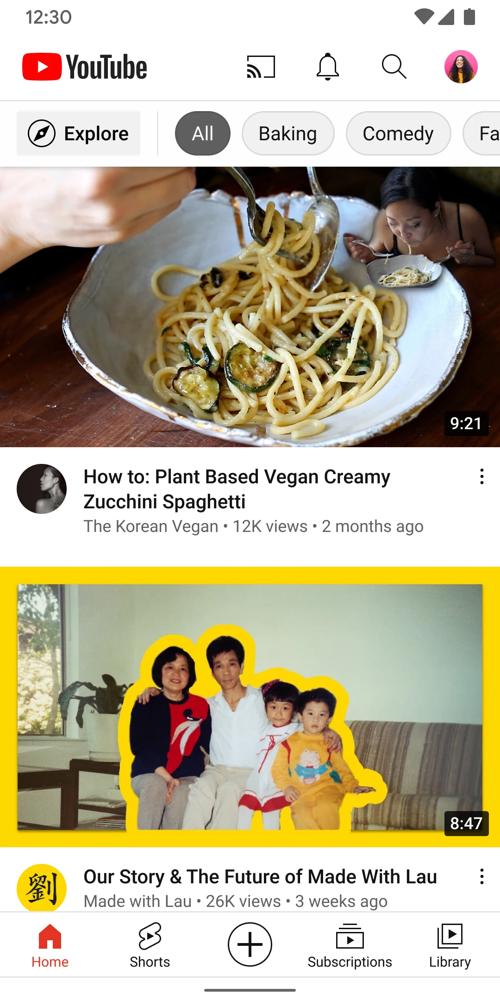
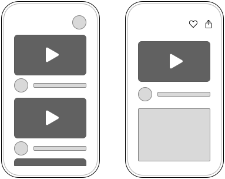
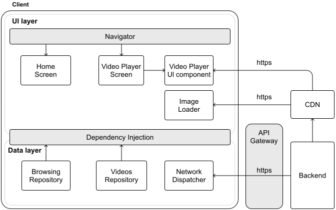
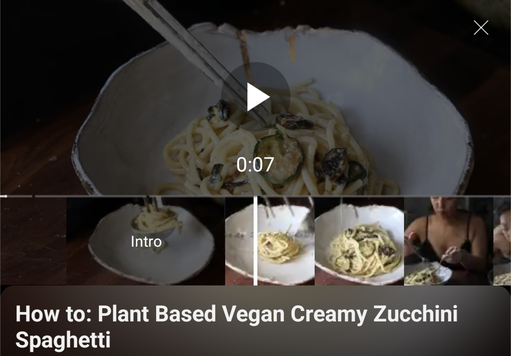
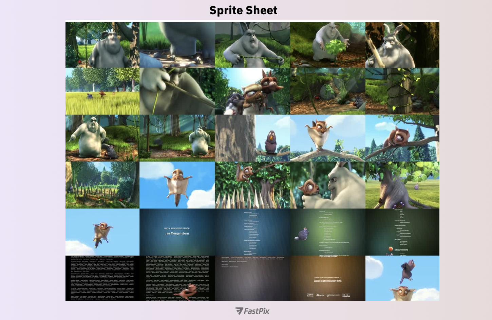
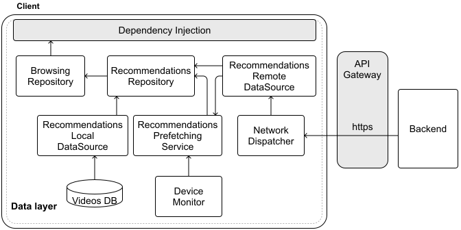
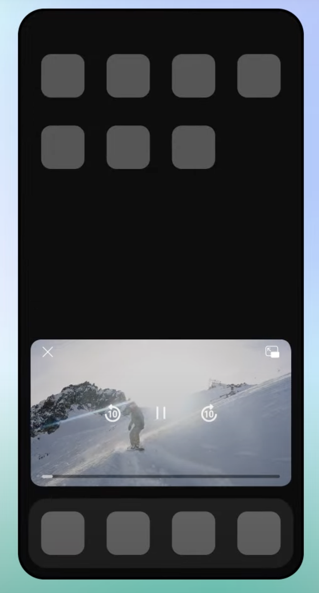

# YouTube app

Designing the YouTube mobile application poses a significant challenge in system architecture. With billions of hours of video streamed each day across diverse devices and network environments, delivering seamless playback on this scale requires careful planning. In this chapter, we will examine the essential components that enable the YouTube app to excel as a mobile system, guiding you through the design process step by step.

YouTube operates on an extraordinary scale, serving over 2.5 billion active users who access content in more than 80 languages [1]. Mobile devices now dominate the platform, accounting for over 70% of total watch time as of early 2024 [2]. This shift underscores the importance of optimizing the mobile experience, a priority we will address throughout our design.



*Figure 1: YouTube screenshot taken from the Google Play Store*

## Step 1: Understand the problem and establish design scope

Before diving into the design, we must first define its requirements and boundaries. Imagine we are discussing this with an interviewer to clarify the system's focus:

**Candidate:** To start, I would like to confirm the scope. Are we concentrating on the video consumption experience, such as browsing and playback, or should we also consider features for creators, such as video uploads or live streaming?

**Interviewer**: Please focus on video consumption: browsing and playback. Exclude content creation and live streaming.

**Candidate**: Very well. For consumption, I assume users need to browse recommended videos on a home feed and play them. The player should include controls such as play, pause, and seek, plus options for quality settings (e.g., 360p, 720p), subtitles, and alternate audio tracks. Does this match your vision?

**Interviewer**: Yes, that captures the key functionality.

**Candidate**: For playback, may I assume we can rely on an existing streaming solution, such as HLS or DASH, for adaptive streaming, or do we need to design that ourselves?

**Interviewer**: You can use an existing protocol; no need to build it from scratch.

**Candidate**: Excellent. To improve the experience, prefetching video recommendations for the video feed might help. Should we include that?

**Interviewer**: Yes, prefetching would be a valuable addition.

**Candidate**: Noted. Should we also incorporate features such as watch history for resuming videos or playlist management? What about social elements such as likes and comments?

**Interviewer**: Let's keep those outside our scope.

**Candidate**: Finally, for scale, how many daily active users (DAU) should we plan for?

**Interviewer**: Design for about 1 billion DAU worldwide.

This exchange helps us establish a clear picture of what we are building and its constraints.

#### Requirements

Based on this, we are creating a YouTube-like mobile app centered on video consumption, with these features:

- Users can browse recommended videos in a home feed.

- Users can watch videos using a feature-rich player.

- The app prefetches video feed data to improve user experience.

As for **non-functional requirements**, we need to build a system that ensures:

- Scalability: The app must handle 1 billion daily active users globally while adapting to diverse network conditions from high-speed Wi-Fi to spotty cellular connections.

- Performance: Users should experience smooth scrolling and video playback with efficient delivery of media content across all device types.

- Availability: The system needs to guarantee uninterrupted access to videos while supporting multiple languages and regions to serve a global audience.

#### UI Sketch

Consider the primary screens of our app, as shown in Figure 2. The **Home screen** presents tailored video recommendations, while the **Video Player screen** displays the selected video with its controls.



*Figure 2: Basic sketch of our YouTube app*

With our scope set and a simple UI outlined, we can now explore how the app communicates with the backend.

## Step 2: API design

Next, we design the API that connects the client to the backend.

### Network protocol

For most of our client-server interactions, we will adopt a **RESTful API over HTTP with JSON** as our communication framework. This approach leverages REST's simple and intuitive design, while also offering wide compatibility with mobile clients and existing tools, making it a practical and efficient solution.

At YouTube's scale, however, efficiency matters greatly. JSON can produce larger payloads, which can potentially slow down performance on mobile networks. An alternative, like gRPC with Protocol Buffers, offers compact and fast serialization, making it ideal for high-performance systems.

While gRPC is highlighted as a potential optimization, it's a more specialized technology, and not every developer is familiar with it. For simplicity, we'll opt for a RESTful API in our design. However, if you're comfortable with gRPC, feel free to use it for the API design. It's a great option too.

### Endpoints

Let's define the API endpoints driving the app's core functionality.

In this chapter, we will base our design on the real YouTube Data API [3]. It follows a REST-like architecture with some interesting deviations that offer valuable insights for designing mobile systems. At its core, it provides endpoints for accessing YouTube resources such as videos, playlists, and channels.

#### Video browsing

The videos endpoint has an interesting design choice worth looking at. The Video resource data model [4] contains rich metadata: everything from basic details to view counts and content restrictions. But not every client needs all this information at once!

The YouTube API addresses over-fetching through a flexible part parameter in their video endpoint:

```
GET https://youtube.googleapis.com/youtube/v3/videos?
      part=snippet,statistics,contentDetails&
      id=VIDEO_ID&
      maxResults=`{results}`&pageToken=`{cursor}`

```

The part parameter here is key: it lets the client specify exactly which data fields to fetch, such as snippet for titles and thumbnails or statistics for view counts. This selective approach minimizes over-fetching, a critical consideration for mobile apps where every byte counts. It's not as dynamic as GraphQL, but it offers similar benefits with less overhead, keeping our design practical and efficient.

This approach offers several benefits:

- Reduces network bandwidth usage by trimming response payloads.

- Improves server efficiency since it only needs to fetch the requested fields.

- Gives clients fine-grained control over data retrieval.

- Maintains REST's simplicity while adding field selection.

**📝 Note:**

Unlike GraphQL, which allows field-by-field selection, this approach lets you choose from predefined sets of fields. While not as granular as GraphQL, it offers a practical balance: giving clients some control over the data they receive without adding too much complexity.

##### Popular videos endpoint

When a user opens the app without signing in, we need to show trending content in their main feed. To fetch popular videos, we can use:

```
GET /youtube/v3/videos?part=snippet&chart=mostPopular&
    maxResults=20&regionCode=US

```

##### Video details endpoint

When a user taps a video, we need to fetch its full details to enrich the viewing experience. Here's how we handle it:

```
GET /youtube/v3/videos?id=VIDEO_ID&
    part=snippet,player,contentDetails,statistics

```

This call retrieves everything the app needs: metadata, such as the title and description, playback information via the player, and engagement metrics from statistics.

#### Video playback

Unlike third-party apps, which must use YouTube’s IFrame Player API [5], we can feed streaming manifests directly to platform-specific video player APIs since we’re designing YouTube’s internal client.

To achieve that, we can create a video playback endpoint that provides all necessary streaming information:

```
GET https://my-internal.googleapis.com/youtube/v3/videos/playback?
      codecs=supportedCodecs&
      protocols=supportedStreamingVideoProtocols&
      language=preferredLanguage&
      subtitles=preferredSubtitles

```

The response delivers a streaming manifest (e.g., DASH or HLS) tailored to the device's capabilities, along with metadata such as subtitle options. We'll dive deeper into these streaming protocols later, but for now, this endpoint ensures smooth, adaptive playback.

## Step 3: High-level client architecture

With the API design in place, let's shift our attention to the client-side architecture. Figure 3 sketches out the architecture of our YouTube app.



*Figure 3: High-level architecture diagram of our YouTube app*

### Server-side components

Our system relies on several external services:

- The **Backend** manages video data, user interactions, and serves API requests over HTTP.

- **CDNs** speed up the delivery of static assets, such as video content, thumbnails, and metadata, by caching them near users.

- The **API Gateway** acts as the front door for client requests, handling routing, security, authentication, and access control.

CDNs play a crucial role in video streaming for several key reasons:

- **User experience**: Users receive content from nearby CDN servers, rather than a distant central server. This significantly reduces loading times and buffering.

- **Scalability**: When millions of users stream popular videos simultaneously, CDNs distribute the load across multiple servers. This prevents overloading any single server and ensures smooth playback for everyone.

- **Cost-effective delivery**: Without CDNs, every video request would have to travel all the way to the origin servers, increasing both latency and bandwidth costs. CDNs optimize these costs by reducing the burden on primary infrastructure.

Despite these benefits, CDN costs can become substantial as operations scale. This has prompted major streaming platforms to explore alternatives:

- Netflix developed its own CDN solution called Open Connect [6]. This custom approach gives them greater control over delivery costs while specifically optimizing for video content.

- Other companies form direct partnerships with Internet Service Providers, placing servers within ISP networks. This strategy can lower delivery costs while improving streaming quality.

### Client architecture

The **UI layer** consists of three main screens: a **Home Screen** for browsing recommended videos, and a **Video Player screen** for seeing video details and watching them via the **Video Player UI component**. As with other apps, these screens have their corresponding state holder associated with them that exposes UI state and handles the business logic of the screens.

The **data layer** manages the core functionality through the Browsing, Video, and History **repositories**. All of them would have their corresponding Remote Data Source that uses the **Network Dispatcher** to handle HTTP communication with the backend.

## Step 4: Design deep dive

Now that we've established our high-level architecture, let's explore some key aspects of our system in more detail:

- Video streaming.

- Prefetching video feed data.

- Enhanced user experiences.

### Video streaming

When designing a video streaming app like YouTube, creating a smooth viewing experience is key. Users expect videos to start fast and play without interruptions.

Modern video streaming works differently from traditional downloading. Instead of waiting for the entire file to download, streaming breaks videos into small segments that load progressively:

- Playback begins after just the first few segments are downloaded.

- More segments load in the background as users watch.

- Video quality adjusts according to your connection speed.

- Played segments get cleared to save memory.

This approach is well-suited to mobile environments. Loading only what's needed right now uses less memory and handles videos of any length. The app can also switch video quality when your connection changes, ensuring the best possible viewing experience wherever you are.

#### Video streaming protocols

Modern video streaming relies on several key protocols, each designed for specific scenarios:

- **HTTP Live Streaming (HLS)** [7] is Apple's widely adopted protocol that breaks videos into small chunks delivered over standard HTTPS connections. This approach ensures smooth playback even when network conditions change. While especially strong on Apple devices, HLS works well across most platforms.

- **DASH (Dynamic Adaptive Streaming over HTTP)** [8] follows similar principles to HLS but offers more flexibility as an open standard. Unlike HLS, DASH isn't tied to specific video codecs, giving developers more implementation freedom. This protocol has gained significant traction, especially outside the Apple ecosystem.

- **Common Media Application Format (CMAF)** [9] bridges the gap between HLS and DASH by providing a unified container format. This standardization eliminates the need for separate content versions, simplifying deployment and reducing storage costs.

- Other notable protocols include WebRTC (Web Real-Time Communication) [10], the SRT (Secure Reliable Transport) protocol [11], and two older protocols, such as Real-Time Streaming Protocol (RTSP) [12] and Real-Time Messaging Protocol (RTMP) [13].

When selecting a protocol, we need to consider the specific needs of our YouTube app, including latency (how quickly video starts playing), platform compatibility (support across Android and iOS devices and the capabilities of their ecosystem), and security needs (protecting content during transmission). For a deeper technical comparison of these protocols, several comprehensive resources are available [14] [15].

**📝 Note:** These protocols involve low-level technical details that you usually don't need to learn for system design interviews. What's important is understanding that different streaming protocols support different video formats and players, which influences your architecture choices.

When building video streaming apps such as YouTube, Twitch, or Netflix, HLS and DASH are the leading protocols. They both support **adaptive bitrate streaming** [16], automatically adjusting video quality based on network conditions and device capabilities. For applications where minimizing delay matters, low-latency versions (LL-HLS and LL-DASH) are available.

**📌 Remember!** Adaptive streaming protocols such as HLS and DASH typically use adaptive bitrate streaming (ABR) to adjust video quality based on network conditions.

Most major streaming platforms implement several protocols rather than just one. This ensures wide device compatibility and optimizes for different viewing scenarios. YouTube, for example, supports HLS, DASH, RTMP, and RTMPS, allowing third-party clients to choose the protocol that works best for them [17].

##### Adaptive bitrate streaming

Video apps need to handle changing network conditions as users move around, switch between WiFi and cellular, or experience congestion. **Adaptive bitrate streaming** solves this problem through:

- **Multiple quality versions**
  
  
  - Videos are encoded at different quality levels (480p, 720p, 1080p).
  
  - Each version offers a different balance of quality vs. bandwidth usage.

- **Video segmentation**
  
  
  - Content is split into small chunks (e.g., 2-10 seconds each).
  
  - Every chunk is available in all quality variants.
  
  - Smaller chunks allow for faster adaptation, but they increase server requests.

- **Real-time quality switching**
  
  
  - The player constantly monitors network speed and device performance.
  
  - It selects the optimal quality for each upcoming segment.
  
  - Quality can shift up or down as conditions change.

The player makes smart decisions by tracking download speeds, buffer levels, CPU/GPU usage, and device capabilities. When the connection improves, quality gradually increases. When things get worse, quality quickly drops to prevent buffering. In practice, mobile players use buffer-based or hybrid (buffer + throughput) algorithms to decide the next segment's bitrate. Because each decision only affects the next segment, the system can respond immediately to changing conditions.

#### Video streaming on Android and iOS

For video streaming in mobile apps, the best options are the native solutions: **ExoPlayer** [18] **on Android and AVPlayer** [19] **on iOS**. These frameworks handle modern streaming formats such as HLS and MPEG-DASH while delivering smooth, reliable playback.

The native solutions offer two key advantages: deep platform integration for optimal performance, such as hardware decoding, and extensive control over playback features (adaptive bitrate, subtitles, etc.). While third-party players such as VLC, JWPlayer, or Brightcove provide consistent APIs, the native solutions typically might be more customizable for specific use cases.

#### Managing video content: Subtitles and audio

Modern video streaming services separate video, audio, and text components. This modular approach, used in protocols such as MPEG-DASH and HLS, creates a more flexible and efficient streaming experience. Let's look at how this works.

##### Subtitle and caption support

Both MPEG-DASH and HLS implement text elements, including subtitles and closed captions, through dedicated text tracks:

- HLS uses WebVTT format text tracks referenced in the main playlist (.m3u8) file

- MPEG-DASH supports multiple formats, including WebVTT and TTML (Timed Text Markup Language), defined in the manifest (.mpd) file

**📌 Remember!**

Separate tracks are independent streams of content, such as audio, subtitles, or closed captions, that play alongside the main video. Each track contains its own data and timing information, allowing it to stay perfectly synchronized with the video playback. This separation makes it easier to handle different types of content while keeping everything in sync.

Popular platforms like YouTube follow this approach because separating text from video offers several advantages:

- Reduces overall bandwidth usage since text takes minimal space compared to video.

- Enables multi-language support without duplicating video streams.

- Helps meet accessibility requirements with easily updatable captions.

- Allows real-time subtitle updates without re-processing video content.

#### Thumbnails implementation

When users scrub through a video's seek bar, like in Figure 4, the small previews you see are not actually built into standard streaming protocols, such as HLS or MPEG-DASH. Video services need to create this preview functionality separately. Let's look at two common approaches.



*Figure 4: Precise seeking thumbnails on the YouTube Android app*

##### Sprite sheets

One popular method uses **sprite sheets** (also called texture atlases) [20]. This approach combines multiple thumbnail images into a single file, which reduces server requests. While this works well for web streaming, it requires maintaining separate pre-generated images alongside each video. Figure 5 shows an example of this.



*Figure 5: Example of a sprite sheet for thumbnails—source FastPix [21]*

##### Adaptive streaming

The second approach leverages adaptive streaming technology to fetch low-resolution video frames for previews. YouTube mobile apps use this method for their seek previews, and it works particularly well:

- When a user moves the seek bar, the app requests that specific timestamp from the server, but at a much lower resolution (typically 144p or 240p).

- The server quickly delivers these low-bitrate segments, enabling smooth previews during seeking.

- Once the user selects their position, the app switches back to full-resolution video for normal playback.

This approach offers several benefits for mobile applications:

- Shows actual video motion rather than static images, giving better context.

- Reuses existing streaming infrastructure, eliminating the need for separate systems.

- Avoids storing additional thumbnail assets, saving storage space.

- Delivers accurate, low-latency previews that match the actual content.

Adaptive streaming aligns especially well with mobile apps, providing a smooth seeking experience while efficiently using device resources.

#### Common video streaming challenges

Building video streaming into mobile apps presents several key challenges that directly affect the user experience. Let's explore these challenges and practical approaches to address them.

##### Memory management

Video playback demands significant memory, particularly challenging on mobile devices with limited resources. Mobile operating systems can terminate apps that consume excessive memory, making proper memory management critical for a reliable streaming experience.

There are effective memory management strategies we can use:

- **Adaptive buffer sizing** by maintaining smaller buffers on memory-constrained devices while using larger buffers on high-end devices for smoother playback.

- **Frame recycling** by reusing video frame buffers instead of continuously allocating new memory.

- **Degrade gracefully** by reducing quality when memory pressure increases, preventing playback failures.

- **Handle app state transitions** properly to release resources when the app moves to the background.

Memory monitoring is essential, and we should implement analytics that track memory usage patterns across different devices and playback scenarios to identify potential issues before they affect users.

##### Battery life optimization

Video playback is one of the most power-intensive operations on mobile devices, affecting both processor and network usage.

Some power consumption reduction techniques we can use are:

- **Adaptive quality selection** by lowering resolution and bitrate when the battery is low or the device is not charging.

- Use **hardware acceleration** where available to reduce CPU load.

- **Pause video playback and suspend network** operations when the app isn't visible.

**🛠️ Platform implementation details**

Mobile-specific optimizations make a significant difference. For example, on Android, using the Battery Saver API to detect power-saving mode and adjust video quality accordingly, or on iOS, responding to low-power mode notifications to reduce playback quality.

##### Network handling

Mobile networks can be unpredictable, requiring thoughtful strategies to ensure a smooth user experience. To address these challenges, we can implement several robust network handling techniques:

- **Bandwidth adaptation** by switching video quality based on available bandwidth using adaptive bitrate streaming.

- **Efficient retry logic** by using exponential backoff with jitter to prevent network congestion during retries.

- Allowing **pre-downloading videos** for offline viewing when network conditions are favorable.

- Adjusting **buffering strategies** based on connection type (cellular vs. Wi-Fi).

##### Advanced streaming optimizations

Beyond the basics, several advanced techniques can significantly improve the mobile streaming experience:

- Prioritize audio continuity over video during network constraints, as users are more sensitive to audio disruptions.

- Predictive buffering by analyzing viewing patterns to pre-buffer content that the user is likely to watch next.

- Optimize subtitle handling in mobile apps by caching text tracks for offline viewing and unreliable network conditions.

Building efficient video streaming requires carefully balancing these challenges. The key is finding the right trade-offs between smooth playback, battery life, and network resilience based on your app's specific needs and user expectations.

**🔍 Industry insights:**

Reddit improved Android video playback by customizing ExoPlayer specifically for short-form videos. This involved choosing efficient formats (MP4), optimizing caching and buffering strategies, and adjusting bandwidth estimation, which significantly reduced load times, playback errors, and rebuffering [22].

Netflix enhanced its 4K streaming by implementing shot-based encoding and dynamic optimization techniques, resulting in improved video quality and reduced bitrates [23]. In another resource, Netflix explains the development of a Unicode-based pipeline to process subtitles and closed captions efficiently across diverse languages and formats [24]. In this other example, see how Netflix improved audio streaming quality by introducing high-quality sound features that aim to deliver studio-quality, perceptually transparent audio to viewers [25].

### Prefetching video feed data

When users open YouTube, they expect relevant content to appear instantly. To meet this expectation, mobile apps often prefetch feed data, so that content loads immediately even before the user starts interacting.

Let's explore how to implement prefetching in a way that balances these user experience benefits with efficient resource usage.

#### Design options

Table 1 compares the key strategies we could use for prefetching feed data.

| Option | Description | Advantages | Disadvantages |
| --- | --- | --- | --- |
| Time-based prefetching | Fetch recommendations at regular intervals regardless of user activity. | Simple to implement and maintain. Predictable network usage patterns. Ensures content stays relatively fresh. | Can result in unnecessary data usage. Doesn't adapt to actual user behavior. Could miss important updates between intervals. |
| Event-based prefetching | Trigger prefetch based on specific events such as app background or foreground transitions. | Aligns naturally with user behavior. Reduces unnecessary network calls. More efficient resource utilization. | May miss optimal prefetching opportunities. Can lead to inconsistent content freshness. Requires more complex implementation logic. |
| Intelligent prefetching | Combine multiple signals (e.g., device state or use patterns) to determine optimal prefetch timing. | Optimizes both UX and resource usage. Adapts to individual usage patterns. Handles varying network conditions gracefully. | Most complex to implement. Requires careful tuning of prefetch parameters. Needs robust monitoring to ensure effectiveness. |

Table 1: Trade-offs for different prefetching options

Due to the scale we're operating at and the amount of user information we have available, we're implementing **intelligent prefetching**. We can decide when to prefetch content from the mobile app, taking into account signals such as device state (e.g., device charging or network type), user patterns (e.g., typical app open times), content relevance scores, and resource availability (e.g., battery levels).

This data-driven approach helps us prefetch content at the optimal times, improving the user experience while being mindful of device resources.

#### Implementation details

To implement intelligent prefetching, the system may need to address the following considerations.

##### Signal collection and analysis

The key to smart prefetching starts with understanding user behavior. The client app should gather key signals about device status and how users interact with content, enabling the backend to deliver more personalized recommendations.

We can implement a **remote configuration** system that allows the backend to guide client behavior. The prefetch configuration defines key parameters that control when and how clients should prefetch content, such as:

- The number of feed data to prefetch.

- Prefetch interval.

- Whether prefetching is allowed on mobile data.

- Battery and charging status considerations.

##### Scoring recommendations

The backend uses a scoring system to prioritize recommendations for a particular user. Taking into account both the user's viewing history and how fresh and relevant the content is, we can define each recommendation with two key components:

- The relevanceScore measures how well content matches a user's interests, typically rated from 0-100 by the recommendation engine.

- The ttl (time-to-live) tells the client how long a recommendation remains valid.

Content relevance isn't static. As user preferences change, the backend can update recommendation scores. When this happens, the client refreshes its cached recommendations, ensuring that users always see the most current and personalized content.

##### Prefetch scheduler

The client uses a background scheduler to manage prefetching operations. Guided by the backend's configuration, this scheduler optimizes content prefetching while being mindful of system resources.

**🛠️ Platform implementation details**

Android and iOS each provide their frameworks for handling background prefetching, though the core logic remains similar across platforms.

**On Android, the WorkManager API** [26] handles scheduling background tasks. It provides built-in support for constraints such as Wi-Fi availability and charging status. When specific prefetch times are needed, we can incorporate them into the WorkManager's scheduling logic.

**iOS uses the Background Tasks framework** [27] for similar purposes. While it lets us set preferred execution times through earliestBeginDate, we'll need to implement our own checks for conditions such as network availability and battery status.

Both platforms may delay or batch background tasks to optimize system resources. Our implementation should handle these scheduling variations gracefully to ensure reliable prefetching regardless of when the system executes the task.

##### Adaptive optimization

The real power comes from continuous optimization. The client monitors user interactions and reports usage patterns back to the backend. This creates a feedback loop that allows dynamic prefetching:

- Increase frequency during high-engagement periods.

- Reduce or pause prefetching during low-usage times.

#### Challenges in prefetching

While prefetching enhances the user experience by delivering instant content, it also presents challenges that must be carefully addressed.

##### Device resource management

Prefetching operations consume device resources and can increase data usage, especially for users on metered connections. We should:

- Restrict recommendation prefetching to Wi-Fi by default, with opt-in for cellular networks.

- Pause prefetching when the battery is low (e.g., below 20%).

- On lower-end devices, reduce prefetching frequency and volume.

- Implement adaptive refresh intervals based on content type and user engagement patterns.

##### Memory constraints

Feed data prefetching can consume significant memory, especially when caching thumbnails:

- Implement size limits for the prefetch cache based on device capabilities.

- Use efficient image loading libraries that support downsampling and memory-efficient caching.

- Clear older cache entries when the app receives memory pressure warnings from the OS.

- Remove stale recommendations when user preferences change significantly.

##### Measuring prefetch effectiveness

To ensure our prefetching strategy actually improves the user experience, we should:

- Track how quickly users can see recommendations when opening the app.

- Measure engagement rates with prefetched recommendations vs. non-prefetched ones.

- Calculate what percentage of prefetched videos are actually watched.

- Track data efficiency metrics such as bytes prefetched but never viewed to understand resource waste.

- Monitor battery consumption patterns to balance prefetching benefits against device power usage.

This data-driven approach helps refine our prefetching algorithms over time, creating a feedback loop that continuously improves the user experience while optimizing resource usage.

#### Architecture updates for pre-fetching video recommendations

Let's explore how we'll modify our architecture to support video recommendations prefetching in the YouTube app. As shown in Figure 6, we're adding several key components that work together to deliver a seamless recommendation experience.

First, we introduce a new **Recommendations Repository** that provides curated video suggestions to the existing Browsing Repository, utilizing both local and remote data sources. To keep recommendations up to date, we're adding a **Recommendations Prefetching Service** component. When triggered by the operating system, it works with our new **Device Monitor** to check conditions such as battery level and network status. If conditions are favorable, it initiates a backend sync through the remote data source to refresh our recommendations.



*Figure 6: Intelligent prefetching related updates to the data layer*

**🔍 Industry insights:**

Facebook's mobile app prefetches video recommendation metadata by monitoring the in-memory pool of videos as users scroll. When the pool drops below a threshold, it sends a request with user signals to fetch and rank new personalized video candidates, which are then cached for smooth playback [28].

Facebook's Feed recommendation engine utilizes AI to personalize content by analyzing user interactions and predicting engagement. It ranks posts based on relevance scores derived from various signals, ensuring users see content most pertinent to their interests [29].

### Enhanced user experiences

The interviewer may sometimes add extra requirements to the problem. For example, what if they ask you to discuss how to enhance the user experience by addressing specific mobile user needs?

In this section, we'll answer this question by focusing on three key areas: gesture-based video controls, background audio playback, and Picture-in-Picture support.

#### Gesture-based video controls

Traditional video player controls with visible buttons and sliders can feel clunky on mobile devices with limited screen space. Implementing gesture-based controls creates a more immersive viewing experience by allowing users to interact directly with the video content. Some common controls are swipe to seek and tap-based volume and brightness control.

From a technical perspective, we need to implement the following components:

- A **GestureDetector** component that captures and interprets touch input from the user, identifying specific patterns such as swipes, taps, and pinches.

- The **VideoControlHandler** receives interpreted gestures from the detector and translates them into commands for the video player.

- With **visual feedback mechanisms**, we can provide subtle on-screen indicators when gestures are recognized, helping users understand the result of their actions.

The implementation must carefully handle:

- Distinguishing between similar gestures (e.g., horizontal swipe vs. diagonal swipe).

- Conflict resolution when multiple gesture patterns overlap.

- Accessibility considerations for users who cannot perform certain gestures.

The technical challenge lies in creating a responsive system that feels natural while properly integrating with the video player's core functionality.

#### Background audio playback

Many YouTube videos are valuable for their audio content, even when users aren't actively watching, such as music, podcasts, or news. Implementing background audio playback allows users to continue listening while using other apps or when their device is locked.

##### Mode switching logic

When users navigate away from the app or lock their device, we need seamless transitions between video and audio-only modes. We'd follow these steps:

- Listen for app lifecycle events to determine when the app moves to the background.

- When in audio-only mode, release video rendering resources while maintaining audio playback.

- Switch to audio-only streams when in background mode to save data usage.

**🛠️ Platform implementation details**

To enable background audio-only playback in our apps:

- On Android, we can implement a foreground service [30] with media notifications to maintain playback priority using the Jetpack Media3 APIs [31].

- On iOS, we can use the AVAudioSession [32] with the appropriate category and options to continue playback when the app enters the background.

##### User control and preferences

To provide a great user experience, we should respect user preferences regarding background playback. We should:

- Allow users to enable/disable automatic background playback.

- Provide settings for audio-only mode on cellular networks to reduce data usage.

- Consider different behavior for premium versus free users, as background playback is often a premium feature.

#### Picture-in-Picture mode

Picture-in-Picture (PiP) mode [33] allows users to continue watching videos in a small, floating window while using other apps. This feature enhances multitasking capabilities and keeps users engaged with content even when they need to switch contexts. Figure 7 shows this feature in action.



*Figure 7: Example of Picture-in-Picture mode,*

taken from YouTube Help pages.

**🛠️ Platform implementation details**

On iOS, PiP is supported natively starting from iOS 9 on iPads and iOS 14 on iPhones. PiP is managed through AVPictureInPictureController [34], which provides a straightforward API for enabling PiP playback with AVPlayerLayer or AVPlayerViewController instances.

On Android, starting from Android 8.0 (API level 26), you can call enterPictureInPictureMode with a configured PictureInPictureParams object on an Activity to enter PiP mode if supported by the device and system settings. For more details, refer to the Android developer documentation [35].

##### Optimizing the PiP experience

Beyond basic implementation, we can implement several optimizations to improve the PiP experience:

- Automatically enter PiP when users press the home button or switch apps while watching a video.

- In PiP mode, simplify controls to essential functions (play/pause, close) that are easily accessible in the smaller interface.

- Reduce video quality in PiP mode to save bandwidth and processing power.

- Pause non-essential animations and background tasks when in PiP mode.

- When users tap the PiP window to return to the app, restore the exact state they left.

#### Coordinating enhanced user experiences

The value of gesture-based controls, background audio playback, and picture-in-picture mode lies in their integration into a unified system. Gesture functionality, for instance, should remain consistent whether the video is displayed full-screen or in PiP mode. Similarly, transitioning to background playback must preserve playback position, enabling users to resume effortlessly.

By ensuring these features interoperate harmoniously, the application delivers a coherent and adaptable experience that aligns with mobile design principles.

## Step 5: Wrap-up

In this chapter, we've designed a YouTube mobile client focused on delivering high-quality video content while maintaining a responsive user experience. We built the system around a robust REST API with JSON that can handle multiple clients.

In the deep dive section, we explored how to implement adaptive streaming through protocols such as DASH and HLS, which automatically adjust video quality based on available bandwidth and device capabilities. We also developed an intelligent prefetching system that anticipates and fetches video feed data by analyzing user behavior and device resources. Finally, we explored ways to enhance the user experience through gesture controls, background audio playback, and Picture-in-Picture mode.

If time permits during the interview or if you want to showcase more advanced capabilities, here are some compelling features to explore:

- Live streaming platform [36]: Design a low-latency streaming system with integrated chat features, including smart message handling and content moderation to maintain quality conversations.

- Smart content management: Develop a comprehensive playlist [37] system that works offline and enables seamless sharing across platforms through deep links.

- Unified device experience: Create a system that synchronizes viewing progress and queues across devices, allowing users to seamlessly switch between platforms.

- Monetization integration: Incorporate an Ad service with sophisticated video preloading and video stream insertion capabilities.

## Resources

[1] YouTube 2024 demographics: [https://blog.hubspot.com/marketing/youtube-demographics](https://blog.hubspot.com/marketing/youtube-demographics)

[2] YouTube 2024 statistics: [https://whop.com/blog/youtube-statistics](https://whop.com/blog/youtube-statistics)

[3] YouTube Data API: [https://developers.google.com/youtube/v3/docs/videos](https://developers.google.com/youtube/v3/docs/videos)

[4] YouTube Video resource definition: [https://developers.google.com/youtube/v3/docs/videos#contentDetails.definition](https://developers.google.com/youtube/v3/docs/videos#contentDetails.definition)

[5] YouTube IFrame Player API: [https://developers.google.com/youtube/iframe_api_reference](https://developers.google.com/youtube/iframe_api_reference)

[6] Netflix's CDN Open Connect: [https://openconnect.netflix.com/](https://openconnect.netflix.com/)

[7] HTTP Live Streaming (HLS) protocol: [https://en.wikipedia.org/wiki/HTTP\_Live\_Streaming](https://en.wikipedia.org/wiki/HTTP%5C_Live%5C_Streaming)

[8] Dynamic Adaptive Streaming over HTTP protocol: [https://en.wikipedia.org/wiki/Dynamic\_Adaptive\_Streaming\_over\_HTTP](https://en.wikipedia.org/wiki/Dynamic%5C_Adaptive%5C_Streaming%5C_over%5C_HTTP)

[9] Common Media Application Format (CMAF): [https://www.wowza.com/blog/what-is-cmaf](https://www.wowza.com/blog/what-is-cmaf)

[10] WebRTC: [https://en.wikipedia.org/wiki/WebRTC](https://en.wikipedia.org/wiki/WebRTC)

[11] Secure Reliable Transport (SRT): [https://en.wikipedia.org/wiki/Secure\_Reliable\_Transport](https://en.wikipedia.org/wiki/Secure%5C_Reliable%5C_Transport)

[12] Real-Time Streaming Protocol (RTSP): [https://en.wikipedia.org/wiki/Real-Time\_Streaming\_Protocol](https://en.wikipedia.org/wiki/Real-Time%5C_Streaming%5C_Protocol)

[13]: Real-Time Messaging Protocol (RTMP): [https://en.wikipedia.org/wiki/Real-Time\_Messaging\_Protocol](https://en.wikipedia.org/wiki/Real-Time%5C_Messaging%5C_Protocol)

[14] Video Streaming Protocols: What Are They & How to Choose The Best One: [https://getstream.io/blog/streaming-protocols/](https://getstream.io/blog/streaming-protocols/)

[15] Streaming Protocols: Everything You Need to Know: [https://www.wowza.com/blog/streaming-protocols](https://www.wowza.com/blog/streaming-protocols)

[16] Adaptive bitrate streaming: [https://en.wikipedia.org/wiki/Adaptive\_bitrate\_streaming](https://en.wikipedia.org/wiki/Adaptive%5C_bitrate%5C_streaming)

[17] YouTube Live Streaming Ingestion Protocol Comparison: [https://developers.google.com/youtube/v3/live/guides/ingestion-protocol-comparison](https://developers.google.com/youtube/v3/live/guides/ingestion-protocol-comparison)

[18] Android's Exoplayer: [https://developer.android.com/media/media3/exoplayer](https://developer.android.com/media/media3/exoplayer)

[19] iOS AVPlayer: [https://developer.apple.com/documentation/avfoundation/avplayer/](https://developer.apple.com/documentation/avfoundation/avplayer/)

[20] Texture atlas: [https://en.wikipedia.org/wiki/Texture\_atlas](https://en.wikipedia.org/wiki/Texture%5C_atlas)

[21] FastPix sprite sheets: [https://www.fastpix.io/blog/create-video-previews-with-sprite-sheets-for-streaming](https://www.fastpix.io/blog/create-video-previews-with-sprite-sheets-for-streaming)

[22] Reddit's improvement to video playback: [https://proandroiddev.com/improving-video-playback-with-exoplayer-7ac55e9bd0af](https://proandroiddev.com/improving-video-playback-with-exoplayer-7ac55e9bd0af)

[23] Netflix's shot-based encodes for 4K streaming: [https://netflixtechblog.com/optimized-shot-based-encodes-for-4k-now-streaming-47b516b10bbb](https://netflixtechblog.com/optimized-shot-based-encodes-for-4k-now-streaming-47b516b10bbb)

[24] Netflix's scalable system for ingestion and delivery of timed text: [https://netflixtechblog.com/a-scalable-system-for-ingestion-and-delivery-of-timed-text-6f4287a8a600](https://netflixtechblog.com/a-scalable-system-for-ingestion-and-delivery-of-timed-text-6f4287a8a600)

[25] Netflix's studio quality experience with high-quality audio: [https://netflixtechblog.com/engineering-a-studio-quality-experience-with-high-quality-audio-at-netflix-eaa0b6145f32](https://netflixtechblog.com/engineering-a-studio-quality-experience-with-high-quality-audio-at-netflix-eaa0b6145f32)

[26] Android's WorkManager API: [https://developer.android.com/topic/libraries/architecture/workmanager](https://developer.android.com/topic/libraries/architecture/workmanager)

[27] iOS' Background Tasks framework: [https://developer.apple.com/documentation/backgroundtasks](https://developer.apple.com/documentation/backgroundtasks)

[28] Inside Facebook's video delivery system: [https://engineering.fb.com/2024/12/10/video-engineering/inside-facebooks-video-delivery-system](https://engineering.fb.com/2024/12/10/video-engineering/inside-facebooks-video-delivery-system)

[29] Overview of Facebook Feed recommendations: [https://transparency.meta.com/features/explaining-ranking/fb-feed-recommendations/](https://transparency.meta.com/features/explaining-ranking/fb-feed-recommendations/)

[30] Android foreground services: [https://developer.android.com/develop/background-work/services/fgs](https://developer.android.com/develop/background-work/services/fgs)

[31] Android Jetpack Media3 APIs: [https://developer.android.com/media/media3](https://developer.android.com/media/media3)

[32] iOS' AVAudioSession API: [https://developer.apple.com/documentation/avfaudio/avaudiosession](https://developer.apple.com/documentation/avfaudio/avaudiosession)

[33] Picture-in-picture mode: [https://en.wikipedia.org/wiki/Picture-in-picture](https://en.wikipedia.org/wiki/Picture-in-picture)

[34] iOS Picture-in-Picture APIs: [https://developer.apple.com/documentation/avkit/avpictureinpicturecontroller](https://developer.apple.com/documentation/avkit/avpictureinpicturecontroller)

[35] Android Picture-in-Picture APIs: [https://developer.android.com/develop/ui/views/picture-in-picture](https://developer.android.com/develop/ui/views/picture-in-picture)

[36] Live streaming: [https://en.wikipedia.org/wiki/Live\_streaming](https://en.wikipedia.org/wiki/Live%5C_streaming)

[37] Playlist system: [https://en.wikipedia.org/wiki/Playlist](https://en.wikipedia.org/wiki/Playlist)

```

```