# Mobile System Design Building Blocks

This chapter covers the key building blocks that frequently appear in Mobile System Design (MSD) interviews. For each topic, we'll define the concept, explain when to use it, and explore alternative options and discuss trade-offs.

The topics covered in this section are:

- **Architecture**: Common patterns, architecture layering, modularization, and testing.

- **Data management**: Data storage, networking, authentication, pagination, and performance.

- **Feature development**: Release strategy, force upgrading, feature flags, remote config, A/B testing, observability and analytics, localization, privacy, accessibility, push notifications, app size, and CI/CD.

- **Supporting different devices**: Different form factors, and OS and SDK versions.

## Architecture

A well-designed architecture serves two essential purposes in mobile development: it provides the foundation for building robust, maintainable apps, and it creates a shared language that helps developers collaborate effectively.

Mobile apps can be built using several architectural approaches. Among the most widely adopted are Clean Architecture [1] and Google's guide to app architecture [2], which emphasizes Unidirectional Data Flow [3] and the repository pattern [4]. We can also find various UI-focused architectures including familiar patterns such as MVC [5], MVVM [6], MVI, or other Redux-like patterns as well as more specialized approaches such as VIPER [7], Uber's RIBs [8], Airbnb's Mavericks [9], or Slack's Circuit [10] libraries. These UI layer architectures typically work alongside other patterns to create complete solutions.

Let's explore key architectural concepts we might encounter during interviews. We'll start with common patterns and examine how they apply to both UI and data layers, following Google's architectural guidelines. From there, we'll branch into related topics, showing how to think through and discuss architectural decisions effectively.

### Common architectural patterns

While there are many ways to structure a mobile app, certain architectural principles are essential for building robust and scalable solutions. Let's explore some of the most important patterns that will strengthen our answers.

#### Separation of concerns

One of the fundamental principles of good architecture is keeping UI logic separate from other parts of your code [11]. Rather than cramming everything into the UI layer, each component should have a focused responsibility. UI classes should handle only what they're meant to: displaying content and responding to user interactions.

By dividing responsibilities across different components, our code becomes cleaner and more maintainable. This approach makes testing easier since we can verify each component in isolation. It also helps avoid common pitfalls related to the UI lifecycle, as the business logic lives independently from UI-specific concerns.

#### Unidirectional Data Flow

The Unidirectional Data Flow (UDF) pattern [3] creates a predictable way for data to move through the app by enforcing a single direction of flow. Here's how it works:

Data starts at a source (e.g., a database) and flows through the app until it reaches its final destination, typically the UI. As this data passes through different layers, each one can transform it based on business logic. When something needs to change the data, it sends events flowing through the other direction back to the source. The source exposes ways to let other parts of the app request these changes.

This one-way flow, as shown in Figure 1, brings several key benefits:

- It makes data changes more predictable since they can only happen through defined paths.

- It reduces bugs by limiting where and how data can be modified.

- It simplifies debugging because we can trace exactly how data moves through the app.

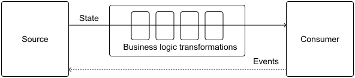

*Figure 1: Unidirectional Data Flow (UDF) in action*

#### Reactive programming

Throughout this book, we use reactive programming [12] to implement Unidirectional Data Flow. At its core, reactive programming creates a stream of data that flows from a source to consumers who "subscribe" to receive updates. This approach has gained widespread adoption in mobile development because it elegantly handles asynchronous data and helps create responsive apps.

Modern mobile platforms offer several powerful tools for reactive programming. On Android, we can use Kotlin Flows or RxJava, while iOS developers typically work with Combine or RxSwift. For simpler cases where we just need a one-off asynchronous operation, Kotlin's suspend functions and Swift's async-await provide lighter-weight alternatives.

While callbacks and event buses can work well for specific use cases, they might complicate state management. We recommend using reactive programming's stream-based approach instead, as it offers a more straightforward way to handle data flow in our apps. This makes the code easier to maintain and reason about over time.

As previously mentioned, every solution involves trade-offs. Event buses, for instance, can help reduce coupling between components in the codebase.

#### Immutable data structures

When building modern mobile apps, particularly those using unidirectional data flow, immutable data structures play a key role in managing state. By making data immutable (i.e., data can't be changed after creation), we reduce bugs and make our app's behavior more predictable. This is particularly valuable in mobile apps where multiple threads often need to access the same data simultaneously.

While we might occasionally need mutable data structures for performance-critical features, these cases are rare. When we do use mutable data, it's best to isolate it from the app's main state and carefully control how it can be modified. For example, we might use mutable structures in a specialized image processing module, but keep the rest of our app's data immutable.

#### Single source of truth (SSOT)

In modern mobile apps, each data type needs a clear owner: a Single Source of Truth (SSOT) [13]. The SSOT has **exclusive** authority to modify its data and follows the Unidirectional Data Flow pattern by:

- Receiving events that request data changes.

- Processing those changes according to business logic.

- Exposing the updated state as immutable data.

Let's look at how this works in practice. A local database often serves as the SSOT for offline data, while UI state holders own their screen's display state. Figure 2 illustrates these common SSOT patterns.

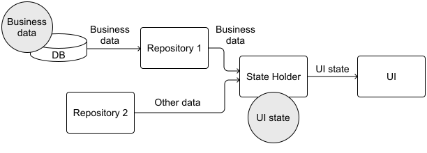

*Figure 2: Single source of truth patterns in practice.  The Database is the SSOT*

for business or application data, and the State Holder is the SSOT for UI state.

By designating clear owners for each data type, we create a more maintainable system where data flows predictably and state changes are more predictable and traceable. This makes bugs easier to isolate and fix, and helps maintain consistent state even in multi-threaded scenarios.

#### Dependency Injection

As the app grows in complexity, different components need to work together to accomplish business goals. These relationships between components create dependencies that need careful management. While both Dependency Injection [14] and Service Locator [15] patterns can handle this management, we focus on Dependency Injection in this book.

Why choose Dependency Injection? Think of it as letting components receive what they need rather than creating it themselves. Instead of a component reaching out to create its dependencies, they're provided from the outside. This makes the code more flexible and easier to test since we can swap out dependencies as needed.

For example, imagine a component that needs to make network calls. Rather than having the component create its own network client, we can pass in (or "inject") that client through the component's constructor. This approach, known as constructor injection, makes it clear what each component needs to function and allows us to provide different implementations for testing or handle future changes more gracefully.

We specifically avoid the Service Locator pattern because it can mask dependencies and complicate testing if not implemented carefully. By being explicit about dependencies through injection, we create code that's easier to understand, maintain, and verify.

When reading the architecture diagrams in this book, it's important to understand that arrows show how data moves through the system, not component dependencies. Take Figure 3, where we can see the UI state flowing from the state holder to the UI component. While the UI depends on the state holder to access and subscribe to this data, we don't explicitly show this dependency with dotted lines in our diagrams to keep them clean and focused on data flow.

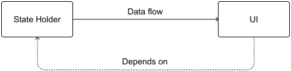

*Figure 3: Relationship between dependencies in this book's diagrams*

In the high-level architecture diagrams of this book, notice we represent Dependency Injection as a box between different architectural layers. This box acts as a boundary that helps keep components loosely coupled, as shown in Figure 4.

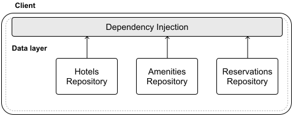

*Figure 4: Dependency Injection component in high-level architecture diagrams*

#### Decoupling components

Decoupling key components in our architecture lets them evolve independently, making the app more maintainable and easier to scale. This separation is particularly important in mobile apps not just for flexibility, but also for practical reasons such as improving testability and reducing build times when working with modules.

The main strategy for decoupling is to have components depend on interfaces or abstract classes instead of concrete implementations. This creates a "loose coupling" between components, where changes in one area don't ripple through the entire system.

This approach is especially valuable in several common scenarios:

- When classes interact across different architectural layers.

- When we want to avoid being tied to a specific third-party solution.

- When we need to swap between different implementations of the same functionality.

For example, in Figure 5, MapsRepository works with a MapsProvider interface rather than any specific implementation. This flexibility allows us to use MapsTestDouble during testing, while in production we can A/B test between MapsInHouseProvider and Maps3rdPartyProvider to see which better serves our users.

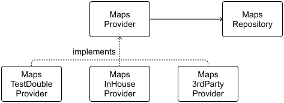

*Figure 5: Decoupling components from implementation details*

using a MapsProvider in a hypothetical app

#### Error propagation

Error propagation is a critical aspect of ensuring that applications are robust, reliable, and user-friendly. Proper handling and propagation of errors help in diagnosing issues, preventing application crashes, and improving the overall user experience.

The UI layer should show user-friendly error messages when things go wrong, handle simple validations such as checking form inputs, and display appropriate UI elements to indicate error states.

Other layers of the hierarchy should handle business logic errors such as invalid data, manage failures from data sources such as network or database issues, and pass relevant errors up to the UI layer when users need to know about them.

Modern mobile frameworks provide built-in tools for handling errors. For example:

- Kotlin coroutines use structured concurrency to propagate exceptions naturally.

- RxJava and RxSwift can handle errors in their data streams using operators such as onError.

When working with platforms that don't provide these tools, we can implement a Result type that wraps return values. This pattern lets us explicitly model success and failure cases, making error handling more predictable. However, when using modern frameworks (e.g., Kotlin coroutines), this extra layer isn't necessary since error handling is already built in.

#### Minimal data exposure

When data flows through the app's architecture, each component should only receive the minimum data it needs to function. This principle applies both to communication between architectural layers and when fetching from data sources such as local databases or backend APIs.

Let's look at a practical example from a chat app: When showing a conversation list screen, the UI only needs basic information like contact names, latest message previews, and timestamps. It shouldn't receive the full message history for every conversation just to display these preview cards.

This "less is more" approach offers several key benefits:

- **Better performance**
  
  
  - Reduces memory usage and CPU load since there's less data to process.
  
  - Minimizes network bandwidth consumption.
  
  - Improves battery life by reducing unnecessary data processing.

- **Easier maintenance**
  
  
  - Simpler systems that are easier to test and debug.
  
  - More straightforward scaling as the app grows.
  
  - Clearer data flows between components.

Data transformation usually happens at the boundaries between components. For example, when the network layer receives a response from the backend, it can map that data down to just what the repository needs, stripping out unnecessary fields. This ensures each layer only handles data relevant to its responsibilities.

### Architectural choices

Let's shift from the core architectural patterns we just covered to some specific implementation choices we use throughout this book. While those foundational patterns are essential for any scalable mobile architecture, the choices we'll discuss here are more flexible. You can adapt or replace them based on your experience and preferences.

This section focuses on the key details you need to understand the Architecture decisions made in this book, though I encourage you to deeply explore these topics to develop your own perspective for interviews. Let's examine these practical architectural decisions.

**🔍 Industry insights:**

Duolingo improved app responsiveness and developer productivity by adopting MVVM and using Android Jetpack libraries such as Dagger/Hilt for dependency injection [16].

Uber scaled its apps by enforcing module isolation through a plugin system and RIBs [17]. Each feature is developed as a plugin with well-defined integration points in the app that allows 200+ developers to build features in parallel without stepping on each other's code.

Notion's architecture emphasizes a flexible data model and unidirectional data flow, which brought power but also complexity to their mobile clients [18].

#### Google's guide to App Architecture

Let's explore our core architectural approach, which builds on Google's guide to app architecture [2]. While originally created for Android, its principles work remarkably well for iOS too, making it a solid foundation for both platforms.

**📌 Remember!**

If you have experience with a particular architecture that you've found effective for mobile apps, don't hesitate to discuss it in your interview. While this book uses Google's guide to app architecture as our reference point (since it embodies many core architectural principles), your personal experience with other approaches can be equally valuable.

At its heart, this architecture uses two primary layers: UI [19] and data [20]. Think of the UI layer as what users see and interact with, while the data layer handles all the behind-the-scenes business logic and storage. Some apps also benefit from an optional domain layer [21] that sits between UI and data, making it easier to share and reuse common interactions. Figure 6 illustrates how data flows through these layers.


*Figure 6: How data flows through the different layers recommended*

by Google's Guide to app architecture

#### UI layer

The UI layer can also be referred to as the presentation layer. According to the documentation [19]:

"*The role of the UI is to display the application data on the screen and also to serve as the primary point of user interaction. Whenever this application data changes, either due to user interaction (such as pressing a button) or external input (such as a network response), the UI should update to reflect the changes.*

*The UI layer is made up of two things:*

- *UI elements that render the data on the screen.*

- *State holders that hold data, expose it to the UI, and handle logic.*

*Effectively, the UI is a visual representation of the application state as retrieved from the data layer.*"

The UI layer relies on the data layer (or domain layer if present) as its source of data. The state holder acts as an intermediary, processing this data to create the UI state, essentially a blueprint of what should be shown on screen. As stated simply in the documentation: "*if the UI is what the user sees, the UI state is what the app says users should see.*"

Figure 7 illustrates how this works in practice. Each screen in the app is represented as a component with its own state holder. These state holders receive their data through dependency injection from other layers of the architecture.

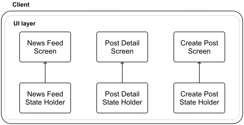

*Figure 7: UI layer in high-level architecture diagrams*

Building on the architectural patterns we discussed earlier, the flow of data follows a clear path: The data and domain layers expose streams of business data, which state holders transform into immutable UI states. The UI layer then subscribes to this state to display content and sends back events to request changes. These events flow through the state holder and ultimately update both the application state and UI.

We might wonder whether this architecture follows MVVM or MVI patterns. The answer is that it could be either: this architecture implements Unidirectional Data Flow, which can align with both patterns depending on how we structure the UI state streams and event handling. Rather than prescribe one approach, we believe either pattern can work well when properly implemented. While this distinction could come up during the deep dive portion of the interview, remember to keep the focus on the overall system design rather than getting too caught up in the specifics of any single component unless the interviewer asks about it.

#### Data layer

The data layer implements the repository pattern, providing a clean abstraction for all data access within the application. As stated in the documentation [20]:

*"The data layer contains application data and business logic. The business logic is what gives value to your app—it's made of rules that determine how your app creates, stores, and changes data. The data layer is made of repositories that each can contain zero to many data sources. You should create a repository class for each different type of data you handle in your app.*

*Repository classes are responsible for the following tasks:*

- *Exposing data to the rest of the app.*

- *Centralizing changes to the data.*

- *Resolving conflicts between multiple data sources.*

- *Abstracting sources of data from the rest of the app.*

- *Containing business logic.*

*Each data source class should have the responsibility of working with only one source of data, which can be a file, a network source, or a local database. Data source classes are the bridge between the application and the system for data operations."*

Figure 8 illustrates how the data layer typically works in a mobile app. At its core are two main data sources: the remote data source that communicates with the backend, and the local data source that handles data storage on the device. As we saw in chapters covering case studies, apps often use a database for this local storage to efficiently manage and persist data on the device.

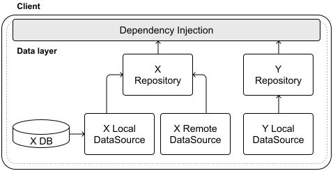

*Figure 8: Data layer in high-level architecture diagrams*

Since repositories serve as the main entry points to the data layer, it makes sense to define them as interfaces. This allows us to swap different implementations through dependency injection: we can use the real implementation when the app is running normally, and switch to test doubles during testing.

#### Navigation

For most MSD interviews, we take a simplified approach to navigation. Instead of diving into complex navigation patterns, we'll assume that a global Navigator, or Coordinator, handles screen transitions and dependency management.

This Navigator is responsible for:

- Moving between different screens in the app.

- Providing required dependencies to each screen, including static dependencies such as state holders and platform services, and dynamic data such as item IDs needed for detail screens.

The Navigator works with our dependency injection system to create and provide these dependencies correctly. When working through interview problems, we typically won't need to design complex navigation flows unless specifically asked. Most exercises focus on core functionality rather than navigation architecture. In our diagrams throughout this book, we represent navigation as shown in Figure 9.

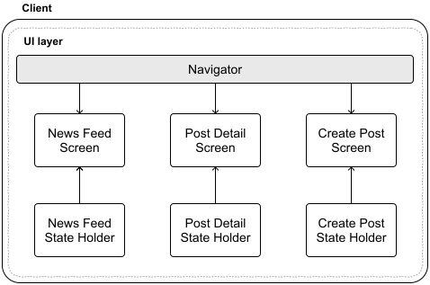

*Figure 9: Navigation represented in architecture diagrams*

In real-world applications, navigation becomes much more complex. As apps grow to include many screens, dialogs, and user flows, carefully managing navigation becomes critical. This complexity multiplies when adding deep linking support [22], which introduces additional entry points into our app that must be properly handled.

#### Modularization

Modularization is a powerful way to structure mobile apps into separate, independent building blocks. While modularization offers several benefits such as easier maintenance and better scalability, its biggest advantage is faster build times. However, modularization requires careful planning. Adding more modules can increase complexity and overhead if not managed thoughtfully.

When implemented well, modularization speeds up builds in three key ways:

- Uses build resources more efficiently.

- Reduces how much code needs recompiling.

- Allows for parallel compilation of different modules.

While we won't dive deep into modularization in later chapters, it's worth mentioning in interviews. The mobile industry increasingly follows the "contract module" pattern where each component has at least two modules: an API module and an implementation module. This separation means that when we change how something is implemented, modules that only depend on its API don't need to rebuild.

Let's look at a concrete example in Figure 10. Here we have several types of modules:

- **Feature modules** handle the UI for specific screens (e.g., "X feature module" in the diagram).

- **API modules** define the interfaces that features need (e.g., "X data layer api module" in the diagram).

- **Implementation modules** contain the actual code behind those interfaces (e.g., "X data layer impl module" in the diagram).

- **Test modules** provide test implementations (e.g., "X data layer test module" in the diagram).

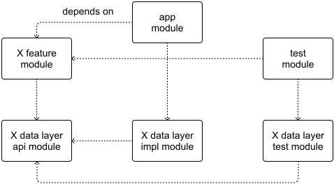

*Figure 10: Contract modules pattern in action*

When implementation details change, feature modules don't need to rebuild because they only depend on the stable API modules. But we might wonder, "how do features know which implementation to use"? This is where the app module comes in. It sits at the top level, connecting everything together by injecting the right implementations as dependencies. Similarly, when running tests, the test module provides test implementations instead of the real ones.

For a deeper dive into modularization, check out Google's guide to app modularization [23], which expands on the architectural principles we've discussed in this chapter.

**🔍 Industry insights:**

Airbnb restructured its large iOS app into nearly 1,500 modules to improve team productivity [24].

Robinhood modularized its Android app to combat a “giant monolith” module that was slowing builds and entangling features. They split the app into feature-specific modules which improved build times [25].

#### Testing

Testing should be a key part of the interview discussion, as it demonstrates how our architecture supports quality and maintainability. While testing often comes up naturally when discussing dependency injection or modularization, we should also be prepared to outline our overall testing strategy for the system we're designing.

Mobile apps typically implement several types of automated tests, though terminology can vary across teams and organizations. When discussing testing approaches in the interview, be clear about how you define each type of test to ensure shared understanding. Here are the main categories you'll likely want to cover:

- **Unit tests**. The foundation of the testing pyramid, unit tests verify individual components in isolation. By replacing dependencies with test doubles, we can validate specific behaviors and code paths. These tests are fast, reliable, and help catch issues early.

- **Component, Integration, and/or Navigation tests**. These tests validate how multiple components work together by using some real implementations instead of test doubles. While they provide more comprehensive coverage than unit tests, they tend to run slower and may require more maintenance. They're particularly valuable for validating critical user flows and navigation paths.

- **Screenshot tests**. These tests fill an important gap in UI testing that unit tests can't easily cover: visual elements such as layouts, fonts, and styling. They work by capturing a reference image of a UI component and comparing it against future changes to catch unintended visual regressions. While simple in concept, they're powerful for maintaining visual consistency.

- **End-to-end tests**. Sitting at the top of the testing pyramid, end-to-end tests verify that the app works correctly with real backend services and dependencies. While these tests provide the most comprehensive validation, they're also the most expensive to maintain and the most likely to be flaky due to network conditions or backend state. We should have fewer of these tests, focusing on the most critical user journeys.

Beyond these categories, there are specialized tests that can be applied across different layers of the testing pyramid. These include **accessibility tests** to verify app usability for all users, **performance tests** to catch slowdowns and bottlenecks, **memory management** tests to identify leaks, and **security tests** to validate data protection measures. While these tests focus on specific quality aspects rather than functionality, they're crucial for delivering a robust and inclusive mobile app.

Testing in mobile development is well-documented, with many established patterns and best practices. Here are some key resources that can help guide the testing strategy:

- Google's fundamentals of testing apps [26].

- The robot pattern [27].

- Faking interactions with the backend using OHHTTPStubs [28] for iOS and MockWebServer [29] for Android.

**🔍 Industry insights:**

Slack's Android team made UI tests a first-class part of development by focusing on “targeted and hermetic” UI tests. Read more in their testing series [30].

Bitrise shared their recommended mobile testing strategy [31], and you can read how Netflix [32] and Dropbox [33] test their mobile apps.

## Data Storage

Mobile apps need effective data storage to create great user experiences. Whether it's remembering user preferences, caching network responses, or storing offline content, how we manage data directly impacts app performance and reliability. Let's explore the different storage options available and understand when to use each one.

Before diving into storage solutions, let's look at the main types of data the app might need to handle:

- **User data** such as profile information, app settings, and user preferences that customize the experience. This includes everything from theme choices to notification settings.

- **User files** such as photos, videos, and documents that users create or upload in the app. These files remain on the device unless synced to servers, and the app loses access if users delete them.

- **Business data** or core application data the app shows to users such as news articles, product listings, or chat messages. If users remove this data from their device, the app can typically retrieve it again from the backend.

- **Sensitive information** such as authentication tokens, encryption keys, and other security-critical data that requires special protection. This data often needs secure storage mechanisms to prevent unauthorized access.

- **Cache data**, that is, temporary data stored to improve app performance, such as downloaded images or pre-computed results. This data can live in memory or on disk depending on size and how long it needs to persist.

- **Temporary data** such as upload file chunks, form drafts, or undo history. This data can be safely discarded when no longer needed or when the app closes.

While some data needs persistent storage on disk, other data can live briefly in memory and be released when the system needs resources. The key is choosing the right storage approach based on the data's lifetime and access patterns.

### Data storage options

When our app needs to persist data to disk, choosing the right storage mechanism is crucial. The best choice depends on what type of data we're storing and how we plan to use it. Let's explore the available options.

#### Key-value storage

Key-value storage provides a simple way to store basic data types such as strings, integers, and booleans. Think of it as a dictionary where each piece of data (the value) is accessed through a unique identifier (the key). This storage type works well for straightforward data such as user preferences, app settings, and feature toggles.

The beauty of key-value storage lies in its simplicity. The APIs are easy to implement and use, requiring minimal setup. When working with small datasets, read and write operations are fast and efficient.

However, key-value storage isn't suitable for every scenario. It struggles with large amounts of data or complex data structures, relationships between data items, advanced querying needs, data integrity enforcement, and transactional operations. Additionally, key-value stores typically offer less security than specialized secure storage solutions unless we implement extra protection measures.

**🛠️ Platform implementation details**

Both Android and iOS provide native key-value storage solutions:

- Android offers SharedPreferences [34] and DataStore [35].

- iOS offers UserDefaults [36] and Property Lists (Plists) [37].

#### On-device secure storage

When handling sensitive data such as user credentials, payment details, or cryptographic keys, secure on-device storage becomes essential. This specialized storage leverages hardware security features built into mobile devices to protect sensitive information from unauthorized access.

The key benefit of secure storage is its robust encrypted data protection. This helps apps meet strict data protection requirements while providing strong security guarantees. Modern platforms such as Android's Keystore system [38] and iOS's Keychain [39] services make implementing secure storage straightforward.

However, secure storage does come with some trade-offs:

- Implementation is more complex than basic storage options.

- Testing and debugging can be more challenging.

- Encryption and decryption operations add performance overhead.

- Resource usage may impact low-end devices.

- Storage capacity is often limited, making it unsuitable for large datasets.

On iOS, the Keychain provides an additional benefit, integration with iCloud Keychain lets us securely sync credentials across a user's devices using end-to-end encryption.

#### Relational Databases

When the app needs to handle complex data efficiently, relational databases provide a robust storage solution. They excel at managing large datasets, handling complex queries, and maintaining relationships between different types of data. This makes them ideal for storing both business data and cached content that needs to persist on disk.

Key advantages of relational databases include:

- Optimized data retrieval and manipulation that scales well with large datasets.

- Powerful indexing capabilities to speed up search operations.

- Built-in management of relationships between data entities.

- Strong data integrity guarantees.

- Support for schema migrations as the data model evolves.

However, relational databases also come with some trade-offs to consider:

- More complex setup and maintenance compared to simpler storage options.

- Schema design requires careful planning.

- Higher resource consumption that can impact app performance.

- Potential latency overhead, especially for complex queries.

**🛠️ Platform implementation details**

For mobile development, SQLite serves as the foundation, with both Android and iOS providing native support. Google officially supports the Room persistence library [40] for Android, while Apple offers Core Data for iOS [41].

#### Non-relational Databases

While relational databases are commonly used in mobile development due to their native platform support, non-relational databases can be a compelling alternative depending on the data needs.

For mobile apps, Realm [42] stands out as a popular non-relational option. Its focus on simplicity and speed, combined with built-in support for reactive programming and real-time sync, makes it particularly well-suited for mobile use cases. Firebase Realtime Database [43] offers another approach, providing a cloud-based NoSQL solution with offline support that automatically syncs data when connectivity returns.

The key advantage of non-relational databases is their flexibility: they don't require predefined schemas, making them ideal for storing unstructured or semi-structured data. They also excel at high-performance read and write operations.

However, this flexibility comes with trade-offs. Non-relational databases work best when the app needs simple CRUD operations rather than complex queries. They typically lack the ACID transactions and referential integrity guarantees that relational databases provide through features such as foreign keys and constraints. This can lead to potential data consistency challenges that we'll need to handle in the application logic.

#### Files and Directories

Sometimes the data needs don't fit neatly into databases or key-value stores. In these cases, storing data directly in files can be a good alternative. This approach works particularly well for binary data or scenarios like note-taking apps where each note is saved as a separate text file.

The main advantage of file storage is its flexibility, we're not constrained by database schemas and can create our own custom file formats. Implementation is straightforward since we're just working with basic file I/O operations. Files are also portable across different platforms and can be included in backup systems.

The trade-off is that we lose the structure and features that databases provide. We'll need to handle everything manually: ensuring data integrity, building query capabilities, managing concurrent access, and planning for scalability.

Both iOS and Android provide native APIs for file operations. On iOS, we'll work with FileManager [44], while Android offers its File APIs [45]. These let the app read and write directly to internal or external storage, which is especially useful when dealing with large files or complex data structures that don't map well to database tables.

#### Storage options comparison table

Table 1 provides a comprehensive comparison of the major storage options available for mobile apps. Use this as a reference when evaluating which storage mechanism best addresses the specific requirements during an interview.

| Storage Mechanism | Advantages | Disadvantages | Use Cases | Examples |
| --- | --- | --- | --- | --- |
| **Key-value storage** | Simple to implement and use, fast read and write operations for small data sets. | Not suitable for large amounts of data or complex data structures, lacks advanced querying, less secure. | Storing non-sensitive user data such as preferences, settings, app configuration. | Android: SharedPreferences, DataStore. iOS: UserDefaults, Property Lists (Plists). |
| **On-device secure storage** | Secure storage for sensitive data, encrypted at rest and in transit, complies with data protection standards. | More complex to implement, performance overhead from encryption / decryption, limited storage capacity. | Storing sensitive information such as user credentials, payment information, cryptographic keys. | Android: Keystore. iOS: Keychain, iCloud Keychain. |
| **Relational Databases** | Efficient management of large datasets, supports complex queries, ensures data integrity. | More complex setup and maintenance, resource intensive, potential latency. | Handling large datasets, maintaining relationships between data entities, performing complex queries. | Android: SQLite, Room library. iOS: SQLite, Core Data. |
| **Non- relational Databases** | Flexible schema-less data models, high performance for read/write operations. | Limited support for complex queries, potential inconsistency issues. | Handling unstructured or semi-structured data. | Android and iOS: Realm, Firebase Realtime Database, Couchbase Lite. |
| **Files and Directories** | Flexible storage formats, simple implementation, easy data sharing between platforms. | Lack of structure, requires manual management of data integrity, concurrency, and scalability. | Handling binary data, use cases like note-taking apps where data is stored as individual files. | Android: File APIs. iOS: FileManager. |

Table 1: Storage options comparison

#### Storage selection decision tree

While the comparison table offers a detailed view of each storage option, a decision tree provides a structured approach to selecting the most appropriate storage solution based on the specific requirements.

During an interview, walking through this decision tree demonstrates a methodical approach to storage selection. Rather than simply naming a storage option, you can explain your reasoning at each decision point, showing how we've considered security needs, data complexity, relationship requirements, and access patterns.

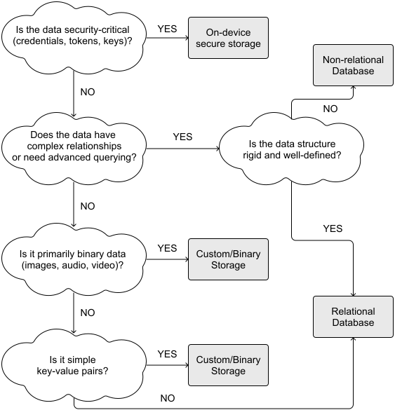

*Figure 11: Storage options decision tree*

**📌 Remember!**

The comparison table and decision tree offer a simplified framework to guide storage decisions during interviews, but real applications often require more nuanced approaches.

Often, mobile apps require multiple storage solutions working together. For example, a social media app might use:

- Secure storage for authentication tokens.

- A relational database for structured content such as user profiles and posts.

- Key-value storage for app settings and preferences.

- File storage for cached images and media.

**🔍 Industry insights:**

Netflix chose the Realm mobile database for storing video metadata on devices to support offline downloads [46].

Trello redesigned its mobile data layer to work offline by making the local database the single source of truth [47].

### How mobile apps save and share data

While mobile apps have various storage options available, they all ultimately save data as files on the device's disk. What differs between these options is how they organize, manage, and provide access to this data through their respective APIs.

By default, mobile operating systems use a sandboxed storage model: each app gets its own private storage space that other apps cannot access. This internal storage provides a basic level of security and data isolation.

However, this protection has limitations. Users who jailbreak their iOS devices or root their Android devices can bypass these security measures and potentially access or modify any app's internal storage. For sensitive data that requires additional protection, secure storage solutions backed by hardware-level security features offer stronger safeguards against unauthorized access, even on compromised devices.

#### Accessing device-wide storage

Mobile platforms provide mechanisms for apps to interact with storage areas that exist outside their private sandbox. This enables important functionality such as saving photos to the device gallery or accessing documents from other apps.

On Android, shared storage areas allow multiple apps to access common files. This includes both the device's built-in storage (sometimes called "external storage" even though it's physically inside the device) and removable storage (such as SD cards). Apps commonly use these areas to store files meant to be shared, such as photos, videos, and documents.

iOS takes a different approach with more controlled access points. Instead of a general shared storage area, iOS offers specific directories for different purposes:

- The Documents Directory stores files that users should be able to access and that get backed up to iCloud.

- The Library directory holds data that apps need to share but shouldn't be directly visible to users.

Users can access shared files through iOS's Files app, and other apps can request access to them when needed. We can find a complete list of these directories in the FileManager documentation [48].

#### Working with media and files from other apps

Some mobile apps need to access content created by other apps, whether that's photos from

the camera app or documents downloaded from a web browser.

Both platforms provide system APIs specifically designed for this purpose:

- On iOS, the PHAsset and PHImageManager APIs let apps load photos and videos from the user's media library [49], while UIDocumentPickerViewController enables users to browse and select files from anywhere on their device [50].

- On Android, the MediaStore API provides access to media files such as photos and videos, while the Storage Access Framework creates a standardized way for users to browse and open documents from any compatible file provider. For the latest Android storage APIs, check out the data and file storage overview guide [51].

These APIs handle the necessary permissions and security checks, ensuring that users remain in control of which apps can access their personal content. When an app requests access to these files, the system will show a permission dialog, allowing the user to approve or deny the request.

#### Sharing data between your own apps

Developers creating multiple apps often need a way for those apps to share data with each other. Both Android and iOS provide secure mechanisms for this purpose.

Android uses Content Providers [52] for this scenario. By configuring specific permissions and signing requirements [53], developers can ensure that only their own apps can access specific shared data. This works by restricting access to apps signed with the same developer certificate.

iOS implements App Groups [54] for this purpose. When apps are part of the same development team, App Groups create shared containers that all member apps can access. This enables sharing various types of data, including UserDefaults settings [55] and files, between related applications.

Both approaches provide fine-grained control over data sharing while maintaining security boundaries that prevent unauthorized access from other developers' applications.

## Networking and API design

Whether fetching data from servers or syncing information across devices, how we handle networking can make or break the user experience. Let's explore HTTP, the foundational protocol for client-server communication that we use multiple times throughout this book.

### HTTP and REST APIs

When building mobile apps that communicate with backends, HTTP (Hypertext Transfer Protocol) is often the go-to choice. Its widespread adoption and robust feature set make it particularly well-suited for client-initiated requests.

HTTP offers several key advantages:

- Universal compatibility across platforms, devices, and networks.

- Stateless design that improves scalability since servers don't need to track session information between requests.

- Support for persistent connections in modern versions (HTTP/1.1 and HTTP/2), allowing multiple exchanges over a single connection.

- Flexibility to handle various data formats beyond just JSON, including HTML, XML, and binary data.

- Built-in header system for exchanging metadata between clients and servers.

- Strong security through HTTPS encryption, ensuring data remains private and authentic.

When the mobile app communicates with a server, each HTTP request has several key components:

- The HTTP verb (e.g., GET or POST) that specifies what action to take.

- A resource path that identifies what data we want to access or modify.

- Headers containing metadata about the request, such as authentication tokens or expected response formats.

- Optional request data, either in the body for operations such as creating new content, or as query parameters in the URL.

Let's look at a typical HTTP request:

```
Accept: application/json
Authorization: Bearer \<token\>
GET https://my-backend-name.com/v1/news?after=timestamp\&limit=30

```

Breaking this down:

- It's a secure HTTPS request to fetch news data.

- The Authorization header contains the user's authentication token.

- The Accept header tells the server to return JSON.

- Query parameters after and limit help filter the results, asking for 30 posts after a specific timestamp.

Query parameters are especially useful with GET requests since they can't include data in their body. By adding these parameters to the URL, we can specify exactly what data we want while keeping the request safe and idempotent, meaning it won't modify any data on the server, no matter how many times it's called.

While HTTP/1.1 defines these basic methods [56] and their intended uses, most modern APIs build additional conventions on top of HTTP. This is where REST comes in, providing a standardized approach to designing backend services.

#### Designing REST APIs

When building backend services that need to scale, consistency is key, especially in how we define and structure our HTTP endpoints. REST (Representational State Transfer) has emerged as a popular architectural approach that provides standard conventions for making HTTP requests and handling responses. Its widespread adoption means we'll find excellent documentation and support across the development community [57].

There are many different styles of designing REST interfaces, so let's walk through the core REST practices we'll use throughout this book:

- The main HTTP verbs map naturally to CRUD operations [58]:
  
  
  - GET to retrieve data.
  
  - POST to create new resources.
  
  - PUT to update existing ones.
  
  - DELETE to remove resources.

- Each resource in our API should ideally have a unique URI that clearly identifies it. For example:
  
  
  - `GET /users` retrieves all users.
  
  - `GET /users/1` gets details for the user with ID 1.

- Use query parameters thoughtfully. They help filter, sort, and paginate results. For example:
  
  
  - `GET /users?role=admin\&sort=lastname_asc\&page=2\&limit=30`

- Choose clear resource names.
  
  
  - Use nouns to represent resources
    
    
    - e.g., `GET /posts` instead of `GET /query-posts`.
  
  - Use plural forms consistently
    
    
    - e.g., `GET /posts/{postId}` instead of `GET /post/{postId}`.

- Structure nested resources. For related resources, use sub-resource paths:
  
  
  - Good: `GET /v1/posts/{postId}/attachments/{attachmentId}`
  
  - Avoid: `GET /v1/posts/{postId}?attachment=attachmentId`

- Version the API consistently. Use global versioning to keep our API structure clean:
  
  
  - Good: `GET /v1/posts/{postId}/attachments`
  
  - Avoid: `GET /posts/{postId}/v1/attachments`

REST also defines standard HTTP response codes that help clients understand the result of their requests. Here are the most common ones we'll encounter:

- `200 OK`:
  
  
  - The request succeeded.
  
  - Typically returned for successful GET and PUT operations.

- `201 Created`:
  
  
  - A new resource was successfully created.
  
  - Common response for POST requests that create items.

- `400 Bad request`:
  
  
  - Client side error. The server couldn't process the request due to invalid syntax or missing data.

- `403 Forbidden`:
  
  
  - Authentication succeeded but the client lacks permission for this resource.

- `404 Not found`:
  
  
  - The requested resource doesn't exist on the server.

- `500 Internal Server Error`:
  
  
  - Server side error. Something went wrong on the server while processing the request.

By following these standardized REST conventions, we create APIs that are intuitive, predictable, and scale well as the app grows.

#### Data encoding format

When transferring data over HTTP, we have flexibility in how that data is formatted. HTTP itself doesn't care about the data format, it just needs the client and server to agree on what format they're using. They establish this agreement through HTTP headers such as Content-Type and Accept.

We can choose from several common formats such as JSON (application/json), XML (application/xml or text/xml), Protocol Buffers (application/x-protobuf), and CSV (text/csv). The best choice depends on our specific needs around readability, efficiency, platform support, and how easy it is to work within the codebase.

JSON (JavaScript Object Notation) has emerged as the most popular choice for modern REST APIs, and for good reason. It's human-readable, works efficiently, and integrates smoothly with most programming languages since it closely matches how they structure data. The fact that JSON is so widely supported means we can parse it easily using standard library functions, without needing extra dependencies. Table 2 compares the different formats we could use and their use cases.

| **Format** | **Advantages** | **Disadvantages** | **Use cases** |
| --- | --- | --- | --- |
| JSON | Human-readable, easy to use and parse, widely supported across platforms and languages, compact in size compared to XML. | Less efficient in terms of size and parsing speed compared to binary formats such as Protocol Buffers, no built-in schema enforcement. | Lightweight data exchange. Common for Web APIs and Mobile apps. |
| XML | Human-readable, supports complex data structures and metadata through attributes. It's widely supported and supports a robust schema validation with XSD. | Verbose, larger file size, slower parsing compared to JSON and Protocol Buffers, more complex to write and maintain. | Data interchange in enterprise applications, document-centric data, cases requiring extensive metadata. |
| Protocol Buffers | Compact and efficient binary format, faster serialization and deserialization, strict schema enforcement, backward and forward compatibility. | Less human-readable, requires defining .proto files and using code generation tools, more complex to set up. | Performance-critical applications, large-scale data transmission, systems requiring strict schema enforcement and versioning. |

Table 2: Trade-offs for encoding data over the network

**🔍 Industry insights:**

Lyft evolved its mobile networking from ad-hoc REST+JSON to a unified IDL (Interface Definition Language) using Protocol Buffers. Lyft's system can handle both gRPC calls (for new, streaming or binary-optimized APIs) and traditional HTTPS+JSON (for backward compatibility) [59].

Reddit migrated from a monolithic backend API to GraphQL to better serve mobile clients [60], and Airbnb too [61].

Snapchat has integrated the QUIC (Quick UDP Internet Connections) protocol to enhance its networking performance, particularly in mobile environments [62].

### Authentication

For mobile apps managing sensitive or personalized data, robust authentication is critical. We must ensure that users are verified as legitimate before accessing protected resources.

#### Token-based authentication

Token-based authentication is widely adopted in mobile apps due to its efficiency and flexibility. Unlike traditional session-based methods, it offers:

- Stateless operations: No server-side session storage, enhancing scalability.

- Cross-platform compatibility: Seamless use across diverse devices.

- Granular access control: Tokens embed permissions and expiration details.

- Reduced backend overhead: Validation occurs without frequent database queries.

The most common implementation uses **JSON Web Tokens (JWT)** [63], which are compact, self-contained tokens that securely transmit information between parties as a JSON object.

#### Authentication flow

- **Initial login**: Clients submit user credentials (e.g., username/password) to the backend Authentication service, which validates them against registered user data.

- **Token generation**: Upon successful verification, the backend issues two tokens:
  
  
  - An **access token** (JWT): Short-lived (e.g., 15-30 minutes), containing user identity and permissions.
  
  - A **refresh token**: Longer-lived, used to obtain new access tokens without requiring the user to log in again.

- **Secure token storage**: The app securely stores both tokens using platform-specific secure storage mechanisms.
  
  
  - Android provides the Android Keystore system [64] to create and store cryptographic keys that never leave the device's secure hardware. Apps can encrypt tokens before storing them in SharedPreferences or DataStore.
  
  - iOS offers the Keychain Services API [65] with multiple protection classes to secure tokens, ensuring they're encrypted at rest and only accessible when the device is unlocked.

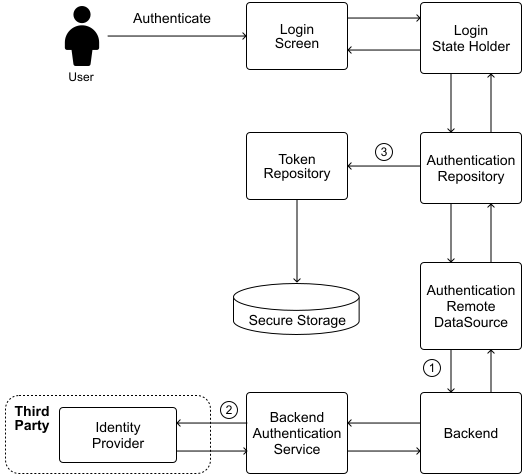

*Figure 12: User authentication data flow*

**📝 Note:**

To simplify the backend and minimize the complexity of key management, companies can leverage an external Identity Provider for token issuance and validation, as illustrated in Figure 12. This provider offers a JWKS (JSON Web Key Set) endpoint, enabling systems to retrieve public keys for validating JWTs securely without exposing private signing keys.

#### Authenticated requests and token renewal

Once authentication is complete, the app uses the tokens for secure API access.

To **make authenticated requests**, the app includes the access token in the Authorization header of each API request: Authorization: Bearer <access_token>. API gateways then use these public keys to authenticate incoming JWTs, ensuring requests are verified before being forwarded to backend services.

**When the access token expires**, the app uses the refresh token to request a new one:

- The app detects an expired access token (either proactively by checking its expiration or reactively when receiving a 401 Unauthorized response).

- It sends the refresh token to a token renewal endpoint.

- If the refresh token is valid, the server issues a new access token (and sometimes a new refresh token too).

- The app saves these new tokens and retries the original request using the new access token. If the refresh token is invalid, the backend returns an error and the user should be logged out from the app.

#### Enhanced security options

To further strengthen authentication, consider implementing:

- **Multi-factor authentication (MFA)**: Require additional verification beyond passwords, such as SMS codes, authenticator apps, or biometrics.

- **Biometric authentication**: Leverage fingerprint or facial recognition for a more user-friendly yet secure experience.

- **Certificate pinning**: Ensure that authentication requests are sent only to legitimate servers, preventing man-in-the-middle attacks.

- **Trusted device registry**: The backend maintains a list of known devices for each user.

- **Device fingerprinting**: We collect non-sensitive device attributes to create a unique signature.

- **New device alerts**: Users receive notifications when their account is accessed from a new device.

- **Suspicious activity detection**: The system flags unusual patterns, such as logging in from a new location or device in close succession.

By implementing robust token-based authentication, mobile apps can ensure that only authorized users access protected resources while maintaining a smooth, secure user experience.

**🔍 Industry insights:**

Uber recently rolled out passkey support in its mobile apps, embracing a passwordless login experience [66].

Many apps, such as Robinhood, mark devices as "trusted" when they have successfully completed Multi-Factor Authentication. After that, subsequent logins from the same device may be streamlined so that users can log in without providing the second authentication factor. This balances security with convenience by not asking for 2FA at every single login on the same phone [67].

### Content Delivery Network (CDN)

A Content Delivery Network (CDN) distributes servers across different geographical locations to efficiently deliver static content to users. Think of it as a global network of content storage points, each serving users in its nearby area.

In mobile apps, CDNs excel at delivering content that stays relatively stable and often requires significant bandwidth, such as app icons and images, video content, HTML pages, and app assets and resources.

Why use a CDN? By storing frequently accessed content closer to users, CDNs significantly reduce the load on our main backend servers. Instead of every request going to the backend, users receive content from the nearest CDN server. This approach offers several key benefits:

- Faster load times since content comes from nearby servers.

- Reduced latency as there's less distance for data to travel.

- Better user experience through quicker content delivery.

- Lower backend costs by offloading heavy content delivery.

When should you consider adding a CDN? Let's examine the trade-offs in Table 3.

| CDN Advantages | CDN Disadvantages |
| --- | --- |
| Better performance: Reduced latency and faster load times due to content being stored closer to users. Efficient traffic management: Handles large volumes and sudden spikes, preventing bottlenecks. Reliability and scalability: Offers redundancy and easy scaling. Reduced origin server load: Caches static content such as images, videos, and HTML pages. | Cost: Can become expensive as usage increases. Added complexity: Requires configuration, cache management, and client integration. External dependency: Your app's performance partly relies on the CDN provider's uptime and performance. Content freshness challenges: Ensuring up-to-date content requires careful cache management. |

Table 3: CDN advantages and disadvantages

Despite the disadvantages, CDNs are a great solution for apps that have a worldwide user base. Figure 13 illustrates how a CDN fits into our overall system architecture.

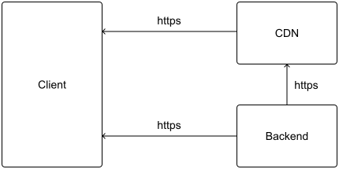

*Figure 13: CDN in a typical architecture diagram*

### Pagination

Pagination is a fundamental pattern we encounter frequently in MSD interviews. Any time we're working with lists of data, pagination should be one of your first considerations. Whether it's a social media feed showing posts or a messaging system handling attachments, breaking large datasets into manageable chunks is crucial for scalability.

Whenever we encounter a list in your system, we need to ask ourselves two questions:

- Is there a natural limit to how many items should be displayed at once?

- Would sending the entire dataset in a single response strain network or device resources?

If sending the full dataset would be resource-intensive, pagination is likely the right solution. By loading data in smaller batches, you improve both performance and scalability while reducing memory usage on mobile devices.

When implementing pagination, we'll typically choose between two main approaches: offset pagination and cursor-based pagination. Let's explore how each approach works and when to use them.

#### Offset pagination

Let's explore offset pagination, where we request data by specifying which page we want and how many items should be on each page.

Let's consider this example request: GET /v1/feed?page=3&limit=30.

Here, we're asking for the third page of results, with 30 items per page. The backend would skip the first 60 items (2 pages × 30 items) and return the next 30 items.

When using offset pagination, the backend typically includes metadata about the overall dataset. This helps clients understand where they are in the full list of results. Here's what a response might look like:

```json
{
  "feed": { … },
  "paging": {
    "page": 3,
    "total_pages": 12,
    "total_items": 1000
  }
}

```

Offset pagination shines when working with stable, fixed-size datasets. It's straightforward to implement since it maps naturally to database queries, and it lets users jump directly to any page they want. However, it has some important limitations.

As your dataset grows larger, performance starts to suffer. The database needs to count and skip over more rows each time, which gets increasingly expensive. It's also problematic for frequently updated data, by the time a user reaches page 3, the content from pages 1 and 2 might have changed completely.

You could try to handle these issues on the client side by detecting and removing duplicates, but this creates new problems: extra processing overhead, wasted bandwidth, and the need for additional requests to fill in gaps.

This approach works well for applications with:

- Moderate-sized, stable datasets.

- Simple navigation needs.

- Predictable content, such as educational materials or e-commerce catalogs.

#### Cursor-based pagination

We can think of cursor-based pagination like using a bookmark in a long book. Instead of jumping to a specific page number, you use the bookmark (cursor) to track where we left off and continue reading from there.

Here's how it works in practice. When requesting data, the client includes a cursor that points to their current position: GET /v1/feed?after=<cursor>&limit=30.

For the very first request, there's no cursor yet, so that field stays empty. The backend's response includes not just the data, but also cursors for moving forward and backward through the dataset:

```json
{
  "feed": { … }
  "paging": {
    "size": 20,
    "next_cursor": "bmV4dF9jdXJzb3IK",
    "prev_cursor": "Y3Vyc29yIF8gcHJldg=="
  }
}

```

To load the next set of items, the client simply uses the next_cursor value:

GET /v1/feed?after=bmV4dF9jdXJzb3IK&limit=30.

A key advantage of cursor-based pagination is its flexibility with page sizes. Unlike offset pagination, we can request different amounts of data with each call. The cursor itself typically maps to a unique identifier in the data, such as a primary key or timestamp. While sequential IDs are common, what matters most is having a consistent way to order the records.

For example, in a news feed system, we might use the postId as the cursor. These cursors are often encoded (commonly with Base64) before sending them over the network. This encoding helps standardize the format and prevents potential issues with special characters in URLs.

This approach works particularly well for frequently changing datasets such as social media feeds, event logs, and systems with continuous updates. Companies such as Meta [68] and Slack [69] use this pattern in their APIs. The main limitation compared to offset pagination is that users can't jump directly to a specific page, they need to navigate through the data sequentially.

#### Choosing the right limit number

The limit parameter controls how many items we fetch in each request, and its optimal value depends on the content we're dealing with. For lightweight content, we can use higher limits, while heavier content requires lower limits to maintain good performance.

**The ideal limit value varies based on your app and content type, so it's worth experimenting to find the right balance for your specific use case**. However, we can broadly evaluate different limit options:

- 10 to 20 items
  
  
  - Ensures quick response times and minimal data transfer per request. Suitable for highly dynamic feeds with frequent updates.
  
  - May require more frequent requests, potentially leading to more loading indicators and a less smooth experience.

- 30 to 50 items
  
  
  - Provides a good balance between data transfer and the need for frequent requests. Users can scroll through posts for a longer period before needing more data.
  
  - Slightly larger data payload per request but usually manageable for most modern mobile networks.

- 50+ items
  
  
  - Reduces the frequency of data fetches, offering a smoother scrolling experience. Suitable for less dynamic feeds where content does not update as frequently.
  
  - Larger data payloads can be slower to load on slower networks or older devices. This could be a concern depending on the scale of the app.

Instead of using a fixed limit number, we could further enhance the solution by implementing **adaptive pagination**, which dynamically adjusts the limit based on factors like network conditions or user behavior:

- For users who scroll quickly, we might increase the limit for a smoother experience.

- For users who spend more time on the content, we could lower the limit to reduce unnecessary data transfer.

**📌 Remember:** Selecting the right limit value in pagination is important as it directly affects both system performance and user experience. The optimal value typically depends on content weight. Generally, a limit between 20 and 50 items strikes a good balance between user experience and efficient data loading.

#### Pagination comparison table

Table 4 compares key pagination approaches used in mobile apps. Use this reference to quickly evaluate which strategy aligns with your specific requirements and constraints.

| Pagination Method | Advantages | Disadvantages | Use Cases |
| --- | --- | --- | --- |
| **Offset pagination** | Simple to implement, easy to navigate specific pages, maps well to database queries. | Performance degrades with large datasets, can be inaccurate with frequent updates, and may cause duplicates. | Apps with moderately sized datasets requiring straightforward navigation such as educational apps, e-commerce platforms, forums. |
|  | Example: GET /v1/feed?page=3&limit=30 |  |  |
| **Cursor- based pagination** | Efficient for large-scale datasets, handles frequent updates well, flexible limit per request, stateless backend. | Cannot jump to a specific page without traversing previous pages, may require encoding for security. | Real-time and large-scale applications with high-frequency updates such as social media feeds, event logs. |
|  | Example: GET /v1/feed?after=bmV4dF9jdXJzb3IK&limit=30 |  |  |

Table 4: Pagination options comparison

#### Pagination selection decision tree

When determining which pagination approach to implement, several factors come into play. The decision tree in Figure 14 offers a structured path through these considerations, guiding us to an appropriate pagination strategy based on the app's specific needs and data characteristics.

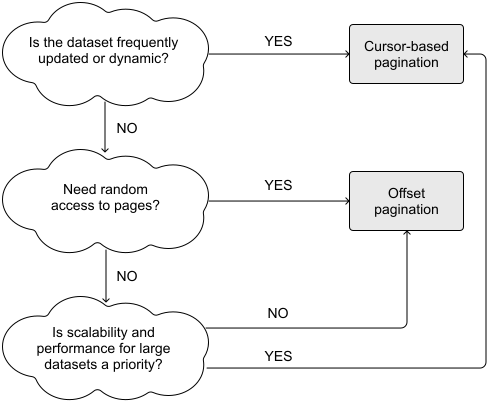

*Figure 14: Pagination options decision tree*

**⚠️ Disclaimer!**

While this decision tree and comparison table provide structured guidance for selecting storage options, they intentionally simplify complex considerations.

Real-world implementations often involve additional factors such as backend architecture constraints, existing API patterns, and specific performance characteristics of your data. Use these tools to frame your interview discussion, but be prepared to acknowledge the nuances that might influence your final decision.

**🔍 Industry insights:**

Slack transitioned from offset-based to cursor-based pagination to efficiently handle large datasets and ensure consistent data retrieval [70].

Discord uses virtualization for infinite lists to handle pagination smoothly. The result was a 14% drop in memory usage on startup for heavy users and faster load times [71].

Shopify moved to relative cursor pagination using a last-seen item ID to fetch the next page [72].

## Performance

Performance optimization forms a critical pillar of mobile app quality that directly impacts user satisfaction, retention, and commercial success. As apps grow in complexity and user expectations rise, maintaining responsive experiences becomes increasingly challenging, yet more essential than ever.

**🎯 When to bring it up**

Performance considerations show our technical depth in creating responsive, efficient applications. We can mention this when discussing data-intensive features, animations, background processing, or systems that need to work on lower-end devices. This topic is universally relevant but becomes critical when designing apps that handle large datasets, complex real-time requirements, or need to operate in challenging network environments.

Poor performance can seriously impact user retention, Google even downranks underperforming apps in the Play Store [73]. Users commonly uninstall apps that suffer from crashes, excessive data usage, battery drain, and UI jank [74].

### Holistic performance approach

Effective performance optimization requires a systematic approach that spans the entire app architecture:

- **UI responsiveness** ensures the app feels immediate and fluid. The primary thread should remain free for user interactions by offloading heavy operations to background threads.

- **Network efficiency** minimizes both latency and data consumption.

- **Memory management** prevents crashes and background crashes while enabling smooth multitasking experiences.

- **Battery optimization** extends effective usage time by minimizing power-intensive operations. Location services, continuous network activity, and wake locks are particularly costly for battery life.

### Measurement-driven optimization

Performance optimization must be grounded in empirical data rather than assumptions or theoretical bottlenecks:

- **Baseline metrics** through comprehensive performance testing provides objective data against which to measure improvements.

- **Continuous monitoring** via production analytics reveals how your application performs in real-world conditions across diverse devices, networks, and usage patterns.

- **Targeted instrumentation** helps identify specific bottlenecks in critical paths.

- **Incremental validation** after each optimization confirms actual improvements and helps avoid regressions. Small, focused changes with measurable outcomes are preferable to large, speculative refactorings.

During MSD interviews, pay special attention to performance implications when discussing background components. Whether we're designing pre-fetching services or location-based features, we should be prepared to explain how we'll optimize their resource usage to maintain a smooth user experience. The best designs balance functionality with efficient resource consumption.

**🔍 Industry insights:**

Instagram improves UX by prefetching data in the background, ensuring seamless content delivery even under poor network conditions [75]. Also, they launched features such as Data Saver mode to let users on limited plans control data usage [76].

Robinhood implemented Server-Driven UI to speed up feature delivery [77].

Spotify implemented batched metadata downloads stored on the device's disk, along with pre-computed sorting to reduce startup and view-load times [78].

Lyft achieved a 21% reduction in ANRs by optimizing disk read operations and implementing memory caching strategies [79].

Uber developed a sophisticated failover handling mechanism within its mobile networking infrastructure to ensure reliable and low-latency communication for its apps [80].

## Feature development

While solid architecture creates a strong foundation for our app, thoughtful feature deployment strategies ensure users actually experience our innovations smoothly. This section explores practical approaches to releasing and managing features at scale.

While these topics may not be central to every interview question, they demonstrate valuable perspectives that can set candidates apart when discussing how they'd implement a large-scale mobile solution. Interviewers are often looking for candidates who understand not just how to build features, but how to deliver them safely to users. Being prepared to discuss these operational aspects shows we've thought beyond pure implementation to consider the entire product lifecycle.

### Gradual release strategy

When deploying new app versions or significant features, a gradual rollout approach helps identify and address potential issues before they affect your entire user base. We can think of it as a safety net, we can spot and fix problems while they're still manageable, rather than having them impact all our users at once.

**🎯 When to bring it up**

Discussing gradual release strategies demonstrates your understanding of risk management in mobile development. We can mention this when explaining how we'd roll out complex features or significant architectural changes that could potentially impact user experience. It's particularly relevant for apps with large user bases or when designing features that might strain backend resources if released to everyone simultaneously.

Both major app stores support gradual rollouts, though they implement the concept differently:

- **Google Play Store** offers staged rollouts [81] that provide granular control over both timing and audience percentage. You can start with as little as 1% of your user base and incrementally increase availability as confidence grows.

- **Apple's App Store** provides phased releases [82] on a fixed 7-day schedule with predetermined daily user percentages. While less flexible than Google's approach, this system still provides valuable protection against widespread issues.

A crucial difference between platforms concerns rollback capabilities. If serious problems emerge, Google Play allows developers to halt distribution and revert affected users to the previous version. Apple's platform currently lacks this safety feature; once an update is delivered to a user, they remain on that version until a new update is released and installed.

If we need even more controlled testing before a wide release, both platforms provide additional options:

- **Beta programs** (TestFlight for iOS [83], Play Store Beta testing for Android) allow you to distribute builds to registered testers outside your organization.

- **Internal testing tracks** enable team members to validate release candidates using the same distribution channels as production builds.

- **Employee dogfooding** programs formalize the practice of having team members use pre-release versions in their daily lives to catch usability issues and edge cases.

When implementing a gradual release strategy, focus on:

- **Monitoring capability**: Ensure you have robust analytics and crash reporting configured to quickly identify problems during the staged rollout.

- **Severity thresholds**: Define clear metrics that would trigger a rollout pause or rollback (e.g., crash rate increases above 1%).

**🔍 Industry insights:**

Notion's mobile team has taken an approach of weekly releases on both iOS and Android [18].

### Force upgrading

At times, mobile applications need to sunset older versions to ensure security, maintain performance, or deliver critical functionality improvements. Force upgrading is a strategic technique that prompts users on outdated app versions to update before they can continue using the app. This approach balances user experience with technical and business necessities.

**🎯 When to bring it up**

Force upgrading shows our awareness of maintaining app stability and security across our user base. We can mention this when discussing API versioning strategies, security-critical updates, or scenarios where supporting multiple client versions would significantly increase backend complexity. It's especially relevant when the system design includes breaking changes that would make older app versions incompatible with new backend implementations.

Force upgrades should be implemented with clear justification, as they create friction in the user experience. The most compelling reasons to implement this pattern include:

- **Backend compatibility changes**: When significant API changes or deprecations occur, maintaining backward compatibility with all prior app versions becomes increasingly costly and complex. After verifying the new backend works reliably, you can retire old APIs and require affected users to upgrade.

- **Security vulnerabilities**: When critical security flaws are discovered in older app versions, upgrading users becomes a priority to protect both their data and your systems. In highly regulated industries, security-driven force upgrades may even be a compliance requirement.

- **Regulatory compliance**: New regulations, particularly in healthcare, finance, or privacy domains, may introduce requirements that older app versions cannot satisfy. In these cases, force upgrades help maintain legal compliance across your user base.

- **Analytics consistency**: As your analytics strategy evolves, fragmenting your user base across multiple app versions can compromise data integrity and decision-making. Consolidating users on newer versions could create a more consistent analytics foundation.

#### Implementation approaches

Force upgrading exists on a spectrum of enforcement, with varying levels of urgency:

- **Hard upgrades** completely prevent app usage until the user updates. This approach is appropriate for critical security vulnerabilities or major backend incompatibilities. The UI typically consists of a modal screen explaining the need to upgrade, with a prominent call-to-action that directs users to their platform's app store.

- **Soft upgrades** encourage updating while still allowing limited app functionality. This approach balances user experience with technical requirements. Users typically see a dismissible prompt when launching the app, with persistent reminders during their session. While less disruptive, this approach takes longer to migrate users to newer versions.

- **Tiered grace periods** offer a compromise by starting with soft prompts that gradually transition to hard requirements after a defined timeframe. This gives users adequate warning while ensuring eventual compliance.

#### Technical implementation

The standard implementation follows a straightforward flow:

- During app initialization, the client sends its version information to a dedicated version-checking endpoint.

- The backend evaluates this version against current policies.

- Based on this evaluation, the backend returns a response indicating whether an upgrade is required and the type of upgrade (hard or soft).

- The client presents the appropriate UI based on the response, either blocking further access or displaying dismissible prompts.

#### Practical considerations

When implementing force upgrading, several practical factors require attention:

- **Network conditions**: Users in areas with poor connectivity may struggle to download updates. Consider implementing offline grace periods that allow temporary access even when updates are required.

- **Device constraints**: Some users may have older devices that cannot support your newest app version.

- **Staged enforcement**: For non-critical updates, consider rolling out the force upgrade requirement gradually, similar to how you might roll out a new app version. This prevents overwhelming app store infrastructure and support channels.

By thoughtfully implementing force upgrading capabilities, we maintain greater control over our app ecosystem while ensuring users benefit from important improvements and protections. When used well, this approach helps both users and development teams by reducing fragmentation and technical debt.

**🔍 Industry insights:**

Uber implemented a force-upgrade process to help manage the challenges of scaling their mobile app infrastructure [84].

### Feature flags, remote config, and A/B testing

Modern mobile apps need to evolve rapidly while maintaining stability, a challenge that calls for dynamic control systems. Feature flags, remote configuration, and A/B testing form a powerful toolkit that enables controlled experimentation and deployment without requiring app store updates.

**🎯 When to bring it up**

This topic demonstrates our knowledge of modern, data-driven development practices. We can mention it when discussing how to validate design decisions with real users, implement gradual feature rollouts, or manage complex features across different user segments. It's particularly valuable when explaining how our system could support experimentation without requiring constant app updates through the app stores.

At its core, **this approach separates feature availability from code deployment**. When a user launches the app, it connects to backend services to determine which features should be activated based on various criteria:

- User characteristics (e.g., demographics, subscription tier, or usage patterns).

- Device capabilities (e.g., hardware specifications or operating system version).

- Environmental factors (e.g., geographic location, or network conditions).

- Experimental groups (e.g., random assignment or user cohorts).

Product teams typically manage these rules through dedicated management interfaces (e.g., Content Management System (CMS)) that provide visualization and control without requiring engineering intervention for each update.

Feature flags enable effective **A/B testing** by showing different variants to different users. The backend controls not just whether a feature is enabled, but which version users see. By tracking analytics for each variant, teams can measure effectiveness and make data-driven decisions.

#### Strategic applications

This toolkit serves multiple essential functions in mobile apps:

- **Risk management**: By limiting new functionality to a subset of users initially, we can contain the impact of potential issues.

- **Staged rollouts**: Features can be introduced gradually to increasing percentages of users, allowing us to monitor performance impacts, server load, and user reception before committing to full deployment.

- **Performance optimization**: A/B testing provides empirical data about which implementations deliver better performance metrics, helping teams make evidence-based decisions.

- **Infrastructure updates**: When migrating to new backend systems or third-party services, feature flags allow us to control traffic flow between old and new implementations, enabling seamless transitions.

#### Implementation considerations

While powerful, feature flags and A/B testing require careful management:

- **Code complexity**. Each flag adds branching logic and potential interactions. This complexity grows as we add more flags.

- **Technical debt**. Flags that remain after features are fully launched create unnecessary complexity. Regular cleanup is essential.

- **Testing challenges**. Testing all possible flag combinations becomes increasingly difficult as the system grows.

- **UX understanding**. Multiple active flags make it harder to understand exactly what different users experience.

When properly implemented, feature flags, remote configuration, and A/B testing transform how mobile applications evolve, enabling data-driven development, controlled experimentation, and rapid response to emerging issues or opportunities. This approach has become standard practice at companies operating at scale, where the ability to move quickly while maintaining stability creates significant competitive advantage.

**🔍 Industry insights:**

Netflix is famously data-driven, running A/B tests on nearly every product change. They built an internal Experimentation Platform (codename “ABlaze”) that lets any team define an experiment, target a subset of users, and track metrics [85].

Duolingo attributes a lot of its product success to extensive A/B testing. On the engineering side, this means building an experimentation framework into the app [86].

### Observability, analytics, monitoring, and reporting

Mobile apps require comprehensive visibility into their performance, user behavior, and error states. A robust measurement strategy helps engineering teams deliver stable experiences while providing product teams with insights to drive decision-making.

**🎯 When to bring it up**

Discussing these elements shows we understand that successful systems require ongoing measurement and optimization. We can mention these when explaining how we'd validate that your design meets performance requirements, identify potential bottlenecks, or track user engagement with key features. This topic is especially relevant when designing systems that need to scale significantly or when proposing complex architecture that would benefit from robust monitoring.

A complete visibility system addresses multiple dimensions of app performance and usage:

- **Technical performance monitoring** tracks system-level metrics such as response times, resource utilization, and error rates. This data helps identify bottlenecks, optimize code paths, and ensure the app remains responsive across varying device capabilities and network conditions.

- **User behavior analytics** captures how people interact with the application, including navigation patterns, feature usage, and conversion metrics. These insights inform product decisions by revealing which aspects of the app deliver value and where friction points exist.

- **Error tracking** identifies crashes, exceptions, and non-fatal errors that impact user experience.

- **Business metrics reporting** connects technical performance to commercial outcomes by measuring key performance indicators that align with organizational goals, such as engagement, retention, and monetization metrics.

#### Error classification and management

When implementing error tracking, it's crucial to differentiate between different types of failures:

- **Fatal errors** cause the app to crash completely.

- **Non-fatal errors** allow the app to continue running but may prevent specific features from functioning correctly.

- **Degraded states** occur when the app continues functioning but with reduced performance or capability.

Each error type requires appropriate instrumentation to ensure visibility. While crash reporting frameworks capture fatal errors automatically, non-fatal errors and degraded states require explicit instrumentation in the codebase.

#### Architectural considerations

From an architecture perspective, analytics and monitoring systems should be designed for minimal performance impact while delivering maximum insight:

- **Sampling strategies** reduce data volume while maintaining statistical validity by collecting comprehensive data from a representative subset of users or sessions rather than exhaustively tracking everything.

- **Efficient data collection** typically involves batching events, compressing payloads, and being selective about collection frequency.

- **Robust offline handling** ensures that analytics data isn't lost when the device lacks connectivity.

- **Contextual information** automatically adds relevant metadata to events, such as device information, app version, and user segments. This context makes analysis more powerful by enabling multidimensional filtering and segmentation.

In high-level architecture diagrams, analytics components typically appear as cross-cutting concerns that integrate with multiple subsystems. Figure 15 shows how the Analytics repository is often added to the app high-level architecture diagram.

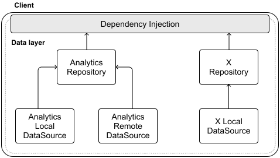

*Figure 15: Analytics represented in architecture diagrams*

**🔍 Industry insights:**

Pinterest built an end-to-end JSON logging system for their iOS and Android clients. The idea was to make logging “schemaless” and easy [87].

Slack developed a bespoke tracing system, SlackTrace, to monitor the flow of notifications across their infrastructure, aiming to standardize data formats and simplify debugging [88].

Signal takes a unique stance on analytics: it collects virtually none in order to protect user privacy. The Signal app does not have the typical mobile analytics or crash-reporting SDKs that most apps use [89].

### Localization

Adapting your application for global audiences involves much more than simply translating text. Comprehensive localization transforms every aspect of your app to feel native to users across different regions, languages, and cultural contexts. When implemented thoughtfully, localization significantly expands your potential user base while improving engagement and retention in international markets.

**🎯 When to bring it up**

Localization demonstrates our awareness of developing for global audiences. We can mention it when designing apps intended for international markets or discussing text-heavy interfaces that would need translation. It's particularly relevant when explaining how our architecture handles variable content lengths, right-to-left languages, or region-specific features that might affect our core design decisions.

#### Beyond text translation

While text translation forms the foundation of localization, a complete strategy addresses multiple dimensions of cultural adaptation:

- **Number and currency formatting** varies dramatically across regions.

- **Date and time representation** follows different conventions worldwide.

- **Pluralization rules** differ across languages, often in complex ways that go beyond simply adding 's' for plurals.

- Text direction requires special consideration for **right-to-left (RTL) languages** such as Arabic, Hebrew, and Persian.

- **Visual and cultural elements** including colors, symbols, and imagery may carry different meanings or connotations across cultures.

While Android and iOS share similar localization concepts, they handle implementation differently: iOS offers built-in support for exporting translations [90], whereas Android implements localization through its resource system [91].

#### Localization challenges

Implementing comprehensive localization presents several technical challenges:

- **Adaptable UI design** must accommodate text expansion and contraction across languages. German and Finnish translations typically require 30-40% more space than English, while Chinese often uses significantly less.

- **Dynamic language switching** allows users to change their preferred language without restarting the application. This requires careful management of resource loading and UI refreshing to ensure a smooth transition between languages.

- **Resource optimization** becomes critical as localization assets multiply. Each supported language increases app size, potentially affecting download conversion rates and device storage requirements.

- **Testing complexity** increases exponentially with each supported language.

- **Backend API localization** ensures that content delivered from the backend appears in the user's preferred language. This typically involves including language preference parameters in API requests and designing backend systems to return appropriately localized responses.

By approaching localization as a fundamental aspect of our architecture rather than an afterthought, our apps can deliver truly global reach while maintaining excellent user experiences across diverse markets and cultures.

**🔍 Industry insights:**

Netflix, available in 190+ countries, built a sophisticated pipeline to ingest, translate, and serve UI strings for all their apps [92].

Netflix even uses pseudo-localization (artificially elongating text and adding accented characters) as a testing step to ensure UIs will accommodate other languages and scripts [93].

### Privacy

Privacy considerations have evolved from optional features to essential requirements in mobile apps. As regulations tighten globally and user awareness grows, implementing robust privacy measures is crucial for both legal compliance and maintaining user trust. A thoughtful privacy strategy must address regulatory requirements, technical safeguards, and transparent user experiences.

**🎯 When to bring it up**

Privacy considerations show we understand the regulatory and ethical dimensions of mobile development. We can mention this when discussing features that handle sensitive user data, systems that require cross-device synchronization, or designs targeting regions with strict privacy laws like Europe (GDPR) or California (CCPA). It's especially important when explaining data storage decisions, authentication mechanisms, or user consent flows.

#### Navigating regulatory landscapes

Mobile applications often operate across multiple jurisdictions, each with unique privacy frameworks that dictate how user data must be handled:

- **The European Union's General Data Protection Regulation (GDPR)** [94] established a comprehensive framework that fundamentally changed how organizations approach data privacy.

- The UK follows the **Data Protection Act (DPA)** [95] for data protection standards.

- **Health Insurance Portability and Accountability Act (HIPAA)** [96] regulates protected health information in the United States.

- Australian apps need to follow the **Privacy Principles (APPs)** [97].

The regulatory landscape continues to evolve rapidly, with new privacy laws emerging regularly around the world. Staying current with these developments is essential for maintaining compliance across global markets.

#### Technical implementation strategies

Implementing privacy protection requires a layered approach that secures user data throughout its lifecycle:

- **Data minimization** forms the foundation of modern privacy practice. Collect only the information necessary for your app's core functionality.

- **Secure data transit** protects information as it moves between client and server.

- **Protected storage** safeguards data at rest on both device and server. For example, we should encrypt sensitive information using industry-standard algorithms such as AES-256, with proper key management practices to maintain security.

- **Access controls** ensure that users can only access data they're authorized to view.

- **Data anonymization and pseudonymization** reduce privacy risks by separating personal identifiers from usage data.

- **Security testing** conducts regular penetration testing to identify vulnerabilities, and test both client and server-side security measures.

Beyond these regional requirements, it's essential to stay current with mobile security best practices. The OWASP [98] mobile security risks list, updated annually, provides a comprehensive overview of emerging threats and recommended protections.

**🔍 Industry insights:**

Meta has been exploring privacy-preserving machine learning to improve products without compromising user data. One cutting-edge approach is Federated Learning with Differential Privacy (FL-DP) [99].

### Accessibility

Creating truly inclusive mobile apps means ensuring everyone can use your product effectively, regardless of their abilities or how they interact with their devices. Accessibility isn't just about compliance with regulations, it's about expanding our application's reach and building products that work well for all users.

**🎯 When to bring it up**

Discussing accessibility demonstrates our commitment to inclusive design principles. We can mention this when explaining interface design decisions, navigation patterns, or interaction models that need to work for all users. It's particularly relevant when designing public-facing applications, especially those subject to legal accessibility requirements such as government, education, or healthcare apps.

Leading platforms provide comprehensive accessibility guidelines that help you build more inclusive apps: Web Content Accessibility Guidelines (WCAG) [100], Apple's Human Interface Guidelines for iOS [101], and Google's Material Design Accessibility Guidelines for Android [102].

#### Platform implementation techniques

Both Android and iOS provide comprehensive accessibility frameworks that help developers create inclusive apps:

- **Screen readers** (VoiceOver on iOS, Talkback on Android) support enables users with visual impairments to navigate applications through audio feedback.

- **Dynamic text sizing** allows users to adjust text display to their needs.

- **Color and contrast** considerations help users with color blindness or low vision.

- **Touch targets** should be sufficiently large to accommodate users with motor control challenges.

#### Testing and validation

Comprehensive accessibility testing combines automated checks with human evaluation:

- **Automated testing tools** such as Accessibility Scanner (Android) and Accessibility Inspector (iOS) identify common issues such as missing labels, insufficient contrast, and small touch targets.

- **Manual testing with assistive technologies** provides deeper insight into how real users might experience your application. Navigating the entire app using only VoiceOver or TalkBack reveals usability issues that automated tools might miss.

- **User testing with people with disabilities** delivers the most valuable feedback.

By integrating accessibility considerations throughout your development process rather than treating them as an afterthought, you build more robust applications that work better for everyone.

**🔍 Industry insights:**

The BBC has led by example with comprehensive Mobile Accessibility Guidelines [103].

### Push notifications

Push notifications enable apps to reach users even when they're not actively using the application. This capability is invaluable for sharing important updates, delivering time-sensitive information, or re-engaging users with your app. While powerful, push notifications have inherent limitations that you should understand when incorporating them into your mobile system design.

**🛠️ Platform implementation details**

Both iOS and Android implement push notifications through platform-specific services: iOS uses Apple Push Notification Service (APNs) [104], while Android relies on Firebase Cloud Messaging (FCM) [105].

These services act as intermediaries between your backend and user devices.

The typical flow for push notifications follows these steps:

- Our app registers with the platform's notification service during installation.

- The service provides a unique device token to identify that installation.

- Our app sends this token to the backend.

- When the backend needs to notify a user, it sends the message to the appropriate platform service.

- The platform service attempts to deliver the notification to the user's device.

**🎯 When to bring it up**

Push notifications demonstrate our understanding of user engagement strategies beyond the app itself. If the interviewer is interested in this topic, they usually add it as a functional requirement. If that's not the case, you can mention push notifications when discussing systems that deliver time-sensitive information, require user re-engagement, or include asynchronous interactions. It's particularly relevant when designing messaging apps, social platforms, or any application where users benefit from being notified about events even when they're not actively using the app.

#### Push notifications delivery challenges

Several factors can prevent successful notification delivery:

- **Device constraints**
  
  
  - Notifications queue when devices are offline or in airplane mode.
  
  - Platform servers eventually drop queued notifications that can't be delivered.
  
  - Battery-saving modes may delay or block notification delivery.

- **Platform limitations**
  
  
  - Both APNs and FCM implement throttling mechanisms to protect system resources.
  
  - Android manufacturer customizations can affect background process handling differently.
  
  - Platform-specific payload size limits restrict the amount of data you can include.

- **User controls**
  
  
  - Users can disable notifications through system settings.
  
  - They may deny notification permissions during the first app launch.
  
  - Do Not Disturb settings and focus modes can temporarily block delivery.

Given these limitations, push notifications should serve as a supplementary communication channel rather than your primary method for delivering critical information. They're excellent for enhancing engagement, but your system design should include alternative mechanisms for essential updates.

Chapter 4: Design a Chat app covers push notifications in detail. Figure 16 shows the push notifications-related components in its high-level architecture diagram.

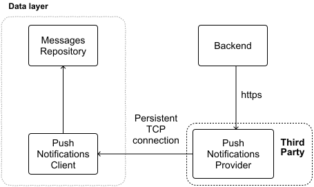

*Figure 16: Push notifications–related components in the Chat system design*

**🔍 Industry insights:**

Slack extended their notification system to send broader notification types and not just direct messages and mentions [106].

Duolingo built a high-scale notification system to handle its massive user base and engagement campaigns [107].

### App size

App size directly impacts both user acquisition and retention. App size influences user behavior in measurable ways. Google's research shows that each additional 6MB in APK size reduces installation conversion rates by approximately 1% [108]. This effect becomes even more pronounced in markets with limited data plans or on devices with storage constraints.

**🎯 When to bring it up**

App size considerations show our awareness of practical download and installation constraints. We can mention this when discussing applications targeting regions with limited bandwidth, apps containing substantial offline content, or designs requiring numerous third-party libraries. It's especially relevant when our target audience includes users with storage-constrained devices or limited data plans.

Two primary contributors typically influence app size:

- **Third-party libraries** add functionality but often come with significant size overhead. Each library should justify its footprint by providing essential capabilities that would be impractical to build in-house.

- **Media assets** such as images, videos, and audio files enhance user experience but can quickly inflate app size. When addressing asset management in your interview, discuss strategies such as:
  
  
  - Using vector graphics where appropriate to maintain quality across device resolutions.
  
  - Implementing on-demand asset downloading for infrequently accessed features.
  
  - Leveraging server-side image optimization based on device capabilities.

When discussing app size optimization in interviews, demonstrate an awareness of platform-specific approaches.

**🛠️ Platform implementation details**

Both Android [109] and iOS [110] offer comprehensive tools and documentation for reducing app size.

- For Android, we can mention techniques like R8 code shrinking, resource shrinking, and App Bundles that deliver only the code and resources needed for specific device configurations. -

- For iOS, we can highlight app thinning, on-demand resources, and Swift's whole module optimization.

By integrating thoughtful app size considerations into your mobile system design, we demonstrate awareness of the practical constraints that affect real-world app distribution and adoption.

**🔍 Industry insights:**

Instagram built an Instagram Lite Android app with an initial size of just 573 KB [111].

### CI/CD

Mobile apps depend heavily on automation for consistent, reliable delivery. Continuous Integration and Continuous Delivery/Deployment (CI/CD) practices streamline the testing and release process, ensuring high quality across development stages.

**🎯 When to bring it up**

CI/CD knowledge demonstrates our understanding of the complete development lifecycle. We can bring this up when discussing how our design would be implemented in practice, especially for complex systems requiring frequent updates or when explaining how to maintain quality across multiple platforms. It's particularly relevant when describing how your architecture supports testability or when proposing designs that would involve complex integration requirements.

#### Continuous Integration (CI)

Continuous Integration focuses on frequently merging code changes into a shared repository. Each time developers push changes, automated pipelines perform these essential functions:

- Building the app to catch compilation errors early.

- Running unit and integration tests to ensure functionality.

- Analyzing code quality through static analysis tools.

This creates a valuable feedback loop where issues are detected immediately rather than accumulating over time. Tools such as Fastlane [112], GitHub Actions [113], or Bitrise [114] handle these automated checks, ensuring consistent quality without manual intervention.

#### Continuous Delivery (CD)

While CI focuses on code quality, Continuous Delivery automates the preparation and distribution of releases. Once code passes CI checks, CD pipelines handle:

- Configuring app signing and credentials.

- Setting environment-specific variables.

- Generating release builds.

- Distributing builds to testing environments.

**🛠️ Platform implementation details**

Mobile apps have unique CD requirements around code signing:

- Android uses keystore files to verify app authenticity.

- iOS requires provisioning profiles and certificates, often managed through tools such as Fastlane Match [115].

Each environment (e.g., development, QA, and production) also needs its own configuration:

- Android uses build.gradle flavors and buildConfigField.

- iOS uses Xcode build configurations and schemes.

#### Continuous Deployment

In its purest form, Continuous Deployment automatically pushes changes to production after they pass all quality checks. Unlike web or backend deployments, releases aren't instantaneously available to users because app store review processes can introduce unpredictable delays.

The key benefit of CI/CD is consistency! It removes manual steps that could introduce errors while ensuring every release follows the same proven process. Knowledge on this area shows interviewers we're not just focused on architectural excellence, but also on the practical aspects of delivering high-quality software reliably and efficiently.

**🔍 Industry insights:**

Duolingo drastically improved its mobile CI/CD pipeline, cutting Android and iOS build times by 68% [116].

Pinterest's iOS team transitioned to using Bazel as their build system resulted in a 21% reduction in clean build times [117].

### Security

Security forms an essential foundation for any mobile app. At its core, mobile security involves protecting user data, ensuring system integrity, and preventing unauthorized access. All while maintaining a smooth user experience.

**🎯 When to bring it up**

Security considerations show your awareness of protecting user data and system integrity. Mention this when discussing features that handle sensitive information, authentication workflows, or data storage decisions.

It's particularly relevant when designing finance, healthcare, or enterprise applications, or when explaining how your architecture safeguards against common mobile vulnerabilities.

Rather than diving deeply into implementation details, let's explore the main security domains that mobile devs should be familiar with. While security is a complex topic that would require specialized expertise to fully address, a general understanding of these areas will help you navigate MSD interviews effectively.

#### Device security

Mobile devices operate in varied and often unpredictable environments. Key considerations include:

- **iOS Jailbreak** [118] **/ Android Root** [119] **detection**: Identifying compromised operating systems that bypass security controls.

- **App integrity verification**: Ensuring the application hasn't been tampered with.
  
  
  - On Android, the Play Integrity API [120] verifies the app's authenticity and flags modifications.
  
  - On iOS, App Attest [121] ensures the app runs as intended, unaltered by external interference.

- **Secure local storage**: Properly handling sensitive data stored on the device.

- **Code obfuscation**: Making it harder for attackers to reverse-engineer your application.
  
  
  - On Android, tools such as R8 [122] can automatically scramble your code, changing the names of classes and methods while keeping the app's functionality intact.

#### Network security

Protecting data in transit requires multiple security layers:

- **Transport Layer Security (TLS)**: Encrypting all client-server communications.

- **Certificate pinning** [123]: Preventing man-in-the-middle attacks by validating server certificates.

- **API security**: Defending against common web vulnerabilities like injection attacks.

- **Secure offline operations**: Maintaining security even when connectivity is intermittent.

#### Data security

Even when stored locally, sensitive data requires protection:

- **Encryption at rest**: Securing stored data using strong encryption algorithms.

- **Secure key management**: Properly handling encryption keys.

- **Sensitive data handling**: Minimizing exposure of PII [124] and confidential information.

- **Data minimization**: Collecting and storing only essential information.

#### Balancing security and user experience

While robust security is essential, it shouldn't come at the expense of usability. Consider these principles:

- Apply stricter security measures to high-risk operations, using contextual security.

- Provide clear explanations when requesting sensitive permissions.

- Implement security measures proportional to the sensitivity of protected data.

- Use security measures that align with platform conventions and user expectations.

Remember that client-side security is just one layer of defense. A comprehensive security strategy requires both strong mobile protections and a well-secured backend working together.

**🔍 Industry insights:**

Signal's entire system design centers on user privacy. All messages and calls are end-to-end encrypted, meaning that not even Signal's servers can read user content [125].

## Supporting different devices

Building for a wide range of devices and platforms introduces unique challenges that can strongly influence your design choices.

In MSD interviews, demonstrating awareness of device fragmentation shows depth of understanding that extends beyond purely functional concerns. The ability to build solutions that work consistently across different hardware capabilities, screen sizes, and operating system versions reveals a mature perspective on mobile development challenges.

While these topics might not dominate interview discussions, they could emerge during the deep dive phase as interviewers assess how thoroughly candidates consider the practical implementation challenges of the design. Being prepared to address these concerns demonstrates both technical insight and product awareness.

### Phone, tablets, and other form factors

Supporting multiple device types isn't just a nice-to-have feature, it's often a core business requirement that can significantly expand your app's reach. While phones remain the primary platform for most apps, tablets, foldables, wearables, and even TVs offer unique opportunities to engage users in different contexts.

**🎯 When to bring it up**

Discussing multi-form factor support shows our ability to design adaptable interfaces and architecture. We can mention this when explaining how our system would accommodate different screen sizes, input methods, or device capabilities. It's particularly relevant when designing applications that need to provide consistent experiences across phones, tablets, foldables, or other specialized hardware.

The key to a successful multi-form factor strategy lies in strategic modularization. The app's core business logic and data layer can generally remain consistent across devices, as these components operate independently of screen size or input methods. It's primarily the UI and navigation layers that require device-specific adaptations to deliver optimal user experiences.

Consider how different form factors change user expectations and interaction patterns:

- **Tablets** benefit from larger screens that can display more content simultaneously. A tablet interface might show both a list of messages and their content side-by-side, while a phone would present these as sequential screens.

- **Foldables** present a hybrid challenge, functioning as both phones and tablets depending on their state. Well-designed apps adapt dynamically as the device transforms between folded and unfolded states.

- **Wearables** demand extremely focused interfaces with glanceable information and simplified interactions due to their limited screen real estate.

- **TVs** require interfaces that work well with remote controls rather than touch, with larger visual elements optimized for viewing from a distance.

Modern UI frameworks such as Jetpack Compose for Android and SwiftUI for iOS have made developing adaptive interfaces substantially easier. These declarative UI systems allow developers to create responsive layouts that automatically adjust to different screen dimensions and orientations.

Beyond the UI layer, certain data layer optimizations may be necessary for different form factors. For example:

- Adjusting caching strategies based on available device memory.

- Implementing form factor-specific image resolutions to balance quality with performance.

- Tailoring prefetching algorithms based on expected connectivity and usage patterns.

For more information about building for different form factors, check out Android [126] and Apple [127] documentation.

**🔍 Industry insights:**

Spotify adapts their app to different screen sizes and resolutions, ensuring that users have a seamless experience regardless of the form factor [128].

Google Photos enhanced user engagement on large screens by implementing responsive layouts tailored for tablets, foldables, and ChromeOS devices [129].

Microsoft enhanced the user experience of Outlook, Teams, and Office on large-screen Android devices by optimizing layouts and incorporating multi-window and multi-instance capabilities, resulting in increased active users and retention [130].

### OS and SDK versions

Supporting multiple OS versions poses a challenge that involves balancing user reach with development complexity. Each decision in this space involves trade-offs between backward compatibility and leveraging the latest platform capabilities.

**🎯 When to bring it up**

OS and SDK version support demonstrates our understanding of platform evolution and backward compatibility challenges. We can mention this when discussing feature implementation strategies that might depend on newer platform capabilities, security considerations across different OS versions, or approaches to maintain functionality on older devices. It's especially relevant when targeting platforms with fragmented version adoption such as Android or when designing features that leverage cutting-edge platform capabilities.

##### Minimum OS version support

The minimum OS version establishes which devices can install and run the app. This decision directly impacts the potential user base: choosing a higher minimum version may exclude users with older devices, while supporting very old versions can significantly increase development and testing complexity.

When selecting a minimum version, we should consider not just market share statistics but also the specific capabilities our app requires. For example, features such as augmented reality, or certain security protocols may only be available from specific OS versions forward.

This decision should be data-driven, weighing several factors:

- Current OS distribution among your target market.

- Critical platform capabilities needed for core functionality.

- Testing resources available to validate across multiple versions.

- Security and performance considerations of older OS versions.

##### Target OS version

While the minimum version defines backward compatibility, the target version determines which newer platform features the app can fully utilize. This is typically set to the most recent stable OS release.

Regularly updating your target version allows us to:

- Implement performance improvements offered by newer SDKs.

- Access enhanced security features and privacy protections.

- Utilize modern APIs that may replace deprecated functionality.

- Offer users the best possible experience on current devices.

The gap between the minimum and target versions determines how much version-specific code your app will need to maintain. Wider gaps could potentially require more conditional logic and compatibility layers, increasing complexity and potential for runtime issues.

##### API deprecation management

Platform evolution inevitably leads to API deprecation as operating systems improve and replace older functionality. Proactively addressing deprecation warnings prevents technical debt from accumulating and reduces the risk of critical failures when APIs are eventually removed.

Effective deprecation management involves:

- Regularly reviewing compiler warnings and deprecation notices.

- Creating a prioritized migration plan for affected code.

- Testing thoroughly on both older and newer OS versions.

- Maintaining clear documentation of version-specific implementations.

##### Strategic testing approach

Testing across supported OS versions requires a systematic approach to ensure consistent behavior. For example, rather than testing every feature on every version, we could focus on:

- Full coverage testing on minimum, target, and one middle version.

- Smoke testing on all supported versions.

- Deeper testing of features that rely on version-specific implementations.

- Prioritizing test scenarios based on real-world usage analytics.

**📌 Remember!**

OS update adoption rates vary significantly between platforms. iOS users typically upgrade more quickly than Android users, who may be constrained by manufacturer limitations or device age.

The OS version strategy should evolve over time. We should regularly reassess minimum version requirements as user analytics shift, using each major app update as an opportunity to potentially drop support for older versions that represent a diminishing percentage of the user base.

## Resources

[1] The Clean Architecture [https://blog.cleancoder.com/uncle-bob/2012/08/13/the-clean-architecture.html](https://blog.cleancoder.com/uncle-bob/2012/08/13/the-clean-architecture.html)

[2] Guide to app architecture: [https://developer.android.com/topic/architecture](https://developer.android.com/topic/architecture)

[3] Unidirectional Data Flow: [https://en.wikipedia.org/wiki/Unidirectional\_Data\_Flow\_(computer\_science)](https://en.wikipedia.org/wiki/Unidirectional%5C_Data%5C_Flow%5C_(computer%5C_science))

[4] The repository pattern: [https://www.geeksforgeeks.org/repository-design-pattern/](https://www.geeksforgeeks.org/repository-design-pattern/)

[5] Model View Controller architecture: [https://developer.apple.com/library/archive/documentation/General/Conceptual/DevPedia-CocoaCore/MVC.html](https://developer.apple.com/library/archive/documentation/General/Conceptual/DevPedia-CocoaCore/MVC.html)

[6] Model View ViewModel architecture: [https://en.wikipedia.org/wiki/Model%E2%80%93view%E2%80%93viewmodel](https://en.wikipedia.org/wiki/Model%E2%80%93view%E2%80%93viewmodel)

[7] VIPER architecture: [https://www.techtarget.com/whatis/definition/VIPER](https://www.techtarget.com/whatis/definition/VIPER)

[8] Uber's RIBs [https://github.com/uber/RIBs/wiki](https://github.com/uber/RIBs/wiki)

[9] Airbnb's Mavericks [https://airbnb.io/mavericks](https://airbnb.io/mavericks)

[10] Slack's Circuit architecture library: [https://slackhq.github.io/circuit/](https://slackhq.github.io/circuit/)

[11]: Separation of concerns: [https://en.wikipedia.org/wiki/Separation\_of\_concerns](https://en.wikipedia.org/wiki/Separation%5C_of%5C_concerns)

[12] Reactive programming: [https://en.wikipedia.org/wiki/Reactive\_programming](https://en.wikipedia.org/wiki/Reactive%5C_programming)

[13]: Single Source of Truth: [https://en.wikipedia.org/wiki/Single\_source\_of\_truth](https://en.wikipedia.org/wiki/Single%5C_source%5C_of%5C_truth)

[14] Dependency Injection: [https://en.wikipedia.org/wiki/Dependency\_injection](https://en.wikipedia.org/wiki/Dependency%5C_injection)

[15]: Service Locator pattern [https://en.wikipedia.org/wiki/Service\_locator\_pattern](https://en.wikipedia.org/wiki/Service%5C_locator%5C_pattern)

[16] Duolingo improvements to architecture [https://android-developers.googleblog.com/2021/08/android-app-excellence-duolingo.html](https://android-developers.googleblog.com/2021/08/android-app-excellence-duolingo.html)

[17] Uber's plugin system and RIBs: [https://www.uber.com/blog/plugins](https://www.uber.com/blog/plugins)

[18] Notion architecture insights: [https://newsletter.pragmaticengineer.com/p/notion-going-native-on-ios-and-android](https://newsletter.pragmaticengineer.com/p/notion-going-native-on-ios-and-android)

[19] UI layer: [https://developer.android.com/topic/architecture/ui-layer](https://developer.android.com/topic/architecture/ui-layer)

[20] Data layer: [https://developer.android.com/topic/architecture/data-layer](https://developer.android.com/topic/architecture/data-layer)

[21] Domain layer: [https://developer.android.com/topic/architecture/domain-layer](https://developer.android.com/topic/architecture/domain-layer)

[22] Deep links: [https://en.wikipedia.org/wiki/Mobile\_deep\_linking](https://en.wikipedia.org/wiki/Mobile%5C_deep%5C_linking)

[23] Guide to Android app modularization: [https://developer.android.com/topic/modularization](https://developer.android.com/topic/modularization)

[24] Airbnb iOS modularization story: [https://medium.com/airbnb-engineering/designing-for-productivity-in-a-large-scale-ios-application-9376a430a0bf](https://medium.com/airbnb-engineering/designing-for-productivity-in-a-large-scale-ios-application-9376a430a0bf)

[25] Robinhood modularization story: [https://medium.com/robinhood-engineering/breaking-up-the-app-module-monolith-the-story-of-robinhoods-android-app-707fb993a50c](https://medium.com/robinhood-engineering/breaking-up-the-app-module-monolith-the-story-of-robinhoods-android-app-707fb993a50c)

[26] Google's fundamentals of testing Android apps: [https://developer.android.com/training/testing/fundamentals](https://developer.android.com/training/testing/fundamentals)

[27] The robot pattern: [https://jakewharton.com/testing-robots/](https://jakewharton.com/testing-robots/)

[28] OHHTTPStubs: [https://github.com/AliSoftware/OHHTTPStubs](https://github.com/AliSoftware/OHHTTPStubs)

[29] MockWebServer: [https://github.com/square/okhttp/tree/master/mockwebserver](https://github.com/square/okhttp/tree/master/mockwebserver)

[30] Slack's Android automation testing series: [https://slack.engineering/android-ui-automation-part-1-building-trust/](https://slack.engineering/android-ui-automation-part-1-building-trust/)

[31] Bitrise's mobile testing pyramid: [https://bitrise.io/blog/post/mastering-the-mobile-testing-pyramid](https://bitrise.io/blog/post/mastering-the-mobile-testing-pyramid)

[32] Netflix's mobile testing strategy: [https://medium.com/androiddevelopers/netflix-app-testing-at-scale-eb4ef6b40124](https://medium.com/androiddevelopers/netflix-app-testing-at-scale-eb4ef6b40124)

[33] Dropbox's mobile testing strategy: [https://medium.com/androiddevelopers/how-dropbox-leverages-testing-to-maintain-high-level-of-trust-at-scale-b7b1bdf6161e](https://medium.com/androiddevelopers/how-dropbox-leverages-testing-to-maintain-high-level-of-trust-at-scale-b7b1bdf6161e)

[34] Android's SharedPreferences: [https://developer.android.com/training/data-storage/shared-preferences](https://developer.android.com/training/data-storage/shared-preferences)

[35] Android's DataStore: [https://developer.android.com/topic/libraries/architecture/datastore](https://developer.android.com/topic/libraries/architecture/datastore)

[36] iOS' UserDefaults: [https://developer.apple.com/documentation/foundation/userdefaults](https://developer.apple.com/documentation/foundation/userdefaults)

[37] iOS' Information Property List: [https://developer.apple.com/documentation/bundleresources/information-property-list](https://developer.apple.com/documentation/bundleresources/information-property-list)

[38] Android Keystore system: [https://developer.android.com/privacy-and-security/keystore](https://developer.android.com/privacy-and-security/keystore)

[39] iOS Keychain services: [https://developer.apple.com/documentation/security/keychain-services](https://developer.apple.com/documentation/security/keychain-services)

[40] Android's Jetpack Room: [https://developer.android.com/training/data-storage/room](https://developer.android.com/training/data-storage/room)

[41] iOS' Core Data: [https://developer.apple.com/documentation/coredata/](https://developer.apple.com/documentation/coredata/)

[42] Realm non-relational database: [https://www.mongodb.com/docs/atlas/device-sdks/](https://www.mongodb.com/docs/atlas/device-sdks/)

[43] Firebase Realtime Database: [https://firebase.google.com/docs/database](https://firebase.google.com/docs/database)

[44] iOS' FileManager: [https://developer.apple.com/documentation/foundation/filemanager](https://developer.apple.com/documentation/foundation/filemanager)

[45] Android's data and file storage overview guide: [https://developer.android.com/training/data-storage](https://developer.android.com/training/data-storage)

[46] Netflix usage of the Realm database: [https://netflixtechblog.com/netflix-downloads-on-android-d79db40f1732](https://netflixtechblog.com/netflix-downloads-on-android-d79db40f1732)

[47] Trello's offline-first approach: [https://www.atlassian.com/blog/atlassian-engineering/sync-architecture](https://www.atlassian.com/blog/atlassian-engineering/sync-architecture)

[48] iOS' available File directories: [https://developer.apple.com/documentation/foundation/filemanager/searchpathdirectory](https://developer.apple.com/documentation/foundation/filemanager/searchpathdirectory)

[49] iOS' fetching assets: [https://developer.apple.com/documentation/photokit/fetching-assets](https://developer.apple.com/documentation/photokit/fetching-assets)

[50] iOS' UIDocumentPickerViewController: [https://developer.apple.com/documentation/uikit/uidocumentpickerviewcontroller](https://developer.apple.com/documentation/uikit/uidocumentpickerviewcontroller)

[51] Android's File APIs: [https://developer.android.com/training/data-storage/shared/documents-files](https://developer.android.com/training/data-storage/shared/documents-files)

[52] Android's Content Providers: [https://developer.android.com/guide/topics/providers/content-provider-basics](https://developer.android.com/guide/topics/providers/content-provider-basics)

[53] Content Providers with special permissions: [https://developer.android.com/guide/topics/providers/content-provider-basics#Permissions](https://developer.android.com/guide/topics/providers/content-provider-basics#Permissions)

[54] iOS' App Groups: [https://developer.apple.com/documentation/xcode/configuring-app-groups](https://developer.apple.com/documentation/xcode/configuring-app-groups)

[55] Configuring App Groups on iOS [https://developer.apple.com/documentation/Foundation/UserDefaults/init(suiteName](https://developer.apple.com/documentation/Foundation/UserDefaults/init(suiteName):)

[56] HTTP/1.1 RFC: [https://www.rfc-editor.org/rfc/rfc7231](https://www.rfc-editor.org/rfc/rfc7231)

[57] What is REST: [https://www.codecademy.com/article/what-is-rest](https://www.codecademy.com/article/what-is-rest)

[58] CRUD operations: [https://en.wikipedia.org/wiki/Create,\_read,\_update\_and\_delete](https://en.wikipedia.org/wiki/Create,%5C_read,%5C_update%5C_and%5C_delete)

[59] Lyft usage of Protocol buffers and gRPC: [https://eng.lyft.com/lyfts-journey-through-mobile-networking-d8e13c938166](https://eng.lyft.com/lyfts-journey-through-mobile-networking-d8e13c938166)

[60] Reddit usage of GraphQL: [https://blog.bytebytego.com/p/reddits-architecture-the-evolutionary](https://blog.bytebytego.com/p/reddits-architecture-the-evolutionary)

[61] Airbnb usage of GraphQL: [https://medium.com/airbnb-engineering/how-airbnb-is-moving-10x-faster-at-scale-with-graphql-and-apollo-aa4ec92d69e2](https://medium.com/airbnb-engineering/how-airbnb-is-moving-10x-faster-at-scale-with-graphql-and-apollo-aa4ec92d69e2)

[62] Snapchat QUIC: [https://eng.snap.com/quic-at-snap](https://eng.snap.com/quic-at-snap)

[63] JSON Web Token (JWTs): [https://en.wikipedia.org/wiki/JSON\_Web\_Token](https://en.wikipedia.org/wiki/JSON%5C_Web%5C_Token)

[64] Android Keystore system: [https://developer.android.com/privacy-and-security/keystore](https://developer.android.com/privacy-and-security/keystore)

[65] iOS Keychain services: [https://developer.apple.com/documentation/security/keychain-services](https://developer.apple.com/documentation/security/keychain-services)

[66] Uber and passkeys: [https://www.uber.com/blog/use-passkeys-wherever-you-sign-in-to-uber](https://www.uber.com/blog/use-passkeys-wherever-you-sign-in-to-uber)

[67] Robinhood's trusted devices: [https://robinhood.com/gb/en/support/articles/trusted-devices/](https://robinhood.com/gb/en/support/articles/trusted-devices/)

[68] Cursor-based pagination at Meta: [https://developers.facebook.com/docs/graph-api/reference/page/feed/](https://developers.facebook.com/docs/graph-api/reference/page/feed/)

[69] Cursor-based pagination at Slack: [https://api.slack.com/apis/pagination](https://api.slack.com/apis/pagination)

[70] Slack's migration to cursor-based pagination: [https://slack.engineering/evolving-api-pagination-at-slack/](https://slack.engineering/evolving-api-pagination-at-slack/)

[71] Discord and its virtualization for infinite lists:

[https://discord.com/blog/supercharging-discord-mobile-our-journey-to-a-faster-app](https://discord.com/blog/supercharging-discord-mobile-our-journey-to-a-faster-app)

[72] Shopify's relative cursor implementation: [https://shopify.engineering/pagination-relative-cursors](https://shopify.engineering/pagination-relative-cursors)

[73] Google downranks poorly performant apps in the Play Store: [https://www.theverge.com/2017/8/3/16078644/android-apps-play-store-ranking-machine-learning](https://www.theverge.com/2017/8/3/16078644/android-apps-play-store-ranking-machine-learning)

[74] Why users uninstall apps: [https://appsamurai.com/blog/10-reasons-for-why-people-uninstall-your-mobile-app/](https://appsamurai.com/blog/10-reasons-for-why-people-uninstall-your-mobile-app/)

[75] Instagram's prefetching solution: [https://instagram-engineering.com/improving-performance-with-background-data-prefetching-b191acb39898](https://instagram-engineering.com/improving-performance-with-background-data-prefetching-b191acb39898)

[76] Instagram's Data Saver mode:

[https://instagram-engineering.com/instagram-data-saver-mode-ffb01fd5a6bd](https://instagram-engineering.com/instagram-data-saver-mode-ffb01fd5a6bd)

[77] Robinhood's server-driven UI approach: [https://newsroom.aboutrobinhood.com/how-server-driven-ui-is-helping-frontend-engineers-scale-impact](https://newsroom.aboutrobinhood.com/how-server-driven-ui-is-helping-frontend-engineers-scale-impact)

[78] Spotify client architecture modernization with batched metadata downloads:

[https://engineering.atspotify.com/2020/05/spotify-modernizes-client-side-architecture-to-accelerate-service-on-all-devices](https://engineering.atspotify.com/2020/05/spotify-modernizes-client-side-architecture-to-accelerate-service-on-all-devices)

[79] Lyft's reduction of ANRs:

[https://eng.lyft.com/prioritizing-app-stability-cb7b4cf65d50](https://eng.lyft.com/prioritizing-app-stability-cb7b4cf65d50)

[80] Uber's failover handling mechanism: [https://eng.uber.com/eng-failover-handling/](https://eng.uber.com/eng-failover-handling/)

[81] Google Play Store's staged rollouts: [https://support.google.com/googleplay/android-developer/answer/6346149](https://support.google.com/googleplay/android-developer/answer/6346149)

[82] Apple's App Store phased updates [https://developer.apple.com/help/app-store-connect/update-your-app/release-a-version-update-in-phases/](https://developer.apple.com/help/app-store-connect/update-your-app/release-a-version-update-in-phases/)

[83] Apple's TestFlight builds: [https://developer.apple.com/testflight/](https://developer.apple.com/testflight/)

[84] Uber's approach to force-upgrade:

[https://bitrise.io/blog/post/q-and-a-on-building-apps-at-scale-part-1](https://bitrise.io/blog/post/q-and-a-on-building-apps-at-scale-part-1)

[85] Netflix's A/B testing approach:

[https://netflixtechblog.com/its-all-a-bout-testing-the-netflix-experimentation-platform-4e1ca458c15](https://netflixtechblog.com/its-all-a-bout-testing-the-netflix-experimentation-platform-4e1ca458c15)

[86] Duolingo's approach to A/B testing: [https://blog.duolingo.com/unique-engineering-problems](https://blog.duolingo.com/unique-engineering-problems)

[87] Pinterest's logging schemaless solution: [https://medium.com/pinterest-engineering/build-an-end-to-end-json-logging-system-for-clients-apps-58ad008a1ce9](https://medium.com/pinterest-engineering/build-an-end-to-end-json-logging-system-for-clients-apps-58ad008a1ce9)

[88] Slack's push notifications tracing:

[https://slack.engineering/tracing-notifications](https://slack.engineering/tracing-notifications)

[89] Signal's unique stance on no analytics: [https://signal.org/blog/signal-is-for-everyone](https://signal.org/blog/signal-is-for-everyone)

[90] Apple's export localizations for translation: [https://developer.apple.com/documentation/xcode/exporting-localizations/](https://developer.apple.com/documentation/xcode/exporting-localizations/)

[91] Android's guide to localization: [https://developer.android.com/guide/topics/resources/localization](https://developer.android.com/guide/topics/resources/localization)

[92] Netflix's localization approach: [https://netflixtechblog.medium.com/now-streaming-in-your-language-the-technology-behind-netflixs-global-interface-e0c732c69b16](https://netflixtechblog.medium.com/now-streaming-in-your-language-the-technology-behind-netflixs-global-interface-e0c732c69b16)

[93] Netflix's pseudo-localization for testing purposes:

[https://netflixtechblog.com/pseudo-localization-netflix-12fff76fbcbe](https://netflixtechblog.com/pseudo-localization-netflix-12fff76fbcbe)

[94] General Data Protection Regulation (GDPR): [https://gdpr-info.eu/](https://gdpr-info.eu/)

[95] Data Protection Act (DPA) [https://www.gov.uk/data-protection](https://www.gov.uk/data-protection)

[96] Health Insurance Portability and Accountability Act (HIPAA): [https://www.cdc.gov/phlp/publications/topic/hipaa.html](https://www.cdc.gov/phlp/publications/topic/hipaa.html)

[97] Australian Privacy Principles (APPs): [https://www.oaic.gov.au/privacy/australian-privacy-principles](https://www.oaic.gov.au/privacy/australian-privacy-principles)

[98] Top mobile risks from OWASP: [https://owasp.org/www-project-mobile-top-10/](https://owasp.org/www-project-mobile-top-10/)

[99] Meta's Federated Learning with Differential Privacy (FL-DP):

[https://engineering.fb.com/2022/06/14/production-engineering/federated-learning-differential-privacy](https://engineering.fb.com/2022/06/14/production-engineering/federated-learning-differential-privacy)

[100] Web Content Accessibility Guidelines (WCAG): [https://www.w3.org/TR/WCAG21/](https://www.w3.org/TR/WCAG21/)

[101] Apple's Human Interface Guidelines: [https://developer.apple.com/design/human-interface-guidelines](https://developer.apple.com/design/human-interface-guidelines)

[102] Google's Material Design Accessibility Guidelines: [https://m3.material.io/foundations/overview/principles](https://m3.material.io/foundations/overview/principles)

[103] BBC's accessibility guidelines:

[https://www.bbc.co.uk/accessibility/forproducts/guides/mobile](https://www.bbc.co.uk/accessibility/forproducts/guides/mobile)

[104] Apple Push Notification service: [https://en.wikipedia.org/wiki/Apple\_Push\_Notification\_service](https://en.wikipedia.org/wiki/Apple%5C_Push%5C_Notification%5C_service)

[105] Firebase Cloud Messaging: [https://en.wikipedia.org/wiki/Firebase\_Cloud\_Messaging](https://en.wikipedia.org/wiki/Firebase%5C_Cloud%5C_Messaging)

[106] Slack's notification system: [https://slack.engineering/into-the-clouds/](https://slack.engineering/into-the-clouds/)

[107] Duolingo's notification system: [https://www.infoq.com/presentations/duolingo-high-scale-notification](https://www.infoq.com/presentations/duolingo-high-scale-notification)

[108] Shrinking APKs, growing installs blog post: [https://medium.com/googleplaydev/shrinking-apks-growing-installs-5d3fcba23ce2](https://medium.com/googleplaydev/shrinking-apks-growing-installs-5d3fcba23ce2)

[109] Reduce Android app's size: [https://developer.android.com/topic/performance/reduce-apk-size](https://developer.android.com/topic/performance/reduce-apk-size)

[110] Reduce iOS app's size: [https://developer.apple.com/documentation/xcode/reducing-your-app-s-size](https://developer.apple.com/documentation/xcode/reducing-your-app-s-size)

[111] Instagram Lite app: [https://www.theverge.com/2018/6/28/17512874/instagram-lite-app-developing-world-low-data-usage](https://www.theverge.com/2018/6/28/17512874/instagram-lite-app-developing-world-low-data-usage)

[112] Fastlane: [https://fastlane.tools/](https://fastlane.tools/)

[113] Github Actions: [https://github.com/features/actions](https://github.com/features/actions)

[114] Bitrise: [https://bitrise.io/](https://bitrise.io/)

[115] Fastlane Match: [https://docs.fastlane.tools/actions/match/](https://docs.fastlane.tools/actions/match/)

[116] Duolingo CI/CD improvements: [https://blog.duolingo.com/sped-up-android-ios-builds](https://blog.duolingo.com/sped-up-android-ios-builds)

[117] Pinterest CI/CD improvements with Bazel:

[https://medium.com/pinterest-engineering/developing-fast-reliable-ios-builds-at-pinterest-part-one-cb1810407b92](https://medium.com/pinterest-engineering/developing-fast-reliable-ios-builds-at-pinterest-part-one-cb1810407b92)

[118] iOS jailbreaking: [https://en.wikipedia.org/wiki/IOS\_jailbreaking](https://en.wikipedia.org/wiki/IOS%5C_jailbreaking)

[119] Rooting on Android: [https://en.wikipedia.org/wiki/Rooting\_(Android)](https://en.wikipedia.org/wiki/Rooting%5C_(Android))

[120] Android Play Integrity APIs: [https://developer.android.com/google/play/integrity](https://developer.android.com/google/play/integrity)

[121] iOS apps integrity: [https://developer.apple.com/documentation/devicecheck/establishing-your-app-s-integrity](https://developer.apple.com/documentation/devicecheck/establishing-your-app-s-integrity)

[122] R8 Android code shrinking tool: [https://developer.android.com/build/shrink-code](https://developer.android.com/build/shrink-code)

[123] HTTP Public Key Pinning: [https://en.wikipedia.org/wiki/HTTP\_Public\_Key\_Pinning](https://en.wikipedia.org/wiki/HTTP%5C_Public%5C_Key%5C_Pinning)

[124] Personally Identifiable Information (PII): [https://en.wikipedia.org/wiki/Personal\_data](https://en.wikipedia.org/wiki/Personal%5C_data)

[125] Signal's approach to privacy:

[https://transcend.io/blog/industry-perspective-signal](https://transcend.io/blog/industry-perspective-signal)

[126] Android form factors docs: [https://developer.android.com/guide/topics/large-screens](https://developer.android.com/guide/topics/large-screens)

[127] Apple form factors docs: [https://developer.apple.com/design/human-interface-guidelines/layout](https://developer.apple.com/design/human-interface-guidelines/layout)

[128] Spotify across screens developer story: [https://www.youtube.com/watch?v=9_vbo6BZ0VU](https://www.youtube.com/watch?v=9_vbo6BZ0VU)

[129] Google Photos for large screens: [https://developer.android.com/stories/apps/google-photos](https://developer.android.com/stories/apps/google-photos)

[130] Microsoft products optimised for large screens: [https://developer.android.com/stories/apps/microsoft](https://developer.android.com/stories/apps/microsoft)