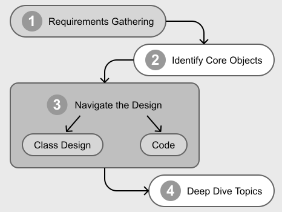
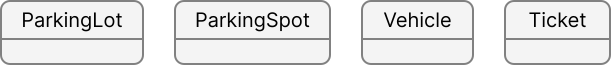
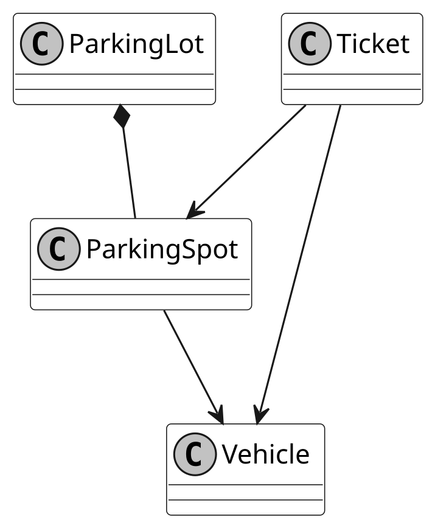

# A Framework for the OOD Interview

Having a clear framework for the OOD interview is more important than many realize. Without structure, the interview can feel disorganized and difficult for you and the interviewer to follow.

This chapter introduces a four-step framework to help you navigate open-ended OOD discussions with confidence. It guides you in transforming abstract requirements into concrete architecture or code, while showcasing your ability to make thoughtful trade-offs under real-world constraints.

Keep in mind that OOD interviews are highly versatile, and this framework is not foolproof. The structure and expectations can vary depending on the interviewer’s preferences, so you’ll need to be flexible and adapt accordingly.

Before we dive into the framework itself, let’s first explore the common types of OOD interviews you might encounter.

## Different Types of OOD Interviews

OOD interviews typically emphasize one of three areas, each with a preferred deliverable format. Early in the interview, gauge the interviewer’s expectations by asking, “Are we focusing on high-level class diagram, code structure, or a full implementation?” This question helps you tailor your approach and ensures you deliver what’s needed within the time constraints (usually 45–60 minutes). The three primary deliverable formats are:

**UML Diagrams:** UML diagrams were once the standard and are still commonly used to visually represent system designs. A UML class diagram helps illustrate the relationships between classes, including their attributes, methods, and interactions.

**Code Skeleton:** This approach has become increasingly popular in modern interviews, as it more closely resembles real-world software development. It allows interviewers to explore implementation details as needed. In this style, you define the structure of your design directly in code using appropriate class and method declarations, while leaving method bodies unimplemented.

**Working Code:** With the renewed emphasis on OOD interviews, interviewers sometimes request fully functional, bug-free implementations. They may also ask for test cases. This approach offers the highest fidelity to real industry development.

The expected deliverable often depends on the interviewer’s preference and the time constraints. If you’re asked to produce working code, don’t be intimidated. Interviewers typically simplify the problem to ensure it’s manageable within the allotted time.

**Tip:** In an OOD interview, the journey is just as important as the final deliverable.
Coding in silence doesn’t make a strong impression. Instead, share thoughtful insights
throughout the process to demonstrate your design thinking and communication skills.

## A Guiding Framework for the OOD Interview

Here are the four steps we recommend:

*OOD Interview Framework*

**Step 1: Requirements Gathering** (5-10 minutes): Begin by thoroughly analyzing the problem statement and identifying key functional and non-functional requirements. Ask targeted questions to resolve ambiguities, establish realistic constraints, and confirm any assumptions. This ensures that you and the interviewer share a clear understanding of the scope and priorities.

**Step 2: Identify Core Objects** (3-7 minutes): With requirements clarified, select a primary use case and walk through it step-by-step to identify core objects and their interactions. A practical approach is to map **nouns in the requirements to objects** (e.g., "parking lot," "vehicle," "ticket") and **verbs to methods** (e.g., "assign spot," "calculate fee"). This creates a naive but relevant initial design, serving as a foundation for refinement.

**Note:** While use case diagrams can help visualize workflows and clarify interactions
between objects, they are optional for most OOD interviews.

**Step 3: Design Class Diagram and Code** (20-25 minutes): Now that the core objects and their roles are clear, it’s time to develop the class diagram and demonstrate how it translates into code.

Start by designing the classes using either a top-down or bottom-up approach:

- **Top-down Approach**: First, identify high-level components or parent classes, then refine their attributes and methods.

- **Bottom-up Approach**: Define concrete classes first (attributes, methods) and build relationships from there.

Define how the objects will interact and assign responsibilities in a way that follows key design principles such as low coupling and high cohesion. This is the stage where you solidify your object model and flesh out the details of its attributes and methods.

Once the design is in place, implement the core classes to demonstrate how the structure translates into code. In some cases, a complete implementation isn’t necessary. Focus on the essential parts unless the interviewer requests otherwise.

**Note:** The primary focus of an OOD interview is design and code quality. But
you should not ignore time and space complexity and efficiency. Strong class and
relationship modeling includes selecting appropriate data structures for performance.
For example, choose between List and Set carefully based on access pattern and
performance. Likewise, HashSet and TreeSet are also not interchangeable. Get familiar
with more complex collections or nesting. During the actual interview, mention
your thoughts and make the right choice, but do not go into exhaustive analysis
or overly optimize by inventing your own.

**Step 4: Deep Dive Topics** (10-15 minutes, optional)**:** After validating your design with key use cases, refine it to handle edge cases and resolve any inconsistencies. This is typically the point in the interview where the deep dive begins. Interviewers may ask follow-up questions to assess your understanding, challenge your design decisions, or explore more advanced aspects of your solution.

## A Step-by-Step Example

To better understand how an OOD interview unfolds, let’s walk through a realistic example from start to finish. This section shows how an interview might naturally unfold, from a vague problem description to a structured and thoughtful solution.

### Step 1: Requirements Gathering

Anne, a software engineer, is interviewing for a backend role. The interviewer, Beth, asks her to design a parking lot system, giving her 45 minutes to present the design.

Anne starts by digesting the problem, asking a few clarification questions to create a shared understanding of the scope. She quickly learns that the parking lot needs to support different vehicle types, reserved spaces, and accurate fee calculation.

**Sample Dialogue:**

**Anne:** What types of vehicles should the parking lot support? Are we
considering cars and motorcycles?

**Beth:** Yes, and also buses. Each bus takes up three spots.

**Anne:** Should we design different types of parking spaces for the different
types of vehicles?

**Beth:** Yes, you can decide how to design that.

Anne continues to ask thoughtful questions to clearly define the scope and constraints. She avoids common mistakes such as:

- Asking overly obvious or excessively detailed questions.

- Repeating previously answered questions, which could signal inattentiveness.

- Introducing irrelevant or overly complex topics that distract from the main problem.

#### Tips for Effective Requirements Gathering

The first few minutes of an OOD interview are critical. Here are a few tips for effective requirements gathering.

**Focus on the Most Essential Requirements**

Start by focusing on the most essential requirements and confirming that both you and the interviewer are aligned on the problem’s scope. Once Anne has a clear understanding of the task, she restates and lists down the core functionality to validate her interpretation:

**Anne:** The system will support parking and unparking vehicles, track space
availability, and calculate fees based on vehicle type and parking duration.
It should also support three types of vehicles.

**Use Examples to Clarify Scope**

Rather than relying solely on stating the requirements, Anne uses concrete examples to ground the discussion and expose edge cases. She presents one simple scenario and one more complex one to fully explore the system’s expected behavior.

**Simple Case:**

**Anne:** Let’s consider a basic scenario: a car enters the lot, finds an
available space, parks, and leaves after two hours. The system should allocate
a space, track the duration, and calculate the fee.

**Complex Case:**

**Anne:** Now, imagine a bus with a reservation entering the lot. Some spaces
are too small or reserved for other types. The system needs to find the most
suitable available space while optimizing future availability.

By walking through these contrasting examples, Anne clarifies ambiguities and ensures both the interviewer and she are on the same page.

With a solid grasp of the core problem and its constraints, she’s now ready to move on to identifying the building blocks (classes, methods, and attributes), that will form the backbone of her design.

### Step 2: Identify Core Objects

To kick off the design, Anne walks through a key use case: parking a car. As she steps through the process, she identifies relevant objects by paying attention to nouns and verbs in the requirements. This leads her to a simple but effective initial design.

**Anne:** When a car enters, the system will find an available space of the
appropriate size, assign it, generate a ticket, and mark the space as
occupied.

By focusing on two or three representative use cases, Anne allows the requirements to naturally guide the design. She avoids trying to model everything up front, prioritizing clarity and relevance over completeness.

As she works through the use case, she keeps the design focused and minimal. For example:

**Beth:** How would you handle edge cases like a full lot?

**Anne:** Good question. If no spaces are available, the system should return
an appropriate message. I’ll refine this logic once I have the complete
design.

When more complex topics arise, Anne acknowledges them without getting sidetracked:

**Anne:** Let’s finish the core use case first. If time permits, I’ll extend
the design to support configurable pricing, perhaps using a strategy pattern.

Anne’s goal during this phase is to identify the core objects and define their responsibilities clearly.

*Core Objects of Parking Lot*

**Optional Use Case Diagram:** If helpful, Anne could create a simple use case diagram to visualize workflows and clarify object interactions. While not required in most interviews, she can ask if the interviewer would like to see one.

### Step 3: Class Design and Code

Once the core objects are identified, Anne begins defining classes, sketching relationships, and implementing a basic structure in code.

#### Defining the Classes

She starts with foundational components that form the system’s backbone. In the parking lot example, she focuses on: ParkingLot, ParkingSpot, Vehicle, and Ticket.

**Anne:** The key entities are ParkingLot, ParkingSpot, Vehicle, and Ticket.
Each space has attributes like size and availability, and each vehicle has a
type. A Ticket will track the entry time and calculate the fee.

She then sketches a UML diagram to show relationships:

*Class diagram of Parking Lot*

- ParkingLot contains multiple ParkingSpots.

- Each ParkingSpot can hold one Vehicle.

- A Ticket links a Vehicle to a ParkingSpot and tracks the time.

Anne ensures that each class is well-defined and adheres to OOP principles like encapsulation, single responsibility, and inheritance:

**Anne:** The ParkingLot manages the overall structure, including tracking
spaces and handling vehicle flow. Each ParkingSpot handles its own
availability status and the vehicle parked in it.

**Anne:** We can define a base Vehicle class with subclasses like Car,
Motorcycle, and Bus since their parking requirements and fee calculations
differ.

She avoids overcomplicating the model and focuses only on objects that carry meaningful behavior.

#### Code Implementation

With the design in place, Anne writes class definitions and adds relevant attributes and method signatures. For example:

- ParkingLot: manages a collection of spots and handles assignments.

- ParkingSpot: tracks size, availability, and assigned vehicle.

- Ticket: stores entry time and calculates the fee.

As she codes, Anne explains her rationale to the interviewer, ensuring her thought process remains transparent. She also validates the design as she progresses:

**Anne:** This setup covers the main use cases we discussed. I’ll check if it
also holds up under edge conditions.

By staying focused and grounding her choices in solid OOD principles, Anne builds a practical and extensible design.

### Step 4: Deep Dive Topics

At this point, Anne’s design is nearly complete, whether in the form of a detailed UML diagram or a coherent code skeleton. The final step is refinement, taking a step back to examine the design from a high level, address edge cases, and consider improvements.

#### Addressing Gaps

Anne revisits edge cases and refines the design:

**Anne:** For edge cases, I’d add logic to handle full lots and group spaces
for buses. I’d also include validation for invalid tickets during checkout.

She updates her diagram or code as needed to support grouped space handling or special logic for larger vehicles.

#### Summarizing the Design

Anne then summarizes the system:

**Anne:** This design supports key use cases, scales to different vehicle
types, and includes logic for core edge cases. If time allows, I’d explore
enhancements like dynamic pricing based on time of day.

This recap reinforces her understanding and gives the interviewer a complete picture of her thinking.

#### Making Thoughtful Trade-offs

Refinements often involve trade-offs in areas like inheritance vs. composition, data modeling, or design patterns. The goal isn’t just to choose the “right” answer, but to clearly explain ***why*** the decision makes sense.

She also knows when to say “this is good enough” and move on. If her design already addresses the primary use cases, she avoids getting bogged down in hypotheticals or over-optimization.

## What If the Interview Doesn’t Go as Planned?

No matter how well you prepare, real interviews rarely follow a perfectly linear path. You might face curveballs such as shifting requirements, unexpected deep dives, or even a disengaged interviewer. The key is to stay adaptable, communicate clearly, and remain focused on delivering a thoughtful design.

This section explores common challenges during OOD interviews and how to handle them with confidence and grace.

**1. Shifting Requirements and Expanding Scope**

In some interviews, the scope of the problem may expand as you go. You might be halfway through a design when the interviewer introduces new requirements or constraints. Don’t panic. This is often intentional.

✅ **What to do:**

- Acknowledge the new requirement and briefly assess its impact.

- Explain how your current design can accommodate the change, or what trade-offs might be required.

- Be flexible but strategic. Adapt your solution without overhauling it unnecessarily.

- If the interviewer keeps expanding on a specific area, it’s likely that flexibility and scalability are part of what they’re testing.

- In some cases, the shifting scope may be a subtle hint that your current design has a blind spot. Take a moment to re-evaluate and be one step ahead by recognizing potential design flaws.

**2. Being Pulled into a Deep Dive Too Early**

Sometimes, the interviewer may want to dive into details before you’ve mapped out the broader structure. If you go too deep too soon, you risk losing sight of the big picture and running out of time.

✅ **What to do:**

- Set expectations early: “I’ll start with a high-level overview, then we can dive deeper where needed.”

- Periodically check in on time and structure.

- If you’re stuck in one area, say: “Here’s the direction I’d take for now. Completing the rest of the system will give me the context to refine this.”

- Don’t forget to circle back to that part later. It shows follow-through.

- Avoid premature optimization or over-specificity early in the interview, as these can derail your momentum.

**3. Struggling to Communicate Your Thought Process**

Clear communication is as important as solid design. If your thoughts feel jumbled or hard to explain, it can weaken the impact of your solution.

✅ **What to do:**

- Begin with a high-level summary of your system before diving into class-level details.
  
  “The system has three main components: A, B, and C. Here’s how they interact.”

- Use visuals. A class diagram or code skeleton can anchor the conversation.

- Focus on ***why*** you made design decisions rather than just describing what they are.

- Choose intuitive names for classes and methods. Good naming reduces the need for lengthy explanations and reinforces clarity.

**4. Dealing with a Disengaged Interviewer**

Not every interviewer will give active feedback. If they appear disinterested, confused, or silent, don’t let it throw you off.

✅ **What to do:**

- Politely ask for feedback to re-engage them: “Would it be helpful if I clarified anything or focused on a specific part of the design?”

- If that doesn’t work, let your work speak for itself. Focus on delivering clean diagrams or runnable code.

- Especially in code-heavy interviews, executing working code can demonstrate your competence more effectively than conversation alone.

**5. When Your Design Decisions Are Challenged**

It’s common for interviewers to challenge your choices. This isn’t a bad sign. It’s a chance to demonstrate your reasoning and adaptability.

✅ **What to do:**

- Stay calm and explain your thought process.

- Use concrete examples or real-world analogies to support your point.

- If relevant, reference trade-offs using terms like time complexity, extensibility, or maintainability.

- Offer alternatives: “I considered both inheritance and composition. I chose inheritance here because…”

- If you’re unsure, it’s okay to pause or ask for clarification: “Would you mind giving a specific case where you see this approach falling short?”

**6. Encountering Unfamiliar Terminology**

If the interviewer uses a term or concept you’re not familiar with, it’s better to clarify than to guess.

✅ **What to do:**

- Ask politely: “Could you clarify what you mean by that term?”

- Or show partial understanding and align: “My understanding of this concept is X. Please let me know how it differs in your context.”

- This approach shows humility and professionalism without undermining your credibility.

**7. Struggling with the Right Level of Abstraction**

Not sure how much detail to go into? This is a common tension in OOD interviews. Going too broad can make your solution feel vague; going too deep too early wastes time.

✅ **What to do:**

- Start with a general structure and layer in details as needed.

- Ask the interviewer what level of depth they’d like you to go into:
  
  “Would you prefer a high-level architecture here or a more detailed class breakdown?”

- Stay flexible, and be prepared to zoom in or out depending on the interviewer’s cues.

- Each OOD problem has its own natural complexity, whether it’s in abstraction, data modeling, or behavior logic. Over time, you’ll develop a sense for what to emphasize.

**8. Addressing Concurrency in OOD Interviews**

Concurrency is an advanced topic that interviewers may bring up, often by asking how your system handles multiple users or processes accessing the same resources at the same time.

A classic example is a ticket booking system, where the key concern is preventing double-bookings when multiple users attempt to select the same seat. This scenario is a great opportunity to demonstrate techniques like locking, optimistic locking, or using language-specific synchronization mechanisms and concurrent data structures.

Keep your explanation concise and your implementation simple. In most interviews, a high-level description of your concurrency strategy, along with a brief code snippet to illustrate how you prevent race conditions, is more than enough.

In some cases, your system itself may need to run concurrently. If you’re coding in Java, understanding classes like Thread, Runnable, Callable, and ExecutorService is valuable, as it helps you avoid reinventing concurrency from low-level primitives.

**Final Thoughts**

The object-oriented design interview is about more than just technical skills. It’s about thinking clearly under pressure, communicating effectively, and applying OOP principles to build maintainable, scalable solutions.

By breaking the process into manageable steps and learning how to navigate unexpected challenges, you’ll be well-prepared to handle even the most unpredictable interviews. With practice and the right mindset, you can turn curveballs into opportunities and leave a lasting impression.