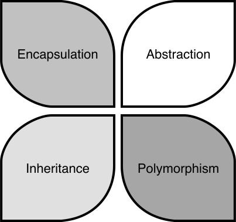
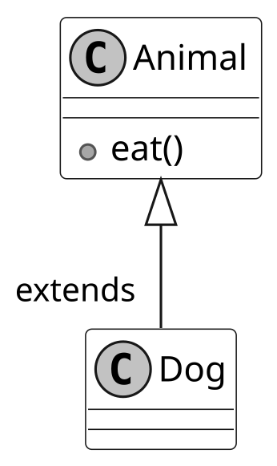
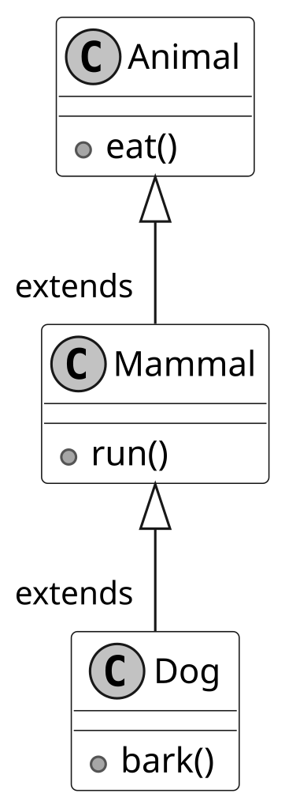
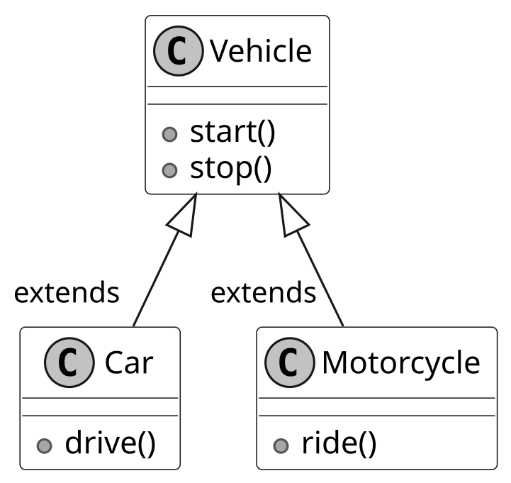
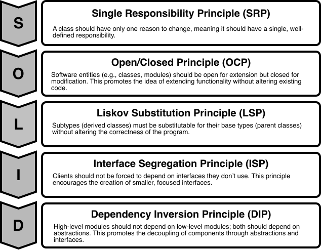
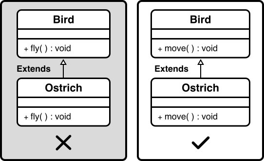
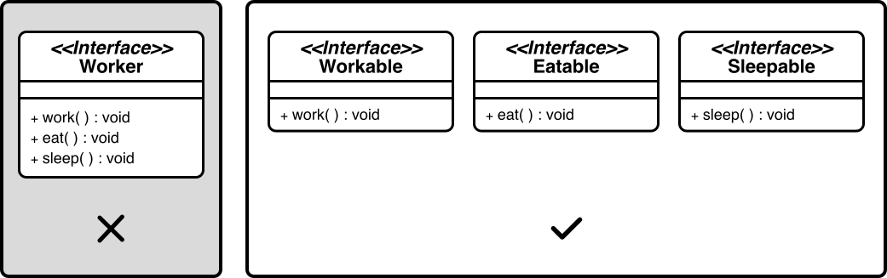
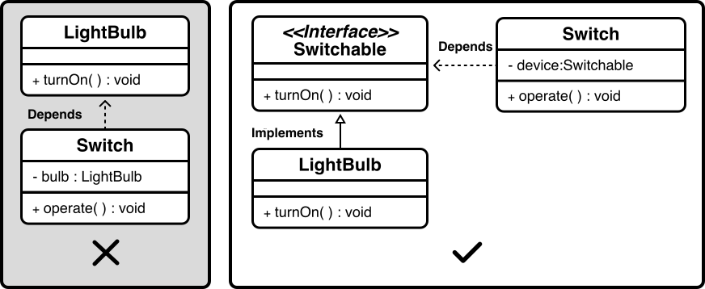

# OOP Fundamentals

This chapter introduces OOP, a popular programming paradigm that organizes code and data into objects. These objects interact to perform tasks and model real-world entities, providing a structured approach to building flexible, maintainable software.

## Why Learn OOP?

Understanding OOP fundamentals, including core principles such as encapsulation and advanced design guidelines like SOLID, is key to excelling in OOD interviews. OOP knowledge equips you with a clear mental model and foundational skills. It enables you to make design decisions aligned with widely accepted principles, articulate your reasoning to interviewers, and leverage established patterns to solve common problems efficiently.

OOP interviews often mirror real-world business applications and technical components. Understanding OOP concepts and SOLID guidelines not only prepares you for interviews but also makes you a stronger developer once hired. While functional programming and other paradigms are gaining traction, OOP remains the backbone of general software development. To deepen your expertise, supplement this chapter’s essentials with additional resources on OOP principles.

## Cornerstones of Object-Oriented Programming

Object-oriented programming is built on four fundamental principles: Encapsulation, Abstraction, Inheritance, and Polymorphism.



*Cornerstones of OOP*

These principles guide how we organize code and design software. The other techniques and design patterns stem from these principles, and they are important for evaluating solutions. Let’s dive into each principle with practical examples.

### Encapsulation

Encapsulation is the concept of bundling data as attributes and logic as methods, and then putting related attributes and methods within a single unit called an object. The object’s internal state is hidden from the outside world, and access to the data or state is controlled through well-defined interfaces available as public methods. A description of a type of object is a class, while a specific object is called an instance.

To see how encapsulation works in practice, let’s explore the Person class, which bundles data like name and age with methods to manage them while controlling access to that data.

#### How to work toward encapsulation?

To achieve encapsulation, follow these steps:

- **Define your classes**: Identify objects in your requirements, think about the data they hold, and the functionality they support. For the Person class, the data includes name and age, and the functionality includes accessing and modifying these attributes.

- **Enforce encapsulation**: Declare the class’s data members (attributes) as private to restrict direct access from outside the class. Provide public methods (getters and setters) to access and modify those attributes.

- **Use access modifiers**: The private access modifier restricts direct access to the attributes outside the class. Only methods in the class have access to these private members. Public methods are the interface through which external code interacts with the object’s attributes, hiding internal implementation details and maintaining the object’s integrity.

#### Implementing encapsulation in Java

Let's demonstrate encapsulation in Java with a simple class representing a “Person”:

```
public class Person {
    // Private data members (attributes)
    private String name;
    private int age;

    // Public constructor
    public Person(String name, int age) {
        this.name = name;
        this.age = age;
    }

    // Public getter methods (accessors)
    public String getName() {
        return name;
    }

    public int getAge() {
        return age;
    }

    // Public setter methods (mutators)
    public void setName(String name) {
        this.name = name;
    }

    public void setAge(int age) {
        if (age >= 0) {
            this.age = age;
        }
    }
}

```

- The Person class has private attributes name and age, which cannot be accessed directly from outside the class.

- Public getter methods, getName() and getAge(), allow external code to read (access) the private attributes.

- The setter methods, setName() and setAge(), are also public, allowing external code to modify (mutate) the private attributes.

This implementation ensures that the Person object’s internal state is protected, and external code interacts with it only through controlled methods.

#### When to use encapsulation?

Encapsulation is particularly useful in the following scenarios:

- **Protecting data integrity**: When you need to ensure an object’s data remains consistent and valid. For example, in the Person class, encapsulation hides name and age as private attributes, allowing the setAge() method to enforce rules like non-negative values, preventing invalid modifications, and ensuring the object’s state is reliable.

- **Controlling access and improving security:** Encapsulation restricts direct access to sensitive data. While attributes like name and age in a Person class are not highly sensitive, encapsulation becomes essential for classes handling critical information such as passwords. Although encapsulation alone does not guarantee full security, it acts as a foundational layer by limiting unwanted access.

- **Modularity and reusability**: When designing classes that can be reused across different applications. The Person class’s clear interface makes it modular and reusable in contexts like school management or social networking systems.

#### Common pitfalls

While encapsulation is powerful, avoid these common mistakes:

- **Over-encapsulation**: Creating excessive getter and setter methods for every attribute can make code verbose and harder to maintain.

- **Under-encapsulation**: Failing to hide internal details can lead to tight coupling and reduced modularity. For instance, if name and age in the Person class were public, other parts of the code could modify them directly, leading to potential inconsistencies.

### Abstraction

Abstraction can simplify complex systems by hiding unnecessary details. It separates the "what" an object does from the "how" it does it, enabling users to interact with objects through simplified interfaces. For example, the volume button on a television remote control provides a simple way to adjust sound without exposing the TV’s internal circuitry. In programming, abstraction is achieved using mechanisms like abstract classes and interfaces.

To see how abstraction works in practice, let’s explore a Shape class and a Drawable interface, which define simplified behaviors for shapes like circles.

#### How to work toward abstraction?

To achieve abstraction, use **abstract classes and interfaces**: Define abstract classes or interfaces with abstract methods, which are declared without implementation and must be implemented by subclasses. These allow users to call methods without needing to know their internal details.

#### Implementing Abstraction in Java

Let's demonstrate abstraction in Java with an abstract class representing a Shape and an interface representing a Drawable object:

```
// Abstract class
abstract class Shape {
    protected String color;

    public Shape(String color) {
        this.color = color;
    }

    // Abstract method
    public abstract double area();

    // Concrete method
    public void displayColor() {
        System.out.println("This shape is " + color + ".");
    }
}

// Interface
interface Drawable {
    void draw();
}

// Concrete class implementing Shape and Drawable
class Circle extends Shape implements Drawable {
    private double radius;

    public Circle(String color, double radius) {
        super(color);
        this.radius = radius;
    }

    // Implementing abstract method from Shape
    @Override
    public double area() {
        return Math.PI * radius * radius;
    }

    // Implementing method from Drawable interface
    @Override
    public void draw() {
        System.out.println("Drawing a circle.");
    }
}

```

The implementation demonstrates abstraction through:

- The Shape abstract class defines an abstract area() method that subclasses must implement and a concrete displayColor() method, which provides a default behavior.

- The Drawable interface, which declares a draw() method that implementing classes must define.

- The Circle class extends Shape and implements Drawable, providing specific implementations for area() (calculating the circle’s area) and draw() (describing the drawing action).

This structure allows users to interact with shapes using high-level methods like area() and draw() without needing to know the underlying drawing logic.

#### When to use abstraction?

Abstraction is particularly useful in the following scenarios:

- **Simplifying complex systems**: Abstraction helps provide a clean and consistent interface for complex functionality. For example, in the Shape class, abstraction allows users to call area() without understanding the mathematical calculations, making the system easier to use.

- **Promoting code flexibility**: When you anticipate that subclasses will provide specific implementations of generalized behavior, abstraction becomes essential. The Shape class’s abstract area() method ensures that shapes like circles or rectangles implement their area calculations, allowing flexibility in design.

- **Supporting extensibility**: Abstraction makes it easier to extend systems without modifying existing code. For instance, adding a new shape like Triangle to the Shape hierarchy only requires implementing area(), without changing existing code that uses shapes.

#### Abstraction vs. Encapsulation

Abstraction and encapsulation are distinct but complementary OOP principles, often confused because both involve hiding details. Here’s how they differ:

| Characteristics | Abstraction | Encapsulation |
| --- | --- | --- |
| **Focus** | Hiding complexity by exposing only what an object does through simplified interfaces, without revealing how it does it. | Bundling data and methods into a single unit (a class) and protecting data by restricting direct access. |
| **Purpose** | Simplifies user interaction and promotes flexibility by defining high-level behaviors. | Ensures data integrity and maintainability by controlling access to an object’s data. |
| **Implementation** | Uses abstract classes and interfaces, e.g., the Shape abstract class with area() or the Drawable interface with draw(). | Uses access modifiers (e.g., private, public) and methods, e.g., private radius in Circle with public getRadius() and setRadius(). |

By understanding these differences, you can apply abstraction to simplify interfaces and encapsulation to protect data, creating robust and user-friendly systems.

### Inheritance

Inheritance allows a class (subclass or derived class) to inherit properties and behaviors from another class (superclass or base class). It promotes code reuse and creates a hierarchical relationship between classes. Think of inheritance like a family tree, where children inherit traits from their parents, and grandchildren inherit traits from both their parents and grandparents. The subclass can extend and specialize the functionality of its superclass, reducing code duplication.

#### Common patterns of class hierarchy

Building on the concept of inheritance, we now explore common patterns for structuring class hierarchies in Java.

##### Single inheritance

A subclass extends only one superclass. This is the standard type of inheritance supported in Java. Below is an example of single inheritance.



*Single inheritance*

In the above example, we demonstrate single inheritance by creating a Dog class that extends the Animal class. The Dog class inherits the eat() method from Animal.

##### Multilevel Inheritance

A subclass that inherits from another subclass, creating a chain of inheritance, is called multilevel inheritance. Consider a scenario with three classes: Animal, Mammal, and Dog, where Animal is the superclass of Mammal, and Mammal is the superclass of Dog.



*Multilevel inheritance*

In the above example, the Dog class inherits behavior from the Animal and Mammal classes. Multilevel inheritance is useful when you have classes that exhibit a hierarchical relationship, with each subclass specializing and adding new behavior to the existing hierarchy.

##### Hierarchical Inheritance

In hierarchical inheritance, multiple subclasses inherit from the same superclass, forming a hierarchical structure. In the example below, you can see two subclasses, Car and Motorcycle, both inherit from the Vehicle class, forming a hierarchical inheritance relationship.



*Hierarchical inheritance*

Hierarchical inheritance is beneficial when multiple classes share common attributes or behaviors from a single superclass.

#### When to use inheritance?

Inheritance is particularly useful in the following scenarios:

- Whenever we encounter an 'is-a' relationship between objects, we can use inheritance.

- When multiple classes share common attributes or methods, a superclass can define them once, allowing all subclasses to inherit them and avoid duplication.

- When classes form a natural hierarchy, such as Animal being a parent to Dog and Cat, inheritance organizes the structure clearly.

#### Drawbacks of inheritance

While Inheritance promotes code reuse, its overuse can complicate designs. Here are the key drawbacks to consider:

- **Tight coupling**: Subclasses depend heavily on their superclass. Changes to the superclass, such as modifying the Animal class’s eat() method, can break subclasses like Dog or Cat, making the code harder to maintain.

- **Inappropriate behavior inheritance**: Inheritance can force subclasses to inherit behaviors that don’t apply. For example, adding a fly() method to the Animal superclass assumes all subclasses (e.g., Penguin) can fly, leading to errors or awkward workarounds like throwing exceptions.

- **Limited flexibility**: Inheritance locks in relationships at design time. If you later need a RobotDog that barks but doesn’t eat, it can’t inherit from Animal without inheriting irrelevant methods.

To address these issues, consider alternatives like composition (combining objects) or interfaces, which offer flexibility and loose coupling.

#### Inheritance vs. Composition

Given inheritance’s limitations, it’s helpful to compare it with composition, another way to structure classes. Inheritance creates an “is-a” relationship, where a subclass is a type of its superclass (e.g., Dog is an Animal). Composition creates a “has-a” relationship, where a class contains other objects to provide its behavior, such as installing apps on a phone for specific tasks.

Consider the Dog and RobotDog scenario. Using inheritance, RobotDog extends Animal to inherit bark(), but it also gets eat(), which doesn’t apply, causing issues like exceptions. Using composition, you define a BarkBehavior interface with a bark() method. Dog and RobotDog each have a BarkBehavior object, implemented differently (e.g., DogBark for “Woof!” and RobotBark for “Beep!”). This lets RobotDog bark without inheriting eat().

Here’s a simple composition example in Java:

```
interface BarkBehavior {
    void bark();
}

class DogBark implements BarkBehavior {
    public void bark() {
        System.out.println("Woof!");
    }
}

class RobotBark implements BarkBehavior {
    public void bark() {
        System.out.println("Beep!");
    }
}

class Dog {
    private BarkBehavior barkBehavior;

    public Dog(BarkBehavior barkBehavior) {
        this.barkBehavior = barkBehavior;
    }

    public void bark() {
        barkBehavior.bark();
    }
}

class RobotDog {
    private BarkBehavior barkBehavior;

    public RobotDog(BarkBehavior barkBehavior) {
        this.barkBehavior = barkBehavior;
    }

    public void bark() {
        barkBehavior.bark();
    }
}

public class Main {
    public static void main(String[] args) {
        Dog dog = new Dog(new DogBark());
        RobotDog robotDog = new RobotDog(new RobotBark());
        dog.bark(); // Output: Woof!
        robotDog.bark(); // Output: Beep!
    }
}

```

#### When to use composition?

To choose between inheritance and composition, follow these guidelines:

- **Design Choice**: Use inheritance for clear “is-a” relationships with stable, shared behaviors. Choose composition for “has-a” relationships or when you need flexible, swappable behaviors, as it’s easier to modify and maintain.

- **Interview Strategy**: In OOD interviews, favor composition when flexibility or loose coupling is key, as it’s preferred in modern design. For example, explain how RobotDog uses BarkBehavior to avoid inheritance’s tight coupling. Highlight inheritance’s use for simple hierarchies, but note its drawbacks.

These insights will help you design robust systems and justify your choices in interviews. With this comparison in mind, let’s explore how Polymorphism builds on these ideas to create flexible behaviors.

### Polymorphism

Polymorphism is the concept of implementing objects that can take on multiple forms or behave differently depending on their context, all within a common interface. It provides the flexibility to add new behaviors without modifying existing code.

Consider a media player as a real-world example. Different types of media, such as audio, video, and streaming content, would be played on the same rendering widget and controlled by the same “play” button. But they require different internal processing and rendering logic. The user only interacts with a uniform interface, while polymorphic behavior manages the varying objects.

#### Types of Polymorphism

Polymorphism in object-oriented programming is typically categorized into two main types: compile-time (static) and runtime (dynamic) polymorphism.

##### Compile-Time polymorphism via method overloading

Method overloading allows a class to have multiple methods with the same name but different parameters. The compiler determines the appropriate method to call based on the number and type of arguments passed during compile time. Method overloading enhances code readability by using the same method name for similar operations with different parameters.

Here’s an example of method overloading in Java:

```
class MathOperations {
    public int add(int a, int b) {
        return a + b;
    }

    public double add(double a, double b) {
        return a + b;
    }

    public String add(String str1, String str2) {
        return str1 + str2;
    }
}

public class Main {
    public static void main(String[] args) {
        MathOperations math = new MathOperations();

        int sum1 = math.add(5, 10);
        double sum2 = math.add(3.5, 7.2);
        String result = math.add("Hello, ", "World!");

        System.out.println("Sum of integers: " + sum1);
        System.out.println("Sum of doubles: " + sum2);
        System.out.println("Concatenated string: " + result);
    }
}

```

In this example:

- The MathOperations class defines multiple add methods with different parameter types or counts.

- The compiler selects the appropriate add method based on the arguments passed, enhancing code readability by using a single method name for related operations.

##### Runtime polymorphism via method overriding

Method overriding occurs when a subclass provides a specific implementation for a method already defined in its superclass. The method to be executed is determined at runtime based on the actual type of the object, not the reference type. This is often referred to as dynamic dispatch, a hallmark of runtime polymorphism.

Here’s an example of method overriding in Java:

```
class Animal {
    public void sound() {
        System.out.println("Animal makes a sound.");
    }
}

class Dog extends Animal {
    @Override
    public void sound() {
        System.out.println("Dog barks: Woof!");
    }
}

class Cat extends Animal {
    @Override
    public void sound() {
        System.out.println("Cat meows: Meow!");
    }
}

public class Main {
    public static void main(String[] args) {
        Animal animal1 = new Dog();
        Animal animal2 = new Cat();

        animal1.sound(); // Dog's sound() method is called
        animal2.sound(); // Cat's sound() method is called
    }
}

```

In this example:

- The Animal class defines a generic sound method.

- The Dog and Cat subclasses override sound to provide specific implementations.

- At runtime, the JVM determines the actual type of the object (Dog or Cat) and calls the appropriate sound method, even though the reference type is Animal.

- The loop demonstrates polymorphic behavior by treating different objects uniformly through the Animal type.

#### When to use polymorphism?

Polymorphism is particularly valuable in the following scenarios:

- **Shared Interface**: When multiple classes need to perform the same action in different ways, such as a play method for various media types (e.g., audio, video). Interfaces or superclasses ensure a consistent contract across implementations.

- **Extensibility**: When designing systems that need to accommodate new classes without modifying existing code. For example, adding a new media type to a player only requires implementing the existing play interface, preserving system stability.

- **Customization**: When subclasses need to tailor the behavior of inherited methods. For instance, a Dog barking differently from a Cat uses method overriding to provide specific implementations while adhering to the Animal interface.

## SOLID Principle of Good Design

Aside from the core OOP principles (encapsulation, abstraction, inheritance, and polymorphism), you should also be familiar with the SOLID principles. SOLID offers guidelines to create software that is easy to understand, modify, and extend. These principles are particularly valuable in OOD interviews, where articulating design decisions and their rationale can help you stand out.

The SOLID acronym stands for:



*SOLID Principles*

This section explores each principle through practical examples.

### Single Responsibility Principle (SRP)

The “S” in the SOLID principles stands for the Single Responsibility Principle (SRP), which states that a class should have only one reason to change or, in other words, it should have a single, well-defined responsibility or task within a software system.

#### Violation of SRP

Here’s an example of a class that violates SRP by taking on multiple responsibilities:

```
class Employee {
    private String name;
    private double salary;

    public Employee(String name, double salary) {
        this.name = name;
        this.salary = salary;
    }

    public double calculateSalary() {
        return salary * 12; // Annual salary
    }

    public void generatePayrollReport() {
        System.out.println("Payroll Report for " + name + ": $" + salary * 12);
    }
}

```

The Employee class above violates SRP because it has two responsibilities: calculating an employee’s salary and generating a payroll report. This means the class could change for two unrelated reasons, i.e., updates to salary logic or changes to report formatting, making it harder to maintain.

#### Fixing the violation

To address the violation, let's refactor the code to separate concerns and ensure that each class has a single, well-defined responsibility. We'll create distinct classes for calculating an employee's salary and generating a payroll report:

- The Employee class manages employee data, such as name and salary, and calculates the annual salary based on the monthly salary.

- The PayrollReportGenerator class takes an employee’s data and produces payroll reports.

This separation ensures that each class has a single task, and changes to salary calculations won’t affect reporting, and updates to report formats won’t impact employee data, making the system easier to maintain.

Here is the visual representation of the classes and implementation of the single responsibility principle (SRP).


*Single Responsibility Principle (SRP)*

#### Best practices

To adhere to the SRP effectively, consider the following guidelines:

- Aim to define a clear role for each class, focusing on one specific task.

- If a class handles multiple tasks, refactor it into smaller, focused classes with single responsibilities.

- Design classes so that changes to one task don’t impact others.

### Open/Closed Principle (OCP)

The Open/Closed Principle (OCP) states that software entities, such as classes, should be open for extension but closed for modification. This means you can add new functionality without altering existing code.

#### Violation of OCP

Here’s an example of a class that violates OCP by requiring changes to support new shapes:

```
class Rectangle {
    private double width;
    private double height;

    public Rectangle(double width, double height) {
        this.width = width;
        this.height = height;
    }

    public double calculateArea() {
        return width * height;
    }
}

class AreaCalculator {
    public double calculateArea(Rectangle rectangle) {
        return rectangle.calculateArea();
    }
}

```

In the above example, the AreaCalculator class works only with Rectangle objects. Adding support for new shapes, like circles or triangles, would require modifying its code. This makes the system harder to maintain and prone to errors, as each new shape requires altering the core logic.

#### Fixing the violation

- We can refactor this design to support new shapes without changes by introducing an abstract Shape class that defines a common behavior for all shapes: calculating their area.

- Specific shapes, like Rectangle and Circle, inherit from Shape and provide their area calculations.

This design allows new shapes, such as triangles, to be added by creating new classes that inherit from Shape, without modifying AreaCalculator or existing shape classes.

Below is the visual representation of the classes and implementation of OCP.


*Open/Closed Principle (OCP)*

#### Best practices

With this extensible design in place, here are guidelines to ensure OCP compliance:

- Consider introducing abstract classes or interfaces to create flexible blueprints that classes can extend with new functionality.

- Allow subclasses to override methods to provide specific behaviors, such as unique area calculations for different shapes.

- Use polymorphism to treat objects of different classes, like various shapes, uniformly through a common interface or base class.

### Liskov Substitution Principle (LSP)

The Liskov Substitution Principle (LSP) states that objects of a derived class should be able to replace objects of the base class without affecting the correctness of the program. In other words, if class A is a subtype of class B, then instances of class B should be replaceable with instances of class A without causing issues.

#### Violation of LSP

Here’s an example of a design that violates LSP by assuming all birds can fly:

```
class Bird {
    public void fly() {
        System.out.println("Flying in the sky.");
    }
}

class Ostrich extends Bird {
    @Override
    public void fly() {
        throw new UnsupportedOperationException("Ostriches cannot fly.");
    }
}

// Program calls bird.fly() to test bird behavior

```

In this code, the Ostrich class inherits from Bird but throws an exception for fly, as ostriches cannot fly. This breaks the expectation that any Bird can fly when a program tests this behavior. This violates the principle that derived classes should behave as expected when replacing their base class, making the design unreliable.

#### Fixing the violation

To align with LSP, we can refactor this hierarchy to ensure substitutability:

- Instead of assuming all birds can fly, we redefine the Bird class as an abstract class with a more general behavior, such as moving, that all birds can perform.

- The Bird class defines a move method, which each bird implements according to its abilities. For example, a Sparrow might implement move by describing flying in the sky, while an Ostrich implements move by describing running on land.

This design ensures that any derived class, like Ostrich, can replace Bird seamlessly, maintaining the program’s correctness.

Here is the visual representation of the classes and implementation of LSP.



*Liskov Substitution Principle (LSP)*

#### Best practices

With this flexible design in place, here are the guidelines to ensure LSP compliance:

- Ensure that derived classes maintain the behavioral compatibility of their base classes. Methods in derived classes should follow the same contracts as the base class methods.

- When overriding methods, derived classes must respect the base class’s method contracts. Specifically:
  
  
  - **Preconditions**: Derived class methods should require the same or weaker preconditions (e.g., input constraints) than the base class method. This ensures that the derived class does not impose stricter requirements that could break client expectations.
  
  - **Postconditions**: Derived class methods must provide the same or stronger postconditions (e.g., output guarantees) as the base class method, ensuring that the method’s results meet or exceed the base class’s promises.
  
  - **Invariants**: Derived classes must maintain all invariants defined by the base class, ensuring that the object’s state remains valid according to the base class’s rules.

- Use polymorphism to allow derived class objects to replace base class objects, often by overriding methods to provide specialized behavior while maintaining the core functionality of the base class.

### Interface Segregation Principle (ISP)

The “I” in the SOLID acronym stands for the Interface Segregation Principle (ISP), which emphasizes that clients (classes or components that use interfaces) should not be forced to depend on interfaces they don't use. In other words, an interface should have a specific and focused set of methods that are relevant to the implementing classes.

#### Violation of ISP

Here’s an example of a design that violates ISP by including methods that not all implementing classes need:

```
interface Worker {
    void work();

    void eat();

    void sleep();
}

class Robot implements Worker {
    public void work() {
        System.out.println("Performing tasks like welding.");
    }

    public void eat() {
        throw new UnsupportedOperationException("Robots don't eat.");
    }

    public void sleep() {
        throw new UnsupportedOperationException("Robots don't sleep.");
    }
}

class Human implements Worker {
    public void work() {
        System.out.println("Performing tasks like coding.");
    }

    public void eat() {
        System.out.println("Eating a meal.");
    }

    public void sleep() {
        System.out.println("Sleeping for rest.");
    }
}

```

In this code, the Worker interface forces Robot to implement eat and sleep, which are irrelevant, leading to unsupported operations. This makes the code harder to maintain and prone to errors, as classes must handle methods that don’t apply to them.

#### Fixing the violation

To align with ISP, we can refactor this interface to be more focused:

- Instead of a single Worker interface with unrelated methods, we split it into three smaller, tailored interfaces: Workable, Eatable, and Sleepable.

- The Workable interface includes only the work method, which all workers, like robots and humans, can implement.

- The Eatable interface includes the eat method, relevant to humans but not robots.

- The Sleepable interface includes the sleep method, which is also specific to humans.

This design ensures classes implement only the methods they need, making the code cleaner and more maintainable.

A visual representation of the refactored interfaces (Workable, Eatable, Sleepable) adhering to the ISP is shown below.



*Interface Segregation Principle (ISP)*

#### Best Practices

Here are guidelines to ensure ISP compliance:

- Aim to design interfaces with a specific purpose, including only methods directly related to that purpose.

- Consider creating multiple smaller interfaces that classes can choose to implement, rather than a single large interface with unrelated methods.

- Think from the perspective of the classes implementing the interface, providing only the methods they require.

### Dependency Inversion Principle (DIP)

The Dependency Inversion Principle (DIP) states that high-level modules (or classes) should not depend on low-level modules; both should depend on abstractions, such as interfaces. In simpler terms, the principle encourages the use of abstract interfaces to decouple higher-level components from lower-level details.

#### Violation of DIP

Here’s an example of a design that violates DIP by having a high-level class depend directly on a low-level class:

```
class LightBulb {
    public void turnOn() {
        System.out.println("LightBulb is on.");
    }

    public void turnOff() {
        System.out.println("LightBulb is off.");
    }
}

class Switch {
    private LightBulb bulb;

    public Switch(LightBulb bulb) {
        this.bulb = bulb;
    }

    public void operate() {
        bulb.turnOn();
    }
}

```

The Switch class above violates DIP because it depends directly on the low-level LightBulb class, rather than an abstraction. This tight coupling means that changing the LightBulb class, such as modifying its methods, or replacing it with another device, like a Fan, requires altering the Switch class’s code. This makes the system less flexible and harder to maintain, as high-level modules should not be tied to low-level details.

#### Fixing the violation

To align with DIP, we can refactor this design to use abstractions:

- We introduce a Switchable interface that defines standard methods, such as turnOn and turnOff, which any switchable device can implement.

- The Switch class is modified to depend only on the Switchable interface, not on specific devices.

- The LightBulb class implements the Switchable interface, providing its turnOn and turnOff behavior.

Now, Switch can work with any device that implements Switchable, like a Fan or a Heater, without needing changes to its code. This design decouples Switch from low-level details, making the system more flexible and easier to extend.

A visual representation of the dependency inversion is shown below.



*Dependency Inversion Principle (DIP)*

#### Best Practices

With this decoupled design in place, here are guidelines to ensure DIP compliance:

- Introduce interfaces or abstract classes to represent dependencies, allowing high-level modules to depend on these abstractions.

- Use dependency injection to inject concrete implementations into high-level modules through their abstractions. This promotes loose coupling.

## Wrap Up

This chapter has helped you understand how to use Encapsulation, Abstraction, Inheritance, Polymorphism, and the SOLID principles. These concepts form the backbone of robust software design, enabling you to create flexible, maintainable, and scalable systems. Applying these tools will help you articulate clear design decisions, justify your approach, and demonstrate adherence to industry-standard practices.

To further refine your skills and deepen your expertise, explore the following resources:

- *‘Clean Code: A Handbook of Agile Software Craftsmanship’* by Robert C. Martin

- *‘Design Patterns: Elements of Reusable Object-Oriented Software’* by Erich Gamma, Richard Helm, Ralph Johnson, and John Vlissides.

- ‘Tidy First?: A Personal Exercise in Empirical Software Design’ by Kent Beck