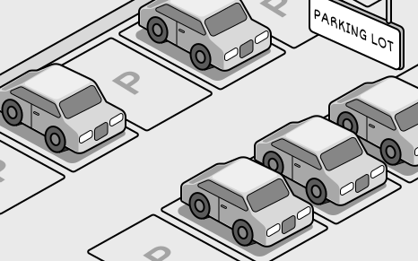
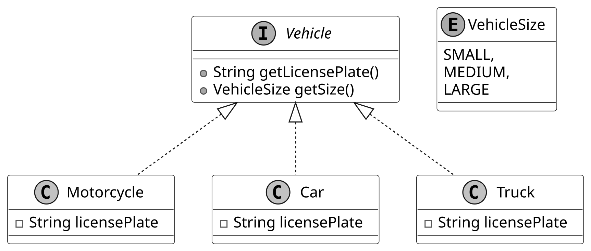
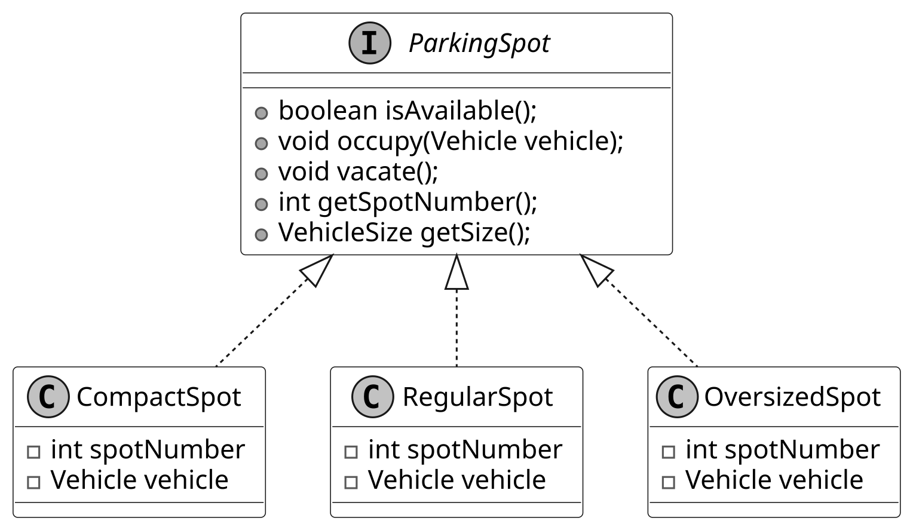
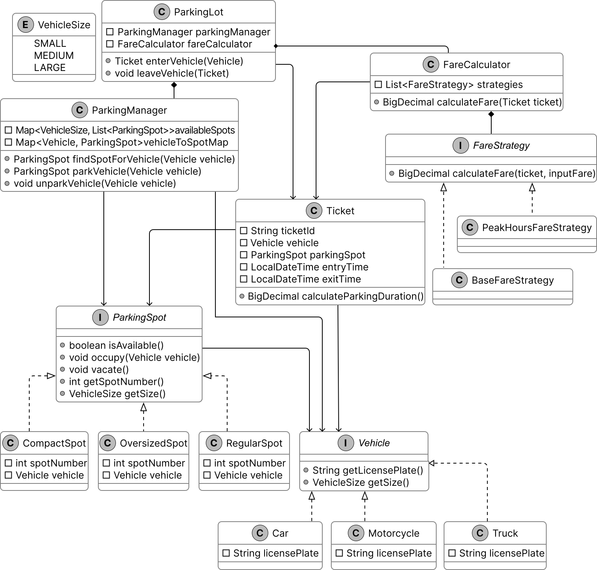
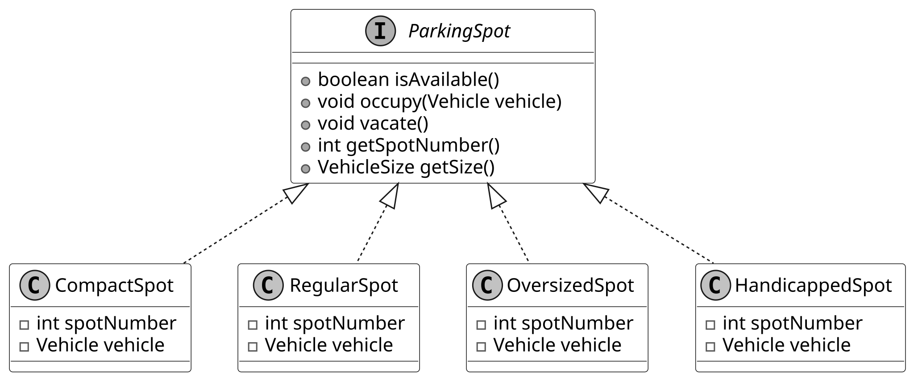

# Design a Parking Lot

In this chapter, we explore the object-oriented design of a Parking Lot system, one of the most popular questions in technical interviews. This parking lot application aims to provide a comprehensive solution for efficiently managing a parking lot. It automates various processes, including vehicle entry, exit, and spot allocation, while also providing accurate information about parking lot occupancy and generating parking tickets.

To build this system, we first need to clarify its requirements.



*Parking Lot*

## Requirements Gathering

The first step in designing the parking lot system is to clarify the requirements and define the scope. Here’s an example of a typical prompt an interviewer might present:

“Imagine you’re arriving at a busy parking lot, eager to park your car. At the entrance, you’re issued a ticket. You then drive in, find a spot suited to your vehicle’s size, and park. Later, when you prepare to leave, you present your ticket at the exit, the system calculates your fee, and the spot is freed up for the next vehicle. Behind the scenes, the parking lot is assigning spots based on vehicle size, recording entry and exit times, and updating availability for new arrivals. Now, let’s design a parking lot system that handles all this.”

### Requirements clarification

In this step, we ask clarifying questions to narrow down the list of requirements, understand the constraints, and define the problem that can be solved in 30-45 minutes.

Here is an example of how a conversation between a candidate and an interviewer might unfold:

**Candidate:** What types of vehicles are supported by the parking lot?

**Interviewer:** Three types of vehicles should be supported: *motorcycles*, *cars*, and *trucks*.

**Candidate:** What parking spot types are available in the parking lot?

**Interviewer:** The parking lot supports three types of parking spots: compact, regular spots, and oversized.

**Candidate:** How does the system determine which spot a vehicle should park in?

**Interviewer:** The system assigns spots based on the size of the vehicle, ensuring an appropriate fit.

**Candidate:** Are parking tickets issued to vehicles upon entry and charged at the exit?

**Interviewer:** Yes, a ticket is issued with vehicle details and entry time when a vehicle enters. On exit, the system calculates the fee based on duration and vehicle size, then marks the spot as vacant.

**Candidate:** How are parking fees calculated?

**Interviewer:** Fees are based on parking duration and vehicle size, with rates varying depending on the time of day.

### Requirements

As we ask clarifying questions, we should note down the key requirements for this problem. Putting the key requirements in writing will help us avoid ambiguity and contradictions, as there is nothing worse than realizing you are solving the wrong problem.

Here are the key functional requirements we’ve identified:

- The parking lot has multiple parking spots, including compact, regular, and oversized spots.

- The parking lot supports parking for motorcycles, cars, and trucks.

- Customers can park their vehicles in spots assigned based on vehicle size.

- Customers receive a parking ticket with vehicle details and entry time at the entry point and pay a fee based on duration, vehicle size, and time of day at the exit point.

Below are the non-functional requirements:

- The system must scale to support large parking lots with many spots and vehicles.

- The system must reliably track spot assignments and ticket details to ensure accurate operations.

With these requirements set, we now identify the core objects.

## Identify Core Objects

Before diving into the design, it’s important to enumerate the core objects.

- **Vehicle**: This object represents a vehicle that needs a spot. It encapsulates details like the license plate and size (small for motorcycles, medium for cars, large for trucks), serving as the foundation for spot assignment and fee calculation.

- **ParkingSpot**: This object models an individual parking spot in the parking lot. It’s the physical space where a Vehicle parks, ensuring only appropriately sized vehicles can park based on its capacity.

- **Ticket**: This object represents a parking ticket issued when a Vehicle enters the parking lot. It stores critical details, including the ticket ID, the associated Vehicle, the assigned ParkingSpot, and entry time, which are later used to calculate fees and free up spots upon exit.

- **ParkingManager**: This object oversees the parking lot’s spot allocation, managing the assignment, lookup, and release of ParkingSpot instances. It ensures a Vehicle gets the right spot by checking availability based on size, and updates the system when vehicles leave, keeping parking operations smooth and efficient.

- **ParkingLot**: This acts as a facade, providing a central interface to manage the system’s key functionalities: vehicle entry, spot assignment, ticketing, and fee calculation. It keeps its logic lightweight by delegating tasks such as spot allocation to the ParkingManager, fee computation to a FareCalculator class, and coordinating the flow of vehicles in and out without handling the details.


**Design choice:** We chose these five objects to separate concerns. Vehicle and
ParkingSpot define the core physical entities, Ticket tracks sessions, ParkingManager
handles allocation, and ParkingLot coordinates as a facade.

*Note*: To learn more about the Facade Pattern and its common use cases, refer to the **[Further Reading](#further-reading-strategy-and-facade-design-patterns)** section at the end of this chapter.

## Design Class Diagram

Now that we’ve identified the core objects and their responsibilities, the next step is to design the classes and methods that bring the parking lot system to life.

### Vehicle

We have modeled the Vehicle as an interface to set a standard for all vehicle types. It defines two key methods:

- getLicensePlate(): Returns the vehicle’s license plate number.

- getSize(): Returns a VehicleSize enum (SMALL, MEDIUM, LARGE), indicating the space it occupies.

Concrete classes like Motorcycle, Car, and Truck implement the Vehicle interface, each defining its size:

- Motorcycle: Small-sized.

- Car: Medium-sized.

- Truck: Large-sized.

Below is the representation of the Vehicle interface and its concrete classes.



*Vehicle and its concrete classes*


**Design choice:** You might wonder: why use a getSize() method instead of a getType()
method in the Vehicle class? Using getType() would tie us to specific vehicle names
like "Motorcycle" or "Car", forcing updates to the system’s logic every time a
new type (say, "Scooter") comes along. For example, fee calculations or spot assignments
would need new cases for each type. With getSize(), we abstract that away. The
parking lot cares more about the size of a vehicle, such as small, medium, or large,
than its exact type. A truck and a van might both be large, so they’re treated
the same for parking purposes. Adding an electric scooter? Just mark its size as
small, and it fits in like a motorcycle. This keeps the system lean and adaptable,
focusing on space over semantics.

### ParkingSpot

The ParkingSpot interface represents a parking spot in the parking lot system. It captures spot-specific details, such as whether it’s occupied and its size. Concrete parking spot types (CompactSpot, RegularSpot, and OversizedSpot) are implemented as classes that adhere to the ParkingSpot interface. These classes bring the interface to life, defining spots for small, medium, and large vehicles, respectively.

The UML diagram below illustrates this structure.



*Parking Spot and its concrete classes*


**Design choice:** The ParkingSpot class is intentionally designed to be simple,
only encompassing its state (e.g., availability and size). The ParkingManager class
is responsible for more complex operations, such as locating available parking
spots and monitoring parked vehicles. This design choice promotes adding new spot
types without introducing unnecessary complexity.

### ParkingManager

The ParkingManager is responsible for managing the allocation and tracking of parking spots within the parking lot system. Its primary functions include identifying available parking spaces, assigning the most suitable spot for each vehicle, and maintaining a record of parked vehicles and their locations. These tasks are accomplished through two key methods.

- parkVehicle(Vehicle vehicle): Assigns a spot that matches the vehicle’s size when it arrives.

- unparkVehicle(Vehicle vehicle): Frees up the spot when the vehicle leaves, ensuring the system stays up-to-date.

Here is the representation of the ParkingManager class.


**Design choice:** The ParkingManager class is designed to encapsulate the logic
for parking spot allocation, deallocation, and tracking within the parking lot
system. This centralization ensures that the ParkingLot class operates as a lightweight
facade, focusing solely on orchestrating high-level operations such as vehicle
entry, ticketing, and exit processing. By delegating spot management to ParkingManager,
the system maintains a clear separation of concerns, enhancing modularity and scalability.

### Ticket

The Ticket class represents a parking ticket generated when a vehicle enters the parking lot. It keeps track of when a vehicle arrives and leaves, using these times to calculate duration, and links the vehicle to its assigned spot.

Below is the representation of the Ticket class.


**Design choice:** The Ticket class is designed as a concise, immutable record
of a parking event, capturing essential details such as the ticket ID, associated
Vehicle, assigned ParkingSpot, entry time, and exit time. Its primary role is to
serve as a data container, ensuring simplicity and focus by delegating complex
logic, such as parking fee calculation, to the FareCalculator class.

### FareStrategy and FareCalculator

We design the FareStrategy interface to establish a standard method for modifying the parking fee, allowing various pricing rules to fit into the system. Its concrete classes handle specific pricing rules:

- BaseFareStrategy establishes the base fee using the ticket’s duration and vehicle size.

- PeakHoursFareStrategy modifies it based on the time of day.

Since a parking session often involves multiple pricing rules, like duration, size, and time, we design a FareCalculator class to coordinate these changes and calculate the final fee. It is designed to determine the cost for each ticket by combining the effects of all applicable strategies (BaseFareStrategy, PeakHoursFareStrategy), ensuring the system applies the right fee based on how long the vehicle stays, its size, and when it is parked.

This association between FareStrategy and FareCalculator maintains a structured pricing process, with FareStrategy defining the rules and FareCalculator pulling them together.

The pricing logic relies on the **Strategy Pattern**, which enables the system to dynamically select and swap between different rules for calculating parking fees.

*Note*: To learn more about the Strategy Pattern and its common use cases, refer to the **[Further Reading](#further-reading-strategy-and-facade-design-patterns)** section at the end of this chapter.

The UML diagram below illustrates this structure.


*FareStrategy interface and FareCalculator class*


**Design choice:** The FareStrategy interface encapsulates pricing logic for the
parking lot system, enabling modular and interchangeable rules for calculating
parking fees. By defining a standard contract for pricing strategies (e.g., BaseFareStrategy,
PeakHoursFareStrategy), it ensures that the ParkingLot facade remains lightweight,
delegating fee calculations to the FareCalculator class, which orchestrates these
strategies. This design, rooted in the Strategy Pattern, promotes flexibility,
maintainability, and extensibility while keeping the system’s core logic clean
and focused.

### ParkingLot

We design the ParkingLot class as the core component of the system to act as a facade, providing a simple interface for managing the parking lot’s key operations. It manages vehicle entry and exit by generating tickets for arrivals, assigning spots through the ParkingManager, and calculating fares with the FareCalculator when vehicles leave, tying the system’s main functions together.

Below is the representation of this class.


Next, we’ll connect these objects in a class diagram to visualize their relationships.

### Complete Class Diagram

Take a moment to review the complete class structure and the relationships between them. This diagram demonstrates how a seemingly complex system can be constructed using simple, well-designed components working together cohesively.



*Class Diagram of Parking Lot*

With this design in place, we move to implementation.

## Code - Parking Lot

In this section, we’ll implement the core functionalities of the parking lot system, focusing on key areas such as managing vehicle entry and exit, assigning parking spots efficiently, and calculating parking fees accurately.

### Vehicle

We define the Vehicle interface, along with its supporting VehicleSize enum and concrete classes Motorcycle, Car, and Truck, to set up how vehicles are identified and sized in the parking lot system.

Here is the implementation of this interface and its concrete classes.

```
public interface Vehicle {
    String getLicensePlate();

    VehicleSize getSize();
}

public class Car implements Vehicle {
    private String licensePlate;

    public Car(String licensePlate) {
        this.licensePlate = licensePlate;
    }

    @Override
    public String getLicensePlate() {
        return this.licensePlate;
    }

    @Override
    public VehicleSize getSize() {
        return VehicleSize.MEDIUM;
    }
}

public enum VehicleSize {
    SMALL,
    MEDIUM,
    LARGE
}

```

This interface ensures every vehicle provides two key attributes: a license plate for tracking and a size for managing parking spaces. This design ensures that every vehicle provides consistent, type-safe attributes critical for tracking, parking spot allocation, and fee calculation

For the sake of brevity, we have not shown the code for the Motorcycle and Truck classes.

**Implementation choice:** The VehicleSize enum (SMALL, MEDIUM, LARGE) standardizes vehicle and parking spot sizes, ensuring type-safe, error-free size comparisons for efficient spot allocation and fee calculation.

**Alternatives and trade-offs:**

- **Strings:** Prone to typos and slower comparisons (O(n)), requiring validation. Rejected for fragility and performance issues.

- **Integers:** Ambiguous and error-prone, lacking type safety. Rejected for reduced clarity and reliability.

### ParkingSpot

We define the ParkingSpot interface to represent individual parking spots in the parking lot system, along with its concrete classes CompactSpot, RegularSpot, and OversizedSpot.

Here’s the code for the ParkingSpot interface:

```
public interface ParkingSpot {
    boolean isAvailable();

    void occupy(Vehicle vehicle);

    void vacate();

    int getSpotNumber();

    VehicleSize getSize();
}

```

**isAvailable()**: Checks if the spot is free. Helps ParkingManager decide if the spot can be assigned.

**occupy(Vehicle vehicle)**: Assigns a vehicle to the spot if it’s available, setting vehicle to the provided instance.

**vacate()**: Clears the spot by setting the vehicle to null, making the spot free for reuse. Allows ParkingManager to reassign it to another vehicle.

**getSize()**: Returns the spot’s fixed VehicleSize (e.g., SMALL for CompactSpot). Guides ParkingManager in matching vehicle sizes to parking spot capacities.

The concrete class CompactSpot implements this interface:

```
public class CompactSpot implements ParkingSpot {
    private int spotNumber;
    private Vehicle vehicle; // The vehicle currently occupying this spot

    public CompactSpot(int spotNumber) {
        this.spotNumber = spotNumber;
        this.vehicle = null; // No vehicle occupying initially
    }

    @Override
    public int getSpotNumber() {
        return spotNumber;
    }

    @Override
    public boolean isAvailable() {
        return vehicle == null;
    }

    @Override
    public void occupy(Vehicle vehicle) {
        if (isAvailable()) {
            this.vehicle = vehicle;
        } else {
            // Spot is already occupied.
        }
    }

    @Override
    public void vacate() {
        this.vehicle = null; // Make the spot available
    }

    @Override
    public VehicleSize getSize() {
        return VehicleSize.SMALL; // Compact spots fit small vehicles
    }
}

```

For brevity, we omit the full code of RegularSpot and OversizedSpot, but they follow a similar structure:

- RegularSpot: Returns VehicleSize.MEDIUM, suitable for medium-sized vehicles like cars.

- OversizedSpot: Returns VehicleSize.LARGE, designed for large vehicles like trucks.

This implementation keeps ParkingSpot lean and focused, managing its state while delegating allocation logic to ParkingManager.

### ParkingManager

The ParkingManager class manages the allocation and tracking of parking spots in the parking lot system. It searches and assigns spots to vehicles, freeing them when vehicles leave and keeping an accurate record of which vehicles occupy which parking spots.

Here’s the implementation of this class:

```
public class ParkingManager {
    private final Map<VehicleSize, List<ParkingSpot>> availableSpots;
    private final Map<Vehicle, ParkingSpot> vehicleToSpotMap;

    // Create Parking Manager based on a given map of available spots
    public ParkingManager(Map<VehicleSize, List<ParkingSpot>> availableSpots) {
        this.availableSpots = availableSpots;
        this.vehicleToSpotMap = new HashMap<>();
    }

    public ParkingSpot findSpotForVehicle(Vehicle vehicle) {
        VehicleSize vehicleSize = vehicle.getSize();

        // Start looking for the smallest spot that can fit the vehicle
        for (VehicleSize size : VehicleSize.values()) {
            if (size.ordinal() >= vehicleSize.ordinal()) {
                List<ParkingSpot> spots = availableSpots.get(size);
                for (ParkingSpot spot : spots) {
                    if (spot.isAvailable()) {
                        return spot; // Return the first available spot
                    }
                }
            }
        }
        return null; // No suitable spot found
    }

    public ParkingSpot parkVehicle(Vehicle vehicle) {
        ParkingSpot spot = findSpotForVehicle(vehicle);
        if (spot != null) {
            spot.occupy(vehicle); // Record the parking spot for the vehicle
            vehicleToSpotMap.put(vehicle, spot); // Remove the spot from the available list
            availableSpots.get(spot.getSize()).remove(spot);
            return spot; // Parking successful
        }
        return null; // No spot found for this vehicle
    }

    public void unparkVehicle(Vehicle vehicle) {
        ParkingSpot spot = vehicleToSpotMap.remove(vehicle);
        if (spot != null) {
            spot.vacate();
            availableSpots.get(spot.getSize()).add(spot);
        }
    }
}

```

**findSpotForVehicle(Vehicle vehicle)**:

- Searches for an available parking spot that fits the vehicle’s size.

**parkVehicle(Vehicle vehicle)**:

- Assigns a parking spot to the vehicle by calling findSpotForVehicle() and then marks it as occupied via occupy().

- Records the vehicle-spot pair and removes the spot from the available pool, ensuring accurate tracking and availability updates.

**unparkVehicle(Vehicle vehicle)**:

- Retrieves the parking spot for the given vehicle, frees the spot via vacate(), and adds it back to the available pool.

- Removes the vehicle-spot mapping, keeping the system’s state current for future allocations.

**Implementation choice:**

As shown in the code above, we used two HashMaps. Let’s understand their purpose.

- The availableSpots map maintains a list of parking spots ready for use, organized by VehicleSize. It ensures that vehicles land in the best-fit parking spot. For instance, motorcycles fit into small spots like CompactSpot, while cars use medium spots like RegularSpot. This organization allows ParkingManager to quickly find the smallest, most suitable size available.

- The vehicleToSpotMap records which parking spot each vehicle occupies. It allows ParkingManager to locate and free up a parking spot when a vehicle leaves, keeping the system’s state up to date.

Here’s why these choices matter:

- **Performance**: Using HashMaps provides O(1) time complexity for accessing parking spots by size or finding a vehicle’s parking spot. However, checking availability within a specific size requires additional steps.

- **Best Fit**: Organizing parking spots by VehicleSize ensures vehicles park in the smallest spot that fits them, optimizing space usage.

### Ticket

The Ticket class acts as a record of a parking event, linking a vehicle to its parking spot and tracking the time spent in the parking lot.

Below is the implementation of this class.

```
public class Ticket {
    private final String ticketId; // Unique ticket identifier
    private final Vehicle vehicle; // The vehicle associated with the ticket
    // The parking spot where the vehicle is parked     private final ParkingSpot parkingSpot;
    // // The time the vehicle entered the parking lot
    private final LocalDateTime entryTime; // The time the vehicle exited the parking lot
    private LocalDateTime exitTime;

    public Ticket(
            String ticketId, Vehicle vehicle, ParkingSpot parkingSpot, LocalDateTime entryTime) {
        this.ticketId = ticketId;
        this.vehicle = vehicle;
        this.parkingSpot = parkingSpot;
        this.entryTime = entryTime;
        // Initially, exitTime is null because the vehicle is still parked         this.exitTime =
        // null;
    }

    public BigDecimal calculateParkingDuration() {
        return new BigDecimal(
                Duration.between(
                                entryTime,
                                Objects.requireNonNullElseGet(exitTime, LocalDateTime::now))
                        .toMinutes());
    } // getter and setter methods are omitted for brevity
}

```

### FareStrategy and FareCalculator

We implement the FareStrategy interface and its concrete classes, BaseFareStrategy and PeakHoursFareStrategy, along with the FareCalculator class. These components manage the parking fee calculation process in the parking lot system. Together, they determine the cost of each parking session.

Here’s the code for the FareStrategy interface:

```
public interface FareStrategy {
    BigDecimal calculateFare(Ticket ticket, BigDecimal inputFare);
}

```

**Implementation choice:** We define FareStrategy as an interface to support a flexible and extensible approach to pricing rules, allowing new strategies (e.g., a WeekendDiscountStrategy) to integrate without altering existing code.

The concrete class BaseFareStrategy implements this interface:

```
public class BaseFareStrategy implements FareStrategy {
    private static final BigDecimal SMALL_VEHICLE_RATE = new BigDecimal("1.0");
    private static final BigDecimal MEDIUM_VEHICLE_RATE = new BigDecimal("2.0");
    private static final BigDecimal LARGE_VEHICLE_RATE = new BigDecimal("3.0");

    // Calculate fare based on the duration and add it to the input fare to return a new total
    @Override
    public BigDecimal calculateFare(Ticket ticket, BigDecimal inputFare) {
        BigDecimal fare = inputFare;
        BigDecimal rate;
        switch (ticket.getVehicle().getSize()) {
            case MEDIUM:
                rate = MEDIUM_VEHICLE_RATE;
                break;
            case LARGE:
                rate = LARGE_VEHICLE_RATE;
                break;
            default:
                rate = SMALL_VEHICLE_RATE;
        }
        fare = fare.add(rate.multiply(ticket.calculateParkingDuration()));
        return fare;
    }
}

```

**calculateFare(Ticket ticket, BigDecimal inputFare)**: Provides the foundational cost for the parking session, reflecting size-based pricing.

The concrete class PeakHoursFareStrategy implements this interface:

```
public class PeakHoursFareStrategy implements FareStrategy {
    // 50% higher during peak hours     private static final BigDecimal PEAK_HOURS_MULTIPLIER = new
    // BigDecimal("1.5");

    public PeakHoursFareStrategy() {}

    @Override
    public BigDecimal calculateFare(Ticket ticket, BigDecimal inputFare) {
        BigDecimal fare = inputFare;
        if (isPeakHours(ticket.getEntryTime())) {
            fare = fare.multiply(PEAK_HOURS_MULTIPLIER);
        }
        return fare;
    }

    private boolean isPeakHours(LocalDateTime time) {
        int hour = time.getHour();
        return (hour >= 7 && hour <= 10) || (hour >= 16 && hour <= 19);
    }
}

```

**calculateFare(Ticket ticket, BigDecimal inputFare)**:

- Multiplies the input fare by 1.5 if the entry time falls within peak hours. Otherwise, it leaves it unchanged.

- Adjusts the fare for high-demand periods, increasing costs during busy times.

**isPeakHours(LocalDateTime time)**: Checks if the given time’s hour is within peak ranges.

The FareCalculator class uses these strategies:

```
public class FareCalculator {
    private final List<FareStrategy> fareStrategies;

    public FareCalculator(List<FareStrategy> fareStrategies) {
        this.fareStrategies = fareStrategies;
    }

    public BigDecimal calculateFare(Ticket ticket) {
        BigDecimal fare = BigDecimal.ZERO;
        for (FareStrategy strategy : fareStrategies) {
            fare = strategy.calculateFare(ticket, fare);
        }
        return fare;
    }
}

```

**FareCalculator(List<FareStrategy> fareStrategies)**: Initializes with a list of strategies, setting up the rules to apply during fare calculation.

**calculateFare(Ticket ticket)**: Starts with a zero fare, iterates through each strategy in the list, and applies their rules in sequence to build the final fare.

**Implementation choice:** We implement FareCalculator using a List<FareStrategy> to hold strategies, enabling the sequential application of multiple rules (e.g., base fare followed by peak adjustment). We choose List over an array or Set because it preserves order. Strategies like BaseFareStrategy must be applied before PeakHoursFareStrategy for correct fare calculation. A Set can prevent duplicates but loses order, while an array maintains a fixed size, limiting flexibility.

### ParkingLot Code

The ParkingLot class acts as a facade, providing a simple interface for clients to interact with the parking lot system while delegating complex tasks to ParkingManager and FareCalculator. It relies on ParkingManager for spot allocation and FareCalculator for pricing, managing the flow of vehicles through entry and exit operations.

Here’s the implementation of the ParkingLot class:

```
public class ParkingLot {
    // Manages parking spots and vehicle assignments     private final ParkingManager
    // parkingManager;
    // Calculates fare for parking sessions     private final FareCalculator fareCalculator;

    public ParkingLot(ParkingManager parkingManager, FareCalculator fareCalculator) {
        this.parkingManager = parkingManager;
        this.fareCalculator = fareCalculator;
    }

    // Method to handle vehicle entry into the parking lot
    public Ticket enterVehicle(Vehicle vehicle) {
        // Delegate parking logic to ParkingManager
        ParkingSpot spot = parkingManager.parkVehicle(vehicle);

        if (spot != null) {
            // Create ticket with entry time
            Ticket ticket = new Ticket(generateTicketId(), vehicle, spot, LocalDateTime.now());
            return ticket;
        } else {
            return null; // No spot available
        }
    }

    // Method to handle vehicle exit from the parking lot
    public void leaveVehicle(Ticket ticket) {
        // Ensure the ticket is valid and the vehicle hasn't already left
        if (ticket != null && ticket.getExitTime() == null) {
            // Set exit time
            ticket.setExitTime(LocalDateTime.now());

            // Delegate unparking logic to ParkingManager
            parkingManager.unparkVehicle(ticket.getVehicle());

            // Calculate the fare
            BigDecimal fare = fareCalculator.calculateFare(ticket);
        } else {
            // Invalid ticket or vehicle already exited.
        }
    }
}

```

**enterVehicle(Vehicle vehicle)**: Coordinates vehicle entry by requesting a parking spot from ParkingManager. It then generates a Ticket with a unique ID, vehicle, parking spot, and current entry time.

**leaveVehicle(Ticket ticket)**: Manages vehicle exit by setting the exit time, frees the parking spot via ParkingManager, and calculates the fare with FareCalculator.

## Deep Dive Topics

In this section, we’ll cover common follow-up questions interviewers may ask about the parking lot system. These are important topics that interviewers might expect you to explore in detail.

### Adding a New Parking Spot Type

The parking lot system is designed to support multiple parking spot types (e.g., CompactSpot, RegularSpot, OversizedSpot). However, there may be a need to introduce a new type, such as a handicapped parking spot, to accommodate specific requirements like accessibility. The challenge is to extend the system efficiently without modifying existing classes, adhering to the Open-Closed Principle (open for extension, closed for modification).

To achieve this, we can introduce a new HandicappedSpot class that implements the existing ParkingSpot interface. This approach ensures smooth integration with the system’s spot allocation and management logic, as ParkingManager already relies on the ParkingSpot interface for handling spots.



*ParkingSpot with HandicappedSpot class*

Below is the implementation of the HandicappedSpot class.

```
public class HandicappedSpot implements ParkingSpot {
    private int spotNumber;
    private Vehicle vehicle;

    public HandicappedSpot(int spotNumber) {
        this.spotNumber = spotNumber;
        this.vehicle = null;
    }

    @Override
    public int getSpotNumber() {
        return spotNumber;
    }

    @Override
    public boolean isAvailable() {
        return vehicle == null;
    }

    @Override
    public void occupy(Vehicle vehicle) {
        if (isAvailable()) {
            this.vehicle = vehicle;
        } else {
            // Spot is already occupied.
        }
    }

    @Override
    public void vacate() {
        this.vehicle = null;
    }

    @Override
    public VehicleSize getSize() {
        return VehicleSize.MEDIUM;
    }
}

```

### Faster Parking Spot Management

The mapping we currently have is one-way: from Vehicle to ParkingSpot. This allows us to quickly find the parking spot assigned to a specific vehicle. But what if we want to find which vehicle is parked in a specific spot? Without a reverse mapping, we would need to search through all parking spots, which isn’t efficient. Can we do better?

We can enhance this by introducing another HashMap, called spotToVehicleMap, to track the reverse mapping from ParkingSpot to Vehicle.

With this approach, we use two HashMaps:

- vehicleToSpotMap: Tracks the parking spot for each vehicle.

- spotToVehicleMap: Tracks the vehicle parked in each spot.

Below is the updated ParkingManager class.

```
public class ParkingManager {
    private final Map<VehicleSize, List<ParkingSpot>> availableSpots;
    private final Map<Vehicle, ParkingSpot> vehicleToSpotMap;
    private final Map<ParkingSpot, Vehicle> spotToVehicleMap;

    // Create Parking Manager based on a given map of available spots
    public ParkingManager(Map<VehicleSize, List<ParkingSpot>> availableSpots) {
        this.availableSpots = availableSpots;
        this.vehicleToSpotMap = new HashMap<>();
        this.spotToVehicleMap = new HashMap<>();
    }

    public ParkingSpot findSpotForVehicle(Vehicle vehicle) {
        // No change in the method
    }

    public ParkingSpot parkVehicle(Vehicle vehicle) {
        ParkingSpot spot = findSpotForVehicle(vehicle);
        if (spot != null) {
            spot.occupy(vehicle);
            // Record bidirectional mapping
            vehicleToSpotMap.put(vehicle, spot);
            spotToVehicleMap.put(spot, vehicle);
            // Remove the spot from the available list
            availableSpots.get(spot.getSize()).remove(spot);
            return spot; // Parking successful
        }
        return null; // No spot found for this vehicle
    }

    public void unparkVehicle(Vehicle vehicle) {
        ParkingSpot spot = vehicleToSpotMap.remove(vehicle);
        if (spot != null) {
            spotToVehicleMap.remove(spot);
            spot.vacate();
            availableSpots.get(spot.getSize()).add(spot);
        }
    }

    // Find vehicle's parking spot
    public ParkingSpot findVehicleBySpot(Vehicle vehicle) {
        return vehicleToSpotMap.get(vehicle);
    }

    // Find which vehicle is parked in a spot
    public Vehicle findSpotByVehicle(ParkingSpot spot) {
        return spotToVehicleMap.get(spot);
    }
}

```

**Implementation Benefits:** The bidirectional mapping in ParkingManager enhances performance by adding a spotToVehicleMap alongside the vehicleToSpotMap, enabling O(1) lookups from a vehicle to a parking spot and vice versa. This eliminates the need to iterate through all parked vehicles to identify the one in a given parking spot. It’s especially efficient in large parking lots, where such iterations can be expensive.

With this enhancement explored, let’s summarize the key takeaways.

## Wrap Up

In this chapter, we gathered requirements for the Parking Lot system through detailed questions and answers. We identified the core objects involved, designed the class structure, and implemented the system's key components.

A key takeaway from this design is the value of modularity and clear separation of concerns. Each component, such as Vehicle, ParkingSpot, ParkingManager, and FareCalculator, handles a distinct responsibility, keeping the system maintainable and open to future enhancements.

Our design choices, like using ParkingLot as a facade to coordinate operations or employing the FareStrategy interface for flexible pricing, emphasize simplicity and adaptability. An alternative approach, such as embedding spot allocation and fare logic directly in ParkingLot, might reduce the number of classes but could complicate scalability by overloading a single class with multiple responsibilities. In an interview, reflecting on these decisions and articulating their benefits showcases your ability to balance trade-offs in object-oriented design.

Congratulations on getting this far! Now give yourself a pat on the back. Good job!

## Further Reading: Strategy and Facade Design Patterns

This section gives a quick overview of the design patterns used in this chapter. It’s helpful if you’re new to these patterns or need a refresher to understand the design choices better.

### Strategy design pattern

The Strategy pattern is a behavioral design pattern that defines a family of algorithms, encapsulates each one in a separate class, and allows their objects to be interchangeable.

In the parking lot design, we have used the Strategy pattern to encapsulate pricing rules in the FareStrategy interface (e.g., BaseFareStrategy, PeakHoursFareStrategy), allowing FareCalculator to switch between rules dynamically without altering its core logic.

To illustrate the Strategy pattern in another domain, the following example uses an e-commerce payment system.

**Problem**

Imagine you're developing an e-commerce application that offers various payment methods, such as credit cards, PayPal, and bank transfers. Initially, you might implement each payment method directly within the checkout process. However, as the application grows, this approach can lead to a monolithic design where the payment processing logic becomes tightly coupled with the checkout system. This tight coupling makes it challenging to add new payment methods or modify existing ones without changing the core checkout code, which increases the risk of introducing bugs and makes the system harder to maintain.

**Solution**

To address this issue, the Strategy design pattern can be employed. This pattern suggests encapsulating each payment algorithm in a separate class, known as a strategy, and making them interchangeable. The main application, referred to as the context, maintains a reference to a strategy object and delegates the payment processing to this object. This design allows the application to switch between different payment methods, without modifying the core checkout logic.


*Strategy design pattern class diagram*

**When to use**

The Strategy design pattern is particularly useful in scenarios:

- When an application needs to select different algorithms or behaviors at runtime based on specific conditions, the Strategy pattern is a great fit.

- When a class is cluttered with conditional statements to choose between different algorithm variations, the Strategy pattern simplifies things. It moves each algorithm into its own class, with all classes implementing the same interface. This lets the original object delegate the task to the right class without complex conditionals.

- Use the Strategy pattern to keep your class's business logic separate from the implementation details of the tasks.

### Facade design pattern

The Facade pattern is a structural design pattern that provides a simple interface to a complex subsystem, such as a library, framework, or set of classes. It simplifies how clients interact with the system by hiding its underlying complexity.

In the parking lot design, the Facade pattern is used in the ParkingLot class, which streamlines client interactions by managing tasks like vehicle entry, spot assignment, and fee calculation, delegating to subsystems such as ParkingManager and FareCalculator.

To illustrate the Facade pattern in another domain, the following example uses a home theater system.

**Problem**

Imagine you’re setting up a home theater system with multiple components, such as a DVD player, projector, sound system, and lights. To watch a movie, you must turn on each component, adjust settings, and synchronize them. This process is complex, requiring users to understand each component’s working. As the system grows, adding new devices (e.g., a streaming device) increases complexity, making it harder to use the system efficiently.

**Solution**

The Facade pattern addresses this by introducing a single interface, the facade, that encapsulates the subsystem’s complexity. For the home theater, a HomeTheaterFacade class could provide methods like watchMovie(), which internally manages all components (e.g., turning on the projector, setting the sound system). Clients interact only with the facade, which delegates tasks to the subsystem, simplifying usage.


*Facade design pattern class diagram*

**When to use**

The Facade design pattern is particularly useful in scenarios:

- When a subsystem is complex, with multiple components or interactions, and you want to provide a simpler interface for clients.

- When you want to layer a system into subsystems, but still offer a unified entry point for common operations.