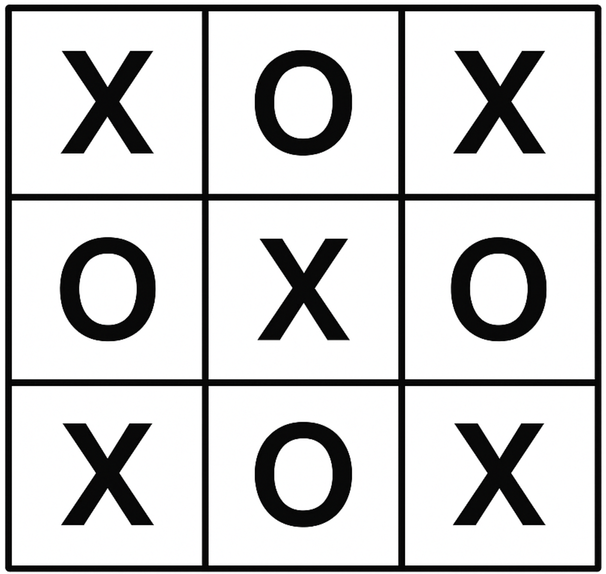
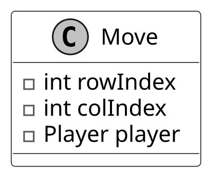
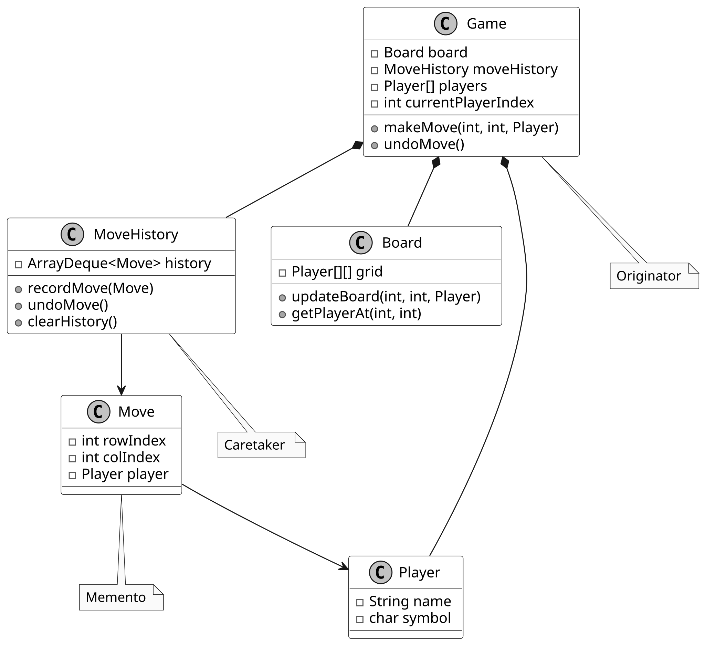

# Design a Tic Tac Toe Game

In this chapter, we will explore the object-oriented design of a Tic-Tac-Toe game. We aim to create an interactive platform where two players alternate turns, placing their symbols on a virtual board. We’ll design key components such as the game board, player move tracking, outcome determination, and a score tracker for managing player ratings.

**How Tic-Tac-Toe Works:** Tic-Tac-Toe is a classic two-player game played on a 3x3 grid. Each player selects a symbol ("X" or "O") and takes turns placing it in an empty cell. The goal is to align three identical symbols horizontally, vertically, or diagonally. The game concludes with a win if a player achieves this alignment, or a draw if all nine cells are filled without a winner.

Let’s gather the key requirements through a mock interview scenario.



*Tic-Tac-Toe*

## Requirements Gathering

Here’s an example of a typical prompt an interviewer might present:

“Imagine you and a friend are sitting down for a quick game of Tic-Tac-Toe. You each choose a symbol (e.g., “X” or “O”) and take turns placing your symbol on a board. After each move, the game checks if someone has won or if the board is full, signaling a draw. Behind the scenes, the game tracks your moves, updates a scoreboard to reflect wins, and maintains player rankings for future matches. Let’s design a Tic-Tac-Toe game system that handles all this.”

### Requirements clarification

Here is an example of how a conversation between a candidate and an interviewer might unfold:

**Candidate:** Does the game support different board sizes?

**Interviewer:** No, let’s stick to the standard 3x3 board for simplicity.

**Candidate:** How should the game handle outcomes like wins, losses, and draws?

**Interviewer:** The system must detect winning patterns and notify players of the result: win, draw, or ongoing.

**Candidate:** Should the game track player ratings?

**Interviewer:** Yes, the game should maintain a score tracker that updates player ratings based on game outcomes (win, loss, or draw).

**Candidate:** How does the game handle invalid moves?

**Interviewer:** If a player attempts a move in an occupied or invalid position, notify them and prompt them for a new move.

Based on this discussion, let’s nail down the key functional requirements.

### Requirements

Here are the key functional requirements we’ve identified.

- The game is played on a 3x3 board.

- The system determines the game’s status:
  
  
  - a win (three identical symbols aligned in a row, column, or diagonal)
  
  - a draw (a full board with no winner)
  
  - In progress.

- A score tracker records player performance, updates ratings based on wins, and supports queries like rankings or top players.

- Invalid moves (e.g., placing a symbol in an occupied cell) are rejected with feedback to the player.

Below are the non-functional requirements:

- The user interface should be intuitive, providing clear feedback for invalid moves and game outcomes, with easily accessible gameplay instructions.

- The system should support future enhancements, such as different board sizes or game modes, without major architectural changes.

## Identify Core Objects

Before diving into the design, it’s important to identify the core objects.

- **Board:** The Board class models the 3x3 game grid where players place their symbols (e.g., "X" or "O"). It handles updates to the grid, checks for a winner by examining rows, columns, and diagonals, and determines if the board is full.

- **Player:** This class represents an individual playing the game.

- **Game:** The central entity of the Tic-Tac-Toe game is the Game class. It coordinates turn-taking between players, validates moves (e.g., ensuring a cell isn’t occupied), and tracks the game’s status, whether it’s in progress or ended with a winner or draw.


**Design choice:** The Game class can become overloaded because it handles multiple
operations. To keep it manageable, we delegate the Board to manage the grid and
ScoreTracker to handle player ratings. This modularity enhances maintainability
and scalability.

- **ScoreTracker:** Tracks player ratings across games, updating them based on outcomes.

Now that we’ve identified the core objects, let’s design their relationships in a class diagram.

## Design Class Diagram

In this section, we’ll define the class structure for a Tic-Tac-Toe game. The goal is to create a cohesive design that adheres to OOD principles, such as the Single Responsibility Principle (SRP), while remaining flexible for future extensions. We’ll also explain the reasoning behind design choices and consider alternatives to provide insight into the decision-making process.

### Game

The Game class is the central coordinator of the Tic-Tac-Toe game. It manages the flow of gameplay, including initializing components, handling turns, and determining the outcome. To keep the design modular and manageable, certain responsibilities are delegated to other classes.

For instance, the ScoreTracker class is solely responsible for tracking player performance, updating win counts based on game outcomes. The Board class manages the game grid, ensuring moves are valid by checking for empty spaces and staying within bounds. The Player class remains stateless. It does not store win counts directly. This separation allows the centralized ScoreTracker to monitor player performance across multiple games, setting the stage for a scalable ranking system, which we’ll explore in more depth later.

Below is the representation of the Game class.


### Board

The Board class represents the 3x3 game grid, which is modeled as a two-dimensional array of Player objects. It is responsible for enforcing game rules at the board level, ensuring that moves are made within valid positions. It determines if a player has won by checking for three matching symbols in a row, column, or diagonal. Additionally, it provides functionality to reset the grid for a new game and allows retrieval of player symbols at specific grid positions.

Here is the design of this class.


**Design choice:** The choice to include win-checking logic within the Board class,
rather than the Game class, aligns with Single Responsibility Principle (SRP),
as the Board is the owner of grid-related rules.

### ScoreTracker

The ScoreTracker class is designed to monitor player performance across multiple games by maintaining a centralized scoreboard for a group of players. While real-world systems often employ complex methods that dynamically adjust scores based on performance distributions and other factors, a more straightforward approach suits an interview setting. Here, we can rate players based solely on their number of wins, keeping the logic straightforward yet effective.

Instead of embedding ratings as an attribute within the Player class, we delegate this responsibility to ScoreTracker. This design choice stems from the nature of ratings: unlike a player’s name (an inherent trait), ratings are contextual, reflecting performance relative to others in a group. They shift as games are played, impacting multiple players simultaneously, and in advanced systems, they may even evolve over time. By isolating this logic in ScoreTracker, we also open the door to future enhancements, such as supporting players in multiple leagues with distinct ratings.

To achieve this, ScoreTracker employs a HashMap<Player, Integer> named playerRatings to store win counts for all players. This centralized structure enables efficient management of the population’s ratings and supports key operations: updating scores after the game ends, identifying the top-ranked player, and determining any player’s rank. This modular approach not only encapsulates rating logic but also enhances maintainability and scalability.

Here is the representation of this class.


When a game ends, the reportGameResult method determines the winner and updates the score tracker. If the game results in a draw, no score changes are made.

### Move

The Move class acts as a straightforward data structure designed to capture a player's move in the game. It stores the row and column indices where the player placed their symbol, along with a reference to the player who made the move.


By bundling these details (row, column, and player) into a single Move object, rather than passing them as separate parameters across various methods, the code becomes more readable and easier to maintain.

### Player

The Player class encapsulates the core attributes of a player in the game: their name and assigned symbol (such as "X" or "O"). These attributes make it simple to identify which player is responsible for a given move.


While it might seem intuitive to include real-world actions like making moves or updating ratings within the Player class, this would violate the Single Responsibility Principle (SRP). In a well-designed system, responsibilities are clearly divided:

- The Board class is the sole source of truth for validating and placing moves on the grid.

- The ScoreTracker class tracks and updates player ratings, as ratings depend on the broader context of a group of players and require uniform updates across all players.

### Complete Class Diagram

Below is the complete class diagram of the Tic-Tac-Toe game:


*Class Diagram of Tic-Tac-Toe*

Let’s now bring our design to life with the code implementation!

## Code - Tic-Tac-Toe Game

In this section, we’ll implement the core functionalities of the Tic-Tac-Toe game, focusing on key areas such as managing the game board, handling player turns, determining the winner, and tracking player ratings through a score tracker.

### Game

The Game class manages the flow of a Tic-Tac-Toe game. It manages the game board, player turns, and score tracker updates. After each move, the game checks for win conditions (three matching symbols in a row, column, or diagonal) and for a draw (when the board is full, but no winner exists).

Check out the code implementation of the Game class below.

```
public class Game {
    // Core game components
    private final Board board; // Manages the game board state
    private final ScoreTracker scoreTracker; // Keeps track of player scores
    private Player[] players; // Array of players in the game
    private int currentPlayerIndex; // Index of the current player's turn

    // Constructor initializes game components and starts a new game
    public Game(Player playerX, Player playerY) {
        board = new Board();
        scoreTracker = new ScoreTracker();
        startNewGame(playerX, playerY);
    }

    // Resets the game state and initializes players for a new game
    public void startNewGame(Player playerX, Player playerY) {
        board.reset();
        players = new Player[] `{playerX, playerY}`;
        currentPlayerIndex = 0;
    }

    // Processes a player's move, validates it, and updates game state
    public void makeMove(int colIndex, int rowIndex, Player player) {
        if (getGameStatus().equals(GameCondition.ENDED)) {
            throw new IllegalStateException("game ended");
        }
        if (players[currentPlayerIndex] != player) {
            throw new IllegalArgumentException("not the current player");
        }
        if (board.getPlayerAt(colIndex, rowIndex) != null) {
            throw new IllegalArgumentException("board position is taken");
        }
        board.updateBoard(colIndex, rowIndex, player);
        final Move newMove = new Move(colIndex, rowIndex, player);
        currentPlayerIndex = (currentPlayerIndex + 1) % players.length;
        if (getGameStatus().equals(GameCondition.ENDED)) {
            scoreTracker.reportGameResult(players[0], players[1], board.getWinner());
        }
    }

    // Determines if the game is in progress or has ended
    public GameCondition getGameStatus() {
        Optional<Player> winner = board.getWinner();
        if (winner.isPresent()) {
            return GameCondition.ENDED;
        }
        return board.isFull() ? GameCondition.ENDED : GameCondition.IN_PROGRESS;
    }

    // Returns the player whose turn it is
    public Player getCurrentPlayer() {
        return players[currentPlayerIndex];
    }

    // Returns the score tracker for accessing game statistics
    public ScoreTracker getScoreTracker() {
        return scoreTracker;
    }
}

```

- **makeMove(int colIndex, int rowIndex, Player player)**: This method handles the player’s move by checking if the game is still ongoing, whether the correct player is making a move, and if the selected board position is empty. If all checks pass, the board is updated, and the turn is passed to the next player. If the move results in a win or a draw, the score tracker is updated accordingly.

- **getGameStatus()**: Determines the game’s status by checking for a winner or a full board. Returns GameCondition.ENDED if either condition is met, otherwise GameCondition.IN_PROGRESS.

**Implementation choice:** The Game class uses a state machine-like approach to manage game flow, tracking the current player and game status (INPROGRESS or ENDED) with an enum (GameCondition). This was chosen for its simplicity and clarity in handling turn-based logic, as it ensures only one player moves at a time and the game stops when a win or draw occurs.

### Board

The Board class represents the game board for a two-player Tic-Tac-Toe game. It uses a 3x3 grid to encapsulate the state of play within a 3x3 grid, where each position holds either a Player object or null if it's empty. The definition of the Board class is given below.

```
public class Board {
    // 3x3 grid to store player moves
    private final Player[][] grid = new Player[3][3];

    // Updates the board with a player's move at the specified position
    public void updateBoard(int colIndex, int rowIndex, Player player) {
        if (grid[colIndex][rowIndex] == null) {
            grid[colIndex][rowIndex] = player;
        }
    }

    // Checks for a winner by examining rows, columns, and diagonals
    public Optional<Player> getWinner() {
        // Check rows for three in a row
        for (int i = 0; i < grid.length; i++) {
            Player first = grid[i][0];
            if (first != null && Arrays.stream(grid[i]).allMatch(p -> p == first)) {
                return Optional.of(first);
            }
        }

        // Check columns for three in a column
        for (int j = 0; j < grid[0].length; j++) {
            final Player first = grid[0][j];
            int finalJ = j; // streams require a final object
            if (first != null && Arrays.stream(grid).allMatch(row -> row[finalJ] == first)) {
                return Optional.of(first);
            }
        }

        // Check main diagonal (top-left to bottom-right)
        Player topLeft = grid[0][0];
        if (topLeft != null
                && IntStream.range(0, grid.length).allMatch(i -> grid[i][i] == topLeft)) {
            return Optional.of(topLeft);
        }

        // Check anti-diagonal (top-right to bottom-left)
        Player topRight = grid[0][grid[0].length - 1];
        if (topRight != null
                && IntStream.range(0, grid.length)
                        .allMatch(i -> grid[i][grid[0].length - 1 - i] == topRight)) {
            return Optional.of(topRight);
        }

        // No winner found
        return Optional.empty();
    }

    // Checks if all positions on the board are filled
    public boolean isFull() {
        return Arrays.stream(grid).flatMap(Arrays::stream).noneMatch(Objects::isNull);
    }

    // Resets the board by clearing all positions
    public void reset() {
        for (Player[] players : grid) {
            Arrays.fill(players, null);
        }
    }

    // Returns the player at the specified position, or null if empty
    public Player getPlayerAt(int colIndex, int rowIndex) {
        return grid[colIndex][rowIndex];
    }
}

```

The class provides several methods to manage the game, including:

- updateBoard(int colIndex, int rowIndex, Player player): Updates the board by placing the specified player's symbol at the given colIndex and rowIndex, provided the position is empty.

- Optional<Player> getWinner(): This method checks for a winner by looking at the rows, columns, and diagonals. If any row, column, or diagonal contains the same symbol, the player is declared the winner.

- Player getPlayerAt(int colIndex, int rowIndex): Returns the Player object at the specified board position, or null if the position is unoccupied.

**Implementation choice:** The Board uses a 2D array (Player[][]) to represent the 3x3 grid, chosen for its direct mapping to the game’s spatial structure and O(1) access time for reading or updating positions.

### Player

The Player class represents a player in the game, with key attributes like their name and symbol. These attributes help identify the player and their move on the board.

```
public class Player {
    private final String name;
    private final char symbol;

    public Player(String name, char symbol) {
        this.name = name;
        this.symbol = symbol;
    }

    public String getName() {
        return name;
    }

    public char getSymbol() {
        return symbol;
    }
}

```

### ScoreTracker

The ScoreTracker class manages player rankings across multiple Tic-Tac-Toe games by tracking and updating scores for a group of players. It uses a HashMap<Player, Integer> to store player ratings, where each Player is mapped to an integer score based on a simple victory count system. Here is the implementation of this class.

```
class ScoreTracker {
    // Stores player ratings in a map where key is player and value is their score
    private HashMap<Player, Integer> playerRatings = new HashMap<>();

    // This logic is customizable and, in reality, will use a complex ranking algorithm. For the
    // interview, we use a simple victory count system where the winner gets one point, the loser
    // loses a point, and no changes occur for a draw.
    public void reportGameResult(Player player1, Player player2, Optional<Player> winningPlayer) {
        if (winningPlayer.isPresent()) {
            Player winner = winningPlayer.get();
            Player loser = player1 == winner ? player2 : player1;
            playerRatings.putIfAbsent(winner, 0);
            playerRatings.put(winner, playerRatings.get(winner) + 1);
            playerRatings.putIfAbsent(loser, 0);
            playerRatings.put(loser, playerRatings.get(loser) - 1);
        }
    }

    // Returns a map of players sorted by their ratings in descending order
    public Map<Player, Integer> getTopPlayers() {
        return playerRatings.entrySet().stream()
                .sorted(Map.Entry.comparingByValue(Comparator.reverseOrder()))
                .map(Map.Entry::getKey)
                .collect(Collectors.toMap(player -> player, player -> playerRatings.get(player)));
    }

    // Returns the rank of a player based on their rating
    public int getRank(Player player) {
        List<Player> sortedPlayers =
                playerRatings.entrySet().stream()
                        .sorted(Map.Entry.comparingByValue(Comparator.reverseOrder()))
                        .map(Map.Entry::getKey)
                        .collect(Collectors.toList());
        return sortedPlayers.indexOf(player) + 1;
    }

    // getters are omitted for brevity
}

```

**Implementation choice:** The ScoreTracker uses a HashMap<Player, Integer> to store player ratings, which is chosen for its O(1) average-case lookup and update performance, making it ideal for frequent score updates and queries (e.g., top-ranked player).

## Deep Dive Topic

At this point, you have met the basic requirements of the question. In this section, we will explore some potential extensions in more detail.

### Implement undo functionality in Tic-Tac-Toe

Imagine you’re playing Tic-Tac-Toe, and you accidentally place your ‘X’ in the wrong spot. Wouldn’t it be great to hit an undo button and try again? Let’s dive into how we can implement undo functionality in a Tic-Tac-Toe game, step by step.

**Step 1: Track move history**

- Every time a player makes a move, we store that move so it can be undone later.

- The Move class (which we've already designed as part of the main game logic) serves this purpose by capturing details such as rowIndex, colIndex, and the player.

Below is the representation of the Move class.



**Step 2: Store Moves with a Stack**

- Since moves occur in a last-in, first-out (LIFO) order (i.e., the last move is undone first), we can use a stack (ArrayDeque<Move>).

- When a move is made, we push it onto the stack.

- When undo is requested, we pop the most recent move from the stack and revert the board to its previous state.

Below is the representation of the MoveHistory class, which records the move and implements the undo functionality.


Here’s the code for the MoveHistory class:

```
class MoveHistory {
    // Stack-like structure to store moves in chronological order
    private final ArrayDeque<Move> history = new ArrayDeque<>();

    // Adds a new move to the history stack
    public void recordMove(Move move) {
        history.push(move);
    }

    // Removes and returns the most recent move from the history
    public Move undoMove() {
        return history.pop();
    }

    // Clears all moves from the history
    public void clearHistory() {
        history.clear();
    }
}

```

**Step 3: Reverse the Board State**

The final step is to clear that spot on the board, and switch the current player back to whoever’s turn it was before.

Here’s the updated code from the Game class:

```
public void makeMove(int colIndex, int rowIndex, Player player) {
    // Validate that game hasn't ended
    if (getGameStatus().equals(GameCondition.ENDED)) {
        throw new IllegalStateException("game ended");
    }
    // Validate that it's the correct player's turn
    if (players[currentPlayerIndex] != player) {
        throw new IllegalArgumentException("not the current player");
    }
    // Validate that the position is not already taken
    if (board.getPlayerAt(colIndex, rowIndex) != null) {
        throw new IllegalArgumentException("board position is taken");
    }
    // Update the board with the player's move
    board.updateBoard(colIndex, rowIndex, player);
    // Record the move in history
    final Move newMove = new Move(colIndex, rowIndex, player);
    moveHistory.recordMove(newMove);
    // Switch to the next player
    currentPlayerIndex = (currentPlayerIndex + 1) % players.length;
    // If game has ended, update the score
    if (getGameStatus().equals(GameCondition.ENDED)) {
        scoreTracker.reportGameResult(players[0], players[1], board.getWinner());
    }
}

// Reverts the last move made in the game
public void undoMove() {
    // Check if game has ended to prevent undoing after winner is reported
    if (getGameStatus().equals(GameCondition.ENDED)) {
        throw new IllegalStateException("game ended and winner already reported");
    }
    // Get the last move from history
    final Move lastMove = moveHistory.undoMove();

    // Update current player index to previous player
    if (currentPlayerIndex == 0) {
        currentPlayerIndex = players.length - 1;
    } else {
        currentPlayerIndex--;
    }

    // Clear the board position of the undone move
    board.updateBoard(lastMove.getColIndex(), lastMove.getRowIndex(), null);
}

```

What we discussed above is the essence of a well-known software design pattern called the **Memento Pattern**.


**Definition:** The Memento Pattern is a behavioral design pattern that allows
an object to save and restore its previous state without exposing the details of
its implementation. This pattern is useful in scenarios where undo or rollback
functionality is needed, as it maintains a complete event history.

In this pattern:

- The Memento is an object that stores the state of another object at a specific point in time, acting as a snapshot. In our design, the Move class served as the Memento, capturing the state of a single move in the Tic-Tac-Toe game.

- The Caretaker is responsible for storing and managing Memento objects, typically keeping them in a collection and providing mechanisms to save or retrieve them. The MoveHistory class played the role of the Caretaker, maintaining a stack of Move objects (Mementos) and offering an undoMove() method to retrieve the last move for reversal.

- The Originator is the object whose state is being captured and restored. It creates Memento objects to save its state and can use them to restore a previous state. The Game class acted as the Originator, creating Move objects during each makeMove() call to capture the move’s state and using the undoMove() method to restore the game state by clearing the board position of the last move.

The UML diagram below illustrates this structure.



*Undo functionality using the memento pattern*

However, one potential challenge of using the Memento Pattern is memory overhead. Every time a move is made, we store the entire move in the history. In Tic-Tac-Toe, this isn't much of a problem because the board is small, but in more complex games with larger states, the memory required to store each memento could become a bottleneck.

With our Tic-Tac-Toe game designed and implemented, let’s wrap up with key takeaways.

## Wrap Up

In this chapter, we designed the Tic-Tac-Toe game. We started by gathering and clarifying the requirements through a series of questions and answers. Next, we identified the core objects involved, designed the class diagram, and implemented the key components of the game.

A key takeaway from this design is the importance of modularity and clear separation of concerns. Each component, such as the Board, Game, Player, and ScoreTracker classes, focuses on a specific responsibility, ensuring the system is maintainable and easy to extend.

In the deep dive section, we explored advanced topics, including using the Memento Pattern to handle undo functionality, enabling players to revert their moves while maintaining the integrity of the game state.

Congratulations on getting this far! Now give yourself a pat on the back. Good job!