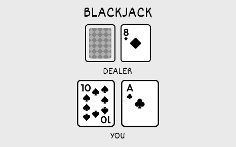
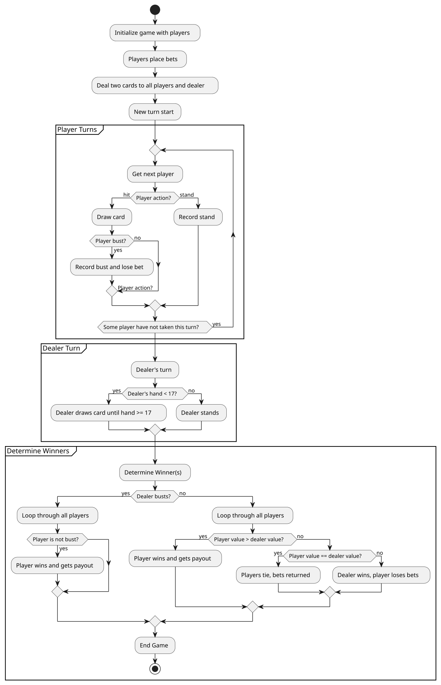
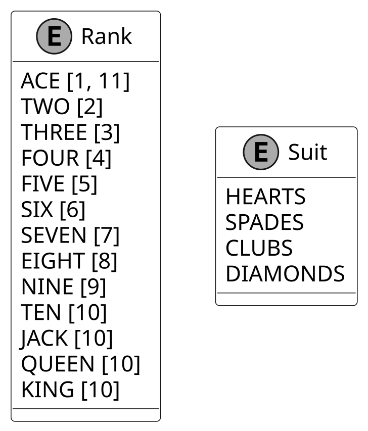
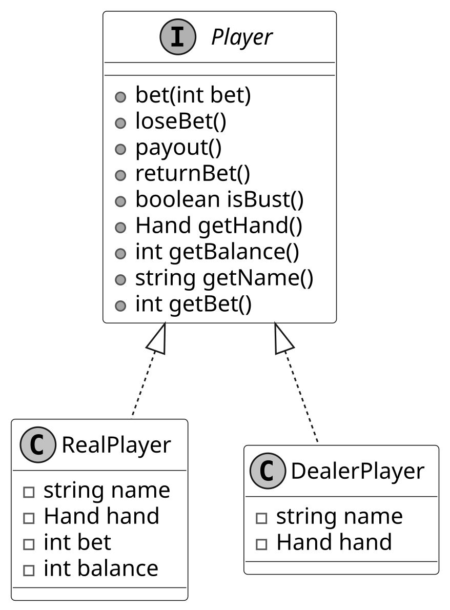
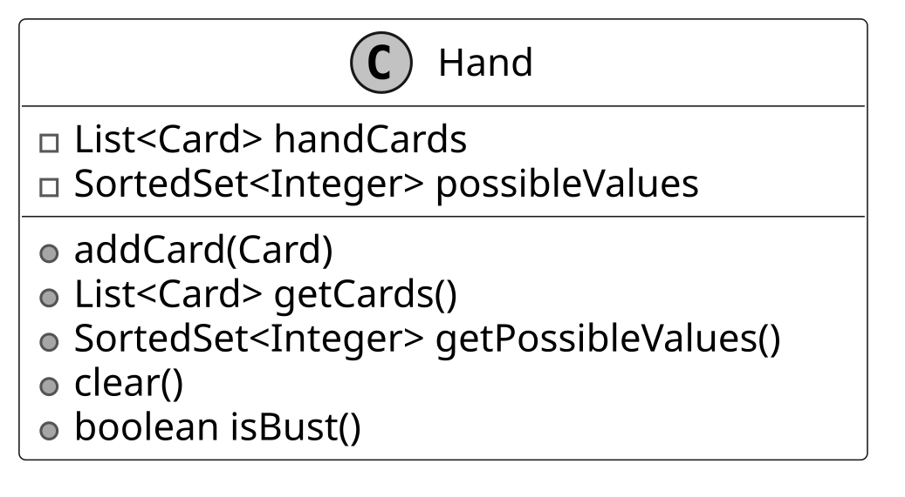
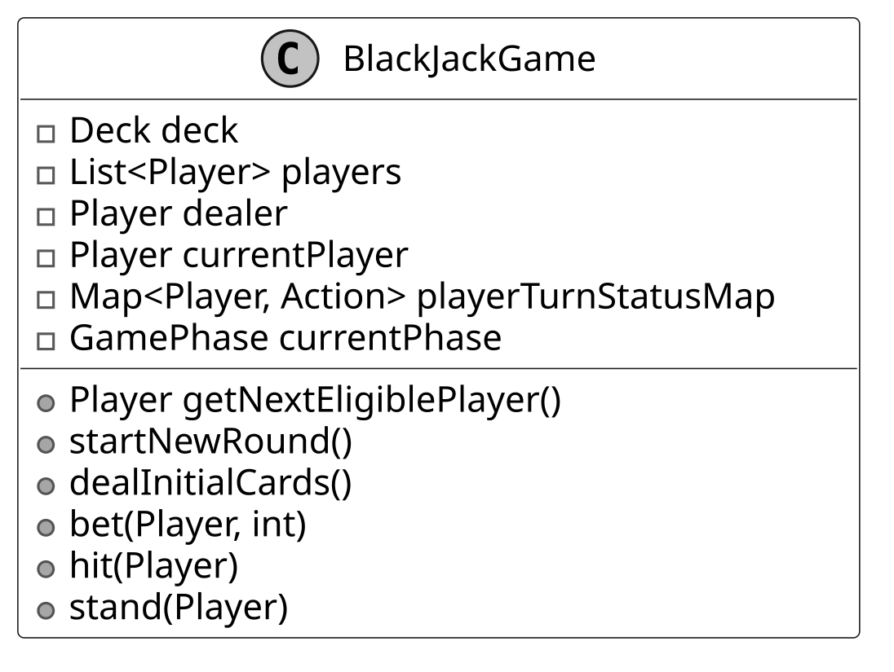

# Design a Blackjack Game

In this chapter, we will discuss the object-oriented design of the Blackjack game (also called “21”). Blackjack is a popular card game where the goal is to get a hand of cards that adds up to 21, or as close as possible, without going over. The game is a mix of strategy (deciding when to hit or stand) and luck (the cards you get), making it a captivating and iconic casino game.

Let’s gather the game’s requirements through a typical interview-style conversation.



*Blackjack Game*

## Requirements Gathering

Here’s an example of a typical prompt an interviewer might present:

“Picture yourself at a casino table, ready to play a round of Blackjack, also known as ‘21.’ At the start, you and other players place bets, and the dealer distributes two cards to each player, including themselves. You evaluate your hand, aiming to get as close to 21 as possible without going over, and decide whether to hit or stand. After all players make their moves, the dealer reveals their hand and hits until reaching at least 17, then stands. Behind the scenes, the game manages a deck of cards, tracks player actions, ensures fair dealing, and updates balances. Let’s design a Blackjack game system that handles all this.”

**Note:** Blackjack has various rules (e.g., soft 17, double down, splitting). This document focuses on the technical design and object-oriented implementation of a simplified standard Blackjack game.

### Requirements clarification

Here is an example of how a conversation between a candidate and an interviewer might unfold:

**Candidate:** Should I design the game to support multiple players or just one player competing against the dealer?

**Interviewer:** The game should support multiple players.

**Candidate:** What happens after a player takes their turn?

**Interviewer:** After each player takes their turn (“hit” or “stand”), the game should check if all players have either stood or busted (hand value exceeding 21). When this happens, the game should determine the winner by comparing each player's hand value and settle the bets.

**Candidate:** Should the dealer follow any specific rules for when to hit or stand?

**Interviewer:** Yes, the dealer should continue to "hit" until their hand totals at least 17. Once they reach 17 or higher, they must "stand."

**Candidate:** How are bets handled in the game, and how are players paid?

**Interviewer:** Players place their bets before the initial cards are dealt. Players who win receive a payout equal to their bet (e.g., a $10 bet wins $10, plus their original bet returned), while players who bust lose their bet.

### Requirements

Based on the conversation, here are the key functional requirements we’ve identified.

- The game should support multiple players and a dealer.

- Players should be dealt two cards at the beginning of the game.

- Players should have the option to "hit" (request an additional card) or "stand" (keep their current hand).

- Aces should be valued as 1 or 11, with the value chosen to optimize the player’s hand.

- After each player’s turn, the game checks if all players have stood or busted. ​​Once all players have completed their turns, the dealer takes their turn, hitting until their hand totals at least 17, then standing. The game then determines the winner and settles the bets.

- Players who win receive a payout equal to their bet (1:1), while players who bust lose their bet.

Below are the non-functional requirements:

- The user interface must be intuitive, with clear prompts and visual feedback on game state to accommodate users with minimal Blackjack experience.

With these requirements in hand, let’s map out the game’s flow using an activity diagram to visualize how it all comes together.

## Activity Diagram

Understanding the flow of a game like Blackjack is crucial when designing its object-oriented structure, especially given the game’s mix of sequential steps and decision points. This is where an activity diagram comes into play. An activity diagram visually maps out the workflow of the game, capturing each action, decision, and transition in a clear, step-by-step manner.

In the context of Blackjack, this means outlining everything from dealing cards to determining winners, ensuring we account for all possible paths, such as a player busting or the dealer hitting until 17. Let’s look at the activity diagram for Blackjack, which captures this process in detail.



*Activity Diagram of Blackjack Game*

Now that we’ve got a clear picture of the game’s flow, let’s break down the core objects we’ll need to bring this design to life.

## Identify Core Objects

As we have done in earlier chapters, let’s enumerate the core objects.

- **BlackJackGame:** The BlackJackGame class acts as the central entity of the game, managing the overall flow from start to finish. It is responsible for dealing cards, tracking player actions (“hit”, or “stand”), and determining the winner.

- **Player:** The Player interface represents each participant in the game, with concrete implementations as RealPlayer for humans tracking bets and balance, and DealerPlayer for the dealer, who does not place bets and must hit until reaching a hand value of 17 or higher, as per Blackjack rules.

- **Hand:** Each player is associated with a Hand class, which manages the cards they receive during the game. This class calculates all possible hand values based on the cards held. This is especially important when handling Aces, which can count to 1 or 11, depending on which value keeps the player’s hand value closer to 21 without exceeding it.

- **Deck:** The Deck class is responsible for managing the collection of cards used in the game. It shuffles the cards when a new round begins and provides a new card when a player requests a hit.

- **Card:** Each individual card is represented by the Card class, which is defined by its Rank and Suit enums. The Rank determines the card’s value in the game, while the Suit provides its identity, such as “Hearts” or “Spades”.

## Design Class Diagram

Now that we know the core objects and their roles, the next step is to create classes and methods to build the Blackjack game.

### Card

The Card class is a straightforward, immutable building block that holds a rank and a suit. It acts as a data-only entity with no behavior. This ensures immutability to prevent accidental changes and maintain game consistency.

*Note*: Immutability means that once a card is created, its rank and suit cannot be changed.

Below is the representation of this class.


The Card class is kept simple, it uses getRankValues() to fetch values from Rank.
It leaves the heavy lifting of value calculations to the Hand class, sticking to
a clean separation of duties. Note that the return value is a list of integers rather
than a single value because Ace has two possible values (1 or 11).


**Design choice:** The Card class is designed as a standalone entity to represent
individual cards, enabling reuse across multiple decks or game variants.

Since Card relies on Rank and Suit to define its value and identity, let’s explore those next.

#### Rank and Suit enumerations

When modeling Rank and Suit, enums are the ideal choice as they’re type-safe, readable, and easy to maintain.

- Rank captures card values: numbers 2 through 10 are worth face value, Jack, Queen, and King are each worth 10, and an Ace can be either 1 or 11, depending on what benefits the hand most.

- Suit lists the standard four options: Hearts, Diamonds, Clubs, and Spades.



*Suit and Rank Enums*


**Design choice: Why enums over other approaches?** Consider using strings instead.
You’d have a lot of flexibility, but that comes at a cost: extra validation to
avoid invalid inputs, messy conversions when calculating hand values, and potentially
higher memory usage. Integers might seem like a better alternative because they
allow simple numeric representation (e.g., 1 for Ace, 10 for Jack), but they’re
error-prone, developers might accidentally assign invalid values like 0 or 15,
and their lack of inherent meaning requires additional checks, reducing the clarity
that enums provide with named constants.

For a card game like Blackjack, where precise values and clear representations are key, enums make the design both robust and easy to follow.

With cards defined, let’s see how they come together in the Deck class.

### Deck

The Deck class serves as the backbone of Blackjack’s card management, handling a standard 52-card deck. It uses a List<Card> to mimic a physical deck’s order, providing essential methods like shuffling to randomize the cards, drawing cards for players, counting the remaining cards, checking if the deck is empty, and resetting for a new round. This reset process shuffles the deck to ensure fair dealing.

Below is the representation of this class:


Now that we’ve got a deck to draw from, let’s define the players who’ll use it.

### Player

The Player interface serves as the blueprint for all participants in Blackjack, laying the foundation for both human players and the dealer. For human players, the RealPlayer class tracks essential details like a player’s name, hand, current bet, and balance, while providing methods for placing bets, receiving payouts, and retrieving key information. DealerPlayer, on the other hand, represents the house (no betting or balance here), just hitting until reaching 17 or higher, per Blackjack rules.

Here is the representation of this interface with concrete classes:



*Player interface with concrete classes*


**Design choice:** An interface-based design for Player is chosen to abstract common
behaviors across human players and the dealer, promoting extensibility.

Now that our players are set, let’s look at how they’ll manage their cards with the Hand class.

### Hand

The Hand class manages the cards for a player or dealer in Blackjack, keeping track of a list of cards and calculating all possible hand values. It smartly handles Aces as either 1 or 11 to keep the hand as close to 21 as possible without going over. To support this, the class offers methods to add cards, access the card list, retrieve the possible values (stored as a sorted set to avoid duplicates), clear the hand for a new round, and determine if the hand is bust using isBust().




**Design choice:** Keeping Hand separate from Player keeps the design clean and
modular by splitting responsibilities: Hand focuses solely on managing the cards
and their values, while Player handles other player-specific details like bets
and balance.

With hands managing cards and totals, let’s see how the BlackjackGame class ties it all together.

### BlackJackGame

The BlackJackGame class is the central entity in our Blackjack game, orchestrating the action from the initial card dealing to the end of each round. It oversees the game’s deck, the players, and the dealer, handling card distribution, tracking turns, and wrapping up rounds by deciding winners and settling bets. To keep things fair, it ensures the dealer keeps hitting until reaching 17, then holds, while players get to choose whether to hit or stand.

Here is the representation of this class.



Now that we’ve detailed our key classes, let’s put them together in a complete class
diagram to see the full picture.

## Complete Class Diagram

Below is the complete class diagram of the Blackjack game:


*Class Diagram of Blackjack*

Let’s turn this design into working code.

## Code - Blackjack

In this section, we will implement the core functionality of the Blackjack game, emphasizing critical components such as deck management for card distribution, turn coordination for players and the dealer, bet resolution, and winner determination through hand value comparison.

### Card

The Card class is a straightforward representation of a playing card, combining a Rank and a Suit. It’s designed to be immutable. Its attributes stay fixed once created. The getRankValues() method retrieves the card's possible values from Rank (e.g., 1 or 11 for an Ace).

Below is the code implementation of this class:

```
public class Card {
    public final Rank rank;
    public final Suit suit;

    public Card(Rank rank, Suit suit) {
        this.rank = rank;
        this.suit = suit;
    }

    public int[] getRankValues() {
        return rank.getRankValues();
    }
}

```

Rank is an enum that defines card values: Aces can be 1 or 11, numbered cards retain their face value, and face cards (Jack, Queen, King) are all worth 10. It stores these values in an array and provides them through getRankValues().

```
public enum Rank {
    ACE(new int[] `{1, 11}`),
    TWO(new int[] `{2}`),
    THREE(new int[] `{3}`),
    FOUR(new int[] `{4}`),
    FIVE(new int[] `{5}`),
    SIX(new int[] `{6}`),
    SEVEN(new int[] `{7}`),
    EIGHT(new int[] `{8}`),
    NINE(new int[] `{9}`),
    TEN(new int[] `{10}`),
    JACK(new int[] `{10}`),
    QUEEN(new int[] `{10}`),
    KING(new int[] `{10}`);

    private final int[] rankValues;

    Rank(int[] rankValues) {
        this.rankValues = rankValues;
    }

    // Returns the possible values for the rank
    public int[] getRankValues() {
        return this.rankValues;
    }
}

```

For Rank, we define Ace with [1, 11] from the start, rather than defaulting to 11 and adjusting later if the hand busts. This allows the Hand class to calculate all possible totals upfront, which is useful for handling multiple Aces.

Suit is a simple enum representing the four standard suits, Hearts, Spades, Clubs, and Diamonds. It acts purely as a label, giving each card its suit without additional logic.

```
public enum Suit {
    HEARTS,
    SPADES,
    CLUBS,
    DIAMONDS
}

```

With cards ready, let’s bundle them into a Deck for gameplay.

### Deck

The Deck class represents a full deck of playing cards and provides essential operations such as shuffling, drawing, and resetting. It maintains a structured collection of Card objects and ensures that cards are drawn in the correct sequence.

Here is the implementation of this class:

```
public class Deck {
    int nextCardIndex = 0;
    List<Card> cards;

    // Constructor initializes the deck
    public Deck() {
        initializeDeck();
    }

    // Initializes the deck with all cards
    private void initializeDeck() {
        cards = new ArrayList<>();
        for (Suit suit : Suit.values()) {
            for (Rank rank : Rank.values()) {
                cards.add(new Card(rank, suit));
            }
        }
        nextCardIndex = 0; // Reset to start drawing from the first card
    }

    // Shuffles the deck using current time as seed
    public void shuffle() {
        Collections.shuffle(cards, new Random(System.currentTimeMillis()));
    }

    // Draws the next card from the deck
    public Card draw() {
        if (isEmpty() || nextCardIndex >= cards.size()) {
            throw new IllegalStateException("No more cards in deck");
        }
        Card drawCard = cards.get(nextCardIndex);
        nextCardIndex++;
        return drawCard;
    }

    // Returns the number of remaining cards in the deck
    public int getRemainingCardCount() {
        return cards.size() - nextCardIndex;
    }

    // Checks if the deck is empty
    public boolean isEmpty() {
        return getRemainingCardCount() == 0;
    }

    // Resets the deck to start drawing from the beginning
    public void reset() {
        nextCardIndex = 0;
    }
    // getter methods are omitted for brevity
}

```

The deck is initialized by pairing each Suit with every Rank, creating a complete set of 52 cards. These cards are stored in a List<Card>, which provides an efficient way to manage them.

**Implementation choice:** Instead of removing cards when drawn, the deck tracks the next available card using nextCardIndex. This avoids the costly list operation of removing elements from an ArrayList, which requires shifting all remaining elements (O(n) complexity. By simply incrementing an index, drawing a card becomes an O(1) operation, improving performance.

Now that we’ve got cards flowing from the deck, let’s see how they land in a player’s Hand.

### Hand

The Hand class is responsible for managing a player's cards and computing possible hand totals, particularly when dealing with Aces, which can be worth 1 or 11. To achieve this, it maintains a List<Card> for tracking the cards in the hand and a SortedSet<Integer> to store all possible hand values dynamically.

When a new card is added via addCard(), it updates both the list of cards and the possible hand values. Handling Aces correctly is crucial:

- If the card is an Ace, both 1 and 11 are introduced as potential hand values.

- If it's a non-Ace, its value is added to every existing total, generating all possible hand values.

This approach precomputes all valid hand scores upfront, avoiding unnecessary recalculations during gameplay and ensuring that multiple Aces are handled efficiently.

```
public class Hand {
    final List<Card> handCards = new ArrayList<>();

    // Sorted set of all possible hand values, accounting for Ace flexibility (1 or 11).
    final SortedSet<Integer> possibleValues = new TreeSet<>();

    public Hand() {}

    // Adds a card to the hand and updates the set of possible total values.
    // For Aces (1 or 11), computes all combinations with existing totals; for other cards, adds
    // their value to each total.
    public void addCard(Card card) {
        if (card == null) {
            throw new IllegalArgumentException("Cannot add null card to hand");
        }
        handCards.add(card);

        // card.getRankValues() returns [1, 11] for Aces or a single value (e.g., [10]) for others.
        if (possibleValues.isEmpty()) {
            // Initialize with the card's values
            for (int value : card.getRankValues()) {
                possibleValues.add(value);
            }
        } else {
            // Add all possible card values to each existing total
            SortedSet<Integer> newPossibleValue = new TreeSet<>();
            for (int value : possibleValues) {
                for (int cardValue : card.getRankValues()) {
                    newPossibleValue.add(value + cardValue);
                }
            }
            possibleValues.clear();
            possibleValues.addAll(newPossibleValue);
        }
    }

    // Returns an unmodifiable list of cards in the hand
    public List<Card> getCards() {
        return Collections.unmodifiableList(handCards);
    }

    // Returns an unmodifiable sorted set of possible hand values
    public SortedSet<Integer> getPossibleValues() {
        return Collections.unmodifiableSortedSet(possibleValues);
    }

    // Clears the hand and possible values
    public void clear() {
        handCards.clear();
        possibleValues.clear();
    }

    // Checks if the hand is bust (all possible values > 21)
    public boolean isBust() {
        // check if all possible value of the player's hand is busted
        if (possibleValues.isEmpty()) {
            return false;
        } else {
            return possibleValues.first() > 21;
        }
    }
}

```

The isBust() method determines whether a player has exceeded 21. It evaluates the lowest value in possibleValue, and if all options are above 21, the hand is considered bust. This is a critical check that immediately signals when a player is out of the game.

**Implementation strategy:** Handling Aces efficiently is the biggest challenge in Blackjack hand management. Instead of recalculating Ace values dynamically each time a hand is evaluated, the Hand class precomputes all possible totals upfront. This allows for faster, more efficient scoring and ensures that Blackjack’s unique Ace logic is handled seamlessly without requiring mid-game adjustments.

**Data structure choice:** A SortedSet (implemented as TreeSet) is used for possibleValues to maintain sorted hand values, enabling O(log n) insertion and O(1) access to the lowest value for isBust(). Alternatively, a HashSet offers O(1) insertion but lacks sorting, requiring O(n) to find the minimum. Similarly, a List could store values but would need O(n) for sorting or searching, which is less efficient for frequent checks in Blackjack’s fast-paced gameplay.

With hands tracking cards and totals, let’s define the Players who’ll hold them.

### Player

In Blackjack, players fall into two distinct categories: human players, who place bets and manage their funds, and the dealer, who follows fixed rules and does not participate in betting. The Player interface and its concrete implementations, RealPlayer and DealerPlayer, provide a structured way to model these roles.

Below is the implementation of this interface.

```
public interface Player {
    void bet(int bet);

    void loseBet();

    void returnBet();

    void payout();

    boolean isBust();

    Hand getHand();

    int getBalance();

    String getName();

    int getBet();
}

```

The RealPlayer class models a human player who engages in betting and managing their funds. It implements the Player interface, ensuring that bet handling is managed separately from the core game logic. When placing a bet, the bet() method ensures that the bet does not exceed the player's available balance before deducting the amount.

To maintain a clear separation of concerns, RealPlayer does not handle card evaluation directly. Instead, it delegates all card-related operations to the Hand class. This ensures that the player's bet handling and card logic remain separate, making the class more modular and maintainable.

```
public class RealPlayer implements Player {
    private final String name;
    private final Hand hand;
    private final int bet;
    private final int balance;

    public RealPlayer(String name, int startBalance) {
        this.name = name;
        this.hand = new Hand();
        this.bet = 0;
        this.balance = startBalance;
    }

    // Places a bet for the player
    @Override
    public void bet(int bet) {
        if (bet > balance) {
            throw new IllegalArgumentException("Bet is greater than balance");
        }
        this.bet = bet;
        this.balance -= bet;
    }

    // Handles the player losing a bet
    @Override
    public void loseBet() {
        this.bet = 0;
    }

    // Handles returning the player's bet
    @Override
    public void returnBet() {
        this.balance += bet;
        this.bet = 0;
    }

    // Handles the player winning a payout
    @Override
    public void payout() {
        this.balance += bet * 2; // Return bet plus equal amount
        this.bet = 0;
    }

    // getter methods are omitted for brevity
}

```

The DealerPlayer class represents the house and follows predefined rules that differ from those of human players. Since the dealer does not participate in betting, the bet-handling methods, bet(), and loseBet() are implemented as empty functions, as they are never invoked in gameplay. Similarly, getBalance() and getBet() always return 0, reflecting the fact that the dealer does not manage a balance or place bets.

```
public class DealerPlayer implements Player {
    private final String name = "Dealer";
    private final Hand hand;

    public DealerPlayer() {
        this.hand = new Hand();
    }

    // Bet-handling methods for Dealer (bet, loseBet, returnBet) are implemented as empty functions.

    @Override
    public void payout() {
        // Dealer does not get a payout, so this method only prints the winning hand
    }
    // getter methods are omitted for brevity
}

```

With players and their hands set, let’s orchestrate the whole game in BlackJackGame.

### BlackjackGame

The BlackJackGame class serves as the central orchestrator of the game, handling players, the dealer, the deck, turn management, and enforcing the game rules. It ensures that the game follows a structured flow, with each player's actions and the final outcome being resolved according to the rules of Blackjack.

Below is the implementation of this class.

```
public class BlackJackGame {
    private final Deck deck = new Deck();
    private final List<Player> players = new ArrayList<>();
    protected final Player dealer = new DealerPlayer();
    private Player currentPlayer = null;

    // Tracks the current status of each player's turn (e.g., HIT or STAND)
    Map<Player, Action> playerTurnStatusMap = new HashMap<>();
    GamePhase currentPhase = GamePhase.STARTED;

    public BlackJackGame(List<Player> players) {
        for (Player player : players) {
            if (player == null) throw new IllegalArgumentException();
            this.players.add(player);
            this.playerTurnStatusMap.put(player, null);
        }
        this.playerTurnStatusMap.put(dealer, null);
        deck.shuffle(); // Shuffle the deck when game starts
    }

    // Determines the next player who can take an action (i.e., has not stood or bust). If the
    // current player is the dealer, it triggers the dealer's turn.
    public Player getNextEligiblePlayer() {
        // If current player hasn't stood or bust, they can continue their turn
        if (currentPlayer != null
                && !Action.STAND.equals(playerTurnStatusMap.get(currentPlayer))
                && !currentPlayer.isBust()) {
            return currentPlayer;
        }

        // Find the first player who hasn't stood or bust
        if (currentPlayer == null) {
            for (Player player : players) {
                if (!Action.STAND.equals(playerTurnStatusMap.get(player)) && !player.isBust()) {
                    currentPlayer = player;
                    return currentPlayer;
                }
            }
        }

        // else, find the next player after the current one who hasn't stood or bust
        int currentPlayerIndex = players.indexOf(currentPlayer);
        for (int i = currentPlayerIndex + 1; i < players.size(); i++) {
            Player player = players.get(i);
            if (!Action.STAND.equals(playerTurnStatusMap.get(player)) && !player.isBust()) {
                if (currentPlayer == dealer) {
                    if (!Action.STAND.equals(playerTurnStatusMap.get(dealer))) dealerTurn();
                    return currentPlayer;
                }
                currentPlayer = player;
                return currentPlayer;
            }
        }

        // If no players are left to act, return null
        return null;
    }

    protected void dealerTurn() {
        // Dealer hits if below 17
        while (dealer.getHand().getPossibleValues().last() < 17) {
            Card newDraw = deck.draw();
            dealer.getHand().addCard(newDraw);
        }
        playerTurnStatusMap.put(dealer, Action.STAND);
        checkGameEndCondition();
    }

    public void startNewRound() {
        deck.reset();
        for (Player player : playerTurnStatusMap.keySet()) {
            player.getHand().clear(); // Clear player's hand
        }
        dealer.getHand().clear(); // Clear dealer's hand
        // Reset all turn statuses to null
        playerTurnStatusMap.replaceAll((p, v) -> null);
        currentPlayer = null; // Reset current player
        currentPhase = GamePhase.STARTED;
    }

    public void dealInitialCards() {
        if (!GamePhase.BET_PLACED.equals(currentPhase)) {
            throw new IllegalStateException("All players must bet before dealing");
        }
        // Deal first card to each real player in order
        for (Player player : players) {
            player.getHand().addCard(deck.draw());
        }
        // Deal first card to dealer
        dealer.getHand().addCard(deck.draw());
        // Deal second card to each real player in order
        for (Player player : players) {
            player.getHand().addCard(deck.draw());
        }
        // Deal second card to dealer
        dealer.getHand().addCard(deck.draw());
        currentPhase = GamePhase.INITIAL_CARD_DRAWN;
    }

    public void bet(Player player, int bet) {
        if (!GamePhase.STARTED.equals(currentPhase)) {
            throw new IllegalStateException("Bets must be placed at the start of the round");
        }
        player.bet(bet);
        // Transition to BET_PLACED once all players have bet
        if (players.stream()
                .filter(p -> !(p instanceof DealerPlayer))
                .allMatch(p -> p.getBet() > 0)) {
            currentPhase = GamePhase.BET_PLACED;
        }
    }

    public void hit(Player player) {
        if (Action.STAND.equals(playerTurnStatusMap.get(player))) {
            throw new IllegalStateException("Player has already stood");
        }
        if (player.isBust()) {
            throw new IllegalStateException("Player is already bust");
        }

        Card drawnCard = deck.draw();
        player.getHand().addCard(drawnCard);
        playerTurnStatusMap.put(player, Action.HIT);
    }

    public void stand(Player player) {
        if (Action.STAND.equals(playerTurnStatusMap.get(player))) {
            throw new IllegalStateException("Player has already stood");
        }
        if (player.isBust()) {
            throw new IllegalStateException("Player is already bust");
        }
        playerTurnStatusMap.put(player, Action.STAND);
    }

    // Checks if the game has ended (all players done), then resolves bets by comparing each
    // player's hand to the dealer's.
    private void checkGameEndCondition() {
        boolean allPlayersDone =
                players.stream()
                        .allMatch(
                                p -> Action.STAND.equals(playerTurnStatusMap.get(p)) || p.isBust());
        if (!allPlayersDone) {
            return;
        }

        int dealerValue = dealer.getHand().getPossibleValues().last();
        boolean dealerBusts = dealer.isBust();

        for (Player player : players) {
            if (player.isBust()) {
                player.loseBet();
            } else {
                int playerValue = player.getHand().getPossibleValues().last();
                if (dealerBusts || playerValue > dealerValue) {
                    player.payout();
                } else if (playerValue == dealerValue) {
                    player.returnBet();
                } else {
                    player.loseBet();
                }
            }
        }
        currentPhase = GamePhase.END;
    }

    // getter methods are omitted for brevity
}

```

- Each round begins with startNewRound(), which resets the deck, ensuring that players start with a clean slate.

- Once the round starts, players place their bets using the bet() method, then dealInitialCards() distributes two cards per player, including the dealer. This guarantees a fair and structured start before betting and player actions begin.

- The game progresses through player turns using getNextEligiblePlayer(), which selects the next active player who has not yet stood or busted. Once all players have finished their turns, control shifts to the dealer via dealerTurn().

The dealer follows strict, predefined rules:

- The dealer must hit until their total reaches at least 17.

- Once at 17 or higher, the dealer must stand.

Players can take two primary actions during their turn:

- hit(): Draws a card and updates the player's hand. If the player exceeds 21, they are marked as bust, eliminating them from further action.

- stand(): Locks in the player's hand, preventing further draws.

The checkGameEndCondition() method finalizes the round once all players have stood or busted. It compares each player’s hand individually against the dealer’s:

- If the dealer busts (hand exceeds 21), non-bust players win and receive a payout.

- For non-bust players, if their hand value exceeds the dealer’s (but is ≤ 21), they win and are paid out. If it’s lower, they lose their bet. In the case of a tie, return the bet to the player.

Now that we’ve built a working game, let’s explore how we can make it more flexible for future changes

## Deep Dive Topic

At this point, you’ve nailed the core requirements of the Blackjack game. This section will dive deeper into a potential extension to make the design more adaptable.

### Decoupling player and dealer decision logic

In the current design, BlackJackGame directly controls player actions, calling hit() or stand() based on predefined conditions in the game logic. Similarly, the dealer’s "hit until 17" rule is hardcoded into dealerTurn(). This approach tightly couples decision-making with the game class, leaving little room for custom moves. Any rule modification, such as allowing a cautious player to stand at 12 or adjusting the dealer’s hit threshold, requires modifying BlackJackGame, leading to complex maintenance and potential bugs.

To resolve this, we introduce a decision-making abstraction that shifts control to individual players. This keeps BlackJackGame focused on coordinating turns, while each player determines their moves independently.

**Step 1: Define a decision-making interface**

To give each player control over their moves, we create a PlayerDecisionLogic interface with one method, decideAction(Hand), that picks ‘Hit’ or ‘Stand’ based on the hand.

```
public interface PlayerDecisionLogic {
    // Decides the next action for a player based on their hand
    Action decideAction(Hand hand);
}

```

**Step 2: Tailor decisions for humans and dealers**

With the interface in place, we implement two concrete decision classes:

- RealPlayerDecisionLogic: This captures a human player’s approach, say, hitting if the hand’s below 16.

- DealerDecisionLogic: This locks in the dealer’s rule, hit if under 17.

Here’s the code:

```
public class RealPlayerDecisionLogic implements PlayerDecisionLogic {
    @Override
    public Action decideAction(Hand hand) {
        return hand.getPossibleValues().last() < 16 ? Action.HIT : Action.STAND;
    }
}

public class DealerDecisionLogic implements PlayerDecisionLogic {
    @Override
    public Action decideAction(Hand hand) {
        return hand.getPossibleValues().last() < 17 ? Action.HIT : Action.STAND;
    }
}

```

**Step 3: Integrate decisions into players**

We update the Player interface with a getDecisionLogic() method, letting each player define its decision style. RealPlayer defaults to RealPlayerDecisionLogic, while DealerPlayer uses DealerDecisionLogic:

```
public interface Player {
    // Returns the decision logic for the player
    PlayerDecisionLogic getDecisionLogic(); // ... other methods …
}

public class RealPlayer implements Player {
    private final PlayerDecisionLogic decisionLogic;

    public RealPlayer(String name, int startBalance) {
        this.name = name;
        this.hand = new Hand();
        this.bet = 0;
        this.balance = startBalance;
        this.decisionLogic = new RealPlayerDecisionLogic();
    }

    // Returns the decision logic for the player
    @Override
    public PlayerDecisionLogic getDecisionLogic() {
        return decisionLogic;
    }
    // ... other methods ...
}

public class DealerPlayer implements Player {
    private final PlayerDecisionLogic decisionLogic;

    public DealerPlayer() {
        this.hand = new Hand();
        this.decisionLogic = new DealerDecisionLogic();
    }

    // Returns the decision logic for the dealer
    @Override
    public PlayerDecisionLogic getDecisionLogic() {
        return decisionLogic;
    }
    // ... other methods ...
}

```

**Step 4: Adjust the game flow**

In this step, we refactor the BlackJackGame code to use decision logic for both players and the dealer, streamlining the turn sequence. We introduce the performPlayerAction() method, which queries each player’s decision logic (RealPlayerDecisionLogic or DealerDecisionLogic) to decide whether to hit or stand. This replaces the hardcoded dealerTurn() method, integrating the dealer into the same flow as the players.

We also add the playNextTurn() method to coordinate turns, relying on getNextEligbilePlayer() to determine who acts next.

Here’s the updated code:

```
public class BlackJackGame {
    // ... fields unchanged ...

    // Find the next player who can take an action
    public Player getNextEligiblePlayer() {
        // No current player: find first eligible player from the start
        if (currentPlayer == null) {
            for (Player player : players) {
                if (!Action.STAND.equals(playerTurnStatusMap.get(player)) && !player.isBust()) {
                    currentPlayer = player;
                    return currentPlayer;
                }
            }
            // Instead of calling dealerTurn(), check if the dealer can act
            if (!Action.STAND.equals(playerTurnStatusMap.get(dealer))) {
                currentPlayer = dealer;
                return dealer;
            }
        } else {
            int currentIndex = players.indexOf(currentPlayer);
            for (int i = currentIndex + 1; i < players.size(); i++) {
                Player player = players.get(i);
                if (!Action.STAND.equals(playerTurnStatusMap.get(player)) && !player.isBust()) {
                    currentPlayer = player;
                    return currentPlayer;
                }
            }
            // If all players are done, check if the dealer can act
            if (currentPlayer != dealer && !Action.STAND.equals(playerTurnStatusMap.get(dealer))) {
                currentPlayer = dealer;
                return dealer;
            }
        }
        return null; // All turns are complete, including the dealer's
    }

    // Executes the next turn by acting for the next player or dealer.
    public void playNextTurn() {
        Player nextPlayer = getNextEligiblePlayer();
        if (nextPlayer != null) {
            performPlayerAction(nextPlayer);
        }
    }

    // Performs the action decided by the player's decision logic (hit or stand).
    public void performPlayerAction(Player player) {
        Action action = player.getDecisionLogic().decideAction(player.getHand());
        if (action == Action.HIT) {
            hit(player);
        } else if (action == Action.STAND) {
            stand(player);
        }
    }
    // ... other methods unchanged, dealerTurn() removed ...
}

```

The getNextEligiblePlayer() method now handles the full turn sequence: it returns the next player who hasn’t stood or busted, then the dealer once all players are done, and finally null when the dealer has stood, ending the turns. While dealerTurn() is removed, its logic lives on in DealerDecisionLogic, ensuring the dealer hits until 17 or higher.

This design shifts decision-making to the players, letting BlackJackGame coordinate turns while each player’s logic lives separately. If you’ve heard of the Strategy Pattern, you might notice this follows it, defining a set of decision rules that can swap in and out. Here:

- PlayerDecisionLogic sets the decision contract.

- RealPlayerDecisionLogic and DealerDecisionLogic are the specific behaviors.

- BlackJackGame uses them without needing to handle decisions internally.

*Note*: To learn more about the Strategy Pattern and its common use cases, refer to the **[Parking Lot](./04-design-a-parking-lot.md)** chapter.

## Wrap Up

In this chapter, we have built a solid Blackjack game from the ground up, with the key takeaway being how we structured responsibilities across Card, Deck, Hand, Player, and BlackJackGame into a clear, well-organized design. Each piece does its job, for instance, Card holds the essentials, Deck shuffles and deals, Hand tracks totals, and BlackJackGame runs the show. This approach keeps the game logical, easy to follow, and scalable.

We also took things further by decoupling decision-making with PlayerDecisionLogic, making it easy to swap strategies for players and the dealer. If you’re familiar with the Strategy pattern, you’ll recognize how it is applied here, giving the game flexibility without rewrites.

Congratulations on getting this far! Now give yourself a pat on the back. Good job!