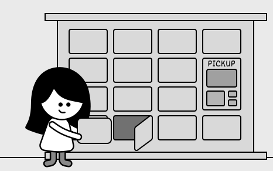
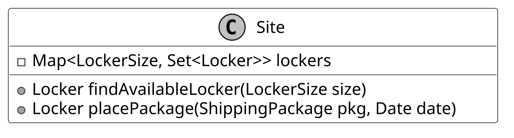
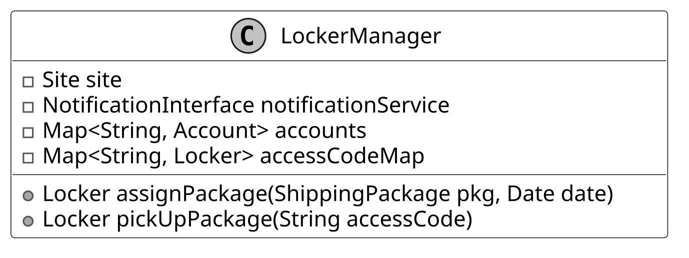
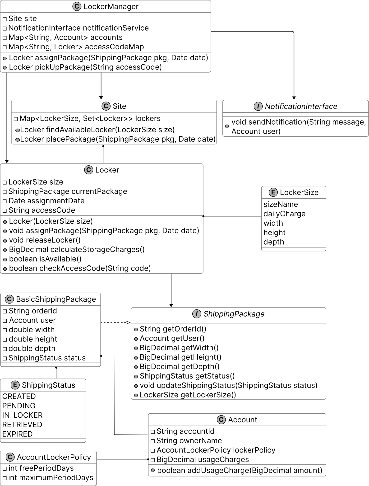
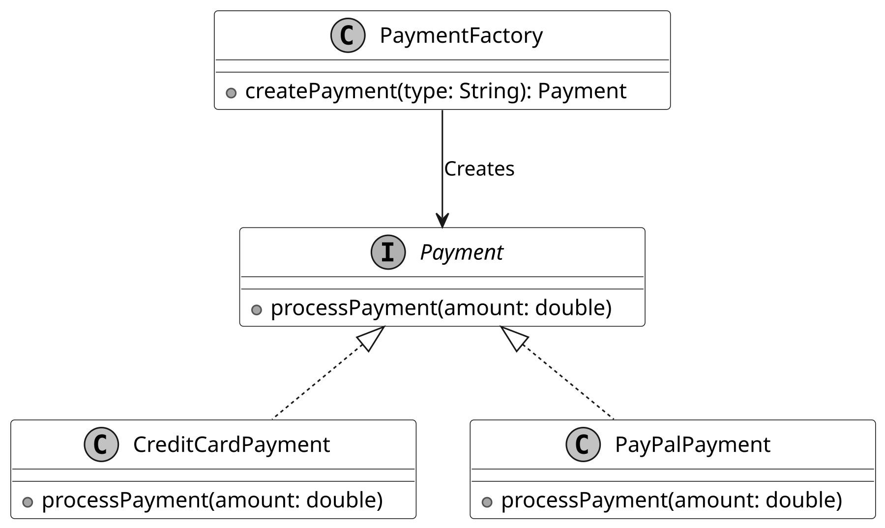

# Design a Shipping Locker System

In this chapter, we will design a Shipping Locker system similar to UPS, FedEx, or Amazon Locker. It offers customers a convenient and secure way to pick up their online orders. The system manages locker availability, assigns incoming packages to appropriate lockers, and ensures a smooth package retrieval process for customers.

To realize this vision of a convenient and secure locker system, let’s explore what it needs to do.



*Shipping Locker System*

## Requirements Gathering

The first step in designing a shipping locker system is to clarify the requirements and narrow down the scope. Here is an example of a typical prompt an interviewer might give:

“Imagine you’ve just received a notification that your online order has been delivered to a shipping locker near you. You head to the locker, enter a secure access code, and instantly, the door pops open, revealing your package. Behind the scenes, the system has already managed locker availability, assigned an appropriately sized compartment, and ensured a seamless pickup experience. Now, let’s design a shipping locker system that can do all of this.”

### Requirements clarification

Here is an example of how a conversation between a candidate and an interviewer might unfold:

**Candidate:** Does the system support multiple locker sizes?

**Interviewer:** Yes, the system has lockers of different sizes. The design should ensure packages are assigned to the smallest available locker that fits, optimizing space use.

**Candidate:** So, what happens when a package gets to the locker, and how does the customer end up picking it up?

**Interviewer:** When a package arrives, the system finds an open locker that’s the right size and assigns it there. Once the package is tucked inside, the customer gets a notification with the locker’s location and a unique access code. They just punch in the code to pop the locker open, grab their package, and that frees up the locker for the next delivery.

**Candidate:** Is there a time limit or any fees for using the locker?

**Interviewer:** Good question. That’s actually a big part of how the system works. We’ve got a locker policy that gives customers a ‘Free Period’, a set number of days during which they can use the locker for free. Once that’s up, we start charging a daily fee based on the locker’s size. And if the package sits there past a ‘Maximum Period,’ which is also predefined, one of our staff members steps in, pulls it out, and clears the locker for someone else.

**Candidate:** Since the system tracks locker usage costs through the locker policy, does it handle payments too?

**Interviewer:** For simplicity’s sake, we let an external service take care of the actual payment processing. That’s not something the system itself has to worry about.

### Requirements

Here are the key functional requirements we’ve identified.

- The system should keep track of all lockers and support different locker sizes.

- The system should smartly assign lockers by matching package size to the smallest available option that fits, keeping things efficient.

- Customers should be able to pop open their assigned locker with a unique access code.

- The system should monitor storage costs based on the customer’s locker policy, factoring in the daily rate tied to that specific locker size.

Below are the non-functional requirements:

- The system should handle a high volume of locker operations per site without performance degradation, accommodating busy locations.

- The system must maintain high availability, ensuring lockers are accessible to customers and staff at all times.

Now that we’ve outlined the system’s needs, let’s pinpoint the building blocks to fulfill them.

## Identify Core Objects

Before diving into the design, it’s important to identify the core objects.

- **Locker:** This class represents an individual locker.

- **Site:** This class represents a locker facility that consists of multiple lockers of various sizes. It is responsible for managing the collection of lockers and organizing them by size.

- **ShippingPackage:** An interface defining the standard for packages, with BasicShippingPackage as its concrete implementation, tracking details like order ID, dimensions, and status.

- **Account:** This class represents customers and their associated accounts. Customers own packages stored in lockers, and their accounts store policy information for free and maximum storage periods, along with their current balance.

## Design Class Diagram

Now that we know the core objects and their roles, the next step is to create classes and methods that turn the requirements into an easy-to-maintain system. Let’s take a closer look.

### Locker

The Locker class represents a physical storage unit for holding packages. It includes the following attributes:

- **LockerSize size:** Represents the size of the locker.

- **ShippingPackage currentPackage:** Stores the package currently assigned to the locker.

- **Date assignmentDate:** Tracks the date when the package was placed in the locker.

- **String accessCode:** A unique security code required for package retrieval.

Below is the representation of this class.


It provides functionalities such as assigning a package to the locker, releasing
the locker upon package retrieval, calculating storage charges based on usage duration,
determining locker availability, and ensuring secure access through code verification.


**Design choice:** The Locker class is designed as a standalone entity to encapsulate
the state and behavior of an individual locker, ensuring modularity and ease of
maintenance.

### LockerSize

The LockerSize enum represents the predefined sizes of lockers available in the system. Each size is associated with specific attributes that define its dimensions and daily usage charge.

- **String sizeName**: A label identifying the locker size (e.g., 'Small,' 'Medium,' 'Large').

- **BigDecimal dailyCharge**: The cost per day for using a locker of a specific size (“Small,” “Medium,” or “Large”).

- **BigDecimal width, height, depth**: The physical dimensions of the locker, determining its capacity to accommodate different package sizes.


**Design choice:** We use an enum here because locker sizes, such as Small, Medium,
and Large, are a fixed set of options that don’t change during runtime, ensuring
type safety and simplicity.

### Site

The Site class models a physical location containing a collection of lockers, organized by their size.

Key functionalities include:

- **Locker findAvailableLocker(LockerSize size):** This method searches for an empty locker that matches the exact size you need, like "small," "medium," or "large."

- **Locker placePackage(ShippingPackage pkg, Date date):** This method takes a package, finds it a locker that fits, and locks it inside. It also keeps track of when the package was placed there and updates the package’s status.



The lockers at each site are managed using a map-based structure, where the key is
a LockerSize and the value is a set of lockers for that size. This structure allows
quick access to available lockers based on their size.

### ShippingPackage

We have modeled ShippingPackage as an interface to establish a standard for all package types within the locker system. It defines key methods that any package type must implement to ensure compatibility with locker storage and retrieval processes. The BasicShippingPackage class is a concrete implementation of the ShippingPackage interface. It represents a standard package intended for storage in a locker.

The ShippingStatus enum defines a fixed set of valid states for a package’s lifecycle in the locker system, such as PENDING, STORED, and RETRIEVED. This enum ensures that package status updates are consistent and restricted to predefined values, enhancing type safety.

The UML diagram below illustrates this structure.


*ShippingPackage interface and ShippingStatus enum*


**Design choice:** Modeling ShippingPackage as an interface allows for extensibility,
enabling the system to support diverse package types (e.g., fragile or perishable)
without modifying core logic.

### Account

The Account class represents a customer using the locker system. It maintains the customer’s balance for locker-related charges and is associated with an AccountLockerPolicy, which defines terms for free usage limits and maximum storage duration. This ensures that charges are applied in accordance with the policy.


The class provides functionality to add funds to the account.


**Design choice:** By associating an AccountLockerPolicy, it supports flexible
billing rules based on customer policies. This separation of customer and policy
data enhances maintainability and allows for personalized locker usage terms.

### AccountLockerPolicy

This class defines the rules and policies for locker usage associated with an account. It includes the number of days during which locker usage is free (freePeriodDays) and the maximum number of days a package can remain in the locker before it must be cleared (maximumPeriodDays). Here is the representation of this class.


### NotificationInterface

Defines the contract for sending notifications. It includes a single method, sendNotification, which takes a message and an account as parameters.


Implementations of this interface manage user notifications, such as alerts for package
pickup availability and locker usage fees.


**Best practices:** In OOD interviews, external systems like notifications are
often represented as interfaces to keep the design flexible and scalable while
avoiding unnecessary complexity.

### LockerManager

The LockerManager class is responsible for managing package storage and retrieval at a specific site, ensuring that packages are assigned to suitable lockers based on size availability. It works with the following components:

- **Site site:** Represents the physical location of the lockers.

- **NotificationInterface notificationService:** Sends notifications to customers when their packages are assigned to a locker or ready for pick-up.

- **Map<String, Account> accounts**: Maintains a mapping of account IDs to user accounts for managing locker usage and charges.

- **Map<String, Locker> accessCodeMap:** Maintains a mapping of access codes to lockers, allowing for quick retrieval during package pick-up.




**Design choice:** The LockerManager class is designed as a facade to simplify
interactions between core objects, providing a single point of control for package
assignment and retrieval.

### Complete Class Diagram

Below is the complete class diagram of the shipping locker service:



*Class Diagram of Locker Service*

With the class diagram as our guide, let’s bring the system to life through code.

## Code - Shipping Locker Service

After completing the class diagram, the interviewer might ask you to implement key components of the shipping locker system. In this section, we’ll implement essential classes that handle locker operations, package assignments, and notifications.

### Locker and LockerSize

The Locker class represents an individual locker unit. Each locker has a fixed size (an instance of LockerSize) and maintains details about the currently stored package, including the assignment date and a randomly generated access code for secure retrieval.

This class provides functionalities for:

- Assigning a package to a locker, recording the assignment date, and generating a secure access code.

- Calculating storage charges based on the number of days the package has been stored and the locker’s daily rate, according to its size.

- Once the package is picked up, make the locker available for future use.

Below is the implementation of this class.

```
public class Locker {
    // Size of the locker
    private final LockerSize size;
    // Currently stored package
    private ShippingPackage currentPackage;
    // Date when the current package was assigned
    private Date assignmentDate;
    // Access code for retrieving the package
    private String accessCode;

    public Locker(LockerSize size) {
        this.size = size;
    }

    // Assigns a package to this locker and generates an access code
    public void assignPackage(ShippingPackage pkg, Date date) {
        this.currentPackage = pkg;
        this.assignmentDate = date;
        this.accessCode = generateAccessCode();
    }

    // Releases the locker by removing the current package and its details
    public void releaseLocker() {
        this.currentPackage = null;
        this.assignmentDate = null;
        this.accessCode = null;
    }

    // Calculates storage charges based on usage duration and policy
    public BigDecimal calculateStorageCharges() {
        if (currentPackage == null || assignmentDate == null) {
            return BigDecimal.ZERO;
        }

        AccountLockerPolicy policy = currentPackage.getUser().getLockerPolicy();
        long totalDaysUsed =
                (new Date().getTime() - assignmentDate.getTime()) / (1000 * 60 * 60 * 24);

        // Check if exceeds maximum period
        if (totalDaysUsed > policy.getMaximumPeriodDays()) {
            currentPackage.updateShippingStatus(ShippingStatus.EXPIRED);
            throw new MaximumStoragePeriodExceededException(
                    "Package has exceeded maximum allowed storage period of "
                            + policy.getMaximumPeriodDays()
                            + " days");
        }

        // Calculate chargeable days (excluding free period)
        long chargeableDays = Math.max(0, totalDaysUsed - policy.getFreePeriodDays());
        return size.dailyCharge.multiply(new BigDecimal(chargeableDays));
    }

    // Checks if the locker is available for new packages
    public boolean isAvailable() {
        return currentPackage == null;
    }

    // Verifies if the provided access code matches the locker's code
    public boolean checkAccessCode(String code) {
        return this.accessCode != null && accessCode.equals(code);
    }

    // getter and setter methods are omitted for brevity
}

```

The LockerSize enum defines different locker sizes, each with an associated daily charge rate and physical dimensions (width, height, and depth). These predefined sizes allow the system to categorize lockers and ensure packages are placed in appropriately sized compartments.

```
public enum LockerSize {
    // Small locker with 10x10x10 dimensions and $5 daily charge
    SMALL(
            "Small",
            new BigDecimal("5.00"),
            new BigDecimal("10.00"),
            new BigDecimal("10.00"),
            new BigDecimal("10.00")),
    // Medium locker with 20x20x20 dimensions and $10 daily charge
    MEDIUM(
            "Medium",
            new BigDecimal("10.00"),
            new BigDecimal("20.00"),
            new BigDecimal("20.00"),
            new BigDecimal("20.00")),
    // Large locker with 30x30x30 dimensions and $15 daily charge
    LARGE(
            "Large",
            new BigDecimal("15.00"),
            new BigDecimal("30.00"),
            new BigDecimal("30.00"),
            new BigDecimal("30.00"));

    // Name of the locker size
    final String sizeName;
    // Daily charge for using this size locker
    final BigDecimal dailyCharge;
    // Width of the locker in inches
    final BigDecimal width;
    // Height of the locker in inches
    final BigDecimal height;
    // Depth of the locker in inches
    final BigDecimal depth;

    // Creates a new locker size with specified dimensions and charges
    LockerSize(
            String sizeName,
            BigDecimal dailyCharge,
            BigDecimal width,
            BigDecimal height,
            BigDecimal depth) {
        this.sizeName = sizeName;
        this.dailyCharge = dailyCharge;
        this.width = width;
        this.height = height;
        this.depth = depth;
    }
    // getter methods are omitted for brevity
}

```

**Implementation choice:** You might have noticed that we have used BigDecimal for dailyCharge and dimensions in the LockerSize enum to ensure precision in financial calculations, unlike float or double, which could introduce rounding errors.

### Site

The Site class represents a physical location containing multiple lockers, organized by size for efficient storage management. It maintains a collection of lockers grouped by size, treating lockers of the same size as interchangeable. This means any available locker of a given size can store a package, simplifying locker assignment.

To efficiently manage lockers, the class uses a map-based structure, where:

- Each key is a LockerSize, representing a specific locker category ("Small," "Medium," "Large").

- Each value is a Set<Locker>, containing all lockers of that size.

This design allows the system to quickly find an available locker and assign packages accordingly.

Here is the implementation of this class.

```
public class Site {
    // Map of locker sizes to sets of lockers of that size
    final Map<LockerSize, Set<Locker>> lockers = new HashMap<>();

    // Creates a new site with specified number of lockers for each size
    public Site(Map<LockerSize, Integer> lockers) {
        for (Map.Entry<LockerSize, Integer> entry : lockers.entrySet()) {
            Set<Locker> lockerSet = new HashSet<>();
            for (int i = 0; i < entry.getValue(); i++) {
                lockerSet.add(new Locker(entry.getKey()));
            }
            this.lockers.put(entry.getKey(), lockerSet);
        }
    }

    // Finds an available locker of the specified size
    public Locker findAvailableLocker(LockerSize size) {
        for (Locker locker : lockers.get(size)) {
            if (locker.isAvailable()) {
                return locker;
            }
        }
        return null;
    }

    // Places a package in an available locker of appropriate size
    public Locker placePackage(ShippingPackage pkg, Date date) {
        // Determine the smallest locker size that can fit this package
        LockerSize size = pkg.getLockerSize();
        Locker locker = findAvailableLocker(size);
        if (locker != null) {
            locker.assignPackage(pkg, date);
            pkg.updateShippingStatus(ShippingStatus.IN_LOCKER);
            return locker;
        }
        throw new NoLockerAvailableException(
                "No locker of size " + size + " is currently available");
    }
}

```

- findAvailableLocker(LockerSize size): Locates and returns an available locker of the specified size.

- placePackage(ShippingPackage pkg, Date date): A convenience method that finds an available locker and assigns the package in one step. If no locker is available, it returns `null`.

**Implementation choice:** While the same result could be achieved by separately calling findAvailableLocker() and then manually assigning a package, providing helper methods such as placePackage() is beneficial. It provides atomic transaction-like behavior by encapsulating the find-and-assign operations in a single method call, ensuring thread safety and preventing inconsistent states that could occur if these operations were performed separately.

### BasicShippingPackage

The BasicShippingPackage class represents a standard package within the locker system, implementing the ShippingPackage interface. It encapsulates essential package details such as order ID, user account, dimensions (width, height, depth), and shipping status. These attributes allow the system to determine where the package can be stored.

Here is the implementation of this class.

```
public class BasicShippingPackage implements ShippingPackage {
    // Unique identifier for the order
    private final String orderId;
    // User account associated with this package
    private final Account user;
    private final BigDecimal width;
    private final BigDecimal height;
    private final BigDecimal depth;
    // Current status of the package
    private ShippingStatus status;

    // Creates a new shipping package with specified dimensions
    public BasicShippingPackage(
            String orderId, Account user, BigDecimal width, BigDecimal height, BigDecimal depth) {
        this.orderId = orderId;
        this.user = user;
        this.width = width;
        this.height = height;
        this.depth = depth;
        this.status = ShippingStatus.CREATED;
    }

    // Returns the current package status
    @Override
    public ShippingStatus getStatus() {
        return status;
    }

    // Updates the package status
    @Override
    public void updateShippingStatus(ShippingStatus status) {
        this.status = status;
    }

    // Determines the smallest locker size that can fit this package
    @Override
    public LockerSize getLockerSize() {
        for (LockerSize size : LockerSize.values()) {
            if (size.getWidth().compareTo(width) >= 0
                    && size.getHeight().compareTo(height) >= 0
                    && size.getDepth().compareTo(depth) >= 0) {
                return size;
            }
        }
        throw new PackageIncompatibleException("No locker size available for the package");
    } // getter methods are omitted for brevity
}

```

A key functionality of this class is determining the appropriate locker size for a package. The getLockerSize() method evaluates all available locker sizes ("Small," "Medium," "Large") and returns the smallest suitable locker based on the package’s dimensions.

Additionally, the updateShippingStatus() method allows the locker system to communicate status updates (e.g., when a package is stored or retrieved) to the user.

### Account and AccountLockerPolicy

The Account class represents a user’s account within the locker system. It stores basic account details, including the accountId, ownerName, the current usage charges, and the user’s lockerPolicy (an instance of AccountLockerPolicy), which defines the user-specific rules for locker usage.

The account usageCharges is used to track locker usage fees, and funds can be added dynamically using the addUsageCharge(BigDecimal amount) method.

```
public class Account {
    private final String accountId;
    private final String ownerName;
    // Policy defining locker usage rules for this account
    private final AccountLockerPolicy lockerPolicy;
    // Total charges accumulated for locker usage
    private BigDecimal usageCharges = new BigDecimal("0.00");

    // Creates a new account with specified details and policy
    public Account(String accountId, String ownerName, AccountLockerPolicy lockerPolicy) {
        this.accountId = accountId;
        this.ownerName = ownerName;
        this.lockerPolicy = lockerPolicy;
    }

    // Adds a charge to the account's total usage charges
    public void addUsageCharge(BigDecimal amount) {
        usageCharges = usageCharges.add(amount);
    }

    // getter methods are omitted for brevity
}

```

The AccountLockerPolicy class encapsulates the rules for locker usage. It specifies:

- freePeriodDays: The number of days a user can store a package without incurring charges.

- maximumPeriodDays: The maximum number of days a package can remain in a locker before further action is required (e.g., additional charges or forced retrieval).

This policy allows customized locker usage limits, ensuring that different users can have varying storage privileges based on their account settings.

Check out the implementation of this class.

```
public class AccountLockerPolicy {
    // Number of days of free storage
    final int freePeriodDays;
    // Maximum number of days a package can be stored
    final int maximumPeriodDays;

    // Creates a new locker policy with specified free and maximum periods
    public AccountLockerPolicy(int freePeriodDays, int maximumPeriodDays) {
        this.freePeriodDays = freePeriodDays;
        this.maximumPeriodDays = maximumPeriodDays;
    }
    // getter methods are omitted for brevity
}

```

### LockerManager

The LockerManager class acts as a facade for the overall locker system. It serves as the central coordinator for the locker system, coordinating package assignments to lockers, package pick-ups, and locker releases. It interacts with Site, which oversees the locker inventory and handles the actual placement of packages in available lockers. The NotificationInterface is responsible for sending user notifications regarding package assignments and pickups.

Additionally, it maintains a Map<String, Account> to store customer accounts, which are used to track locker usage charges. To ensure secure and efficient package retrieval, it uses a Map<String, Locker> to map access codes to their corresponding lockers.

Below is the implementation of this class.

```
public class LockerManager {
    // The site being managed
    private final Site site;
    // Service for sending notifications
    private final NotificationInterface notificationService;
    // Map of account IDs to account objects
    private final Map<String, Account> accounts;
    // Map of access codes to lockers
    private final Map<String, Locker> accessCodeMap = new HashMap<>();

    // Creates a new locker manager for a site
    public LockerManager(
            Site site, Map<String, Account> accounts, NotificationInterface notificationService) {
        this.site = site;
        this.accounts = accounts;
        this.notificationService = notificationService;
    }

    // Assigns a package to an available locker
    public Locker assignPackage(ShippingPackage pkg, Date date) {
        Locker locker = site.placePackage(pkg, date);
        if (locker != null) {
            accessCodeMap.put(locker.getAccessCode(), locker);
            notificationService.sendNotification(
                    "Package assigned to locker" + locker.getAccessCode(), pkg.getUser());
        }
        return locker;
    }

    // Processes package pickup using an access code
    public Locker pickUpPackage(String accessCode) {
        Locker locker = accessCodeMap.get(accessCode);
        if (locker != null && locker.checkAccessCode(accessCode)) {
            try {
                BigDecimal charge = locker.calculateStorageCharges();
                ShippingPackage pkg = locker.getPackage();
                locker.releaseLocker();
                pkg.getUser().addUsageCharge(charge);
                pkg.updateShippingStatus(ShippingStatus.RETRIEVED);
                return locker;
            } catch (MaximumStoragePeriodExceededException e) {
                locker.releaseLocker();
                return locker;
            }
        }
        return null;
    }
    // getter methods are omitted for brevity
}

```

- assignPackage(ShippingPackage pkg, Date date): Assigns a package to an available locker via site.placePackage().

- pickUpPackage(String accessCode): Retrieves the package if the provided access code matches the stored locker. It then:
  
  
  - Calculates charges based on locker usage duration.
  
  - Updates the user’s usage charges.
  
  - Releases the locker and marks the package as retrieved.


**Best practices:** In complex systems, a manager class like LockerManager is commonly
used to centralize operations such as package assignment, retrieval, and notifications.
However, to maintain a thin manager class, it is essential to delegate low-level
operations, such as finding available lockers, storing packages, and enforcing
locker policies, to specialized classes like Site and Locker.

## Deep Dive Topic

Now that the basic design is complete, the interviewer might ask you some deep dive questions. Let’s check out some of these.

### Designing an extensible locker creation system

Currently, lockers are created directly based on predefined sizes, which makes the system rigid and difficult to extend. For example, if we need to introduce a new locker size (e.g., XLARGE) or a specialized locker type (e.g., temperature-controlled lockers), we would have to modify multiple parts of the codebase where lockers are instantiated manually. This increases maintenance overhead and reduces flexibility.

To address this, we can use the Factory design pattern to centralize the creation logic for different types of lockers, making the system more modular and extensible.

*Note*: To learn more about the Factory Pattern and its common use cases, refer to the **[Further Reading](#further-reading-factory-design-pattern)** section at the end of this chapter.

Here is the code for the LockerFactory class.

```
class LockerFactory {
    // Creates a new locker of the specified size
    public static Locker createLocker(LockerSize size) {
        return switch (size) {
            case SMALL -> new Locker(LockerSize.SMALL);
            case MEDIUM -> new Locker(LockerSize.MEDIUM);
            case LARGE -> new Locker(LockerSize.LARGE);
            case XLARGE -> new Locker(LockerSize.XLARGE);
        };
    }
}

```

Here’s how a LockerFactory class enhances the locker system:

- **Centralized object creation:** The LockerFactory encapsulates the locker instantiation process, so any changes to locker creation (e.g., adding new sizes or types) are localized to this class.

- **Extensibility:** If we need to add new locker sizes or types in the future, the factory class can be easily updated, without modifying core business logic in other parts of the system.

- **Improved readability and maintainability:** Using a factory method to create lockers allows us to separate locker creation from locker usage logic, aligning with the Single Responsibility Principle.

### Decoupling event handling with an event-driven approach

Currently, the LockerManager directly invokes NotificationInterface.sendNotification() to notify customers when key events occur, such as package assignment or locker expiration. While this approach works, it tightly couples LockerManager with the notification system, meaning any changes to how notifications are sent require modifying LockerManager itself.

How can we improve the system design to make event handling more flexible and scalable?

To decouple event handling from LockerManager, we can use an event-driven approach where multiple components can subscribe to and respond to system events dynamically. Instead of directly calling sendNotification(), LockerManager will broadcast events to registered observers, ensuring a more modular and extensible system.

By implementing the Observer pattern, we can send notifications to customers or administrative staff when certain events occur, such as when a package is delivered or a locker exceeds its maximum usage period.

*Note*: To learn more about the Observer Pattern and its common use cases, refer to the **[Elevator System](./08-design-an-elevator-system.md)** chapter.

Instead of hardcoding the notification logic in the LockerManager, the locker system can maintain a list of observers. These observers can be various notification services (e.g., email, SMS) or other systems (e.g., analytics, metrics). When a key event occurs, the LockerManager can notify all registered observers, allowing the system to be easily extended without modifying the core logic.

Below is the implementation of the relevant interface and classes for the observer pattern.

- **Subject**: LockerManagerChange, which maintains a list of observers and notifies them of state changes, such as package assignments.

```
class LockerManagerChange {
    // List of observers that will be notified of locker events
    private final List<LockerEventObserver> observers = new ArrayList<>();

    public void addObserver(LockerEventObserver observer) {
        observers.add(observer);
    }

    public void removeObserver(LockerEventObserver observer) {
        observers.remove(observer);
    }

    private void notifyObservers(String message, Account account) {
        for (LockerEventObserver observer : observers) {
            observer.update(message, account);
        }
    }

    // Assigns a package to an available locker and notifies observers.
    public void assignPackage(ShippingPackage pkg) {
        Locker locker = assignLockerToPackage(pkg);
        if (locker != null) {
            notifyObservers("Package assigned to locker", pkg.getUser());
        }
    }

    private Locker assignLockerToPackage(ShippingPackage pkg) {
        return null;
    }
}

```

- **Observer**: The LockerEventObserver interface, which defines the update() method that observers must implement to handle notifications.

```
// Interface for objects that need to be notified of locker events
public interface LockerEventObserver {
    // Updates the observer with a message and the affected account
    void update(String message, Account account);
}

```

- **Concrete Observers**: Classes like EmailNotification, which implement LockerEventObserver to send email alerts for specific events, enabling flexible and extensible event handling.

```
// Implementation of LockerEventObserver that sends email notifications
class EmailNotification implements LockerEventObserver {
    // Updates the observer with a message and sends it to the account owner
    public void update(String message, Account account) {
        // send email to account owner
    }
}

```

## Wrap Up

In this chapter, we designed a Shipping Locker System. We began by clarifying requirements through a structured Q&A discussion, similar to an interviewer-candidate exchange. From there, we identified core objects and developed a class diagram to represent the system's structure. We implemented the key components of the locker service, bringing the design to life.

In the deep dive section, we explored advanced topics, including how the Factory Pattern simplifies locker instantiation for future scalability and how the Observer Pattern decouples event handling, enabling flexible notifications.

Congratulations on getting this far! Now give yourself a pat on the back. Good job!

## Further Reading: Factory Design Pattern

This section gives a quick overview of the design patterns used in this chapter. It’s helpful if you’re new to these patterns or need a refresher to better understand the design choices.

### Factory design pattern

The Factory Method Pattern is a creational design pattern that provides an interface for creating instances of a class but allows subclasses to alter the type of objects that will be created.

In the shipping locker system, we use the Factory pattern through the LockerFactory class to centralize locker creation, enabling easy addition of new locker sizes (e.g., XLARGE) without modifying existing code. To illustrate the Factory pattern in another domain, the following example uses an e-commerce payment system.

**Problem**

Imagine building an e-commerce payment system that initially supports only credit card payments, with logic tied to a CreditCardPayment class. As demand grows for new payment options like digital wallets or cryptocurrency, adding them requires altering multiple parts of the tightly coupled codebase, increasing maintenance effort, and reducing flexibility.

**Solution**



*Factory design pattern*

The Factory Method pattern addresses this by replacing direct object creation (using the new operator) with a factory method that encapsulates instantiation. This allows new payment types to be added via subclasses without changing existing code, decoupling payment processing from the main system for better scalability and maintainability.

**When to use**

The factory design pattern is particularly useful in the following scenarios:

- Use the Factory Method when the specific types and dependencies of objects required by your code are unknown in advance.

- Use the Factory Method to allow users of your library or framework to extend its internal components without modifying existing code.

- Use the Factory Method to optimize resource utilization by reusing existing objects rather than creating new instances each time.