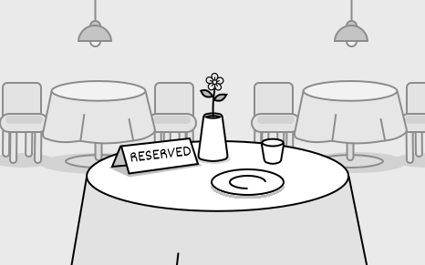
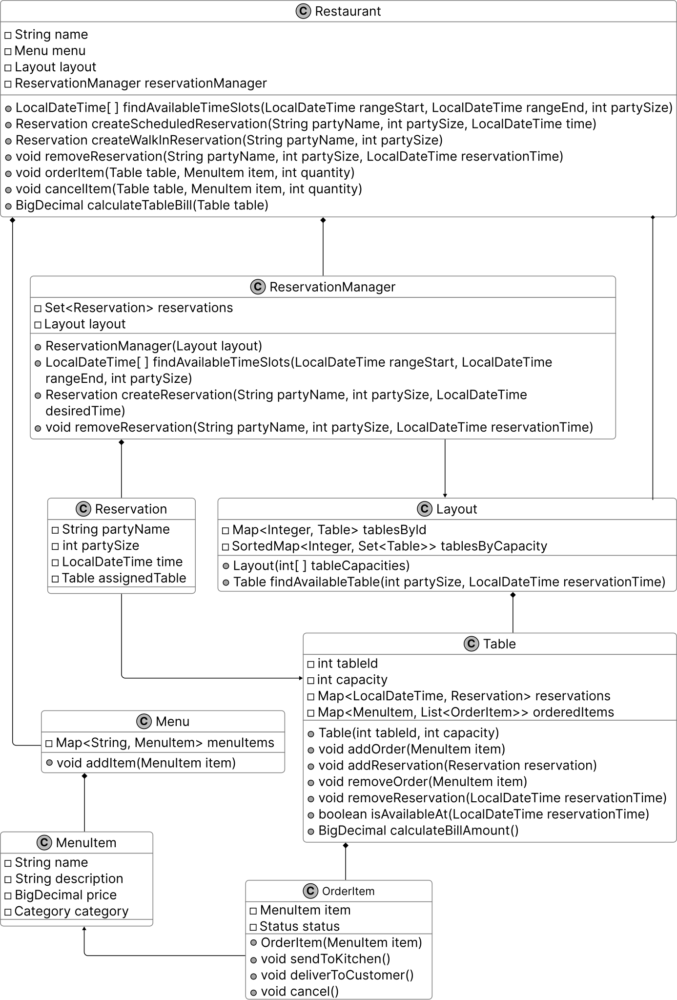

# Design a Restaurant Management System

In this chapter, we will explore the design of a Restaurant Management System. The goal is to create classes that represent the system’s essential components, such as menus, reservations, and tables. We will develop a system that supports critical functions like booking reservations, managing orders, and assigning tables, ensuring the design is both straightforward and flexible for future enhancements.



*Restaurant reservation*

## Requirements Gathering

The first step in designing a Restaurant Management System is to clarify the requirements and define the scope. Here’s an example of a typical prompt an interviewer might present:

“Picture yourself planning a dinner outing on a Friday night. You call the restaurant to reserve a table for your group, check available times, and secure a spot. When you arrive, the staff assigns your party to the reserved table, takes your order, and later presents the bill. Behind the scenes, the system is smoothly handling table reservations, tracking orders, and calculating costs. Now, let’s design a Restaurant Management System that manages all of this.”

### Requirements clarification

Here is an example of how a conversation between a candidate and an interviewer might unfold:

**Candidate**: Let’s start by setting the scope. I assume the system manages reservations, menu, order tracking, and payments. For now, I focus on reservations and order management. Does that work?

**Interviewer**: That’s a reasonable starting point

**Candidate**: Does the system allow customers to make and manage their reservations?

**Interviewer**: Yes, customers can book tables for a future date and time based on availability.

**Candidate**: How does the system determine if a table is available for a reservation?

**Interviewer**: It checks for a table that fits the party size and is free at the requested time. Each reservation reserves a table for exactly one hour, so it’s available if no other booking overlaps with that hour.

**Candidate**: Does the system let customers cancel a reservation after making it?

**Interviewer**: Yes, customers can cancel reservations.

**Candidate**: When a party with a reservation arrives, do they automatically get their reserved table?

**Interviewer**: Yes, they do. They arrive with their name, and the system uses it to find their reservation, which already has a table assigned to it.

**Candidate**: What happens when a walk-in party arrives for dine-in without prior reservation?

**Interviewer**: The system should assign walk-in parties to tables based on current availability and their party size.

**Candidate**: Does the system allow orders to be altered or removed after they’re placed?

**Interviewer**: Yes, you can remove items or adjust their quantities.

**Candidate**: Does the system track the status of orders?

**Interviewer**: Yes, it keeps track of their progress.

**Candidate**: Are there rules for splitting the bill at checkout?

**Interviewer**: For now, just present a single total bill amount.

### Requirements

Based on the questions and answers, we can now list the functional requirements for our restaurant management system.

**Reservations**

- Customers can book tables for a future date and time based on availability.

- Each reservation reserves a table for exactly one hour.

- The system checks if a table is free at the requested time with no overlapping bookings.

- The system assigns a table to a reservation, and customers get it when they arrive using their name.

- Customers can cancel reservations.

**Walk-in seating**

- The system assigns walk-in parties to tables based on current availability and party size.

**Order management**

- The system allows orders to be altered or removed after they’re placed.

- The system tracks the progress of orders.

**Billing**

- The system presents a single total bill amount at checkout.

Below are the non-functional requirements:

- The system should handle increased traffic during busy periods (e.g., weekend evenings) without performance degradation, supporting concurrent users seamlessly.

With these requirements, we are ready to model the objects for the core system.

## Identify Core Objects

Let’s identify the core objects of the restaurant management system.

- **Menu:** Represents the restaurant’s menu, storing a collection of available items for ordering.

- **MenuItem:** This object models an individual item on the menu, encapsulating details such as its name and price. Each MenuItem is a building block of the Menu, used when staff place orders for a table.

- **Layout:** This object represents the restaurant’s physical arrangement, organizing all tables efficiently to support quick and effective assignment for both walk-ins and reservations.

- **Table:** This object models an individual table in the restaurant, holding details such as its capacity, current reservations, and active orders.

- **Reservation:** This object represents a single reservation, storing details like the party name, party size, and reserved time, along with the assigned table.

- **ReservationManager:** ​​This object oversees all restaurant reservations, managing their creation, lookup, and cancellation to ensure accurate and efficient booking. It checks table availability for free time slots and works with Layout to assign tables, keeping reservations well-scheduled and tracked.

- **Restaurant:** This acts as a facade, providing a central interface to manage the system’s key functionalities: reservations, table assignments, orders, and bill calculations. We keep its logic lightweight by delegating tasks like scheduling reservations to ReservationManager, assigning tables to Layout, and managing orders to Table, ensuring it coordinates actions without performing the underlying operations itself.

## Design Class Diagram

You’re set to dive into the heart of the object-oriented design interview: crafting classes and interfaces, shaping data and state through attributes, wrapping logic in methods, and linking your classes with clear relationships.

Below, we detail each class, its purpose, and its responsibilities, ensuring a clear separation of concerns.

### Menu

The Menu class represents the restaurant’s menu, storing menu items in a map with names as keys to quickly retrieve them for ordering. It separates menu data from the Restaurant and Table classes, enabling Table to order items by holding a collection of MenuItem objects that list all available choices.

Below is the representation of this class.


### MenuItem

The MenuItem defines each item on the menu, holding its name, description, price, and category for use in orders. The Menu class uses these items to provide the list of choices, and the Table class records them as ordered items for order management and updates. The Category enum assigns each item a type, such as main course, appetizer, or dessert, to group them on the menu.

The UML diagram below illustrates this structure.


*MenuItem class and Category enum*

### Table

The Table class models restaurant tables. Some of the attributes, like capacity and tableId, rarely change. But other attributes, like reservations and orderedItems, associated with the table represent current-state data that changes over time.

Its purpose is to oversee a table’s current use, tying into the Layout class for availability checks and the OrderItem class to handle what’s being served. It includes methods to add or remove orders, tally up bills, and check availability at specific times.

Here is the representation of this class.


### Layout

The Layout class oversees all restaurant tables, organizing them by ID and capacity to pinpoint the right one for each booking. Its purpose is to streamline table assignments, working with ReservationManager to match parties to available tables and relying on Table to confirm free slots. It handles this by finding a table that fits the party size and is available at the requested time, keeping the process efficient.


**Design choice:** We isolate table organization in the Layout class to optimize
assignment efficiency and separate it from menu and order logic managed by the
Menu and Table classes. Alternatively, integrating table assignment into the Restaurant
class could simplify the design but would overburden its facade role, mixing high-level
coordination with low-level table management.

Below is the representation of the Layout class.


### OrderItem

The OrderItem class represents each item a customer orders, linking it to a specific MenuItem to provide details like price for the Table class. Its purpose is to track the status of ordered items, allowing the Table class to calculate costs accurately and add or remove items as requested. The class is created when customers place orders, using the Status enum, set to values like pending or delivered, to indicate the item’s current state.

The UML diagram below illustrates this structure.


*OrderItem class and Status enum*

### ReservationManager

The ReservationManager class handles reservation scheduling by finding available times, creating reservations, and processing cancellations. It stores all Reservation objects and uses a reference to the Layout class to manage table assignments. This reference enables the class to verify table availability and assign suitable tables for each reservation based on party size and time.

Below is the representation of this class.


### Reservation

The Reservation class represents a single booking managed by the ReservationManager class, storing the party name, number of people, reservation time, and assigned table. It serves to hold all details of a reservation, enabling the ReservationManager class to schedule and cancel bookings effectively.


The class is contained within ReservationManager as one of its entries, maintaining a structured and accessible set of reservation data.

### Restaurant

The Restaurant class serves as the primary interface and facade for the restaurant management system. It coordinates core user-facing operations, such as managing reservations, assigning tables, processing orders, and handling checkout.

It simplifies access to these features by delegating tasks to other classes:

- The class relies on ReservationManager to schedule and cancel reservations.

- The class uses Layout through ReservationManager to identify available tables for assignments.

- The class depends on Menu to supply items for orders.

- The class directs order and billing actions to the Table for processing.

This delegation keeps the Restaurant class focused and manageable, organizing the system into distinct components that ensure clarity and ease of maintenance through a structured use of composition.


**Design choice:** We structure the Restaurant as a facade to unify system operations,
delegating tasks to maintain a clean interface and modularity. We can design the
Restaurant class as a central controller managing all logic internally, but that
would increase its complexity and reduce scalability by centralizing responsibilities.

Below is the representation of this class.


Next, we’ll connect these objects in a class diagram to visualize their relationships.

### Complete Class Diagram

Below is the complete class diagram of our restaurant management system.



*Class Diagram of Restaurant Management System*

With this structure in place, let’s move on to implement the code that brings this design to life.

## Code - Restaurant Management System

In this section, we’ll implement the core functionalities of the Restaurant Management System, focusing on key areas such as managing menu items, scheduling and canceling reservations, assigning tables for bookings and walk-ins, and processing orders with billing through a table-based system.

### Menu

The Menu class manages the restaurant’s menu by storing MenuItem objects in a HashMap, using each item’s name as the key to enable fast retrieval for order processing. It provides methods to add an item with addItem, retrieve a specific item using getItem, and access the full menu through getMenuItems as a read-only view.

**Implementation Choice:** We selected HashMap to store MenuItem objects for its quick lookup performance through key-based access, ensuring efficient retrieval for the Table class during order processing, whereas a List alternative, while simpler for storage, requires a linear search that slows access time.

The definition of the Menu class is given below.

```
public class Menu {
    private final Map<String, MenuItem> menuItems = new HashMap<>();

    // Adds a new item to the menu
    public void addItem(MenuItem item) {
        menuItems.put(item.getName(), item);
    }

    public MenuItem getItem(String name) {
        return menuItems.get(name);
    }

    public Map<String, MenuItem> getMenuItems() {
        return Collections.unmodifiableMap(menuItems);
    }
}

```

With the Menu defined, let’s detail its individual items in MenuItem.

### MenuItem

The MenuItem class represents an individual item on the menu, storing its name, description, price, and category as private final fields to ensure immutability. This class uses BigDecimal for the price field instead of a floating-point type like float or double. BigDecimal is better suited for financial data, as it provides precise control over decimal values and helps avoid rounding errors or precision issues that can arise with floating-point calculations.

```
// Represents a single item available on the restaurant menu
public class MenuItem {
    private final String name;
    private final String description;
    private final BigDecimal price;
    private final Category category;

    public MenuItem(String name, String description, BigDecimal price, Category category) {
        this.name = name;
        this.description = description;
        this.price = price;
        this.category = category;
    }

    // Enumeration of possible menu item categories
    public enum Category {
        MAIN,
        APPETIZER,
        DESSERT
    } // getter methods are omitted for brevity
}

```

Having established the menu’s contents, let’s model the restaurant’s tables with Table.

### Table

The Table class represents a restaurant table, storing its fixed properties, such as tableId and capacity, while maintaining its bookings and orders by updating reservations and orderedItems. Its purpose is to manage a table’s reservations and orders, using Layout to confirm available time slots and OrderItem to provide price and status details.

Below is the implementation of this class.

```
// Represents a table in the restaurant with its properties and current state
public class Table {
    // immutable properties
    private final int tableId;
    private final int capacity;

    // current state
    private final Map<LocalDateTime, Reservation> reservations = new HashMap<>();
    private final Map<MenuItem, List<OrderItem>> orderedItems = new HashMap<>();

    public Table(int tableId, int capacity) {
        this.tableId = tableId;
        this.capacity = capacity;
    }

    // Calculates the total bill amount for all ordered items at this table
    public BigDecimal calculateBillAmount() {
        return orderedItems.values().stream()
                .flatMap(List::stream)
                .map(OrderItem::getItem)
                .map(MenuItem::getPrice)
                .reduce(BigDecimal.ZERO, BigDecimal::add);
    }

    // Adds multiple orders of the same menu item to the table
    public void addOrder(MenuItem item, int quantity) {
        for (int i = 0; i < quantity; i++) {
            addOrder(item);
        }
    }

    // Adds a single menu item to the table's order
    public void addOrder(MenuItem item) {
        List<OrderItem> orderItems = orderedItems.get(item);
        if (orderItems == null) {
            orderItems = new ArrayList<>();
            orderedItems.put(item, orderItems);
            orderItems.add(new OrderItem(item));
        } else {
            orderItems.add(new OrderItem(item));
        }
    }

    // Removes a menu item from the table's order
    public void removeOrder(MenuItem item) {
        List<OrderItem> orderItems = orderedItems.get(item);
        if (orderItems != null) {
            orderItems.remove(0);
            if (orderItems.isEmpty()) {
                orderedItems.remove(item);
            }
        }
    }

    // Checks if the table is available at a specific time
    public boolean isAvailableAt(LocalDateTime reservationTime) {
        return !reservations.containsKey(reservationTime);
    }

    // Adds a reservation to this table
    public void addReservation(Reservation reservation) {
        reservations.put(reservation.getTime(), reservation);
    }

    // Removes a reservation from this table for a specific time
    public void removeReservation(LocalDateTime reservationTime) {
        reservations.remove(reservationTime);
    }

    // getter methods are omitted for brevity
}

```

The class uses a Map with reservation times as keys to store reservations. This setup enables quick availability checks through the isAvailableAt method. It also uses a separate Map with MenuItem keys to manage orderedItems. This structure supports the addOrder method to include items, the removeOrder method to remove them, and the calculateBillAmount method for billing.

With tables in place, let’s organize them efficiently using Layout.

### Layout

The Layout class represents the seating arrangement of the entire restaurant, managing all tables to support efficient assignments for reservations and walk-ins. It organizes tables using two indexing methods:

- **Tables by ID**: Stored in a Map (tablesById) with each table’s ID as the key. This method allows fast retrieval of a table by its unique identifier during operations.

- **Tables by Capacity**: Stored in a SortedMap (tablesByCapacity) where each capacity level maps to a set of tables with that capacity. This method enables the findAvailableTable method to locate the smallest available table that fits a party’s size quickly.

Below is the implementation of this class.

```
// Manages the collection of tables in the restaurant and their arrangement
public class Layout {
    private final Map<Integer, Table> tablesById = new HashMap<>();
    // Groups tables by their capacity for efficient table assignment, sorted from smallest to
    // largest capacity
    private final SortedMap<Integer, Set<Table>> tablesByCapacity = new TreeMap<>();

    public Layout(List<Integer> tableCapacities) {
        for (int i = 0; i < tableCapacities.size(); i++) {
            int capacity = tableCapacities.get(i);
            Table table = new Table(i, capacity);
            tablesById.put(i, table);
            tablesByCapacity.computeIfAbsent(capacity, k -> new HashSet<>()).add(table);
        }
    }

    // Finds the smallest available table that can accommodate a party of the given size at the
    // given time
    public Table findAvailableTable(int partySize, LocalDateTime reservationTime) {
        for (Set<Table> tables : tablesByCapacity.tailMap(partySize).values()) {
            for (Table table : tables) {
                if (table.isAvailableAt(reservationTime)) {
                    return table;
                }
            }
        }
        return null;
    }
}

```

**Implementation Choice:** We chose SortedMap structures for tablesByCapacity. This structure provides sorted key access that supports efficient range searches by capacity. This efficiency is crucial for the findAvailableTable method to match tables to party sizes. A basic Map lacks sorting capability. It would require additional logic to identify the smallest suitable table, making it less efficient.

Now that tables are arranged, let’s manage individual order items with OrderItem.

### OrderItem

The OrderItem class defines each item ordered by a customer, storing a reference to a specific MenuItem and maintaining its current status to track its state during order processing.

The class includes methods to update the order’s state:

- **sendToKitchen** changes the status from PENDING to SENT_TO_KITCHEN

- **deliverToCustomer** updates it from SENT_TO_KITCHEN to DELIVERED

- **cancel** sets it to CANCELED if not yet delivered

```
// Represents a food item ordered by a customer with its current status in the order process
public class OrderItem {
    private final MenuItem item;
    private Status status = Status.PENDING;

    public OrderItem(MenuItem item) {
        this.item = item;
    }

    // Updates the status to indicate the item has been sent to the kitchen
    public void sendToKitchen() {
        if (status == Status.PENDING) status = Status.SENT_TO_KITCHEN;
    }

    // Updates the status to indicate the item has been delivered to the customer
    public void deliverToCustomer() {
        if (status == Status.SENT_TO_KITCHEN) status = Status.DELIVERED;
    }

    // Updates the status to indicate the item has been canceled
    public void cancel() {
        if (status == Status.PENDING || status == Status.SENT_TO_KITCHEN) {
            status = Status.CANCELED;
        }
    }

    // getter methods are omitted for brevity
}

```

With orders tracked, let’s oversee reservations through ReservationManager.

### ReservationManager

The ReservationManager class oversees all reservations in the restaurant, managing their scheduling, creation, and cancellation to ensure tables are assigned accurately. It serves as a central coordinator, connecting to the Layout class to locate available tables and storing Reservation objects to maintain booking details.

Here is the implementation of this class.

```
// Manages all reservations for the restaurant and handles table assignments
public class ReservationManager {
    private final Layout layout;
    private final Set<Reservation> reservations = new HashSet<>();

    // Constructor that takes the restaurant's table layout
    public ReservationManager(Layout layout) {
        this.layout = layout;
    }

    // Finds potential time slots for a reservation within the given time range and party size
    public LocalDateTime[] findAvailableTimeSlots(
            LocalDateTime rangeStart, LocalDateTime rangeEnd, int partySize) {
        // checking every hour in the time range
        LocalDateTime current = rangeStart;
        List<LocalDateTime> possibleReservations = new ArrayList<>();
        while (!current.isAfter(rangeEnd)) {
            Table availableTable = layout.findAvailableTable(partySize, current);
            if (availableTable != null) {
                possibleReservations.add(current);
            }
            current = current.plusHours(1);
        }
        return possibleReservations.toArray(new LocalDateTime[0]);
    }

    // Creates a reservation for a specific time, party size and name
    public Reservation createReservation(
            String partyName, int partySize, LocalDateTime desiredTime) {
        desiredTime = desiredTime.truncatedTo(ChronoUnit.HOURS);
        Table table = layout.findAvailableTable(partySize, desiredTime);
        Reservation reservation = new Reservation(partyName, partySize, desiredTime, table);
        table.addReservation(reservation);
        reservations.add(reservation);
        return reservation;
    }

    // Removes an existing reservation
    public void removeReservation(
            String partyName, int partySize, LocalDateTime reservationTime) {
        // Find matching reservation before removing it
        for (Reservation reservation : new HashSet<>(reservations)) {
            if (reservation.getTime().equals(reservationTime)
                    && reservation.getPartySize() == partySize
                    && reservation.getPartyName().equals(partyName)) {
                // Clear the reservation from the table first
                Table table = reservation.getAssignedTable();
                table.removeReservation(reservationTime);
                // Then remove from the reservation collection
                reservations.remove(reservation);
                return;
            }
        }
    }
    // getter methods are omitted for brevity
}

```

- **findAvailableTimeSlots**: This method identifies available reservation times within a specified range. It examines each hour in the range, assuming a one-hour duration per reservation.

- **createReservation**: This method creates a reservation for a given time, party size, and party name. It uses Layout.findAvailableTable to confirm a table’s availability. If a table is found, it generates a new Reservation object, adds it to the reservations set, and updates the table’s booking status.

- **removeReservation**: This method cancels a reservation based on its time, party size, and party name. It searches the reservations set to locate the matching entry, removes it, and clears the table’s booking if found.

**Implementation Choice:** We chose a Set to store Reservation objects because its unique entry enforcement prevents duplicate bookings, aligning with the need to manage reservations accurately. An alternative could use a List, which allows simpler iteration but risks duplicates unless additional checks are added, or a Map with time-based keys, which could speed up lookups but complicate removal by requiring keys that combine multiple fields, like time, party size, and name, less suited for the system’s focus on reservation uniqueness.

Next, let’s define the reservation entries with Reservation.

### Reservation

The Reservation class is a simple, immutable entity class that stores essential reservation details, including the party name, number of people, reservation time, and assigned table. It serves as the foundational unit for the ReservationManager class, holding the data needed to manage bookings effectively.

```
// Represents a reservation made at the restaurant for a specific party, time and table
public class Reservation {
    private final String partyName;
    private final int partySize;
    private final LocalDateTime time;
    private final Table assignedTable;

    public Reservation(
            String partyName, int partySize, LocalDateTime time, Table assignedTable) {
        this.partyName = partyName;
        this.partySize = partySize;
        this.time = time;
        this.assignedTable = assignedTable;
    }

    // getter methods are omitted for brevity
}

```

Finally, let’s unify these components in the Restaurant.

### Restaurant

The Restaurant class acts as the central interface for the restaurant management system, offering methods to book reservations, seat walk-in parties, place orders, and compute bills. It follows the facade design pattern to unify these features, delegating reservation and walk-in seating tasks to ReservationManager, which uses Layout to find available tables, order placement, and billing to Table, which uses Menu to access items.

Below is the implementation of this class.

```
// Main restaurant class that manages reservations, orders, and tables
public class Restaurant {
    private final String name;
    private final Menu menu;
    private final Layout layout;
    private final ReservationManager reservationManager;

    public Restaurant(String name, Menu menu, Layout layout) {
        this.name = name;
        this.menu = menu;
        this.layout = layout;
        this.reservationManager = new ReservationManager(layout);
    }

    // Finds possible reservation times within a time range for a party of specified size
    public LocalDateTime[] findAvailableTimeSlots(
            LocalDateTime rangeStart, LocalDateTime rangeEnd, int partySize) {
        return reservationManager.findAvailableTimeSlots(rangeStart, rangeEnd, partySize);
    }

    // Creates a reservation for a party at the specified time
    public Reservation createScheduledReservation(
            String partyName, int partySize, LocalDateTime time) {
        return reservationManager.createReservation(partyName, partySize, time);
    }

    // Removes an existing reservation
    public void removeReservation(
            String partyName, int partySize, LocalDateTime reservationTime) {
        reservationManager.removeReservation(partyName, partySize, reservationTime);
    }

    // Creates a reservation for a party without prior reservation
    public Reservation createWalkInReservation(String partyName, int partySize) {
        return reservationManager.createReservation(partyName, partySize, LocalDateTime.now());
    }

    // Adds an item to a table's order
    public void orderItem(Table table, MenuItem item) {
        table.addOrder(item);
    }

    // Removes an item from a table's order
    public void cancelItem(Table table, MenuItem item) {
        table.removeOrder(item);
    }

    // Calculates the bill amount for a table
    public BigDecimal calculateTableBill(Table table) {
        return table.calculateBillAmount();
    }

    // getter methods are omitted for brevity
}

```

- **Reservation methods**: The Restaurant class includes findAvailableTimeSlots to list available times, createScheduledReservation to book reservations, and removeReservation to cancel them, each delegating to ReservationManager for scheduling and management.

- **Walk-in seating**: The createWalkInReservation method assigns tables to walk-in parties, delegating to ReservationManager, which uses Layout to locate available tables.

- **Order management**: The orderItem method adds items to a table’s order, and cancelItem removes them, both delegating to Table methods addOrder and removeOrder for order processing.

- **Checkout**: The calculateTableBill method computes a table’s total cost, delegating to Table.calculateBillAmount for billing calculations.

**Implementation Choice:** We designed the Restaurant as a facade without its data structures. It delegates all operations to Menu, Layout, ReservationManager, and Table. This approach maintains a lightweight structure that simplifies system access. An alternative could have Restaurant store reservations or orders internally using a Map or List. That design would increase complexity and reduce modularity by centralizing responsibilities.

Having built the core system, let’s explore an enhancement in the deep dive to extend its capabilities.

## Deep Dive Topics

In this section, we’ll explore an enhancement to the Restaurant Management System by improving order handling during peak times. We’ll focus on adding a centralized order queue tracking mechanism to streamline kitchen coordination, ensure scalability, and maintain consistency with the system’s modular design.

### Order queue tracking

Consider a high-traffic scenario, such as a busy Friday evening at the restaurant, where a significant volume of orders is received, staff work diligently to communicate these to the kitchen, and cancellations accumulate. In the existing system, the Table class directly governs the status of OrderItem instances (e.g., through methods like sendToKitchen() and deliverToCustomer()). However, this decentralized structure lacks a cohesive overview of order progression across all tables. Consequently, staff face challenges in prioritizing time-sensitive orders, monitoring kitchen delays, or verifying cancellations without individually inspecting each table’s state. This approach introduces risks of inconsistency and undermines effective coordination during periods of elevated demand.

To address these limitations, we propose an enhancement by introducing a centralized OrderManager class responsible for queuing and processing order-related actions. Let’s take a closer look.

**Implementation steps:**

To implement this enhancement effectively, we’ll follow these steps:

**Step 1: Define a Command Interface for Order Actions**: The staff needs a consistent way to issue actions like sending an order to the kitchen or canceling it, improving reliability over direct calls. We define an interface called OrderCommand with a single method, execute(), which concrete classes will implement to perform their tasks.

Here’s the code for the OrderCommand interface:

```
public interface OrderCommand {
    void execute();
}

```

**Step 2: Implement Concrete Command Classes**: To give staff a flexible way to manage distinct order actions and prepare them for centralized queuing, we build specific classes for each task, unlike the original system, where Table directly updated OrderItem statuses.

- The SendToKitchenCommand class takes an OrderItem and, when executed, calls sendToKitchen() to update its status to SENT_TO_KITCHEN.

- The DeliverCommand class uses deliverToCustomer() to change the OrderItem’s status to DELIVERED, signaling completion.

- The CancelCommand class invokes cancel() to set the status to CANCELED if the item hasn’t been delivered, marking it as voided.

Here’s the code for the action classes:

```
// Command that handles sending order items to the Kitchen
public class SendToKitchenCommand implements OrderCommand {
    private final OrderItem orderItem;

    public SendToKitchenCommand(OrderItem orderItem) {
        this.orderItem = orderItem;
    }

    @Override
    public void execute() {
        orderItem.sendToKitchen();
    }
} // Command that handles delivery of order items

public class DeliverCommand implements OrderCommand {
    private final OrderItem orderItem;

    public DeliverCommand(OrderItem orderItem) {
        this.orderItem = orderItem;
    }

    @Override
    public void execute() {
        orderItem.deliverToCustomer();
    }
} // Command that handles cancellations of order items

public class CancelCommand implements OrderCommand {
    private final OrderItem orderItem;

    public CancelCommand(OrderItem orderItem) {
        this.orderItem = orderItem;
    }

    @Override
    public void execute() {
        orderItem.cancel();
    }
}

```

**Step 3: Introduce the OrderManager Class**: To handle these actions efficiently, we introduce an OrderManager class. This class maintains a list of OrderCommand objects, allowing us to add commands with addCommand() as orders are placed. The executeCommands() method processes all queued commands in sequence and clears the list afterward, ensuring orders are managed in an organized way without directly altering the Table’s OrderItems.

Here’s the code for the OrderManager class:

```
public class OrderManager {
    private final List<OrderCommand> commandQueue = new ArrayList<>();

    // Adds a command to the queue for later execution
    public void addCommand(OrderCommand command) {
        commandQueue.add(command);
    }

    // Executes all commands in the queue and clears it
    public void executeCommands() {
        for (OrderCommand command : commandQueue) {
            command.execute();
        }
        commandQueue.clear();
    }
}

```

**Step 4: Integrate with the Restaurant Class**: To connect this system to staff actions, we update the Restaurant class to use OrderManager for order handling. When staff place an order, orderItem adds it to the table and queues a SendToKitchenCommand to send it to the kitchen. Similarly, cancelItem and deliverItem queue their respective commands, ensuring all actions flow through the centralized system for consistent tracking and execution.

Here’s the essential code for integrating OrderManager into the Restaurant:

```
public class Restaurant {
    // ... fields unchanged ...
    private final OrderManager orderManager;

    public Restaurant(String name, Menu menu, Layout layout) {
        // ... fields unchanged ...
        this.orderManager = new OrderManager();
    }

    // Adds an item to a table's order and sends it to the kitchen
    public void orderItem(Table table, MenuItem item) {
        table.addOrder(item);
        // Get the last added order item
        List<OrderItem> orderItems = table.getOrderedItems().get(item);
        if (orderItems != null && !orderItems.isEmpty()) {
            OrderItem lastOrder = orderItems.get(orderItems.size() - 1);
            OrderCommand sendToKitchen = new SendToKitchenCommand(lastOrder);
            orderManager.addCommand(sendToKitchen);
            orderManager.executeCommands();
        }
    }

    // Removes an item from a table's order and cancels it
    public void cancelItem(Table table, MenuItem item) {
        List<OrderItem> orderItems = table.getOrderedItems().get(item);
        if (orderItems != null && !orderItems.isEmpty()) {
            OrderItem lastOrder = orderItems.get(orderItems.size() - 1);
            OrderCommand cancelOrder = new CancelCommand(lastOrder);
            orderManager.addCommand(cancelOrder);
            orderManager.executeCommands();
            table.removeOrder(item);
        }
    }

    // Delivers an item to the customer
    public void deliverItem(Table table, MenuItem item) {
        List<OrderItem> orderItems = table.getOrderedItems().get(item);
        if (orderItems != null && !orderItems.isEmpty()) {
            OrderItem lastOrder = orderItems.get(orderItems.size() - 1);
            OrderCommand deliverOrder = new DeliverCommand(lastOrder);
            orderManager.addCommand(deliverOrder);
            orderManager.executeCommands();
        }
    }
    // ... other methods unchanged ...
}

```

What we’ve just implemented follows a well-known software design pattern called the **Command Pattern**.


**Definition:** The Command is a behavioral design pattern that encapsulates a
request as an independent object, containing all the details needed to carry it
out. This encapsulation allows you to treat requests as parameters for methods,
delay or schedule their execution.

In this pattern:

- **Command**: The OrderCommand interface and its implementations (SendToKitchenCommand, DeliverCommand, CancelCommand) define each action as an object, executed via execute().

- **Invoker**: The OrderManager class queues these command objects and triggers their execution, decoupling the Table from direct state changes.

- **Receiver**: The OrderItem class, with its existing Status enum and methods like sendToKitchen, receives and processes the commands, updating its state to reflect actions like preparation or delivery.

The UML diagram below illustrates this structure.


*Command pattern*

With our restaurant management system designed and implemented, let’s wrap up with key takeaways.

## Wrap Up

In this chapter, we gathered requirements for the Restaurant Management System through a series of detailed questions and answers. We then identified the core objects involved, designed the class structure, and implemented the key components of the system.

A key takeaway from this design is the importance of modularity and adherence to the single responsibility principle. Each component, such as the Menu, ReservationManager, Layout, and Table classes, manages a distinct responsibility, ensuring the system remains maintainable and adaptable for future enhancements.

Our design choices, such as delegating operations in the Restaurant to act as a facade or using immutable MenuItem objects, prioritize flexibility and consistency. An alternative, like implementing reservation and order logic directly in the Restaurant class, may simplify the design but could increase complexity and reduce scalability by centralizing responsibilities. In an interview, revisiting these decisions and explaining their rationale demonstrates your ability to think critically about system design.

Congratulations on getting this far! Now give yourself a pat on the back. Good job!