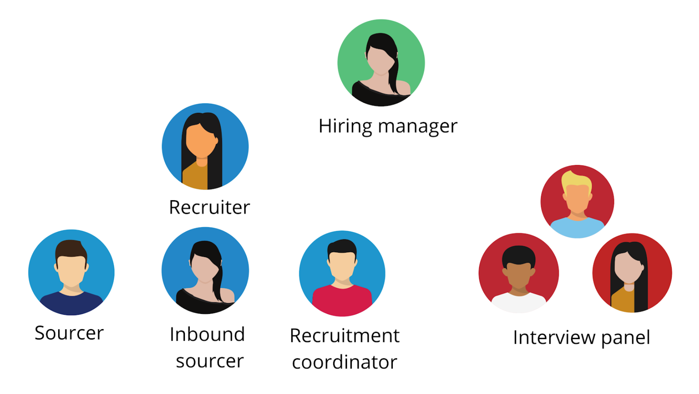
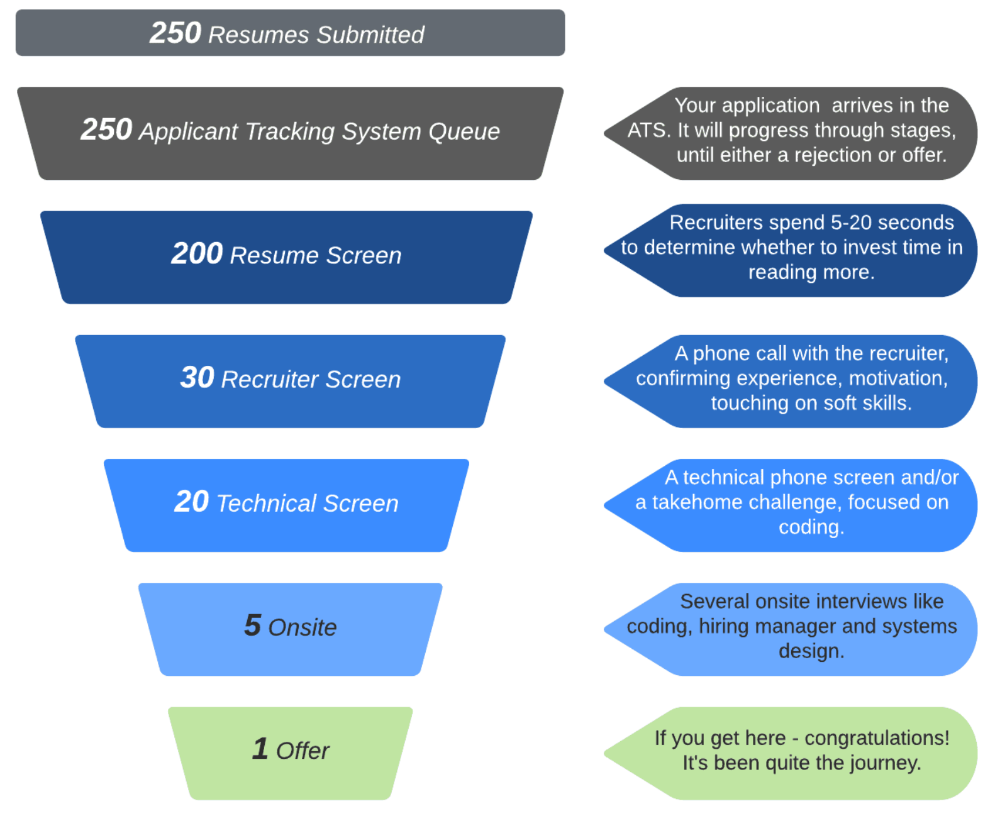
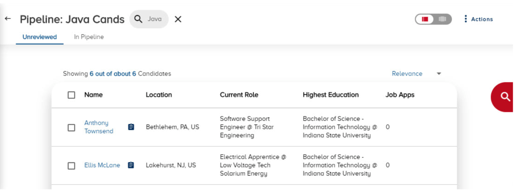
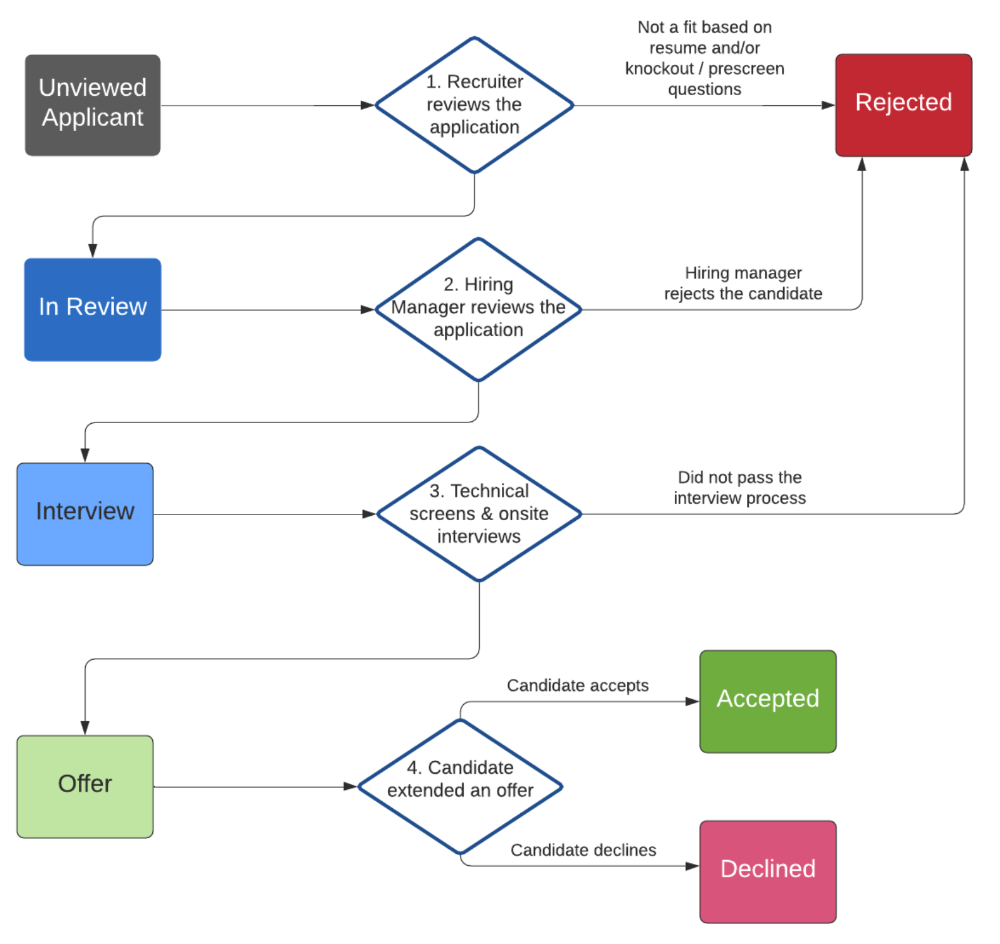
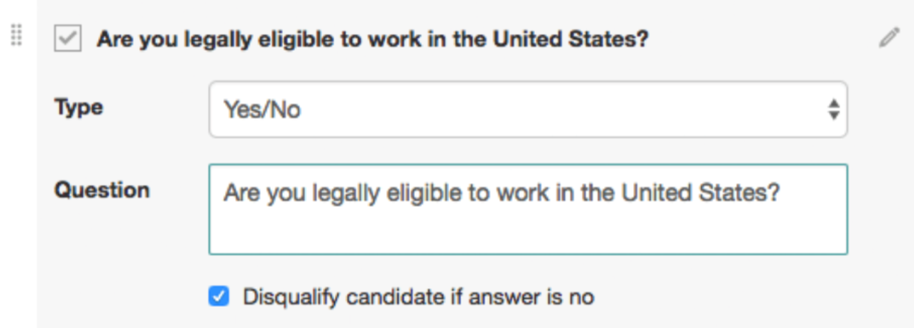
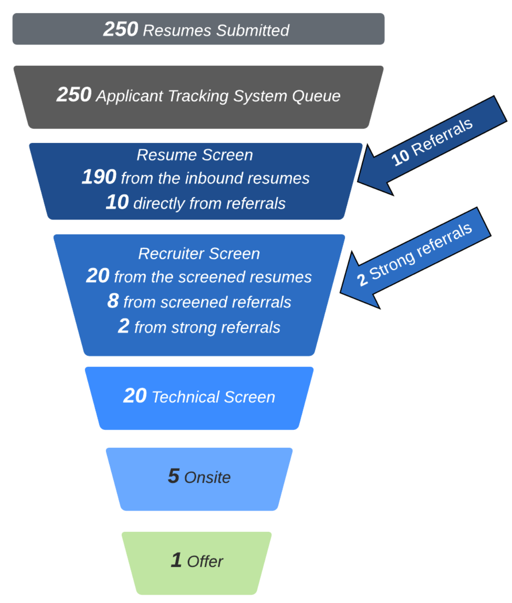
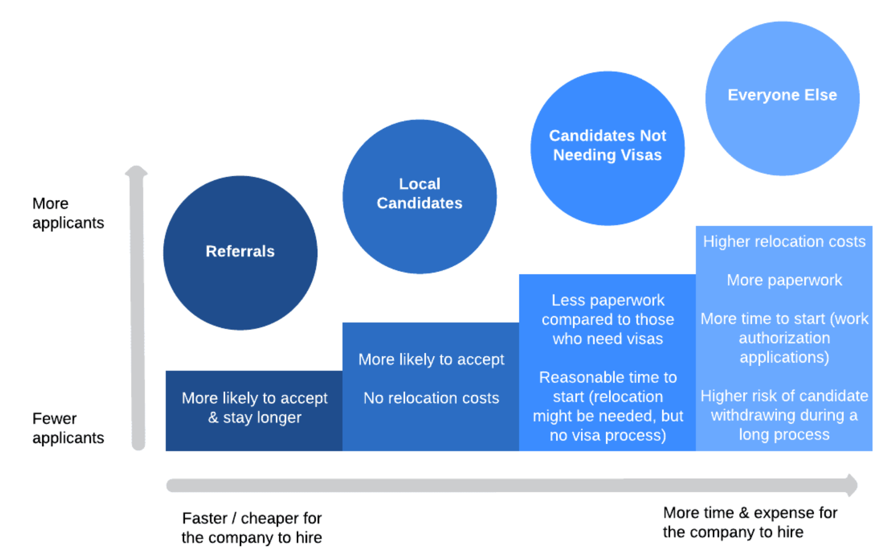
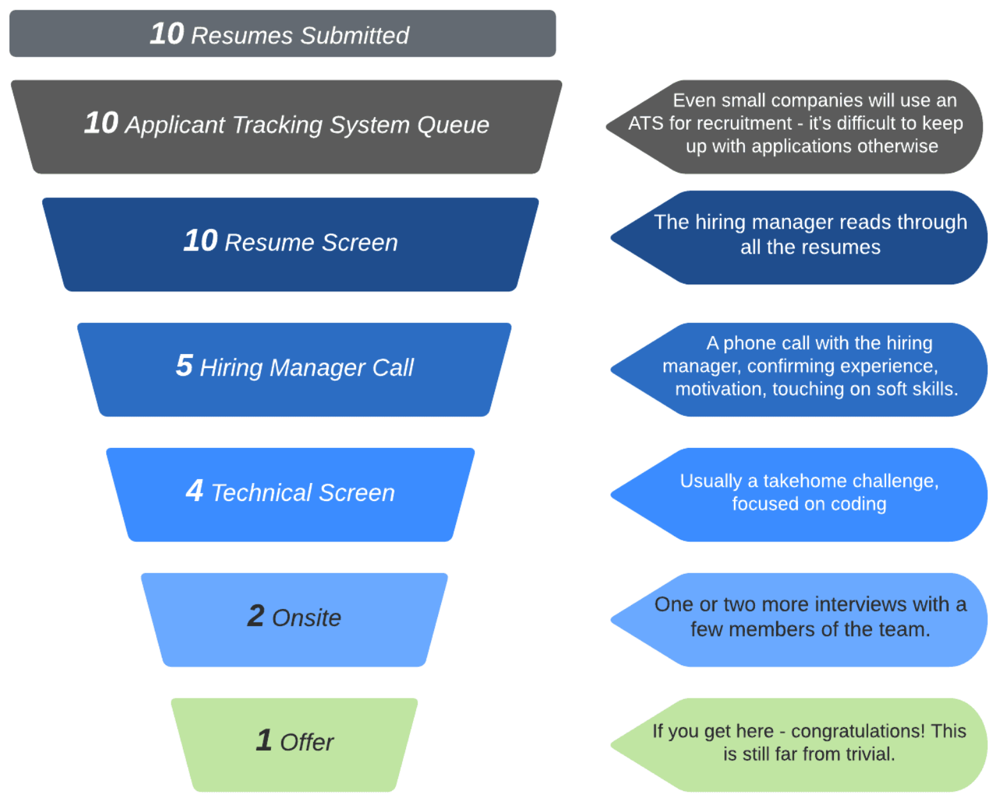

# Chapter 2: The Hiring Pipeline

Let's look at the bigger picture of what the interview process looks like, to better understand why a good resume is so important. This process can often seem like a black hole. It could also feel like a hard-to-predict series of interactions with people until you—hopefully—get an offer.

Hiring managers and recruiters look at this process quite differently and call it the Hiring Pipeline. Why this name? It's because at every stage, there's a significant dropoff in the number of candidates still in the pipeline.

## People in the Recruitment Process

Throughout the hiring process, you’ll interact with several people. Still, there are even more whom you might not be aware of. Let’s take a look at each of the roles, their goals, and why you should care about these.

- **The hiring manager** is the most important person in the whole process, and they run the show. They are the person who has opened one or more positions—or headcounts, as it’s internally called. They define the requirements they are looking for, and they usually write the job description. They set up the hiring process and define who the technical interviewers will be, and what areas they should focus on. They are the ones who have the final hire/no-hire decisions. Candidates usually don’t talk to the hiring manager until they come onsite. The goal of the hiring manager is to hire people onto their team who will help this team excel.

- **The recruiter** coordinates everything on the recruitment side. From the point of a profile being promising, they are in touch with the candidate, guiding them through the interview process. There are several other recruitment responsibilities, which sometimes have dedicated people at larger companies. The goal of the recruiter is to fill the roles that the hiring manager asks them to. To fill these roles, they need to find candidates who meet the bar set by the hiring manager and the interview panel. Recruiters often have target numbers to hit, measured in the number of headcounts filled.

- **The sourcer** proactively reaches out on LinkedIn and other channels to “source” people: to get them interested in starting the process. In large companies, sourcers exclusively do reachouts and sell the position via conversations. As soon as someone who has a good profile is interested, they hand this person over to the recruiter. The goal of the sourcer is to get as many qualified candidates in the pipeline as possible, and they usually have target numbers to hit.

- **The inbound sourcer** screens all incoming job applications through the company jobs site. This is a specialized role at larger companies, particularly Silicon Valley-based ones. At large companies, there could be hundreds of applications per week for each role. With tens or hundreds of roles, just going through these can take multiple people, full-time. Referrals will usually go either to inbound sourcers or to recruiters, with a priority over other applications. The goal of the inbound sourcer is to get qualified candidates forwarded to the recruiter. At the same time, they need to not waste the recruiter’s time with people who don’t meet the expectations set by the hiring manager.

- **The recruitment coordinator** manages the logistics of the process. Once you make it through the recruitment chat, and it’s time for the technical phone screen or onsite, this is where they join in. They schedule times with you and with the interview panel. This can be more complex than you’d assume. If an interviewer cannot make it, they swap them out for a replacement. If something comes up on your end, they reschedule the interview for you. If you get invited to travel onsite, they take care of the logistics of booking transport and accommodation. The goal of the recruitment coordinator is to make sure things flow smoothly, and that everyone is happy and on time.

- **The interview panel** is the group of engineers who will lead the technical interviews at the technical onsite, from the coding challenge to the final onsite. They have usually gone through some training, have been calibrated, and the people usually specialize in doing specific interviews, like coding or design. The hiring manager selects this group. For small companies, this group will often be team members. For large companies, it can be a large pool of all engineers above a certain level who have taken the interview training. The goal of the interview panel members is to keep the hiring bar fair, consistent, and as bias-free as possible.

**How does knowing about these roles help** you in a job application process? It places things into perspective. For example, many candidates don’t assume that both the recruiter and the inbound sourcer are fundamentally on their side. Both of these people need to make hires to hit their goals. However, they need to balance the expectations set by the hiring manager. If the hiring manager explicitly asked for certain technologies or certain years of experience, they will most likely follow this guidance.

Similarly, it’s good to know that when you get a LinkedIn reach-out, it’s from a sourcer. However encouraging you’ll find things they say about your profile, these people want to get you in the hiring pipeline, and you don’t have a job “guaranteed”. You’ll still have to go through the interview process.

When you interact with people, be mindful of these roles and their constraints. When a recruiter messages or calls you about a rejection, know that they are often a messenger. They are as invested in you getting the job as you are! As much as both the resume screening and the interview process can seem like a black box, it’s run by people who try and do their best.

| **From the inside out: what can you typically expect from a recruiter?** Blake Stockman, who recruited for Google, Facebook, Uber, Flexport and other Silicon-Valley startups, explains how recruiters come in all shapes and sizes, and how your experiences can vary wildly between companies and recruiters. The thing about the field of recruiting is that it’s not one that people plan to get into. If you talk to anyone in the recruiting field, you’ll find a wide variety of how people got here. This is in contrast to, for example, software engineering, where it typically takes a computer science degree, or some other technical degree to get started. No matter how you get into the software development field, it’s rarely an accident: you plan and prepare for a very long time. With recruiting, people typically just find themselves in this industry. As a result, you have a variety of backgrounds and expectations. You also find a varied level of quality with recruiters. This makes it hard to find that top tier recruiter who’s going to help you really navigate that process well. Someone who will be your advocate, and someone who will give you a true view of what’s going on. What you should expect, and what the baseline should be to hope for, is a level of transparency of what’s going on. To understand who this person’s stakeholders are. For example, at a large company, like Google or Facebook, I would have a level of relationship with hiring managers, but it was really abstract. I was more of an administrator of the existing recruitment process. Here, all I could do was communicate to candidates what the process was, and what I was going to do on their behalf, as they made their way through the process. Whereas when I was at Uber, I was working with hiring managers directly on actually crafting what that recruitment process was, specifying the outputs of interviews. In this case, I was able to tell candidates what to expect at the level of focus areas—without giving away the exact questions themselves. Things like how there will be the coding, architecture, and hiring manager interview. How interviewers will want to know about your thought process, how outcome-oriented you are, how process- or thinking-oriented you are, and how they’ll dive into collaborative problem solving with you. **Generally speaking, the smaller the company is, the more details you should be able to get,** and the deeper the relationship should be with your recruiter. So when you work with recruiters at startups, you’ll get a much clearer view and a much deeper lens. You’ll get a better idea of the culture, what’s actually happening there, what teams are looking for, and what to expect. Of course, a lot depends on the actual recruiters. Some of the best recruiters I know are working at larger companies, and many of the ones at smaller companies are just getting their careers started. So you will experience a high level of variance. |

## The Typical Hiring Pipeline

When you submit your resume through a job advert, the typical hiring pipeline is similar across all tech companies. There’s a resume screen, a recruiter screen, a technical screen and a series of onsite interviews. You could get rejected at each round—or, if you did well, progress until you get an offer. Here is how this hiring pipeline could look, visualized:

*A typical hiring pipeline at a large, well-known tech company. The actual process, and numbers will vary on a role-by-role, company-by-company basis.*

Let's look at each of the stages:

**1. Applicant Tracking System Queue.** Almost all tech companies use an Applicant Tracking Systems (ATS). These systems track the lifecycle of your application. For example, after a recruiter reviews the resume, the status of the candidate might change to “Reviewed” or “Resume Reviewed.”

Not all applications might progress to the resume review screen. The reason some applications might not be looked at that there are already enough qualified resumes in the previous batch. Another reason could be that the position has just been filled. In general, the later your resume comes in, the higher the chance that it won’t be looked at, due to having enough qualified candidates in further stages of the pipeline. With better companies, candidates would still get a standard rejection notification when their application is not processed further.

**2. Resume / CV screen.** In most companies, recruiters do the resume screening. However, some larger companies, particularly Silicon Valley-based ones, tend to have a specialized role called inbound sourcer, who takes on this screening. The recruiter or inbound sourcer scans your resume, spending 5-20 seconds to determine if you might be a match for the position. If you're not a good match, you might get an automated rejection message—assuming the company has a policy to send one. If the first scan is promising, they'll spend a bit more time reading your resume in depth. Afterwards, they might set up an initial call to check on a few details, and determine if they'll have you start the interview process.

**The dropoff is usually the steepest at this step**. From hundreds of resumes, only a few dozen profiles tend to have a recruiter screening call. This is why it’s important to tailor your resume, so it grabs the attention of the recruiter, or the hiring manager at this point.

**3. Recruiter screen.** Only profiles who look like a promising fit for the job make it to the recruiter screen. This is a phone call with the recruiter, confirming experience, motivation, and touching on soft skills.

**4. Technical screen.** A technical phone screen and/or a take-home challenge focused on coding. Candidates almost always interact with software engineers at the company at this point.

**5. Onsite interview.** Several onsite interviews such as coding, hiring manager and systems design. The hiring manager interview usually looks for soft skills, culture match and values alignment. Systems design interviews are usually scheduled only for more experienced candidates.

**6. Offer.** It’s common for a funnel that started with 100+ qualified resumes to result in a single offer. If you do get an offer, massive congratulations—you probably had little clue until now just how competitive this process was.

## The Applicant Tracking System

Applicant Tracking Systems (ATSes) are a tool many candidates speculate about, and ask the question: do ATSes reject resumes? Spoiler: they do not. Humans do.

Some of the most popular ATS systems used by tech companies are iCIMS, Taleo, Greenhouse, Workable and Workday. There are more than 100 ATS systems, and more entering the market over time. While a few newer, niche ATS systems are starting to offer more advanced functionality with resume parsing, as of 2020, none of the major ATS systems reject resumes automatically, or hide them from recruiters. Resume processing for all, major systems is basic. Most of the added ATS functionality is outside the resume processing phase, and with how these systems integrate with other company internal systems, and help with reporting.

The purpose of an ATS is to help coordinate the application process, for recruiters within the company. It keeps track of the status of applications, and exposes this information to all recruiters. For example, this is how a sourcer will know not to reach out to a candidate who is currently interviewing with the company, or someone who has recently declined an offer.

Here is how a popular ATS, iCIMS displays candidates in the hiring pipeline for a specific position —people who applied on the career page, who have been referred, or who have been sourced and added by a recruiter:

*The pipeline view in the iCIMS ATS—one of the popular ATS systems. Recruiters need to review the candidate to process. This usually means them scanning the resume.*

**The ATS workflow is human-based** and goes roughly like this:

*A typical Application Tracking System workflow. The ATS helps keep track of the status of each applicant. Very handy, when you have more than a few people applying!*

Boxes are statuses that represent the status of the application. It starts as “Unviewed applicant”, and will eventually become “Rejected”, “Accepted” or “Declined”. People - recruiters or hiring managers - move the status between one status, to another. For example, after a recruiter reviews the resume and the application, they will either move the status to “In Review” or “Rejected”. The statuses and the workflows can be different for each company. A big focus in the functionality for ATSes is the flexibility of setting these up.

For a more detailed explanation on how an ATS system works, see the video [The Truth About the ATS (it’s not what you think)](https://www.youtube.com/watch?v=U5K2F--rNe4&feature=youtu.be) from Amy Miller. Amy is an experienced tech recruiter and the author of the [Recruiting in Yoga Pants blog](https://www.recruitinginyogapants.com/). She has recruited at Amazon, Google and Microsoft and shares the “behind the scenes” working of this process. In this video, she summarizes what an ATS is, and is not:

“*An ATS is a system to keep me organized, as a recruiter. We need to actually know, at a given point, in their journey, and what I need to do next. For example, if I’ve got someone at the interview stage, have I set it up? At the offer stage, has the offer been approved yet? Without an ATS, I don’t know what’s going on. I don’t know who is waiting on who, doing what thing. The ATS solves this problem.*

*The idea that the ATS is this mythical, genius, AI-infused tool is crazy. Anyone who has been in an ATS, and has used it for work is laughing at this idea. It’s so ridiculous.”*

## ATS Myths Busted

ATS systems is a term that many resume builder sites and self-proclaimed career gurus use as a root cause of your resume being rejected. Almost all claims I have read on ATSes - from "robots" rejecting up to 75% of resumes to PDF formats not being advised—are wrong.

These misleading sites and people share two traits. First, they promote services you can purchase from them to "beat the ATS". Second, they refer to sources that are not backed by technical recruiters or hiring managers who actually use ATSes. This book does not claim that it will "help you beat the ATS", because—as we'll cover— there is no "ATS to beat" for tech resumes. And all claims in this section are backed by technical recruiters and hiring managers who configure the ATS systems and use them, day to day.

**Automated ATS rejections** are one of the main fallacies many sites claim. Jobscan [writes](https://www.jobscan.co/blog/8-things-you-need-to-know-about-applicant-tracking-systems/): *“Whether that human recruiter ever sees your resume could depend on how well your resume is optimized for ATS algorithms.”.* CNBC published the article [75% of resumes are never read by a human—here’s how to make sure your resume beats the bots](https://www.cnbc.com/2019/02/28/resume-how-yours-can-beat-the-applicant-tracking-system.html). This article only references sources from companies who make a living selling resume services and claim that they provide resumes to “beat” this system. There is no hiring manager or tech recruiter backing up the contents —good luck finding professionals giving their name to incorrect facts. Take this claim from the article:

*“Most applications are removed from the equation because they are not formatted in a way these systems can read and interpret - a career expert with TopResume tells CNBC.”*

The claim that PDF resumes are “removed from the equation” is false, and the following advice, to use a Word document as a format, is also poor advice.

**For the majority**—**if not all**—**of the tech companies, these claims are simply false**. Recruiters *do* go through applications in the ATS interface, and will almost always scan resumes. The only time a recruiter will not look at your resume, is when there are enough other, qualified candidates and they stop processing resumes.

**Knockout and prescreening questions** are the one part, where there can be truth to the claim of “The ATS rejecting” a candidate. These are questions that recruiters set up and are intended to filter out people who are not eligible for the position, irrespective of their resume. For example, if a company does not sponsor visas, a recruiter might add a question to the application form saying, “Will you need sponsorship in order to work?” People needing visas will then be rejected, following the policy for the role. However, it was the recruiter who set up this rule, and the data needs to be explicitly provided by the candidate.

You can read more about how prescreening works by looking at the documentation for ATSes. Taleo calls this information gathering [prescreening questions](https://docs.oracle.com/cloud/latest/taleo/OTREC/_prescreening_ug.htm#OTRECid20130530115657125), iCIMS names them [screening questions](https://care.icims.com/s/article/Introduction-to-Screening-Questions), Greenhouse refers to them as [custom questions](https://support.greenhouse.io/hc/en-us/articles/360025222851-Add-Custom-Question-To-Job-Application-), and they go by as [form application questions](https://resources.workable.com/application-form-interview-questions) with Workable. In all cases, recruiters can set up additional questions to gather information from applicants, and use this in the process. Here is the example of how a recruiter could set up a knockout question for visa status, in Workable:

*Setting up a knockout question in Workable. These are most frequently used to save time with candidates whom the company would not hire due to certain constraints.*

For knockout and prescreen questions, you need to provide information on the job application form. This information is never taken from your resume.

**ATS-compatible resumes** are another fallacy. While it is true that most ATSes attempt to parse resumes, they don’t use the contents to filter for anything during the screening process. Resume parsing is done to attempt to auto-fill candidate details. Resume parsing is also used to allow for boolean searching in the system later on outside the application process. However, beyond attempting to match personal details, and indexing keywords found in the resume, ATSes don’t do anything clever. Both PDF and Word documents are parsed well enough. To get a sense of the type of searches a parsed resume supports, see this article on the iCIMS candidate search capabilities.

An “ATS-compatible” resume is more of a meaningless buzzword than anything else. Stating that a resume is ATS-compatible is like saying that a website is mobile phone compatible. Of course, it is. All websites are. And all resumes are ATS-compatible.

**ATS resume optimization** is a service several providers charge for - anywhere from $100 [to $500](https://www.matthewdouglasca.com/resumes) and beyond. They will claim that by matching the job description better, your resume will “bypass” the ATS algorithm, and a recruiter will look at your application. Claiming that there’s a need to “bypass” the ATS is a false claim in the majority of cases for tech jobs. As of 2020, ATSes are still far more simple than even to understand what programming languages you’ve listed on your resume. Second, there is no “bypass”. Your resume is in a queue, waiting for the recruiter to review.

The only popular ATS that does some type of rating based on parsed resumes is Taleo. Taleo can assign a requisition rank to your resume. This is a percentage number based on automated screening questions and your resume, and the job requisition overlapping. Recruiters can decide to sort resumes by this rank. However, this score is off for software developers. Few, if any, recruiters would rely on this to decide which resumes to look at, and which not to. None of the over a dozen tech recruiters and sourcers I’ve consulted have used such an automated rating to decide which applications to look at and which to pass on.

**Tailoring your resume for the position** is solid advice, though. This is the reason why you’d see results following ATS optimization techniques. If you tailor your resume for the job, you should see better results. The ATS itself won’t decide whether to move forward with your resume: the recruiter or hiring manager scanning your resume will. They will look to determine how relevant your experience is: and they’ll do this in a few seconds. As the number of applications for roles is almost always high, tailoring your resume for the position and grabbing attention with the first scan, do make a difference.

Some tech recruiters predict more automated parsing and AI-assisted decision making to come for hiring. However, this is not here just yet. Even when it will be, the outcome shouldn’t be different to a recruiter doing a quick resume scan, and marking the resume with a “Yes”, “Maybe” or “No” outcome.

| **From the inside out: what recruiters say about ATS systems** I asked technical recruiters to share some common misconceptions about Applicant Tracking Systems and explain why those beliefs are incorrect. Here a few top ones they shared: **Filtering happens with human intervention, not automatically.** *“The list of people in an ATS is organized by date when they applied. A real-life person then makes a decision. You can either be rejected: this can be due to not being a good fit based on your resume, or based on your answers to knockout questions. Or you progress in the process.”*(Amy Miller, author of the [Recruiting in Yoga Pants](https://www.recruitinginyogapants.com/) blog, previously recruited at Amazon, Google and Microsoft) **Tech recruiters would not trust an ATS to filter out candidates, as they could lose good people.** *“No recruiter I know would trust an ATS with filtering, even the slightest. They don’t want to risk losing otherwise perfectly good candidates. I’ve talked to many tech recruiters in the industry, and have never heard anyone relying on filtering based on automated parsing of CVs. The risk is too high.”* (Csudi Csudutov, founder of Mimox and tech recruiter for over 20 years) **Submit PDFs CVs and you don’t need to worry about resume filtering.** “*ATSes are still so bad at filtering based on resume content that we get poorly formatted CVs, irrelevant profiles, or even blank pages. Personally, I suggest the best CV format being PDF. With Word documents, you risk ruining your format if the recruiter opens the document with another Word version or operating system. Agency recruiters also use Word CVs to remove your contact details to use it as business development material, so watch out!”* (José Marchena, tech recruiter in London and host of the [Coffee with a Recruiter](https://open.spotify.com/show/048o7UfTAigaNVqCfab4V8?si=lli5XXZmQHC34e4aIHmmpQ) podcast) |

## Referrals

If you are surprised at how difficult getting to a recruiter screen is, I have good news, and I have bad news. The good news is that referrals make this much easier—if you have one. The bad news is that without a referral, it's actually more difficult to even have a human look at your resume or to get a recruiter call.

| **Referrals, references and background checks** Referrals and references might sound similar, but they could not be more different. And references and background checks are sometimes confused, though they are also different. **Referrals** — short for employee referrals—are ways for employees to refer candidates internally. Pretty much all tech companies have a referral program that incentivizes employees to make referrals and rewards them for successful referrals. When their referral is hired, employees are paid a nice bonus, often in the thousands of dollars. Referrals are treated with priority because they work remarkably well. Referrals are far more likely to go through interviews successfully, to get an offer, and to accept an offer. They are also less likely to turn out to be a bad hire who doesn't make it through their trial period. Studies like [Understanding the value of hiring through referrals](http://ftp.iza.org/dp7382.pdf) and [The value of hiring through employee referrals in developed countries](https://wol.iza.org/uploads/articles/369/pdfs/the-value-of-hiring-through-employee-referrals-in-developed-countries.pdf) confirm this to be the case not just within tech, but for hiring in general. **References** stand for reference checks and usually happen after the interviews but before an offer. If you have done well on the interview, many companies do reference checks to confirm that you would be a fit for the job. Companies often reach out to you, asking for you to provide these references. It’s good practice to let your references know that they can expect a call. Reference checks are almost always carried out by the hiring manager. **Background checks** are usually run after you have accepted the offer, and the offer can be withdrawn if the background check is unsatisfactory. Background checks can range in how detailed they are. They often verify your employment history for the past few years, and they could include criminal records and other official background checks. This latter one is heavily dependent on countries, states, and companies. Background checks are almost always carried out by a company specializing in these. Some industries—like finance and government sectors—are more strict on these checks than others. |

Let's revisit the hiring pipeline to see how referrals change your chances of getting noticed. I'm differentiating between a very generic employee referral and a "strong" referral. A generic employee referral could be an employee working at a company you don't know personally, but after reaching out to them and asking for a referral, they referred you with your resume. A "strong" referral would be someone who works at the company who you have worked with, and they actively vouch for you.

*Illustrating how referrals can “skip the queue” in the hiring pipeline, thanks to the additional context they bring. The actual process, and numbers will vary on a role-by-role, company-by-company basis.*

Referrals almost always guarantee an in-depth resume review. In many cases, you’ll also make it to the recruiter call more easily, thanks to the referral. For strong referrals, you might get a recruiter call set up straight away.

So how do you get a referral? You ask for it.

- **Check your network** to see if someone you know happens to work at the company you are applying to.

- **See if you have second-degree connections on LinkedIn**, where someone you know is connected with another person who works at the company. See if you can ask for an introduction to get a referral. When asking for an introduction, do the legwork. [The article Get Introduced To Your Sales Prospects in 4 Simple Steps](https://www.linkedin.com/business/sales/blog/b2b-sales/get-introduced-to-your-sales-prospects-in-4-simple-steps) has solid advice not just for salespeople, but also for developers. Looking for a job is a kind of sales activity: except, you’re selling yourself.

- **Cold outreaches for referrals on LinkedIn** can also work. It’s less likely to work than when you have a shared connection, but it can mean a boost, compared to not having any referral. If you send a LinkedIn connection request, be sure to add a clear and concise message in the request about you looking for a referral. Consider adding an "easy way out" for the person you approach out of nowhere, noting that you understand if they can not help with your ask.

- **For well-known tech companies**, consider asking for a referral on [Blind](https://www.teamblind.com/). Blind is an anonymous professional network for people working at larger companies. It is common for people to ask for referrals. When you do, make sure to tag the company name, include your LinkedIn profile, describe why you are a good fit for the job, and link the job description.

If you ask for a referral, do this before you apply to the position. Most tech companies have referral systems, where employees are only eligible to refer candidates who are not yet in the hiring pipeline. This means that if you apply directly on the company’s website, then ask for a referral, you often won’t be able to get referred. This is because you will be considered an active candidate; your email and resume are already in the system.

It can be a delicate balance on how long you wait to apply, versus getting a referral: you’ll need to make the call if you want your application to go in faster, or to wait and have it come with a referral, assuming you can get one.

| **From the inside out: what people working at tech companies say about referrals** I reached out to hiring managers and engineers working at tech companies, asking them how important they see referrals at their company. These quotes are not representative of the company—departments might treat referrals differently within the company and policies might have changed since—but they do show that even blind referrals can help. Facebook: *“With a referral, you are 10x as likely to get an interview. If you are a borderline hire and your referral has worked with you, and they can vouch for you technically and professionally, it can turn a ‘maybe’ into a ‘yes’. I’ve seen it happen before.”* Google: *“Almost all people I’ve referred, even without knowing them, have gotten an interview. Beyond that, cold referrals don’t help. Referrals, where the person has worked with you and has good enough knowledge of your work can help you get an offer, though.”* Amazon: *“A blind referral can get you a phone interview with a recruiter—this is what happened in my case, at least.”* Microsoft: *“A referral can get you an interview faster, but it doesn’t help you get an offer.”* Uber: *“It almost certainly gets you a response from the recruiter. If the person referring you knows you well, they might also ping the recruiter directly, increasing the chance for a recruiter call.”* Netflix: *“We usually only give referrals to people we know well—blind referrals are not a thing that I’ve seen.”* Automattic: *“A referral gets your resume and application fast-tracked to the recruiter, but that’s about it.”* |

## The Priority of Your Resume

While the hiring pipeline tells one story on how candidates go through stages, this omits an important detail: the priority of your resume, based on factors of being local and needing or not needing a visa. With a large number of inbound applications, here is how a hiring manager would often prioritize these applications.

A hiring manager's goal is to hire people who are qualified for the job as quickly and efficiently as possible. The goal of the recruiter is to help the hiring manager in this process. Given a large number of resumes with similar qualifications, how would these resumes be prioritized? Usually, they would follow this order:

*Typical priority of resumes. The more “expensive” a candidate is to hire in terms of time or money, the less priority that resume typically gets.*

- **Referrals.** The recruiter and hiring manager almost always read through resumes that come through employee referrals in depth. While the hiring manager might have a policy of not moving forward with referrals who need a visa or relocation, this is also the most likely place where exceptions could be made, especially with a strong referral.

- **Local candidates.** Recruiters and hiring managers perk up when seeing local candidates. Local means no paperwork to start, and no relocation is needed. There’s also little risk of a candidate who accepted an offer backing out due to relocation concerns.

- **Candidates not needing visas.** In these cases, once an offer is made, there's little paperwork needed, and there won't be visa-related delays for the person starting. They might need to relocate, but relocation would not add any uncertainties to the starting date.

- **Candidates needing visas** and relocation are usually people from abroad. This type of hire is the most time- and cost-consuming for the company. A company needs to be ready to wait for a longer visa process to go through, and pay for the additional costs, like relocation, in these cases. These kinds of hires are usually reserved either for positions that are hard to fill, or for cases where the company needs to hire a large number of people. Someone needing a visa and relocation might mean an additional 2-3 months to start the job, with an additional $10-15K in relocation and visa costs.

- **Candidates from countries that are unusually difficult to get visas for**—this usually applies to US companies. In specific countries, and for certain companies, hiring developers from some countries becomes very difficult, if not impossible. One specific case is hiring for US companies—even when the office is not in the US—from countries that are on the comprehensively sanctioned countries or the targeted sanction countries list. Getting a visa can be a difficult process that few—if any—companies will want to go through.

Most companies decide on a position-by-position basis if they will go ahead with relocation and visa sponsorships. For larger companies, policies on this are usually central. Companies will typically only sponsor visas and provide relocation at senior and above software engineering levels and at roles they find hard to hire for locally.

This is even the case for the largest tech companies, like Google or Facebook. For entry-level positions such as L3, these companies also often only hire locally, filling up the headcount at these levels, making it unlikely to get visa sponsorship in the majority of cases. There are always some exceptions to this rule, based on unique circumstances. For example, at Uber, there was a point where I was able to sponsor standout L4 and L3 candidates during a hiring push - both levels below the L5, senior level.

As a rule of thumb, the more qualified local applicants there are, the less likely companies will sponsor visas and relocation. This is why it is extremely rare to get through even to a recruiter chat when applying from abroad for an entry-level position. Recruiters will follow the policy of the company and instructions from the hiring manager. They will not spend time talking to people for whom the company or the hiring manager would not sign off on making an offer.

Better companies make it clear whether they sponsor visas on the job description itself. Look out of these.

**For remote positions, the selection process is usually more straightforward.** Larger tech companies hire people as employees, and they will only hire engineers in countries where they have a legal company entity that can employ them. For example, a US-based company might have entities in the UK and Singapore, and they might sponsor hiring people to work remotely—but only in these countries. For companies like this, if you are not based in these countries or cannot move without a visa, you won’t be considered for the position.

Some smaller and mid-sized companies will often hire from anywhere, also being open to hiring contractors, not just full time employees. This would mean that while you can work for these companies remotely, you will be responsible for setting up a business that the company will contract with, and you’ll be responsible for all your taxes and benefits.

The downside of hiring contractors is that this setup is more fragile from the point of the company. Longer term, few companies stick with it. Things like equity become close to impossible to administer in this setup, and the working relationship needs to be a lot more transactional. Still, there is a large upside that you could be considered for the position from different companies, assuming you can work with a timezone that overlaps well enough with what the company is looking for.

| **From the inside out: can I get visa sponsorship in tech when I’m a new grad or junior software engineer?** If you are hoping to get visa sponsorship in another country from a tech company when you have little to no industry experience, as a hiring manager, I’m here to tell you the bad news: this is rarely a thing. Yes, there are a few exceptions at big companies with specialized programs that target hiring outstanding new grad talent from abroad. Still, in almost all cases, new grads won’t be sponsored with visas. Why is this? There are two reasons: the time and money cost of obtaining a visa, and the supply and demand for talent in the market. The time and money for visa processing can be a lot of pain, especially for a small company. Money is often the smaller issue: the uncertainty of when a person can start and navigating complex visa application processes can be a real pain. I know of smaller and mid-sized companies that stopped offering to sponsor visas after they had to go through several months of paperwork and back-and-forth with the government entity for what should have been a straightforward hire. On top of the cost of a visa, there’s then supply and demand. The larger the company, the more likely it is to sponsor visas, as the more people it hires. At the same time, the more people a company hires, the more likely it has university recruitment programs and advertises its positions locally. And while large tech companies usually have a good amount of new grad and entry-level developer positions available, they can usually fill these with candidates who don’t need a visa: local candidates or ones within the country. However, with 2-3 years’ experience, this changes significantly. Most companies struggle to attract developers with experience. The more senior the position, the more challenge it is to hire for these. Most medium-to-large tech companies I know of sponsor visas and relocation for senior and above positions. Some do so for levels above entry-level positions. They need to do this to hire the type of engineers they are looking for. So my advice is to give applications abroad a shot, but don’t hold your breath. Instead, focus on getting a position that is somewhat local, spend a few years working, and then you’ll have many options where companies will sponsor visas. |

## Less Competitive Hiring Pipelines

The hiring pipeline can be very competitive for large companies. This is especially true for less senior roles. However, the good news is that not all hiring pipelines are like this. Startups, small companies and medium-sized companies differ by the number of applicants, and how involved hiring managers are with the process.

### Startup & Small Company Hiring Pipelines

Little-known startups and small companies often see few applications. This is for two reasons. First, they are often very specific in their job advert on what they are looking for, and what technology knowledge is a must. Second, they often want to hire for “hot” areas, where the large companies are also recruiting for. However, they don’t have the reach as those companies have, so they see fewer inbound applications. To offset this, they will often work with recruiting agencies to source candidates.

Startups and small company recruiting is often run by the hiring manager themselves. A typical pipeline for a non-entry level position, for a little-known company can look like this:

*A typical hiring pipeline at a startup or small company. The actual process, and numbers will vary on a role-by-role, company-by-company basis.*

For companies that are very small or have minimal resources to spend on hiring, the hiring manager often does all the work. This includes the resume screen, the screening call, and coordinating the onsite interviews.

**For companies with little technical expertise, you’ll almost certainly have to pass algorithmic coding challenges** that are often challenging. But why would a small, barely known company have coding challenges nearly as difficult as larger tech companies have? It’s because they don’t have in-house expertise to interview for these skills, and they buy a screening solution instead.

If the founder is non-technical and there aren’t other hands-on hiring managers, these companies will often “outsource” technical screening to an out-of-the-box solution like Hackerrank. Hackerrank and similar solutions are often built with Silicon Valley hiring in mind, meaning the bar to pass can be difficult. What’s more, the non-technical hiring managers in these companies often use the score from the test as the signal on how well you did. They won’t even look at your code: so a missing edge case could make you fail this screen.

Outside of major tech hubs, this kind of approach to screening software developers is more common than most people assume. It should be of little surprise that the screening and the actual work you’d do are not similar. Still, as annoying getting algorithmic challenges for a small company can be, there’s an upside. Should you pass, you’ll probably be one of the first hands-on technical hires. If you’re passionate about hiring, you will likely be able to shape the interview process for the better, from within the company.

**For companies with technical founders, the hiring process can be one of the nicest ones.** Your resume is almost always read by a technical hiring manager, who works with developers day-to-day. The first phone call is with the hiring manager themselves—most likely, your future manager. The technical screens rarely have algorithmic challenges, and the onsite is shorter as well. There’s less competition, and you are more likely to get an offer in the end. So what’s the catch?

The catch is that these are small, lesser-known companies. They will almost certainly not sponsor visas. The compensation will almost certainly be below that of the large tech company. The company might seem like a really risky bet.

However, it’s precisely these reasons why these companies are seeing so few applications. And some of these assumptions might not be true. The compensation might be solid—perhaps it’s just not advertised. The company might still sponsor visas—especially if they are failing to attract even local talent. And while the company might be a risky bet, the risk could easily pay off.

| **From the inside out: how the first mobile engineer at Uber was hired** Jordan Bonnet was the first mobile engineer hired at Uber and employee #5. He shares the surprising story of him getting this job—and an example of how applying to small companies can pay off. *“I had been working as a software engineer for two years in France, and I wanted to get a job in the US. So I went to one of the biggest US job sites at the time, Simply Hired, and applied for more than 20 jobs. I heard back from 3 companies: Qik, Eventbrite, and UberCab. Qik told me hiring from abroad was complicated for them at the time. Eventbrite told me they don’t sponsor visas.* *UberCab just asked if I wanted to do the coding challenge, which I did. I then had an interview with the first engineer at the company and the CEO, and that was it. They extended an offer and sponsored my visa.* ***Applying to very small companies can be a great move** because they often have a very lightweight recruitment process and can move really fast. A couple of months into joining, I asked why they went into the trouble of hiring someone who needed a visa. They told me that they just couldn’t find a mobile engineer. No one believed Uber would be big one day, and they were just too new and unproven for other developers to consider them. At the same time, I was willing to join because I had no other options.”* |

### Mid-Sized Companies with HR Support for Recruiting

At companies that outgrow the few-person startup stage, the hiring manager realizes they can’t do all the hiring work themselves. Still, the company is not large enough—or hiring fast enough—to invest in a sourcer or a dedicated recruiter. Instead, they usually hire an HR generalist with the goal of reducing the load on the hiring manager. They take on the screening the resumes and organizing of the interviews - on top of many, non-hiring related duties.

These companies are less well-known compared to large tech companies. They see more applications compared to some small companies, but nothing comparable to the large ones. The hiring pipeline will be similar to startups, but the hiring manager is now only involved later in the process:

*A typical hiring pipeline at a mid-sized company. The actual process, and numbers will vary on a role-by-role, company-by-company basis.*

The only notable difference in this process is how the hiring manager no longer personally reviews the resumes. The HR generalist is someone who is not hands-on with tech, and they will focus on instructions received. So if the hiring manager asks for 4 years or more of Java experience, they might reject resumes where this is not clear, to someone who is not technical.

## Job Aggregators

While the most well-known tech companies easily get hundreds of applications for every open position, small and relatively unknown companies struggle to get even a few applications. These companies often hire recruiter agencies to seek out candidates. And it's not just overly small companies that have this problem. Talking with recruiting agencies, it is far more common for startups who just raised a Series A to not see enough inbound job applications than most people assume.

Many of these companies spend time advertising their product—like having an article on TechCrunch—but they often don't spend nearly as much time advertising their position. They will have the position listed on the career site and perhaps pay to advertise it on a job board: but listing on a job board is already a step that many companies don't do.

**You can use the fact that many tech jobs are "invisible" to the masses to your advantage** by proactively finding these smaller, promising companies with tech positions and directly applying to them. This is a win for both you and the company. By applying early, your resume will have to stand out from fewer applications. And, assuming you are qualified and might get the job, the company will have to spend less time and money on recruitment. To do so, you need to use job aggregators to go directly to the career site postings of jobs most people are unaware of.

**Most candidates only search on job boards, which have far fewer tech listings**. Job boards are the job sites you are probably already familiar with. They have a well-known brand, and companies have to pay a hefty fee for each job advert. In return, they get a lot of eyeballs, and—hopefully—many inbound applications. The most popular job boards in tech include:

- [LinkedIn Jobs](http://linkedin.com/jobs)

- [StackOverflow Jobs](https://stackoverflow.com/jobs/companies)

- [AngelList](https://angel.co/)

**Job aggregators have far more positions, as they also crawl company career pages**. If you want to find some of the “hidden gem” listings that likely get very few applications, you’ll want to use job aggregator sites. These sites will have positions that companies list directly on the site, but they also act as a “search engine for jobs”. Popular job aggregators worth browsing are:

- [Indeed](http://indeed.com)

- [Simply Hired](https://www.simplyhired.com/)

- [CareerJet](https://www.careerjet.com/)

- [LinkUp](https://www.linkup.com/)

Job aggregators are not specific to tech. You’ll have to narrow down your search criteria to the title and location, and browse through listings. When you find a position that looks interesting, try to find the company career site, and apply directly, with a tailored resume. While you could also upload your generic resume, I only suggest this if you are already getting responses. If you are struggling to get that recruiter call for jobs you seem to be qualified for, then you will see better results by sending a resume that you tweak for each job description.

Note how the first mobile engineer at Uber also found the listing via a job aggregator. Despite having raised funding from great investors, there were so few applications for the mobile engineer position, that applications got fast responses at that time. Job aggregators can help find positions with similarly small—yet potentially great—companies like UberCab in 2011.

## Recap

In this chapter, we’ve peeked behind the scenes on how the hiring pipeline works at large tech companies, startups and medium-sized companies. Every company has a different hiring process—and some can diverge from what was discussed here—but understanding what typically happens behind the scenes can help you tailor your strategy, even before submitting your resume. Here are things you can do to increase your chances.

- **Keep in mind who the “target” for your resume is**. A recruiter, HR partner or hiring manager will be reading your CV, and you’ll want to make it clear why you are a good fit for the position—and do this in a few seconds. We will dive into tactics in Part 2 of the book.

- **Seek out referrals**, especially for tech companies that are well-known and likely see many applicants. Referrals might be able to refer you to positions that are only internally advertised as well.

- **Browse positions on job aggregators,** not just job boards. Job aggregators will have positions listed the earliest. Even for companies who pay to be listed on job boards, they typically list positions on their careers site first.

- **Make a list of jobs and companies** you would consider. Add notes to how large the company is, how competitive the application process likely is, whether it is a local company, and whether you’d need a visa. Prioritize your application process based on the likelihood of you standing out. You’ll want to do some “long shot” applications, but also some “safer bets”.