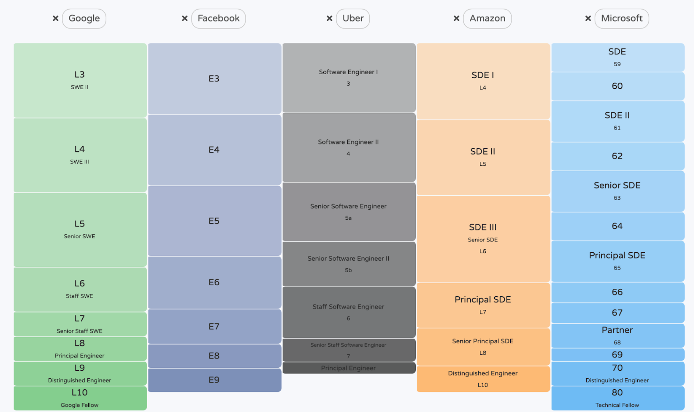
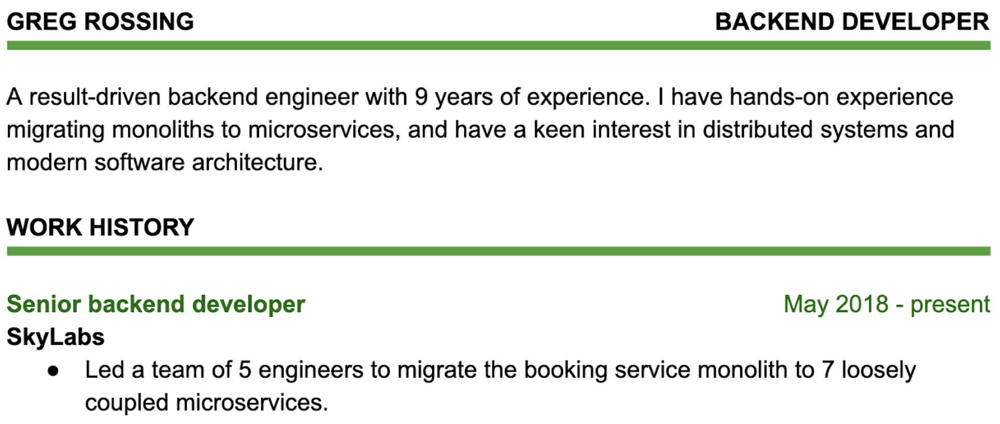
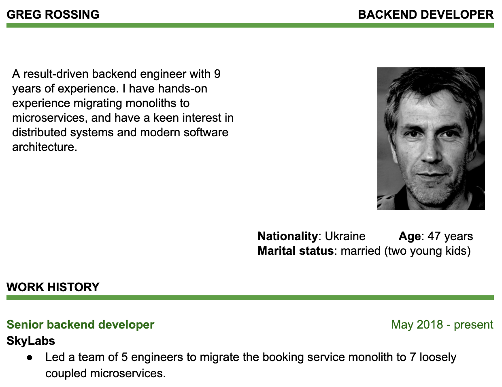

# Chapter 3: Tech Resume Basics

There are several unwritten rules of resume writing, from not having any spelling mistakes, to listing your experience in reverse chronological order. Whenever a resume breaks one of these rules, it makes it seem less professional. And when doing the first scan on a resume, recruiters and hiring managers look for a few specific pieces of information—almost always doing this autopilot.

In this chapter, we cover what it is that recruiters and hiring managers “automatically” scan for at the first glance, and we write down the unwritten rules that resumes for tech positions should follow.

## The First Glance

Recruiters want to collect a few key pieces of information at first glance, and it is in your best interest to make this easy. If recruiters can’t find this information, and there are lots of resumes to go through, they might move on to the next one. The key pieces of information are these:

- **Years of experience**. The first thing they’ll scan for is how long you have been working for. The recruiter will then mentally compare you to the internal level of the position—which is not always advertised. Say the position is for an L4 position at Facebook, Google or Uber, which is one level above the entry-level engineer—see the “Levels at different companies” table below. This is someone who is expected to have around 3-5 years’ experience, give or take. The recruiter will quickly scan to the education section to confirm your graduation date—whether this be university, bootcamp or something else—then subtract how much time has passed. If you make this information hard to find, or it’s unclear, you might end up in the reject pile, the same way as if you don’t have sufficient years to warrant a hire.

- **Relevant technologies**. For the technology the position is recruiting for, how much relevant experience do you have? So e.g. if applying for a backend position for a company that mostly uses Java and Go, the recruiter would want to scan and see if they see Java or Go, and with what proficiency. This is why it’s helpful to include all technologies and languages you’ve worked with that are *also* on the job description. If there are fewer applicants or the screener is thorough, they might go deeper and assume that you could pick these up quickly if you have several other languages: but don’t count on this.

- **Work experience**. How much relevant work experience do you have? Do you come across as someone who has *consistently* delivered impact? How was this impact measured? This is an area where quantifying things helps. If you can describe the number of daily visitors on the site you worked on, the RPS for the service you wrote, or an improvement % you’ve made, this is easier to translate across employers than a qualitative description of the project.

- **Work authorization and visa status (when applying from abroad)**. If your application seems like it’s from abroad, do you already have work authorization? If not, what kind of visa would you need to get to be able to work for the company? Your application can seem like it’s from abroad based on your contact details, the location of your last work or study experience, or even on your name. If you already have work authorization or a valid work visa, you’ll want to add this clearly in any of these cases—or else the recruiter might put your resume in the “needs visa” pile, prioritizing it only after they have reviewed local candidates.

- **Anything that clearly stands out**. Anything that pops out on the first page of your CV. For new grads, this could be your school—if it’s a well known one—or an award. For more experienced people, it could be your company, a patent, a PhD, being a core contributor to a relevant open source product or something that is rare to see among the hundreds of profiles.

| **Levels at different companies** When a job advert is posted, it always maps to one or more levels internally. This level information might or might not be exposed on the job listing itself. For example, a Software Engineer job listing on the Google site might have an internal mapping of levels L4 or L5 against it. While there are no universal mappings between what each level means at each company, there are decent approximations. The Senior level at Google (L5) usually translates to L5 at Facebook, L6 at Amazon, and anywhere from 63 to 65 at Microsoft. The site [Levels.fyi](https://www.levels.fyi/) does a good job visualizing these levels. Keep in mind, though, that these levels are approximations, and there are no exact mappings between companies.  *Mapping of levels between several companies on Levels.fyi. The mapping is not exact, but it gives a sense of progression at each company, and how these might compare between companies.* |

So how do you make the information that recruiters are looking for stand out? You make sure most information is on the first page, and you use clear formatting and good use of colors and bolding to draw attention to the relevant parts.

## Ground Rules

Your resume should be two pages or less and contain basic contact details. Use good grammar and no typos, make dates easy to read, and don’t include photos or other non-required information.

There are a few things that all resumes need to follow to be considered professional-looking resumes in tech. These are the things that “go without saying”—and, because of this, they are rarely written down. Make sure your resume follows every one of these:

- **Good grammar and NO typos.** Typos and poor grammar on a resume come across as not paying attention to detail and/or not having good command of the language. They can easily cause your resume to be ignored. Use free spell checking tools, grammar checking like [Grammarly](https://www.grammarly.com/grammar-check), and ask someone else to re-read your CV for correctness. The same applies to punctuation: ensure this is consistent across your resume.

- **Basic contact details**. Include your email address and relevant contact information, like phone number and the city and country where you are a resident, at the top. Keep this short and don’t take up too much space with these. You don’t need to add your full mailing address as contact details: no one will send you a letter in the mailbox based on your resume. Should you later get an offer, you’ll be asked for all your personal details; but that’s a long way ahead.

- **Dates in reverse chronological order**. Mark your work and education experiences clearly with dates. List them with the latest one on the top, listing out earlier ones underneath.

- **Don’t include photos or non-required personal information** like your date of birth, gender, citizenship, relationship information, number of children, religion, or others. See the Avoiding Biases: Personal Details for a deep-dive on the biases this creates.

- **Two pages or less**: this last one is not a strict rule, but a very wise one to follow. Aim to not go over this length unless you have lots—typically, beyond 8-10 years—of work experience. For new grads, fit in on one page. If you have less than a few years of experience, it’s not expected you fill in the second page.

## Simplicity and Consistency

For people to read what you write, it [needs to be written well](https://blog.pragmaticengineer.com/on-writing-well/). This applies to resumes as well. Resumes that are simple, concise, and are easy to read will be read more. Hiring managers and recruiters will, at most, skim ones that are cluttered and overly verbose. To make your resume simple and concise, follow these principles.

- **Clear, neat, and consistent formatting**. Use the same formatting throughout the resume. Use consistent font sizes and make the resume easy to scan through in a glance. See the templates section for pointers on good templates.

- **Bullet points for easy readability**. Use bullet points that make the CV easier to read. Avoid paragraphs. Recruiters in tech companies are used to scanning bullet points—they are less effort to read.
  
  
  - **Sub-bullet points: avoid**. They clutter your resume, make it more verbose, and make it harder to read. If you find yourself using these, re-edit your resume and stick with one level.
    
    - Using dashes for bullet points, to save space: also avoid. They look out of place and are harder to read than bullet points.

- **Dates: use consistent and easy to read formats**. A date like “06/11—07/12” is hard to understand. The reviewer now needs to think, “is the first date June 2011 or November 2006?”. Just write “June 2011—July 2012”. Now they don’t need to think, and the year is clearly differentiated from the month. For any date span beyond a few years, you can also drop the exact month, as it becomes irrelevant, especially when it is a date that is more than four or five years ago.

- **Use the PDF format**. Use this format and no other. Avoid formats like .doc, .rtf—they display inconsistently on machines that don’t have software like Word installed and can mess up an otherwise well-formatted resume.

- **Be concise, and don’t spell out trivial things**. Ruthlessly edit your resume and drop sections that add little to no information. Ask yourself: “am I making a good case for why I am a good fit for this position that I am applying for?

## Avoiding Biases: Personal Details and Photos

How would you react if a recruiter called you and told you one of the following:

- *"I'm sorry, but you're too young for this job based on your **age**."*

- *"While I'd love to proceed, we already have too many people in the office of the same **gender** and so we need to pass on you."*

- *"I have to reject you not because of your skills, but because you seem like a grumpy person based on your **photo**."*

- *"I think we should stop with the process as no one else in the office has **kids** so you wouldn't fit in."*

- *"I don't think you'd fit in with the British and Canadian people in the office, based on your **nationality**."*

- *"We like to have fun and we're all single, I'd rather not waste time with someone who is **married**."*

- *"Let's just end it here as there's no one else in the office with your **religion** and we don't want to have any arguments about this."*

Of course, you will never get a call like this: any company would find themselves in hot water if they admitted to discriminating against you on any of the above. Still, all non-essential personal information you add to your resume adds one more way that biases can kick in—either with the recruiter or the hiring manager. Adding too many personal details can result in a rejection based on bias.

Photos are never a thing for US-based positions or US-based tech companies. In tech, you don't need a photo to decide if they should move forward with you: it's about your skills, not your looks. In some countries, non-tech positions require photos, and this somehow got stuck in tech. However, all hiring managers and tech recruiters I've spoken to confirmed that photos add no value. They mentioned photos being distracting, playing to biases, doing more harm than good. If anyone really wants a photo of you, they can look at your LinkedIn profile, where you can decide whether to have one.

To visualize how biases kick in, take a look at these two resumes.

**Resume 1:**

**Resume 2:**

The two resumes have exactly the same job-related content. Still, with Resume 2,
many unconscious biases will kick in for any recruiter or hiring manager. Do we really
want to hire someone who is this *old*? Who has two young kids and could perhaps
be *distracted* from work? Who might need to relocate *with their family*? With the
first resume, none of these questions even come up, and they certainly don’t distract
the reader. There, the recruiter and hiring manager skip straight to the skills and
achievements. They decide to progress with the resume based on its contents, not
the candidate's personal details.

**Do not add personal details to your resume that can lead to negative bias during the resume screen**. Biases are real, and you never know what unconscious biases you can trigger with the recruiter or hiring manager. Luckily, in tech, the criteria to get hired is based on your skills and your expertise. So do not add photos, date of birth, gender, nationality, and other details. For most resumes, you do not need more than your name and your e-mail address to apply.

| **From the inside out: does not having a photo reduce my chances of getting hired?** In some countries, photos are expected on CVs. Two recruiters working in these markets give their take on whether you should add photos. Yinka Coker has previously recruited at Andela, and spent a considerable time hiring in the United Arab Emirates. Here’s what he says about photos in the Middle East: *“In the UAE and most of the Middle East, photos are expected on CVs for all roles, even tech roles. However, there is a cultural shift happening, reflecting the adoption of inclusive hiring practices. It is always better to tailor your CV to the local hiring practices in countries you apply to.”* Konstanty Sliwowski has been recruiting for nearly two decades in London, UK and Berlin, Germany. Heading up his recruitment agency, he’s recruited for the likes of Delivery Hero, GetYourGuide and several high-growth startups and tech companies. Here’s what he has to say about the unimportance of photos: *“No client of ours has ever rejected a CV because the application didn’t have a photo. At my agency, we do not believe a photo is necessary, despite most German companies receiving CVs with photos.”* Tech is one of the industries where not having a photo on a CV is rarely an issue. Do your research for specific countries, and reach out for local recruiters and hiring managers for specific advice. |

## Recap: Actions to Improve Your Resume

In this chapter, we’ve covered why a simple and consistent resume is easier to review for recruiters and hiring managers. Spelling and following some ground rules are a must, as are not listing unnecessary personal details. To improve your resume, follow these steps:

- **Choose a template that is simple and consistent**. Select one that is easy to scan through. Either choose this from the ones listed in the resume templates at the end of the book, or find another one online.

- **No photo, date of birth, gender or other personal information**. Make sure you remove these pieces of information that can only create bias; that could hurt your chances.

- **Relevant technologies and work experience on the first page**. Do you have your main languages and technologies, as well as your last few positions listed on the first page of the resume? If you don’t yet have work experience, make sure your education details are on this first page.

- **Dates of your work experience being easy to scan**. Can someone quickly tell how many years of total experience you have, looking at the resume? Make sure the dates stand out.

- **Bullet points**. Are you using bullet points to list your experience? Make sure not to use sub-bullet points.

- **Spell and grammar check**. Have you checked your resume not only with a spell check, but also with the free [Grammarly spell checker](https://www.grammarly.com/grammar-check) and the also free [Hemingway Editor](http://www.hemingwayapp.com/)? Make sure you fix all issues raised.

- **PDF format and naming**. Is your final resume in a PDF format? Make sure to name it {yourname}_resume.pdf or {yourname}_CV.pdf, so it’s easy for recruiters to identify who this one belongs to. For example, I’d call mine Gergely_Orosz_CV.pdf. Aim to not send resumes that showcase you having multiple versions: avoid calling it MyName_v4.pdf, or MyName_CompanyName.pdf.