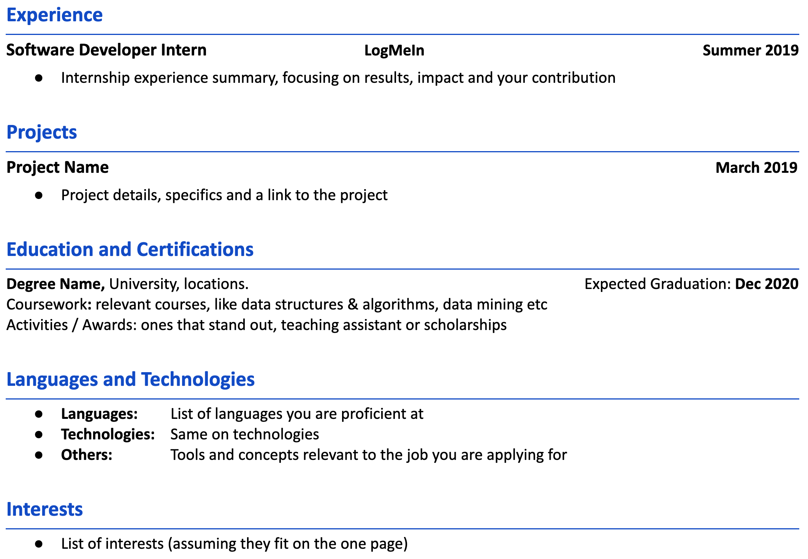
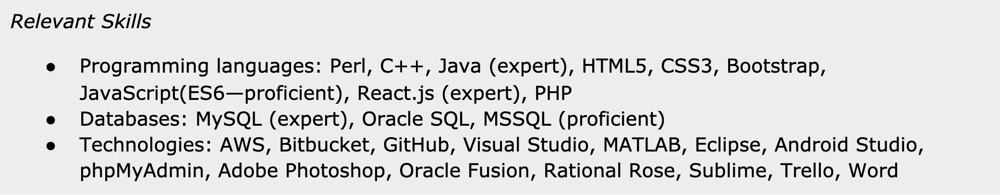
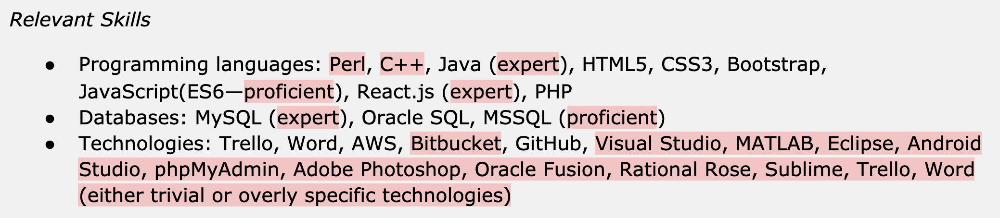
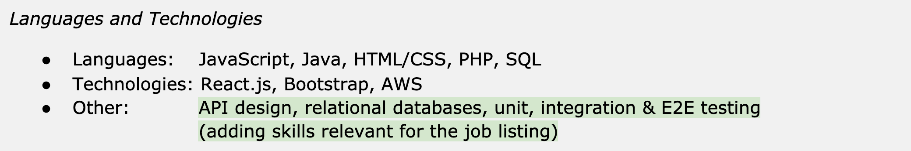
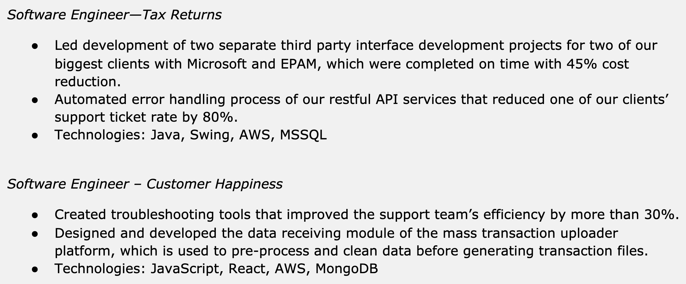
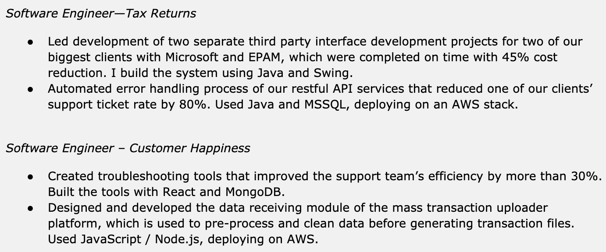
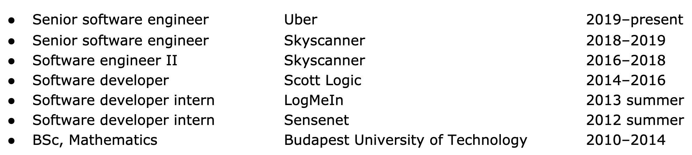
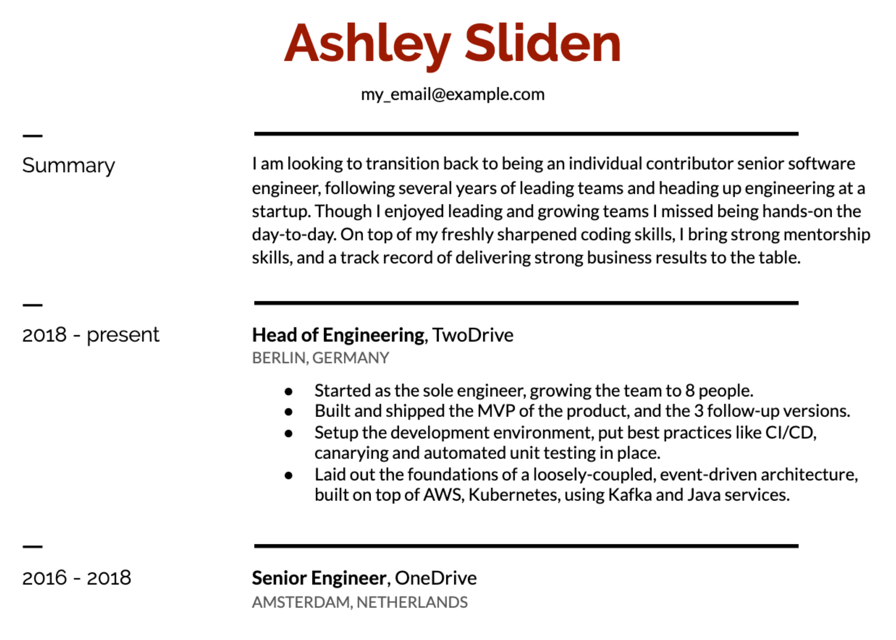
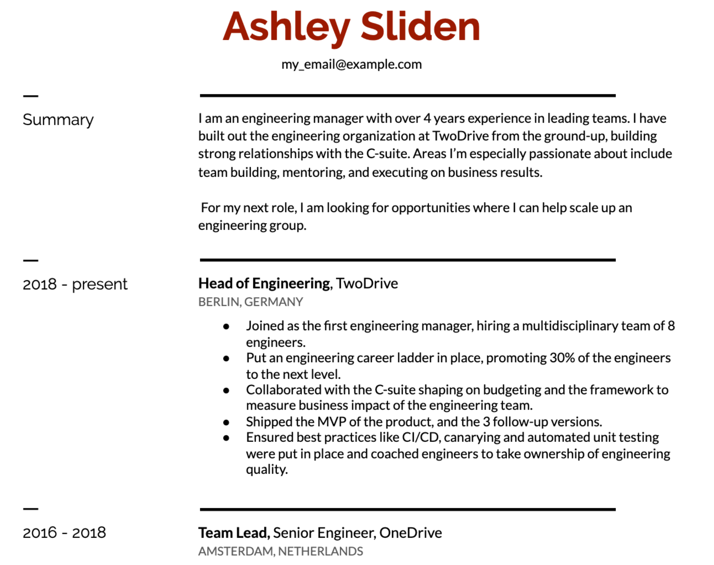

# Chapter 4: Resume Structure

There are two types of software developers: ones who have gotten their first full-time job, and ones who are looking to land that first one. Based on which group you are in, recruiters and hiring managers will care about different details.

For people without full-time experience, your internships, education details, projects, and achievements are what will set you apart from the many other applicants who are also looking to land their first jobs. As soon as you have that first job, your work experience and the professional skills you use day to day become far more relevant for recruiters and hiring managers.

Based on which group you are in, you’ll want to structure your resume differently. And as you spend more time working professionally and start to build up more experience than can fit on a few pages, you’ll have the pleasant problem of deciding which one of your past experiences *not* to talk about.

## Structure for Interns, New Grads and Bootcamp Grads

When you are a student or new grad, you often feel like you have little to no experience to show. Make the most of what you have, though—and if you are truly low on experience, address this parallel to the application process. Here are the experiences that catch the eyes of people reviewing your CV the most, in priority order:

- **Real-world work software development experience**. If you have been working part-time or full-time as a software developer, list this, together with your accomplishments. Don’t be shy. Show off what you have delivered and how you have already gone above and beyond.

- **Internships**. Be specific on results, impact, and your contribution. People with internships can stand out from the crowd or applicants. Be aware though, that for large tech companies, it is common to see applicants with multiple successful and impactful internships behind them.

- **Sizeable contribution to real-world (open source) projects**. If you are a core or frequent contributor to a project, list this. If you have created a project that now has multiple contributors or many users, show this off. If you are not yet in these categories, perhaps you can join in with an open source project and get some experience that will help you stand out?

- **Your school details**. Especially if the school is well-known and you have high grades, this can be impressive. If you attend a nationally well-known school, add this information to the details section. For example: *“Budapest Technology University is the #1 ranked university for Computer Science in Hungary”.*

- **Projects that stand out** due to their impact, such as their complexity, number of users or other impressive metrics.

- **Tutoring and leadership positions in student groups**. If you have already been teaching your peers—as a teaching or lab assistant—that is a great sign of you being able to mentor others. Similarly, if you have led a student group or a project, list this. In both cases, list results, impact, and your contribution.

---

**A Possible New Grad Resume Structure**

Here is a structure that could work well for a new grad, using the [Pragmatic Engineer’s Resume template](http://pragmaticurl.com/pragmaticengineer-template-ttr):

Follow these guidelines for a resume that is easy to scan, with the most relevant parts being closer to the top:

- **Fit on one page.** As a new grad, you should fit on one page. You’ll be up against hundreds of other applicants, and no one reads the second page. As you have more working experience, then a second page will start to make sense.

- **Work Experience and Internships**. If you have some work experience or internships, start with these. Having some work experience is already a great sign, and it can help you stand out.

- **Projects**: you probably don’t have as much work experience, but you likely have projects to mention. Use the results, impact, and your contribution approach to describe why they are important and link to them. Where possible, link to the source code on GitHub—assuming it’s nicely organized, with a good README.

- **Education**. Add details on your (expected) graduation date, details on your major, and list out any relevant or standout activities, grades, awards, and anything else that made you stand out from your peers.

- **Languages and Technologies section:** make sure to add the things you are hands-on with. This should be on the front page.

- **Interests**: it’s nice to add a thing or two that you enjoy doing in your free time. These can be conversation starters on interviews later.

- **Use an order for sections that highlights your strengths**. Recruiters and hiring managers will look for the most relevant things to be towards the top of your resume—ones that indicate that you could be a good fit for the position. For most new grads, this order would often match the above order. However, you might decide to change it, when certain sections carry more weight, or are more relevant to the job you are applying for.

| **From the inside out: how can new grads and interns grab the attention of recruiters?** Sebastian Prieto Tovar and Claire Taylor have recruited hundreds of students and interns for Uber and other tech companies. Here’s the advice they have for people starting out: *“The resumes that stand out from the hundreds of incoming ones are the ones that are a good match for the job description and show some relevant experience. This could be internships, but it can equally be projects the person has done.* *What we always tell students is read the job description, then amend your resume accordingly. And reach out directly to the recruiter, when you can. If you are a university student, ask for help from your career departments. They usually have lots of contacts.* *What we look for on a resume is your studies, relevant courses, and what you’re best at with your studies. Which class is a standout one that you mention? What are you most passionate about in your studies? We read through your relevant experiences in projects and internships. We also care about extracurricular activities, hackathons, working in teams outside school and apps, websites, and other cool things you created outside school.* *For intern recruiting, we do closely look at the timing of your studies. For example, if the internship would start in June, we will only consider candidates who are ready to start at this time. Or if the job description is for people in a certain year, we look at this. Make it crystal clear on your resume that you fit the requirements: clarify when you can start, or how much time you have left on your studies.* *Do spend plenty of time preparing for the interviews themselves. Read about the company, watch the videos, learn about the culture, read stories about employees, and understand the job description. Look up your interviewers on LinkedIn before your interview and read things that they might have published. You’ll not only show that you’ve gone the extra mile—but you’ll also learn a lot in this process.”* |

**Advice when applying to Big Tech**: we’ll close with an opinionated set of advice [from a thread](https://twitter.com/slizagna/status/1356652219932626944) shared by a grad recruiter at Fortune 100 on Twitter. These apply to all places that see hundreds applications per position, so to most of large tech company internships and new grad positions:

- **Don’t put your address.** No one is sending you mail. Your location is only used to see if you’d need to be paid to have to relocate (if you’re within the country) or if you need a visa (if outside the country).

- **Don’t include an objective statement**. It’s clear you’re applying to get an internship/job.

- **Only include your GPA/grades if they are high.** Else this will count against you.

- **DO include a graduation date** and don’t put things like “2019-present”.

- **Use a PDF format**, not something else.

- **Use numbers** to demonstrate what you did over listing generic responsibilities.

- **Don’t waste time on a cover letter** unless you can send it directly to the hiring manager/recruiter. There’s a high chance it won’t be read

- **Tailor your resume for the position** and use language that mirrors the job posting. With so many applications, you’ll want your resume to showcase that you’re a fit for what the job asks for.

## Structure with Work Experience

When you are no longer freshly out of school, follow this structure to make your resume easy to review.

- **Work Experience at or near the top of the page**. Your current title, company, and past few years of work experience is something the recruiter and hiring manager will want to glance at. Make it easy by adding it to the top, or close to it.

- **Have a Languages and Technologies section on the first page** that lists the relevant technologies. List things which you are an expert or, at the very least, proficient at. They could be domains, languages, or frameworks that the job description mentions. Don’t bother listing non-relevant technologies, or listing your skill level.

- **If you have spent a long time at one workplace**, list out the key projects you shipped and the titles you’ve held there. Have you been promoted? Treat it as a new “sub-work” section, listing the projects you did at that point.

- **Education details become less important with seniority**. For education, slowly reduce the length of this section, as you have more work experience. With 1-3 years’ experience, it's fine to have details on it, but with 5+ years, you'll likely just want to have your degree, date of graduation, and no more than one standout achievement, if it's still relevant. Summa cum laude can probably stay. GPA, courses, activities should all disappear.

- **Spend less space on old positions.** For people with 10+ years of experience, your work experience beyond 10 years is less interesting. What you did then is not representative of what you do now, and there's little point in listing obsolete technologies. Shorten these sections, and consider removing or skipping ones that are not relevant—especially if you were job-hopping a decade back. The resume should sell you, not show every place you ever worked at.

- **Extracurricular**. Add patents, publications, talks, standout open source projects, published projects, and other areas that could grab attention. In the case of open source and published projects, aim to be specific on why they are important. Close with hobbies and interests to make it personal. Keep the list of hobbies and interests short.

- **Certifications**. If you have certifications relevant to the job or the industry, list them below your work experience. Companies that work with governments that require certain professional certifications might place more focus on these areas. Also, be wary of the potential negative perception from listing a trivial-to-get certification—such as a LinkedIn programming language certification, which is a series of a dozen questions that can be repeated at any time.

- **Projects**: the more work experience you have, the less relevant outside-work projects tend to become. If you have something that really stands out, consider listing it under extracurricular, linking so that people reading the resume can inspect it. Use the results, impact, and your contribution format to explain why the project was relevant and impactful.

- **Interests**: depending on the length of your CV, you can add a few fun things to make your CV more “human”. If you stick with a one-page format and you’re short on space, you can skip this.

| **From the inside out: what recruiters typically look for in a resume** Victoria Farelly, who recruited for Uber, Booking.com, and ING explains how what recruiters typically look for in a resume is usually an extension of what the hiring manager asked them to screen for: *“A hiring manager will often say to you, as a recruiter: ‘I want these five things, and if a person doesn’t have these five things, I’m not hiring them.’ If you’re a good recruiter, you’re there to advise them on the market and advise them that we have enough resources to take someone who only has three or four of those five things. Perhaps we have the resources to train or mentor them. Or perhaps they'll just pick it up in the first month.* *When the hiring manager is more flexible on the “must-have things”, you then look at if people have worked in similar environments, or on similar problems. For example, when hiring for Uber, you might look for signs that this person worked on something at scale. Did they work in multidisciplinary teams? What technologies have they been working with? And I’d look at not just your work projects, but also your personal ones. For example, if you’ve worked extensively with .NET at work, and knowing Java or Go is a must-have for the role, I’d expect to see some of those languages somewhere else, like in the projects or technologies section.* *And I’d stress how what really makes you stand out is having a tailored CV for the position. If you are applying for 20 different jobs, you should have 20 different CVs. Each one should be different and specific for that role. And while this might sound a “bad” thing to do, it’s not. It’s a necessary thing to do.”* For an actionable way to tailor your resume for a position, see the [Keyword Check for That Position section](./12-p2-c6-exercises-to-polish-your-resume.md#keyword-check-for-that-position). |

## Languages and Technologies

*“What languages and technologies is this person hands-on with?”* This is one of the first questions recruiters and hiring managers have when they look at your resume. The easier it is to answer this question, looking at your resume, the better. There are a few common approaches in making this information clear— we’ll look at three different ones.

**Approach #1: Separate Languages and Technologies Section**

The most common approach is listing relevant technologies for the position that you are proficient in a separate section. People tend to give this section various titles: Skills, Tech, Tools, and many others. The name is less important; the contents are more so.

By moving the languages and technologies you use to a separate section, you make it easy for the recruiter and hiring manager to verify what overlaps you have with the role. You shouldn’t only list the technologies on the job advert, of course: but you shouldn’t go overboard, either. Only list areas where you do have enough knowledge to do work day-to-day. I usually advise against listing the level of expertise, unless you have extremely deep knowledge of a relevant technology. I advise against using a points system as well. Also, avoid listing trivial technologies or ones that are niche, and have nothing to do with the job. Same goes with applications that are trivial to learn. As always, use good judgment.

Even when having a separate section to call out relevant languages and technologies, do mention key technologies in your work experience when you talk about specifics. This information will reinforce that you have had hands-on experience with a specific language or a given framework.

---

**Before and after: languages and technologies**

This resume is sent for a job advert for a full stack position. The job advert listed that knowledge of at least one OO language is a must, ideally between JavaScript, Go, or Java. Experience with a popular frontend framework, ideally, React.js, is an advantage, as well as having designed APIs. While not in the job description, the engineering blog describes how this company runs most of its infrastructure off AWS.

**Before:**

This section is a dump of all the technologies this person has touched in the past. Some of the listed ones include ones that are implicitly assumed—if you’ve used Java, you likely know how to use an IDE like Eclipse. And some technologies have no relevance: Rational Rose is a tool rarely used outside academia, and phpMyAdmin as a skill raises the question if you can manage PHP without a GUI interface. For Trello and Word: is there anyone who doesn’t know how to use these?

The person is also using terms like “expert” and “proficient”. This is a double-edged sword, as it implies that the person is not an expert in other languages. Also, talking with recruiters, the self-evaluation of people means little: several technical recruiters mentioned that people who rated themselves as an expert in a specific language would often get rejected based on not having enough depth, after being grilled in the depths of that language.

**As a rule of thumb, avoid listing your expertise level**. Instead, list only languages that you feel proficient with, and list your strongest languages and technologies first.

**Improvement areas visualized:**

**After:**

The revised version is far cleaner. The formatting uses tabs, making it easier to scan. The tools and applications that anyone can pick up in a matter of hours are removed. The list is more relevant for the job description, and the languages that this person was actually hands-on with.

After talking with the person, it turned out that they have not used C++ or Perl in years, and they rated themselves as very rusty in these. Removing “old” languages makes sense both because they are not relevant. Also, languages that are no longer used can contribute to age bias - recruiters subconsciously assuming the person applying must either be old, or reluctant to pick up new languages.

---

**Approach #2: work experience conveying languages and technologies**

Another approach is to explicitly call out languages and technologies used at each of your positions, and not have a separate section for this. This approach helps convey the recency of the technologies you used, as opposed to having a big list of technologies—some of which you might not have used in a while.

**This approach helps convey the recency of knowledge in a particular technology**. Hiring managers and technical recruiters will have a better understanding of how up-to-date you likely are with certain stacks. This approach can work better when applying for tech companies hiring generalist software engineers, where it can be an advantage to show that you have moved between languages and stacks in the past.

Let’s look at a snippet from a resume using this approach:

**Weaving in the technologies into the descriptions** is an approach that can also work well. It makes for a more natural reading experience. I would suggest to be consistent in where you mention the technologies, to make these easy to spot. Here is an example of this approach:

**Approach #3: splitting out not-so-hands-on languages and technologies**

The downside of having a list of languages and technologies is that it does not differentiate between ones that you are hands-on with, and ones where you would need a refresher. In this case, adding technologies that you are a bit more rusty with—but differentiating these—can be an option.

Here’s an example of this, where a person is applying for a position for a company that is heavy on Ruby. They’ve done this in the past and wouldn’t mind picking it up again, but their Ruby knowledge is not on the same level as JavaScript and Java, which they both use day-to-day.

Tell a Story

Your resume should tell a story backward in time that people can glance at and understand. Take a look at this “story”:

It shows progression and clarity. This is the type of clarity you ideally want to convey. Here are a few things you can do to have a clear story:

- **Make promotions clearly visible**. In the above example, it’s easy to see that this person was promoted while working at Skyscanner. Recruiters and hiring managers should see it as well. Getting promoted within a company is an important signal—it shows that you can succeed in creating impact and being recognized by your company. Good hiring managers pick up on this signal, especially because, as a developer, it’s often easier to job hop than get promoted within the organization.

- **Don’t always stick to your “formal” titles when they describe your role poorly**. Some companies have developer titles that sound strange. Like in finance, the Associate title (for a software developer) or the Vice President title (for a senior software developer). If the position does not describe your role well, consider clarifying it and using a description that does. You can also add to it, to clarify the meaning. For example, if your title is Associate, you could write Software Developer (Associate). At a startup, I was “promoted” to take on the Community Manager role on top of being a developer. My title was officially changed to Community Manager. I still regret having my last job title on my resume saying Community Manager, instead of “Software Developer”, which was my actual job—and perhaps mentioning in the description that I extended my role to include community management.

- **Dec 2013 vs 2013: drop the months** for dates that are more than a few years old. In the above example, the dates section was especially easy to scan, as there were no months added. Would have they added more information, if they were there? Hardly. When you have more than 2-3 years’ experience, the people reading your resume won’t care about month-level details. They are noise. So remove this.

- **Omit work experience that doesn't support your story**. I have seen people add non-technical jobs, including pizza delivery, to their profiles. I’ve also seen people with 15 years’ experience listing all 4 internships they had well over a decade ago. Focus on your story and only leave the relevant parts. Talk about your *recent* experience much more in-depth than early ones.

| **From the inside out: is it ethical to change my job title on my resume?** An experienced recruiter who has spent a decade recruiting for international startups and Fortune 100 companies shares their view on whether it is okay to change your job title: *“The only ethical exceptions for changing your title are if your actual responsibilities in the past three or more months does not reflect your title. It is also fine to do so when your title is so company-specific that it does not transfer to the industry or other industry.* *For example let’s say you joined a startup with a software developer title. Due to the fast-paced environment you spent the last year acting as a team lead, leading a team of five. Your title has not been changed, though. Without a title change, your resume may be overlooked when applying to team lead or senior positions when recruiters skim the resumes. In these cases, I personally think that it’s okay to adjust your job title to reflect your actual work done. I would not recommend it otherwise.”* As a hiring manager, my advice is similar. I know of a person who was hired as an iOS engineer to a company, and “iOS Engineer” was their title. However, three months in, they moved to backend development, and did this work for a year and a half, without a title change. For this person, I would suggest to change their title on their resume to one of “Software engineer (iOS & backend)”, “Software engineer”, or split out their time at the company as “iOS engineer” and “Backend engineer”. Do it depending on what they’d like to highlight, and the path they intend to carry on. |

## The Summary Section

Many resumes start with a section titled “Summary” or “Profile”. People often add from a sentence to a paragraph of text. Here are a few examples:

- *An experienced and positive backend developer, who enjoys working on high-performing teams and contributing to open source. Looking for a remote position as a Go developer in a finance company that values open source, hard work and gives back to the community.*

- *Solid yet versatile Software Engineer with more than 12 years experience in developing and leading projects. I hold a BSc in software engineering and am passionate about distributed systems.*

- *I am a software engineer with 5 years’ experience, passionate about technology and microservices. Throughout my career I have built and managed systems from small to large in the automotive, media and restaurant industries. I have worked with product teams, implementing solutions in the cloud and working with several technologies and services.*

**Here’s the thing: recruiters and hiring managers rarely read this section on the first scan**, regardless of how much time and effort you put into it. They only do so when they have decided to proceed with your resume. For less experienced candidates, with a few years’ experience, I suggest to not have this section, unless you customize it for the job listing, highlighting things that showcase why you’re a great fit for the position. If your resume doesn’t catch the recruiter’s eye, they won’t read the summary section.

An overly ambitious summary section can also backfire. Say you are applying for a developer position and you say in your summary section that you are looking for opportunities to lead. If the hiring manager is not looking for someone with leadership ambitions, they might not call with you, thinking they do not intend to offer this growth opportunity. However, had you left this part out of the summary section, you might have gone through, got the position, then naturally grown into a lead on the team, over time.

**When you do have a summary section, make it short**, and add specific and practical information. For example, mention the years of experience you have, especially if this does not match up with when you graduated. Also, add highlights that showcase why you are a great fit for the position.

**Cases where the summary section can be helpful**:

- **Senior/standout profiles** can greatly benefit from a summary section or a few sentences giving context on your motivation, or what you are looking for. For these profiles, hiring managers will be eager to learn more, and *will* actually read this section. For example, suppose you have four years of experience at a well-known tech company and are applying at a smaller one. In that case, the hiring manager will read the summary, where you might mention that you are looking for your next challenge within a high-growth environment, but somewhere smaller than where you currently are.

- **For fully remote positions**, a summary that also mentions that you are only looking for remote positions or that you are highly adept at remote work. This can be useful for the hiring manager.

- **When changing roles compared to your last title**, for example going back from manager to IC, use the summary section to indicate this. Again, your resume will stand out due to your last title, and the recruiter/hiring manager will be curious to know why you are applying. They will read the top-level summary—assuming you make this easy to spot.

- **With formatting that naturally lends itself to reading this section**, and when the section is clear and concise. This is usually the case with resume templates that have lots of whitespace—so the tradeoff is your resume has less information on two pages.

| **From the inside out: crafting a powerful summary section** Randall Kanna is a senior software engineer previously at Eventbrite and Pandora. She has reviewed hundreds of developer resumes, been on hiring teams and reworked the interview process at her companies. She suggests putting in the time and effort to create a summary section tailored for the job. Here is the advice she shares in her book, [The Standout Developer](http://pragmaticurl.com/standout-developer-ttr): *“The traditional, boring summary has become outdated: “Objective: Obtain a goal in Software engineering at a tech company.”* *Having a powerful summary section can mean you get noticed and stand out in a pile of resumes. More than that, your summary should immediately draw the recruiter in and make them want to keep reading. Show the hiring manager or recruiter who you are, and highlight an achievement.* *The key to writing a standout summary is to do it last. Write your resume first and then, once you've got it airtight, focus on your summary section. Look for the most impressive details in your resume and articulate what you delivered. The recruiter won’t really care that you are an avid gardener or reader or that you love to hike; they want to know that you'll create results for their company... period.* ***I recommend tailoring your personal summary section to the job you are applying for**, if possible. For instance, if I were applying for an iOS dev job, I would not highlight that I spent the last few years as a frontend developer. Instead, I would include that I taught myself Swift and Objective-C a few years ago. And I did it in a short period of time to step into a role my company needed.* *Finally, make sure your summary section isn’t too short or too long.”* |

## Structure for Senior and Above People

When you have more than 10 years of experience and have worked at multiple companies, you start to stand out from the crowd of applicants. At this point, your resume will be read far more often by the hiring manager, and not just the recruiter. And hiring managers will want to understand more of your history, and what you could bring to the table.

Here are a few ways you could consider “breaking” the previously suggested principles, to play to your strengths.

**Do list your major deliverables and accomplishments—and while the two-page limit is not a hard one, try not to go over this length.** Keep your resume focused. The one-page resume is for grads, and the two-page resume for everyone else. This is the rule-of-thumb guidance for today’s tech resumes. But when you have more relevant experience to speak to, don’t necessarily be hung up on the two-page limit many guides recommend. List all your experiences that the hiring manager would find relevant—while balancing to stay concise.

**Consider having a summary section**, where you briefly describe the standout part of your experience and what the company would get with you. Tailor this one for the job. While you could consider adding details about your motivation in applying for the position, I advise against this—talking about your motivation will be part of the hiring manager interview. Note that for senior developer positions, having a summary section will rarely be a tiebreaker. The rest of your resume will be.

**Do have separate resumes for management and IC positions**. Experienced engineers can often move between tech lead, engineering manager, and senior engineering roles. And this [manager-engineer pendulum](https://charity.wtf/2017/05/11/the-engineer-manager-pendulum/) is a great thing. Some of the best staff engineers I’ve worked with have been managers beforehand. However, when crafting a resume, instead of a generic engineer/manager resume, create two separate ones. One should tell the story on why you want to go back to being an engineer in your next role, the other about why you’re a great fit as a manager.

Companies rarely hire for hybrid roles. And if a hiring manager receives a resume that is a mix of a senior engineer and manager experience, with no clear story on where to go next, they will likely put it in the “unsure what to do with this one” pile. Tailor your resume and the story towards each type of position—and you’ll get callbacks far more often.

Take this example on two resumes for the same person. One is targeted at going back to an independent contributor (IC), and the other on carrying on as a manager. This person is applying for different roles and is genuinely open to both options. They do miss coding day-to-day, but they would not mind staying on the leadership track given the right opportunity.

**Resume 1—going back to an individual contributor role:**

**Resume 2—staying on the manager track:**

Note how the two resumes tell a very different story, even though all of the facts in them are 100% correct. They still belong to the same person: but this person focuses on different parts of their journey, with different end goals. A few things to highlight between the two resumes:

- **Summary tailored for the role.** In each case, the summary tells the story of why this person would be a great fit for an individual contributor or an engineering manager position.

- **Titles amended to tell the story**. The title of the person when working at OneDrive was Senior Engineer. However, in practice, they were leading a team from the first day. While the title Senior Engineer works well for the IC story, they amended this title to say “Team Lead, Senior Engineer” for the manager resume. This captures that they have not two, but more than four years of management experience.

- **Role highlights reflect on the career path**. The contents of the Head of Engineering role have little overlap between the two descriptions. This is because, on the IC resume, the person focused on their IC achievements, and for the manager resume, they highlighted the manager achievements.

**When crafting different resumes, be very-very careful not to bend facts.** Your resume will likely make its way around the company. I’ve heard recruiters talk about candidates who had up to 4 different versions of their resumes in the system: and the facts contradicted each other. Needless to say, this person was not invited to interviews after the team discovered that they seem to be fitting their resume to the job adverts, adding things that don’t add up.

| **From the inside out: can my resume go beyond two pages?** Hiring managers and recruiters at different companies will have different opinions on the resume length for experienced people. They will all suggest keeping it relevant, though. Ken Liu, who has recruited for close to 10 years at Microsoft, puts it like this: *“Keep it concise. One to two pages is ideal. However, if you are management/director level you can go up to 3—4 pages at maximum. Though I’d add that going this long isn’t desirable. Think about the fact most recruiters and hiring managers of larger companies will be reading through many CVs for this role and spend 10-15 seconds doing a first scan of the CV and making an initial judgment. This is the case even for more experienced candidates.”* Long-time CTO Steve Ball notes how listing relevant details is important, even at the expense of length: *“I've been at the tech C-level for 20 years; I've reviewed thousands of CVs that time and hired hundreds of software engineers. It's a bit of a modern thing to have a one- or two-page CV. As a CV reviewer, I am often left without enough details to make a decision on whether to proceed. In the cases where I had a glimmer of interest, I have asked recruiters to give me a fuller fleshed-out CV from the candidate. For candidates, I recommend you mention your major deliverables and accomplishments for each role. If you've had 5–10 roles then this will easily take you over 2-3 pages. If you've had a lot of major accomplishments in a role, then list them.”* |

## Recap: Actions to Improve Your Resume

In this chapter, we’ve covered the recommended structure of your resume, based on your experience. You want to convey the most relevant details that recruiters and hiring managers care about on the first page. Telling a story, tailoring a summary section, and listing the relevant languages and technologies are all traits of well-structured resumes.

To further improve your resume, consider doing the following checks:

- **Make sure the sections in your resume come in priority order** based on your experience level. Have the key details come first: like languages and technologies, work experience and/or education, then projects and other sections. Based on how much experience you have, you might want to switch up the order.

- **Are you listing relevant languages and technologies?** Are you listing the technologies and languages you are comfortable with and those relevant for the role? Are you omitting ones that have no connection with it? Remember that adding an expertise level is not helpful: if anything, use the listing order to highlight ones you are more comfortable with.

- **Are you telling a story** with your background? Do your titles show progression? Are you visualizing any promotions that you have? Have you clarified non-standard titles? Did you omit work experience that doesn’t support your professional story?

- **Is your summary section tailored to the position?** Assuming you added a summary section, is it concise enough, and does it reflect on the position? Does it talk about specifics, rather than using generic statements?

- **Are you sharing too many or too few details on your most recent and older work experiences?** Your most recent work experience sections should have more details than those further away. Make sure that you adjust the detail to how likely it is that a hiring manager would be interested in these. For details 10-15 years ago, you can start to be concise, or even drop some.

- **Are dates really easy to read?** Is formatting consistent across dates? Do you show the right level of detail, omitting months from years back? Can you improve the dates, making them easier to scan, without dropping key details?

- **Is your resume length in line with your experience?** If you are starting out, can you fit everything on one page? With a few years’ experience, are you fitting in two pages? For leadership positions or ones with over a decade of experience, are you happy with the length? This length should not go above 3 pages, even in cases where you have lots of relevant experience.