# Chapter 5: Standing Out

Your resume will be one of the many applications a recruiter scans through. How do you stand out from the dozens of other applications?

If you have a resume that reads very generic, you will not grab much attention. A resume where the hiring manager would have trouble recalling anything specific about your experience, even after carefully reading everything you wrote. A resume where each of your work experiences has an almost identical description of what you did: you built things with technologies and shipped projects that were supposedly important.

In this chapter, we’ll cover how you can have your resume stand out by being specific about the work you did. How using numbers can make your work experience shine and grab the attention of hiring managers. We’ll also go through other ways to stand out, like tailoring your resume to the job posting, and how different companies look for different things.

Let’s get started by how to talk better about the impact of your work.

## Results, Impact and Your Contribution

When listing your work and project experiences, focus on what you achieved, as opposed to what you did. For the achievements, try to quantify these with the impact and (business) results. A framework you could use is “Accomplished {impact} as measured by {number} by doing {specific contribution}”. This is similar to [the structure Google encourages](https://www.linkedin.com/pulse/20140929001534-24454816-my-personal-formula-for-a-better-resume/) for resumes. You don't need to use the exact same wording. However, do make the impact clear, what your contribution was, and add specifics where you can.

You want to convey that you are self-sufficient, that your work made a difference on your team, and that you are aware of your work's impact. To do so, edit your accomplishments with these points in mind:

- **Use numbers**. Quantify your impact wherever you can. Most resumes do not contain numbers: if you add these specifics, you will stand out. Instead of saying *“Built a tool widely adopted by the company”*, say *“Led a team of 3 developers to build a dependency injection framework that was adopted by 15 teams and all 50+ developers at the company”*. Numbers can be several things: number of people on the team, lines of code, code coverage % before and after, SLA changes, revenue generated by the project. They can be number of users, number of installs, number of five-star ratings, number of customer support tickets you proactively resolved, and many others.

- **Use active language** that shows what you have *done* and how you have been proactive. Use active verbs like “led”, “managed”, “drove”, “improved”, “rolled out” over passive ones like “improving” or “rolling out”.

- **Mention specific languages and technologies** that you used towards the end of your description. Impact and your contribution are more important to convey than the technologies. However, it’s worth calling out what tools you’ve used. Mentioning technologies in this context is more powerful for hiring managers and interviewers who are reading your resume in detail. Make sure that these technologies overlap with the ones you listed in your standalone Languages & Technologies section in your resume.

**You stand out from the crowd by talking about the impact of your work and how you contributed to it, not just what you did or were responsible for**. The more senior you are, the more of an expectation this is, but doing so will make you stand out in all cases. Your resume should showcase how you have consciously and proactively added value through your actions. People who do this are the ones sought after—developers who follow directions are a dime a dozen.

| **From the inside out: how do I come up with bullet points for my resume?** Andy Lester, is a manager, lead, software engineer and the creator of [ack](https://beyondgrep.com/). He wrote the book [Land the Tech Job You Love](http://pragmaticurl.com/land-the-tech-job-you-love-ttr) after many years of and shifting through countless resumes and interviewing candidates. In this book, this is what he advises on writing bullet points that grab the attention of the hiring manager reading your resume: *Coming up with your bullets is the toughest part of the entire résumé process. I recommend that you start it early; just scribble ideas on a sheet of paper that you carry with you. Don’t worry about order or phrasing at this early phase. Write down everything you can remember doing, and worry about pruning later. It’s far easier to get rid of extra information than to come up with one more bullet at the last minute. Instead, focus on the story, not specific buzzwords.* *Résumé books often talk about the importance of using “action words” in your bullet points. They’ll list pages of words you can use in your résumé to sound like you were effective: analyzed, compiled, coordinated, drafted, devised, implemented, blah blah blah. Although it’s true that you want to use active verbs, as I noted earlier, **don’t get hung up on which snazzy word you use. Instead, focus on the details of the work, getting as specific as possible.*** *Details include numbers. If you can quantify some value that comes from the work you did, it gives weight to the value that provided. Even if you weren’t the only person working on a project, you can still discuss your involvement. Here are some examples:* - *Increased traffic to website 50% over six months by (and list the actions you took to make it happen)* - *Led teams of four to six programmers* - *Created new task tracking system that reduced schedule creep by 40%* - *Installed new routers that increased throughput 25%, virtually eliminating the 20% of help desk calls related to network responsiveness* - *Reduced open ticket backlog from 500 to 20 in three months.* - *Refactored codebase to take advantage of standard C++ libraries, reducing total LOC from 100,000 to 70,000* |

Talking about impact and your accomplishments is one of the most underrated approaches in developer resumes. Several senior developers have come to the same conclusion:

- *“Effective resumes need to contain two things: responsibilities and accomplishments. The first tells the reader what your job was; the second, what your results were. Unfortunately, most people fail at the accomplishments part.”* From the article [What accomplishments sound like on software engineering resumes](https://jacobian.org/2020/may/8/engineering-resume-accomplishments/) by developer and co-creator of Django Jacob-Kaplan Moss.

- Are you an Implementer, a Solver, or a Finder? Senior engineers are not implementers, and your resume should convey that you are a Solver or a Finder, argues software developer Itamar Turner-Trauring in the article [To get a better programming job, explain your problem-solving skills](https://codewithoutrules.com/2020/05/18/job-search-skills/).

- *“Your goal should be to have at least one number in each bullet point, supporting the story that the text tells. So few resumes have any sort of numbers or statistics on them, you'll put your resume ahead of 90% of the other applicants' resumes.”* in [Track your professional stats like a pro athlete to give your resume power](https://blog.petdance.com/2011/11/14/track-your-stats-like-a-pro-athlete-to-give-your-resume-power/), an article by manager, lead and software engineer Andy Lester and author of [Land the Tech Job You Love](http://pragmaticurl.com/land-the-tech-job-you-love-ttr).

---

**Before and after: results and impact**

**Before:**

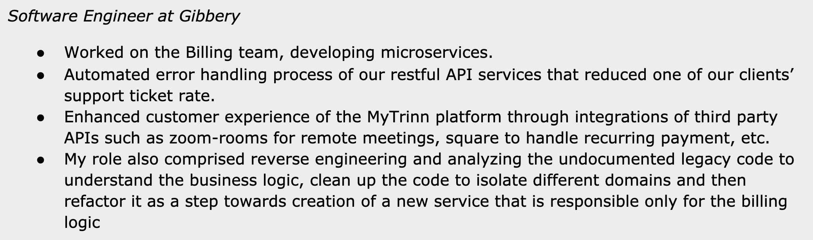

While this description is not that bad, it does not talk about specifics that someone who has not worked at the company could understand. It also had no numbers. While a colleague might know what the MyTrinn platform is, and how challenging the work could have been, the recruiter/hiring manager would have no idea. The last sentence isn’t that bad, but it makes it seem like this role was assigned to the person, and the impact of this refactoring is not clear. Finally, the original description reads sloppy by closing the sentence with “etc”.

**Improvement areas visualized:**

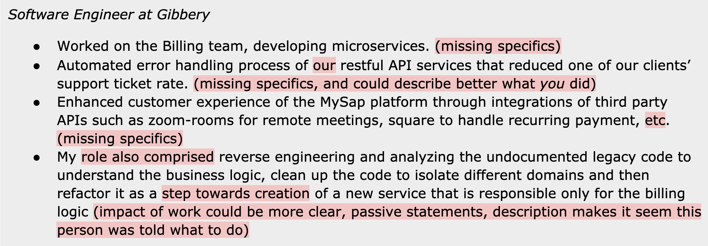

**After:**

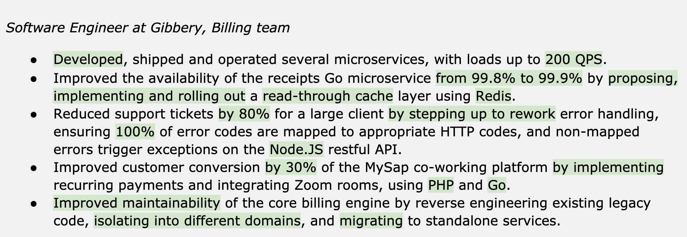

The “after” version adds specifics and describes what this person has done. Specifics include numbers, actions, and specific technologies. This re-edited version conveys that the person applying has moved the needle for the business, can get things done, and it mentions some specific technologies used on the project.

---

## Don't Be Humble

Your resume should sell the professional “you” for the position you are applying for. Don’t claim untrue things, but do aim to paint a great picture of yourself for the audience: the recruiter and the hiring manager.

- **Talk about yourself, not your team. Avoid using “we”** and use the first person instead (in most cases, you can drop the “I”). The resume is about you, and what you have brought to the table in the past. And what the company would get by moving forward with you. Note for non-native English speakers that talking about the “we” is the norm when talking about achievements in some languages. Drop this—in an English resume you should always go with the first-person approach.

- **Be concise but *not* humble.** Don’t hide your achievements—and when in doubt, inflating them on the borderline will hurt less than hiding them. Your CV needs to make you stand out from an already competitive crowd.

- **Make your side projects & open-source contributions shine**. If you built impressive projects or have great open source contributions, bring attention to these in those sections of your resume. Follow the results-impact-contribution model in calling this out, where you can, as opposed to just linking to your Github profile with no explanation or an app you’ve built. If you don’t sell it, the person reading the CV might not look at it in detail.

- **Do talk about extracurricular activities adjacent to tech**, at the end of your resume. Talk about what their impact was, how they were difficult, and link to high-quality resources that you have created. For example, if you’ve organized a meetup with 100 participants, mention this. If you have a technical blog, link a specific, high-quality article the reader can read. Many resumes are dry, and showing off high-quality or standout activities can make a good resume even better. Be mindful of listing neutral extracurricular activities: ones that won’t trigger bias. For example, when applying for a position in Manchester, UK, listing that you enjoy supporting Chelsea on their away games could trigger unconscious bias, as silly as it might sound.

- **Mention your learnings**. It is relevant to read about why and how you picked up a skill, how it impacted a current role or what you would like to achieve with this in the future. This is information that hands-on recruiters and hiring managers value hearing about, and it also makes the resume more valuable. For example, do mention if you picked up a technology to speed up a project, to stretch yourself, or other reasons. Learning new and useful skills proactively is a positive trait that hiring managers will appreciate. As a hiring manager, I wish I would see more of these learnings mentioned on resumes.

- **Don’t highlight negatives** from past experiences. While you should not claim things that are not true, you don’t need to list things that don’t show you in a good light. Failed projects, low GPA scores and other things that come across as negative: you can safely leave these out.

---

**Before and after: don’t be humble**

**Before:**

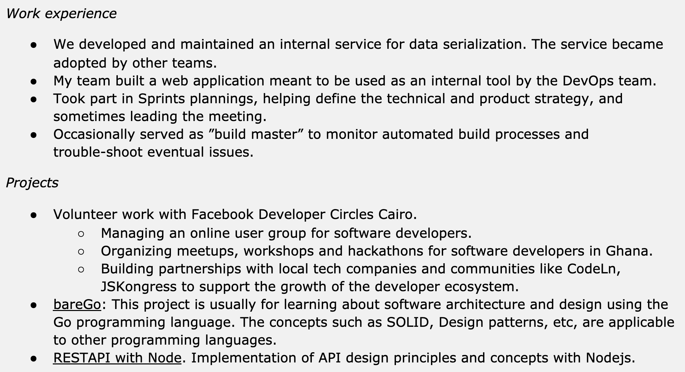

These are the main issues with this version:

- Work experience: much of this undersells the candidate. There are multiple references to the team over the person. It talks passively (“team member”, “took part”) and adds squinting modifiers that make it seem like this person had little contribution (“sometimes”, “occasionally”).

- Volunteer experience. In the “before” example, the candidate put quite a few details on their volunteer work: while this is not bad, it lacks data, and is verbose.

- bareGo: the description is quite casual (“this project is usually…”) and it doesn’t answer the question on why this project is interesting or challenging.

- RESTAPI project: this project has a very generic description. It could hide a “Hello World”-like simple project, or a complex and interesting implementation.

**Improvement areas visualized:**

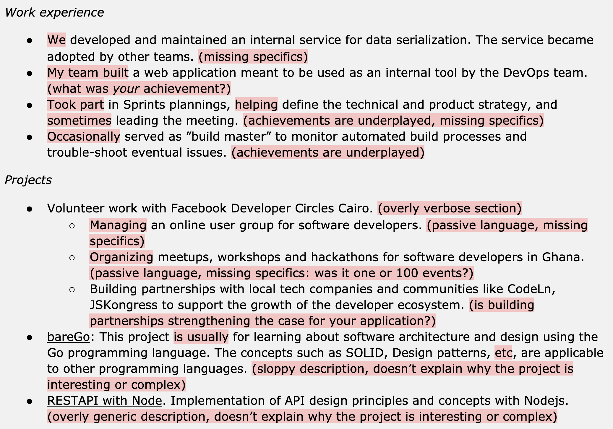

**After:**

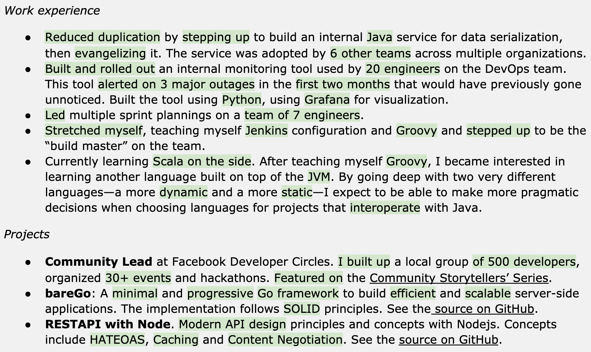

The “after” version addresses several issues:

- The projects mention more specifics, such as the impact, numbers, and technologies used.

- Learnings are mentioned about why this person picked up a new technology like Groovy and Scala, what they achieved and hope to achieve with it.

- The volunteer section is far more focused on what the candidate did, and what the results were. “I built up a local group of 500 developers, organized 30+ events and hackathons”. It also left out partnerships—that did not add much to the resume—and instead, pointed to press coverage that gives further credibility to this activity.

- The bareGo project now talks about the goal of the project, and the complex problems it solves, calling out the approach. As a hiring manager, I’m ready to click on it to check it out.

- RESTAPI with Node also described the project well. It adds more details on the complexity behind the project

- by listing the not-so-trivial elements like HATEOAS (Hypermedia as the Engine of Application State) and Content Negotiation. Again, this description definitely grabs any technical hiring manager’s interest.

---

## Write a Resume for That Job

If you have no problem getting recruiter calls with your resume, that’s great news. It either means that your profile is a standout one, or that you have little competition in the roles that you apply for.

However, for most advertised positions, there are far more qualified job seekers for every tech position than there is headcount. This is great news for recruiters who are seeing lots of inbounds. However, it means you need to put in more work for your resume to grab their attention. To make your resume stand out, you need to write it for *that specific* job description.

Create a “master” version of your resume that lists out lots of details in your work experience and projects sections. Use the results, impact and contribution language. Don't worry if this version goes beyond two pages—as long as you’ll be able to trim it down for each job description.

**Then, create a version of your resume for the specific job description**, re-editing it so it uses similar language to what is in the job details. Remove examples that don’t help you with this position, or move them out of the way. If a job description is for an Android role with a focus on Kotlin and you have Android, Kotlin, and web experience, make sure your resume shows your Android and Kotlin contributions—and perhaps move the web experience further down.

| **From the inside out: the headhunter’s advice on tailoring your resume** Csudi Csudutov is the founder of Mimox, the biggest tech recruiting agency in Hungary. She’s interviewed more than 6,000 developers in 20 years and reviewed far more resumes, developers to startups and well-known tech companies. She shares her advice on how to tailor your resume: ***“You lose very little when removing non-relevant bullet points from your ‘master’ resume.** Yet most are nervous to do so and opt to cram the content instead. Don’t do this. Your resume is there to get you the interview. On the interview, you’ll have the opportunity to talk about the various things that you did that are not on the resume. Be ruthless in removing things that don’t help convey why you are a good fit for the position.* ***One of the biggest ‘secrets’ in tailoring your resume to the job is to understand why the position was opened.** Read the job description carefully. Does it sound like they are hiring someone to build something brand new, as part of a new team, or is it more like there might be something to maintain, perhaps backfill someone? While it can be hard to tell exactly for large tech company job adverts, for small companies, here’s a tip that will help.* *When reading a job advert of a small company, search for the LinkedIn profile of people working there and browse through them. Do they already have someone with the technical skills that the job advertises? If yes, then you’d likely be working with this person. They will probably be on the interview loop as well. And if there’s no one with the languages and technologies the job is asking for, then they are probably hiring for something new. In this case, the ability to build something from scratch might also be valued.* ***Working with a headhunter or a recruiter can be beneficial to you**, as they will already have this scoop from the companies they are working for and you don’t have to second guess these.* *They’ll be on your side, aiming to place you to the position that is a great fit for you, and the company. So don’t discount going through via agencies and headhunters for this specific reason.”* |

---

**Before and after: writing a resume for that job**

Take this excerpt from a job description at Amazon. I added the highlights to point out keywords and key areas that are opportunities to mirror in your resume—assuming you do have experience in these areas. These highlighted phrases are ones that you might consider reflecting on, in your resume.

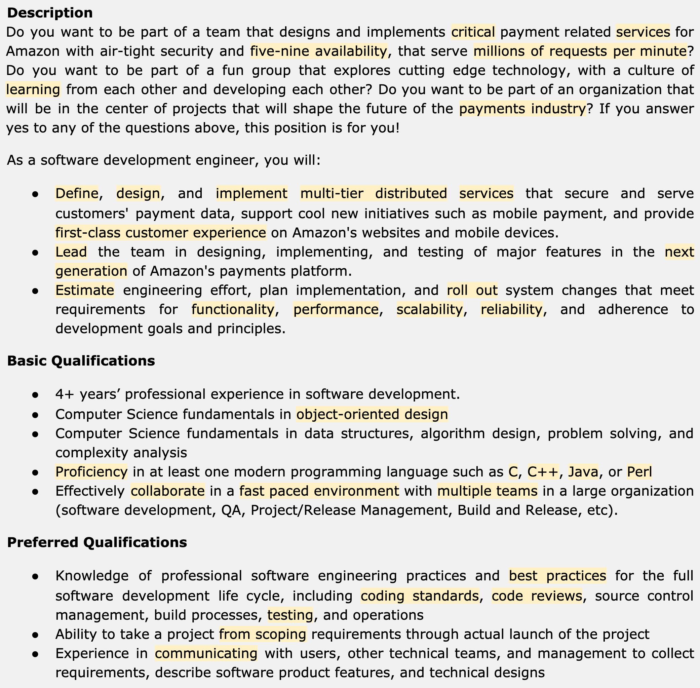

**Before:**

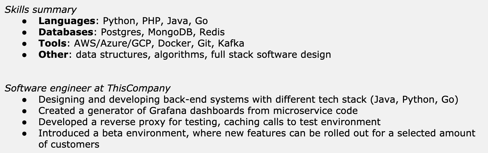

This is not bad—but it is clear how this description is a generic one. It does not reflect on the job description at all. Let’s make it specific for the Amazon listing. Highlights mark the updated phrasing that now mirrors the job description language better. Note that the content of the resume is exactly the same. After the changes, however, it reflects the language that this specific company or job listing uses.

**After:**

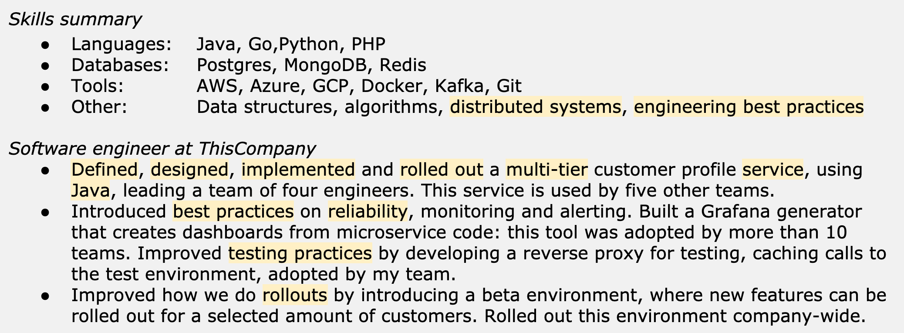

The person behind the profile is still the same. However, a recruiter that reads both versions will more likely move ahead with the second, tailored version.

---

## Different Companies, Different Focus

Top tech companies care far less about the specific languages used, but they do care about software engineering skills. Consultancies and agencies are more interested in very specific technologies and years of experience with those technologies. Tailor your resume for each.

Depending on what type of company and what type of developer role you are applying to, recruiters and hiring managers usually pay attention to different parts in your resume. This has to do with the type of people these companies are hiring, and if the role has any specialization. The most common type of companies and roles are these.

**Tech companies hiring generalist software engineers**

The “big” tech companies, and fast-growing venture-funded companies, almost always look for developers who are generalists. This is because their tech stack can be varied and change quickly. These companies look for good understanding of at least one programming language, and good knowledge of algorithms, data structures and—for senior candidates—designing systems.

A typical job description for this kind of a position could read something like this:

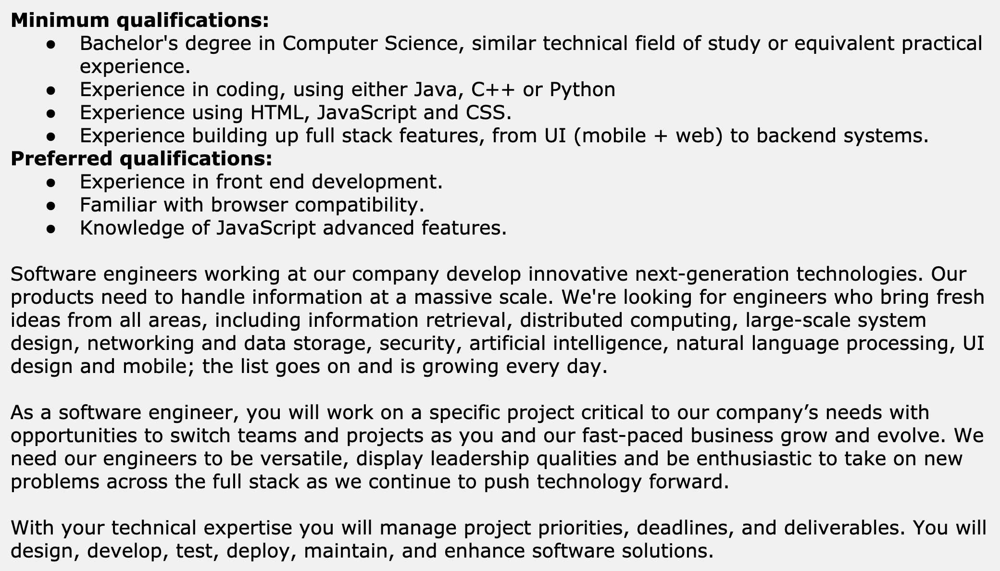

To grab the attention for recruiters at these companies, aim to follow these principles:

- **Do mention programming languages** you are proficient with, *especially* ones that the job description mentions. Knowing a few languages gives a good indication that you’ll be able to pick new ones up on the job, something that is common at these places.

- **Do tailor your resume to the job description**, mentioning areas the job description asks for, assuming you are proficient with it. Data structures and algorithms, computer science fundamentals, object-oriented design, distributed systems, and anything with scale and numbers to prove it are usually the type of experience that catch recruiters’ eyes at these places.

- **Do focus on impact, and engineering metrics** of your work. Strong resumes at these places tend to mention things like RPS for systems people have built, test coverage % increases, cost savings on infrastructure, number of users, number of customer teams, latency reductions and others.

- **Do mention open source frameworks by the company** that you are familiar with, use, or contribute to. Many of these companies contribute heavily to open source, and you can stand out by being proficient users of some of these—especially when they are lesser-known frameworks.

- **Don’t list too many technologies**, frameworks, tools, databases and others. At these places, hiring managers assume that you can pick up any of these quickly. Also, recruiters are far more sensitive to keyword stuffing: it reduces the value of your resume.

- **Don’t list trivial tools** that require little to no engineering knowledge, or that are tied to a given technology. You’ll get a frown from hiring managers when they see Trello or JIRA mentioned. You don’t need to be a software engineer to know these.

| **From the inside out: grabbing the attention of an inbound sourcer at a tech company** Veronika Nora Nagy has recruited for Uber, as well as for startups and consultancies. She’s reviewed thousands of incoming resumes at Uber when she acted as the inbound sourcer for tech positions. Here’s her advice on how to grab the attention of the recruiter who first reads your resume: *“Highlight your experience relevant for the company that you are applying for. For example, for the senior back-end roles at Uber, we were looking for engineers who have worked with large distributed systems. Engineers who have either worked with breaking down large monolithic systems into microservices, or built microservices at their current or past companies. Things around scalability and reliability and similar experiences also would grab my attention.* ***Whatever role you apply for, make sure that you clearly highlight the technologies you have worked with that are relevant for the role you are applying for.** I also always find it a good sign when someone has worked with multiple programming languages and frameworks. It indicated that they are curious professionally, like to learn new things, and are open to new ideas.* *Keep in mind that different cultures teach CV writing in different ways—and a lot of these approaches might not work for international companies. Some cultures tend to arrange their experiences in a table format. However, recruiters at tech companies can find this hard to read. Keeping it short and concise is key.* *As for resumes that really catch my attention: I prefer clean, easy to read resumes above anything else. Highlight your most relevant projects, the technologies you’ve worked with, and be ready to talk about them when you get to that recruiter call.* *I suggest only applying to companies hiring generalist engineers if you are open to learning and using new languages, or if you are comfortable with the existing stack of the company. Take a look at the engineering blog, get a sense for the tech stack being used. It’s a waste of everyone’s time if you get to the recruiter call, only to tell the recruiter that you aren’t interested in working with anything else than C# or Go, when the current tech stack at the company is Java or Node.js.”* |

**Companies hiring for *that* specific technology**

Non-tech-first companies and smaller companies often hire for a specific technology. The tech stack at these places is already set, and very unlikely to change over the next few years. You’ll be able to tell that you are looking at a *specific technologies company* from the job description that lists technologies required extensively. These technologies will be the exact stack the company works with—and the stack they are looking to hire for. Here is a typical job description for such a company:

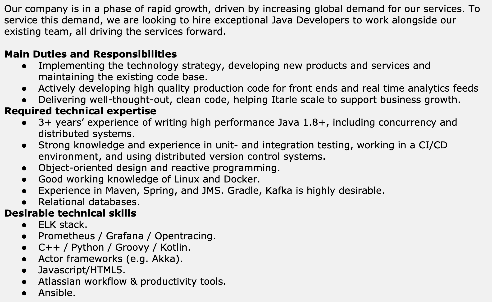

The job descriptions for these places are also more traditional, mentioning things like “duties and responsibilities” or “technical expertise” and “delivering code”. To grab the attention for recruiters for these companies, follow these principles with your resume:

- **Do mention all relevant technologies in the job description** that you are comfortable with—even if you might not be fully proficient with all of them. Many of these companies work with recruiters who are not as technical, and screen for specific technologies or phrases mentioned, as per instructions from the hiring manager.

- **Do spell out how many years’ experience you have** with the main language the company is looking for. It is worth having a short summary section, listing out this information for the recruiter to see.

- **Repeat the technologies** you’ve used, listing them in the work experience section as well. This will confirm both to the recruiter and the hiring manager that you are hands-on with what they are looking for.

- **Do not list unrelated or trivial technologies**. While keyword stuffing is more relevant when applying for these types of companies, don’t go overboard. And do remove technologies that are not relevant.

- **List relevant technology certifications** you might have. While tech companies rarely care about certifications, non-tech first companies often see these as a positive sign, assuming the person put in some effort in mastering the language or framework.

- **Do keep your resume easy to read.** Because of the many technologies you might be tempted to mention, it can be tempting to make up sentences just to be able to repeat these. Don’t do this. Many applications coming into these companies are overflowing with keywords, but tell very little. Find that pragmatic line, and your resume will grab the recruiter’s attention, as you have the relevant skills and a clean resume.

**Agencies** hire developers, then contract them out to client work. Unlike other companies who are hiring for a specific position, they might be more flexible when they see additional technologies that they could potentially contract out to clients. The same advice applies for applying for agencies, as it does for non-tech-first companies and smaller companies, with the exception of listing of your skills:

- **Consider mentioning all technologies** you are proficient with, not just the ones that are in the job description, when you apply for an agency.

- **List all certifications for technologies** you might have, as certifications might make you more attractive for an agency. Agencies know that they can contract people more easily if those people have certifications that prove their value.

| **From the inside out: grabbing the attention of a recruiter for a technology-specific company** Konstanty Sliwowski has spent close to two decades recruiting for various companies, currently specializing in Go, JavaScript, PHP and Java roles. In his guide [The Developer’s Guide to Getting a New Job](http://pragmaticurl.com/konstanty-book-ttr), he shares the following advice to follow when applying for roles that are geared towards a specific technology: *“Mention your top technologies first. Another no-go is naming every single technology you’ve worked with. As an extreme example, there is absolutely no need to mention Microsoft Office. There are several ways you can do it. Choose to either group your skills and technologies into categories, and make an expanded list.* *Cite examples of your skills in action. Your CV must have examples of each of your skills, as well as how, and when, and in what context you used them, and to what effect.* *Concise job role summaries only. Three to four bullet points per role is perfect. Go for either a few bullets or a single paragraph of text covering each job summary. This normally includes your major tasks and responsibilities, and also key results. Put all the extra information on the last page. Keep sentences brief (seriously—avoid long sentences) and don’t list every single tool you have worked with (or every single project you’ve done). Start sentences with action verbs to get points across quickly.”* |

## Keyword Stuffing

Keyword stuffing is a controversial but important topic. At companies where recruiters are not very technical, resume filtering is done by discarding resumes that do not have certain keywords. Recruiters and HR folks will often pattern match either based on expectations from the hiring manager or based on keywords that they have seen lead to offers in the past.

Let's take a backend job description that explicitly says that the team uses Java for development. In most cases, resumes without a mention of "*Java*" or "*backend*" would be disregarded. For a team working on distributed systems, less hands-on tech recruiters might discard resumes that don't mention anything distributed—even if they might describe working on such systems using phrases like “microservices”, “messaging queues” or “globally fault-tolerant systems”. The recruiter is not a software engineer: they just look for the term "distributed". Note that this practice is less common at large companies with technical recruiters—but it is a thing when screening is done by someone more junior.

A workaround is to throw all possibly relevant keywords into the resume. This is called keyword stuffing. You can see it happening with this resume, for example:

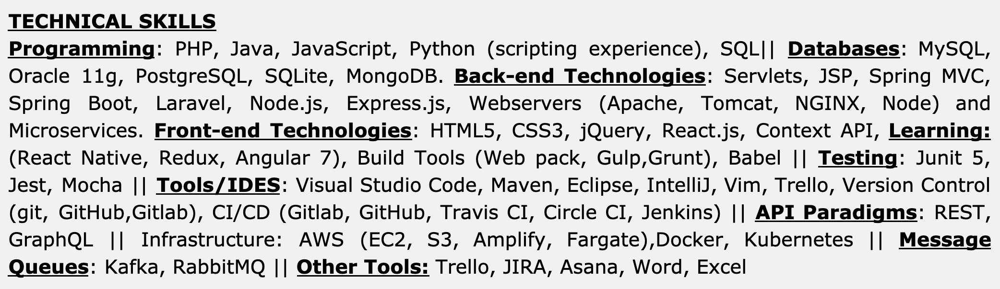

*Keyword stuffing: an example of overdoing it*

While the person doing this kind of keyword stuffing would think they’ve “covered” all possible technologies, it can make the resume look unprofessional. For places where recruiters are less hands-on, this approach could work, as they might “see” the keywords the job needs. For places where requirements are more clear and recruiters are technical, this strategy will work less well. Even if a recruiter would decide to proceed, as a hiring manager, I would consider putting this resume in the “maybe” pile.

So how do you include keywords relevant for the position, while also keeping your resume professional? You do this by including the most relevant keywords—technologies and frameworks—in your resume, but do this in a human-readable way.

A good way to have keywords present in your resume, while also keeping it professional is to have a short "Technologies", “Skills” or “Languages and Technologies” section where you list the technologies you are familiar with and are relevant for the job. In your Experience section, sprinkle specifics on the relevant technologies you've used in projects. It's fine to mention the same technology both in the technologies section, as well as under the specific part of the experience. But do ensure the resume stays easy to read.

Let’s go back to how to improve that part in the previous resume. We’ll cut down the technologies listed to be relevant to the job description, and mention technologies that were relevant in getting certain projects done:

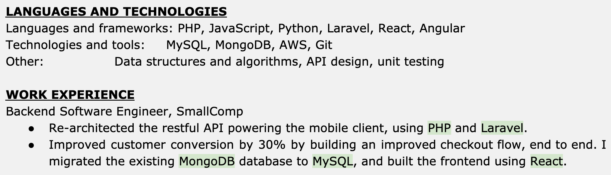

*Sensible keywords: cutting down to ones relevant to the position, bringing examples in the work experience section*

The result is a cleaner resume that still has key technologies listed—in fact, it reinforces the ones that the candidate has more hands-on experience with those technologies.

Recruiters will scan for different keywords for different job positions. This is another reason you'll want to create a custom resume for *that* job description. You can tailor your wording and technologies you are proficient with, so recruiters keep reading after they've seen key technologies mentioned.

Don't forget: your goal is to get through the initial resume screening where most inbound applications without referrals fail—many of whom are actually qualified for the job, but their resume does not tell the story.

## Recap: Actions to Improve Your Resume

In this chapter, we’ve gone through ways to have your resume stand out from the crowd. Being specific about your results and impact, and using numbers to convey the value you created is a massive differentiator.

Tailoring your resume for the specific position is even more so. Different companies do care about different areas: tech companies hiring general software engineers are more interested in seeing a breadth of skills, while companies hiring for a specific technology care more about expertise with the stack they work with. Tailoring your resume with keywords, doing sensible “keyword stuffing” is an additional step worth considering, to make sure the resume makes it through the ATS system if you don’t have a referral.

To make your resume stands out, carry out the following checks.

- **Numbers and impact in your resume.** Do you have some, or most of your results expressed with numbers or percentages? If not, aim to change this. The more specifics, and the more measurable the impact, the more you convey your results.

- **Are you using active language?** Use active verbs that convey what *you* did, as opposed to things that happened, in a passive setting.

- **Are you mentioning technologies in your examples?** On top of numbers, are you being specific on the tools that you used to achieve some of the results? You don’t need to do this for every part, but repeating technologies that you also list on your languages and technologies section reinforces that you are hands-on with these.

- **Have you customized your resume for that specific job, creating a specific version?** You’ll want to have your resume reflect on the job you are applying for. Are you using similar language to the job description to describe your activities? Are you explicitly calling out technologies and languages in the job description that you are proficient with? Are you using similar active verbs to those the job description contains? Tailoring your resume, together with expressing the impact of your work, are the two most impactful changes you can make.

- **Are you talking about yourself, not talking about “we” or “the team”?** Make sure your resume is about your achievements. Don’t be humble—err on the side of taking credit for the work that you were involved in.

- **Do you mention impactful, complex or interesting side projects?** Are you describing these projects in such a way that it’s easy to understand why they are relevant? Don’t leave off some of your additional achievements that add value to your resume.

- **Are you applying for a generalist engineering role, or one focused on one specific technology?** Differentiate what type of position you are writing your resume for. The two types of companies should have different resumes. Tailor your resume accordingly.

- **Have you “stuffed” keywords in a sensible way?** When comparing the job description and your resume, does your resume contain what could be the main “keywords” that recruiters will look for? Does your resume contain the key languages and technologies listed, the name of the position and the tech stack? If the position asks for a minimum number of years’ experience, does your resume convey this information, directly or indirectly?