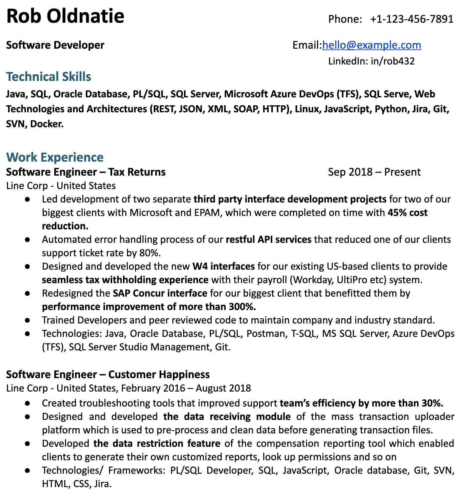
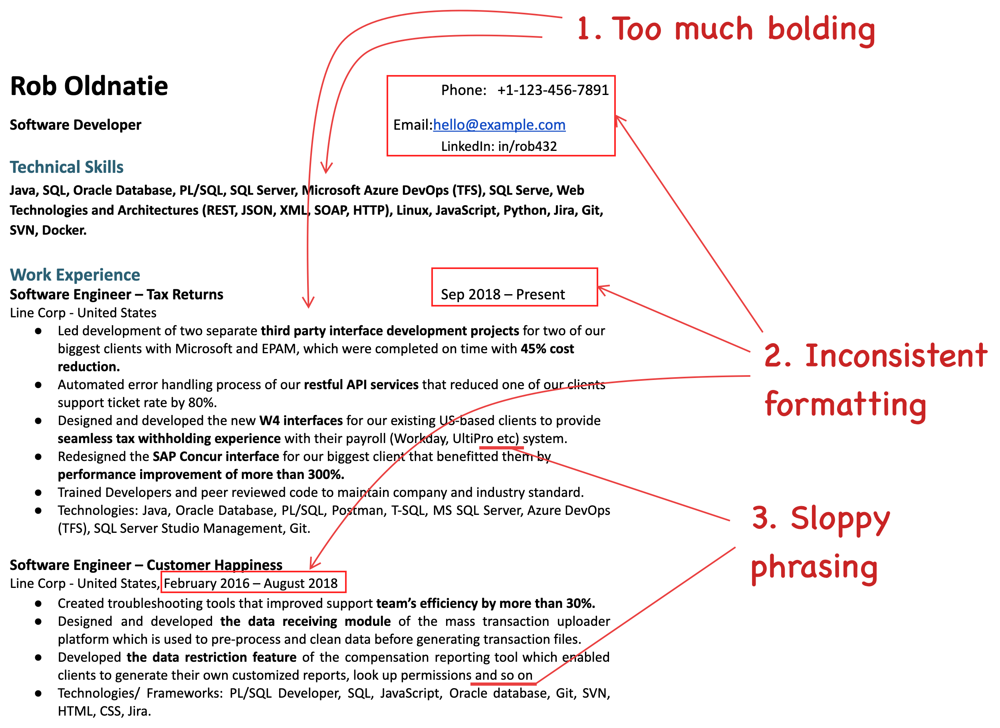
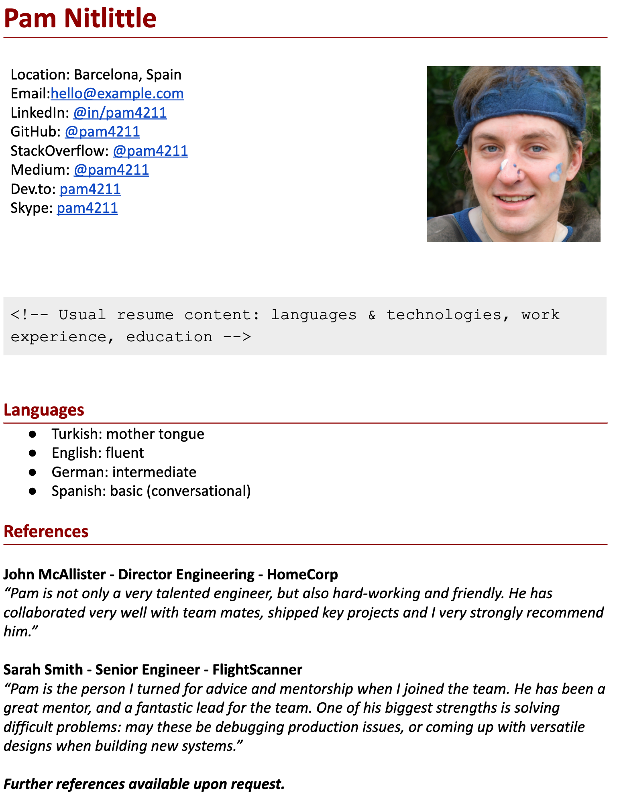
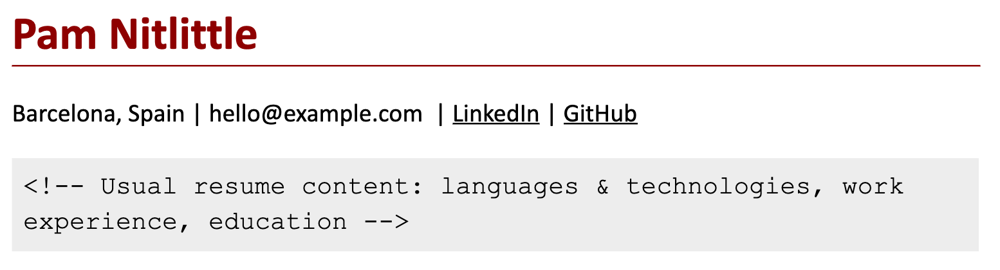
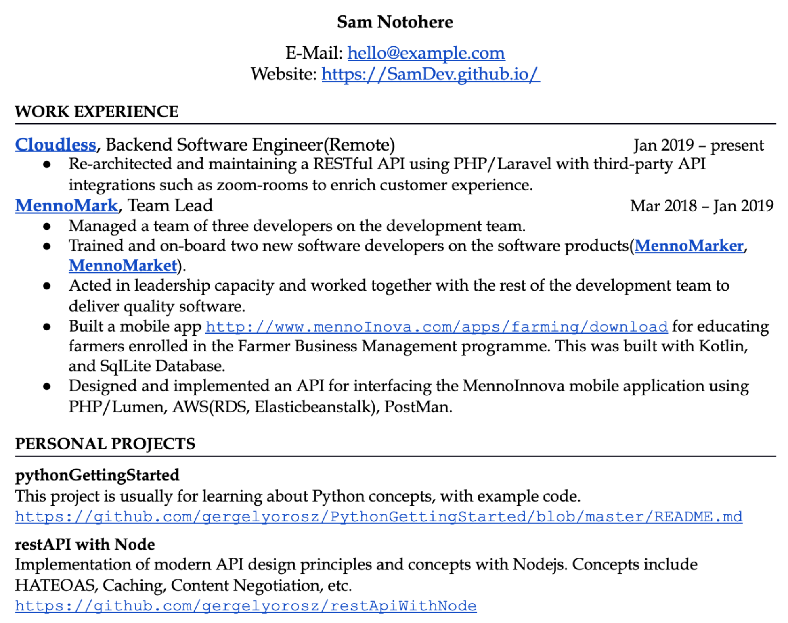
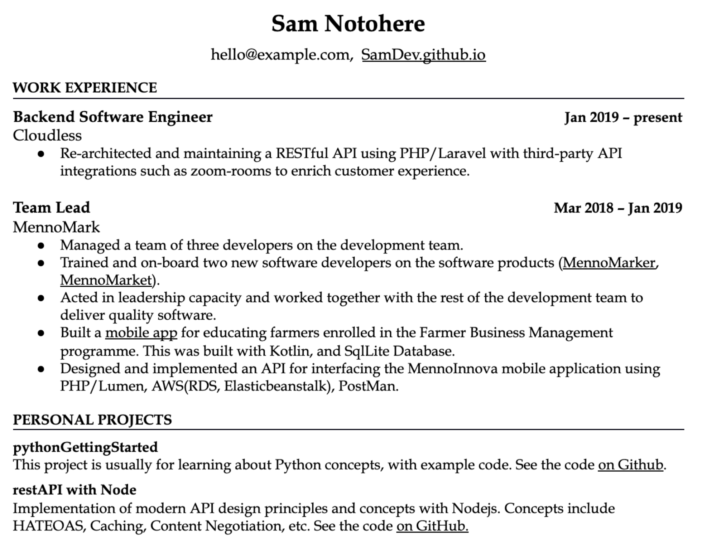
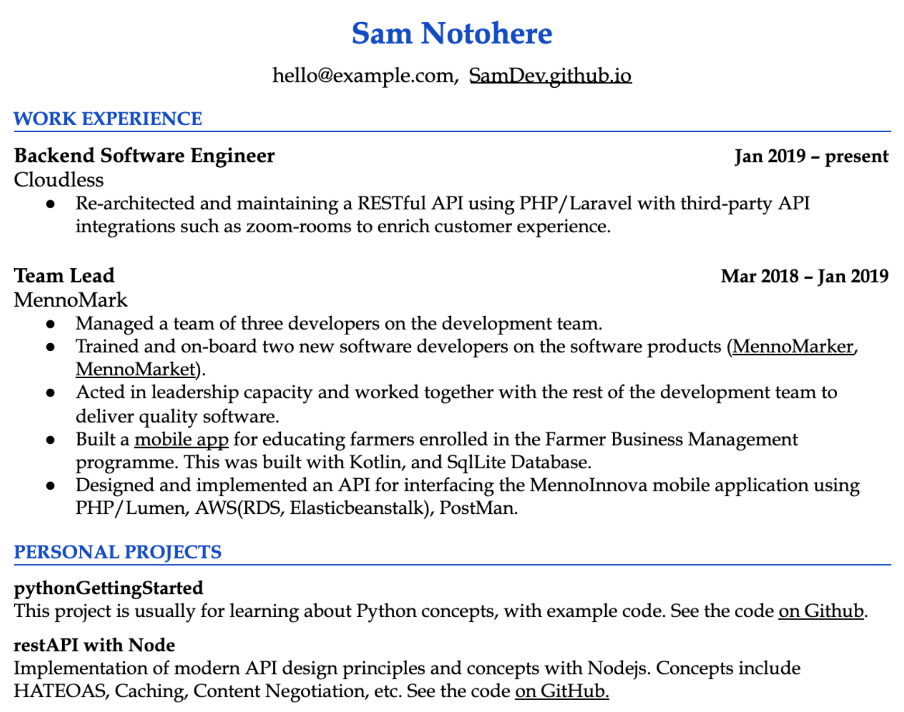

# Chapter 6: Common Mistakes

I’ve noticed certain repeating themes I am calling “mistakes” with resumes. These are areas of improvement, which almost always make resumes better. Let’s go through these.

## Poor Format

I have seen too many resumes where developers had good and relevant experience, but this became hard to understand, due to poor choices in formatting. The most common issues are:

- **Hard-to-scan resumes**. Multi-column resume formats are far harder to scan than the one-column ones. While candidates are often proud of how much information they squeezed on one page, this format often leads to their resume being read in less detail. Simple formats work better.

- **Too much bolding**. Your resume should have little bolding, and that bolding should be consistent, limited to key parts, like dates, titles and companies. I see too many resumes bold out seemingly **random** parts in the middle of the sentence that **don’t** seem to **make sense**. Focus on concise descriptions, and a clean format, and be very careful with bolding within sentences.

- **Too “flashy” resumes**. A developer resume is 95% about the content, 5% about the style. Still, some people go overboard, choosing eye-catching templates, to the point that contrasts can make things hard to read, and recruiters struggle to find relevant information. Resumes like this can work well for design- or UX-heavy positions, though.

- **Inconsistent formatting**. Different font sizes, key information being misaligned or positioning elements with spaces over tabs can all lead to resumes that show amateur formatting. While this itself will not result in a rejection for more senior candidates, it conveys that you don’t have much attention to detail, and don’t know how to present yourself well.

- **Sloppy phrases** scattered across the resume. For example, using “etc.”, “and so on”, slang or unprofessional language. Use clear and neat grammar, and full sentences.

**Common mistakes: bolding and inconsistent formatting**

Take a look at this resume. What seems to be issues that stand out immediately?

As a hiring manager, a few things immediately pop out. First, there is far too much bolding. And the things that are bolded are inconsistent. Why is “W4 forms” bolded, when the application is for a tech company where the work has nothing to do with taxes? Second, the formatting is inconsistent. Font sizes are different, and alignment is off. Finally, the language used is sloppy in places.

**Visualizing the issues:**

While the content of the resume is decent, these issues convey the perception of a person who doesn’t have good attention to detail. It also makes the resume harder to read and to comprehend.

## Forgetting About Your Audience

You are writing your resume for recruiters and hiring managers who you do not know. You want to convey your skills and tell a story to them, assuming they know nothing about you. Common mistakes people make include these:

- **Using internal acronyms and jargon.** Avoid using project names and acronyms that are internal and people outside the company don’t understand. *“I did QA for the N94 and E70 programs.”* The recruiter reading the resume will not know what N94 was—nor would most people outside the company you worked for.

- **Not reflecting on the job, and not tailoring the resume for the position**. Make sure you keep the audience of your resume in mind. The audience is the recruiter who is recruiting for *that* specific position which you are applying for. So, say you are applying for a frontend position and have both frontend and backend experience: in your examples, always start with the frontend ones, not the other way around.

- **Using cliches over statements backed by evidence**. What does the following sentence tell about you? *“I am a team player and a fast learner who can hit the ground running.”* From the point of the recruiter, it doesn’t give them any information. It doesn’t contain facts, examples or specifics. It is a cliche, in its current form. Use the “results, impact and your contribution” structure in your experiences section instead to demonstrate any traits through what you have delivered. If you really think it’s important to convey these, save them for a cover letter—but even there, back it up by examples. Instead of “I am a team player”, let your actions speak for themselves: “I organized two team offsites and onboarded three new starters.”

- **Being too verbose**. The attention of recruiters is limited: they will glance at your resume for seconds. Avoid large blocks of text or long sentences. Optimize for quick and easy reading. It’s not easy to distill years of experience in a few short sentences. Still, you need to do this, and ruthlessly edit your resume.

## Unnecessary Details

Many resumes include details that are a waste of space. These are most frequently added because traditional resume templates have them, and candidates assume they should share these details. Here are the most common details that you can skip, in the vast majority of cases.

- **Photos.** Skip the photo is the strong recommendation of this book, due to [the biases it creates](./07-p2-c1-tech-resume-basics.md#avoiding-biases-personal-details-and-photos). In the rare cases in very few countries where you are *required* to add a photo, use a professional one that makes you look *good*. Smile on the photo or have a positive vibe and avoid the mugshot-like passport photos that make you look grumpy.

- **Too many contact details / social profiles**. For contact details, don’t share more than four. The most common ones I see are phone, email, LinkedIn, GitHub and website. Choose no more than four of these—and list them so they take up little real estate, on the top of your resume. Anything beyond this is irrelevant. Most recruiters and hiring managers won’t even click through on these ones. I’ve seen resumes that list Skype, Instagram, Twitter, Upwork, Medium—on top of LinkedIn, Github and a website. Stick to very few and relevant links.

- **Spoken languages**. Many resume templates come with a “Languages” section and people who are non-native English speakers keep this separate section that usually says *“Languages: Hungarian (mother tongue), English (fluent).”* This doesn’t add much value—unless you’re interviewing for a Hungarian company, that is. For a tech resume for an English-first company, people assume you are fluent in English and they care about your programming languages, not the different ones you speak.

- **Self-rating your skill level** on languages or technologies. Some resumes have stats, percentages, or X out of 5 scores next to languages and technologies. This self-rating can only backfire. First, if you rate yourself as 5/5 or 100%, hiring managers will be dubious. No one really knows *everything* about a programming language. However, if you rate yourself at 75% or 3 stars, other hiring managers will assume you’re not that proficient. And your rating will be off, anyway. Remove all ratings, and just list things you have proficiency with. If people will want to probe this on the interview, that’s fair game. But that self-rating is not necessary.

- **List of references or “references available on request”**. Both are a waste of space. References will only be important after you pass the interviews. And it is expected in tech that you’ll be able and willing to provide these. Large companies use background checks, and smaller ones follow up themselves, usually after asking you. But save the space from your resume for this.

- **Quotes from references praising you**. Some resumes add quotes from others, such as *“Described as ‘executing at extremely high standard’ on previous performance reviews”* or quotes from referrals praising you. These look out of place. Your developer resume is about you selling yourself, not adding quotes from others. It’s best to save any quotes for the recommendations section on LinkedIn.

| **From the inside out: clicking through to outdated links** Jorick Thijs Polderman, senior technical recruiter at Transferwise, mentions a common anti-pattern where candidates add links to resumes that are not up to date: *“What I often see is that there are either no contributions or repositories on the candidate's Github pages, or a personal website that isn't functioning. I often see GitHub pages or personal websites not giving away more information that could be beneficial to the candidate's application process*—*such as a more detailed resume or a technical blog.* ***When adding a link, make sure the links work and the information is up to date.** For example, your LinkedIn should be reflecting your resume. If you have nothing visible on GitHub, it might as well not be included. The same goes for personal websites.”* |

**Common mistakes: unnecessary details**

Take a look at the following resume that is for an application for a position in the UK. What sections don’t add much to the content?

Outside the core content, not many of the sections do add value. The photo introduces bias. There are far too many contact details and social accounts listed. There’s no reason to add all of these. Spoken languages are unimportant in a market or company where English is the only language spoken. And references don’t have a place on the resume, including praise. Let’s remove all the unnecessary sections:

Now we only have information that is relevant for the position: the “meat” of the resume.

## Links

Links taking up too much attention (coloraturas or space), dead links, pointing to non-high-quality content.

- **Non-clickable links**. I often see links to projects, GitHub or other sites that are not clickable. The recruiter will never copy-and-paste this link, and as a hiring manager, I will also do this once in a blue moon. Make that link clickable like I did this one:
  
  [https://github.com/gergelyorosz](https://github.com/gergelyorosz).

- **Linking to stale GitHub, Linkedin or websites.** Many dev resumes have links to GitHub, Linkedin or a website. While most recruiters and hiring managers won’t bother clicking through, the thorough ones will. There are few more disappointing things than seeing that your GitHub is untouched for years, your pinned repos do not have READMEs or that your website was last updated 4 years ago. Link only if they are up to date. Otherwise, save the space and remove it. Contrary to popular belief, you don’t need to have these links on your resume—especially when their contents don’t add value to your current application.

- **Leaving in the full URL of the link.** In some resumes, links to portfolios or projects are pasted in their full length, such as
  
  [https://github.com/gergelyorosz/PythonGettingStarted/blob/master/README.md](https://github.com/gergelyorosz/PythonGettingStarted/blob/master/README.md)
  
  Don’t do this. Make links clickable, and hide the full URL behind a name that describes what the link is for. No one will print out your resume, then type in the URL into a browser.

- **Links standing out too much in color and style.** Many resumes leave links as they are, with the default blue color. While this would not be a problem, this is often the only color in the resume, pulling eyes to links that are meant to be details. Consider making links blend in, rather than standing out, by keeping them the same color as text, and underlining them.

**Common mistakes: links**

Take a look at a section of this resume, which contains several links.

This resume section contains most of the common mistakes with links. The color of them stands out and draws attention to the links instead of the relevant content. The links take up too much space by typing out the full URL. The font for the links stands out—there is little reason to use a distinct font. Let’s address these issues. Note that there’s a lot more to improve on in the resume content. In this example, we'll only improve links and highlighting.

With the changes, we’ve removed the highlight colors for the links. Now, these don’t draw any attention. Instead, we can focus on drawing attention to where we’d like the recruiter and hiring manager to look first. In this case, this person chose to focus on the titles, the dates of employment, and the names of the personal projects. There’s also an option to use a highlight color to make the resume even more readable, for example, by coloring the parts that are just section names with a highlight color:

We’ve gone from having the default link color highlighting parts of the resume that were unimportant, to the important parts of the resume standing out. Now the “placeholder” information stands out with a color of choice and makes the resume easier to scan. Links are still clickable, and an underline invites people to click them. In practice, recruiters and hiring managers will only click these links after finding the key information they are looking for in the first scan.

## Recap: Actions to Improve Your Resume

In this chapter, we’ve looked at some of the most common mistakes with developer resumes. Poor format with sloppy phrasing and forgetting about who you are writing for—the recruiter and the hiring manager for *that* specific position—are common ones. Adding unnecessary details, from personal details to spoken languages or a list of references is another one. And drawing the reader’s attention to things that are not really important—for example, by using links that are long and have a standout color—is also something that you’ll want to avoid.

Do the following checks to ensure your resume does not have a “classic” mistake that will make a recruiter roll their eyes:

- **Do you have a photo on your resume?** Remove it.

- **How many contact details and social profile links do you have on your resume?** You should have no more than four. Do you need all of these?

- **Do all the links work on your resume?** Click through each of them.

- **Do all the links point to professional pages on your resume?** When you click through, will people see well-formatted, well-written content that conveys the type of work they can expect from you? Ensure this is the case also for your blog, GitHub, LinkedIn and any other links you provide.

- **Is your resume easy to scan?** Give your resume to a friend and ask them to take a look at it for 5 seconds, then tell you their immediate impression. Did they see key details? Did they think it’s too crowded? Or that it has too little information?

- **Is your resume simple enough?** Are you using any “fancy” designs? If so, is this kind of “fanciness” getting in the way of readability? If it’s not in the way of readability, that’s great. However, if it’s making things harder to scan, consider going with something more simple. Note that for frontend, UX or design-heavy positions, some nice flair can be a great touch.

- **Is the resume concise and to the point?** Are you using short sentences? Do you have bullet points with rarely more than two lines?

- **Are you bolding too much?** Aim to not bold anything **inside** a sentence, like in this one. Only bold important things like job title, company name, date, or headers.

- **Is formatting consistent?** Are you using standard font sizes, and aligning with tabs, over spacing things to be approximately close?

- **Are you using internal company jargon?** Do you have project names that only people inside the company would understand? If so, consider changing them to describing the project.

- **Do you have a (spoken) languages or a references section?** You can probably remove both of these.

- **Do links stand out with a different color or formatting?** They shouldn’t. They take away space and attention.