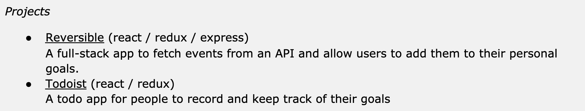
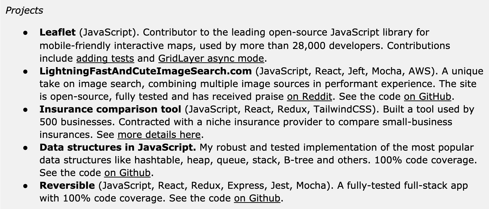
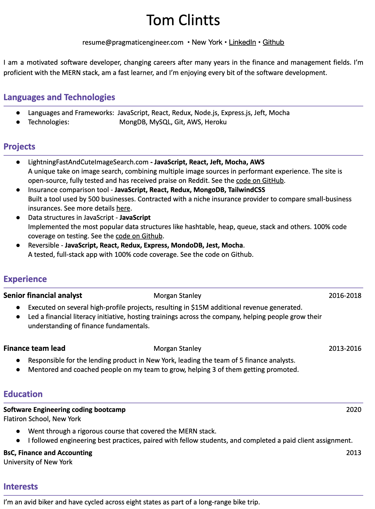
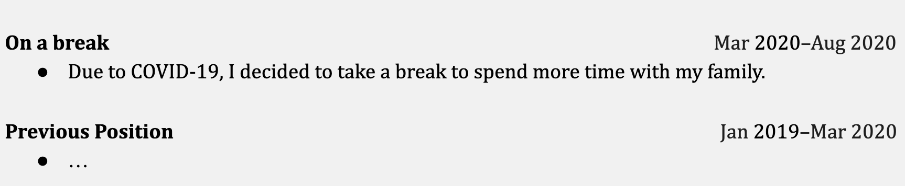
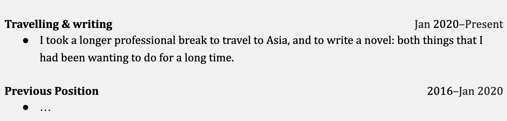
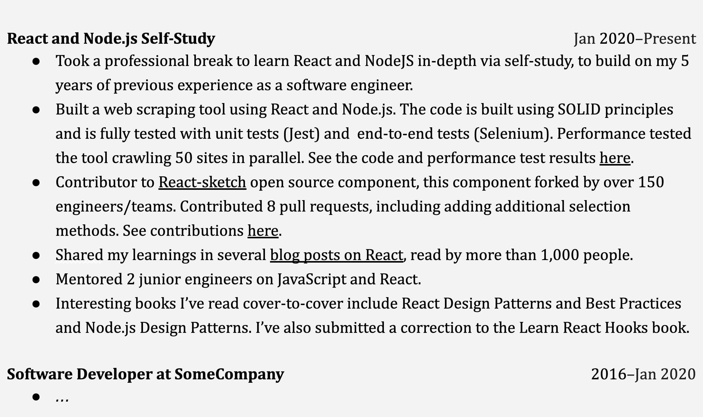
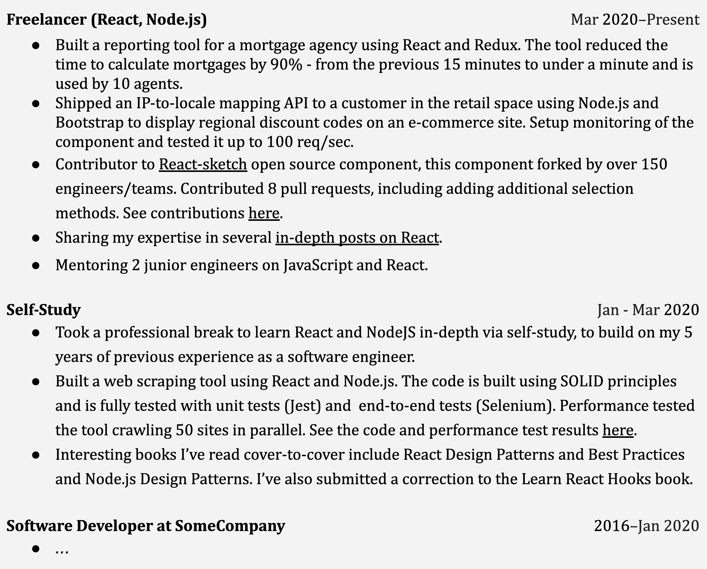

# Chapter 7: Different Experience Levels, Different Career Paths

Depending on how much experience you have had, you’ll want to focus on different areas of your resume. In this chapter, we’ll share specific advice for students, bootcamp grads, career changers, senior and above engineers, tech leads, and engineering managers.

## Current college and university students

If you are still in school, you are already contributing to your future resume. On top of mastering software development, software engineering and computer science fundamentals, here are a few things you can consider that should help with your future job search.

- **Apply for internships.** One of the best experiences you can have as a student is working as an intern, on real-world problems, in an industry setting. To do so, seek out internships. You usually have to apply well ahead of time, and do your preparation for the interviews. Internships are something I did not do while at college—and I wish I had.

- **Volunteer for extracurricular campus activities.** You will likely have opportunities to help out professors, lead laboratory practices, organize events, and others. Consider stepping up for these. You’ll gain hands-on experience in mentoring others, leading groups, and taking initiative.

- **Publish your university projects**. You’ll undoubtedly have class projects to complete, some involving building working software. Consider putting in some extra effort and publishing these online, for others to be able to download or try. This is especially true for your final projects, which will be more complex than usual.

All of these activities will help you grow faster—and these additional experiences can help you stand out when looking for jobs as you graduate. Internships can be a lot more than this, as you might get return offers from when you graduate.

## Bootcamp grads

As a bootcamp grad, your experience will hardly stand out. While you likely have learned basic software development skills, your time spent studying these concepts will be less than college or university graduates studying software engineering or computer science. You will, most likely, also be competing with several other bootcamp grads for the same position.

As a bootcamp grad with no professional software development experience, you will be able to apply to positions where hiring managers are okay with someone with no software development experience. Unfortunately, not all jobs will not be in this category.

**Projects**

Projects are one of the key areas where you can stand out and differentiate yourself. Most bootcamp grads will have projects listed that they did as part of their bootcamp course. To stand out, you’ll want to showcase better examples. Consider the following to stand out.

**1. Publish projects with good READMEs** on your Github page. Aim for the README to have a good summary, screenshots, details on how to run, and how to test. Take inspiration from [projects with awesome READMEs](https://github.com/matiassingers/awesome-readme).

**2. Have tests for your project that can be run**. Most bootcamp grad projects don’t have automated tests, such as unit tests or end-to-end tests. Many of them have not heard of TDD (Test Driven Development). To learn more about this, see the [Learn Test Driven Development](https://github.com/dwyl/learn-tdd) resource.

If you have tests in your project, add a “Running tests” section on your README, to make it clear how anyone can run these. For an example on how to document running tests, see [how this is done in Leaflet](https://github.com/Leaflet/Leaflet/blob/master/CONTRIBUTING.md).

Once you have tests in your code, call this out on your projects. In the project description, mention the code coverage percentage—and see if you can get this higher. Having built a project that is tested will already help you stand out from the crowd.

**3. Contribute to other open source projects on GitHub**. If you get to merge your pull request, you can claim that you’ve contributed to a project used by more than a certain number of developers. Stars on the project is a metric you can use here. For example, for a project with 28,000 stars, you can state: *Contributed to the Leaflet, the leading open-source Javascript mobile friendly-interactive library with more than 28,000 developers using it.*

**4. Turn takehome projects and coding challenges into fully-fledged projects.** Assuming you make it through the resume screen, a next step will be a coding challenge you need to submit. After submitting this challenge, don’t stop there. Continue the work and publish an even more polished solution online, with code on Github, tests in place, and a nice user experience. Consider spending a little money for a domain and hosting, and have this project be accessible to anyone—and add it to your resume.

If your takehome project doesn’t take you to the next round, ask for feedback, and build that feedback into this project. Once you publish a project you’re proud of, you can always send a follow-up to the company, showing them the improved version you’ve built. Don’t hold your breath—but who knows?

| **From the inside out: how can I stand out as a bootcamp grad?** Raymond Gan graduated from Flatiron School in 2013, landed a job as a software engineer in New York after graduation, and has worked at several startups and tech companies as a software engineer since. He runs a study group for bootcamp grads, and here is his advice on standing out from other applicants: *“The most valuable thing you can do to get jobs, besides paid software work, is to fix bugs on/add features to popular open source projects on GitHub! It's more valuable than LeetCode problems or student projects (which have NO customers).* *Almost ZERO junior people I've known in 6 years have made pull requests to popular open source projects and gotten them merged into a master branch! ZERO. Open source work is more practical, impressive, and directly related to our daily jobs. It has REAL CUSTOMERS! That's the work companies most want!* *Here is a list of [beginner-friendly projects to get started on](https://github.com/MunGell/awesome-for-beginners). Or you could look at popular projects with hundreds or thousands of stars, and their open issues.* *Take the [Yarn package manager](https://github.com/yarnpkg/yarn/labels/good%20first%20issue). Based on the number of stars, at least 35,000 developers use this tool. So if you get your pull request merged, it means senior JavaScript engineers think your code is good enough for 41,000 people. What impresses a company more? Open source work, LeetCode problems, or yet another student project?* *For inspiration on pull requests to start with, see [a collection of good first issues merged](https://github.com/Leaflet/Leaflet/issues?q=is%3Aclosed+label%3A%22good+first+issue%22) for the [Leaflet](https://github.com/Leaflet/Leaflet/issues?q=is%3Aclosed+label%3A%22good+first+issue%22) project. Leaflet is a library for mobile-friendly interactive maps. All of these are small bug fixes—read through them to see how small a fix can be.* *Continue your education through making pull requests for active projects. When you make a pull request to master, it will probably get rejected. So what? Those who reject your code will be senior engineers who are owners of these projects, and they'll often leave you comments to improve your code before they will merge it to master: "Add tests. Fix this bug here. What if this bad thing happens? What about using this algorithm?”* |

---

**Before and after: projects**

Most resume advice in this book shows how to change the phrasing of your experience. This example is different. It shows what happens when you grow your experience and polish your projects while applying for jobs.

As a bootcamp grad, it’s hard to stand out with the basic bootcamp projects. However, if you invest time during your job search to improve your projects—for example, by adding tests—, contribute to open source projects, or to do a paid project on a freelancing site, this can make a large difference.

**Before:**

**After:**

What happened between these two versions? Five months, actually, while this person was job hunting and growing their skills. Here’s how the additional projects came about.

**1. Contributed to popular open source projects.** This person looked through the [list of beginner-friendly open source projects](https://github.com/MunGell/awesome-for-beginners), filtering to their strongest language, JavaScript. After finding ones that had the most beginner-friendly issues, they spent time playing with the project, reading past pull requests, and finally, making some first changes. This was a lot of back-and-forths, but lots of learnings. This open source contribution now stands out and the person is more confident in their skills.

**2. Published one of their takehome challenges as a fully-fledged project.** One of the takehome challenges was building an image search app that uses the Flickr API. They completed the challenge—though they did not get to the next interview stage, unfortunately. Still, this person took this project as an opportunity to turn it into a production-ready product, with more features, unit and UI tests, and integrated Flickr, Giphy, and Unsplash image sources.

They also bought a domain to run the service on to make it stand out. The domain cost $15—a good investment for the job search. They made it look and feel professional, tested it with their friends, and submitted the finished work and code to a Reddit forum for feedback.

**3. Landed a paid project on a freelancing site.** While job searching, this person responded to multiple projects on freelancing sites. They ended up getting a project with an insurance comparison small business. The project was difficult, and the client argued about the price. As this person's main goal was to get experience, they decided to not care about making a profit. Instead, they delivered high-quality work.

They published screenshots and code snippets of the work on their portfolio page afterward. The nice thing about paid projects is how real customers use them. Also, you don’t have to disclose how much—or how little—you got paid.

**4. Turned one of their coding challenge interview learnings into a public project**. This person struggled with a few of the coding challenges, especially when it came to using data structures. So they decided to practice them in public and implemented several data types, with tests, and published them with a tidy README. Not only did they learn these structures better, they now have a project to show for it!

I did exactly this on an earlier job search with [SwiftAlgorithmsAndDataStructures](https://github.com/gergelyorosz/SwiftAlgorithmsAndDataStructures). You can also find several other examples on implementing the most popular data structures and algorithms in a given language, for example [using JavaScript](https://github.com/trekhleb/javascript-algorithms) and hundreds of others [on GitHub](https://github.com/search?q=algorithm+data+structure+common).

---

## Career Changers

When you’ve changed careers from another profession to software development, most of the advice for bootcamp resumes apply—assuming you have some kind of bootcamp training behind you. Regardless if you have it or not, you’ll have lots of past work experience—that will likely have little to do with software development.

Here’s advice to put a good resume together.

- **Have a summary that explains that you’ve changed careers** and your motivation. It’s helpful for recruiters and hiring managers to have the context that they’re reading a resume of someone who has recently changed into software development.

- **List languages, projects, or portfolio** towards the top of your resume that show that you’re a hands-on software developer. Aim to link working projects and source code, where you can.

- **Link to working projects and source code** where you can. As a career changer with no years-long university education, you’ll need to have projects to prove to the hiring manager that you know how to build software, and an interview would not be a waste of time for them. Follow the advice listed for bootcamp grads to beef up the projects you can present.

- **For your past work experience**, be concise in summarizing it. Have a one-sentence summary on the job itself, and focus any additional bullet points on skills that could be transferable to software development. Proactively learning about new things, teamwork, mentoring, or public speaking could be good examples.

- **Have a short resume**. Try to fit on one page—and don’t go beyond one and a half pages. You might be itching to share more about your past positions, but the recruiters and hiring managers won’t care much. They’ll be far more interested in your standout projects and any relevant experience you might have. Similar to how new grads rarely go over one page, aim to do the same.

An example career changer resume is this one:

This resume focuses on the right details. It starts with a short summary, giving context about the previous profession of this person. As this person doesn’t have full-time working experience as a software engineer, the next section is about languages they are proficient with, and the projects they’ve built. The emphasis—and bolding—is on the technologies. This is what the recruiters will be most interested in.

After this section, there’s a brief experience of the work summary. In this case, there are no software engineering related positions, and the resume keeps it short. There’s one sentence about the position and another about some skills that could be relevant for developers. This person led a training initiative, and they mentored and coached people.

The resume closes with education. The software development related education has more details, as that’s the more relevant one. If this person had related courses or certifications, listing those here would also be a good idea. Listing non-software-related university degrees is good practice: degrees, even from different fields, are usually worth sharing.

## Career Breaks

You might have gone for many months—or years—without a full-time job, after leaving or being let go. This might be because you did not want to pursue regular employment, or because you could not find a suitable job at a time. Either way, there’s a gap on your resume. How do you present this?

While there is no “one size fits all” advice, here are a few good approaches:

- **For a career break that was more than a few years ago**, you don’t need to explain it. Hiring managers and recruiters will rarely care for breaks that happened more than 4 or 5 years ago. Even if they do, this would come up during a screening call, and shouldn’t make a difference for the resume screening. Don’t waste the space explaining it.

- **For a recent career break that does not lead up to the present**, use good judgment on whether you want to add it or not, and how to tell your story. As you have been employed up to now, a gap from earlier might not be as relevant. Still, you might decide to give clarification.

- **For a recent career break leading up to the present, tell a story.** If you have been out of a full-time job, take the lead with the narrative. You’ll want the resume to say something similar to what you’d answer to the hiring manager if they’d ask about this break. Here are a few career break examples that are clear to understand:

Career breaks are not unique to tech, and as such, advice on how to present these are not unique, either. The article [How to explain the time off during your career break](https://www.monster.co.uk/career-advice/article/career-break-cv-example) on Monster UK gives some good suggestions on how to word specific situations:

*You went traveling: “I fulfilled my life-long dream of traveling through South America for six months, where I improved my Spanish and gained an understanding of different cultures.”*

*You wanted a fresh start: “I chose to take time off work to pursue my interest in painting and had the time to decide on a new career path that really fits my personal goals.”*

*You were ill: “I took time off work due to a lengthy illness, but the time off allowed me to fully regain fitness for the long-term and I became involved in volunteering at a local charity shop to get me back into the swing of work.”*

*You were caring for someone else: “I took time off to care for my brother, who has now made a full recovery.”*

## Study Related Career Breaks

For a career break where you spent time learning new skills—technologies, languages—it’s a good idea to add this similar to a work experience, with proof that you’ve mastered these skills. Work that is in production always speaks more than completing a course, or doing self-study. Aim to use the results and impact framework, to quantify why a project you completed was interesting or difficult.

Most people will create portfolio projects as an outcome of their studies. While this is not bad, it’s both very common, and building a project that’s used by only you is not a strong indication of what you can do on the job. If you want to stand out, go beyond this. Prove that you mastered a technology by shipping something in production, teaching what you learned—writing articles, mentoring others—or contributing to open source projects using the same technology.

While the above example looks fine, recruiters and hiring managers will usually value work experience above taking time to study full-time. When taking a career break to study, consider doing a freelance project on your new tech stack—even if not highly paid, or paid at all—to showcase delivering real-world work. You can then transform your experience to showcase freelancing, instead of a break.

“Freelancing” speaks to a specialist who is able to deliver in production. It’s a stronger indication of working knowledge of a technology than self study is. This experience will be valued more by people screening your resume, than if you only had self-study listed. When you freelance, you sometimes cannot name the client. In other cases, you don’t want to. If you struggle to find freelance work, you can offer to help out a friend or a small business owner for free or at a steep discount, building a feature they need that ships in production. Take this example, which is a stronger resume than the previous one:

## Senior and Above Engineers

The more experienced a software engineer you are, the more likely you will stand out based on your experience and past titles. Depending on the type of companies you are applying to, consider the following.

When you have a senior title, but not more than a few years’ work experience, some companies will focus more on the years of experience than your current title itself. If you have been promoted, make this promotion visible from your resume. Be clear about your work's results and impact to give context on the output you have delivered.

With more than 8-10 years of experience, you likely have worked with several different technologies. Your challenge will be to keep your resume relevant to the position you are applying for.

- **Add a summary section** tailored for the position. You are experienced enough that both the recruiter and the hiring manager will be interested in your motivation and how you can help their team.

- **Mention “soft” achievements on top of the business results.** These can include mentoring more junior developers, leading teams, and other activities where you have helped others. Many companies will look for seniors who have a track record of not only doing their work but also helping people around them.

- **Mention not only impact but also your influence.** On top of the business impact, you can mention what kind of impression you made with your work and what teams or organizations you influenced for specific outcomes. The more senior you are, the more you are expected to be able to influence. For example, staff-level engineers at the likes of Facebook, Google, and similar companies are expected to influence multiple teams. Recruiters at these places might be looking for these kinds of track records.

- **Move the Education section to the second page.** You should have more than enough work experience to fill up one page, and education becomes less important at this level. Also, by moving it off the first page, you can reduce age bias. The person reading your resume won’t be able to think about your age on the first page—they can only do the math of looking at your graduation date on the second page. And by this time, they have probably decided whether you are qualified, based on your skills.

- **For Education, only keep standout details.** Your education section should be a line or two, with the name of the school, degree, and date. Only keep standout achievements such as summa com laude, perfect GPA, or a relevant specialization. Other details will be irrelevant for the hiring manager, in this timeframe.

- **Make your earlier work experiences more concise.** The further in the past your work experience, the less relevant it is. You should take up proportionally less space for positions in the past, reducing the information you share.

With plenty of relevant experience, you can also consider sidestepping the direct application channel. Try to find the recruiter and hiring manager on LinkedIn, and directly messaging them, inquiring about applying. For more experienced engineers, the people doing the hiring are more likely to respond. Once you have a point of contact, you can follow up on your application progress more easily.

## Tech Leads

The role of “tech lead” is often advertised as technical team lead, team lead or technical delivery lead. Unlike a senior engineer, these lead roles focus less on technical contribution, and more on delivery and team leadership duties. While an engineering manager might be responsible for several teams, a tech lead focuses on just one team. There can be a few companies that advertise this role as an engineering manager one, in cases when they mean to define a [Tech Lead EM archetype](https://www.patkua.com/blog/5-engineering-manager-archetypes/#Archetype_1_The_Tech_Lead_EM) as Patrick Kua describes in the [5 Engineering Manager Archetypes](https://www.patkua.com/blog/5-engineering-manager-archetypes/) article.

When applying for tech lead positions, follow these pointers as guidance.

- **Showcase how you helped teams that went beyond what senior engineers do.** Hiring managers for these roles will have different problems they need to solve than those recruiting for (senior) engineers. They may feel the team is behind on delivery, or the team may be struggling with high turnover, or they may be delivering poor quality—but they hire a tech lead when the problem isn’t solvable by adding more people to deliver code. Did you speed up delivery on your past team? Improve quality? Repaired stakeholder relationships? Make all of this clear on your resume.

- **Give examples on how you made your team successful.** You will be expected to have a track record of making teams better. Make the evidence easy to find.

- **Talk specifics, and give context**. Recruiters will be interested in the size and make-up of the team (e.g. “2 front-end engineers, 2 back-end engineers and 1 test automation engineer”), the context within which the team operates (“part of a 50 FTE team building…”), and the major technical choices. Make these clear.

- **Outcomes, as well as activities.** Talk about both in your resume. It’s reassuring to know you ran the daily scrums, but did the team deliver on time? If you can, make sure your resume includes proof points for delivery (“managed a team that delivered project x, on time and on budget”), team leadership (“coached and mentored 2 graduates who became senior engineers”), and technical leadership (“worked with the architecture team to deliver essential component x”).

You will probably find fewer tech lead positions advertised compared to senior engineer and engineering manager ones. You might decide to apply for these positions as well. You should create a separate senior engineer and a separate engineering manager resume for these positions, highlighting your work experience relevant for each track.

## Engineering Managers

When applying for engineering manager roles, it is common to expect that you’ve had an engineering manager, tech lead, or similar position with your previous jobs. Assuming you have this, the below advice can help with your resume.

- **Tell a story**. Engineering managers need to be good storytellers—and your resume should showcase this. Tell the story of how you made teams better, how you achieved great results, and what you’ll help the organization to achieve, should you join.

- **Be familiar with the values of the company**. Engineering managers are never hired in a vacuum: they are hired to keep teams in the organization thriving and to take them to the next level. Do your research on what the culture of the organization is. Think about which of these values you already represent. Reflect on them when you talk about your past achievements.

- **Have a strong and relevant summary**. As an engineering manager, your summary is your cover letter. Craft it carefully, tailor it to the position you apply to. Avoid buzzwords and overly generic summaries. Have it represent you well.

- **Role fit is very much a two-way street—don’t force it too much**. Getting your next job as a senior engineer would likely be much easier than as an engineering manager. Teams and companies look for a specific fit to fill the manager gap they have. While you might be tempted to edit your resume to make it seem you’d be this fit, think carefully. Your goal should be to only progress to a hiring manager conversation at places where you can play to your strengths. This is why being clear on the environments in which you deliver the best results is so important.

- **Make your achievements not just about the business results, but also about the team**. You’ve shipped impactful projects, achieved challenging OKRs, and took a cross-team initiative to launch a key project. That’s all great. What about your team? How did you support people? Did you help people get promoted? Were you able to hire for diversity? Did you have low attrition? Were you a coach or mentor to people outside your team? People are at the heart of engineering management—paint the full picture of how you did here.

- **Get inspired by others’ LinkedIn**. Writing a good engineering resume is hard, as there are few examples and resources. Get more inspiration is by browsing the LinkedIn profiles of fellow engineering managers. See how they talk about their work, impact, and results.

- **Reach out for a chat with the hiring manager**. As an engineering manager, it’s easier to have an introductory chat with the recruiter or hiring manager, compared to most developer roles. Consider reaching out this way before directly applying.

[Neville Kuyt](https://www.linkedin.com/in/nevillekuyt/), who has been leading teams for over two decades, shares his additional advice:

- **Have a summary that positions you for a specific niche.** Back these claims up in your work experience section. Many summaries are full of buzzwords, and they could be so generic that they could apply to anyone. You’ll want to aim for the opposite.

- **Talk about the type of challenges you are a perfect fit to solve.** Take a step back and think about what types of problems made you achieve your best results. Capture these challenges in your summary. Then back it up with evidence in your work history.

- **Target the right types of companies** in your applications. Are you someone who thrives in a large organization, driving alignment? Someone who does well in early-stage startups, where being hands-on is a must? Apply for the positions where you would—or have—done well.

**Get more feedback** and look for other ways to do so. If you have engineering manager peers or friends, ask for their input for your resume. As an engineering manager, you can get resume feedback advice from fellow managers in the #vet-my-resume channel in [Rands Leadership Slack](https://randsinrepose.com/welcome-to-rands-leadership-slack/). If you are not a member, you’ll have to join this community first. Please, read the Code of Conduct, follow it, and contribute back to this community. I suggest joining the community well before you’d need feedback on your resume and participating in other discussions.