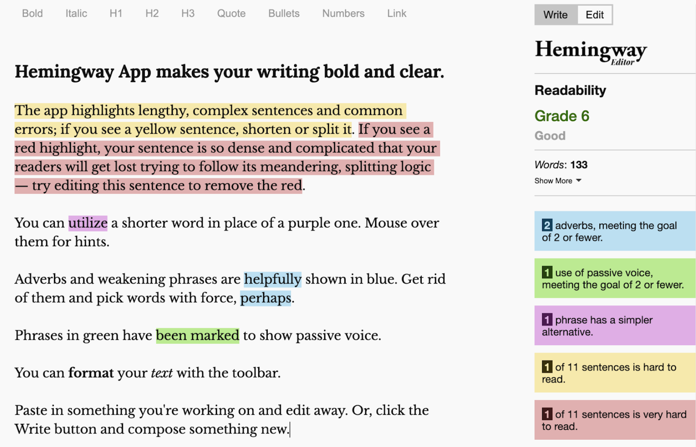
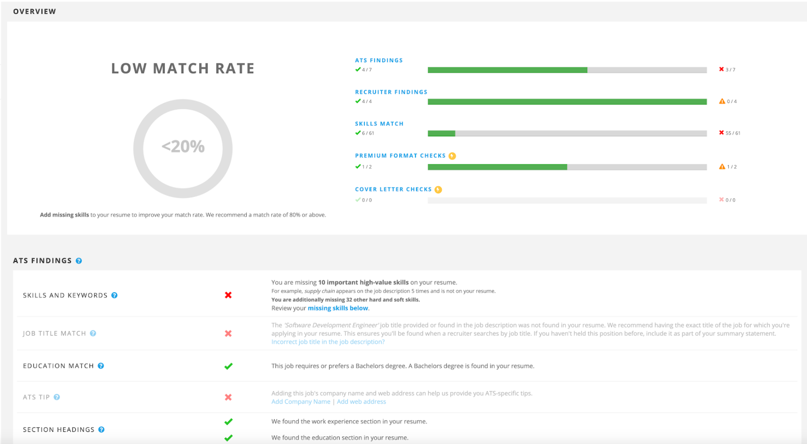

# Chapter 8: Exercises to Polish Your Resume

Once you have created your “master” resume, here are a few exercises to tweak it

## Write Two Different Resumes

The people who write great resumes have written several of them. The people whose resumes are not fantastic usually keep tweaking and tweaking the same one. Do this challenge to have a significantly better resume.

First, write a resume using your preferred template. You have probably already done this. Then, start fresh, using a completely different template. It can be a template you’re not in love with; but it should be different. Put away your existing resume; you’re not allowed to cheat.

Write a brand new resume, aiming to write a completely different one. Don’t repeat the achievements that you have written on your previous one; come up with different ones. Change the structure. Be bold with using colors. Come up with something very different.

Now, compare the two. What are things you could use from this second one that seem pretty good? With two very different resumes, come up with a third, where you take the things that you like from both resumes. You’ll not only have a better resume—but you now have a lot more details to choose from when you customize your resume for the specific job listings.

## Find Out the Impact of Your Past Projects

Many resumes list out responsibilities, but they don’t mention impact or specifics. They might say “Built and shipped the website rewrite for MyCompany”, but they don’t talk about how many people viewed the website, how much incremental revenue it generated, by what percentage did the loading times improve, by what percentage did the codebase shrink, and so on. In many cases, this is because the person writing the resume is also unaware of the actual impact.

So find it out. For your current position, ask around on your team and through your manager. What is the expected impact of the project? Or what was the impact of the launch? For past positions, reach out to your old team or previous managers and ask about the impact. They might have better pointers on what this was.

Finally, if you don’t have an exact impact, estimate to a good approximation. Can you give a rough percentage on the improvement made? A rough estimate on from what number to what number things changed? With impact, you don’t need to be exact. “Close enough” is better than nothing.

## Do a Grammar Check, Not Just a Spellcheck

Your resume should read naturally: no typos, and clear grammar. The sentences should be short and easy to read. For grammar check, you can use the free version of [Grammarly spell checker](https://www.grammarly.com/grammar-check). For easy to read text and sentences, use the free [Hemingway Editor](http://www.hemingwayapp.com/). Don’t only rely on these tools, though: re-read, re-read, re-read your resume.

*The Hemingway Editor—an excellent tool to make your resume easy to read.*

## Ask for Friends or Family to Proofread

As you write your resume, you will develop tunnel vision and ignore obvious inconsistencies or mistakes. Get a fresh pair of eyes to read through your resume, someone who can catch things that don’t look or sound right.

Ask a friend or a family member to read through your resume thoroughly and give you feedback. You’ll get feedback on things—grammatical issues, typos, logical mistakes—that you would have otherwise missed.

## Get Feedback on the Internet

There are several forums where you can get feedback on your tech resume—for free. As with most things free, don’t get your hopes up too high. These are forums where members do a favor for giving any feedback. My suggestion is to join these communities well ahead of time, read feedback on other resumes, and treat the advice with a grain of salt.

**Remove personal information from resumes** you submit to forums like this, as the resume might be circulated well beyond your control.

- Reddit has regular [resume advice threads on CS Career questions](https://www.reddit.com/r/cscareerquestions/search?q=Resume+Advice+Thread&restrict_sr=on&sort=new&t=all). This forum is meant for new grads.

- Reddit has a general [resume review sub](https://www.reddit.com/r/resumes/) where you can get feedback on your CV/resume.

- If you are an engineering manager, you can get resume feedback [within the Rands Slack channel](https://randsinrepose.com/welcome-to-rands-leadership-slack/).

- Search for resume review offers from fellow members of the tech community. Dev.to had a [resume review thread](https://dev.to/kaydacode/resume-review-1oei) and people occasionally offer to give feedback on Twitter and on LinkedIn.

## Keyword Check for That Position

When submitting a resume for a specific position, if your resume mentions things that are considered keywords in a job, you’ll be more likely to stand out. For example, for a Java backend position, you’ll want Java and backend mentioned—assuming you have experience with both.

A possible way to do this review is for you to compare the job description and your resume. There are services that offer a more detailed scan. Most of this scan is guesswork, but it can give you a sense of how much words overlap your resume and the job posting has.

**I hesitate to wholeheartedly recommend ATS scan services**, as most of these scans are based on ATS fallacies, and optimize to make you pay up for ATS optimization, that will not be particularly helpful. See the [ATS Myths Busted section](./05-p1-c2-the-hiring-pipeline.md#ats-myths-busted) on more details on why most of the claims made by these sites do not apply to tech positions.

Still, doing a quick check with JobScan ATS scan can give you some pointers on the overlap between your resume and the position. Keep in mind that most of the ATS scores are guesswork, and ATSes will not reject your resume. And I do *not* recommend upgrading to JobScan Premium for tech roles, as much as the site tries to upsell to do this. For example, you will always see a lower than 100% “match rate” in this scan that incentivizes opening your wallet and pay for advice that will likely be irrelevant with tech roles.

The JobScan ATS Check. Much of it won’t apply to how tech companies use ATSes. It
could give you ideas on how to tailor your resume for the job description, though.

## Recap: Actions to Improve Your Resume

In this chapter, we’ve covered additional exercises to make your resume better. Consider doing multiple or all of these to make your resume even better.

- **Write two very different resumes**, then come up with a third one, combining the best parts from each one.

- **Find out the impact of your past projects and add them to your resume**. Reach out to past colleagues, or do a rough estimation. A close enough estimation is better than no specifics.

- **Do a grammar check, not just a spell check**. Use tools like [Grammarly](https://www.grammarly.com/grammar-check) or the [Hemingway Editor](http://www.hemingwayapp.com/) to do so.

- **Ask friends and family for proofreading**. You’ll get a fresh pair of eyes, and valuable feedback on things that you might have missed.

- **Seek out feedback on the internet from community forums**. Don’t forget to anonymize your resume first. Treat this feedback with a grain of salt, though.

- **Do a keyword check for your resume**. Use either an automated tool or just “pretend” to be the screening software, looking for keywords that you pick up from the job description.