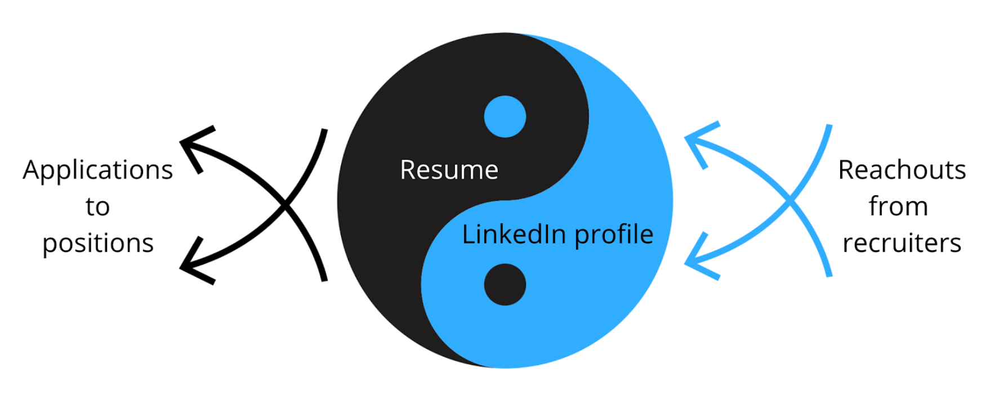
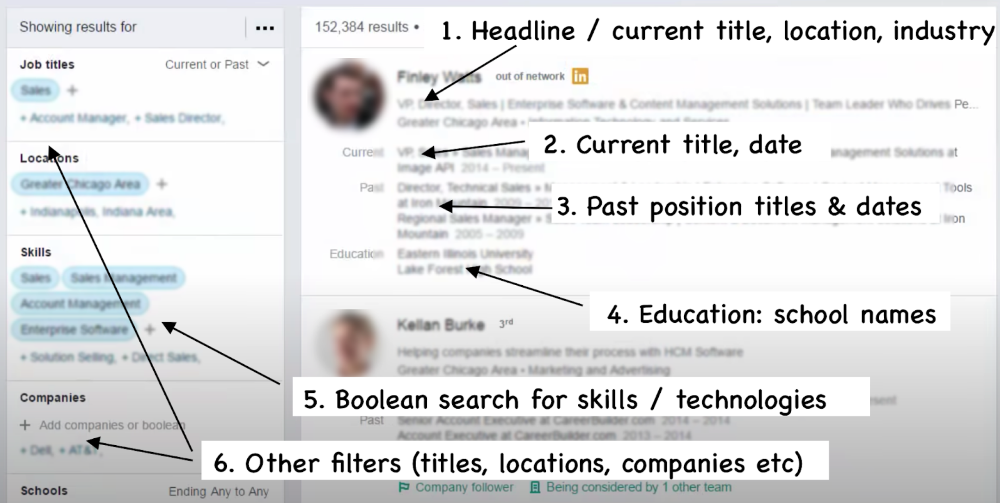
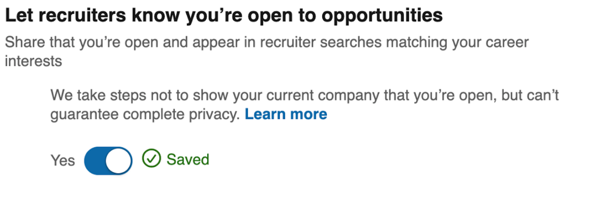
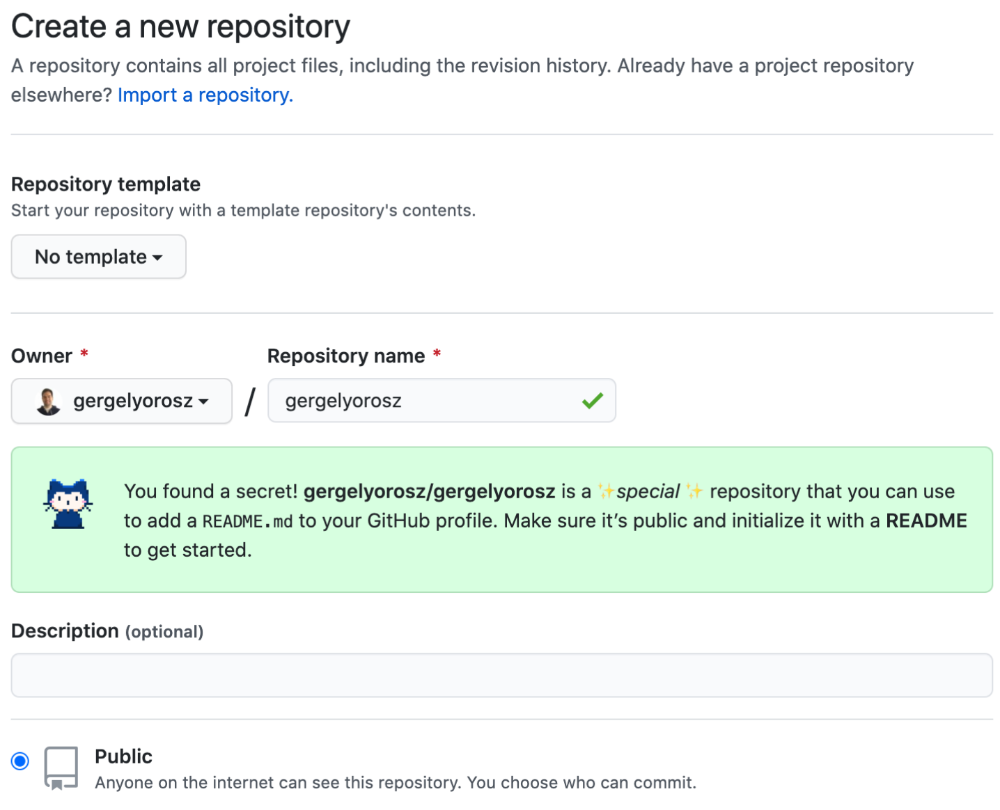
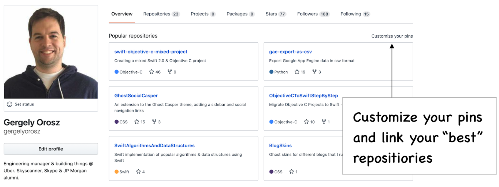
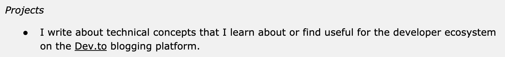
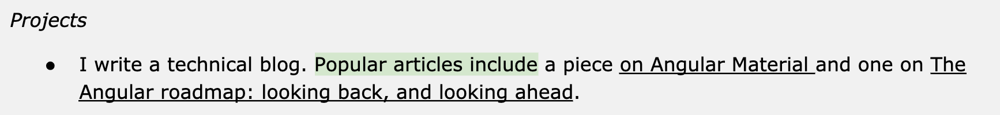
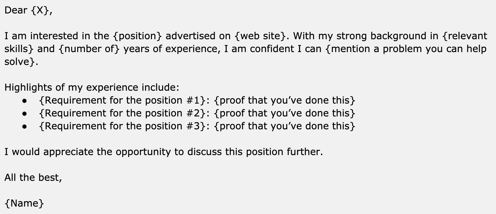
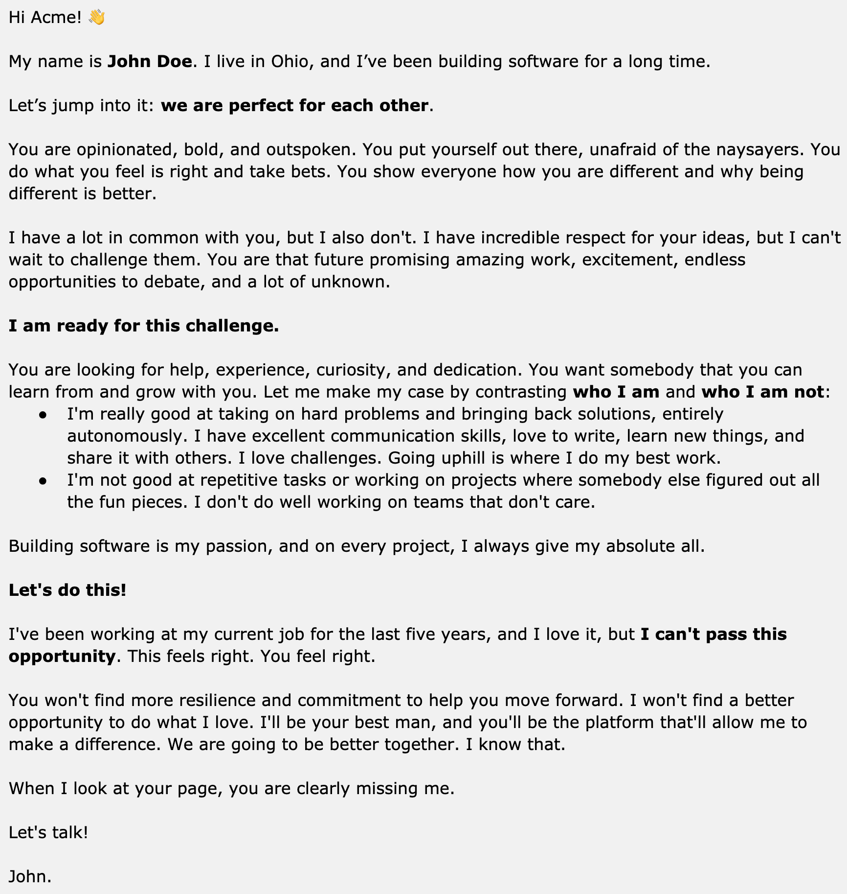

# Chapter 9: Beyond the Resume

Your resume is not the only thing that can get you to a recruiter call: cover letters, your LinkedIn profile and a few others are worth paying attention to.

## LinkedIn Profile

Resumes and LinkedIn profiles are like the yin and yang. You directly apply with a resume, and opportunities can come and find you with your LinkedIn profile. It’s smart to invest equally in both.

The good news is, once you have spent time polishing one, you can reuse much of the content for the other. There are a few differences that are worth keeping in mind with LinkedIn, though.

Most of these differences come from how recruiters use LinkedIn most of the time: by looking at the LinkedIn search view. They set out to find candidates who match a specific skillset, in a certain location, and might narrow down to other filters: companies, schools, and others. Here how recruiters will see your profile in the LinkedIn recruiter search view:

*The LinkedIn recruiter search view, and the key details recruiters immediately glance at.*

To optimize your “search card", consider following these steps:

- **Set a headline to represent what you *want* to be found for**. This line is the first thing a recruiter will see, and it should summarize the message you’d like to convey. Why should someone click on your profile? If you do not set anything to your headline, your current position will appear here.

- **Tweak your current position** to describe your role better. LinkedIn is not your resume, and your current position does not have to be your official title, as per your work contract. For example, if you are leading a team as a frontend developer, you could have your current title on LinkedIn say “Frontend lead” or “Frontend team lead”, even if your official title at work is "Software Developer". Similarly, you can change your current title to say “Backend engineer specializing in Go” if this is both what you do and how you'd like recruiters searching on LinkedIn to find you.

- **Mention keywords in your summary and job descriptions** that recruiters could search for. These include technologies, frameworks, and engineering practices.

- **Use a professional-looking photo** that makes you look good. A professional photo is one where your face can be seen clearly, with no one else in the picture. Note that you don’t *need* to have any photo on your profile, especially as photos can encourage biases. Also, no photo is better than a poor photo, where you look grumpy or unfriendly.

- **Have a summary that sells you.** Unlike with your resume, where recruiters and hiring managers barely look at your summary, on LinkedIn they are more likely to do so. As a hiring manager, I read the summary section and the last one or two job descriptions. So go for a longer summary, up to two paragraphs, where you describe the value you can bring and your motivation.

- **It’s fine to be more verbose on your LinkedIn than you would on your resume**. The nice thing about LinkedIn is you don’t have to fit everything on one page. In fact, with more content, you could rank higher in search results than if you kept things concise.

- **Omit work experience that doesn't support your professional career story.** Similar to your resume, your LinkedIn profile should tell a good story of your professional side. Remove positions that don’t strengthen this image. For example, if you did a part-time job years back that has nothing to do with your current profession, it probably will not add anything to your career. Don’t have this kind of noise.

**How recruiters do Boolean searches**

To optimize your LinkedIn profile for recruiter searches, let’s take a look behind the scenes on how recruiters search for candidates. They use the technique called Boolean search, something that should ring familiar to most developers. Using a series of AND, OR, and NOT operators, they filter details. Here are a couple of possible searches recruiters might use:

- Software developer: **“software developer” OR “software engineer”**

- Fullstack developer with React.js and Python experience:
  
  
  - **”React.js” AND “Python”** for a simple search
  
  - **(“developer” OR “engineer”) NOT “manager” AND React.js” AND “Python”** for a more sophisticated search

- Frontend developer with React or similar experience: **(“frontend developer” OR “front-end developer”) AND (“javascript” or “typescript”) AND (“react” OR “reactjs” OR “vue” OR “vuejs” OR “angular” OR “angularjs”)**

Recruiters will often Boolean search for keywords that are in the job description that the hiring manager gives them. So taking this example from a job description, highlighting possible keywords:

- Computer Science fundamentals in data structures, algorithm design, problem solving, and complexity analysis

- Proficiency in at least one modern programming language such as C, C++, Java, or Perl

A recruiter could create these Boolean searches:

- *Focus on languages:* **“C” OR “C++” OR “Java” OR “Perl”**

- *CS fundamentals and languages:* **(“data structures” OR “algorithm” OR “algorithms” OR “design”) AND (“C” OR “C++” OR “Java” OR “Perl” OR “object oriented”)**

If your profile contains these phrases, you’ll appear in the results. The closer the match—for example, when matching in the headline—and the closer you are in your network with the recruiter, the higher you will rank on the search results.

**Optimizing LinkedIn when job searching**

When you are either actively job searching or are getting ready to start, consider the following:

- **Signaling you’re open for opportunities: don’t do this in your headline.** Do not add “Looking for opportunities”, “Open for a new role” or something similar in your Headline. This won’t add much value, and it will take up valuable space that you could use to sell yourself and highlight your skills. Instead, activate the Open to Job Opportunities feature in your LinkedIn profile:
  
  
  

- **Always have a current position listed**, even if you don’t currently have a job. LinkedIn ranks your profile lower when you do not have a current position. [Kathy Bernard](https://www.linkedin.com/in/kathybernard/), who specializes in optimizing LinkedIn profiles, advises to always fill out something as content here—even if you don't have a job right now. As a developer, you can tailor this current position to showcase the technologies and languages you are an expert in. For a few more pointers, see her article: [Unemployed? Create a “current” role on LinkedIn](https://www.linkedin.com/pulse/unemployed-create-current-role-linkedin-kathy-bernard/).

- **Add more headline details.** Consider using the “|” separator character to add more information to your headline, such as key skills or technologies you’d like to be found for. For example, a headline could be:
  
  *Full-stack dev with 5 years experience | Go, Java, JavaScript, React, Swing | Distributed systems, developer tooling & fluid user interfaces.*
  
  A tailored headline will rank your profile higher with keyword searches and grab the recruiter's attention better.

- **Connect with more people on LinkedIn, including recruiters**. The closer you are connections-wise to the recruiter doing the search, the higher your profile will rank. As you start your job search, do consider adding current and former colleagues and recruiters who have previously reached out to you.

- **Consider updating your location when you have a definite destination in mind to move to**. Location is often a filter that recruiters use. If you are ready to move to a city or a country, you can update your location, so you show up as a local candidate. Use good judgment, especially for cases when you’d need a visa to move. Updating a location will most likely result in more inbound messages from local companies. Once you have a reachout, you can confirm if the company sponsors visas before investing more time in the process.

- **Use Boolean search when searching for jobs**. It’s not just recruiters who can do Boolean searches: on job sites like LinkedIn, you can do so as well. You can use AND, OR and NOT for phrases, and parenthetical search. For example, you could use the following search string to look for non-senior frontend jobs, for companies not building on top of the Laravel framework:
  
  **(frontend OR javascript OR react) AND NOT (senior or laravel)**
  
  Narrow your search to fewer opportunities that are a better match for what you are looking for, or your skillset. This will help you apply in a more focused way.

## GitHub

There is no expectation of having GitHub on your resume, regardless of how many resumes and resume templates you might see these included in. As a hiring manager, I never explicitly look for either. It is a nice bonus to see it, though, and as a hiring manager, I frequently click through to check it out.

Other hiring managers confirmed the same: they are more likely to click through and check out these profiles after the first scan. Recruiters are somewhat less likely to do so: though the more technical the recruiter, the more inclined they are to take a look. Should you make it to the onsite, developers who would be interviewing you often click through and bring up the projects as talking points on the interview. Which brings us to the most important rule of linking to GitHub.

**Only include a GitHub link if there is something you are proud to show off** on these sites. Do not link to an empty Github profile or one that has poor code visible.

Clean up your GitHub profile to describe the work that people will find there if you do link it. Add proper READMEs to your main projects that give context on what the project does, highlighting relevant code, setup, or configuration.

As a hiring manager, here is what I look for when browsing through a GitHub profile:

- **Context**: what side projects has this person published? What do they do? Do the pinned projects have a clear description on the profile page? When clicking into the project, is there a clear README that describes the project: how to run it and how to test it?

- **Code quality**: how is this? Does it follow best practices? Is naming decent, the code easy to read and clean?

- **Testing**: does the project have unit or integration tests? If they do, I know this person is aware of testing and has at least played around with it.

- **Contributing to larger projects**: what larger open source projects have they contributed to? I sometimes look at pull requests, and the comments on the pull request, if it’s easy to find.

- **Standout repositories**: if there is a repository that has a large number of stars, and lots of activity, how does this developer handle pull requests, and how do they respond to issues? This can give some good, positive indication on their collaboration skills, similar to contributions to larger projects.

- Things I don’t pay attention to are contributions in the last year, followers, numbers of repositories, and other statistics that have little to do with code quality.

**To optimize your GitHub profile** that you are linking on your resume, follow these few steps:

- **Create a README for your profile** and summarize things that a hiring manager should know about you, pointing to standout projects. To create a personal README, create a repo with the same name as your username, and initialize it with a README:
  
  
  
  
  
  Then take inspiration from other developer READMEs in creating yours from lists
  like:
  
  
  
  - [Awesome Github Profile READMEs](https://github.com/abhisheknaiidu/awesome-github-profile-readme) by [Abhishek Naidu](https://github.com/abhisheknaiidu)
  
  - [Awesome Profile README templates](https://github.com/kautukkundan/Awesome-Profile-README-templates) by [Kautuk Kundan](https://github.com/kautukkundan)
  
  - [Awesome Readme Templates](https://github.com/elangosundar/awesome-README-templates) by [Elango Sundar](https://github.com/elangosundar)

- **Pin the “best” repositories on your profile**—up to six of them. You can control which repositories are shown on your profile. Hiring managers will most likely only click on a few of these, so make them count.
  
  
  

- **Fill out descriptions** for each of the pinned projects in the repo’s description field. The description should make it clear what the project does and why it is interesting. You can make the descriptions fun: your goal is for the person to check out the repository.

- **Have great READMEs for your pinned projects**. At the very least, the README should describe what the project does and how to use it. Better READMEs have code examples, show how to configure, or list further improvements. Browse READMEs of popular projects and consider improving your README to be more similar to them. You can use the [README score](http://clayallsopp.github.io/readme-score/?url=clayallsopp%2Freadme-score) tool to get feedback on areas you could further improve.

## Technical Blogs

Do you know what percentage of candidates write technical blogs? Only a fraction of all resumes I’ve seen. So if you happen to write one, you’ll already have something to stand out with—assuming you add it to your resume. However, don’t *just* add your technical blog to your resume. Similar to your GitHub, be deliberate about what the one or two articles you’d want a hiring manager to read.

---

**Before and after: technical blogs**

Take these two resume examples. The first example is from a resume where the person is applying for a frontend position that is asking for some experience with Angular.

**Before:**

**After:**

In the “before” version, when the hiring manager clicks on the link, they are taken to the linked Dev.to blog. On this page, the last two articles are non-technical posts, and buried many pages down are two solid articles about Angular.

The “after” version does a much better job guiding the hiring manager to the post you want them to read. And they don’t even need to click through to think, “okay, so this person doesn’t only say they know Angular: they’ve proven it, by blogging about it.”

**Add links to the most relevant one or two technical articles** that you have authored in your resume, describing what they are about, similar to the above example. Doing this over “just” listing your blog will let you control more what you’d like to show. You’ll also guide your reader better, having them start reading some of your best or most relevant content, should they click through.

---

## StackOverflow, Twitter, Instagram, Quora and Other Social Sites

StackOverflow is the only other piece of content that I’d suggest to include: but only if you are active on the site, and your profile supports the story you want to tell. For example, if you are a JavaScript expert and have many JavaScript-related badges, this can support your credibility as someone who knows this technology. As a hiring manager, I click through far less to StackOverflow links in the resume than I do to GitHub, though.

For other social media like Twitter, Instagram, Quora and others: I discourage linking to these on your resume. These mediums do a poor job conveying professional value to the hiring manager and the recruiter.

## Cover Letters

Big tech companies rarely ask for cover letters—they will only look at your resume. Small and mid-sized companies allow attaching these, but very few explicitly ask for it. Most tech recruiters I’ve talked with don’t ask for it, and even if sent separately, rarely read them.

Cover letters in tech matter at companies where the hiring manager does the resume screening. These are typically smaller companies, often startups, which see fewer applicants for roles. As such, I suggest prioritizing writing cover letters to smaller companies only, or in cases where you know you can reach the hiring manager directly.

Also, your tailored resume for the position should already be a cover letter. If you follow the advice in the section [Write a Resume for That Job](./09-p2-c3-standing-out.md#write-a-resume-for-that-job), the cover letter will be less relevant. You never know if the cover letter will be read or forwarded, but as long as you progress in the hiring process, your resume will always be.

| **From the inside out: what matters for a cover letter?** While larger tech companies often don’t ask for cover letters due to the large number of applicants, this is not true for smaller ones and for startups. In these environments, cover letters can be a real advantage. Here’s what [Monica Lent](https://monicalent.com/) has to say, who reviewed thousands of CVs while hiring in Berlin for SumUp, a high-growth startup. The advice as part of her [seven software developer resume tips](https://monicalent.com/blog/2020/04/21/software-developer-resume-tips/). *“Even if you think you have a highly relevant CV, you should still consider writing a cover letter. It doesn’t have to be long, but it can only increase your chances of passing the CV screening phase.* *Companies you’re applying for want to feel a little bit special. Like if they were to offer you a job, there’s a good chance you’d actually accept it. You will stand out if you have a coherent cover letter that demonstrates you’ve read the job ad and the website. It doesn’t have to be long, either. In fact, it shouldn’t be long, because ain’t nobody got time to read a super long cover letter. And don’t forget to spell check.* *Here are the basic elements that a cover letter for a developer role should have:* - *Show off your good communication skills* - *Demonstrate an understanding of the role* - *Briefly explain your qualifications and why you think you’re a good fit* - *Mention the company name* - *Demonstrate that you read the company’s website* - *Attach the cover as a PDF. It’s just easier to read than pretty much any text format that could be typed into a web interface. Again, optimizing for ease of reading.* *Note that some companies may not find the cover letter useful or even read them. This can vary based on the role – for a typical dev job, perhaps not. But for highly competitive junior roles or very senior roles, your motivation is relevant. In the end, a cover letter will never hurt you, and has the possibility to help you stand out.* |

**Tailor your cover letter style** to the company and country that you are applying for. For a young startup in the US, a more casual and outspoken style might work better. For a large company in the UK or Australia, a more reserved approach could work better. For inspiration, see the following cover letter examples:

- [A developer cover letter](https://stackoverflow.blog/2016/11/11/developer-cover-letter/) by principal data engineer Nick Larsen, published on the Stack Overflow blog.

- [A punchy junior developer cover letter](https://openupthecloud.com/punchy-junior-software-developer-cover-letter/) case study by engineer Lou Bichard.

- [A non-traditional cover letter](https://twitter.com/svpino/status/1290970001856397312?s=20) by engineer Santiago Valdarrama. A cover letter like this could work better in the US and for less traditional companies and hiring managers.

**Personal cover letters over templated ones**

When you decide to write a cover letter, an immediate strategy is to find a good template, then use that. If you search for cover letter templates, they all look somewhat similar, something like this one:

Templated cover letters will frequently get ignored in tech. They don’t give much more information than your resume. In the example above, almost everything listed in the cover letter is probably part of the CV the person submitted.

**Instead of a template, consider spending more time to write a highly personalized cover letter for *that* position and *that* company.** Do this only for cases where there’s a chance the person would read this. So do this when reaching out directly to the hiring manager, or applying for smaller companies.

Consider this highly personalized cover letter, shared by software engineer [Santiago Valdarrama](https://twitter.com/svpino), tailored for a US-based startup:

As a hiring manager working at an outspoken company that challenges the status quo, and takes on bold bets, receiving an inbound cover letter like this would immediately want to learn more about this person.

**Here’s what this cover letter gets right:**

- **It talks about the company first, the applicant second.** The letter shows the person understands the company values they are applying for. The letter shows they have researched, followed, and know the company, and identify with its mission.

- **It’s sincere and passionate.** This letter was not copy-pasted with the usual phrases. A person spent a good amount of time writing down their thoughts. It articulates both why this person is excited about the company and what they have to offer.

- **It’s well-written, with high-energy coming across**. The cover letter has been edited to be easy to read, bolding added to the right places. The writing makes their excitement come across clearly. Reading it, I can feel it coming across! While many cover letters sound boring, this one stands out due to its energy.

- **It’s bold and concise**. “Let me make my case by contrasting who I am and who I am not” is a bold statement. The cover letter is concise in that the applicant only shares two opposite descriptions of themselves. Still, they give an excellent glance at why they could fit well into the team.

**This cover letter also breaks some unwritten rules** that many hiring managers are used to.

- **It does come across as over the top** in its style. The style is also what grabs attention. Some hiring managers might decide that it’s a bit too much, and too pushy - especially if the company is a more conservative one. From the sounds of it, the application is for a startup, where this kind of enthusiasm could work well.

- **It portrays an overly enthusiastic, somewhat junior applicant.** While this could be fine in many cases - especially if this is your experience - this approach would work poorly if you’re applying for a staff or principal engineering position. Do be mindful of how you want yourself portrayed when you write your cover letter.

- **The tone might not be suitable outside the US**. Different regions call for different tones, even to stand out. This letter would end up in the bin for a more traditional company in the UK or Australia, where a professional tone is an unwritten expectation.

Use good judgment when writing a cover letter. But don’t forget that your goal is to get your foot in the door - assuming your skills are a good match. For the smaller companies that would read a cover letter, a tactful and personalized approach could make the difference.

## Recap: Actions to Improve Your Application Beyond the Resume

In this chapter, we went through why LinkedIn, GitHub, StackOverflow, technical blogs and cover letters can also play a part in your application process. Of all of these, LinkedIn, GitHub and technical blogs are usually the most relevant ones for software developers. To increase the chances of a recruiter call, do the following exercises:

- **Update your LinkedIn based on what you want recruiters to find you for**, not necessarily what you are working on right now. Update your headline accordingly, and tweak your positions to better describe the story you want to tell. Mention keywords in your description that you want to be found for.

- **Make sure your LinkedIn is professional**. If you choose to go with a photo, have a good one. Omit work experience that does not add to your career story.

- **If you are looking for a job**, change your settings on LinkedIn to indicate this. Have a current position added even if you don’t currently have a job, update your position based on where you are looking and grow your network on LinkedIn.

- **Make your GitHub account sell you** by handpicking projects you want to display on the landing page, and ensuring these projects are high quality. All projects should have good READMEs and aim to showcase code that you are proud of.

- **Call out specific blog articles on your resume**, rather than just linking to your blog. Mention articles that are relevant for the position you are applying for, or ones that stand out for one reason or another.

- **If writing a cover letter, tailor it to the position**. Be brief, but clear about why you would be a good fit for this role and mention what skills you bring, with examples.