# Chapter 10: Good Resume Template Principles

Before choosing a resume template, it’s important to understand what principles make for a good template. A good template is one that will help with the goal that you had writing a resume: conveying the information that you intended to communicate in a way that the recruiter or hiring manager can quickly understand.

In a world where a recruiter receives one application to review per day, resume templates wouldn’t matter. In fact, most of this guide would be of little use. The recruiter would take their time, read the whole resume, and probably still give you a call to find out if there is any way you’d be qualified for the position. I mean, you are one of the very few applicants!

However, in reality, recruiters and hiring managers often have dozens or hundreds of resumes to go through. They become really efficient at doing so. If a resume proves to be too much work to find key pieces of information, then it’s down to luck if they will take this time, or just move to the next one.

Good resume templates are made tailored for recruiters and hiring managers—not for job seekers. It makes the job of these recruiters and hiring managers in finding key pieces of information as effortless as possible.

| **From the inside out: why popular resume template sites don’t necessarily work for software developers** There are several popular resume template sites that promise to build you a “stunning” or “standout” resume for each industry: whether you are in finance, are a freelancer, in legal, and dozens of other categories. These resumes are often eye-catching, pretty, and give you ideas you’ve not thought of before. Visualizing how you spend your time? Listing what you are proud of? A novel design that is beautiful and unusual? The catch is that these sites optimize to convert *you*, the job seeker, to pay them money. They help create resumes that *you* will feel good about. As a candidate, you will feel that you have represented your standout experience with a standout resume. They also guide you in writing down your experience in a structured way—but they do not do this targeted for developers. Take a look at one of the popular resume template sites, EnhanCV, and their value proposition: 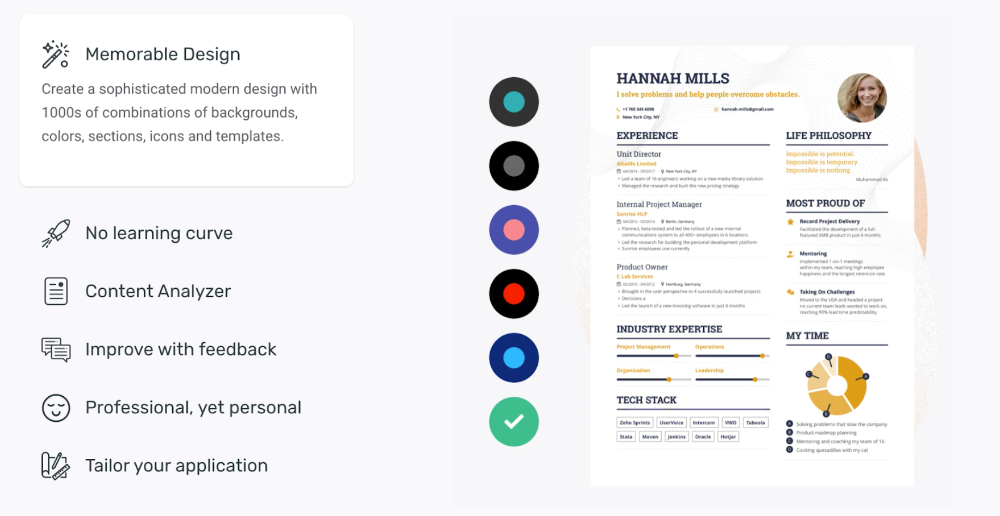 *The EnhanCV value proposition. This kind of flashy template is a poor choice for software engineers or engineering managers.* **These “standout” resume templates are usually a poor choice for software developers.** Even for sites that have a software engineer template, this template was more likely put together by a designer than a technical recruiter. The resumes are usually harder to read for recruiters and hiring managers. As a hiring manager, I find they incentivize sharing fewer specifics and more buzzwords. If going for a resume template or resume builder, aim to go with sites that avoid flashy design, and have a track record of success for software developers. |

## Good Resume Template Layout and Principles

A good resume template is easy to read. They are easy to read because they follow common conventions that people are used to. Things that people are used to when reading nonfiction are these:

- **Top to bottom reading.** We start at the top and make our way downwards. This is how we read books and magazines.

- **Important things first**, less important things towards the end. Good nonfiction reading materials start with an introduction that sets the context and often explains the chapters to come. For a resume, in a somewhat similar fashion, the most relevant things should be towards the top, with the less relevant things on the later pages.

- **Strategic use of colors and bolding**. Bolding can draw attention. **Colors can also pull your attention**. Use both of these in a strategic way to guide the reader on things that you’d like to stand out.

| **From the inside out: what direction do recruiters and hiring managers read resumes?** Every hiring manager, and tech recruiter I’ve talked with read resumes top to bottom. This includes myself. It’s not just a habit: it’s also a recommendation. One of the most hands-on hiring manager guide in tech is the book [Hiring Geeks that Fit](http://pragmaticurl.com/hiring-geeks-that-fit-ttr). Here author Johanna Rothman suggests the same: *“Start reading each resume at the top. I read résumés by starting at the top, and work my way down to the final line. (...) Seeing what a candidate thinks are his or her strong points can tell you a lot about the candidate. (...) As I read, I make a mental note that I later will compare with the actual job’s requirements in each of the following areas: work experience, position objective, strengths, education, and professional training. I use items in the résumé to include candidates, and only use items to exclude candidates if the items match my elimination criteria.”* |

Let’s look at the two most popular layouts, and how they help with these principles.

## The Top-Down Layout

The format that all recruiters in tech will be vastly familiar with is the LinkedIn profile format. They read profiles like this day in, day out. Here’s what the LinkedIn profile layout looks like when recruiters view candidates:

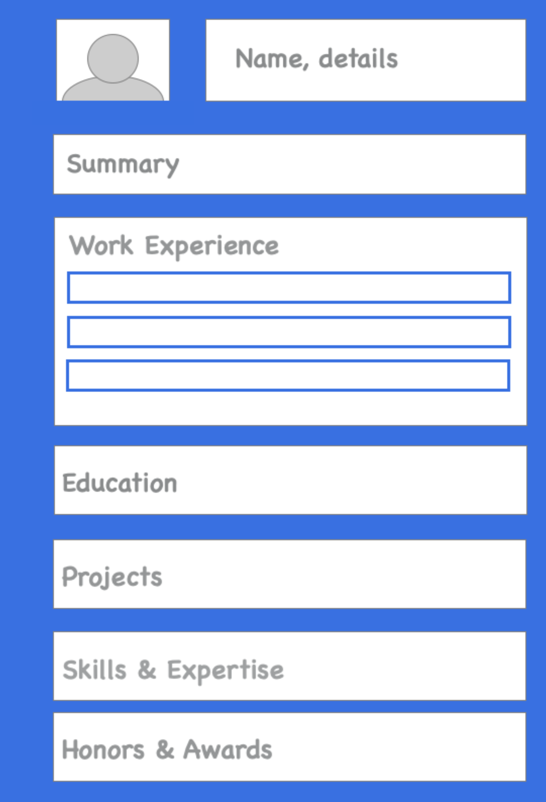

Resume templates that follow this format in their layout are a safe bet. Do keep in mind that LinkedIn follows a generic format for resumes. For software developers, languages & technologies are especially important. This is something that LinkedIn won’t place emphasis on, but you should, in your resume. An adjusted format that works better for developers, yet be familiar in layout for recruiters is this one:

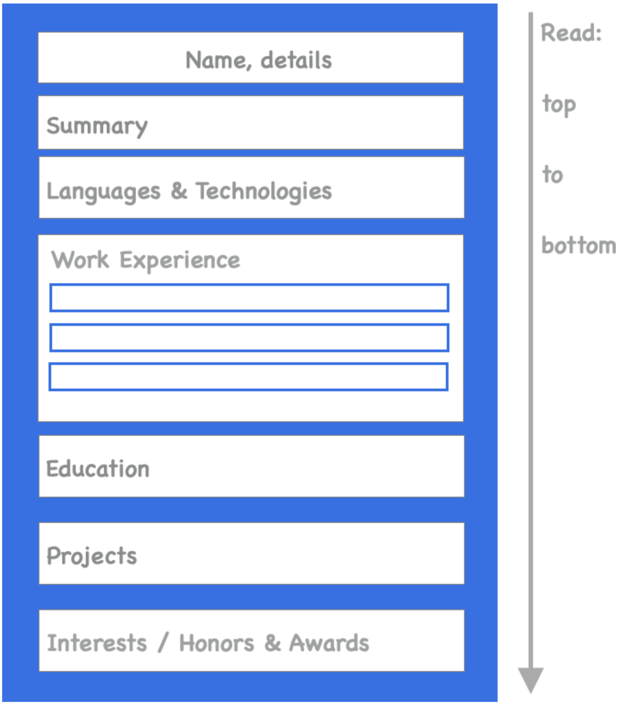

Top-down layouts work well for multi-page resumes as well. The only possible downside of this format is that it seemingly does not maximize the space on a page as efficiently as a multi-column layout. Still, given how familiar and easy to read this format is, there is little reason not to use it for your resume.

## Two-Column Layouts

Another popular layout is a two-column one. The goal of this layout is to maximize space for one-page resumes. Here’s how a layout could look:

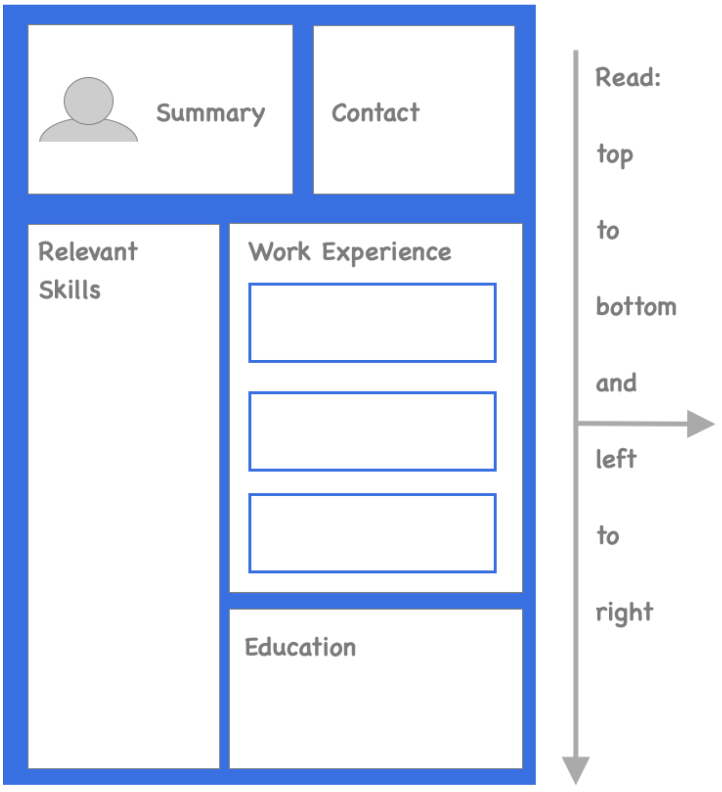

While this template seemingly does maximize space, it does this at the expense of readability. The reader needs to read top to bottom, then start again, going left to right. Also, in this format, it becomes confusing for recruiters to know where to look for key information like education or work experience. Ten resumes with two-column layouts will have their columns in ten different orders. Take a look at these two two-column resume examples, both popular layouts:

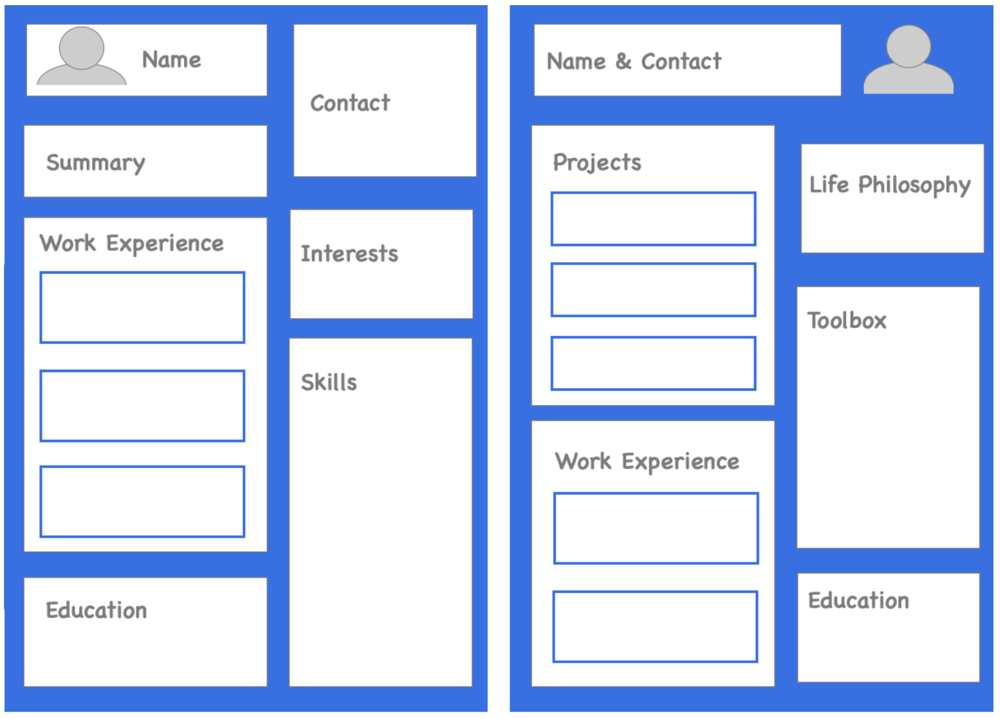

The columns are in a different order, even compared to the first example. This makes it harder for recruiters to find the key pieces of information that they are looking for—and that is so easy to spot in the top-to-down resume format.

**The biggest drawback of the two-column resume is how it discourages sharing sufficient details on your experience, both for work experience and for projects**. None of the two-column designs cater for sharing several bullet points per position. None of the two-column layouts incentivize going beyond one page for your resume. This resume format is more likely to be filled with buzzwords and cliches than to describe the impact of your work with the technologies you use.

Two-column layouts can be a great choice in cases where your resume layout is part of the application, such as for design or UX positions. In industries outside of software engineering, they might also work. However, for software developers, there is no advantage to using this layout—you’ll only experience drawbacks if choosing this format.

| **From the inside out: resume layouts from a technical recruiter’s point of view** Chukwuemeka Ugorji is a technical recruiter who has worked at Facebook and Andela. He has seen thousands of resumes with various formats and gives his take on the benefits and drawbacks of the top-down and two-column resumes: *“I consider a resume a brief story of your career or maybe a 10 seconds ‘elevator pitch’. If you can tell the story right in 10 seconds, then you get the time to discuss more.* ***I consider the top-down format the most optimal** for two reasons. First, it is the most organized format for easy readability. Second, it allows for easy flow of thought. It starts with what a recruiter/hiring manager is most curious about: skills & relevant experience. Hence, this format immediately answers the key questions that the hiring team has for any candidate.* ***The two-column layout is a double-edged sword.** You need to be brief with this format. If you succeed to show that you are relevant based on your skills and work experience, you will be an easy pick candidate to advance. If not, the decision to reject will be an immediate one.* *This format is like an infographic. It saves the time of the recruiter or hiring manager. However, it* *can hurt candidates badly if they aren't great at presenting relevant information succinctly.”* |

## How Recruiters and Hiring Managers Scan Resumes

Before jumping into analyzing specific resume templates, let’s understand how recruiters and hiring managers scan resumes. In the first few seconds, they want to get a few key details from a resume:

- **Years of experience and dates** of your employment.

- **Key technologies** that are relevant for the role, and whether you have some proficiency with them.

- **Titles and companies** where you worked.

- **Location** where you are based right now. Are you local? Within an area that needs no visa? Somewhere where you’d likely need a visa and/or relocation?

Let’s visualize what recruiters actually see from your resume in the first few seconds. Here is the resume:

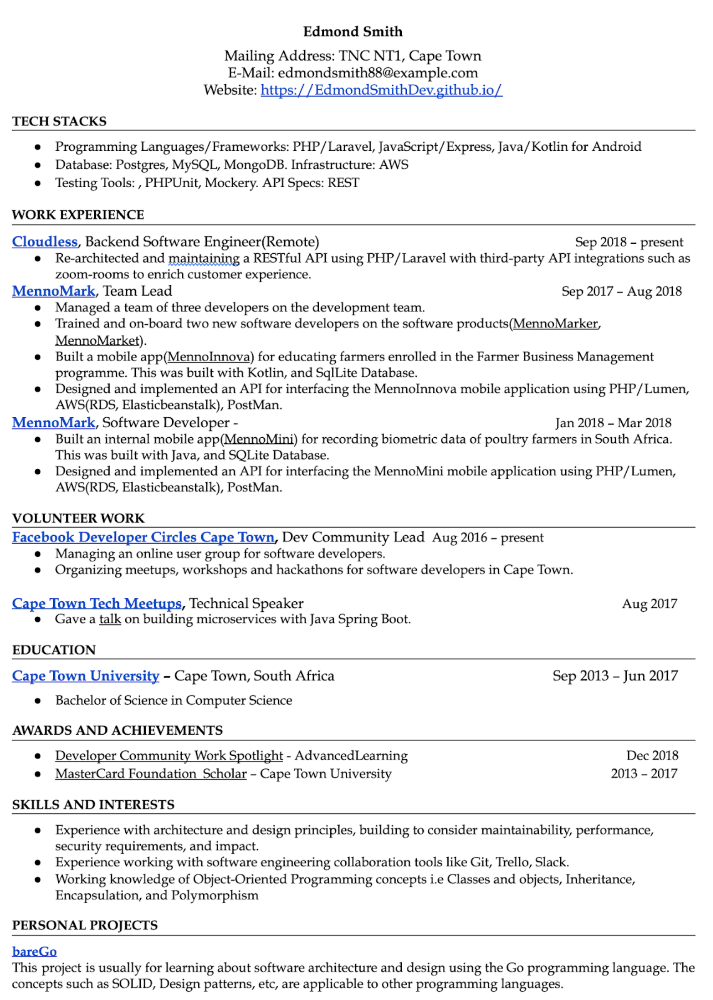

Here is what the recruiter will scan for in the first few seconds:

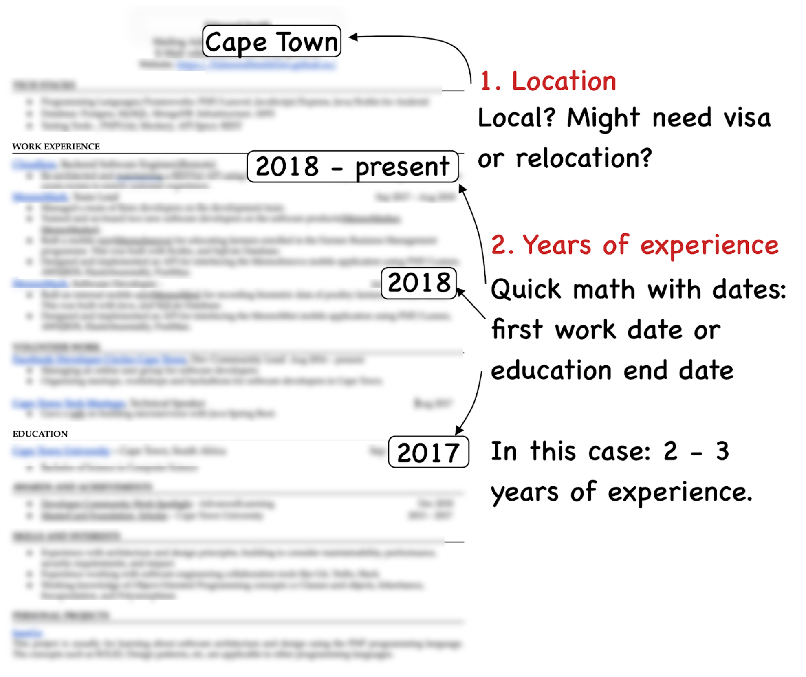

From this first scan, the recruiter notes how the candidate has at least two years’ experience. Assuming this matches the guidance for experience from the hiring manager, they’ll keep scanning. In the next part of the scan, they will glance to see if there are relevant technologies listed, and take a glance at the titles:

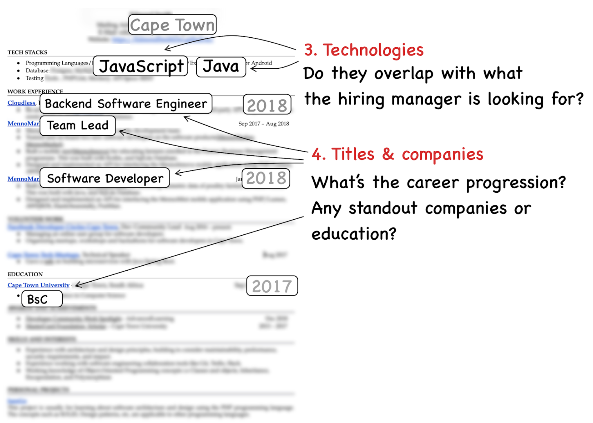

After this scan, the recruiter has the following details:

- Location of where you are based right now

- Years of experience

- Key technologies that are relevant for the role

- Titles and companies where you worked

If most of these match what the job requires, the recruiter will now start to read your resume, top to bottom. They will still only do a short scan, looking for anything relevant for the role, or that grabs their attention:

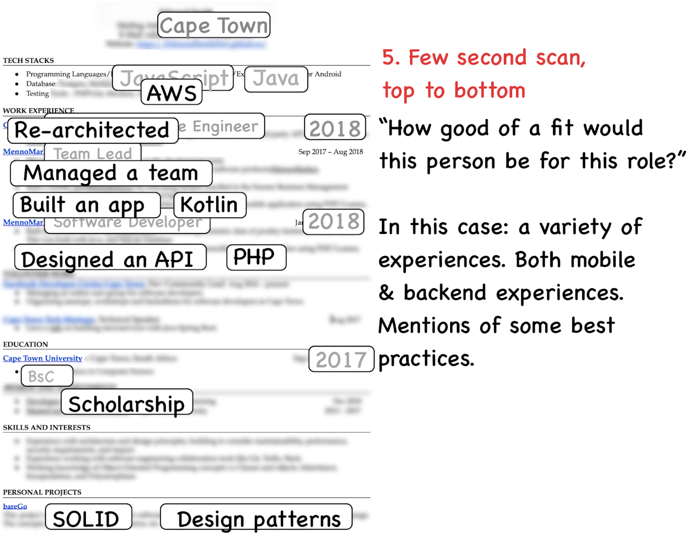

**Only after this scan would the recruiter or hiring manager look at the second page,
or read more in-depth.** This assumes that what they have seen matches what they
are looking for—or they’ve found enough standout information in other areas. These
would indicate this candidate could be worth spending more time on, even if they
don’t have every requirement that the hiring manager is looking for.

**A good template simply makes these key pieces of information very easy to find**—and it can also guide the attention of the recruiter to a few additional pieces of information. This means that the recruiter gets all this information much quicker, and they can spend more time *actually* reading the information you want to share with them.

A good resume is a combination of an easy-to-read template and easy-to-digest content specific to the role you are applying for.

## The Results of Using a Good Resume Template

Let’s take a look at how a good template can help visualize key pieces of information. Here is the updated resume, using a different top-to-bottom template. The resume contents have also been updated, applying the practices in this book, like being more specific on the impact of the candidate’s work.

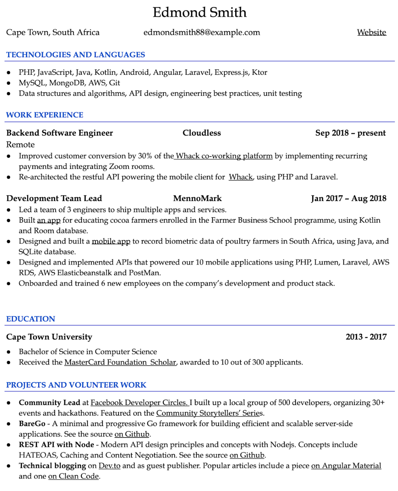

In the first scan, the recruiter will look for the same pieces of information as before. However, these are all much easier to find, as they stand out clearly:

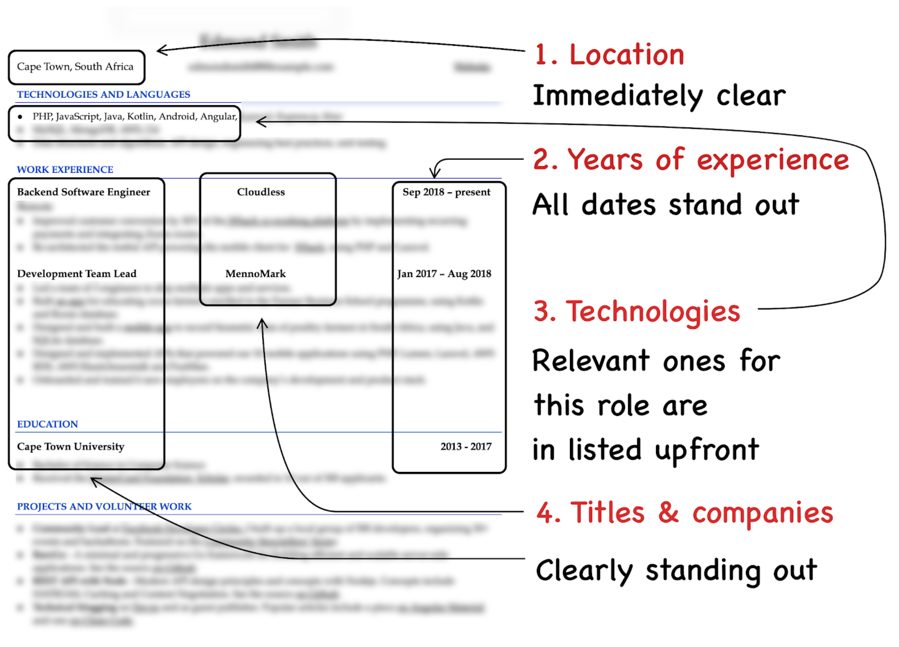

The recruiter does not need to actively search for any of this information and they get all of this at the first glance. This means that they have more time to spend on actually reading the resume. And, as the content is well written, this is an easier task as well:

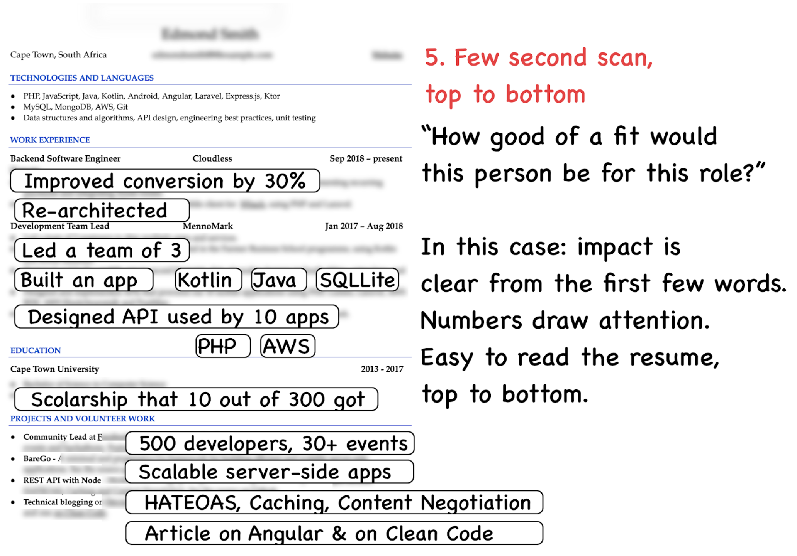

**The difference between a resume with a good template and good content and one without** is how likely it is that the recruiter will get the information you are trying to convey. When you use a format that is harder to read, the recruiter will have to work hard. This means that your chances will be down to luck. If the recruiter reads your resume as one of the first of 100+ applications, they will probably take more time. However, if it comes later, they might just set it aside, as they are getting tired and are under time pressure.

With a well-written resume, even recruiters that are tired or in a hurry will get the information they need. With that, let’s look at specific resume templates: both ones that we’d recommend developers to use, as well as analyzing why some popular ones do not work that well.

## Recap: Good Resume Template Principles

In this chapter, we went through what characteristics good developer resume templates share, and why. When choosing a resume template, aim to have them satisfy these principles:

- **Top to bottom reading.** Easy-to-read templates can be scanned in one go, from top to bottom.

- **Single column layout.** Two-column and multi-column layouts can look neat, but they are more difficult for recruiters to read. These layouts also make it harder to share enough information about your work experience and projects. A single-column layout has none of these drawbacks.

- **Important things first**, less important things towards the end. Things relevant for the position should be towards the top; choose sections accordingly.

- **Strategic use of colors and bolding**. Use bolding and colors to draw attention—and do this consistently.