# Chapter 11: Resume Templates

A template is great help in getting started with a resume. It’s good practice to start with a tried and proven template, then customize it to your own style and preferences. In this section, we’ll review popular templates among developers—and analyze them with pros, cons and ways to improve the template, should you choose to use it.

There is no such thing as a perfect template. And a template is not worth much without great content—content that you will need to write.

## Resume Generators vs Resume Templates

There are several resume generator sites, like resume.io, EnhanCV, VisualCV, Resume Now, Europass and many more. Apart from Europass, all of these are paid solutions. In return for your money, they promise to generate resumes that are more professional and are proven to work. Their value proposition is that by using these services, you will increase your chances of getting your position.

**Unfortunately, almost all resume generator sites work poorly for software developer resumes: and this is because they are optimized for resumes for everyone**. Most sites try to cater from finance professionals to accounting, to teachers all the way to sales people. Take the example of resume.io and the range of professions they claim to cater for:

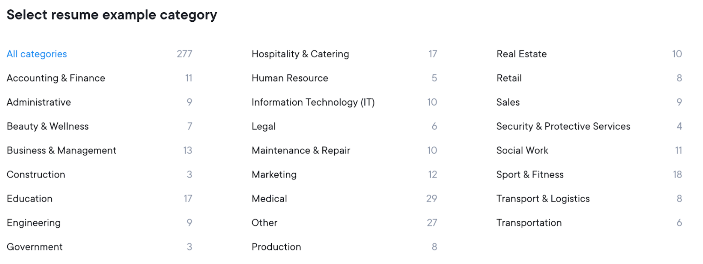

Out of 277 resume templates, 10 are focused on tech, and 3 on software development. Still, as I reviewed all these templates, none were a choice I would strongly recommend as a technical hiring manager:

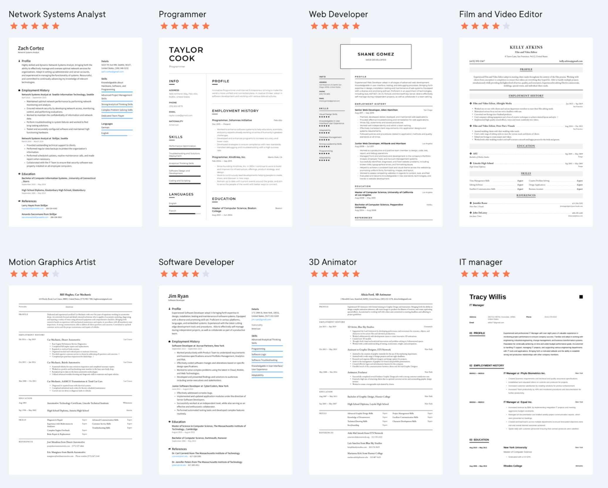

*Tech resume templates on resume.io. They look nice from afar, but aren’t great choices for developers. They almost all follow the hard to read two-column layouts and the template contents do not resemble anything in the real world.*

**Almost all resume sites use content writers to craft software developer resumes** - and these resumes are not checked with engineering managers or recruiters in tech. This shows very clearly when you look at the specific examples. Take the Programmer resume example of resume.io:

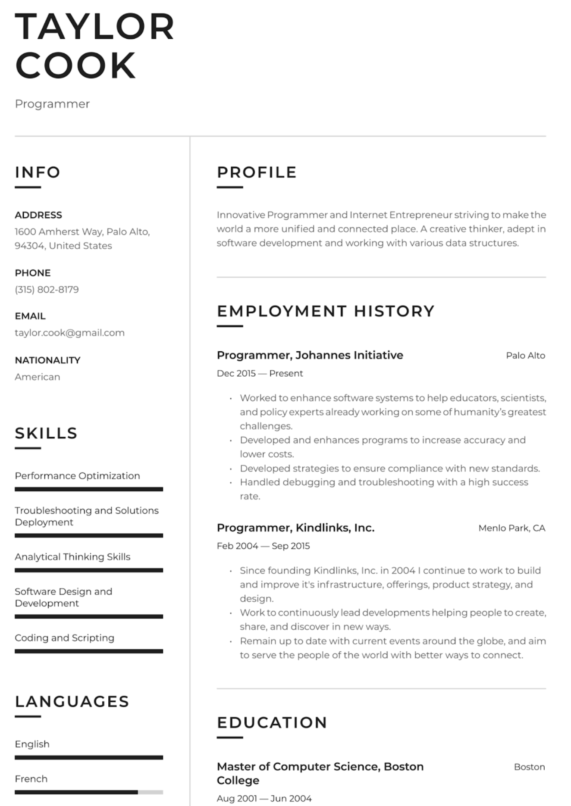

This resume template—supposedly created by professionals—has nothing to do with a software developer resume. It doesn’t have a single programming language listed. Yet it has spoken languages on the template. The skills section doesn’t even pass the buzzword bingo. And the template, with its two-column layout, is a poor choice for the resume.

**The criteria of a decent resume generator site** should be this:

- **Resume templates optimized for hiring managers**. Are the templates created with the actual audience and easy readability in mind?

- **Testimonials from real hiring managers**. While many resume generators and resume services claim that they’ll help you score more callbacks, I would expect any paid solution to back this up with real hiring managers or recruiters in their industry.

- **Real, successful resume examples**. Similar to testimonials from hiring managers, you should be vary of paying up, if a site doesn’t showcase real—even if anonymized—resume examples that got people hired.

- **For paid services: clear pricing and value proposition.** Several resume sites have “bait pricing” where they advertise as free, then follow dark patterns to charge. Some have unclear pricing tiers. If and when you pay, the value proposition should be clear. What do you get for your money, beyond a PDF resume?

- **Not quoting ATS myths and other false facts**. You can identify resume sites that try to sell resume templates and services without industry expertise. These sites typically quote things like "75% of resumes are never seen by humans" and other [ATS Myths](./05-p1-c2-the-hiring-pipeline.md#ats-myths-busted) in order to upsell their service.

I’ve searched extensively among resume generator sites, and most do not satisfy these requirements for software developer resumes. In my search, I’ve uncovered one that does so: [Standard Resume](http://pragmaticurl.com/standardresume-ttr). Not surprisingly, software engineers founded this site, built it for people in tech and in collaboration with technical hiring managers.

## Standard Resume: By Developers, for Developers

[Standard Resume](http://pragmaticurl.com/standardresume-ttr) is a resume generator site that lacks all the marketing promises that every other site does. However, they have what no other site has: real resume examples of software developers and engineering managers who used their service to craft resumes that got them jobs at the likes of Dropbox, Ebay, Facebook, Amazon and many others.

This resume site was founded by a group of techies working together at a SF startup. They used the MVP of the product to apply for jobs, and got offers from Dropbox and Metalab. In building the early version of Standard Resume, they wanted to solve for problems that no other resume generator on the market had an answer for:

- **Generate both a web resume and a pdf one**. Sending over a PDF can be a hassle, especially when you are reaching out on LinkedIn. Standard Resume was built so you can send a link that renders your resume with the same layout as the PDF.

- **Track views of your (web) resume**. How can you tell if someone has read your resume? By tracking if they visited the link you sent over.

- **Import your details from LinkedIn** to your resume to make it quicker to build your CV.

I recommend using either [Standard Resume](http://pragmaticurl.com/standardresume-ttr), or one of the templates below to build your resume. While Standard Resume is a paid subscription, the biggest benefits of it are these:

- **The cleanest tech resume layouts I’ve seen**. You cannot “cram” the fonts, as UX professionals designed spacing for the resume templates. Almost everyone plays around with font sizes on templates, and the result is often a resume that feels crammed and unprofessional. I’ve had several people ask me if they can make the font size smaller on one of the other templates. With this solution, you need to worry about the content, not the design.

- **A web-only resume version** that you can send over even before formally applying for a job. If you DM people, reach out on LinkedIn, you often can’t send a PDF resume. But you can send a web link that has the same contents.

- **Web resume view tracking**, so you get a sense if someone has actually viewed the resume you shared over a link.

- **Real resume examples of real developers and engineering managers** who actually got jobs at tech companies with that resume. Almost all other resume sites fail to show real developer resume examples of people working at well-known tech companies. With Standard Resume, you can [browse real resumes](https://standardresume.co/examples) for software engineers, iOS, frontend developers, data scientists, engineering managers and other professions who have successfully used the service.

It should be of little surprise that almost all Standard Resume templates are single-column and all templates have a heavy focus on spacing and typography—another thing that sets it apart from other sites. As a hiring manager, all of these layouts are easy—even pleasant—to read.

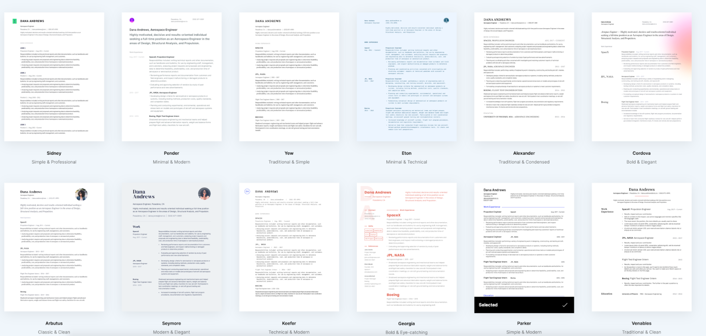

*Resume templates from Standard Resume. Note that all but one follow the top-down
template, with an easy-to-read structure and layout.*

| **From the inside out: lessons learned from the founders of Standard Resume** Riley Tomasek is a software engineer and a cofounder of Standard Resume. After users have created more than 100,000 resumes - much of this for software developers - he shares lessons he’s learned about what makes for a good resume in tech: ***“One of the most common mistakes is cramming a ton of content into a single page.** This is the number one issue I see with software engineering resumes. Removing the whitespace between paragraphs and sections makes your resume harder to scan and read. So do tiny font sizes.* ***The most important part of a resume is that it's easy to read.** If the recruiter skips your resume because it's hard to read, nothing else—including the contents of your resume—matters. Either focus on the critical parts or make it two pages.* ***Resume typography is particularly important** when applying for jobs in tech, especially for design-heavy companies. Since resumes are mostly text, typography is responsible for a large part of your resume's first impression. Take the time to get the correct line length, font sizes, line heights, etc. — or let professionals handle it.”* |

I came across Standard Resume while researching resume generator sites. I was about to close with the recommendation of *not* recommending any resume generators for tech resumes. However, the clean approach Standard Resume takes, and the easy to read templates made me change my mind. I reached out to the team, offering feedback on the resume templates, and listed things I missed from the existing ones. We collaborated and helped them create the Parker and Venables themes based on my existing resume templates. These two themes are ones that I would recommend for software engineers - and we’ll review them in this chapter.

## Template Reviews

In the second half of the chapter, we’ll review both resume templates created for the book, as well as popular resume templates. The reviews all follow this format:

- **Link** to the template or site that provides the template.

- **Rating for software developers**: assessment on how well the template follows principles for good developer templates.

- **The good**: positive highlights on the resume format. Even if you don’t use the template, you could take inspiration from the good parts.

- **The bad**: characteristics that could be a disadvantage when working with the template.

- **Ways to improve it:** ideas and suggestions on either improving or customizing the template.

Keep in mind that as most of these templates are popular, people likely had success with all of them, with the right content when applying for a position where they were a match for. The *content* of your resume is more important than the template itself.

## Recommended Resume Templates

The following resume templates are all solid—and proven—choices for software engineers and engineering managers:

- The Pragmatic Engineer’s resume template

- Standard Resume: Parker template

- The Mono Engineers’ resume template

- Markdown to PDF resume template

- The Experienced Engineer’s resume template

- Standard Resume: Venables template

- CareerCup resume template

Let’s take a closer look at each of them.

**The Pragmatic Engineer’s Resume Template**

[The Pragmatic Engineer's Resume Template](http://pragmaticurl.com/resume-template-ttr-pragmatic-engineers) is a clean template that is a good choice to use for developers.

| **Rating for software developers: ★★★★★** **The good:** - The template has many similarities to the Career Cup template, meaning US tech recruiters will find it familiar. - Good use of bolding and consistent formatting makes the resume easy to scan. - Dates and titles are *really* easy to read. - The format works both for one- and two-page resumes. - The template works well both with and without the summary section. **The bad:** - The template does not cater to people who would want to add more personal information. This can be customized, though. **Ways to improve it:** - Customize the highlight color and the fonts to your preferences. | 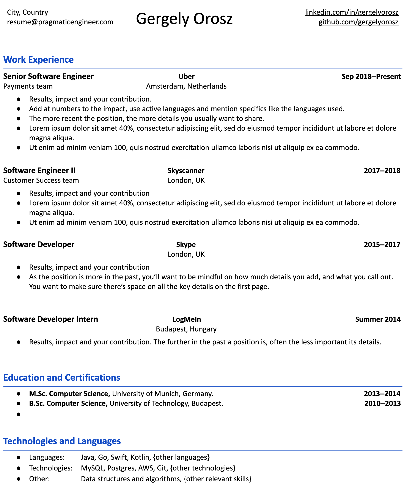 |

**Standard Resume Parker Template (Paid)**

[The Parker resume template](http://pragmaticurl.com/resume-template-ttr-standardresume-parker) from [Standard Resume](https://standardresume.co/) is the “porting” of The Pragmatic Engineer’s Resume template to this resume builder. I collaborated with the Standard Resume team in building this template. I find this template slightly more readable and better formatted than The Pragmatic Engineer’s Resume Template, thanks to the touch up from the Standard Resume design team.

| **Rating for software developers: ★★★★★** **The good:** - The template has many similarities to the Career Cup template, meaning US tech recruiters will find it familiar to scan. - Crafted by designers, with a heavy emphasis on readability and spacing. The clarity shows: I find this template easier to scan than The Pragmatic Engineer’s Resume Template. - A web version with the same layout can be shared with a link. - Web resume views are tracked by the platform. - The template works well when applying for US-companies. **The bad:** - Unlike a template, it’s harder to “cram” everything on one page. But this is by design. - Locations cannot be recorded separately for each position—I added this information to the company name field. **Ways to improve it:** - Customize the highlight colors with the Standard Resume color picker. | 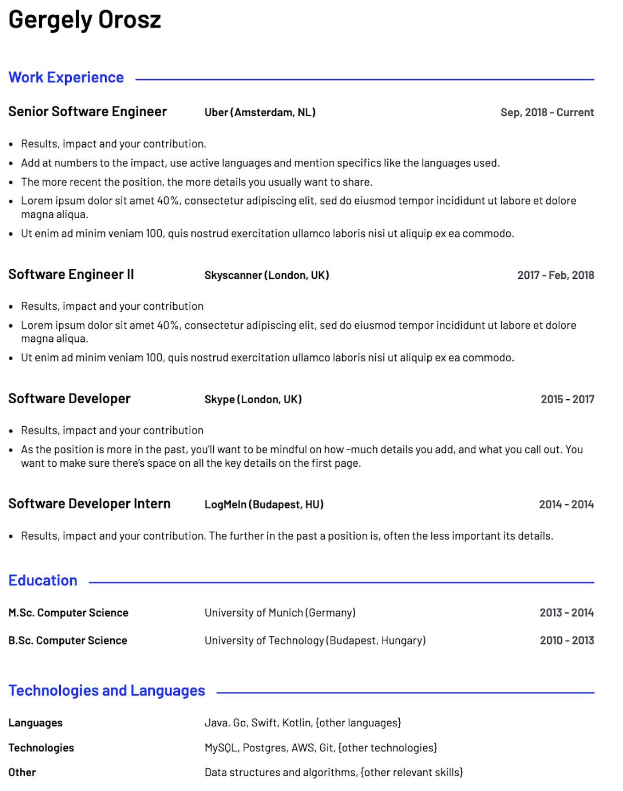 |

**The Mono Engineer’s Resume Template**

[The Mono Engineer's Resume Template](http://pragmaticurl.com/resume-template-ttr-mono-engineers) is a slight modification to the Pragmatic Engineer’s Resume template.

| **Rating for software developers: ★★★★★** **The good:** - It draws more attention to either the company or the job title. - It can be a good fit for people who either have “standout” companies and education on their resume, or for people who have companies that recruiters and hiring managers are unlikely to recognize, and thus focusing on the titles makes more sense. - The other good parts are the same as with The Pragmatic Engineer’s Resume Template. **The bad:** - Same as with The Pragmatic Engineer’s Resume Template. **Ways to improve it:** - Add a highlight color and/or adjust fonts to your preferences. | 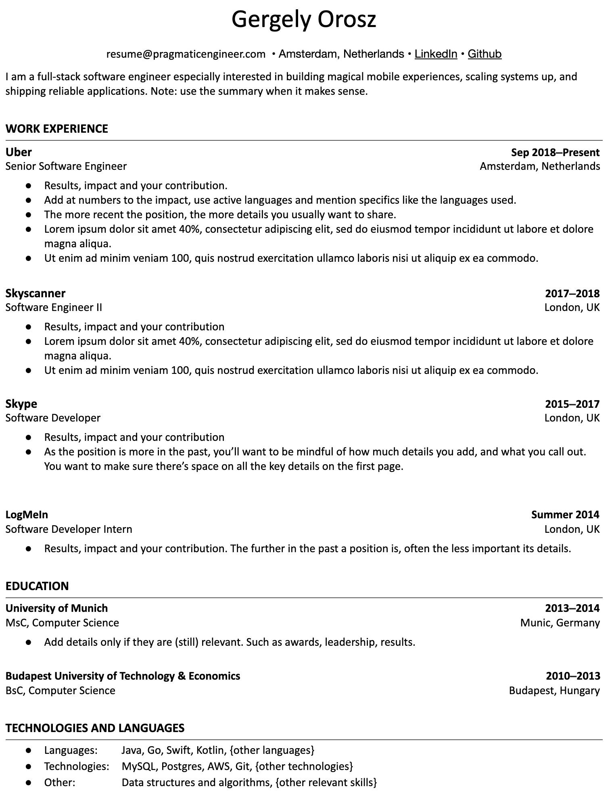 |

**Markdown to PDF Resume Template**

[Markdown to PDF resume template generator](http://pragmaticurl.com/resume-template-ttr-markdown) by Mike Lee Williams is a neat way to use Markdown as the source of truth for your resume and to store different versions on GitHub. The default style is similar to the Mono Engineer’s Resume template, and you can customize it further.

| **Rating for software developers: ★★★★★** **The good:** - A clean template. - Markdown as the data source for the resume. - Store different versions of your resume in GitHub (or another source) - You get to build your resume from the command line! **The bad:** - Same as with The Mono Engineer’s Resume Template. **Ways to improve it:** - Add a highlight color and/or adjust fonts to your preferences using the css for this template. | 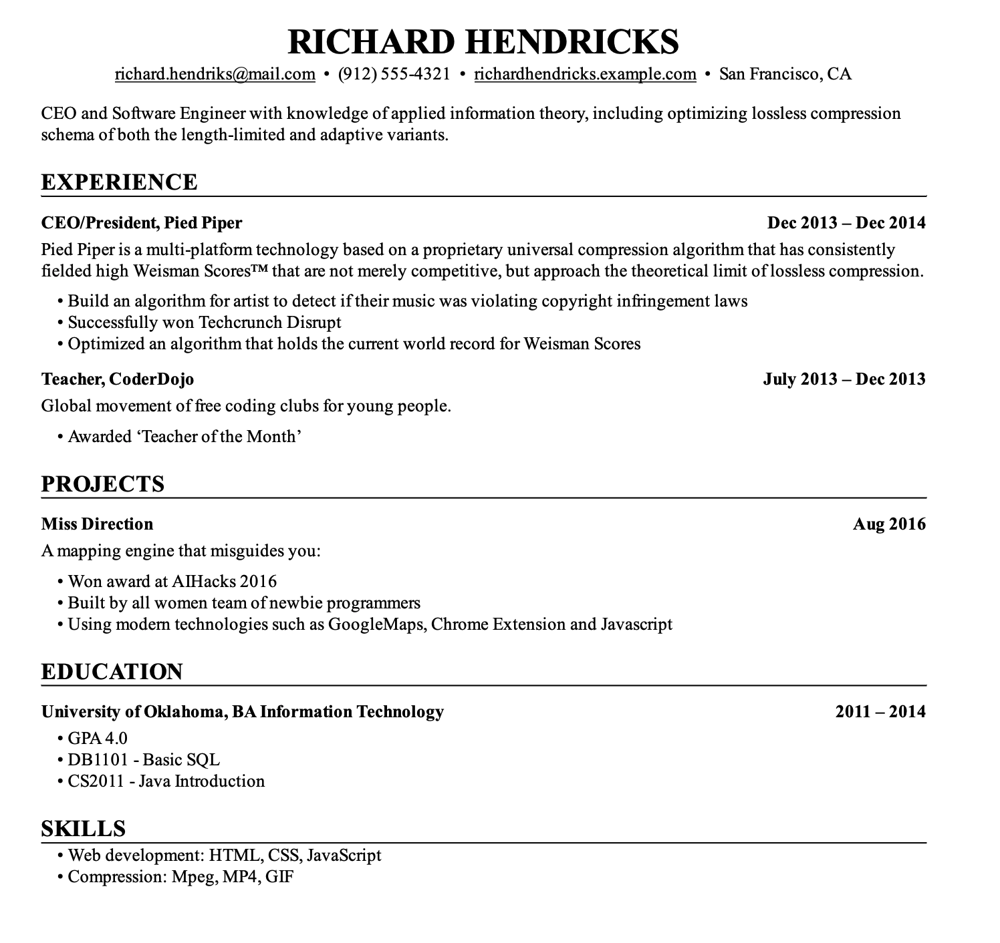 |

**The Experienced Engineer’s Resume Template**

[The Experienced Engineer's Resume Template](http://pragmaticurl.com/resume-template-ttr-experienced-engineers) is a template designed as a two-page template for experienced developers with standout experience. It works well for above senior candidates (principal, staff, distinguished engineers), people with standout companies on their resume, or for people with additional standout contributions (e.g. open source projects or contributions).

| **Rating for software developers:** - With standout experience: ★★★★★ - Without this experience: ★★★☆☆ **The good:** - Company name and title have stronger than usual attention. - Dates are easy to scan. - Links draw a lot of attention—and they do this deliberately. They are inviting the hiring manager or recruiter to click through and see strong content behind the links. **The bad:** - Leaves unused space on the left side—however, this is deliberate, to give more focus to the company names and titles. - Technologies & languages will most likely be on the second page. This is deliberate: it is meant for standout profiles where recruiters will scan the second page as well, being impressed with either company names, title, or both. - This template doesn’t work well for people with less experience or people with few standout areas. **Ways to improve it:** - Make the color scheme your own. | 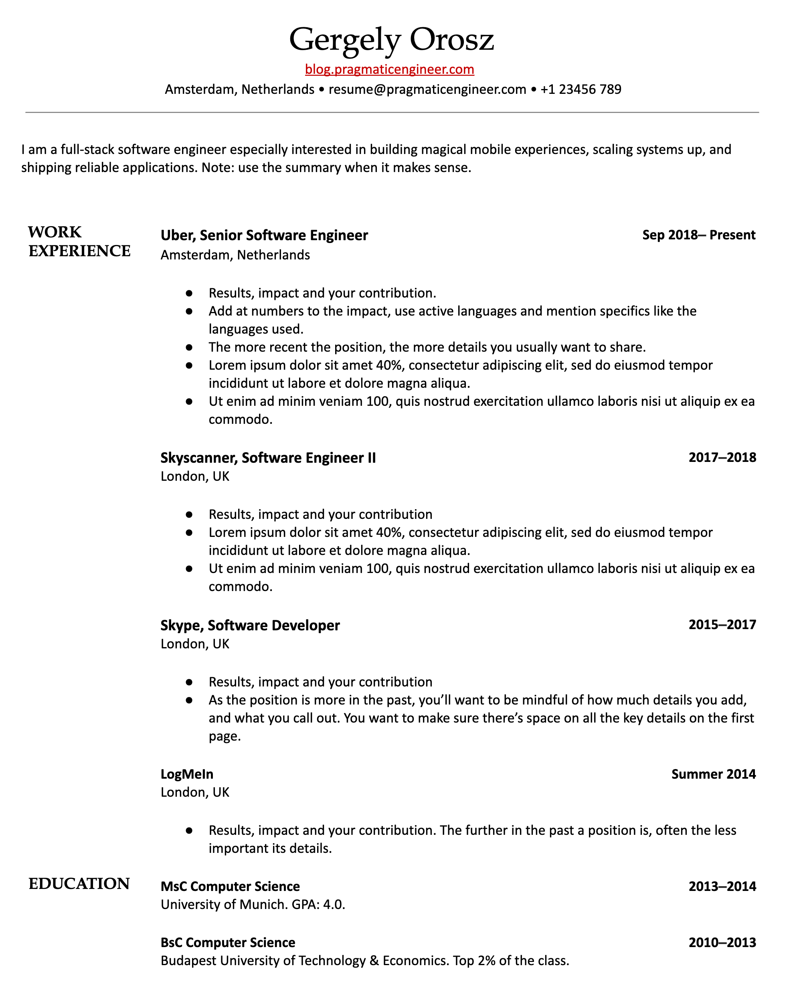 |

**Standard Resume Venables Template (Paid)**

[The Venables resume template](http://pragmaticurl.com/resume-template-ttr-venables) from [Standard Resume](https://standardresume.co/) is the “porting” of The Experienced Engineer’s Resume template to this resume builder. As with the Parker template, I also collaborated with Standard Resume in building it. I’m pleased with the result, which has better spacing than The Experienced Engineer’s Resume Template and more color customization options.

| **Rating for software developers:** - With standout experience: ★★★★★ - Without this experience: ★★★☆☆ **The good:** - Same as with the Experienced Engineer’s template. - You need to fiddle less with tables than when using the Experienced Engineer’s template, and you can’t mess up the layout of this template. - A web version with the same layout can be shared with a link. - Web resume views are tracked by the platform. **The bad:** - Locations cannot be recorded separately for each position—I added this information to the company name field. **Ways to improve it:** - Customize the highlight colors with the Standard Resume color picker. | 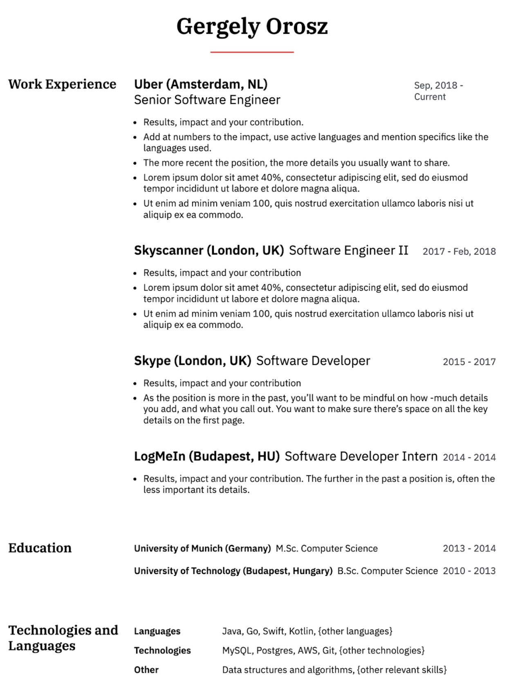 |

**CareerCup Resume Template**

The CareerCup resume template is common to see used both for Silicon Valley software engineers and people applying for tech companies in the US. The template was created by Gayle Laakmann McDowell, author of [Cracking the Coding Interview](http://pragmaticurl.com/cracking-the-coding-interview-ttr).

| **Rating for software developers: ★★★★☆** **The good:** - Tech recruiters in the US are used to it. - Consistent formatting of dates and company/school names across sections. - Dates and titles are *really* easy to read. Figuring out how much experience you have is a breeze. - The format can be used for two pages as well—just make sure the most important details that recruiters need to see are listed on the first page. **The bad:** - Dated style, using no colors. In 2014, when this template was created, resume printing was still a thing. This template has too much black-and-white. - Geared towards top tech companies in the US. For other companies and outside the US, you’ll need to tweak this. - The format incentivizes crowding content on the same page. **Ways to improve it:** - If you are applying for non-US tech companies, consider moving up the Languages and Technologies section to be on the first page. - The resume is dated in its black-and-white style. You could use colors to have headings stand out and reduce the bolding. | 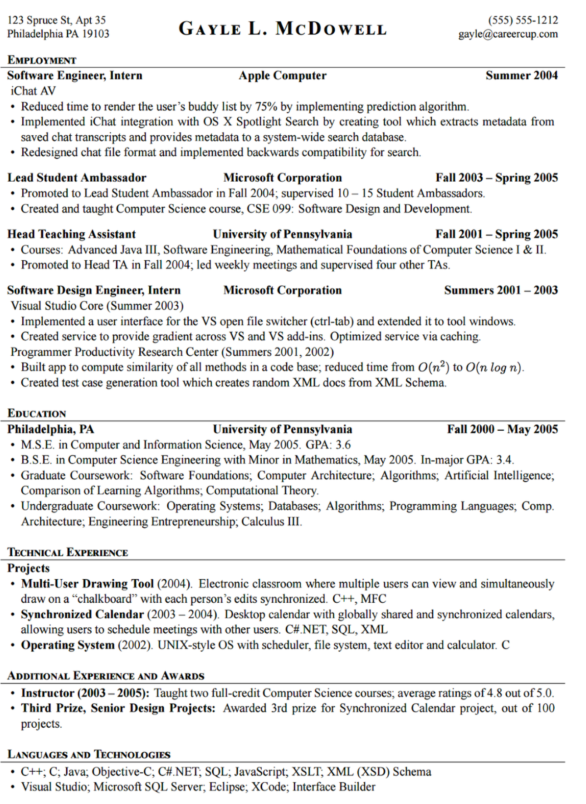 |

## Other Resume Templates

There are other resume templates that are not great choices for a developer or engineering manager resume for different reasons. We’ll look at the ones that I’ve seen most frequently used by people:

- Google Docs: Serif resume template

- Google Docs: Swiss resume template

- Canva resume templates

- Resume.io: software engineer template

- Resume.io: web developer template with skill points

- VisualCV: Standard template

- EnhanCV: software engineer template

- Europass CV

Although I hesitate to recommend these templates, they could work well enough when addressing their drawbacks, or for certain use cases. Don’t forget that the resume contents matter more than the template itself.

Let’s review the templates, analyzing both the issues, as well as their strengths.

**Google Docs Serif Resume Template**

I am not a fan of two-column resumes, as they make it hard to scan from top to bottom and they squeeze the space you can add for your experiences. However, if you go with one, the [Google Docs Serif resume](http://pragmaticurl.com/resume-template-ttr-serif) is still an okay choice. It is not specific to software development, so I would change “Skills” to “Technologies” and remove the Awards / Languages.

| **Rating for software developers: ★★★☆☆** **The good:** - Clean format and nice use of colors. - A one-page resume format. **The bad:** - It’s harder for recruiters to scan and answer the question of “how much experience do you have?” - Dates are hard to find. - You don’t have much space to write about your experience and the impact you made. - For a two-page resume with more experience, this format doesn’t work as well. - It’s not specific for tech. “Awards” and “Languages” make little sense. **Ways to improve it:** - Only use this template if you can definitely fit everything on one page. - Customize the right column and make good use of it. “Awards” are rarely relevant for tech resumes. Look at tips on improving the EnhanCV software engineer resume. | 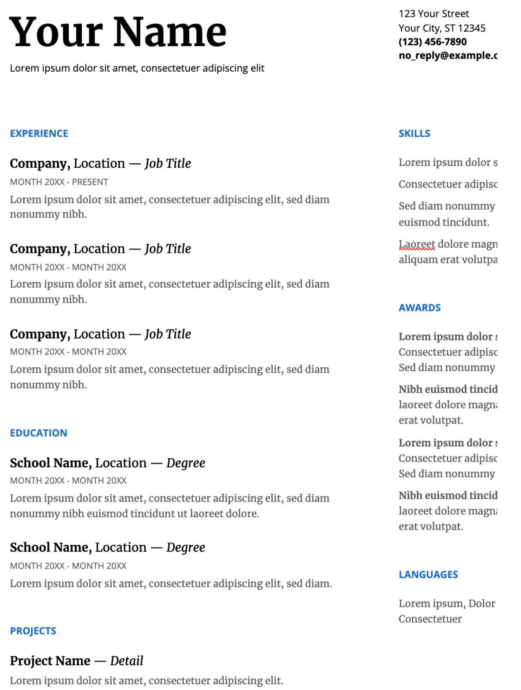 |

**Google Docs Swiss Resume Template**

While I do not recommend using the [Google Docs Swiss resume](http://pragmaticurl.com/resume-template-ttr-swiss) as is. What I like about this template is the order of the sections. Otherwise, this template is not a good choice for a software developer’s resume.

| **Rating for software developers: ★★☆☆☆** **The good:** - Order of sections: skills (technologies/languages), work experience, then education. This order works well for software engineers. **The bad:** - Lots of space wasted on the left side. - Hard for recruiters to scan the dates for your work experience and education. **Ways to improve it:** - I advise not to use this template for software engineering positions. - For experienced engineers, consider using the Experienced Engineer’s Template or Standard Resume Venables template. Both offer a similar layout but better formatting. | 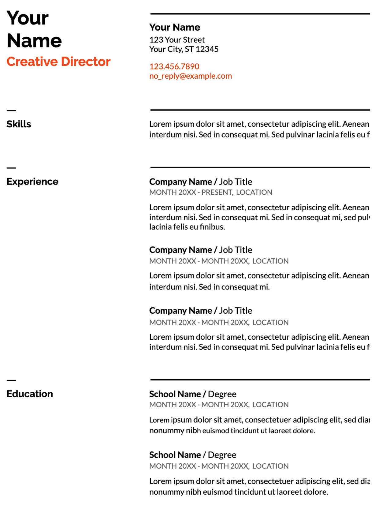 |

**Canva Resume Templates (Paid)**

If you have a subscription to [Canva Pro](http://pragmaticurl.com/canvapro-ttr), you have the option of using hundreds of resume templates, included in the subscription. I’ve done many of the illustrations in this book [with Canva](http://pragmaticurl.com/canvapro-ttr), and Canva is gaining more and more popularity, thanks to a good price-for-value monthly pricing.

| **Rating for software developers: From ★☆☆☆☆ to ★★★☆☆** **The good:** - Probably the largest selection of resume templates in one place. - If you are a Canva subscriber, it’s worth checking out the selection. **The bad:** - The selection for templates is overwhelming and it’s hard to narrow down to ones that work for tech. - Most resume templates are optimized for looks over content. - Many templates come with photos: something you’ll want to avoid. **Ways to improve it:** - There are decent templates with Canva: you just need to search more. Look for single-column ones that have clear formatting. | 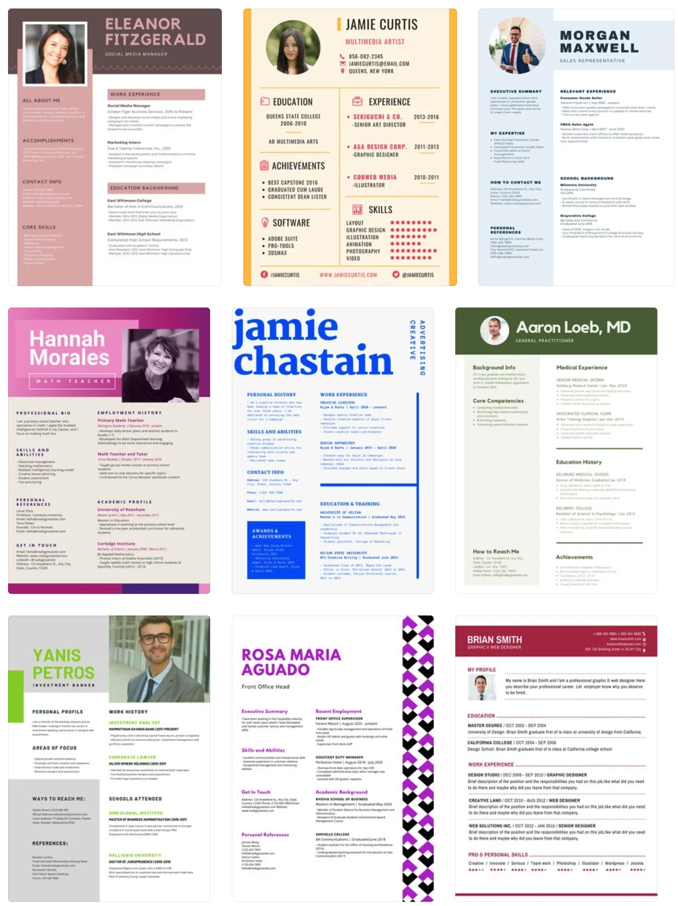 |

**Resume.io Software Engineer Template (Paid)**

The [Software Developer Resume template](https://resume.io/resume-examples/software-developer) by resume.io is similar in style to the [Google Docs Serif resume](http://pragmaticurl.com/resume-template-ttr-serif) and it comes with the same issues as that one.

| **Rating for software developers: ★★☆☆☆** **The good:** - A one-page resume. **The bad:** - The two-column layout limits the details you can share for your work experience. - This resume breaks most guidelines in this guide. It does not have a Language and Technologies section—yet it has the unnecessary references section. - The “Skills” and the blue line under them add noise for no reason. - The “Skills” listed on this resume have nothing to with skills hiring managers and recruiters look for at tech companies. - The example resume copy is a poor example for a software engineer and seems to have been written by someone who has not worked in software. **Ways to improve it:** - I advise not to use this template for software engineering positions. | 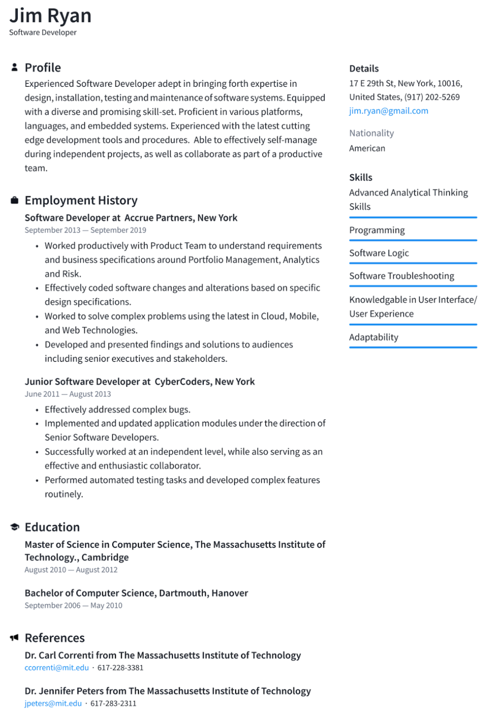 |

**Skills Points and the Resume.io Web Developer Template (Paid)**

The [Web Developer Resume template](https://resume.io/resume-examples/web-developer) by resume.io is worth calling out for the pointed skills section—and why following skills scoring is not a great idea.

| **Rating for software developers: ★★☆☆☆** **The good:** - A one-page resume. **The bad:** - The two-column layout limits the details you can share for your work experience. - Note how the two columns are swapped from the previous resume.io template. You might ask yourself: why? It is a great question: there seems to be little consistency in resume template principles for many of the resume generator sites. **Ways to improve it:** - I advise to not use this template for software engineering positions. | 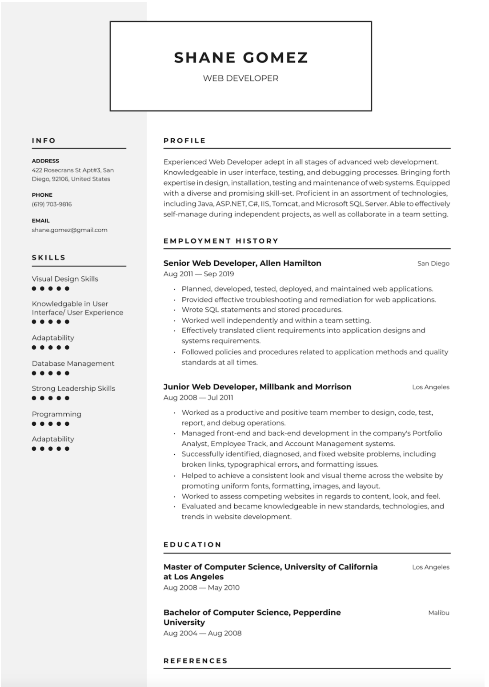 |

**On the points system**

| This resume template is an example of using the points system to “score” how strong you are in certain areas. However, here’s why this approach doesn’t work well: - Anything you score yourself 3 points or lower out of 5 should likely not be on your resume. Why would you mention a technology in which you rate yourself at a low score? - Anything mentioned as 4 or 5 stars is a given, without the star system as well. Recruiters and hiring managers will assume you are proficient with anything you list on your resume. Why else would you mention it? - Your rating will likely be off anyway. I have seen people rate themselves as 5 stars on a language in which they seemed to not know things that I thought were basics. I’ve also had someone rate themselves 2 stars on a framework that they turned out to be solid at. People aren’t as good at rating themselves as they think they are—and experienced recruiters and hiring managers are very much aware of this. | 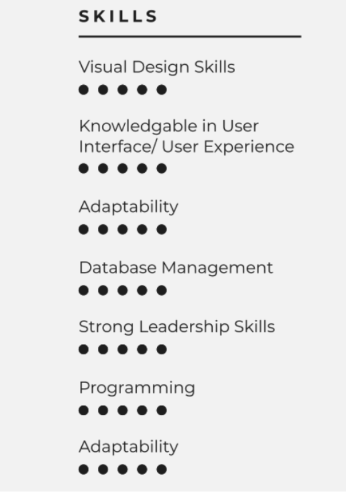 |

Similar to how a profile photo won’t help your resume, star ratings can only work against you. Drop the ratings and keep all technologies relevant for the position that you are proficient with.

**VisualCV Standard Template (Paid)**

The [VisualCV standard template](https://www.visualcv.com/cv-templates/standard/) shares a lot of the good with the CareerCup resume. It’s a solid alternative to that one—except for the fact that you have to pay to have the VisualCV branding removed.

| **Rating for software developers: ★★★☆☆** **The good:** - Clean format and nice use of colors. - A resume format that works well for two-page resumes. - Highlights your job titles while still making dates easy to read. - Clear separation of sections. **The bad:** - Black-and-white, not much use of colors. - When using the free service, a logo is added to the resume, which makes your resume look cheap. **Ways to improve it:** - Add a “Technologies and Languages” section or something similar on the first page. - Make the summary short. You could also just drop the name “Summary”. - Drop the title “Software Engineer”. It’s obvious and takes up space. - Consider jazzing up the headers and separators with colors. | 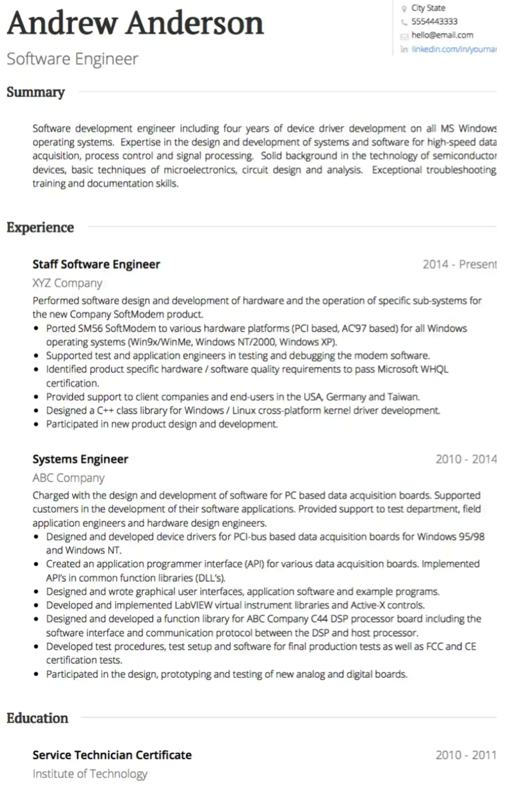 |

**EnhanCV Software Engineer Resume (Paid)**

I do not recommend the EnhanCV [Software Engineer resume](https://enhancv.com/resume-examples/software-engineer/) and am listing it here to showcase the dangers of resume sites that create resumes that job seekers find pretty. I listed this format as a cautionary example.

| **Rating for software developers: ★★☆☆☆** **The good:** - Looks stunning—as a candidate, when you are looking at your own resume. **The bad:** - Technical hiring managers and recruiters won’t appreciate the format as it’s hard to scan. - Encourages adding a photo—which leads to bias. - Some sections make little sense. Life Philosophy adds little content. - A two-column structure that makes it hard to scan for recruiters, and discourages adding sufficient details for your experience. **Ways to improve it:** - Do not add a photo. - Power Skills are something you probably don’t want on your CV: they’re empty buzzwords. - Only use this template if you can definitely fit everything on one page. - Customize the right column and try to make good use of it. I’d remove “Life Philosophy”, rename Toolbox to “Skills” and have a “Languages” and a “Technologies” section. | 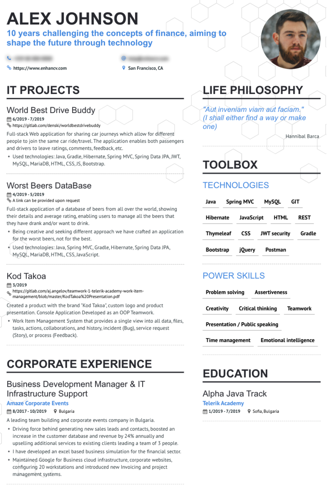 |

**EuroPass CV**

Avoid this CV template in applying for tech jobs. The biggest sin of this format is encouraging adding all the details that lead to biases: photos, birth dates, gender, and so on. The Europass format is also *not* required to apply to jobs in Europe—contrary to what some people incorrectly assume.

**Every tech recruiter I’ve spoken with advised to not use this format** - and I advise the same. The Europass format was created by a working group within the European Commission. Though I could not confirm this officially, several recruiters mentioned hearing that there was no recruiter, HR specialist or job seeker in this committee.

| **Rating for software developers: ★☆☆☆☆** **The good:** - There is nothing good about the EuroPass format. **The bad:** - Encourages adding all the details that lead to biases: photos, birth dates, gender, and so on. - Dated format that uses tables. - Represents tech professions poorly - Unnecessarily wastes space - Adds details that are noise like spoken languages or driving licenses **Ways to improve it:** - Do not use this template for any positions—software engineering or not. | 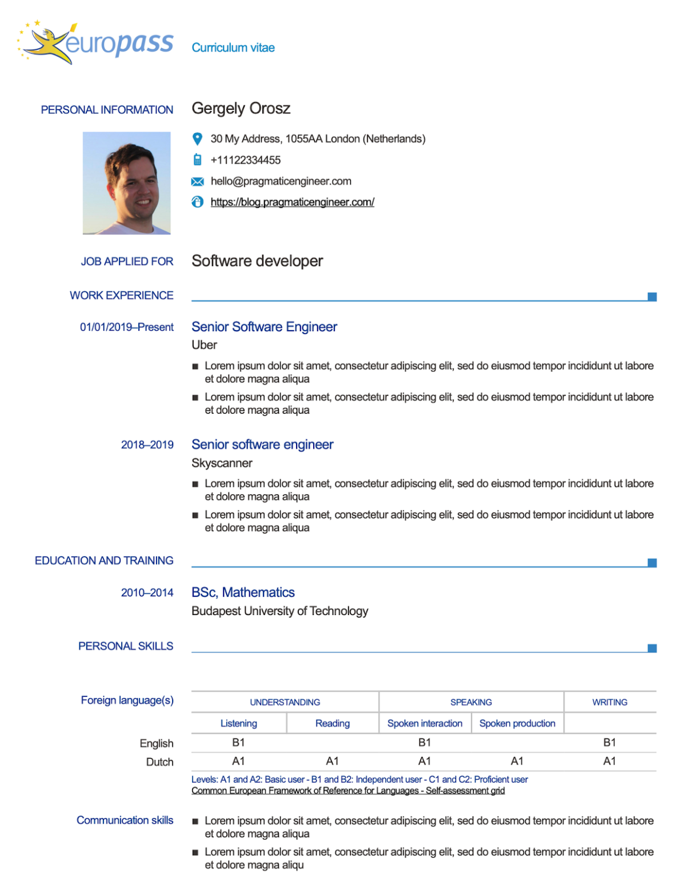 |