# Chapter 12: Resume Improvement Examples

This section is a collection of real resumes that you can use as inspiration when writing yours. Remember that your resume should be about *your* experience, tailored for the *specific* position you are applying for.

I started writing this book after offering to review resumes for software developers who were looking for jobs. Having received too many requests for me to review in-depth, I started to send an early version of this book as feedback for people—this book was at 30 pages, so much shorter than it is today!

The below examples are real resumes that I received. They were often ones where the author was not receiving the type of response rate they were hoping for. You’ll read the initial analysis of the resume, then see the improved version that the author ended up using as their “master” resume.

All examples are anonymized: names of people, companies, schools, locations and dates have been altered to not allow tracking back to the original author. The other features of the resume are as they were—giving you an idea of some typical areas that you could also address with your current resume.

**Resist copying anything one-for-one from these examples.** These resumes are someone else’s experience. Use these to get inspiration, and see if your resume has similar improvement opportunities.

## Software Engineer with 2 Years Experience

The below resume is one for a person with a few years’ experience, who intended to apply for Facebook’s Rotational Engineering Program. Here is the description of the position, and the requirement details:

| **Facebook’s Rotational Engineering Program** Facebook is seeking talented full-stack Software Engineers who would like an opportunity to join our one-year Rotational Engineering Program, helping us build applications & systems that will scale the company and make the world more open and connected. The Program is designed to offer experienced engineers a one-year rotation through different Facebook engineering departments to develop engineering skills and gain meaningful experience for the rest of their career. At the end of the term, successful participants will be invited to apply for a full-time position at the company. Facebook is committed to increasing the diversity of representation among our Computer Scientists and Software Engineers. We build products to connect the world, and this means we need teams that understand and reflect a broad range of experiences, backgrounds, identities, abilities and many other characteristics. The rotational engineering program is open to all qualified candidates. We strongly encourage candidates who are members of historically underrepresented groups and have non-traditional career paths to apply, including, but not limited to candidates from non-tech industries, candidates without Computer Science degrees who are self-taught, candidates starting second careers, re-entering the workforce, and those who have attended bootcamp-style programming courses. **Rotational Software Engineer Responsibilities** - Full-stack product/systems development with a variety of languages such as C++, Java, PHP, JavaScript, etc. - Work closely with product management and UX design teams to define and refine feature specifications. - Design and develop front-end interfaces, underlying APIs, and backend systems across a number of programming languages with focus on JavaScript, React and PHP (Hack). - Learn, learn and learn. **Minimum Qualifications** - 2+ years experience building software solutions in a corporate or startup engineering environment, or equivalent, using JavaScript, PHP, Python, Ruby, C++ and/or Java. - 2+ years experience developing web applications. **Preferred Qualifications** - Bachelor's degree in Computer Science/Math/Engineering, or equivalent educational experience. - Working knowledge of relational and non-relational databases and SQL. - Working knowledge of API design and distributed backend systems. - 2+ years’ experience developing multi-tiered web apps. |

**The original resume**

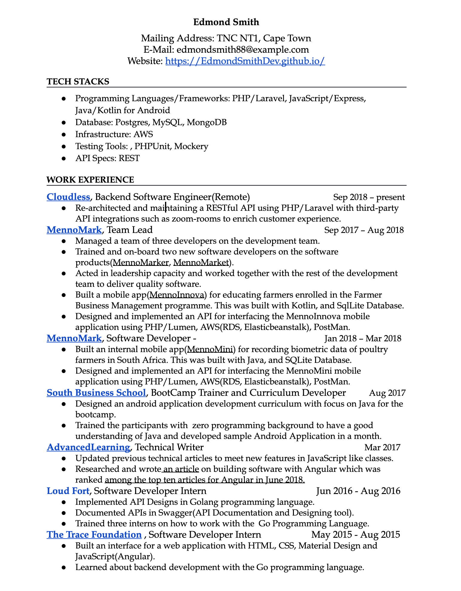

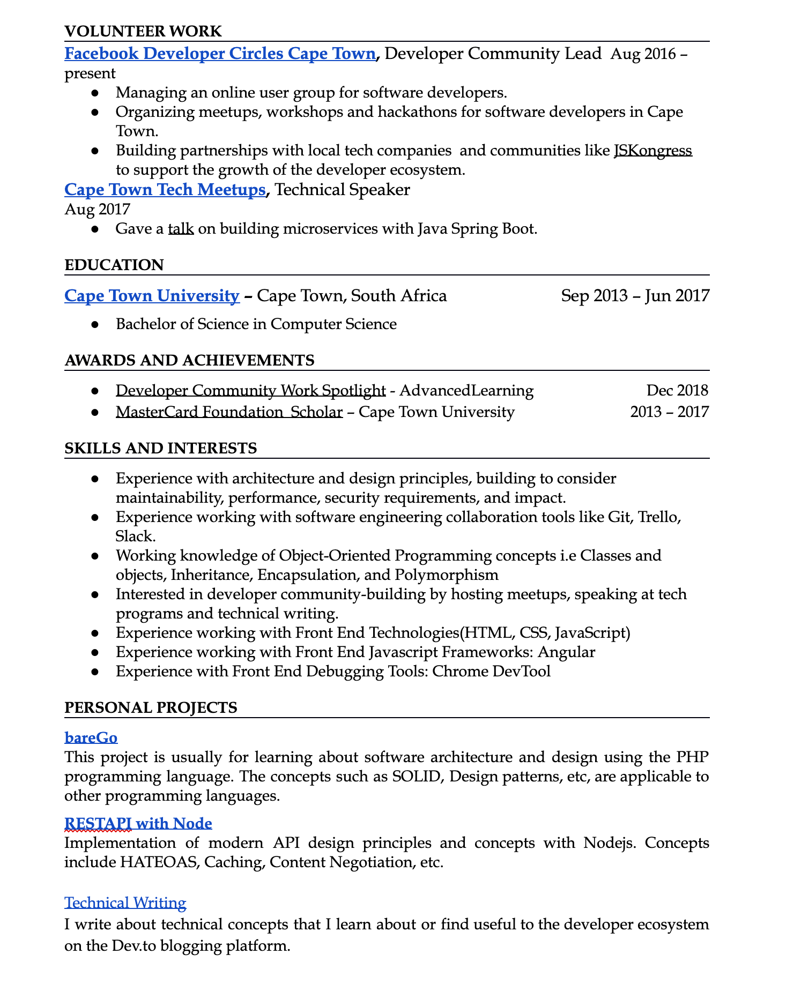

**Analysis of the resume**

Overall, this is not a bad resume—but there are many improvements that could make it a much stronger one for this position.

**The good**

- **Key details on the first page**. Languages & technologies, as well as work experience, are listed on the first page.

- **Good amount of personal details**. This resume doesn’t share too many unnecessary personal details.

- **A decent template and usage of bullet points**. The template helps with good usage of space, and bullet points make it easy to read the statements.

**Improvement areas**

- **Overly generous spacing.** The margins on the sides of the resume were unusually large—reducing the space of what would fit on each of the pages. While good spacing can benefit resumes, there is no reason to have very large spacing on the top and the side.

- **Consistency**. Formatting is not consistent, and it brings a sloppy feel for the resume. Font sizes and alignment are different in different sections.

- **Drawing focus to the wrong thing.** This resume has many links—the person linked to all their previous companies. When glancing at the resume, the recruiter’s attention is immediately drawn to the names of companies. However, it would be smarter to draw attention to the title of the engineer and the date. A different template could help with this, as would toning down link colors.

- **The impact of the work**. Within the work experience, there could be more specific impact mentioned about the person's work. There are some specifics, but there are also a lot of phrases like “Built a mobile app”, without explaining what was impactful, challenging or interesting about it.

- **Linking to company websites**. The links to company websites drew attention but brought little value. If a recruiter or hiring manager wants to look up the company, they can do so without a link, just by searching for the company name. Besides, the company landing page does not convey much relevant information.

- **Splitting out a 3-month position at MennoMark**. This person got promoted after a few months at MennoMark. They decided to split this 3-month-long position out into separate sections. Because of how fast this promotion was, they could just ignore this short position, not mentioning it.

**The refactored resume**

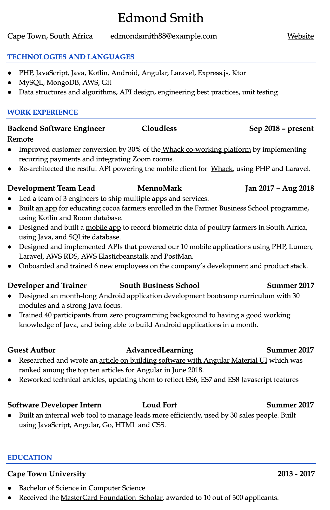

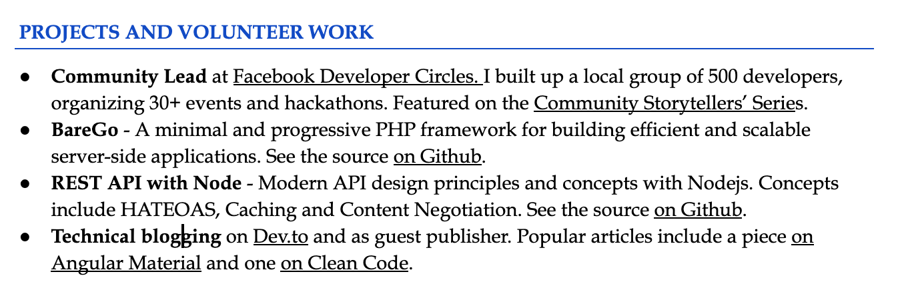

**Analysis of the refactored resume**

The refactored resume addressed most of the improvements we previously mentioned. A few things to call out with this improved resume are:

- **Tailored for the position the person is applying for**. For example, the position mentioned languages like C++, Java, PHP, JavaScript etc. As the person is hands-on with PHP and JavaScript, the resume lists these first.

- **Impact and what this person actively did comes across more clearly**. The updated resume uses active language and showcases specific examples of impact. Note how this is exactly the same person, talking about exactly the same work they have done. In the updated version, however, they have gone deeper to express how their work was important beyond just coding.

- **More concise wording, with just as much details**. The two resumes convey roughly the same amount of information. However, in the second one, much of the irrelevant or repetitive information has been cut.

- **More deliberate guiding of the reader’s focus.** In the original resume, links were scattered. Take the technical blogging section: in the original resume, this was just a link to the Dev.to page of this engineer. Now, instead of linking to a blog, this person calls out two articles they’d like the hiring manager to glance at. This is a much more focused approach.

**Ways this resume could be made even better:**

- **A short summary section** is something I’d consider adding, especially if there’s information this candidate can reflect on for the job description. For example, the job description says: *“We strongly encourage candidates who are members of historically underrepresented groups and have non-traditional career paths to apply, including, but not limited to candidates from non-tech industries, candidates without Computer Science degrees who are self-taught, candidates starting second careers to apply.”* If some of this applies to the candidate, I’d encourage them to reflect on this in this section.

- **Tailor the resume to other positions**, over using this one as a “one-size-fits-all” one.

## Machine Learning Engineer with 5 Years Experience

This resume is from a software engineer in Europe who specialized in machine learning. They were applying to companies but rarely heard back. Their original resume was a 3-pager one.

After refactoring the resume to a 1-pager one below, they saw a lot more leads, including from companies that they did not hear back from before. The person ended up landing a job at one of the companies they were targeting.

**The original resume**

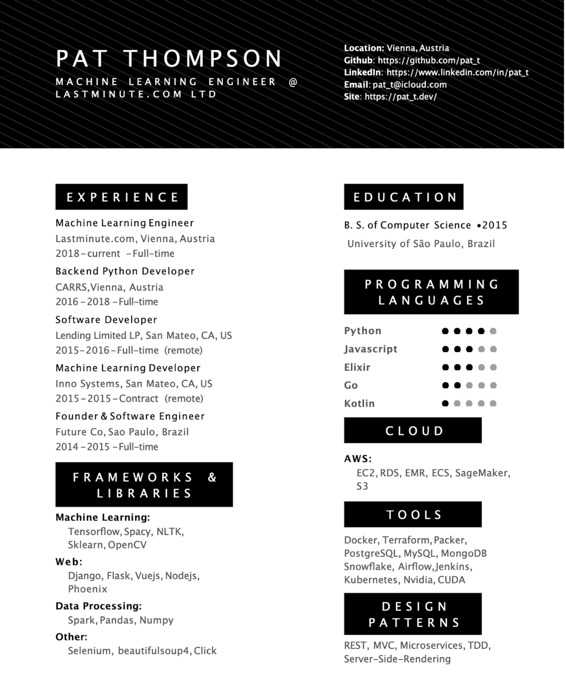

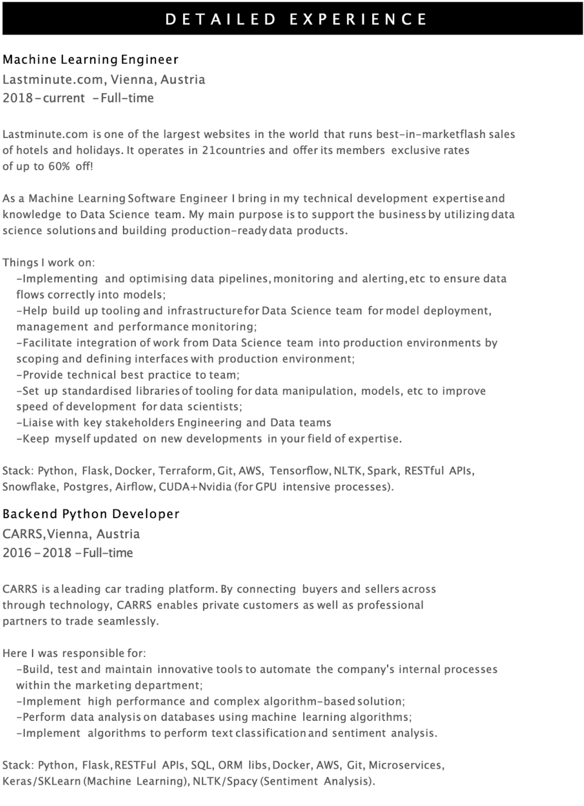

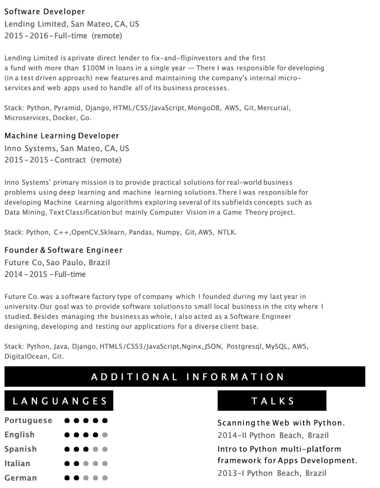

**Analysis of the resume**

The resume is an instant turn-off. The template is unnecessarily hard to read. The first page feels like it was written just to have buzzwords on it. Also, it immediately tells the story of someone who is either not a good developer or just overly modest. Why would the resume start with this person rating themselves as 4/5 on Python, 3/5 on Javascript?

**The good**

- **The second and third page** shows depth in experience. Unfortunately, most recruiters and hiring managers likely never got here, and moved this resume to the “reject” pile after scanning the first page.

**Improvement areas**

- **Use an easy to read template.** The current template makes it hard to scan the resume contents. The black headers draw attention needlessly.

- **Do not use the skills self-rating**. As discussed in the [Unnecessary Details section](./10-p2-c4-common-mistakes.md#unnecessary-details), self-rating skills proficiency can only work against you on a resume. This can be seen here, in action. As a hiring manager, I could assume this person is not a good developer, based on their own rating. If they rate their Javascript as 3/5, some hiring managers could assume they are not quite proficient—which is not at all what this person wanted to convey.

- **Talk about impact and results**, not what you were told to do. In a new field like machine learning, most companies will look for people who take the initiative and get results.

- **Convey the right type of information on the first page.** This person has a lot to build on: so do this. They should showcase the impactful work they've done, and their skills.

- **Talk more about themselves, not their companies.** For every position listed, this person writes nearly as much about the company as they do for their achievements. Drop the part on the company: they should focus on their results.

- **Use bullet points** for easier reading. Much of the resume has paragraphs that list different pieces of information. For example, the first sentence talks about the company and the second one about their achievements. After reading the first sentence, the person scanning the resume would skip to the next paragraph, assuming that a paragraph talks about the same topic.

**The refactored resume**

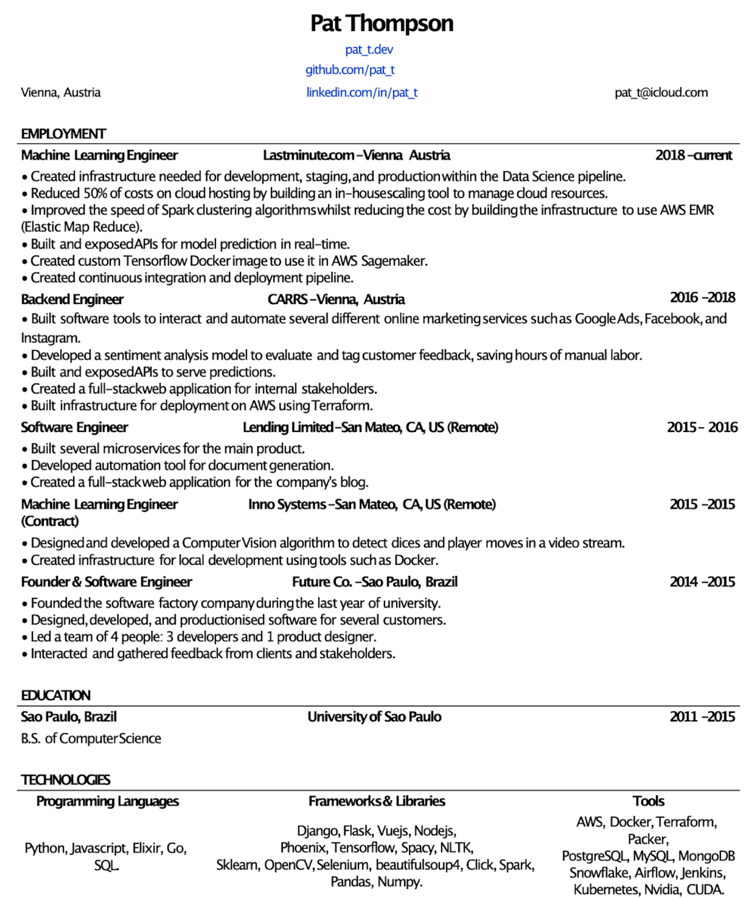

**Analysis of the refactored resume**

The difference between the original and the refactored resume is striking. The resume is down to one page, is a lot easier to read and conveys the applicant's experience much better. The person applied much of the advice in this book.

They also saw a lot more leads, including from companies that they did not hear back from before. The person ended up landing a job at one of these companies.

Still, there are a few further areas I’d suggest looking at:

- **Mention specific technologies** they worked with, in the work experience. E.g. instead of *"Created a full-stack web application for internal stakeholders"*, they could say *"Created a full-stack web application for internal stakeholders using Vue,js Django, deploying it on AWS."*

- **Use numbers** when describing the work experience. E.g. instead of *"Created a full-stack web application for internal stakeholders"*, list specifics like *"Designed, implemented and deployed 4 microservices for the main product. These services serve 100 RPS."*

## Backend Developer with 6 Years Experience

This example is from a backend engineer who spent a few years working at a company building payroll software. They originally intended to use their resume to apply to similar, but larger companies.

With their original resume, they were seeing far less response than they were hoping for. With the improvements, they noticed a considerably higher rate of callbacks, and ended up accepting an offer for a local startup for a senior engineer position.

**The original resume**

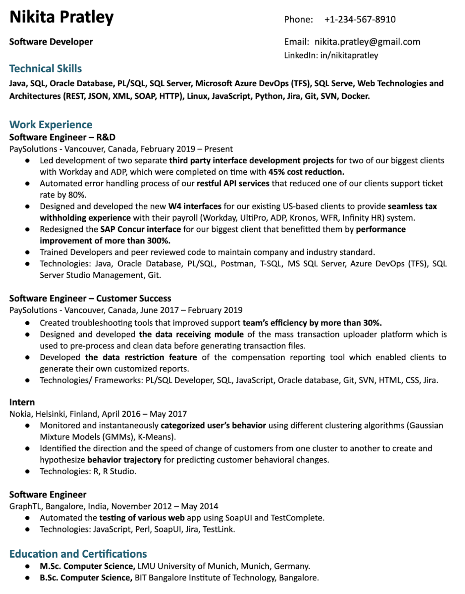

**Analysis of the resume**

This resume is a decent one to start with—however, it can be further improved.

**The good**

- **Technical skills on the top**. This person was aiming to apply for companies that hired for specific tech stacks. In this case, starting with relevant technologies is a good strategy.

- **A one-page resume**. This person had around five-six years’ experience, and they managed to fit the key parts onto one page.

- **Mentioning results and numbers**. The resume had specifics, like the percentage of reducing the client ticket support rate or performance improvements.

- **Good amount of personal details**. This resume doesn’t share too many unnecessary personal details.

- **A decent template and usage of bullet points**. The template helps with good usage of space, and bullet points make it easy to read the statements.

**Improvement areas**

- **Missing location** on the resume. When no address is listed, recruiters might assume the person is out of the country. This was not the case with this person; they were based in Vancouver, Canada. So why not list it?

- **Technologies dumped one after the other.** While it’s good to list all technologies this person is proficient with, the formatting and the order could be better. Focus on languages and frameworks that are needed for the position, or that this person wants to call out specifically.

- **Too much bolding.** Much of the bolding is distracting, and some of it makes little sense. Why are all the technical skills in bold? Why are some of the results bolded out? Why are *“W4 forms”* bolded? Though the person writing the resume probably wanted to be helpful, they draw attention to the wrong areas.

- **Could use more specifics**. Though there are specifics for some bullet points, others could use more details. Take the statement *“Created troubleshooting tools that improved support team’s efficiency by more than 30%”*. What languages or frameworks did this person use for the tools? Did they come up with an idea? Did they lead a team? How many customers used the tools?

- **Grammar**. Some of the sentences don’t read naturally: using a grammar checker would have surfaced these. Taking the previous example: *“Created troubleshooting tools that improved **the** support team’s efficiency by more than 30%”*.

- **Education dates are missing**. As a hiring manager and a recruiter, not seeing education dates is confusing. Did the person graduate? If so, why not add the dates? If they did not, why don’t they mention that they dropped out?

- **Dates could be better placed.** Moving the dates to the right side would make them much easier to scan on the first glance.

- **Docx format.** The original resume was a docx. Using PDFs is a much better choice.

**The refactored resume**

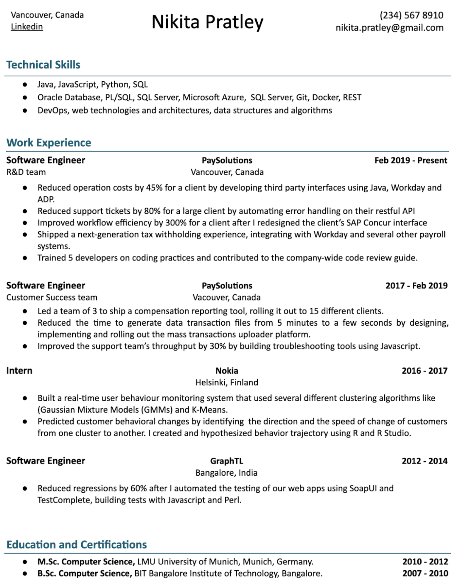

**Analysis of the refactored resume**

The refactored resume addressed all the above improvement areas, and the person ended up with more calls and an offer with a local startup. The main improvements from the original resume were:

- **Mentioning their location** as Vancouver, Canada and not omitting it, like before.

- **Languages and technologies listed more strategically** and tailored for the job they are applying for. This person was going after mostly Java-based positions. They listed programming languages first, then the technologies relevant for the job that they were proficient in.

- **An easier to scan template** with dates and positions standing out.

- **Starting with the impact of their work** in their work experiences, instead of burying this information deeper.

- **Giving more specifics** on their work experience. For example, they mentioned leading a small team, which they previously left off.

- **Dropping months from older dates**—from four or more years back. It makes the dates easier to scan. This person didn’t have a gap in their employment since 2016, and this can make scanning their resume a bit easier.

- **Adding education dates** to add more context on how long they have been doing software development.

## Remote Software Engineer With 8 Years Experience

The below resume is a 2-page CV for a senior software engineer based in Europe. This person was primarily targeting remote positions.

The candidate behind this resume struggled to get responses from international companies, even though they were a senior candidate. Following the refactor, their response rate increased dramatically, and they ended up choosing one of the multiple offers they secured.

**The original resume**

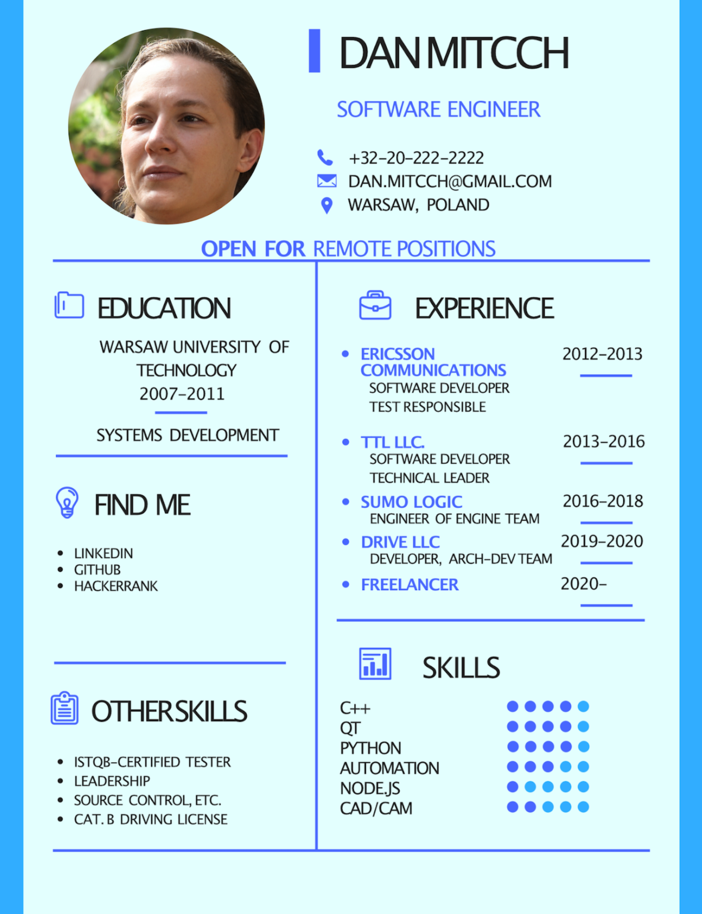

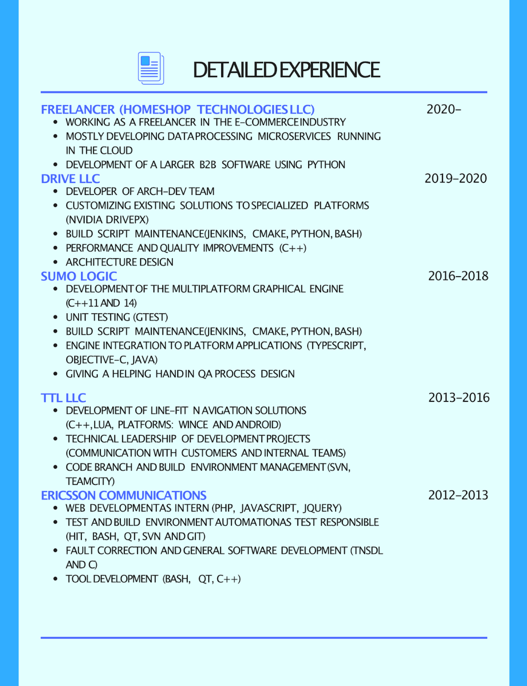

**Analysis of the resume**

I was not surprised to see that this person barely received calls from recruiters. This resume did an excellent job in breaking several unwritten CV "rules" and downplaying the candidate's experience.

**The good**

- **Not much good to say** about this resume, beyond the fact that the person behind the resume has a *lot* of experience to build on. Let’s jump instead to the biggest improvement areas.

**Improvement areas**

- **Confusing layout** that starts with education. Most recruiters would stop reading after the first page - however, the second page contains most of their “proper” experience.

- **Photo** that introduces bias. Just remove it.

- **Irrelevant skills listed**. Leadership? Cat-B driving license for a remote developer job? Remove these.

- **Skills with 1-5 points** make it seem like this person is a poor engineer. They rate themselves 4 stars at most, and one star on Node.JS. Talking to this person, they were an expert or proficient on most technologies. I advised them to remove the rating altogether.

- **Reverse chronological work experience**. On the first page, the oldest experience is listed first. This is both confusing and shows this person is unaware of resume basics.

- **Only talking about “what” they did, not the results.** The resume does not use active language, and does not do a good job describing the results this person delivered.

**The refactored resume**

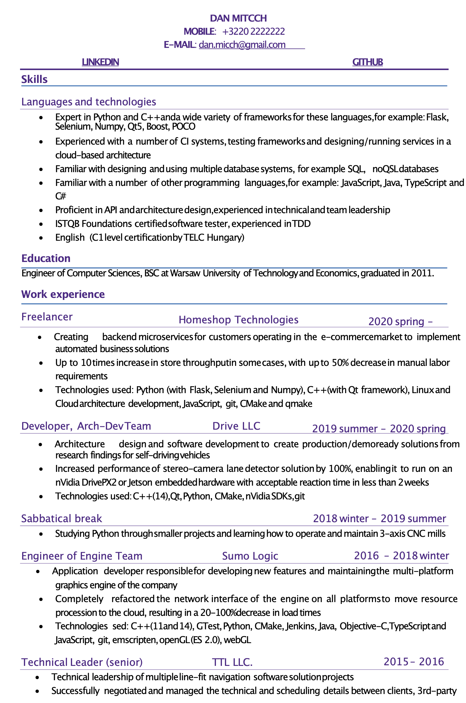

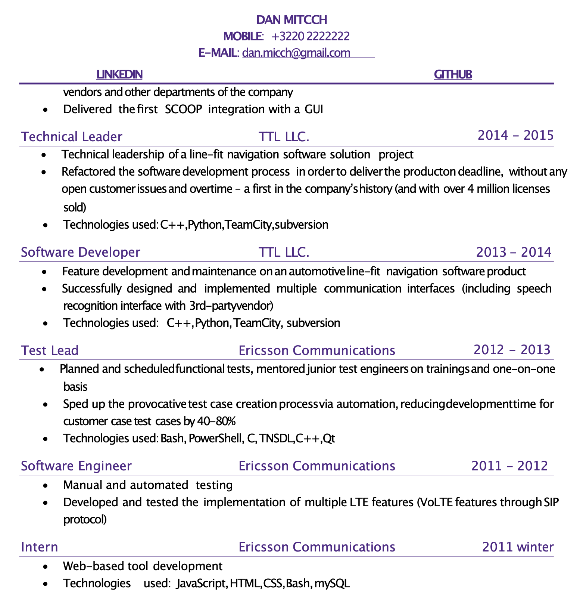

**Analysis of the refactored resume**

The refactored resume performed far better. This person heard back from companies who ignored their previous resume. They did well on multiple interviews and had several offers to choose from in a matter of weeks.

There’s always room for improvement, though, and I would still suggest the following changes to make this CV even stronger:

- **More consistent formatting** as a whole. The spacing and bullet points have a strange layout.

- **Date formatting** could be cleaner. Using seasons is fine for e.g. internships (“summer 2011), but instead of “2019 summer - 2020 spring”, “Jun 2019 - Mar 2020” reads more clear.

- **Use active language**. Instead of “Creating backend microservices…”, say “Created backend microservices…”.

- **No need to repeat the header** on the second page - it just wastes space.

- **Education**: move it further down. With a degree almost 10 years ago, this is far less relevant than their work experience.

- **Consider using a better template or a resume template service** like Standard Resume for a more professional layout. This person went alone with the template, customizing it themselves. It still feels very DIY, and resume layout is not their strength.

## SRE Engineer with 20 Years Experience

The resume is from a systems admin working in a high performance computing environment, who holds a PhD. They have been happily employed for over 10 years at their current workplace. Their original resume was just adding details of the last 10 years’ employment to the same resume they used when applying in 2010.

Following the refactor, this person saw a good amount of interest. They ended up getting and accepting an SRE offer - exactly the position they were after.

**The original resume**

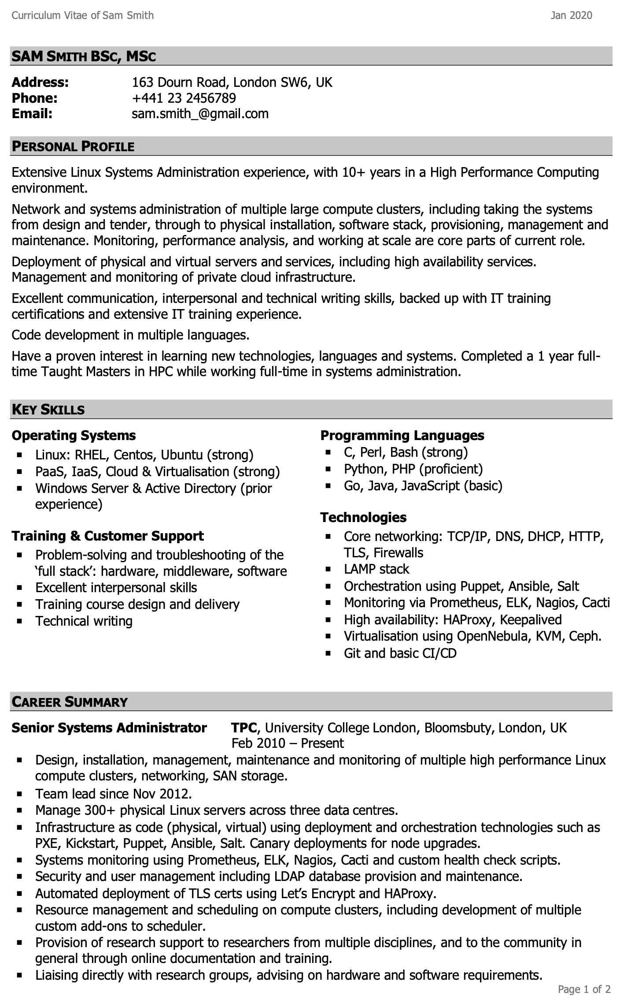

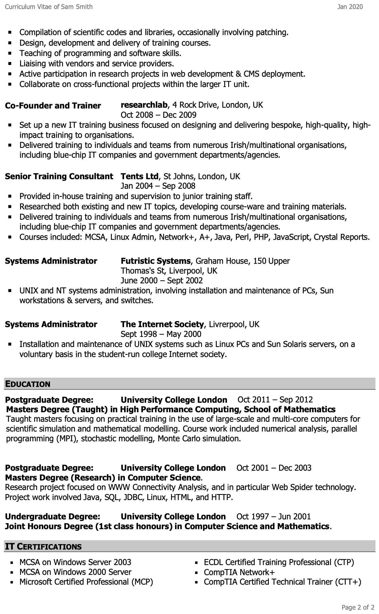

**Analysis of the resume**

This resume feels dated just by glancing at the template. Unfortunately, subconscious biases can be a thing in tech, and some hiring managers might wonder if this is a person who would keep up with technology. Having interacted with the person, I can tell you they are - but their resume does not indicate this.

**The good**

- **A very experienced candidate**. With a PhD and close to 20 years of professional experience, this candidate has a lot of things to bring to the table.

- **Lots of relevant technologies**. HAProxy, Prometheus, ELK and other technologies they’ve listed are considered close to cutting edge in 2020. This person clearly keeps up to date or works at a place that moves with the industry.

**Improvement areas**

- **Too long of an intro** with too few specifics. Trim the introduction, and talk about results.

- **Irrelevant key skills** listed on the first page. *“Excellent interpersonal skills”* misses specifics, and *“Training course design”* is not a skill that is relevant for the positions this person is applying for.

- **Ten years in a job with no career advancement**. This person had been employed in the same place since 2010. Were they promoted? Or are they the most senior person already? The resume doesn't help answer this question. It should!

- **Irrelevant older positions** listed. Senior training consultant 2004-2008 doesn’t add much to the resume, nor does the first few systems admin positions. The resume would read stronger if it emitted those: especially that this person is looking to apply for SRE positions.

- **Missing results of the work.** For an experienced candidate, it’s expected they bring results to the table. The resume doesn’t showcase these.

- **Cliches** in some of the descriptions like “excellent interpersonal skills”, “excellent communication”. Remove these, or replace them with specifics.

**The refactored resume**

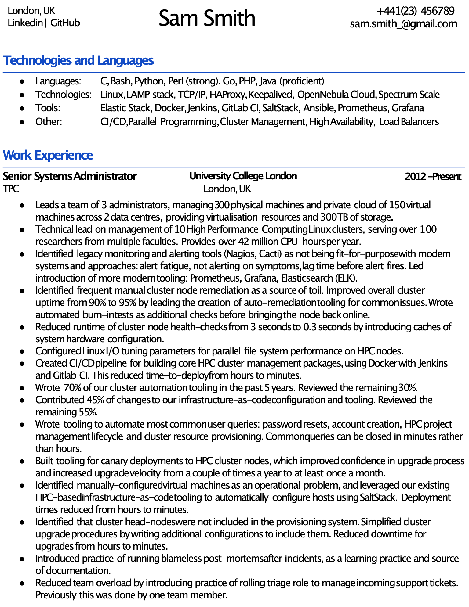

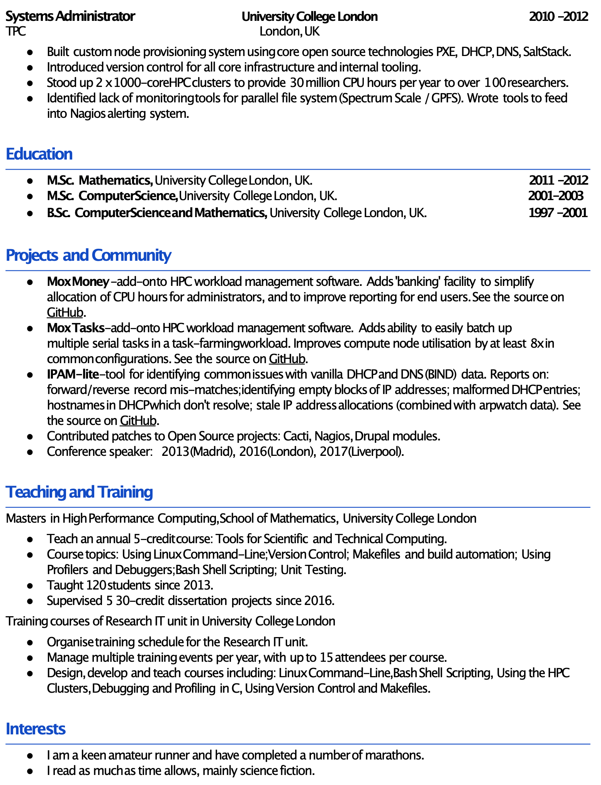

**Analysis of the refactored resume**

The refactored resume addressed all the above improvement areas:

- **An easier to read template** than before that also feels more modern.

- **Technologies and languages** jump out when starting to read the resume. It’s clear that this person has experience with many of the latest distributed computing technologies.

- **Using active language** when describing their work experience.

- **The impact and results** come across far better in the work experience section. The language used is active, and there are lots of specifics.

- **Promotion is called out** in their current position. Instead of 10 years and no promotion, the story is more clear: promotion after 2 years, and they are now leading the HPC team, likely being the most senior HPC administrator.

- **Cutting out older positions** that don’t add in helping with the job search. The resume is cleaner and more focused. And as a hiring manager, I wouldn’t really care what this person worked on before their MsC, as in the decade since then, they’ve shown solid results.

- **Projects, teaching and training add to the resume**. The projects linked are solid, with the GitHub repos linked in the resume. Both conference talks and teaching at the university close off this strong resume nicely.

As an interesting point, even the refactored resume is two pages. This works for two reasons. First, this person is applying in the UK, for more mature organizations, where the one-page resume is not that common. Second, they have enough meaningful experience to fill the pages up with Ten years of work experience does warrant a full page.

In the end, the refactor most likely helped this person stand out from the crowd, telling a much stronger story than the original resume did.

## Other Real Resume Examples

[Standard Resume](https://standardresume.co/) shares real software engineering and engineering manager resumes that you can browse for inspiration on the content, and templates that you can use with the service.

- [Software Engineer](https://standardresume.co/r/jeffleu) (Jeff Leu, eBay) and [other software engineer resumes](https://standardresume.co/examples/software-engineer)

- [Web Developer](https://standardresume.co/r/cwardzala) (Cameron Wardzala) and [other web developer resumes](https://standardresume.co/examples/web-developer)

- [iOS Developer](https://standardresume.co/r/zacwest) (Zac West, Dropbox) and [other iOS developer resumes](https://standardresume.co/examples/ios-developer)

- [Frontend Engineer](https://standardresume.co/r/heathervandervecht) (Heather Vandervecht) and [other frontend engineer resumes](https://standardresume.co/examples/front-end-developer)

- [Data Scientist](https://standardresume.co/r/philipspanoudes) (Philip Sanoudes, Square) and [other data scientist resumes](https://standardresume.co/examples/data-scientist)

- [Engineering Manager](https://standardresume.co/r/mike-douglas) (Mike Douglas) and [other engineering manager resumes](https://standardresume.co/examples/engineering-manager)