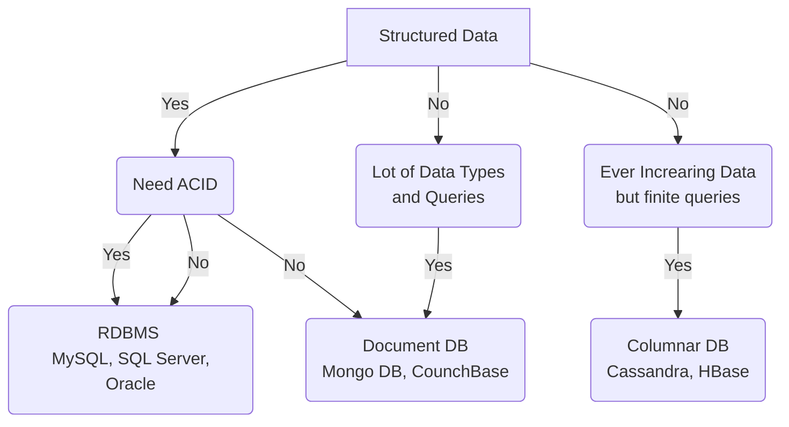

- Choice of Database doesn't impact your functional requirement
- Choice of Database depends on :
	- Structure of Data
		- Structured or Unstructured Data
	- Query Pattern
	- Amount of Scale

#### Caching
- Process of storing copies of files in a cache, or temporary storage location for quicker access
- Key could be 
	- combination of where clause 
	- Query Params of API
- Common Solution : Redis
- [Reference](https://www.cloudflare.com/learning/cdn/what-is-caching/)

#### File Storage
- Blob(Binary Large Object) Storage 
	- Type of cloud storage for unstructured data
	- Keeps masses of data in non-hierarchical storage areas called Data Lakes
	- Stores media, large file backups, and data logs
- Common Solution : Amazon S3
- [Reference](https://www.cloudflare.com/learning/cloud/what-is-blob-storage/)

#### CDN (Content Delivery Network)
- Geographically distributed servers that caches content close to end users
- [Reference](https://www.cloudflare.com/learning/cdn/what-is-a-cdn/)

#### Text Search Engine and Fuzzy or Full Text Search
- Search text inside extensive text data and return some or all results from query
- Traditional search methods that rely on simple matching of keywords
- Full text search takes account context, synonyms, and word proximity to provide more relevant results
- Common Solution : Elastic Search, Solr (Both are powered by Apache Lucene)
- [Reference](https://redis.com/glossary/full-text-search/)

#### TimeSeries DB
- Built specifically for handling metrics and events that are time-stamped
- Optimized for measuring change over time
- Stores server metrics, application performance monitoring, and other types of analytics data
- Common Solution : OpenTSDB, InfluxDB
- [Reference](https://www.influxdata.com/time-series-database/)

#### Data Warehouse and Big Data
- Data warehouse is a collection of data from different heterogeneous sources. 
	- Serves as a major part of BI in most organizations. 
	- Data is transformed, and loaded into a repository where management can derive meaningful insights
- Big data enables organizations to perform analytics on large volumes of data stored in various applications and formats
	- Characterized by volume, variety, and velocity
	- Complex for traditional DB and software to process
- [Reference 1](https://aws.amazon.com/data-warehouse/)
- [Reference 2](https://addepto.com/blog/big-data-vs-data-warehouse-key-differences/)

####  Choice of Database

- Real world scenarios can have combination of these DB