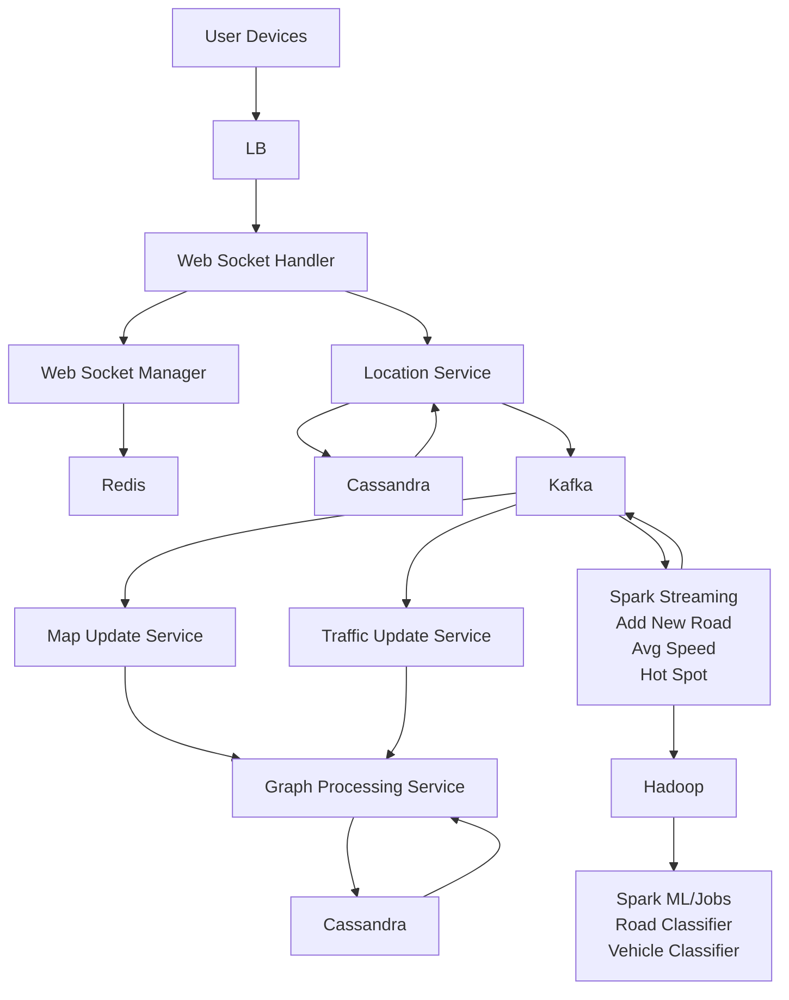
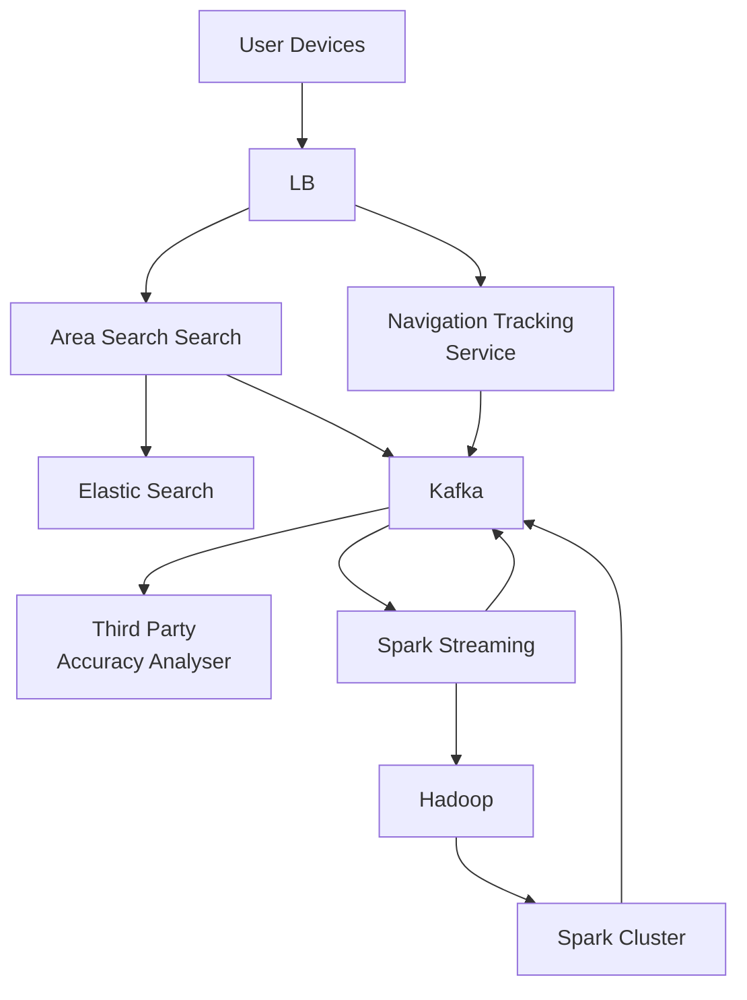
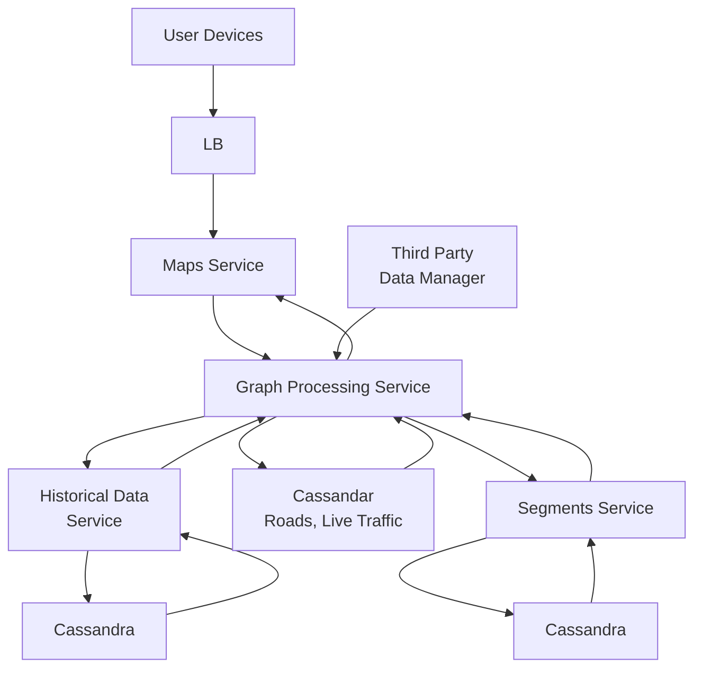

- Functional Requirement
	- Identify routes and roads user has to take
		- Consider organic data to identify new roads
	- Distance and ETA 
		- Enhance by providing multiple options and let user prioritize time or distance
	- Plug-able data like Traffic, Weather, Road Closure 

- Non Functional Requirement
	- High Availability
	- Good Accuracy 
	- Good Performance
	- Scale

- Challenges
	- Massive, Inaccurate or non existence of data
	- Not easy to Quantifying params like Traffic to calculate the ETA
	- Unpredictable scenarios like Road Closure

- Segment are grid that are applied to a certain area
	- 4 points of the square are considered identifiers 
	- Identifiers helps check if a specified coordinates lies within segment or not
	- Calculate approx. distance between 2 segments

- Model Road Network
	- Graph like 2 vertex and directional edge as road
		- Multiple weights like Distance, ETA (If infinite, then its a one way street)

- Standard Graph DS Algo to find the short path (Like Dijkstra or Bellman Ford)
- Floyd-Warshall Algo calculates shortest path between all possible edges in all possible vertexes within a segment 
	- Caching result to avoid recalculation
- If selected coordinates are on edge, then find route based on optimized difference from their identifiers to the coordinates
- Need boundary to determine no. of segments to look at 
	- Performing shortest path across globe is pointless 
- Segment has calculated exit points on all edges of segment
	- Used to enter or exit the segments when path traverses through them
- Exit points are reference points when calculating path between 2 segments
- Same applies for Mega Segments and so forth

- Weights to consider
	- Distance, ETA, Average Speed
	- Don't add traffic, Weather, Road block as weights
		- Those attributes impact speed and can be input for speed calculation
		- Organic data enables to statistically calculate traffic
		- Real time info by users using app can be valuable
	- Un-Quantifiable params can't be measured
		- But data present in real time and sources in abstract form 
		- Create multiple tier like Low, Medium and High Traffic
	- Update Cache for Segment, Mega Segment and other root Segments
	- Historical data can be utilized as cache at level of hour, day or week

- if ETA increases by x % for path present in segment, then recalculate with new params and update cache
	- This also triggers root segment to update its value as well

- Architecture

- Get regular pings from user's device every few seconds once app is installed
	- When user is stationary, interval can increase
		- Reduces load on both systems
	- More frequent pings when user is in transit to improve accuracy
- Create a persistent connection with web socket to send info back and forth
- Socket manger manages which user is talking to which user
	- Store data related to connection until its active
- Location service collects user's data like user's coordinates with timestamp
- Map and Traffic Update Service updates map using Graph processing service based on data from resp. Kafka topic
- Spark streaming service reads and updates to Kafka based on its calculation
- Spark ML job performs based on data the Hadoop owns

- Area Search service
	- fuzzy searches in Elastic Search which has <name,Lat/Long>
	- dynamically resolves the address from the analyser 
- Naviagation service
	- corrects or warns user if path is deviated
	- pushes data to Kafka for future analysis
- Map service can have multiple interfaces like one for b2c, b2b
- Kafka performs analytics like
	- verifying data from third party data manager
	- finding the next turn or exit during navigation
	- adjusting ETA and routes that user doesn't take
	- profiling user data

- Graph processing service queries data from Segment service which holds
	- segments and its details like edge coordinates
	- responsible for finding shortest path algo
- Graph processing service fetches data like Roads, Live traffic from Cassandra which is required by other services 
- Third Party Data Manager pushes data related to weather and traffic
- Historical Data Service aids by providing insights based on previous data 

- Disputed area are handled according to base of user location 